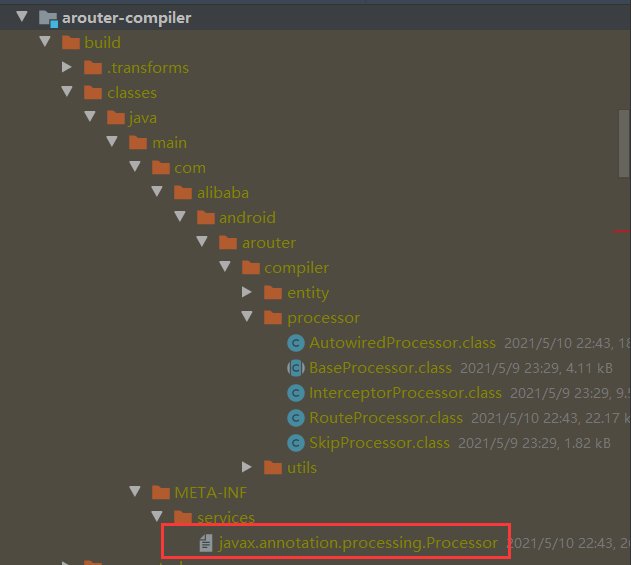
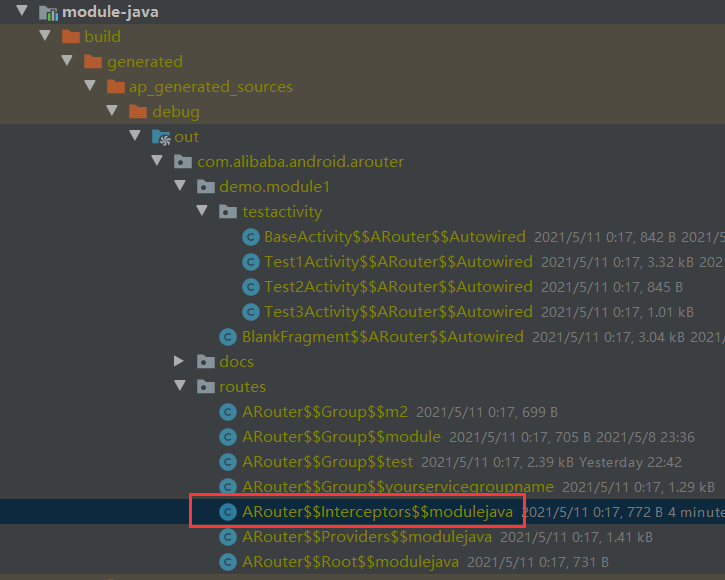

## 概述

这是讲解[Arouter](https://github.com/alibaba/ARouter)的一篇文章，从源码级别带你分析，看这篇文章前，你需要知道一点 `AbstractProcessor`处理注解的技巧。

##  InterceptorProcessor 注解

````java
@Target({ElementType.TYPE})
@Retention(RetentionPolicy.CLASS)
public @interface Interceptor {
    /**
     * 权重值，值越小权重越大
     */
    int priority();

    /**
     * The name of interceptor, may be used to generate javadoc.
     */
    String name() default "Default";
}
````

在使用path进行路由时，可以对其进行拦截，例如拦截添加额外参数等。


## 功能概述

这里讲解一个主要逻辑，想要关心具体实现的可以往下看，主要就是找到所有被 Interceptor 注解的类，生成一个类似下面这样的类，等到Arouter初始化的时候调用loadInto，这样就把值放到我们指定的 Map<Integer, Class<? extends IInterceptor>> 中了。至于拦截器什么时候调用，我们后面几篇文章再讲。

````java
public class ARouter$$Interceptors$$modulejava implements IInterceptorGroup {
  @Override
  public void loadInto(Map<Integer, Class<? extends IInterceptor>> interceptors) {
    interceptors.put(7, Test1Interceptor.class);
    interceptors.put(90, TestInterceptor90.class);
  }
}
````


## 功能详情

```java
@AutoService(Processor.class)
```

这是google的auto-service-annotation，主要就是帮助我们生成` META-INF/services/javax.annotation.processing.Processor`文件，要不然这东西就要自己手动写了。



```java
@SupportedAnnotationTypes(ANNOTATION_TYPE_INTECEPTOR)
```

ANNOTATION_TYPE_INTECEPTOR 的值就是 com.alibaba.android.arouter.facade.annotation.Interceptor，表示需要处理的注解类型

之前的写法是下面这样的

```java
@Override
public Set<String> getSupportedAnnotationTypes() {
    return super.getSupportedAnnotationTypes();
}
```

从1.6之后可以使用注解了，给你看看super的调用，实际商还是获取 SupportedAnnotationTypes 注解，大家以后使用注解就可以了。

```java
public Set<String> getSupportedAnnotationTypes() {
        SupportedAnnotationTypes sat = this.getClass().getAnnotation(SupportedAnnotationTypes.class);
        if  (sat == null) {
            if (isInitialized())
                processingEnv.getMessager().printMessage(Diagnostic.Kind.WARNING,
                                                         "No SupportedAnnotationTypes annotation " +
                                                         "found on " + this.getClass().getName() +
                                                         ", returning an empty set.");
            return Collections.emptySet();
        }
        else
            return arrayToSet(sat.value());
    }
```


```java
@Override
public synchronized void init(ProcessingEnvironment processingEnv) {
    super.init(processingEnv);
    // 获取被com.alibaba.android.arouter.facade.template.IInterceptor
    iInterceptor = elementUtils.getTypeElement(Consts.IINTERCEPTOR).asType();
}
```


重点方法就是下面的 process 方法了,我们知道java语言中有包(PACKAGE)、枚举(ENUM)、类(CLASS,不是枚举类)、注解(ANNOTATION_TYPE)、接口(INTERFACE)、字段(FIELD)、方法或者构造含函数的参数(PARAMETER)、本地变量(LOCAL_VARIABLE)、方法（METHOD）、构造函数（CONSTRUCTOR）等。

这些组成了java程序，这每个种类就叫一个Element。


- Set<Modifier> getModifiers()    获取该Element的修饰符（public，static等）
- ElementKind getKind()   获取该Element是哪个种类（ElementKind）
-  Name getSimpleName()  获取该Element的名称
-  Element getEnclosingElement() 如果Element是一个顶层类或者接口（TypeElement），就返回包Element（PackageElement），如果是包Element，就返回null
-   List<? extends Element> getEnclosedElements() 返回被该Element包裹的其他Element，比如类可以包含构造函数Element，字段Element，方法Element等。
-    <A extends Annotation> A getAnnotation(Class<A> annotationType) 获取该Element上指定的注解。
-    TypeMirror asType()

从Element可以获取到当前element是java语言的哪个结构，比如 int age，这个可以是一个字段（FIELD）、或者方法参数（PARAMETER），但是你怎么知道这是什么类型？是String还是int，还是long，这个时候就可以使用asType，变成 TypeMirror，通过使用getKind()方法，就知道age是一个 INT 类型。


```java
@Override
public boolean process(Set<? extends TypeElement> annotations, RoundEnvironment roundEnv) {
    if (CollectionUtils.isNotEmpty(annotations)) {
        // 先获取被 Interceptor 注解的元素
        Set<? extends Element> elements = roundEnv.getElementsAnnotatedWith(Interceptor.class);
        try {
            parseInterceptors(elements);
        } catch (Exception e) {
            logger.error(e);
        }
        return true;  // 返回true表示这个我处理了，不会交给后面的注解器处理了
    }

    return false;
}
```

```java
private void parseInterceptors(Set<? extends Element> elements) throws IOException {
    if (CollectionUtils.isNotEmpty(elements)) {

        // Verify and cache, sort incidentally.
        // 遍历每个被 Interceptor 注解的元素
        for (Element element : elements) {
        
            // 校验一下，element 必须被 Interceptor 注解过，而且必须直接实现 com.alibaba.android.arouter.facade.annotation.Interceptor 接口
            // 这里需要注意的是直接实现
            if (verify(element)) {  // Check the interceptor meta
                // 取出 Interceptor 注解的值
                Interceptor interceptor = element.getAnnotation(Interceptor.class);
                // 看来不能有2个一样权重的 Interceptor
                Element lastInterceptor = interceptors.get(interceptor.priority());
                if (null != lastInterceptor) { // Added, throw exceptions
                    throw new IllegalArgumentException(
                            String.format(Locale.getDefault(), "More than one interceptors use same priority [%d], They are [%s] and [%s].",
                                    interceptor.priority(),
                                    lastInterceptor.getSimpleName(),
                                    element.getSimpleName())
                    );
                }
				// 存起来
                interceptors.put(interceptor.priority(), element);
            } else {
                logger.error("A interceptor verify failed, its " + element.asType());
            }
        }

        // Interface of ARouter.
        // com.alibaba.android.arouter.facade.template.IInterceptor
        TypeElement type_ITollgate = elementUtils.getTypeElement(IINTERCEPTOR);
        
         // com.alibaba.android.arouter.facade.template.IInterceptorGroup
        TypeElement type_ITollgateGroup = elementUtils.getTypeElement(IINTERCEPTOR_GROUP);

        /**
         *  生成一个输入类型，后面给方法中的参数
         *
         *  ```Map<Integer, Class<? extends ITollgate>>```
         */
        ParameterizedTypeName inputMapTypeOfTollgate = ParameterizedTypeName.get(
                ClassName.get(Map.class),
                ClassName.get(Integer.class),
                ParameterizedTypeName.get(
                        ClassName.get(Class.class),
                        WildcardTypeName.subtypeOf(ClassName.get(type_ITollgate))
                )
        );

        //输入参数的名字
        ParameterSpec tollgateParamSpec = ParameterSpec.builder(inputMapTypeOfTollgate, "interceptors").build();

        //生成方法名 loadInto
        MethodSpec.Builder loadIntoMethodOfTollgateBuilder = MethodSpec.methodBuilder(METHOD_LOAD_INTO)
                .addAnnotation(Override.class)
                .addModifiers(PUBLIC)
                .addParameter(tollgateParamSpec);

        // Generate
        if (null != interceptors && interceptors.size() > 0) {
            // Build method body
            for (Map.Entry<Integer, Element> entry : interceptors.entrySet()) {
                
                loadIntoMethodOfTollgateBuilder.addStatement("interceptors.put(" + entry.getKey() + ", $T.class)", ClassName.get((TypeElement) entry.getValue()));
            }
        }

        // Write to disk(Write file even interceptors is empty.)
        // demo中的模块名称是module-java，被处理后   moduleName = moduleName.replaceAll("[^0-9a-zA-Z_]+", "");，就是  modulejava
        // 包名 com.alibaba.android.arouter.routes
        // 类名 ARouter$$Interceptors$$modulejava
        JavaFile.builder(PACKAGE_OF_GENERATE_FILE,
                TypeSpec.classBuilder(NAME_OF_INTERCEPTOR + SEPARATOR + moduleName)
                        .addModifiers(PUBLIC)
                        .addJavadoc(WARNING_TIPS)
                        .addMethod(loadIntoMethodOfTollgateBuilder.build())
                        .addSuperinterface(ClassName.get(type_ITollgateGroup))
                        .build()
        ).build().writeTo(mFiler);

        logger.info(">>> Interceptor group write over. <<<");
    }
}
```




经过注解处理器，生成文件的内容就是

```java
/**
 * DO NOT EDIT THIS FILE!!! IT WAS GENERATED BY AROUTER. */
public class ARouter$$Interceptors$$modulejava implements IInterceptorGroup {
  @Override
  public void loadInto(Map<Integer, Class<? extends IInterceptor>> interceptors) {
    interceptors.put(7, Test1Interceptor.class);
    interceptors.put(90, TestInterceptor90.class);
  }
}
```