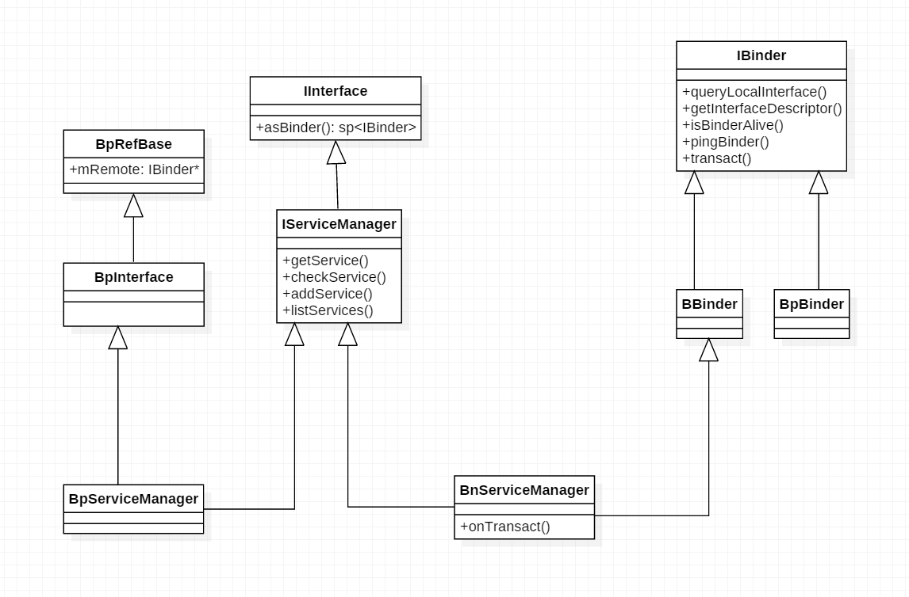

## 源码位置

```java
frameworks/base/libs/binder/ProcessState.cpp
frameworks/base/libs/binder/IServiceManager.cpp
frameworks/base/libs/binder/BpBinder.cpp
frameworks/base/libs/binder/IInterface.cpp
frameworks/base/libs/binder/Binder.cpp    
frameworks/base/libs/binder/IPCThreadState.cpp
frameworks/base/cmds/servicemanager/binder.c
frameworks/base/libs/binder/Static.cpp
frameworks/base/cmds/servicemanager/service_manager.c
frameworks/base/cmds/servicemanager/binder.c
frameworks/base/include/binder/IServiceManager.h    
frameworks/base/include/private/binder/binder_module.h
frameworks/base/media/libmediaplayerservice/MediaPlayerService.cpp
frameworks/base/media/mediaserver/main_mediaserver.cpp   
frameworks/base/include/binder/IInterface.h
```

## MediaServer为例子

*main_mediaserver.cpp*

```c++
int main(int argc, char** argv)
{
    // 获取ProcessState单例，每个进程独一份
    sp<ProcessState> proc(ProcessState::self());
    
    // 获取 IServiceManager
    sp<IServiceManager> sm = defaultServiceManager();
    LOGI("ServiceManager: %p", sm.get());
    
    // 初始化音频系统的AudioFlinger服务
    AudioFlinger::instantiate();
    
    //  MediaPlayer服务，向ServiceManager注册服务
    MediaPlayerService::instantiate();
    
    // CameraService 服务
    CameraService::instantiate();
    
    //  音频系统的AudioPolicyService服务
    AudioPolicyService::instantiate();
    
    ProcessState::self()->startThreadPool();
    
    IPCThreadState::self()->joinThreadPool();
}
```

## ProcessState

每个进程都有一份 ProcessState

```c++
sp<ProcessState> ProcessState::self()
{
    // gProcess 是Static.cpp中定义的一个全局变量
    // 程序刚开始运行，gProcess 一定为NULL
    if (gProcess != NULL) return gProcess;
    
    AutoMutex _l(gProcessMutex);
   
    // 创建一个ProcessState对象
    if (gProcess == NULL) gProcess = new ProcessState;
    return gProcess;
}
```


```c++
#define BINDER_VM_SIZE ((1*1024*1024) - (4096 *2))   // 1MB - 8KB


ProcessState::ProcessState()
    : mDriverFD(open_driver())
    , mVMStart(MAP_FAILED)
    , mManagesContexts(false)
    , mBinderContextCheckFunc(NULL)
    , mBinderContextUserData(NULL)
    , mThreadPoolStarted(false)
    , mThreadPoolSeq(1)
{
    if (mDriverFD >= 0) {
        // XXX Ideally, there should be a specific define for whether we
        // have mmap (or whether we could possibly have the kernel module
        // availabla).
#if !defined(HAVE_WIN32_IPC)
        // mmap the binder, providing a chunk of virtual address space to receive transactions.
        mVMStart = mmap(0, BINDER_VM_SIZE, PROT_READ, MAP_PRIVATE | MAP_NORESERVE, mDriverFD, 0);
        if (mVMStart == MAP_FAILED) {
            // *sigh*
            LOGE("Using /dev/binder failed: unable to mmap transaction memory.\n");
            close(mDriverFD);
            mDriverFD = -1;
        }
#else
        mDriverFD = -1;
#endif
    }
    if (mDriverFD < 0) {
        // Need to run without the driver, starting our own thread pool.
    }
}
```


打开/dev/binder 设备，告诉Binder驱动,最大支持的线程数

```c++
static int open_driver()
{
    if (gSingleProcess) {
        return -1;
    }

    int fd = open("/dev/binder", O_RDWR); // 打开 /dev/binder 设备
    if (fd >= 0) {
        fcntl(fd, F_SETFD, FD_CLOEXEC);
        int vers;
#if defined(HAVE_ANDROID_OS)
        status_t result = ioctl(fd, BINDER_VERSION, &vers);
#else
        status_t result = -1;
        errno = EPERM;
#endif
        if (result == -1) {
            LOGE("Binder ioctl to obtain version failed: %s", strerror(errno));
            close(fd);
            fd = -1;
        }
        if (result != 0 || vers != BINDER_CURRENT_PROTOCOL_VERSION) {
            LOGE("Binder driver protocol does not match user space protocol!");
            close(fd);
            fd = -1;
        }
#if defined(HAVE_ANDROID_OS)
        size_t maxThreads = 15;  // 告诉Binder驱动，这个fd最大支持15个线程
        result = ioctl(fd, BINDER_SET_MAX_THREADS, &maxThreads);
        if (result == -1) {
            LOGE("Binder ioctl to set max threads failed: %s", strerror(errno));
        }
#endif
        
    } else {
        LOGW("Opening '/dev/binder' failed: %s\n", strerror(errno));
    }
    return fd;
}
```

## defaultServiceManager

一个单例，重点是 interface_cast 

*IServiceManager.cpp*

```c++
sp<IServiceManager> defaultServiceManager()
{
    if (gDefaultServiceManager != NULL) return gDefaultServiceManager;
   
    {
        AutoMutex _l(gDefaultServiceManagerLock);
        if (gDefaultServiceManager == NULL) {
            gDefaultServiceManager = interface_cast<IServiceManager>(
                ProcessState::self()->getContextObject(NULL)); // 这个NULL的值就是0，0就代表ServerManager
        }
    }
    
    return gDefaultServiceManager;
}
```


*ProcessState.cpp*

```c++
sp<IBinder> ProcessState::getContextObject(const sp<IBinder>& caller)
{
    if (supportsProcesses()) {
        // 真实设备一定支持进程
        return getStrongProxyForHandle(0);
    } else {
        return getContextObject(String16("default"), caller);
    }
}
```


```c++
ProcessState::handle_entry* ProcessState::lookupHandleLocked(int32_t handle)
{
    const size_t N=mHandleToObject.size();
    if (N <= (size_t)handle) {
        handle_entry e;
        e.binder = NULL;
        e.refs = NULL;
        status_t err = mHandleToObject.insertAt(e, N, handle+1-N);
        if (err < NO_ERROR) return NULL;
    }
    return &mHandleToObject.editItemAt(handle);


sp<IBinder> ProcessState::getStrongProxyForHandle(int32_t handle)
{
    sp<IBinder> result;

    AutoMutex _l(mLock);

    handle_entry* e = lookupHandleLocked(handle);

    if (e != NULL) {
        // We need to create a new BpBinder if there isn't currently one, OR we
        // are unable to acquire a weak reference on this current one.  See comment
        // in getWeakProxyForHandle() for more info about this.
        IBinder* b = e->binder;
        if (b == NULL || !e->refs->attemptIncWeak(this)) {
            b = new BpBinder(handle);   //创建一个BpBinder
            e->binder = b;   // 填充entry
            if (b) e->refs = b->getWeakRefs();
            result = b;
        } else {
            // This little bit of nastyness is to allow us to add a primary
            // reference to the remote proxy when this team doesn't have one
            // but another team is sending the handle to us.
            result.force_set(b);
            e->refs->decWeak(this);
        }
    }

    return result;
}
```

经过上面，相当于

```c++
interface_cast<IServiceManager>(new BpBinder(NULL));
```

*BpBinder.cpp*

```c++
BpBinder::BpBinder(int32_t handle)
    : mHandle(handle)  // 上面我们传进来的是一个NULL，即 0
    , mAlive(1)
    , mObitsSent(0)
    , mObituaries(NULL)
{
    LOGV("Creating BpBinder %p handle %d\n", this, mHandle);

    extendObjectLifetime(OBJECT_LIFETIME_WEAK);
    
    // 注意，这里有个 IPCThreadState ，也很重要
    IPCThreadState::self()->incWeakHandle(handle);
}
```


## interface_cast

*IInterface.h*

```c++
template<typename INTERFACE>
inline sp<INTERFACE> interface_cast(const sp<IBinder>& obj)
{
    return INTERFACE::asInterface(obj);
}
```

interface_cast 仅仅是一个模板函数，所以

```c++
interface_cast<IServiceManager>(const sp<IBinder>& obj);
```

等价于

```c++
inline sp<IServiceManager> interface_cast(const sp<IBinder>& obj)
{
    return IServiceManager::asInterface(obj);
}
```

## IServiceManager

*IServiceManager.h*

```c++
class IServiceManager : public IInterface
{
public:
    
    // 一个关键无比的宏
    DECLARE_META_INTERFACE(ServiceManager);

    /**
     * Retrieve an existing service, blocking for a few seconds
     * if it doesn't yet exist.
     */
    virtual sp<IBinder>         getService( const String16& name) const = 0;

    /**
     * Retrieve an existing service, non-blocking.
     */
    virtual sp<IBinder>         checkService( const String16& name) const = 0;

    /**
     * Register a service.
     */
    virtual status_t            addService( const String16& name,
                                            const sp<IBinder>& service) = 0;

    /**
     * Return list of all existing services.
     */
    virtual Vector<String16>    listServices() = 0;

    enum {
        GET_SERVICE_TRANSACTION = IBinder::FIRST_CALL_TRANSACTION,
        CHECK_SERVICE_TRANSACTION,
        ADD_SERVICE_TRANSACTION,
        LIST_SERVICES_TRANSACTION,
    };
};

sp<IServiceManager> defaultServiceManager();

template<typename INTERFACE>
status_t getService(const String16& name, sp<INTERFACE>* outService)
{
    const sp<IServiceManager> sm = defaultServiceManager();
    if (sm != NULL) {
        *outService = interface_cast<INTERFACE>(sm->getService(name));
        if ((*outService) != NULL) return NO_ERROR;
    }
    return NAME_NOT_FOUND;
}

bool checkCallingPermission(const String16& permission);
bool checkCallingPermission(const String16& permission,
                            int32_t* outPid, int32_t* outUid);
bool checkPermission(const String16& permission, pid_t pid, uid_t uid);


// ----------------------------------------------------------------------

class BnServiceManager : public BnInterface<IServiceManager>
{
public:
    virtual status_t    onTransact( uint32_t code,
                                    const Parcel& data,
                                    Parcel* reply,
                                    uint32_t flags = 0);
};

// ----------------------------------------------------------------------

};
```

展开  DECLARE_META_INTERFACE(ServiceManager);

IInterface.h

```c++
#define DECLARE_META_INTERFACE(INTERFACE)                               \
    static const android::String16 descriptor;                          \
    static android::sp<I##INTERFACE> asInterface(                       \
            const android::sp<android::IBinder>& obj);                  \
    virtual const android::String16& getInterfaceDescriptor() const;    \
    I##INTERFACE();                                                     \
    virtual ~I##INTERFACE();  
```

等价于,就是在头文件中进行一些声明，在 IServiceManager.cpp 进行实现 IMPLEMENT_META_INTERFACE(ServiceManager, "android.os.IServiceManager");

```c++
 static const android::String16 descriptor;
 static android::sp<IServiceManager> asInterface(const android::sp<android::IBinder>& obj);
 virtual const android::String16& getInterfaceDescriptor() const;
 IServiceManager();  
 virtual ~IServiceManager();  
```


*IServiceManager.cpp*

```c++
IMPLEMENT_META_INTERFACE(ServiceManager, "android.os.IServiceManager");
```

IInterface.h

```c++
#define IMPLEMENT_META_INTERFACE(INTERFACE, NAME)                       \
    const android::String16 I##INTERFACE::descriptor(NAME);             \
    const android::String16&                                            \
            I##INTERFACE::getInterfaceDescriptor() const {              \
        return I##INTERFACE::descriptor;                                \
    }                                                                   \
    android::sp<I##INTERFACE> I##INTERFACE::asInterface(                \
            const android::sp<android::IBinder>& obj)                   \
    {                                                                   \
        android::sp<I##INTERFACE> intr;                                 \
        if (obj != NULL) {                                              \
            intr = static_cast<I##INTERFACE*>(                          \
                obj->queryLocalInterface(                               \
                        I##INTERFACE::descriptor).get());               \
            if (intr == NULL) {                                         \
                intr = new Bp##INTERFACE(obj);                          \
            }                                                           \
        }                                                               \
        return intr;                                                    \
    }                                                                   \
    I##INTERFACE::I##INTERFACE() { }                                    \
    I##INTERFACE::~I##INTERFACE() { }
```

等价于

```c++
 const android::String16 IServiceManager::descriptor("android.os.IServiceManager");
 const android::String16& IServiceManager::getInterfaceDescriptor() const 
 {
     return IServiceManager::descriptor;  // android.os.IServiceManager                     
  }                                                
 
 android::sp<IServiceManager> IServiceManager::asInterface(const android::sp<android::IBinder>& obj)               
  {                                                                  
        android::sp<IServiceManager> intr;                                 
        if (obj != NULL) {                                              
            intr = static_cast<IServiceManager*>(obj->queryLocalInterface(IServiceManager::descriptor).get());               
            if (intr == NULL) {      
                // 注意这个obj还是从上面传下来的 new BpBinder(0)
                intr = new BpServiceManager(obj);                          
            }                                                           
        }                                                               
        return intr;                                                    
    }    

  IServiceManager::IServiceManager() { }                                    
  IServiceManager::~IServiceManager() { }
```



```
 // 注意这个obj还是从上面传下来的 new BpBinder(0)
 intr = new BpServiceManager(obj);      
```

BpServiceManager想要与Binder交互，里面有个mRemote,实际上就是 BpBinder 

*IServiceManager.cpp*

```c++
class BpServiceManager : public BpInterface<IServiceManager>
{
public:
    BpServiceManager(const sp<IBinder>& impl): BpInterface<IServiceManager>(impl)
    {
    }
    
    .....
    
  }
```

*IInterface.h*

```c++
template<typename INTERFACE>
class BpInterface : public INTERFACE, public BpRefBase
{
public:
        BpInterface(const sp<IBinder>& remote);

protected:
    virtual IBinder* onAsBinder();
};


template<typename INTERFACE>
inline BpInterface<INTERFACE>::BpInterface(const sp<IBinder>& remote): BpRefBase(remote)
{
}
```

OK，至此为止 我们从 defaultServiceManager方法开始，会得到几个关键的对象

- 有一个BpBinder对象，它的handle值是0
- 有个BpServiceManager对象，它的mRemote值是BpBinder
- BpServiceManager实现了IServiceManager的业务函数，又有一个BpBinder，想要与


## 向ServiceManager注册服务

*MediaPlayerService.cpp*

```c++
void MediaPlayerService::instantiate() {
    defaultServiceManager()->addService(String16("media.player"), new MediaPlayerService());
}
```

 defaultServiceManager()返回的就是 BpServiceManager。

*IServiceManager.cpp*

```c++
virtual status_t addService(const String16& name, const sp<IBinder>& service)
    {
        Parcel data, reply;
        data.writeInterfaceToken(IServiceManager::getInterfaceDescriptor());
        data.writeString16(name);
        data.writeStrongBinder(service);
    
   	    // remote()返回的就是mRemote，是一个BpBinder
        status_t err = remote()->transact(ADD_SERVICE_TRANSACTION, data, &reply);
        return err == NO_ERROR ? reply.readExceptionCode() : err;
    }
```


*BpBinder.cpp*

```c++
status_t BpBinder::transact(uint32_t code, const Parcel& data, Parcel* reply, uint32_t flags)
{
    // Once a binder has died, it will never come back to life.
    if (mAlive) {
        // 实际上，把事情都交给了 IPCThreadState
        status_t status = IPCThreadState::self()->transact(mHandle, code, data, reply, flags);
        if (status == DEAD_OBJECT) mAlive = 0;
        return status;
    }

    return DEAD_OBJECT;
}
```


## IPCThreadState

### IPCThreadState

*IPCThreadState.cpp*

```c++
IPCThreadState* IPCThreadState::self()
{
    if (gHaveTLS) { // 第一次进来是false
restart:
        const pthread_key_t k = gTLS;
        // 先从本地线程中获取
        IPCThreadState* st = (IPCThreadState*)pthread_getspecific(k);
        if (st) return st;
        // 本地线程没有，直接new一个，构造函数中会把自己放到本地线程中的
        return new IPCThreadState;
    }
    
    if (gShutdown) return NULL;
    
    pthread_mutex_lock(&gTLSMutex);
    if (!gHaveTLS) {
        if (pthread_key_create(&gTLS, threadDestructor) != 0) {
            pthread_mutex_unlock(&gTLSMutex);
            return NULL;
        }
        gHaveTLS = true;
    }
    pthread_mutex_unlock(&gTLSMutex);
    goto restart;
}


IPCThreadState::IPCThreadState()
    : mProcess(ProcessState::self()),
      mMyThreadId(androidGetTid()),
      mStrictModePolicy(0),
      mLastTransactionBinderFlags(0)
{
    // 把自己放到本地线程中
    pthread_setspecific(gTLS, this);
    clearCaller();
    
    // 用来接收和发往Binder的
    mIn.setDataCapacity(256);
    mOut.setDataCapacity(256);
}
```

这样看来，每个线程都有一个 IPCThreadState，每个IPCThreadState都有一个mIn、mOut，其中mIn是用来接收来自Binder设备的数据，而mOut则是用来存储发往Binder设备数据的。

IPCThreadState.cpp

### transact

```c++
status_t IPCThreadState::transact(int32_t handle, uint32_t code, const Parcel& data,Parcel* reply, uint32_t flags)
{
    status_t err = data.errorCheck();

    flags |= TF_ACCEPT_FDS;

    ........
        
    if (err == NO_ERROR) {
        LOG_ONEWAY(">>>> SEND from pid %d uid %d %s", getpid(), getuid(),
            (flags & TF_ONE_WAY) == 0 ? "READ REPLY" : "ONE WAY");
        
        // BC_TRANSACTION 是向binder设备发送消息的消息码
        // 消息码定义在binder_module.h中
        // 如果binder设备向应用回复消息，一般用BR_开头
        err = writeTransactionData(BC_TRANSACTION, flags, handle, code, data, NULL);
    }
    
    if (err != NO_ERROR) {
        if (reply) reply->setError(err);
        return (mLastError = err);
    }
    
    if ((flags & TF_ONE_WAY) == 0) {
        #if 0
        if (code == 4) { // relayout
            LOGI(">>>>>> CALLING transaction 4");
        } else {
            LOGI(">>>>>> CALLING transaction %d", code);
        }
        #endif
        if (reply) {
            err = waitForResponse(reply);
        } else {
            Parcel fakeReply;
            err = waitForResponse(&fakeReply);
        }
        
       ........
           
    } else {
        err = waitForResponse(NULL, NULL);
    }
    
    return err;
}


status_t IPCThreadState::writeTransactionData(int32_t cmd, uint32_t binderFlags,
    int32_t handle, uint32_t code, const Parcel& data, status_t* statusBuffer)
{
    // binder_transaction_data 是和binder设备通信的数据结构
    binder_transaction_data tr;
	// 传递了handle，为0就是ServiceManager
    tr.target.handle = handle;
    // 
    tr.code = code;
    tr.flags = binderFlags;
    
    const status_t err = data.errorCheck();
    if (err == NO_ERROR) {
        tr.data_size = data.ipcDataSize();
        tr.data.ptr.buffer = data.ipcData();
        tr.offsets_size = data.ipcObjectsCount()*sizeof(size_t);
        tr.data.ptr.offsets = data.ipcObjects();
    } else if (statusBuffer) {
        tr.flags |= TF_STATUS_CODE;
        *statusBuffer = err;
        tr.data_size = sizeof(status_t);
        tr.data.ptr.buffer = statusBuffer;
        tr.offsets_size = 0;
        tr.data.ptr.offsets = NULL;
    } else {
        return (mLastError = err);
    }
    //写进mOut中，而不是直接发出去
    mOut.writeInt32(cmd);
    mOut.write(&tr, sizeof(tr));
    
    return NO_ERROR;
}
```

经过上面的步骤，已经把数据写到mOut中了，接下来就是发送和接收回复。

### waitForResponse

```c++
status_t IPCThreadState::waitForResponse(Parcel *reply, status_t *acquireResult)
{
    int32_t cmd;
    int32_t err;

    while (1) {
        // 重点在这
        if ((err=talkWithDriver()) < NO_ERROR) break;
        err = mIn.errorCheck();
        if (err < NO_ERROR) break;
        if (mIn.dataAvail() == 0) continue;
        
        cmd = mIn.readInt32();
        
        IF_LOG_COMMANDS() {
            alog << "Processing waitForResponse Command: "
                << getReturnString(cmd) << endl;
        }

        switch (cmd) {
        case BR_TRANSACTION_COMPLETE:
            if (!reply && !acquireResult) goto finish;
            break;
        
        case BR_DEAD_REPLY:
            err = DEAD_OBJECT;
            goto finish;

        case BR_FAILED_REPLY:
            err = FAILED_TRANSACTION;
            goto finish;
        
        case BR_ACQUIRE_RESULT:
            {
                LOG_ASSERT(acquireResult != NULL, "Unexpected brACQUIRE_RESULT");
                const int32_t result = mIn.readInt32();
                if (!acquireResult) continue;
                *acquireResult = result ? NO_ERROR : INVALID_OPERATION;
            }
            goto finish;
        
        case BR_REPLY:
            {
                binder_transaction_data tr;
                err = mIn.read(&tr, sizeof(tr));
                LOG_ASSERT(err == NO_ERROR, "Not enough command data for brREPLY");
                if (err != NO_ERROR) goto finish;

                if (reply) {
                    if ((tr.flags & TF_STATUS_CODE) == 0) {
                        reply->ipcSetDataReference(
                            reinterpret_cast<const uint8_t*>(tr.data.ptr.buffer),
                            tr.data_size,
                            reinterpret_cast<const size_t*>(tr.data.ptr.offsets),
                            tr.offsets_size/sizeof(size_t),
                            freeBuffer, this);
                    } else {
                        err = *static_cast<const status_t*>(tr.data.ptr.buffer);
                        freeBuffer(NULL,
                            reinterpret_cast<const uint8_t*>(tr.data.ptr.buffer),
                            tr.data_size,
                            reinterpret_cast<const size_t*>(tr.data.ptr.offsets),
                            tr.offsets_size/sizeof(size_t), this);
                    }
                } else {
                    freeBuffer(NULL,
                        reinterpret_cast<const uint8_t*>(tr.data.ptr.buffer),
                        tr.data_size,
                        reinterpret_cast<const size_t*>(tr.data.ptr.offsets),
                        tr.offsets_size/sizeof(size_t), this);
                    continue;
                }
            }
            goto finish;

        default:
            // 还有这个
            err = executeCommand(cmd);
            if (err != NO_ERROR) goto finish;
            break;
        }
    }

finish:
    if (err != NO_ERROR) {
        if (acquireResult) *acquireResult = err;
        if (reply) reply->setError(err);
        mLastError = err;
    }
    
    return err;
}

```


### talkWithDriver

```c++
status_t IPCThreadState::talkWithDriver(bool doReceive)
{
    LOG_ASSERT(mProcess->mDriverFD >= 0, "Binder driver is not opened");
    
    binder_write_read bwr;
    
    // Is the read buffer empty?
    const bool needRead = mIn.dataPosition() >= mIn.dataSize();
    
    // We don't want to write anything if we are still reading
    // from data left in the input buffer and the caller
    // has requested to read the next data.
    const size_t outAvail = (!doReceive || needRead) ? mOut.dataSize() : 0;
    
    // 填充数据
    bwr.write_size = outAvail;
    bwr.write_buffer = (long unsigned int)mOut.data();

    // This is what we'll read.
    if (doReceive && needRead) {
        // 用来接收binder数据
        bwr.read_size = mIn.dataCapacity();
        bwr.read_buffer = (long unsigned int)mIn.data();
    } else {
        bwr.read_size = 0;
    }
    
    IF_LOG_COMMANDS() {
        TextOutput::Bundle _b(alog);
        if (outAvail != 0) {
            alog << "Sending commands to driver: " << indent;
            const void* cmds = (const void*)bwr.write_buffer;
            const void* end = ((const uint8_t*)cmds)+bwr.write_size;
            alog << HexDump(cmds, bwr.write_size) << endl;
            while (cmds < end) cmds = printCommand(alog, cmds);
            alog << dedent;
        }
        alog << "Size of receive buffer: " << bwr.read_size
            << ", needRead: " << needRead << ", doReceive: " << doReceive << endl;
    }
    
    // Return immediately if there is nothing to do.
    if ((bwr.write_size == 0) && (bwr.read_size == 0)) return NO_ERROR;
    
    bwr.write_consumed = 0;
    bwr.read_consumed = 0;
    status_t err;
    do {
        IF_LOG_COMMANDS() {
            alog << "About to read/write, write size = " << mOut.dataSize() << endl;
        }
#if defined(HAVE_ANDROID_OS)
        //  ioctl 调用
        if (ioctl(mProcess->mDriverFD, BINDER_WRITE_READ, &bwr) >= 0)
            err = NO_ERROR;
        else
            err = -errno;
#else
        err = INVALID_OPERATION;
#endif
        IF_LOG_COMMANDS() {
            alog << "Finished read/write, write size = " << mOut.dataSize() << endl;
        }
    } while (err == -EINTR);
    
    IF_LOG_COMMANDS() {
        alog << "Our err: " << (void*)err << ", write consumed: "
            << bwr.write_consumed << " (of " << mOut.dataSize()
			<< "), read consumed: " << bwr.read_consumed << endl;
    }

    if (err >= NO_ERROR) {
        if (bwr.write_consumed > 0) {
            if (bwr.write_consumed < (ssize_t)mOut.dataSize())
                mOut.remove(0, bwr.write_consumed);
            else
                mOut.setDataSize(0);
        }
        if (bwr.read_consumed > 0) {
            mIn.setDataSize(bwr.read_consumed);
            mIn.setDataPosition(0);
        }
        IF_LOG_COMMANDS() {
            TextOutput::Bundle _b(alog);
            alog << "Remaining data size: " << mOut.dataSize() << endl;
            alog << "Received commands from driver: " << indent;
            const void* cmds = mIn.data();
            const void* end = mIn.data() + mIn.dataSize();
            alog << HexDump(cmds, mIn.dataSize()) << endl;
            while (cmds < end) cmds = printReturnCommand(alog, cmds);
            alog << dedent;
        }
        return NO_ERROR;
    }
    
    return err;
}
```

### executeCommand

```c++
status_t IPCThreadState::executeCommand(int32_t cmd)
{
    BBinder* obj;
    RefBase::weakref_type* refs;
    status_t result = NO_ERROR;
    
    switch (cmd) {
    case BR_ERROR:
        result = mIn.readInt32();
        break;
        
    case BR_OK:
        break;
        
    case BR_ACQUIRE:
        refs = (RefBase::weakref_type*)mIn.readInt32();
        obj = (BBinder*)mIn.readInt32();
        LOG_ASSERT(refs->refBase() == obj,
                   "BR_ACQUIRE: object %p does not match cookie %p (expected %p)",
                   refs, obj, refs->refBase());
        obj->incStrong(mProcess.get());
        IF_LOG_REMOTEREFS() {
            LOG_REMOTEREFS("BR_ACQUIRE from driver on %p", obj);
            obj->printRefs();
        }
        mOut.writeInt32(BC_ACQUIRE_DONE);
        mOut.writeInt32((int32_t)refs);
        mOut.writeInt32((int32_t)obj);
        break;
        
    case BR_RELEASE:
        refs = (RefBase::weakref_type*)mIn.readInt32();
        obj = (BBinder*)mIn.readInt32();
        LOG_ASSERT(refs->refBase() == obj,
                   "BR_RELEASE: object %p does not match cookie %p (expected %p)",
                   refs, obj, refs->refBase());
        IF_LOG_REMOTEREFS() {
            LOG_REMOTEREFS("BR_RELEASE from driver on %p", obj);
            obj->printRefs();
        }
        mPendingStrongDerefs.push(obj);
        break;
        
    case BR_INCREFS:
        refs = (RefBase::weakref_type*)mIn.readInt32();
        obj = (BBinder*)mIn.readInt32();
        refs->incWeak(mProcess.get());
        mOut.writeInt32(BC_INCREFS_DONE);
        mOut.writeInt32((int32_t)refs);
        mOut.writeInt32((int32_t)obj);
        break;
        
    case BR_DECREFS:
        refs = (RefBase::weakref_type*)mIn.readInt32();
        obj = (BBinder*)mIn.readInt32();
        // NOTE: This assertion is not valid, because the object may no
        // longer exist (thus the (BBinder*)cast above resulting in a different
        // memory address).
        //LOG_ASSERT(refs->refBase() == obj,
        //           "BR_DECREFS: object %p does not match cookie %p (expected %p)",
        //           refs, obj, refs->refBase());
        mPendingWeakDerefs.push(refs);
        break;
        
    case BR_ATTEMPT_ACQUIRE:
        refs = (RefBase::weakref_type*)mIn.readInt32();
        obj = (BBinder*)mIn.readInt32();
         
        {
            const bool success = refs->attemptIncStrong(mProcess.get());
            LOG_ASSERT(success && refs->refBase() == obj,
                       "BR_ATTEMPT_ACQUIRE: object %p does not match cookie %p (expected %p)",
                       refs, obj, refs->refBase());
            
            mOut.writeInt32(BC_ACQUIRE_RESULT);
            mOut.writeInt32((int32_t)success);
        }
        break;
    
    case BR_TRANSACTION:
        {
            binder_transaction_data tr;
            result = mIn.read(&tr, sizeof(tr));
            LOG_ASSERT(result == NO_ERROR,
                "Not enough command data for brTRANSACTION");
            if (result != NO_ERROR) break;
            
            Parcel buffer;
            buffer.ipcSetDataReference(
                reinterpret_cast<const uint8_t*>(tr.data.ptr.buffer),
                tr.data_size,
                reinterpret_cast<const size_t*>(tr.data.ptr.offsets),
                tr.offsets_size/sizeof(size_t), freeBuffer, this);
            
            const pid_t origPid = mCallingPid;
            const uid_t origUid = mCallingUid;
            
            mCallingPid = tr.sender_pid;
            mCallingUid = tr.sender_euid;
            
            int curPrio = getpriority(PRIO_PROCESS, mMyThreadId);
            if (gDisableBackgroundScheduling) {
                if (curPrio > ANDROID_PRIORITY_NORMAL) {
                    // We have inherited a reduced priority from the caller, but do not
                    // want to run in that state in this process.  The driver set our
                    // priority already (though not our scheduling class), so bounce
                    // it back to the default before invoking the transaction.
                    setpriority(PRIO_PROCESS, mMyThreadId, ANDROID_PRIORITY_NORMAL);
                }
            } else {
                if (curPrio >= ANDROID_PRIORITY_BACKGROUND) {
                    // We want to use the inherited priority from the caller.
                    // Ensure this thread is in the background scheduling class,
                    // since the driver won't modify scheduling classes for us.
                    // The scheduling group is reset to default by the caller
                    // once this method returns after the transaction is complete.
                    androidSetThreadSchedulingGroup(mMyThreadId,
                                                    ANDROID_TGROUP_BG_NONINTERACT);
                }
            }

            //LOGI(">>>> TRANSACT from pid %d uid %d\n", mCallingPid, mCallingUid);
            
            Parcel reply;
            IF_LOG_TRANSACTIONS() {
                TextOutput::Bundle _b(alog);
                alog << "BR_TRANSACTION thr " << (void*)pthread_self()
                    << " / obj " << tr.target.ptr << " / code "
                    << TypeCode(tr.code) << ": " << indent << buffer
                    << dedent << endl
                    << "Data addr = "
                    << reinterpret_cast<const uint8_t*>(tr.data.ptr.buffer)
                    << ", offsets addr="
                    << reinterpret_cast<const size_t*>(tr.data.ptr.offsets) << endl;
            }
            if (tr.target.ptr) {
                sp<BBinder> b((BBinder*)tr.cookie);
                const status_t error = b->transact(tr.code, buffer, &reply, tr.flags);
                if (error < NO_ERROR) reply.setError(error);

            } else {
                const status_t error = the_context_object->transact(tr.code, buffer, &reply, tr.flags);
                if (error < NO_ERROR) reply.setError(error);
            }
            
            //LOGI("<<<< TRANSACT from pid %d restore pid %d uid %d\n",
            //     mCallingPid, origPid, origUid);
            
            if ((tr.flags & TF_ONE_WAY) == 0) {
                LOG_ONEWAY("Sending reply to %d!", mCallingPid);
                sendReply(reply, 0);
            } else {
                LOG_ONEWAY("NOT sending reply to %d!", mCallingPid);
            }
            
            mCallingPid = origPid;
            mCallingUid = origUid;

            IF_LOG_TRANSACTIONS() {
                TextOutput::Bundle _b(alog);
                alog << "BC_REPLY thr " << (void*)pthread_self() << " / obj "
                    << tr.target.ptr << ": " << indent << reply << dedent << endl;
            }
            
        }
        break;
    
    case BR_DEAD_BINDER:
        {
            BpBinder *proxy = (BpBinder*)mIn.readInt32();
            proxy->sendObituary();
            mOut.writeInt32(BC_DEAD_BINDER_DONE);
            mOut.writeInt32((int32_t)proxy);
        } break;
        
    case BR_CLEAR_DEATH_NOTIFICATION_DONE:
        {
            BpBinder *proxy = (BpBinder*)mIn.readInt32();
            proxy->getWeakRefs()->decWeak(proxy);
        } break;
        
    case BR_FINISHED:
        result = TIMED_OUT;
        break;
        
    case BR_NOOP:
        break;
        
    case BR_SPAWN_LOOPER:
        mProcess->spawnPooledThread(false);
        break;
        
    default:
        printf("*** BAD COMMAND %d received from Binder driver\n", cmd);
        result = UNKNOWN_ERROR;
        break;
    }

    if (result != NO_ERROR) {
        mLastError = result;
    }
    
    return result;
}
```

## startThreadPool

*ProcessState.cpp*

```c++
void ProcessState::startThreadPool()
{
    AutoMutex _l(mLock);
    if (!mThreadPoolStarted) {
        mThreadPoolStarted = true;
        spawnPooledThread(true);
    }
}

void ProcessState::spawnPooledThread(bool isMain)
{
    if (mThreadPoolStarted) {
        int32_t s = android_atomic_add(1, &mThreadPoolSeq);
        char buf[32];
        sprintf(buf, "Binder Thread #%d", s);
        LOGV("Spawning new pooled thread, name=%s\n", buf);
        sp<Thread> t = new PoolThread(isMain);
        t->run(buf);
    }
}
```

*ProcessState.cpp*

```c++
class PoolThread : public Thread
{
public:
    PoolThread(bool isMain): mIsMain(isMain)
    {
    }
    
protected:
    virtual bool threadLoop()
    {
        IPCThreadState::self()->joinThreadPool(mIsMain);
        return false;
    }
    
    const bool mIsMain;
};
```


## joinThreadPool

```c++
void IPCThreadState::joinThreadPool(bool isMain)
{
    LOG_THREADPOOL("**** THREAD %p (PID %d) IS JOINING THE THREAD POOL\n", (void*)pthread_self(), getpid());

    mOut.writeInt32(isMain ? BC_ENTER_LOOPER : BC_REGISTER_LOOPER);
    
    // This thread may have been spawned by a thread that was in the background
    // scheduling group, so first we will make sure it is in the default/foreground
    // one to avoid performing an initial transaction in the background.
    androidSetThreadSchedulingGroup(mMyThreadId, ANDROID_TGROUP_DEFAULT);
        
    status_t result;
    do {
        int32_t cmd;
        
        // When we've cleared the incoming command queue, process any pending derefs
        if (mIn.dataPosition() >= mIn.dataSize()) {
            size_t numPending = mPendingWeakDerefs.size();
            if (numPending > 0) {
                for (size_t i = 0; i < numPending; i++) {
                    RefBase::weakref_type* refs = mPendingWeakDerefs[i];
                    refs->decWeak(mProcess.get());
                }
                mPendingWeakDerefs.clear();
            }

            numPending = mPendingStrongDerefs.size();
            if (numPending > 0) {
                for (size_t i = 0; i < numPending; i++) {
                    BBinder* obj = mPendingStrongDerefs[i];
                    obj->decStrong(mProcess.get());
                }
                mPendingStrongDerefs.clear();
            }
        }

        // now get the next command to be processed, waiting if necessary
        result = talkWithDriver();
        if (result >= NO_ERROR) {
            size_t IN = mIn.dataAvail();
            if (IN < sizeof(int32_t)) continue;
            cmd = mIn.readInt32();
            IF_LOG_COMMANDS() {
                alog << "Processing top-level Command: "
                    << getReturnString(cmd) << endl;
            }


            result = executeCommand(cmd);
        }
        
        // After executing the command, ensure that the thread is returned to the
        // default cgroup before rejoining the pool.  The driver takes care of
        // restoring the priority, but doesn't do anything with cgroups so we
        // need to take care of that here in userspace.  Note that we do make
        // sure to go in the foreground after executing a transaction, but
        // there are other callbacks into user code that could have changed
        // our group so we want to make absolutely sure it is put back.
        androidSetThreadSchedulingGroup(mMyThreadId, ANDROID_TGROUP_DEFAULT);

        // Let this thread exit the thread pool if it is no longer
        // needed and it is not the main process thread.
        if(result == TIMED_OUT && !isMain) {
            break;
        }
    } while (result != -ECONNREFUSED && result != -EBADF);

    LOG_THREADPOOL("**** THREAD %p (PID %d) IS LEAVING THE THREAD POOL err=%p\n",
        (void*)pthread_self(), getpid(), (void*)result);
    
    mOut.writeInt32(BC_EXIT_LOOPER);
    talkWithDriver(false);
}
```

## ServiceManager

service_manager.c

```c#
int main(int argc, char **argv)
{
    struct binder_state *bs;
    // BINDER_SERVICE_MANAGER 为NULL
    void *svcmgr = BINDER_SERVICE_MANAGER;

    bs = binder_open(128*1024);

    if (binder_become_context_manager(bs)) {
        LOGE("cannot become context manager (%s)\n", strerror(errno));
        return -1;
    }

    svcmgr_handle = svcmgr;
    // 处理客户端发来的请求
    binder_loop(bs, svcmgr_handler);
    return 0;
}
```


### binder_open

*binder.c*

```c
struct binder_state *binder_open(unsigned mapsize)
{
    struct binder_state *bs;

    bs = malloc(sizeof(*bs));
    if (!bs) {
        errno = ENOMEM;
        return 0;
    }

    bs->fd = open("/dev/binder", O_RDWR);
    if (bs->fd < 0) {
        fprintf(stderr,"binder: cannot open device (%s)\n",
                strerror(errno));
        goto fail_open;
    }

    bs->mapsize = mapsize;
    bs->mapped = mmap(NULL, mapsize, PROT_READ, MAP_PRIVATE, bs->fd, 0);
    if (bs->mapped == MAP_FAILED) {
        fprintf(stderr,"binder: cannot map device (%s)\n",
                strerror(errno));
        goto fail_map;
    }

        /* TODO: check version */

    return bs;

fail_map:
    close(bs->fd);
fail_open:
    free(bs);
    return 0;
}
```


### binder_become_context_manager

```c
int binder_become_context_manager(struct binder_state *bs)
{
    return ioctl(bs->fd, BINDER_SET_CONTEXT_MGR, 0);
}
```


### binder_loop

```c
void binder_loop(struct binder_state *bs, binder_handler func)
{
    int res;
    struct binder_write_read bwr;
    unsigned readbuf[32];

    bwr.write_size = 0;
    bwr.write_consumed = 0;
    bwr.write_buffer = 0;
    
    readbuf[0] = BC_ENTER_LOOPER;
    binder_write(bs, readbuf, sizeof(unsigned));

    for (;;) {
        bwr.read_size = sizeof(readbuf);
        bwr.read_consumed = 0;
        bwr.read_buffer = (unsigned) readbuf;

        res = ioctl(bs->fd, BINDER_WRITE_READ, &bwr);

        if (res < 0) {
            LOGE("binder_loop: ioctl failed (%s)\n", strerror(errno));
            break;
        }

        res = binder_parse(bs, 0, readbuf, bwr.read_consumed, func);
        if (res == 0) {
            LOGE("binder_loop: unexpected reply?!\n");
            break;
        }
        if (res < 0) {
            LOGE("binder_loop: io error %d %s\n", res, strerror(errno));
            break;
        }
    }
}
```


