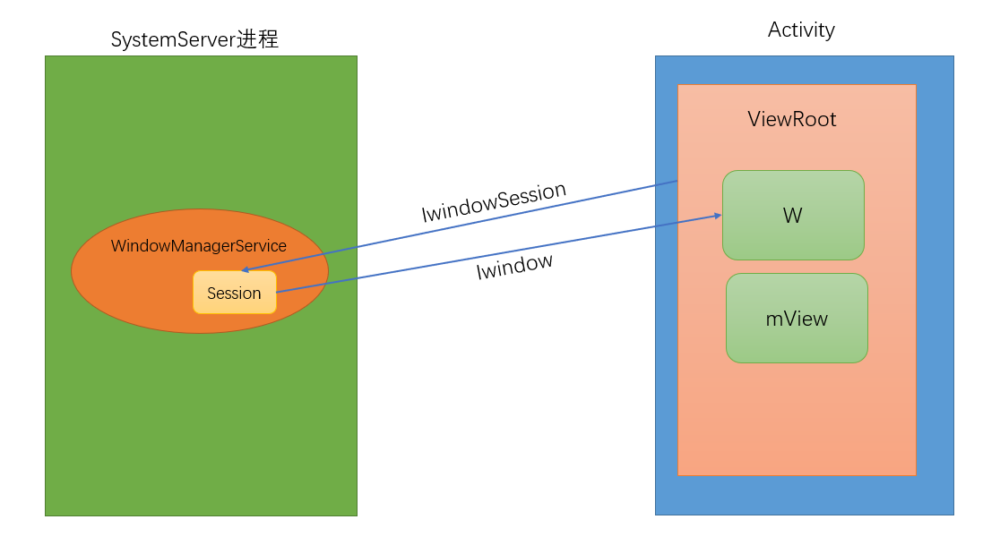

## 源码位置

*frameworks/base/core/java/android/view/ViewRoot.java*

*frameworks/base/services/java/com/android/server/WindowManagerService.java*


## ViewRoot

ViewRoot.java

```java
public final class ViewRoot extends Handler implements ViewParent,View.AttachInfo.Callbacks{
    .....
    final W mWindow;
        
     View mView;
    
    // These can be accessed by any thread, must be protected with a lock.
    // Surface can never be reassigned or cleared (use Surface.clear()).
    private final Surface mSurface = new Surface();   // 这里创建了一个 Surface 
        
        
    .....
        
        
    static class W extends IWindow.Stub {
        private final WeakReference<ViewRoot> mViewRoot;
        
    
       .....
    }
    
}
        
```


```java
    public ViewRoot(Context context) {
        super();
		...

        // Initialize the statics when this class is first instantiated. This is
        // done here instead of in the static block because Zygote does not
        // allow the spawning of threads.
        getWindowSession(context.getMainLooper());
        
        mThread = Thread.currentThread();
        mLocation = new WindowLeaked(null);
        mLocation.fillInStackTrace();
        mWidth = -1;
        mHeight = -1;
        mDirty = new Rect();
        mTempRect = new Rect();
        mVisRect = new Rect();
        mWinFrame = new Rect();
        
        mWindow = new W(this, context);
        mInputMethodCallback = new InputMethodCallback(this);
        mViewVisibility = View.GONE;
        mTransparentRegion = new Region();
        mPreviousTransparentRegion = new Region();
        mFirst = true; // true for the first time the view is added
        mAdded = false;
        mAttachInfo = new View.AttachInfo(sWindowSession, mWindow, this, this);
        mViewConfiguration = ViewConfiguration.get(context);
        mDensity = context.getResources().getDisplayMetrics().densityDpi;
    }
```


ViewRoot建立与WindowManagerService之间的关联

```java
  public static IWindowSession getWindowSession(Looper mainLooper) {
        synchronized (mStaticInit) {
            if (!mInitialized) {
                try {
                    InputMethodManager imm = InputMethodManager.getInstance(mainLooper);
                    sWindowSession = IWindowManager.Stub.asInterface(
                            ServiceManager.getService("window"))
                            .openSession(imm.getClient(), imm.getInputContext());
                    mInitialized = true;
                } catch (RemoteException e) {
                }
            }
            return sWindowSession;
        }
    }
```


WindowManagerService.java

```java
   public IWindowSession openSession(IInputMethodClient client,IInputContext inputContext) {
        if (client == null) throw new IllegalArgumentException("null client");
        if (inputContext == null) throw new IllegalArgumentException("null inputContext");
        Session session = new Session(client, inputContext);
        return session;
    }
```


Session是WMS的内部类，属于Bn端

```java
 private final class Session extends IWindowSession.Stub implements IBinder.DeathRecipient {
            ....
  }
```




