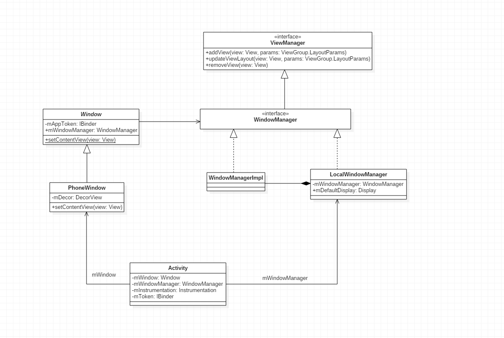

## Activity的创建

### handleLaunchActivity


frameworks\base\core\java\android\app\ActivityThread.java

```java
private final void handleLaunchActivity(ActivityClientRecord r, Intent customIntent) {
       ...
        // 利用反射创建一个Activity
        Activity a = performLaunchActivity(r, customIntent);

        if (a != null) {
            r.createdConfig = new Configuration(mConfiguration);
            Bundle oldState = r.state;
            handleResumeActivity(r.token, false, r.isForward);

            ...
        } 
    	...
    }
```

### performLaunchActivity


frameworks\base\core\java\android\app\ActivityThread.java

```java
private final Activity performLaunchActivity(ActivityClientRecord r, Intent customIntent) {
      
        ActivityInfo aInfo = r.activityInfo;
        if (r.packageInfo == null) {
            r.packageInfo = getPackageInfo(aInfo.applicationInfo,
                    Context.CONTEXT_INCLUDE_CODE);
        }

        ComponentName component = r.intent.getComponent();
        if (component == null) {
            component = r.intent.resolveActivity(
                mInitialApplication.getPackageManager());
            r.intent.setComponent(component);
        }

        if (r.activityInfo.targetActivity != null) {
            component = new ComponentName(r.activityInfo.packageName,
                    r.activityInfo.targetActivity);
        }

        Activity activity = null;
        try {
            
            // 根据类型反射创建一个Activity
            java.lang.ClassLoader cl = r.packageInfo.getClassLoader();
            activity = mInstrumentation.newActivity(cl, component.getClassName(), r.intent);
            r.intent.setExtrasClassLoader(cl);
            
            if (r.state != null) {
                r.state.setClassLoader(cl);
            }
        } catch (Exception e) {
            if (!mInstrumentation.onException(activity, e)) {
                throw new RuntimeException(
                    "Unable to instantiate activity " + component
                    + ": " + e.toString(), e);
            }
        }

        try {
            Application app = r.packageInfo.makeApplication(false, mInstrumentation);

            if (activity != null) {
                ContextImpl appContext = new ContextImpl();
                appContext.init(r.packageInfo, r.token, this);
                appContext.setOuterContext(activity);
                CharSequence title = r.activityInfo.loadLabel(appContext.getPackageManager());
                Configuration config = new Configuration(mConfiguration);
                if (DEBUG_CONFIGURATION) Slog.v(TAG, "Launching activity "
                        + r.activityInfo.name + " with config " + config);
                activity.attach(appContext, this, getInstrumentation(), r.token,
                        r.ident, app, r.intent, r.activityInfo, title, r.parent,
                        r.embeddedID, r.lastNonConfigurationInstance,
                        r.lastNonConfigurationChildInstances, config);

                if (customIntent != null) {
                    activity.mIntent = customIntent;
                }
                r.lastNonConfigurationInstance = null;
                r.lastNonConfigurationChildInstances = null;
                activity.mStartedActivity = false;
                int theme = r.activityInfo.getThemeResource();
                if (theme != 0) {
                    activity.setTheme(theme);
                }

                activity.mCalled = false;
                
                // 调用Activity的OnCreate方法
                mInstrumentation.callActivityOnCreate(activity, r.state);
                if (!activity.mCalled) {
                    throw new SuperNotCalledException(
                        "Activity " + r.intent.getComponent().toShortString() +
                        " did not call through to super.onCreate()");
                }
                r.activity = activity;
                r.stopped = true;
                if (!r.activity.mFinished) {
                    activity.performStart();
                    r.stopped = false;
                }
                if (!r.activity.mFinished) {
                    if (r.state != null) {
                        mInstrumentation.callActivityOnRestoreInstanceState(activity, r.state);
                    }
                }
                if (!r.activity.mFinished) {
                    activity.mCalled = false;
                    mInstrumentation.callActivityOnPostCreate(activity, r.state);
                    if (!activity.mCalled) {
                        throw new SuperNotCalledException(
                            "Activity " + r.intent.getComponent().toShortString() +
                            " did not call through to super.onPostCreate()");
                    }
                }
            }
            r.paused = true;

            mActivities.put(r.token, r);

        } catch (SuperNotCalledException e) {
            throw e;

        } catch (Exception e) {
            if (!mInstrumentation.onException(activity, e)) {
                throw new RuntimeException(
                    "Unable to start activity " + component
                    + ": " + e.toString(), e);
            }
        }

        return activity;
    }
```


frameworks\base\core\java\android\app\Instrumentation.java

```java
public Activity newActivity(ClassLoader cl, String className, Intent intent)throws InstantiationException, IllegalAccessException,            ClassNotFoundException {
        return (Activity)cl.loadClass(className).newInstance();
    }
```


### handleResumeActivity


frameworks\base\core\java\android\app\ActivityThread.java

```java
final void handleResumeActivity(IBinder token, boolean clearHide, boolean isForward) {
        // If we are getting ready to gc after going to the background, well
        // we are back active so skip it.
        unscheduleGcIdler();

        ActivityClientRecord r = performResumeActivity(token, clearHide);

        if (r != null) {
            final Activity a = r.activity;
            final int forwardBit = isForward ?
                    WindowManager.LayoutParams.SOFT_INPUT_IS_FORWARD_NAVIGATION : 0;

            // If the window hasn't yet been added to the window manager,
            // and this guy didn't finish itself or start another activity,
            // then go ahead and add the window.
            boolean willBeVisible = !a.mStartedActivity;
            if (!willBeVisible) {
                try {
                    willBeVisible = ActivityManagerNative.getDefault().willActivityBeVisible(
                            a.getActivityToken());
                } catch (RemoteException e) {
                }
            }
            if (r.window == null && !a.mFinished && willBeVisible) {
                r.window = r.activity.getWindow();
                
                // 获得一个View对象
                View decor = r.window.getDecorView();
                decor.setVisibility(View.INVISIBLE);
                
                // 获得ViewManager，就是LocalWindowManager
                ViewManager wm = a.getWindowManager();
                
                WindowManager.LayoutParams l = r.window.getAttributes();
                a.mDecor = decor;
                l.type = WindowManager.LayoutParams.TYPE_BASE_APPLICATION;
                l.softInputMode |= forwardBit;
                if (a.mVisibleFromClient) {
                    a.mWindowAdded = true;
                    
                    // 把刚才的decor对象加入到ViewManager
                    wm.addView(decor, l);
                }

            // If the window has already been added, but during resume
            // we started another activity, then don't yet make the
            // window visible.
            } else if (!willBeVisible) {
                if (localLOGV) Slog.v(
                    TAG, "Launch " + r + " mStartedActivity set");
                r.hideForNow = true;
            }

            // The window is now visible if it has been added, we are not
            // simply finishing, and we are not starting another activity.
            if (!r.activity.mFinished && willBeVisible
                    && r.activity.mDecor != null && !r.hideForNow) {
                if (r.newConfig != null) {
                    if (DEBUG_CONFIGURATION) Slog.v(TAG, "Resuming activity "
                            + r.activityInfo.name + " with newConfig " + r.newConfig);
                    performConfigurationChanged(r.activity, r.newConfig);
                    r.newConfig = null;
                }
                if (localLOGV) Slog.v(TAG, "Resuming " + r + " with isForward="
                        + isForward);
                WindowManager.LayoutParams l = r.window.getAttributes();
                if ((l.softInputMode
                        & WindowManager.LayoutParams.SOFT_INPUT_IS_FORWARD_NAVIGATION)
                        != forwardBit) {
                    l.softInputMode = (l.softInputMode
                            & (~WindowManager.LayoutParams.SOFT_INPUT_IS_FORWARD_NAVIGATION))
                            | forwardBit;
                    if (r.activity.mVisibleFromClient) {
                        ViewManager wm = a.getWindowManager();
                        View decor = r.window.getDecorView();
                        wm.updateViewLayout(decor, l);
                    }
                }
                r.activity.mVisibleFromServer = true;
                mNumVisibleActivities++;
                if (r.activity.mVisibleFromClient) {
                    r.activity.makeVisible();
                }
            }

            r.nextIdle = mNewActivities;
            mNewActivities = r;
            if (localLOGV) Slog.v(
                TAG, "Scheduling idle handler for " + r);
            Looper.myQueue().addIdleHandler(new Idler());

        } else {
            // If an exception was thrown when trying to resume, then
            // just end this activity.
            try {
                ActivityManagerNative.getDefault()
                    .finishActivity(token, Activity.RESULT_CANCELED, null);
            } catch (RemoteException ex) {
            }
        }
    }
```


frameworks\base\core\java\android\app\Activity.java

```java
    public void setContentView(View view) {
        // 返回一个Window
        getWindow().setContentView(view);
    }

    public Window getWindow() {
        return mWindow;
    }
```

下面看看`Window`是如何创建出来的

frameworks\base\core\java\android\app\ActivityThread.java

```java
ContextImpl appContext = new ContextImpl();
appContext.init(r.packageInfo, r.token, this);
appContext.setOuterContext(activity);
CharSequence title = r.activityInfo.loadLabel(appContext.getPackageManager());
Configuration config = new Configuration(mConfiguration);
activity.attach(appContext, this, getInstrumentation(), r.token,
                        r.ident, app, r.intent, r.activityInfo, title, r.parent,
                        r.embeddedID, r.lastNonConfigurationInstance,
                        r.lastNonConfigurationChildInstances, config);
```


frameworks\base\core\java\android\app\Activity.java

```java
final void attach(Context context, ActivityThread aThread, Instrumentation instr, IBinder token,
            Application application, Intent intent, ActivityInfo info, CharSequence title, 
            Activity parent, String id, Object lastNonConfigurationInstance,
            Configuration config) {
        attach(context, aThread, instr, token, 0, application, intent, info, title, parent, id,
            lastNonConfigurationInstance, null, config);
    }
    
final void attach(Context context, ActivityThread aThread,
            Instrumentation instr, IBinder token, int ident,
            Application application, Intent intent, ActivityInfo info,
            CharSequence title, Activity parent, String id,
            Object lastNonConfigurationInstance,
            HashMap<String,Object> lastNonConfigurationChildInstances,
            Configuration config) {
        attachBaseContext(context);

    	// 利用 PolicyManager 来出创建Window对象
        mWindow = PolicyManager.makeNewWindow(this);
        mWindow.setCallback(this);
        if (info.softInputMode != WindowManager.LayoutParams.SOFT_INPUT_STATE_UNSPECIFIED) {
            mWindow.setSoftInputMode(info.softInputMode);
        }
        mUiThread = Thread.currentThread();

        mMainThread = aThread;
        mInstrumentation = instr;
        mToken = token;
        mIdent = ident;
        mApplication = application;
        mIntent = intent;
        mComponent = intent.getComponent();
        mActivityInfo = info;
        mTitle = title;
        mParent = parent;
        mEmbeddedID = id;
        mLastNonConfigurationInstance = lastNonConfigurationInstance;
        mLastNonConfigurationChildInstances = lastNonConfigurationChildInstances;

    	// 创建WindowManager
        mWindow.setWindowManager(null, mToken, mComponent.flattenToString());
        if (mParent != null) {
            mWindow.setContainer(mParent.getWindow());
        }
        mWindowManager = mWindow.getWindowManager();
        mCurrentConfig = config;
    }
```


frameworks\base\core\java\com\android\internal\policy\PolicyManager.java

```java
public final class PolicyManager {
    private static final String POLICY_IMPL_CLASS_NAME = "com.android.internal.policy.impl.Policy";

    private static final IPolicy sPolicy;

    static {
        // Pull in the actual implementation of the policy at run-time
        try {
            Class policyClass = Class.forName(POLICY_IMPL_CLASS_NAME);
            // 创建Policy对象
            sPolicy = (IPolicy)policyClass.newInstance();
        } catch (ClassNotFoundException ex) {
            throw new RuntimeException(
                    POLICY_IMPL_CLASS_NAME + " could not be loaded", ex);
        } catch (InstantiationException ex) {
            throw new RuntimeException(
                    POLICY_IMPL_CLASS_NAME + " could not be instantiated", ex);
        } catch (IllegalAccessException ex) {
            throw new RuntimeException(
                    POLICY_IMPL_CLASS_NAME + " could not be instantiated", ex);
        }
    }

    // Cannot instantiate this class
    private PolicyManager() {}

    // The static methods to spawn new policy-specific objects
    public static Window makeNewWindow(Context context) {
        return sPolicy.makeNewWindow(context);
    }

    public static LayoutInflater makeNewLayoutInflater(Context context) {
        return sPolicy.makeNewLayoutInflater(context);
    }

    public static WindowManagerPolicy makeNewWindowManager() {
        return sPolicy.makeNewWindowManager();
    }
}
```


frameworks\base\policy\src\com\android\internal\policy\impl\Policy.java

```java
public class Policy implements IPolicy {
    private static final String TAG = "PhonePolicy";

    private static final String[] preload_classes = {
        "com.android.internal.policy.impl.PhoneLayoutInflater",
        "com.android.internal.policy.impl.PhoneWindow",
        "com.android.internal.policy.impl.PhoneWindow$1",
        "com.android.internal.policy.impl.PhoneWindow$ContextMenuCallback",
        "com.android.internal.policy.impl.PhoneWindow$DecorView",
        "com.android.internal.policy.impl.PhoneWindow$PanelFeatureState",
        "com.android.internal.policy.impl.PhoneWindow$PanelFeatureState$SavedState",
    };

    static {
        // For performance reasons, preload some policy specific classes when
        // the policy gets loaded.
        // 预加载这些类
        for (String s : preload_classes) {
            try {
                Class.forName(s);
            } catch (ClassNotFoundException ex) {
                Log.e(TAG, "Could not preload class for phone policy: " + s);
            }
        }
    }

    public PhoneWindow makeNewWindow(Context context) {
        // 
        return new PhoneWindow(context);
    }

    public PhoneLayoutInflater makeNewLayoutInflater(Context context) {
        return new PhoneLayoutInflater(context);
    }

    public PhoneWindowManager makeNewWindowManager() {
        return new PhoneWindowManager();
    }
}
```

这么一来`mWindow`就是`PhoneWindow`

```java
mWindow.setWindowManager(null, mToken, mComponent.flattenToString());
```


frameworks\base\core\java\android\view\Window.java

```java
public void setWindowManager(WindowManager wm,IBinder appToken, String appName) {
        mAppToken = appToken;
        mAppName = appName;
        if (wm == null) {
            wm = WindowManagerImpl.getDefault();
        }
        mWindowManager = new LocalWindowManager(wm);
    }
```


```java
public class WindowManagerImpl implements WindowManager {

    .... 
        
	public static WindowManagerImpl getDefault()
    {
        return mWindowManager;
    }
    
    ....
        
        
	private static WindowManagerImpl mWindowManager = new WindowManagerImpl();	
    
    
    
     private class LocalWindowManager implements WindowManager {
         
        private final WindowManager mWindowManager;

        private final Display mDefaultDisplay;
         
        ...
            
        LocalWindowManager(WindowManager wm) {
            mWindowManager = wm;
            mDefaultDisplay = mContext.getResources().getDefaultDisplay(mWindowManager.getDefaultDisplay());
        }
         
         
     	....
         
     }

}
```




frameworks\base\core\java\android\app\Activity.java

```java
    public void setContentView(View view) {
        // getWindow()返回的就是 PhoneWindow
        getWindow().setContentView(view);
    }
```


frameworks\base\policy\src\com\android\internal\policy\impl\PhoneWindow.java

```java
    @Override
    public void setContentView(View view) {
        setContentView(view, new ViewGroup.LayoutParams(MATCH_PARENT, MATCH_PARENT));
    }

    @Override
    public void setContentView(View view, ViewGroup.LayoutParams params) {
        if (mContentParent == null) {
            installDecor();
        } else {
            mContentParent.removeAllViews();
        }
        mContentParent.addView(view, params);
        final Callback cb = getCallback();
        if (cb != null) {
            cb.onContentChanged();
        }
    }


	private void installDecor() {
        if (mDecor == null) {
            mDecor = generateDecor();
            mDecor.setDescendantFocusability(ViewGroup.FOCUS_AFTER_DESCENDANTS);
            mDecor.setIsRootNamespace(true);
        }
        if (mContentParent == null) {
            mContentParent = generateLayout(mDecor);

            mTitleView = (TextView)findViewById(com.android.internal.R.id.title);
            if (mTitleView != null) {
                if ((getLocalFeatures() & (1 << FEATURE_NO_TITLE)) != 0) {
                    View titleContainer = findViewById(com.android.internal.R.id.title_container);
                    if (titleContainer != null) {
                        titleContainer.setVisibility(View.GONE);
                    } else {
                        mTitleView.setVisibility(View.GONE);
                    }
                    if (mContentParent instanceof FrameLayout) {
                        ((FrameLayout)mContentParent).setForeground(null);
                    }
                } else {
                    mTitleView.setText(mTitle);
                }
            }
        }
    }


    protected DecorView generateDecor() {
        return new DecorView(getContext(), -1);
    }
```

## addView

```java
// 这个wm就是 LocalWindowManager
wm.addView(decor, l);
```

frameworks\base\core\java\android\view\Window.java

```java
private class LocalWindowManager implements WindowManager {
		
		....
	
		public final void addView(View view, ViewGroup.LayoutParams params) {
            // Let this throw an exception on a bad params.
            WindowManager.LayoutParams wp = (WindowManager.LayoutParams)params;
            CharSequence curTitle = wp.getTitle();
            if (wp.type >= WindowManager.LayoutParams.FIRST_SUB_WINDOW &&
                wp.type <= WindowManager.LayoutParams.LAST_SUB_WINDOW) {
                if (wp.token == null) {
                    View decor = peekDecorView();
                    if (decor != null) {
                        wp.token = decor.getWindowToken();
                    }
                }
              ....
                  
            } else {
                if (wp.token == null) {
                    wp.token = mContainer == null ? mAppToken : mContainer.mAppToken;
                }
                if ((curTitle == null || curTitle.length() == 0)
                        && mAppName != null) {
                    wp.setTitle(mAppName);
                }
           }
            if (wp.packageName == null) {
                wp.packageName = mContext.getPackageName();
            }
            // mWindowManager就是 WindowManagerImpl
            mWindowManager.addView(view, params);
        }
        
        
        ....
	
}
```


frameworks\base\core\java\android\view\WindowManagerImpl.java

```java
private void addView(View view, ViewGroup.LayoutParams params, boolean nest)
    {
        if (Config.LOGV) Log.v("WindowManager", "addView view=" + view);

        if (!(params instanceof WindowManager.LayoutParams)) {
            throw new IllegalArgumentException(
                    "Params must be WindowManager.LayoutParams");
        }

        final WindowManager.LayoutParams wparams = (WindowManager.LayoutParams)params;
        
    	// 主角出来 ViewRoot
        ViewRoot root;
        View panelParentView = null;
        
        synchronized (this) {
            // Here's an odd/questionable case: if someone tries to add a
            // view multiple times, then we simply bump up a nesting count
            // and they need to remove the view the corresponding number of
            // times to have it actually removed from the window manager.
            // This is useful specifically for the notification manager,
            // which can continually add/remove the same view as a
            // notification gets updated.
            int index = findViewLocked(view, false);
            if (index >= 0) {
                if (!nest) {
                    throw new IllegalStateException("View " + view
                            + " has already been added to the window manager.");
                }
                root = mRoots[index];
                root.mAddNesting++;
                // Update layout parameters.
                view.setLayoutParams(wparams);
                root.setLayoutParams(wparams, true);
                return;
            }
            
            // If this is a panel window, then find the window it is being
            // attached to for future reference.
            if (wparams.type >= WindowManager.LayoutParams.FIRST_SUB_WINDOW &&
                    wparams.type <= WindowManager.LayoutParams.LAST_SUB_WINDOW) {
                final int count = mViews != null ? mViews.length : 0;
                for (int i=0; i<count; i++) {
                    if (mRoots[i].mWindow.asBinder() == wparams.token) {
                        panelParentView = mViews[i];
                    }
                }
            }
            
            // 创建 ViewRoot
            root = new ViewRoot(view.getContext());
            root.mAddNesting = 1;

            view.setLayoutParams(wparams);
            
            if (mViews == null) {
                index = 1;
                mViews = new View[1];
                mRoots = new ViewRoot[1];
                mParams = new WindowManager.LayoutParams[1];
            } else {
                index = mViews.length + 1;
                Object[] old = mViews;
                mViews = new View[index];
                System.arraycopy(old, 0, mViews, 0, index-1);
                old = mRoots;
                mRoots = new ViewRoot[index];
                System.arraycopy(old, 0, mRoots, 0, index-1);
                old = mParams;
                mParams = new WindowManager.LayoutParams[index];
                System.arraycopy(old, 0, mParams, 0, index-1);
            }
            index--;

            // 保存ViewRoot
            mViews[index] = view;
            mRoots[index] = root;
            mParams[index] = wparams;
        }
        // do this last because it fires off messages to start doing things
    	// 这个view就是DecorView
        root.setView(view, wparams, panelParentView);
    }
```


frameworks\base\core\java\android\view\ViewRoot.java

```java
public final class ViewRoot extends Handler implements ViewParent,View.AttachInfo.Callbacks {
        ....
            
        static IWindowSession sWindowSession;
        
    	final W mWindow;

    	//  这个view就是DecorView
    	View mView;   
     	private final Surface mSurface = new Surface();   
            
        ...
            
        public ViewRoot(Context context) {
        	super();

        	if (MEASURE_LATENCY && lt == null) {
           	 lt = new LatencyTimer(100, 1000);
        	}

        	// For debug only
        	//++sInstanceCount;

        	// Initialize the statics when this class is first instantiated. This is
        	// done here instead of in the static block because Zygote does not
        	// allow the spawning of threads.
        	getWindowSession(context.getMainLooper());
        
        	mThread = Thread.currentThread();
        	mLocation = new WindowLeaked(null);
        	mLocation.fillInStackTrace();
        	mWidth = -1;
       		mHeight = -1;
        	mDirty = new Rect();
        	mTempRect = new Rect();
        	mVisRect = new Rect();
        	mWinFrame = new Rect();
        	mWindow = new W(this, context);
        	mInputMethodCallback = new InputMethodCallback(this);
        	mViewVisibility = View.GONE;
        	mTransparentRegion = new Region();
        	mPreviousTransparentRegion = new Region();
        	mFirst = true; // true for the first time the view is added
        	mAdded = false;
        	mAttachInfo = new View.AttachInfo(sWindowSession, mWindow, this, this);
        	mViewConfiguration = ViewConfiguration.get(context);
        	mDensity = context.getResources().getDisplayMetrics().densityDpi;
    	}    
        
    
    	public static IWindowSession getWindowSession(Looper mainLooper) {
        	synchronized (mStaticInit) {
            	if (!mInitialized) {
                	try {
                    	InputMethodManager imm = InputMethodManager.getInstance(mainLooper);
                        
                        // 先获取WindowManagerService，然后调用它的 openSession
                    	sWindowSession = IWindowManager.Stub.asInterface(
                            ServiceManager.getService("window"))
                            .openSession(imm.getClient(), imm.getInputContext());
                    	mInitialized = true;
                	} catch (RemoteException e) {
               	 }
            	}
           	 	return sWindowSession;
        	}
    	}
        ...
        
}
```


frameworks\base\core\java\android\view\ViewRoot.java

```java
public void setView(View view, WindowManager.LayoutParams attrs,View panelParentView) {
        synchronized (this) {
            if (mView == null) {
                mView = view;
                mWindowAttributes.copyFrom(attrs);
                attrs = mWindowAttributes;
                if (view instanceof RootViewSurfaceTaker) {
                    mSurfaceHolderCallback =
                            ((RootViewSurfaceTaker)view).willYouTakeTheSurface();
                    if (mSurfaceHolderCallback != null) {
                        mSurfaceHolder = new TakenSurfaceHolder();
                        mSurfaceHolder.setFormat(PixelFormat.UNKNOWN);
                    }
                }
                Resources resources = mView.getContext().getResources();
                CompatibilityInfo compatibilityInfo = resources.getCompatibilityInfo();
                mTranslator = compatibilityInfo.getTranslator();

                if (mTranslator != null || !compatibilityInfo.supportsScreen()) {
                    mSurface.setCompatibleDisplayMetrics(resources.getDisplayMetrics(),
                            mTranslator);
                }

                boolean restore = false;
                if (mTranslator != null) {
                    restore = true;
                    attrs.backup();
                    mTranslator.translateWindowLayout(attrs);
                }
                if (DEBUG_LAYOUT) Log.d(TAG, "WindowLayout in setView:" + attrs);

                if (!compatibilityInfo.supportsScreen()) {
                    attrs.flags |= WindowManager.LayoutParams.FLAG_COMPATIBLE_WINDOW;
                }

                mSoftInputMode = attrs.softInputMode;
                mWindowAttributesChanged = true;
                mAttachInfo.mRootView = view;
                mAttachInfo.mScalingRequired = mTranslator != null;
                mAttachInfo.mApplicationScale =
                        mTranslator == null ? 1.0f : mTranslator.applicationScale;
                if (panelParentView != null) {
                    mAttachInfo.mPanelParentWindowToken
                            = panelParentView.getApplicationWindowToken();
                }
                mAdded = true;
                int res; /* = WindowManagerImpl.ADD_OKAY; */

                // Schedule the first layout -before- adding to the window
                // manager, to make sure we do the relayout before receiving
                // any other events from the system.
                
                // 注意这个 requestLayout
                requestLayout();
                mInputChannel = new InputChannel();
                try {
                    
                    
                    
                    // mWindow就是ViewRoot中的W类，是一个IWindow.Stub
               
                    res = sWindowSession.add(mWindow, mWindowAttributes,
                            getHostVisibility(), mAttachInfo.mContentInsets,
                            mInputChannel);
                } catch (RemoteException e) {
                    mAdded = false;
                    mView = null;
                    mAttachInfo.mRootView = null;
                    mInputChannel = null;
                    unscheduleTraversals();
                    throw new RuntimeException("Adding window failed", e);
                } finally {
                    if (restore) {
                        attrs.restore();
                    }
                }
                
                if (mTranslator != null) {
                    mTranslator.translateRectInScreenToAppWindow(mAttachInfo.mContentInsets);
                }
                mPendingContentInsets.set(mAttachInfo.mContentInsets);
                mPendingVisibleInsets.set(0, 0, 0, 0);
                if (Config.LOGV) Log.v(TAG, "Added window " + mWindow);
                if (res < WindowManagerImpl.ADD_OKAY) {
                    mView = null;
                    mAttachInfo.mRootView = null;
                    mAdded = false;
                    unscheduleTraversals();
                    switch (res) {
                        case WindowManagerImpl.ADD_BAD_APP_TOKEN:
                        case WindowManagerImpl.ADD_BAD_SUBWINDOW_TOKEN:
                            throw new WindowManagerImpl.BadTokenException(
                                "Unable to add window -- token " + attrs.token
                                + " is not valid; is your activity running?");
                        case WindowManagerImpl.ADD_NOT_APP_TOKEN:
                            throw new WindowManagerImpl.BadTokenException(
                                "Unable to add window -- token " + attrs.token
                                + " is not for an application");
                        case WindowManagerImpl.ADD_APP_EXITING:
                            throw new WindowManagerImpl.BadTokenException(
                                "Unable to add window -- app for token " + attrs.token
                                + " is exiting");
                        case WindowManagerImpl.ADD_DUPLICATE_ADD:
                            throw new WindowManagerImpl.BadTokenException(
                                "Unable to add window -- window " + mWindow
                                + " has already been added");
                        case WindowManagerImpl.ADD_STARTING_NOT_NEEDED:
                            // Silently ignore -- we would have just removed it
                            // right away, anyway.
                            return;
                        case WindowManagerImpl.ADD_MULTIPLE_SINGLETON:
                            throw new WindowManagerImpl.BadTokenException(
                                "Unable to add window " + mWindow +
                                " -- another window of this type already exists");
                        case WindowManagerImpl.ADD_PERMISSION_DENIED:
                            throw new WindowManagerImpl.BadTokenException(
                                "Unable to add window " + mWindow +
                                " -- permission denied for this window type");
                    }
                    throw new RuntimeException(
                        "Unable to add window -- unknown error code " + res);
                }

                if (view instanceof RootViewSurfaceTaker) {
                    mInputQueueCallback =
                        ((RootViewSurfaceTaker)view).willYouTakeTheInputQueue();
                }
                if (mInputQueueCallback != null) {
                    mInputQueue = new InputQueue(mInputChannel);
                    mInputQueueCallback.onInputQueueCreated(mInputQueue);
                } else {
                    InputQueue.registerInputChannel(mInputChannel, mInputHandler,
                            Looper.myQueue());
                }
                
                view.assignParent(this);
                mAddedTouchMode = (res&WindowManagerImpl.ADD_FLAG_IN_TOUCH_MODE) != 0;
                mAppVisible = (res&WindowManagerImpl.ADD_FLAG_APP_VISIBLE) != 0;
            }
        }
    }
```


```java
    public void requestLayout() {
        checkThread();
        mLayoutRequested = true;
        scheduleTraversals();
    }


    public void scheduleTraversals() {
        if (!mTraversalScheduled) {
            mTraversalScheduled = true;
            
            // 发送  DO_TRAVERSAL消息
            sendEmptyMessage(DO_TRAVERSAL);
        }
    }
```


frameworks\base\services\java\com\android\server\WindowManagerService.java

```java
    public IWindowSession openSession(IInputMethodClient client, IInputContext inputContext) {
        if (client == null) throw new IllegalArgumentException("null client");
        if (inputContext == null) throw new IllegalArgumentException("null inputContext");
        
        // 创建 Session
        Session session = new Session(client, inputContext);
        return session;
    }
```


```java
private final class Session extends IWindowSession.Stub implements IBinder.DeathRecipient {
		final IInputMethodClient mClient;
        final IInputContext mInputContext;
        final int mUid;
        final int mPid;
        final String mStringName;
        SurfaceSession mSurfaceSession;
        int mNumWindow = 0;
        boolean mClientDead = false;

     .....
         
         
        // mWindow就是ViewRoot中的W类，是一个IWindow.Stub
        public int add(IWindow window, WindowManager.LayoutParams attrs,
                       int viewVisibility, Rect outContentInsets, InputChannel outInputChannel) {
         
         	// 调用 WindowManagerService的addWindow方法
            return addWindow(this, window, attrs, viewVisibility, outContentInsets,
                    outInputChannel);
        }
    
    ....

}
```


frameworks\base\services\java\com\android\server\WindowManagerService.java

```java

// 将session传递进来
// client就是ViewRoot中的W类
public int addWindow(Session session, IWindow client,
            WindowManager.LayoutParams attrs, int viewVisibility,
            Rect outContentInsets, InputChannel outInputChannel) {
        int res = mPolicy.checkAddPermission(attrs);
        if (res != WindowManagerImpl.ADD_OKAY) {
            return res;
        }

        boolean reportNewConfig = false;
        WindowState attachedWindow = null;
        WindowState win = null;

        synchronized(mWindowMap) {
           
           ......

            // 创建一个 WindowState
            win = new WindowState(session, client, token,attachedWindow, attrs, viewVisibility);
            。。。
            
            // 调用attach函数
            win.attach();
            mWindowMap.put(client.asBinder(), win);
            ...

        return res;
    }
```


frameworks\base\services\java\com\android\server\WindowManagerService.java

```java
 private final class WindowState implements WindowManagerPolicy.WindowState {
     final Session mSession;
     final IWindow mClient;
     WindowToken mToken;
     
 	.....
  	void attach() {
            mSession.windowAddedLocked();
        }
 	...
 }
```


frameworks\base\services\java\com\android\server\WindowManagerService.java

````java
void windowAddedLocked() {
    if (mSurfaceSession == null) {
        //
        mSurfaceSession = new SurfaceSession();
        if (SHOW_TRANSACTIONS) Slog.i(
                TAG, "  NEW SURFACE SESSION " + mSurfaceSession);
        mSessions.add(this);
    }
    mNumWindow++;
}

````

## requestLayout 

frameworks\base\core\java\android\view\ViewRoot.java

```java
public final class ViewRoot extends Handler implements ViewParent,View.AttachInfo.Callbacks{
		...
		
	public void handleMessage(Message msg) {
        switch (msg.what) {
        case DO_TRAVERSAL:
            performTraversals();
            break;
        
		...

}
```


frameworks\base\core\java\android\view\ViewRoot.java

```java
private void performTraversals() {
	final View host = mView;
	....
	
	 boolean initialized = false;
     boolean contentInsetsChanged = false;
     boolean visibleInsetsChanged;
     boolean hadSurface = mSurface.isValid();
     // 关键函数
     relayoutResult = relayoutWindow(params, viewVisibility, insetsPending);
     
     ....
            
            
	draw(fullRedrawNeeded);
	....
}
```


frameworks\base\core\java\android\view\ViewRoot.java

```java
private int relayoutWindow(WindowManager.LayoutParams params, int viewVisibility, boolean insetsPending) throws RemoteException {

        ...
        //Log.d(TAG, ">>>>>> CALLING relayout");
        int relayoutResult = sWindowSession.relayout(
                mWindow, params,
                (int) (mView.mMeasuredWidth * appScale + 0.5f),
                (int) (mView.mMeasuredHeight * appScale + 0.5f),
                viewVisibility, insetsPending, mWinFrame,
                mPendingContentInsets, mPendingVisibleInsets,
                mPendingConfiguration, mSurface); // mSurface 作为参数传递进去 
        //Log.d(TAG, "<<<<<< BACK FROM relayout");
       ...
        return relayoutResult;
    }
```


```java
private void draw(boolean fullRedrawNeeded) {
	...

	Canvas canvas;
    try {
    	int left = dirty.left;
    	int top = dirty.top;
    	int right = dirty.right;
    	int bottom = dirty.bottom;
    	canvas = surface.lockCanvas(dirty);
			
        ....
         mView.draw(canvas);

        ....
		surface.unlockCanvasAndPost(canvas);
	...
}
```

## Surface

在`ViewRoot`构造时，会创建一个`Surface`,使用的是无参构造函数

frameworks\base\core\java\android\view\ViewRoot.java

```java
public final class ViewRoot extends Handler implements ViewParent,
        View.AttachInfo.Callbacks {
        
        ....
        
        private final Surface mSurface = new Surface();
        
        ....
        
  }
```


`ViewRoot`通过`IWindowSession`和`WMS`交互，而`WMS`中调用的一个attach函数会构造一个`SurfaceSession`

frameworks\base\services\java\com\android\server\WindowManagerService.java

```java
void windowAddedLocked() {
    if (mSurfaceSession == null) {
        mSurfaceSession = new SurfaceSession();
        mSessions.add(this);
    }
    mNumWindow++;
}
```

`ViewRoot`在`performTraversals`的处理过程中会调用`IWindowSession`的`relayout`函数


frameworks\base\services\java\com\android\server\WindowManagerService.java

```java
// window就是ViewRoot中的W对象
// outSurface就是ViewRoot中的surface
public int relayout(IWindow window, WindowManager.LayoutParams attrs,
                int requestedWidth, int requestedHeight, int viewFlags,
                boolean insetsPending, Rect outFrame, Rect outContentInsets,
                Rect outVisibleInsets, Configuration outConfig, Surface outSurface) {
            //Log.d(TAG, ">>>>>> ENTERED relayout from " + Binder.getCallingPid());
            int res = relayoutWindow(this, window, attrs,
                    requestedWidth, requestedHeight, viewFlags, insetsPending,
                    outFrame, outContentInsets, outVisibleInsets, outConfig, outSurface);
            //Log.d(TAG, "<<<<<< EXITING relayout to " + Binder.getCallingPid());
            return res;
        }
```

​	


```java
public int relayoutWindow(Session session, IWindow client,
            WindowManager.LayoutParams attrs, int requestedWidth,
            int requestedHeight, int viewVisibility, boolean insetsPending,
            Rect outFrame, Rect outContentInsets, Rect outVisibleInsets,
            Configuration outConfig, Surface outSurface) {
  
    		....
                try {
                    // win 就是WinState
                    // 创建一个本地的 Surface
                    Surface surface = win.createSurfaceLocked();
                    if (surface != null) {
                        outSurface.copyFrom(surface);
                        win.mReportDestroySurface = false;
                        win.mSurfacePendingDestroy = false;
                        if (SHOW_TRANSACTIONS) Slog.i(TAG,
                                "  OUT SURFACE " + outSurface + ": copied");
                    }
             ....
       
    }
```

