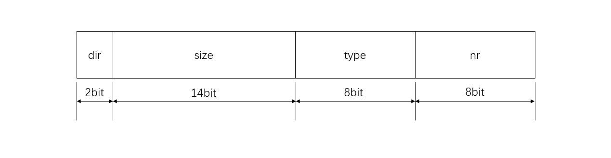
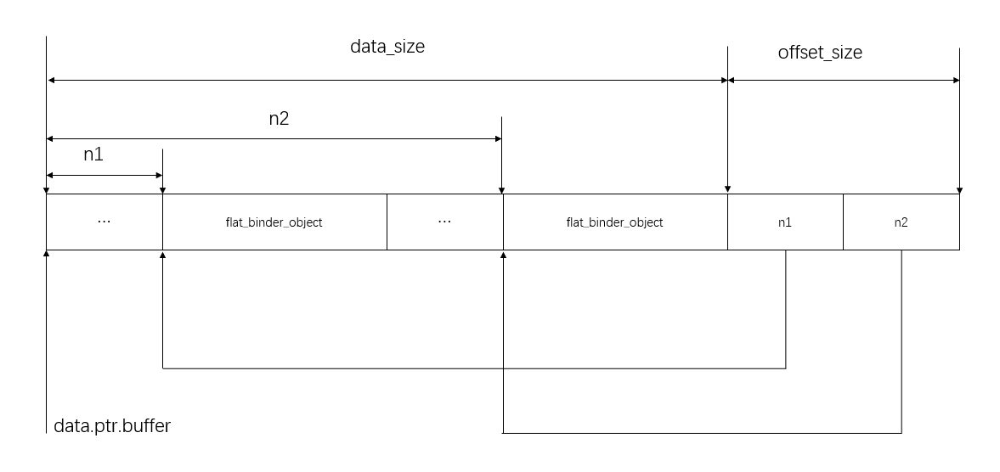

## IOC

include\asm-generic\ioctl.h

```c#
#define _IOC_NRBITS	8        // 序数（number）字段的字位宽度，8bits
#define _IOC_TYPEBITS	8    // 魔数（type）字段的字位宽度，8bits

#ifndef _IOC_SIZEBITS
# define _IOC_SIZEBITS	14   // 大小（size）字段的字位宽度，14bits
#endif

#ifndef _IOC_DIRBITS
# define _IOC_DIRBITS	2   // 方向（direction）字段的字位宽度，2bits
#endif

#define _IOC_NRMASK	((1 << _IOC_NRBITS)-1)          // 序数字段的掩码，0x000000F
#define _IOC_TYPEMASK	((1 << _IOC_TYPEBITS)-1)    // 魔数字段的掩码，0x000000FF
#define _IOC_SIZEMASK	((1 << _IOC_SIZEBITS)-1)    // 大小字段的掩码，0x00003FFF
#define _IOC_DIRMASK	((1 << _IOC_DIRBITS)-1)     // 方向字段的掩码，0x00000003
 
#define _IOC_NRSHIFT	0                                // 序数字段在整个字段中的位移，0
#define _IOC_TYPESHIFT	(_IOC_NRSHIFT+_IOC_NRBITS)       // 魔数字段的位移，8
#define _IOC_SIZESHIFT	(_IOC_TYPESHIFT+_IOC_TYPEBITS)   // 大小字段的位移，16
#define _IOC_DIRSHIFT	(_IOC_SIZESHIFT+_IOC_SIZEBITS)   // 方向字段的位移，30

#ifndef _IOC_NONE
# define _IOC_NONE	0U        // 没有数据传输
#endif 

#ifndef _IOC_WRITE
# define _IOC_WRITE	1U       // 向设备写入数据，驱动程序必须从用户空间读入数据
#endif

#ifndef _IOC_READ
# define _IOC_READ	2U       // 向设备写入数据，驱动程序必须从用户空间读入数据
#endif
    
#define _IOC(dir,type,nr,size) \
	(((dir)  << _IOC_DIRSHIFT) | \       // 左移30bit
	 ((type) << _IOC_TYPESHIFT) | \      // 左移8bit
	 ((nr)   << _IOC_NRSHIFT) | \        // 左移0bit 
	 ((size) << _IOC_SIZESHIFT))         // 左移16bit


/* used to create numbers */
// 构造无参数的命令编号
#define _IO(type,nr)		_IOC(_IOC_NONE,(type),(nr),0)

// 构造从驱动程序中读取数据的命令编号
#define _IOR(type,nr,size)	_IOC(_IOC_READ,(type),(nr),(_IOC_TYPECHECK(size)))

// 用于向驱动程序写入数据命令    
#define _IOW(type,nr,size)	_IOC(_IOC_WRITE,(type),(nr),(_IOC_TYPECHECK(size)))
    
//用于双向传输    
#define _IOWR(type,nr,size)	_IOC(_IOC_READ|_IOC_WRITE,(type),(nr),(_IOC_TYPECHECK(size)))
#define _IOR_BAD(type,nr,size)	_IOC(_IOC_READ,(type),(nr),sizeof(size))
#define _IOW_BAD(type,nr,size)	_IOC(_IOC_WRITE,(type),(nr),sizeof(size))
#define _IOWR_BAD(type,nr,size)	_IOC(_IOC_READ|_IOC_WRITE,(type),(nr),sizeof(size))
```

- dir(direction)，ioctl命令访问模式（数据传输方向），占据2bit，可以为_IOC_NONE、_IOC_READ、_IOC_WRITE _IOC_READ | _IOC_WRITE，分别指示了四种访问模式：无数据、读数据、写数据、读写数据

- type(device type)，设备类型，占据8bit，在一些文献中翻译为“幻数”或者“魔数”，可以为任意char型字符，例如‘a’、‘b’、‘c’等等，其主要作用是使ioctl命令有唯一的设备标识；
  tips：Documentions/ioctl-number.txt记录了在内核中已经使用的“魔数”字符，为避免冲突，在自定义ioctl命令之前应该先查阅该文档

- nr(number)，命令编号/序数，占据8bit，可以为任意unsigned char型数据，取值范围0~255，如果定义了多个ioctl命令，通常从0开始编号递增；

- size，涉及到ioctl第三个参数arg，占据13bit或者14bit（体系相关，arm架构一般为14位），指定了arg的数据类型及长度,如果在驱动的ioctl实现中不检查，通常可以忽略该参数。



## list_head

*include/linux/list.h*

```c
// list_head不是拿来单独用的，它一般被嵌到其它结构中,作为它的父结构中的一个成员
struct list_head {
	struct list_head *next, *prev;
};

// 定义一个list_head结构，建立一个空链表
#define LIST_HEAD_INIT(name) { &(name), &(name) }

#define LIST_HEAD(name) \
	struct list_head name = LIST_HEAD_INIT(name)

static inline void INIT_LIST_HEAD(struct list_head *list)
{
	list->next = list;
	list->prev = list;
}
```

用LIST_HEAD(name )声明一个名为name的链表头，它的next、prev指针都初始化为指向自己，这样，实际上就建立了一个空链表，以上代码等同于

```c
struct list_head name = {&name,&name}
// 等价与
struct list_head name；
name.next = &name;
name.prev = &name;
```

## rb_node

*include/linux/rbtree.h*

```c
struct rb_node
{
	// 同时包含了颜色信息以及父亲节点的指针
	unsigned long  rb_parent_color;
#define	RB_RED		0
#define	RB_BLACK	1
	struct rb_node *rb_right;
	struct rb_node *rb_left;
} __attribute__((aligned(sizeof(long)))); // 把结构体的地址按“sizeof(long)”对齐
	// 对于32位机,sizeof(long)为4 (即结构体内的数据类型的地址为4的倍数)。
	// 对于64位机，sizeof(long)为8(结构体内的数据类型的地址为8的倍数).
	// 
    /* The alignment might seem pointless, but allegedly CRIS needs it */

struct rb_root
{
	struct rb_node *rb_node;
};
```

红黑树数据结构


## hlist_head

*include/linux/list.h*

```c
struct hlist_head {
	struct hlist_node *first;
};

struct hlist_node {
	struct hlist_node *next, **pprev;
};

#define HLIST_HEAD_INIT { .first = NULL }
#define HLIST_HEAD(name) struct hlist_head name = {  .first = NULL }
#define INIT_HLIST_HEAD(ptr) ((ptr)->first = NULL)
```


## wait_queue_head_t

include/linux/wait.h

```c
struct __wait_queue_head {
	spinlock_t lock;
	struct list_head task_list;
};

typedef struct __wait_queue_head wait_queue_head_t;
```

## binder_work 

*drivers/staging/android/binder.c*

```c
struct binder_work {
	struct list_head entry;
	enum {
		BINDER_WORK_TRANSACTION = 1,
		BINDER_WORK_TRANSACTION_COMPLETE,
		BINDER_WORK_NODE,
		BINDER_WORK_DEAD_BINDER,
		BINDER_WORK_DEAD_BINDER_AND_CLEAR,
		BINDER_WORK_CLEAR_DEATH_NOTIFICATION,
	} type;
};
```

用来描述待处理的工作项。


## binder_node

drivers/staging/android/binder.c

```c
struct binder_node {
	int debug_id;
	struct binder_work work;
	union {
		struct rb_node rb_node;
		struct hlist_node dead_node;
	};
	struct binder_proc *proc;
    // binder引用对象列表
	struct hlist_head refs;
    // 外部强引用计数，用来描述有多少个Binder引用对象是通过强引用计数来引用该binder实体对象的
    // 为什么没有一个弱引用计数internal_weak_refs？因为，Binder实体对象的Binder引用对象列表refs的大小就已经隐含了它的外部弱引用计数。
	int internal_strong_refs;
    // 内部弱引用计数
	int local_weak_refs;
    // 内部强引用计数
	int local_strong_refs;
	void __user *ptr;
	void __user *cookie;
	unsigned has_strong_ref : 1;
	unsigned pending_strong_ref : 1;
	unsigned has_weak_ref : 1;
	unsigned pending_weak_ref : 1;
	unsigned has_async_transaction : 1;
	unsigned accept_fds : 1;
	int min_priority : 8;
	struct list_head async_todo;
};
```

`binder_node`是

内部引用计数是相对于该Binder实体对象所在的Server进程而言的，而外部引用计数是相对于引用了该Binder实体对象的Client进程而言的。

当Binder驱动程序请求Server进程中某一个Binder本地对象来执行一个操作时，它就会增加与该Binder本地对象对应的Binder实体对象的内部引用计数，避免该Binder实体对象被过早地销毁。   

 而当一个Client进程通过一个Binder引用对象来引用一个Binder实体对象时，Binder驱动程序就会增加它的外部引用计数，也是避免该Binder实体对象被过早地销毁。 


## binder_proc

drivers/staging/android/binder.c

```c
struct binder_proc {
    // 嵌入的列表,所有的binder_proc都在内核的binder_procs这个列表上，proc_node含有next和pre指针，
	struct hlist_node proc_node;
    
    // 一个进程的所有Binder线程都保存在threads的红黑树中
	struct rb_root threads;
	
    // 一个进程的所有Binder实体对象binder_node都保存在nodes红黑树中
    struct rb_root nodes;
    
	struct rb_root refs_by_desc;
	struct rb_root refs_by_node;
    
	int pid;
	struct vm_area_struct *vma;
	struct task_struct *tsk;
	struct files_struct *files;
	struct hlist_node deferred_work_node;
	int deferred_work;
	void *buffer;
	ptrdiff_t user_buffer_offset;

	struct list_head buffers;
	struct rb_root free_buffers;
	struct rb_root allocated_buffers;
	size_t free_async_space;

	struct page **pages;
	size_t buffer_size;
	uint32_t buffer_free;
	struct list_head todo;
	wait_queue_head_t wait;
	struct binder_stats stats;
	struct list_head delivered_death;
	int max_threads;
	int requested_threads;
	int requested_threads_started;
	int ready_threads;
	long default_priority;
};
```

`binder_proc`结构体是 `open("/dev/binder")`设备时会为该进程创建。在驱动中表示打开binder设备的宿主进程。

## binder_thread


drivers/staging/android/binder.c

```c
struct binder_thread {
	struct binder_proc *proc;
	struct rb_node rb_node;
	int pid;
	int looper;
	struct binder_transaction *transaction_stack;   // 如果transaction_stack不为NULL，说明该binder线程在等待其他线程完成另一个事务
	struct list_head todo;   // 如果todo队列不为NULL，说明该线程有未处理的工作
	uint32_t return_error; /* Write failed, return error code in read buf */
	uint32_t return_error2; /* Write failed, return error code in read */
		/* buffer. Used when sending a reply to a dead process that */
		/* we are also waiting on */
	wait_queue_head_t wait;
	struct binder_stats stats;
};
```

binder线程的状态`looper`取值如下

drivers/staging/android/binder.c

```c++
enum {
	BINDER_LOOPER_STATE_REGISTERED  = 0x01,
	BINDER_LOOPER_STATE_ENTERED     = 0x02,
	BINDER_LOOPER_STATE_EXITED      = 0x04,
	BINDER_LOOPER_STATE_INVALID     = 0x08,
	BINDER_LOOPER_STATE_WAITING     = 0x10,
	BINDER_LOOPER_STATE_NEED_RETURN = 0x20
};
```


```c
struct binder_stats {
	int br[_IOC_NR(BR_FAILED_REPLY) + 1];
	int bc[_IOC_NR(BC_DEAD_BINDER_DONE) + 1];
	int obj_created[BINDER_STAT_COUNT];
	int obj_deleted[BINDER_STAT_COUNT];
};
```

## binder_buffer

drivers/staging/android/binder.c

```c
struct binder_buffer {
	struct list_head entry; /* free and allocated entries by addesss */
	struct rb_node rb_node; /* free entry by size or allocated entry */
				/* by address */
	unsigned free : 1;
	unsigned allow_user_free : 1;
	unsigned async_transaction : 1;
	unsigned debug_id : 29;

	struct binder_transaction *transaction;

	struct binder_node *target_node;
	size_t data_size;
	size_t offsets_size;
	uint8_t data[0];
};
```

`binder_buffer`用来描述一个内核缓冲区，

## binder_transaction_data

drivers/staging/android/binder.h

```c
struct binder_transaction_data {
	/* The first two are only used for bcTRANSACTION and brTRANSACTION,
	 * identifying the target and contents of the transaction.
	 */
	union {
		size_t	handle;	/* target descriptor of command transaction */
		void	*ptr;	/* target descriptor of return transaction */
	} target;
	void		*cookie;	/* target object cookie */
    
    // 由执行进程间通信的两个进程互相约定好的一个通信代码，Binder驱动完全不关心
	unsigned int	code;		/* transaction command */

	/* General information about the transaction. */
	unsigned int	flags;
    
    // 发起进程通信请求的进程的PID和UID，由Binder驱动填写
	pid_t		sender_pid;
	uid_t		sender_euid;
    
    
    // 描述通信数据缓冲区的大小
	size_t		data_size;	/* number of bytes of data */
    // 描述一个偏移数组的大小
	size_t		offsets_size;	/* number of bytes of offsets */

	/* If this transaction is inline, the data immediately
	 * follows here; otherwise, it ends with a pointer to
	 * the data buffer.
	 */
	union {
		struct {
			/* transaction data */
			const void	*buffer;
			/* offsets from buffer to flat_binder_object structs */
			const void	*offsets;
		} ptr;
		uint8_t	buf[8];
	} data;
};
```

成员变量`data`是一个联合体，它指向一个通信数据缓冲区。当通信数据较小时，就直接使用联合体内静态分配的数组`buf`来传输数据；当通信数据较大时，就需要使用一块动态分配的缓冲区来传输数据了。这块动态分配的缓冲区通过一个包含两个指针的结构体来描述，即通过联合体内的成员变量`ptr`来描述。结构体`ptr`的成员变量`buffer`指向一个数据缓冲区，它是真正用来保存通信数据的，它的大小由前面所描述的成员变量`data_size`来指定。当数据缓冲区中包含有`Binder`对象时，那么紧跟在这个数据缓冲区的后面就会有一个偏移数组`offsets`，用来描述数据缓冲区中每一个`Binder`对象的位置。有了这个偏移数组之后，`Binder驱动程序`就可以正确地维护其内部的`Binder实体对象`和`Binder引用对象`的引用计数。

数据缓冲区中的每一个Binder对象都使用一个`flat_binder_object`结构体来描述



所描述的数据缓冲区中，有两个Binder对象，相应地，偏移数组的大小就等于2，里面保存的就是这两个Binder对象在数据缓冲区中的位置n1和n2。

## binder_transaction

drivers/staging/android/binder.c

```c
struct binder_transaction {
	int debug_id;
	struct binder_work work;
	struct binder_thread *from;    // 指向发起事务的线程，称为源线程
	struct binder_transaction *from_parent; // 该事务需要依赖的另一个事务
	struct binder_proc *to_proc;        
	struct binder_thread *to_thread;  // 指向处理事务的线程，称为目标线程
	struct binder_transaction *to_parent;  // 目标线程下一个需要处理的事务
	unsigned need_reply : 1;   // 用来区分一个事务是同步的还是异步的
	/*unsigned is_dead : 1;*/ /* not used at the moment */

	struct binder_buffer *buffer;
	unsigned int	code;
	unsigned int	flags;
	long	priority;             // 源线程的优先级
	long	saved_priority;
	uid_t	sender_euid;         // 源线程的euid，主要给目标线程或者目标进程看的，用于识别发起方的身份
};
```

假设线程A发起一个事务T1，需要由线程B来处理，线程B在处理事务T1时，又需要线程C先处理事务T2，线程C在处理事务T2时，又需要线程A先处理事务T3，这样，T1就依赖T2，T2依赖T3，T3依赖T1。

那么

```
T2->from_parent = T1
T3->from_parent = T2
T3->to_parent = T1
```

## binder_write_read

drivers/staging/android/binder.h

```c
struct binder_write_read {
	signed long	write_size;	/* bytes to write */
	signed long	write_consumed;	/* bytes consumed by driver */
	unsigned long	write_buffer;
	signed long	read_size;	/* bytes to read */
	signed long	read_consumed;	/* bytes consumed by driver */
	unsigned long	read_buffer;
};
```


## binder_ref

drivers/staging/android/binder.c

```c
struct binder_ref {
	/* Lookups needed: */
	/*   node + proc => ref (transaction) */
	/*   desc + proc => ref (transaction, inc/dec ref) */
	/*   node => refs + procs (proc exit) */
	int debug_id;
	struct rb_node rb_node_desc;
	struct rb_node rb_node_node;
	struct hlist_node node_entry;
	struct binder_proc *proc;
	struct binder_node *node;
	uint32_t desc;
	int strong;
	int weak;
	struct binder_ref_death *death;
};
```


## flat_binder_object

drivers/staging/android/binder.h

```c
struct flat_binder_object {
	/* 8 bytes for large_flat_header. */
	unsigned long		type;
	unsigned long		flags; // BINDER_TYPE_BINDER、BINDER_TYPE_WEAK_BINDER才有意义

	/* 8 bytes of data. */
	union {
		void		*binder;	/* local object */
		signed long	handle;		/* remote object */
	};

	/* extra data associated with local object */
	void			*cookie;
};
```

`flat_binder_object`用来描述一个Binder实体对象和一个Binder引用对象外，还可以用来描述一个文件描述符。

`type`的取值范围如下

```c
#define B_PACK_CHARS(c1, c2, c3, c4) \
	((((c1)<<24)) | (((c2)<<16)) | (((c3)<<8)) | (c4))
#define B_TYPE_LARGE 0x85

enum {
   
    // 描述一个强类型的Binder实体对象
	BINDER_TYPE_BINDER	= B_PACK_CHARS('s', 'b', '*', B_TYPE_LARGE),
    // 描述一个弱类型的Binder实体对象
	BINDER_TYPE_WEAK_BINDER	= B_PACK_CHARS('w', 'b', '*', B_TYPE_LARGE),
    
    // 描述一个强类型的Binder引用对象
	BINDER_TYPE_HANDLE	= B_PACK_CHARS('s', 'h', '*', B_TYPE_LARGE),
    // 描述一个弱类型的Binder引用对象
	BINDER_TYPE_WEAK_HANDLE	= B_PACK_CHARS('w', 'h', '*', B_TYPE_LARGE),
    
    // 描述一个文件描述符
	BINDER_TYPE_FD		= B_PACK_CHARS('f', 'd', '*', B_TYPE_LARGE),
};
```


## BinderDriverCommandProtocol

drivers\staging\android\binder.h

```c#
enum BinderDriverCommandProtocol {
	BC_TRANSACTION = _IOW('c', 0, struct binder_transaction_data),
	BC_REPLY = _IOW('c', 1, struct binder_transaction_data),
	/*
	 * binder_transaction_data: the sent command.
	 */

	BC_ACQUIRE_RESULT = _IOW('c', 2, int),
	/*
	 * not currently supported
	 * int:  0 if the last BR_ATTEMPT_ACQUIRE was not successful.
	 * Else you have acquired a primary reference on the object.
	 */

	BC_FREE_BUFFER = _IOW('c', 3, int),
	/*
	 * void *: ptr to transaction data received on a read
	 */

	BC_INCREFS = _IOW('c', 4, int),
	BC_ACQUIRE = _IOW('c', 5, int),
	BC_RELEASE = _IOW('c', 6, int),
	BC_DECREFS = _IOW('c', 7, int),
	/*
	 * int:	descriptor
	 */

	BC_INCREFS_DONE = _IOW('c', 8, struct binder_ptr_cookie),
	BC_ACQUIRE_DONE = _IOW('c', 9, struct binder_ptr_cookie),
	/*
	 * void *: ptr to binder
	 * void *: cookie for binder
	 */

	BC_ATTEMPT_ACQUIRE = _IOW('c', 10, struct binder_pri_desc),
	/*
	 * not currently supported
	 * int: priority
	 * int: descriptor
	 */

	BC_REGISTER_LOOPER = _IO('c', 11),
	/*
	 * No parameters.
	 * Register a spawned looper thread with the device.
	 */

	BC_ENTER_LOOPER = _IO('c', 12),
	BC_EXIT_LOOPER = _IO('c', 13),
	/*
	 * No parameters.
	 * These two commands are sent as an application-level thread
	 * enters and exits the binder loop, respectively.  They are
	 * used so the binder can have an accurate count of the number
	 * of looping threads it has available.
	 */

	BC_REQUEST_DEATH_NOTIFICATION = _IOW('c', 14, struct binder_ptr_cookie),
	/*
	 * void *: ptr to binder
	 * void *: cookie
	 */

	BC_CLEAR_DEATH_NOTIFICATION = _IOW('c', 15, struct binder_ptr_cookie),
	/*
	 * void *: ptr to binder
	 * void *: cookie
	 */

	BC_DEAD_BINDER_DONE = _IOW('c', 16, void *),
	/*
	 * void *: cookie
	 */
};

```


## binder_txn

frameworks\base\cmds\servicemanager\binder.h

```c
struct binder_txn
{
    void *target;
    void *cookie;
    uint32_t code;
    uint32_t flags;

    uint32_t sender_pid;
    uint32_t sender_euid;

    uint32_t data_size;
    uint32_t offs_size;
    void *data;
    void *offs;
};
```

用来描述进程间通信数据

## binder_io

frameworks\base\cmds\servicemanager\binder.h

```c
struct binder_io
{
    char *data;            /* pointer to read/write from */
    uint32_t *offs;        /* array of offsets */
    uint32_t data_avail;   /* bytes available in data buffer */
    uint32_t offs_avail;   /* entries available in offsets array */

    char *data0;           /* start of data buffer */
    uint32_t *offs0;       /* start of offsets buffer */
    uint32_t flags;
    uint32_t unused;
};
```


frameworks\base\cmds\servicemanager\binder.h

```c
struct binder_object
{
    uint32_t type;
    uint32_t flags;
    void *pointer;
    void *cookie;
};
```

