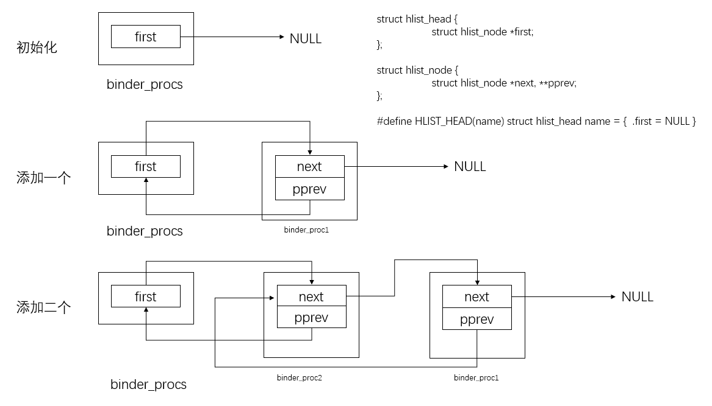
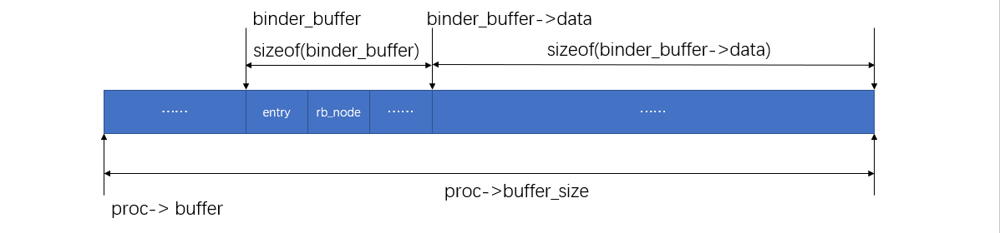
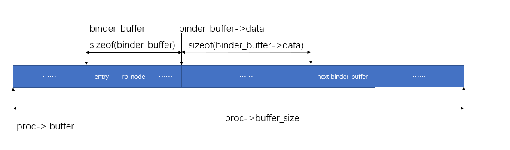
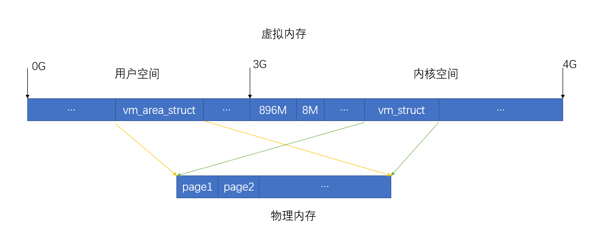

## binder_init

drivers/staging/android/binder.c

binder设备的初始化是在Binder驱动程序的初始化函数binder_init中。

```c
static int __init binder_init(void)
{
	int ret;

	binder_proc_dir_entry_root = proc_mkdir("binder", NULL);
	if (binder_proc_dir_entry_root)
		binder_proc_dir_entry_proc = proc_mkdir("proc", binder_proc_dir_entry_root);
	ret = misc_register(&binder_miscdev);
	if (binder_proc_dir_entry_root) {
		create_proc_read_entry("state", S_IRUGO, binder_proc_dir_entry_root, binder_read_proc_state, NULL);
		create_proc_read_entry("stats", S_IRUGO, binder_proc_dir_entry_root, binder_read_proc_stats, NULL);
		create_proc_read_entry("transactions", S_IRUGO, binder_proc_dir_entry_root, binder_read_proc_transactions, NULL);
		create_proc_read_entry("transaction_log", S_IRUGO, binder_proc_dir_entry_root, binder_read_proc_transaction_log, &binder_transaction_log);
		create_proc_read_entry("failed_transaction_log", S_IRUGO, binder_proc_dir_entry_root, binder_read_proc_transaction_log, &binder_transaction_log_failed);
	}
	return ret;
}

device_initcall(binder_init);
```

创建了`/proc/binder/proc`目录

## binder_open

drivers/staging/android/binder.c

先初始化 `binder_procs`, `HLIST_HEAD`是一个宏

```c
static HLIST_HEAD(binder_procs);
```

````c
#define LIST_HEAD(name) \
	struct list_head name = LIST_HEAD_INIT(name)
````

展开就是

```c
struct list_head binder_procs = LIST_HEAD_INIT(name)
```

再展开就是

```c
struct list_head binder_procs = {&binder_procs,&binder_procs}
```


include\linux\list.h

```c
struct hlist_head {
	struct hlist_node *first;
};

struct hlist_node {
	struct hlist_node *next, **pprev;
};

#define HLIST_HEAD(name) struct hlist_head name = {  .first = NULL }

static inline void hlist_add_head(struct hlist_node *n, struct hlist_head *h)
{
	struct hlist_node *first = h->first;
	n->next = first;
	if (first)
		first->pprev = &n->next;
	h->first = n;
	n->pprev = &h->first; // 指向前一个next
}
```


drivers\staging\android\binder.c

```c
// 初始化一个全局的binder_procs
static HLIST_HEAD(binder_procs);
//等价于 
// struct hlist_head binder_procs = {  .first = NULL }

....
    
static int binder_open(struct inode *nodp, struct file *filp)
{
	struct binder_proc *proc;

	...

	proc = kzalloc(sizeof(*proc), GFP_KERNEL); // 分配binder_proc结构体内存空间
	if (proc == NULL)
		return -ENOMEM;
	get_task_struct(current);
	proc->tsk = current;     // 关联当前宿主进程
	/*
		static inline void INIT_LIST_HEAD(struct list_head *list)
		{
			list->next = list;
			list->prev = list;
		}
	*/
	// include\linux\list.h
	INIT_LIST_HEAD(&proc->todo);    // 初始化todo列表，此时还是一个空列表
	init_waitqueue_head(&proc->wait); // 初始化一个空的等待队列
	proc->default_priority = task_nice(current); //进程优先级
	
	mutex_lock(&binder_lock);
    
    // 信息统计，现在有调用binder_open的次数
	binder_stats.obj_created[BINDER_STAT_PROC]++;
	/*
	struct hlist_head {
		struct hlist_node *first;
	};

	struct hlist_node {
		struct hlist_node *next, **pprev;
	};
	*/
	hlist_add_head(&proc->proc_node, &binder_procs); // 添加到 binder_procs 队列中
	proc->pid = current->group_leader->pid;
	INIT_LIST_HEAD(&proc->delivered_death);  
	filp->private_data = proc;
	mutex_unlock(&binder_lock);

	if (binder_proc_dir_entry_proc) {
		char strbuf[11];
		snprintf(strbuf, sizeof(strbuf), "%u", proc->pid);
		remove_proc_entry(strbuf, binder_proc_dir_entry_proc);
        // 创建一个 /proc/binder/proc/<pid>的文件，读取它，就可以知道进程pid的binder线程池、binder_node、binder_ref、以及内核缓冲区等信息
		create_proc_read_entry(strbuf, S_IRUGO, binder_proc_dir_entry_proc, binder_read_proc_proc, proc);
	}

	return 0;
}
```

打开binder设备就会创建`binder_proc`结构体，表示打开binder设备的宿主进程。最后所有的`binder_proc`都保存在内核的`binder_procs`中。




## binder_mmap

drivers/staging/android/binder.c

```c
static int binder_mmap(struct file *filp, struct vm_area_struct *vma)
{
	int ret;
	// 描述内核地址空间
	struct vm_struct *area;
	struct binder_proc *proc = filp->private_data;
	const char *failure_string;
	struct binder_buffer *buffer;

	// biner驱动最多可以为进程分配4M内核缓冲区来传输进程间通信数据
	if ((vma->vm_end - vma->vm_start) > SZ_4M)
		vma->vm_end = vma->vm_start + SZ_4M;

	...

	// Binder驱动为进程分配的内核缓冲区在用户空间只可以读，而不可以写
	if (vma->vm_flags & FORBIDDEN_MMAP_FLAGS) {
		ret = -EPERM;
		failure_string = "bad vm_flags";
		goto err_bad_arg;
	}
	// 不可以拷贝以及禁止设置可能会执行写操作标志位
	vma->vm_flags = (vma->vm_flags | VM_DONTCOPY) & ~VM_MAYWRITE;
	
	// 是否重复调用mmap
	if (proc->buffer) {
		ret = -EBUSY;
		failure_string = "already mapped";
		goto err_already_mapped;
	}
	// vma已经在用户空间申请了vma->vm_end - vma->vm_start 的空间
    // 在进程的内核空间也申请一段大小为 vma->vm_end - vma->vm_start 的空间
	// 最后这两段地址都会指向一样的物理内存
	area = get_vm_area(vma->vm_end - vma->vm_start, VM_IOREMAP);
	if (area == NULL) {
		ret = -ENOMEM;
		failure_string = "get_vm_area";
		goto err_get_vm_area_failed;
	}
	// 内核缓冲区的地址保存在buffer中
	proc->buffer = area->addr;
	// 用户空间的地址与内核的缓冲区地址之间的差值
	proc->user_buffer_offset = vma->vm_start - (uintptr_t)proc->buffer;

	...
        
	// 计算需要的页面数
	proc->pages = kzalloc(sizeof(proc->pages[0]) * ((vma->vm_end - vma->vm_start) / PAGE_SIZE), GFP_KERNEL);
	if (proc->pages == NULL) {
		ret = -ENOMEM;
		failure_string = "alloc page array";
		goto err_alloc_pages_failed;
	}
	// 缓冲区的大小
	proc->buffer_size = vma->vm_end - vma->vm_start;
	
	vma->vm_ops = &binder_vm_ops;
	vma->vm_private_data = proc;

	// 先分配一页的空间，按需分配
	// 完成内核空间地址与用户空间地址的映射
	if (binder_update_page_range(proc, 1, proc->buffer, proc->buffer + PAGE_SIZE, vma)) {
		ret = -ENOMEM;
		failure_string = "alloc small buf";
		goto err_alloc_small_buf_failed;
	}
    
	buffer = proc->buffer;
	INIT_LIST_HEAD(&proc->buffers);
	list_add(&buffer->entry, &proc->buffers);
	// 刚分配的空间可以使用
	buffer->free = 1;
    // 根据buffer的大小挂载到free_buffers红黑树中
	binder_insert_free_buffer(proc, buffer);
    
    // 设置异步事务的内核缓冲区大小为其一半，防止异步事务消耗过多的内核缓冲区
	proc->free_async_space = proc->buffer_size / 2;
	barrier();
	proc->files = get_files_struct(current);
	proc->vma = vma;

	/*printk(KERN_INFO "binder_mmap: %d %lx-%lx maps %p\n", proc->pid, vma->vm_start, vma->vm_end, proc->buffer);*/
	return 0;

err_alloc_small_buf_failed:
	kfree(proc->pages);
	proc->pages = NULL;
err_alloc_pages_failed:
	vfree(proc->buffer);
	proc->buffer = NULL;
err_get_vm_area_failed:
err_already_mapped:
err_bad_arg:
	printk(KERN_ERR "binder_mmap: %d %lx-%lx %s failed %d\n", proc->pid, vma->vm_start, vma->vm_end, failure_string, ret);
	return ret;
}
```


```c
/**
	proc：目标进程
	allocate：如果是1就是分配物理页面，否则就是释放
	start：内核缓冲区的起始地址
	end：内核缓冲区的结束地址
	vma：指向用户空间的地址
*/
static int binder_update_page_range(struct binder_proc *proc, int allocate, void *start, void *end, struct vm_area_struct *vma)
{
	void *page_addr;
	unsigned long user_page_addr;
	struct vm_struct tmp_area;
	struct page **page;
	// include/linux/mm_types.h
	struct mm_struct *mm;

	...

	if (end <= start)
		return 0;

	if (vma)
		mm = NULL;
	else
		// linux/sched.h
	    // kernel/fork.c
		// 进程的内存信息	
		mm = get_task_mm(proc->tsk);

	if (mm) {
		down_write(&mm->mmap_sem);
		vma = proc->vma;
	}

	if (allocate == 0)
		goto free_range;

	if (vma == NULL) {
		printk(KERN_ERR "binder: %d: binder_alloc_buf failed to "
		       "map pages in userspace, no vma\n", proc->pid);
		goto err_no_vma;
	}

	for (page_addr = start; page_addr < end; page_addr += PAGE_SIZE) {
		int ret;
		struct page **page_array_ptr;
		// 获取一个内核地址空间的页面指针
		page = &proc->pages[(page_addr - proc->buffer) / PAGE_SIZE];

		BUG_ON(*page);
		
		// 为内核地址空间分配一个物理页面
		*page = alloc_page(GFP_KERNEL | __GFP_ZERO);
		if (*page == NULL) {
			printk(KERN_ERR "binder: %d: binder_alloc_buf failed "
			       "for page at %p\n", proc->pid, page_addr);
			goto err_alloc_page_failed;
		}
        
        // 页面分配成功
		tmp_area.addr = page_addr;
		// Linux内核规定，在（3G+896M+8M）~4G范围内的任意一块内核地址空间都必须要在后面保留一块空的地址空间来作为安全保护区，用来检测非法指针
		tmp_area.size = PAGE_SIZE + PAGE_SIZE /* guard page? */;
		page_array_ptr = page;
		// 内核空间地址映射
		ret = map_vm_area(&tmp_area, PAGE_KERNEL, &page_array_ptr);
		if (ret) {
			printk(KERN_ERR "binder: %d: binder_alloc_buf failed "
			       "to map page at %p in kernel\n",
			       proc->pid, page_addr);
			goto err_map_kernel_failed;
		}
		// 计算用户空间的地址
		user_page_addr =
			(uintptr_t)page_addr + proc->user_buffer_offset;
		// 用户空间地址映射
		ret = vm_insert_page(vma, user_page_addr, page[0]);
		if (ret) {
			printk(KERN_ERR "binder: %d: binder_alloc_buf failed "
			       "to map page at %lx in userspace\n",
			       proc->pid, user_page_addr);
			goto err_vm_insert_page_failed;
		}
		/* vm_insert_page does not seem to increment the refcount */
	}
	if (mm) {
		up_write(&mm->mmap_sem);
		mmput(mm);
	}
	return 0;

free_range:
	for (page_addr = end - PAGE_SIZE; page_addr >= start;
	     page_addr -= PAGE_SIZE) {
		page = &proc->pages[(page_addr - proc->buffer) / PAGE_SIZE];
		if (vma)
			zap_page_range(vma, (uintptr_t)page_addr +
				proc->user_buffer_offset, PAGE_SIZE, NULL);
err_vm_insert_page_failed:
		unmap_kernel_range((unsigned long)page_addr, PAGE_SIZE);
err_map_kernel_failed:
		__free_page(*page);
		*page = NULL;
err_alloc_page_failed:
		;
	}
err_no_vma:
	if (mm) {
		up_write(&mm->mmap_sem);
		mmput(mm);
	}
	return -ENOMEM;
}
```


```c
static void binder_insert_free_buffer(struct binder_proc *proc, struct binder_buffer *new_buffer)
{
	// 红黑树
    struct rb_node **p = &proc->free_buffers.rb_node;
    
	struct rb_node *parent = NULL;
	struct binder_buffer *buffer;
	size_t buffer_size;
	size_t new_buffer_size;

	BUG_ON(!new_buffer->free);

    // 计算这个binder_buffer大小，注意是有效数据大小
	new_buffer_size = binder_buffer_size(proc, new_buffer);

	...

	while (*p) {
		parent = *p;
		buffer = rb_entry(parent, struct binder_buffer, rb_node);
		BUG_ON(!buffer->free);

		buffer_size = binder_buffer_size(proc, buffer);

		if (new_buffer_size < buffer_size)
			p = &parent->rb_left;
		else
			p = &parent->rb_right;
	}
	rb_link_node(&new_buffer->rb_node, parent, p);
	rb_insert_color(&new_buffer->rb_node, &proc->free_buffers);
}
```

方法binder_insert_free_buffer就是根据binder_buffer大小挂载到 `free_buffers`的红黑树中


```c
static size_t binder_buffer_size(struct binder_proc *proc, struct binder_buffer *buffer)
{
	if (list_is_last(&buffer->entry, &proc->buffers))
		return proc->buffer + proc->buffer_size - (void *)buffer->data;
	else
		return (size_t)list_entry(buffer->entry.next,struct binder_buffer, entry) - (size_t)buffer->data;
}
```

*include/linux/list.h*

```c
static inline int list_is_last(const struct list_head *list, const struct list_head *head)
{
	return list->next == head;
}

/**
 * list_entry - get the struct for this entry
 * @ptr:	the &struct list_head pointer.
 * @type:	the type of the struct this is embedded in.
 * @member:	the name of the list_struct within the struct.
 */
#define list_entry(ptr, type, member) \
	container_of(ptr, type, member)
```

一个缓冲区的大小指的是其有效数据块的大小，计算一个`binder_buffer`的大小时，需要考虑它在进程内核缓冲区列表`buffers`中的位置，如果是最后一个元素，那么有效数据就是从它的data成员开始一直到buffer最后。




如果不是最后，缓冲区`binder_buffer`的大小就是data到下一个binder_buffer范围。






