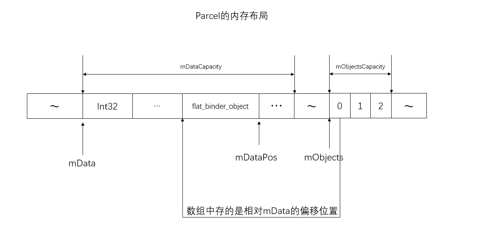
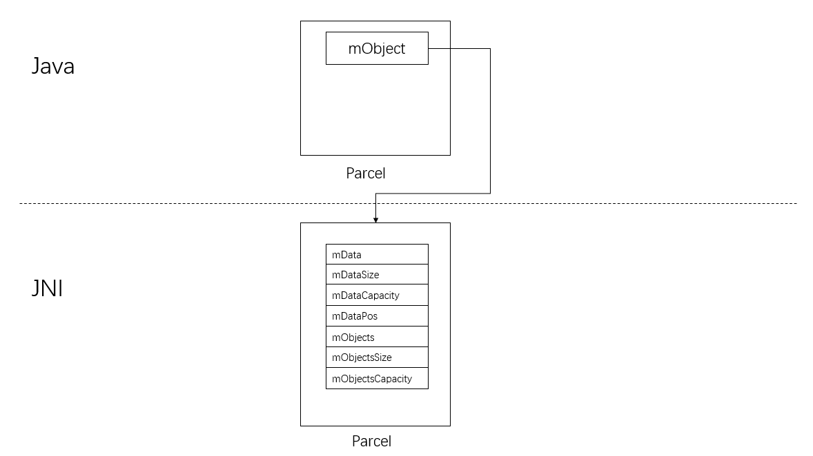
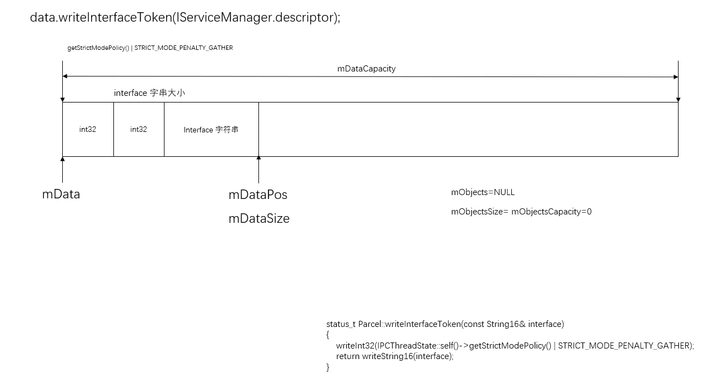
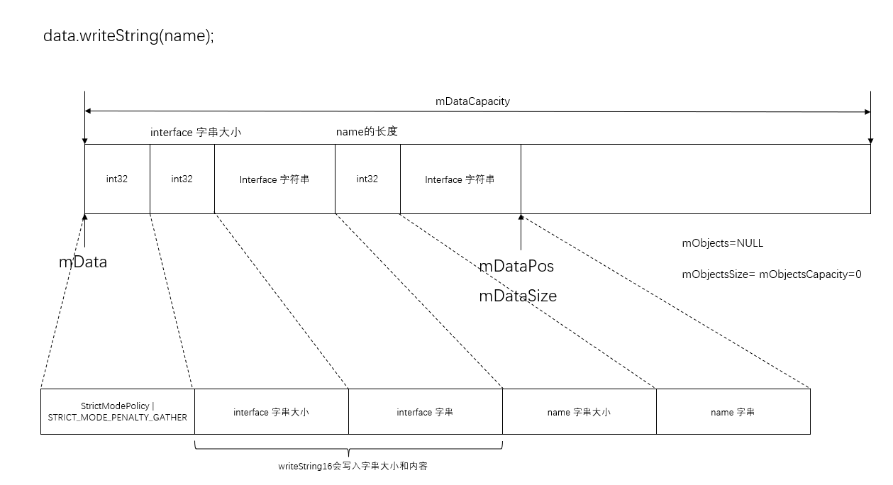
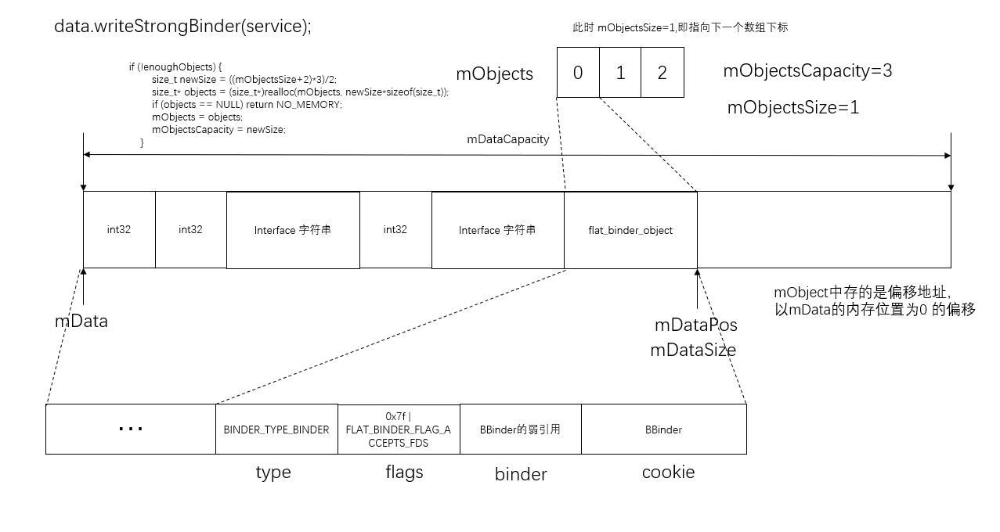

## java层Parcel与C++层Parcel之间的关系

Parcel 在内存中的结构是一块连续的内存，会动根据需要自动扩展大小

frameworks\base\core\jni\android_util_Binder.cpp

```c++
int register_android_os_Binder(JNIEnv* env)
{
    if (int_register_android_os_Binder(env) < 0)
        return -1;
    if (int_register_android_os_BinderInternal(env) < 0)
        return -1;
    if (int_register_android_os_BinderProxy(env) < 0)
        return -1;
    if (int_register_android_os_Parcel(env) < 0)
        return -1;
    return 0;
}
```

frameworks\base\core\jni\android_util_Binder.cpp

```c++
static struct parcel_offsets_t
{
    jfieldID mObject;
    jfieldID mOwnObject;
} gParcelOffsets;


const char* const kParcelPathName = "android/os/Parcel";

static int int_register_android_os_Parcel(JNIEnv* env)
{
    jclass clazz;
	
    .....
	// android.os.Parcel.java类
    clazz = env->FindClass(kParcelPathName);
    LOG_FATAL_IF(clazz == NULL, "Unable to find class android.os.Parcel");

    gParcelOffsets.mObject = env->GetFieldID(clazz, "mObject", "I");
    gParcelOffsets.mOwnObject = env->GetFieldID(clazz, "mOwnObject", "I");

    clazz = env->FindClass("android/os/StrictMode");
    LOG_FATAL_IF(clazz == NULL, "Unable to find class android.os.StrictMode");
    gStrictModeCallbackOffsets.mClass = (jclass) env->NewGlobalRef(clazz);
    gStrictModeCallbackOffsets.mCallback = env->GetStaticMethodID(
        clazz, "onBinderStrictModePolicyChange", "(I)V");
    LOG_FATAL_IF(gStrictModeCallbackOffsets.mCallback == NULL,
                 "Unable to find strict mode callback.");

    return AndroidRuntime::registerNativeMethods(env, kParcelPathName,gParcelMethods, NELEM(gParcelMethods));
}
```

一般在java层使用`Parcel`是这样的

```java
 Parcel data = Parcel.obtain();
 data.writeInterfaceToken(IServiceManager.descriptor);
 data.writeString(name);
 data.writeStrongBinder(service);
```

frameworks\base\core\java\android\os\Parcel.java

```java
   
public static Parcel obtain() {
        final Parcel[] pool = sOwnedPool;
        synchronized (pool) {
            Parcel p;
            for (int i=0; i<POOL_SIZE; i++) {
                p = pool[i];
                if (p != null) {
                    pool[i] = null;
                    if (DEBUG_RECYCLE) {
                        p.mStack = new RuntimeException();
                    }
                    return p;
                }
            }
        }
        return new Parcel(0);
    }
```


frameworks\base\core\java\android\os\Parcel.java

```java
private native void init(int obj);

private Parcel(int obj) {
        if (DEBUG_RECYCLE) {
            mStack = new RuntimeException();
        }
        //Log.i(TAG, "Initializing obj=0x" + Integer.toHexString(obj), mStack);
        init(obj);
    }
```

构造函数中调用`init`方法

frameworks\base\core\jni\android_util_Binder.cpp

```c++
static const JNINativeMethod gParcelMethods[] = {
    {"dataSize",            "()I", (void*)android_os_Parcel_dataSize},
    {"dataAvail",           "()I", (void*)android_os_Parcel_dataAvail},
    {"dataPosition",        "()I", (void*)android_os_Parcel_dataPosition},
    {"dataCapacity",        "()I", (void*)android_os_Parcel_dataCapacity},
    {"setDataSize",         "(I)V", (void*)android_os_Parcel_setDataSize},
    {"setDataPosition",     "(I)V", (void*)android_os_Parcel_setDataPosition},
    {"setDataCapacity",     "(I)V", (void*)android_os_Parcel_setDataCapacity},
    {"writeNative",         "([BII)V", (void*)android_os_Parcel_writeNative},
    {"writeInt",            "(I)V", (void*)android_os_Parcel_writeInt},
    {"writeLong",           "(J)V", (void*)android_os_Parcel_writeLong},
    {"writeFloat",          "(F)V", (void*)android_os_Parcel_writeFloat},
    {"writeDouble",         "(D)V", (void*)android_os_Parcel_writeDouble},
    {"writeString",         "(Ljava/lang/String;)V", (void*)android_os_Parcel_writeString},
    {"writeStrongBinder",   "(Landroid/os/IBinder;)V", (void*)android_os_Parcel_writeStrongBinder},
    {"writeFileDescriptor", "(Ljava/io/FileDescriptor;)V", (void*)android_os_Parcel_writeFileDescriptor},
    {"createByteArray",     "()[B", (void*)android_os_Parcel_createByteArray},
    {"readInt",             "()I", (void*)android_os_Parcel_readInt},
    {"readLong",            "()J", (void*)android_os_Parcel_readLong},
    {"readFloat",           "()F", (void*)android_os_Parcel_readFloat},
    {"readDouble",          "()D", (void*)android_os_Parcel_readDouble},
    {"readString",          "()Ljava/lang/String;", (void*)android_os_Parcel_readString},
    {"readStrongBinder",    "()Landroid/os/IBinder;", (void*)android_os_Parcel_readStrongBinder},
    {"internalReadFileDescriptor",  "()Ljava/io/FileDescriptor;", (void*)android_os_Parcel_readFileDescriptor},
    {"openFileDescriptor",  "(Ljava/lang/String;I)Ljava/io/FileDescriptor;", (void*)android_os_Parcel_openFileDescriptor},
    {"closeFileDescriptor", "(Ljava/io/FileDescriptor;)V", (void*)android_os_Parcel_closeFileDescriptor},
    {"freeBuffer",          "()V", (void*)android_os_Parcel_freeBuffer},
    {"init",                "(I)V", (void*)android_os_Parcel_init},
    {"writeInterfaceToken", "(Ljava/lang/String;)V", (void*)android_os_Parcel_writeInterfaceToken},
   ...
};
```

frameworks\base\core\jni\android_util_Binder.cpp

```c++
// clazz就是java层的Parcel对象，前面我们传了一个0过来，即parcelInt为0，
static void android_os_Parcel_init(JNIEnv* env, jobject clazz, jint parcelInt)
{
    // 把0传过来，即parcel为NULL
    Parcel* parcel = (Parcel*)parcelInt;
    int own = 0;
    if (!parcel) {
        own = 1;
        parcel = new Parcel;
    } else {
        //LOGI("Initializing obj %p: given existing Parcel %p\n", clazz, parcel);
    }
    if (parcel == NULL) {
        jniThrowException(env, "java/lang/OutOfMemoryError", NULL);
        return;
    }
    //LOGI("Initializing obj %p from C++ Parcel %p, own=%d\n", clazz, parcel, own);
    env->SetIntField(clazz, gParcelOffsets.mOwnObject, own);
    env->SetIntField(clazz, gParcelOffsets.mObject, (int)parcel);
}
```


frameworks\base\libs\binder\Parcel.cpp

```c++
Parcel::Parcel()
{
    initState();
}


....

void Parcel::initState()
{
    mError = NO_ERROR;
    mData = 0;                // 数据指针，也是数据在本进程空间内的内存地址
    mDataSize = 0;			  // 存储的数据大小（使用的空间大小）
    mDataCapacity = 0;        // 数据空间大小，如果不够的话，可以动态增长
    mDataPos = 0;             // 数据游标，当前数据的位置，和读文件的游标类似，可以手动设置	typedef __u32 binder_size_t
	。。。
    mObjects = NULL;          // flat_binder_object 对象的位置数据，注意这个是个指针（其实就是个数组），里面保存的不是数据，而且地址的偏移
    mObjectsSize = 0;         // mObjects 数组的大小
    mObjectsCapacity = 0;     // mObjects 偏移地址（再次强调一次是地址）的空间大小，同样可以动态增长
    mNextObjectHint = 0;
    mHasFds = false;
    mFdsKnown = true;
    mOwner = NULL;             // 释放内存的方法
}
```

`Parcel`内部有`mData`和`mObjects`两个缓冲区，`mData`是一个数据缓冲区，用来记录整数、字符串、Binder对象；`mObjects`是一个偏移数组，记录了数据缓冲区`mData`中所有Binder对象的偏移位置，只要与`mData`地址相加就可以得到Binder的地址。




frameworks\base\core\jni\android_util_Binder.cpp

```c++
Parcel* parcelForJavaObject(JNIEnv* env, jobject obj)
{
    if (obj) {
        Parcel* p = (Parcel*)env->GetIntField(obj, gParcelOffsets.mObject);
        if (p != NULL) {
            return p;
        }
        jniThrowException(env, "java/lang/IllegalStateException", "Parcel has been finalized!");
    }
    return NULL;
}
```

如果在java层使用`Parcel.obtain()`来获取一个`Parcel`对象，`Parcel`在初始化时调用`init`本地函数，就会执行到`android_os_Parcel_init`，该方法中会初始化一个C++层的`Parcel`对象放在java层的`Parcel`对象中的`mObject`中，所以`parcelForJavaObject`获取到的就是一个C++层的`Parcel`对象。

frameworks\base\core\jni\android_util_Binder.cpp

```c++
static void android_os_Parcel_writeInterfaceToken(JNIEnv* env, jobject clazz, jstring name)
{
    // clazz是java层的Parcel对象
    // parcel是C++层的Parcel对象
    Parcel* parcel = parcelForJavaObject(env, clazz);
    if (parcel != NULL) {
        // In the current implementation, the token is just the serialized interface name that
        // the caller expects to be invoking
        const jchar* str = env->GetStringCritical(name, 0);
        if (str != NULL) {
            parcel->writeInterfaceToken(String16(str, env->GetStringLength(name)));
            env->ReleaseStringCritical(name, str);
        }
    }
}
```


frameworks\base\libs\binder\Parcel.cpp

```c++
status_t Parcel::writeInterfaceToken(const String16& interface)
{
    writeInt32(IPCThreadState::self()->getStrictModePolicy() | STRICT_MODE_PENALTY_GATHER);
    // currently the interface identification token is just its name as a string
    return writeString16(interface);
}
```


frameworks\base\libs\binder\Parcel.cpp

```c++
static void android_os_Parcel_writeStrongBinder(JNIEnv* env, jobject clazz, jobject object)
{
    Parcel* parcel = parcelForJavaObject(env, clazz);
    if (parcel != NULL) {
        const status_t err = parcel->writeStrongBinder(ibinderForJavaObject(env, object));
        if (err != NO_ERROR) {
            jniThrowException(env, "java/lang/OutOfMemoryError", NULL);
        }
    }
}
```


frameworks\base\core\jni\android_util_Binder.cpp

```c++
sp<IBinder> ibinderForJavaObject(JNIEnv* env, jobject obj)
{
    // obj是java层的 android.os.IBinder 对象
    if (obj == NULL) return NULL;

    // 查看obj是否是 android.os.Binder 类
    if (env->IsInstanceOf(obj, gBinderOffsets.mClass)) {
        JavaBBinderHolder* jbh = (JavaBBinderHolder*) env->GetIntField(obj, gBinderOffsets.mObject);
        return jbh != NULL ? jbh->get(env) : NULL;
    }

    // android.os.BinderProxy
    // 这个是给ServiceManager使用的
    if (env->IsInstanceOf(obj, gBinderProxyOffsets.mClass)) {
        return (IBinder*) env->GetIntField(obj, gBinderProxyOffsets.mObject);
    }

    LOGW("ibinderForJavaObject: %p is not a Binder object", obj);
    return NULL;
}
```


frameworks\base\libs\binder\Parcel.cpp

```c++
status_t Parcel::writeStrongBinder(const sp<IBinder>& val)
{
    return flatten_binder(ProcessState::self(), val, this);
}
```


frameworks\base\libs\binder\Parcel.cpp

```c++
inline static status_t finish_flatten_binder(const sp<IBinder>& binder, const flat_binder_object& flat, Parcel* out)
{
    return out->writeObject(flat, false);
}

status_t flatten_binder(const sp<ProcessState>& proc,
    const sp<IBinder>& binder, Parcel* out)
{
    flat_binder_object obj;
    
    obj.flags = 0x7f | FLAT_BINDER_FLAG_ACCEPTS_FDS;
    if (binder != NULL) {
        IBinder *local = binder->localBinder();
        if (!local) {
            BpBinder *proxy = binder->remoteBinder();
            if (proxy == NULL) {
                LOGE("null proxy");
            }
            const int32_t handle = proxy ? proxy->handle() : 0;
            obj.type = BINDER_TYPE_HANDLE;
            obj.handle = handle;
            obj.cookie = NULL;
        } else {
            obj.type = BINDER_TYPE_BINDER;
            obj.binder = local->getWeakRefs();
            obj.cookie = local;
        }
    } else {
        obj.type = BINDER_TYPE_BINDER;
        obj.binder = NULL;
        obj.cookie = NULL;
    }
    
    return finish_flatten_binder(binder, obj, out);
}
```



## Parcel基本操作

### writeInterfaceToken

位于mData开头，记录目标服务的服务名，由两部分组成：strict_mode和name。其中strict_mode的类型是int，name的类型是字符串型。

```c++
status_t Parcel::writeInterfaceToken(const String16& interface)
{
    writeInt32(IPCThreadState::self()->getStrictModePolicy() | STRICT_MODE_PENALTY_GATHER);
    // currently the interface identification token is just its name as a string
    return writeString16(interface);
}
```



### writeIntXXX

整型：bool、char和byte的数据序列化时会强制转换为32位，然后才写入mData指向的内存空间，以保证写入的数据是4字节对齐的。

```c++
status_t Parcel::writeInt32(int32_t val)
{
    return writeAligned(val);
}

status_t Parcel::writeInt64(int64_t val)
{
    return writeAligned(val);
}
```


```c++
status_t Parcel::finishWrite(size_t len)
{
    mDataPos += len;
    LOGV("finishWrite Setting data pos of %p to %d\n", this, mDataPos);
    if (mDataPos > mDataSize) {
        mDataSize = mDataPos;
        LOGV("finishWrite Setting data size of %p to %d\n", this, mDataSize);
    }
    //printf("New pos=%d, size=%d\n", mDataPos, mDataSize);
    return NO_ERROR;
}
```


```c++
template<class T>
status_t Parcel::writeAligned(T val) {
    COMPILE_TIME_ASSERT_FUNCTION_SCOPE(PAD_SIZE(sizeof(T)) == sizeof(T));

    // 容量够
    if ((mDataPos+sizeof(val)) <= mDataCapacity) {
restart_write:
        *reinterpret_cast<T*>(mData+mDataPos) = val;
        return finishWrite(sizeof(val));
    }

    status_t err = growData(sizeof(val));
    if (err == NO_ERROR) goto restart_write;
    return err;
}
```

宏定义`COMPILE_TIME_ASSERT_FUNCTION_SCOPE`主要是确定要字节对齐,是4或者4的整数倍


frameworks\base\libs\binder\Parcel.cpp

```c++
#define PAD_SIZE(s) (((s)+3)&~3)
```

取4的倍数。

~3：0x1111 1100

运算符&：取与，这样结果的后2位一定是0，就是4的倍数

+3：向上取，看3的二进制数：0x0011，如果数`s`最后2位都不是0，加上3，就可以向上进位，然后~3将最后2位变为0，比如

当s=1时：0x0000 0001 + 0x0000 0011 = 0x0000 0100 ，0x0000 0100 & 0x1111 1100 = 0x0000 0100 = 4

当s=2时：0x0000 0010 + 0x0000 0011 = 0x0000 0101,  0x0000 0101 & 0x1111 1100 = 0x0000 0100 = 4

当s=4时：0x0000 0100 + 0x0000 0011 = 0x0000 0111,  0x0000 0111 & 0x1111 1100 = 0x0000 0100 = 4

当s=5时：0x0000 0101 + 0x0000 1000 = 0x0000 1000,  0x0000 1000 & 0x1111 1100 = 0x0000 1000 = 8

### writeString

```c++
status_t Parcel::writeCString(const char* str)
{
    // 字符数组后面有个\0，所以+1
    return write(str, strlen(str)+1);
}

status_t Parcel::write(const void* data, size_t len)
{
    void* const d = writeInplace(len);
    if (d) {
        memcpy(d, data, len);
        return NO_ERROR;
    }
    return mError;
}
```





```c++
void* Parcel::writeInplace(size_t len)
{
    // 计算出4字节的倍数
    const size_t padded = PAD_SIZE(len);

    // padded如果为负数，说明整数溢出，len太大了，返回NULL
    // sanity check for integer overflow
    if (mDataPos+padded < mDataPos) {
        return NULL;
    }

    
    if ((mDataPos+padded) <= mDataCapacity) {
        // 还在容量范围内
restart_write:
        //printf("Writing %ld bytes, padded to %ld\n", len, padded);
        uint8_t* const data = mData+mDataPos;

        // Need to pad at end?
        if (padded != len) {
            // 两个值不相等，说明len不是4的倍数，那么扩容出来的padded末尾需要填充
#if BYTE_ORDER == BIG_ENDIAN
            // 大端模式
            static const uint32_t mask[4] = {
                0x00000000, 0xffffff00, 0xffff0000, 0xff000000
            };
#endif
#if BYTE_ORDER == LITTLE_ENDIAN
            // 小端模式
            static const uint32_t mask[4] = {
                0x00000000, 0x00ffffff, 0x0000ffff, 0x000000ff
            };
#endif
            //printf("Applying pad mask: %p to %p\n", (void*)mask[padded-len],
            //    *reinterpret_cast<void**>(data+padded-4));
            
            *reinterpret_cast<uint32_t*>(data+padded-4) &= mask[padded-len];
        }

        finishWrite(padded);
        return data;
    }

    // 容量不够了，先扩容
    status_t err = growData(padded);
    if (err == NO_ERROR) goto restart_write;
    return NULL;
}
```


### writeString

字符串型：前4个字节记录字符的数目，然后才是字符内容，一个字符占两个字节。最后还要进行4字节对齐，不足4字节的部分填充0。

```c++
status_t Parcel::writeString8(const String8& str)
{
    status_t err = writeInt32(str.bytes());
    if (err == NO_ERROR) {
        err = write(str.string(), str.bytes()+1);
    }
    return err;
}

status_t Parcel::writeString16(const String16& str)
{
    return writeString16(str.string(), str.size());
}

status_t Parcel::writeString16(const char16_t* str, size_t len)
{
    if (str == NULL) return writeInt32(-1); // 空字符串写入-1
    
    status_t err = writeInt32(len); // 写入长度
    if (err == NO_ERROR) {
        len *= sizeof(char16_t);
        uint8_t* data = (uint8_t*)writeInplace(len+sizeof(char16_t));
        if (data) {
            memcpy(data, str, len);
            *reinterpret_cast<char16_t*>(data+len) = 0;
            return NO_ERROR;
        }
        err = mError;
    }
    return err;
}
```


### writeStrongBinder

```c++
status_t Parcel::writeStrongBinder(const sp<IBinder>& val)
{
    return flatten_binder(ProcessState::self(), val, this);
}

inline static status_t finish_flatten_binder(const sp<IBinder>& binder, const flat_binder_object& flat, Parcel* out)
{
    return out->writeObject(flat, false);
}

status_t flatten_binder(const sp<ProcessState>& proc,const sp<IBinder>& binder, Parcel* out)
{
    flat_binder_object obj;
    
    // 0x7f用来描述将要注册的Service组件在处理一个进程间通信请求时，它所使用的Server线程的优先级不能低于0x7f
    // FLAT_BINDER_FLAG_ACCEPTS_FDS表示可以将包含文件描述符的进程间通信数据传递给将要注册Service组件处理
    
    obj.flags = 0x7f | FLAT_BINDER_FLAG_ACCEPTS_FDS;
    if (binder != NULL) {
        IBinder *local = binder->localBinder();
        if (!local) {
            BpBinder *proxy = binder->remoteBinder();
            if (proxy == NULL) {
                LOGE("null proxy");
            }
            const int32_t handle = proxy ? proxy->handle() : 0;
            obj.type = BINDER_TYPE_HANDLE;
            obj.handle = handle;
            obj.cookie = NULL;
        } else {
            obj.type = BINDER_TYPE_BINDER;
            obj.binder = local->getWeakRefs();
            obj.cookie = local;
        }
    } else {
        obj.type = BINDER_TYPE_BINDER;
        obj.binder = NULL;
        obj.cookie = NULL;
    }
    
    return finish_flatten_binder(binder, obj, out);
}
```


drivers/staging/android/binder.h

```c++
struct flat_binder_object {
	/* 8 bytes for large_flat_header. */
	unsigned long		type;   //binder类型：可以为BINDER_TYPE_BINDER或BINDER_TYPE_HANDLE等类型
	unsigned long		flags;

	/* 8 bytes of data. */
	union {
		void		*binder;	/* local object */ // 当type=BINDER_TYPE_BINDER时，它指向Binder对象位于C++层的本地Binder对象(即BBinder对象)的弱引用
		signed long	handle;		/* remote object */ // 当type=BINDER_TYPE_HANDLE时，它等于Binder对象在Binder驱动中对应的Binder实体的Binder引用的描述
	};

	/* extra data associated with local object */
	void			*cookie;  // 当type=BINDER_TYPE_BINDER时才有效，它指向Binder对象位于C++层的本地Binder对象(即BBinder对象)。
};
```




### writeObject

结构体flat_binder_object的序列化表示，所以占的大小就是结构体的大小。在mObjects中会存储Object在mData中的偏移

```c++
status_t Parcel::writeObject(const flat_binder_object& val, bool nullMetaData)
{
    // 容量是不是够
    const bool enoughData = (mDataPos+sizeof(val)) <= mDataCapacity;
    
    const bool enoughObjects = mObjectsSize < mObjectsCapacity;
    if (enoughData && enoughObjects) {
restart_write:
        *reinterpret_cast<flat_binder_object*>(mData+mDataPos) = val;
        
        // Need to write meta-data?
        if (nullMetaData || val.binder != NULL) {
            mObjects[mObjectsSize] = mDataPos; // 偏移地址
            acquire_object(ProcessState::self(), val, this);
            mObjectsSize++;
        }
        
        // remember if it's a file descriptor
        if (val.type == BINDER_TYPE_FD) {
            mHasFds = mFdsKnown = true;
        }

        return finishWrite(sizeof(flat_binder_object));
    }

    if (!enoughData) {
        const status_t err = growData(sizeof(val));
        if (err != NO_ERROR) return err;
    }
    if (!enoughObjects) {
        size_t newSize = ((mObjectsSize+2)*3)/2;
        size_t* objects = (size_t*)realloc(mObjects, newSize*sizeof(size_t));
        if (objects == NULL) return NO_MEMORY;
        mObjects = objects;
        mObjectsCapacity = newSize;
    }
    
    goto restart_write;
}
```


frameworks\base\libs\binder\Parcel.cpp

```c++
// len 表示数据的大小
status_t Parcel::growData(size_t len)
{
    size_t newSize = ((mDataSize+len)*3)/2;
    return (newSize <= mDataSize)
            ? (status_t) NO_MEMORY    // 申请的内存比之前的mDataSize还小，说明
            : continueWrite(newSize);
}
```

Parcel增加容量时，是按`1.5`倍进行增长


frameworks\base\libs\binder\Parcel.cpp

```c++

// desired表示想要的空间大小
status_t Parcel::continueWrite(size_t desired)
{
    // If shrinking, first adjust for any objects that appear
    // after the new data size.
    size_t objectsSize = mObjectsSize;
    if (desired < mDataSize) {
        // 这是要释放一部分空间
        // 减少object的数量直到空间符合要求为止。
        if (desired == 0) {
            // 清楚所有object
            objectsSize = 0;
        } else {
            
            // mObjects中存的是flat_binder_object的偏移地址，以mData地址作为偏移起始
            // 所以 mObjects[objectsSize-1] 就能得出该flat_binder_object占据的空间
            while (objectsSize > 0) {
                if (mObjects[objectsSize-1] < desired)
                    break;
                objectsSize--;
            }
        }
    }
    
    if (mOwner) {
        // mOwner是一个清理函数指针
        // If the size is going to zero, just release the owner's data.
        // desired被设为0了，表示需要清理缓存了
        if (desired == 0) {
            freeData();
            return NO_ERROR;
        }

        // If there is a different owner, we need to take
        // posession.
        uint8_t* data = (uint8_t*)malloc(desired);
        if (!data) {
            mError = NO_MEMORY;
            return NO_MEMORY;
        }
        size_t* objects = NULL;
        
        if (objectsSize) {
            objects = (size_t*)malloc(objectsSize*sizeof(size_t));
            if (!objects) {
                mError = NO_MEMORY;
                return NO_MEMORY;
            }

            // Little hack to only acquire references on objects
            // we will be keeping.
            size_t oldObjectsSize = mObjectsSize;
            mObjectsSize = objectsSize;
            acquireObjects();
            mObjectsSize = oldObjectsSize;
        }
        
        if (mData) {
            memcpy(data, mData, mDataSize < desired ? mDataSize : desired);
        }
        if (objects && mObjects) {
            memcpy(objects, mObjects, objectsSize*sizeof(size_t));
        }
        //LOGI("Freeing data ref of %p (pid=%d)\n", this, getpid());
        mOwner(this, mData, mDataSize, mObjects, mObjectsSize, mOwnerCookie);
        mOwner = NULL;

        mData = data;
        mObjects = objects;
        mDataSize = (mDataSize < desired) ? mDataSize : desired;
        LOGV("continueWrite Setting data size of %p to %d\n", this, mDataSize);
        mDataCapacity = desired;
        mObjectsSize = mObjectsCapacity = objectsSize;
        mNextObjectHint = 0;

    } else if (mData) {
        
        // 如果当前存在数据，则做realloc操作
        if (objectsSize < mObjectsSize) {
            // Need to release refs on any objects we are dropping.
            const sp<ProcessState> proc(ProcessState::self());
            for (size_t i=objectsSize; i<mObjectsSize; i++) {
                const flat_binder_object* flat
                    = reinterpret_cast<flat_binder_object*>(mData+mObjects[i]);
                if (flat->type == BINDER_TYPE_FD) {
                    // will need to rescan because we may have lopped off the only FDs
                    mFdsKnown = false;
                }
                release_object(proc, *flat, this);
            }
            size_t* objects =
                (size_t*)realloc(mObjects, objectsSize*sizeof(size_t));
            if (objects) {
                mObjects = objects;
            }
            mObjectsSize = objectsSize;
            mNextObjectHint = 0;
        }

        // We own the data, so we can just do a realloc().
        if (desired > mDataCapacity) {
            uint8_t* data = (uint8_t*)realloc(mData, desired);
            if (data) {
                mData = data;
                mDataCapacity = desired;
            } else if (desired > mDataCapacity) {
                mError = NO_MEMORY;
                return NO_MEMORY;
            }
        } else {
            mDataSize = desired;
            LOGV("continueWrite Setting data size of %p to %d\n", this, mDataSize);
            if (mDataPos > desired) {
                mDataPos = desired;
                LOGV("continueWrite Setting data pos of %p to %d\n", this, mDataPos);
            }
        }
        
    } else {
        // 第一次初始化，直接做malloc操作
        // This is the first data.  Easy!
        uint8_t* data = (uint8_t*)malloc(desired);
        if (!data) {
            mError = NO_MEMORY;
            return NO_MEMORY;
        }
        
        if(!(mDataCapacity == 0 && mObjects == NULL
             && mObjectsCapacity == 0)) {
            LOGE("continueWrite: %d/%p/%d/%d", mDataCapacity, mObjects, mObjectsCapacity, desired);
        }
        
        mData = data;
        mDataSize = mDataPos = 0;
        LOGV("continueWrite Setting data size of %p to %d\n", this, mDataSize);
        LOGV("continueWrite Setting data pos of %p to %d\n", this, mDataPos);
        mDataCapacity = desired;
    }

    return NO_ERROR;
}
```


```c++
void Parcel::freeData()
{
    freeDataNoInit();
    initState();
}


void Parcel::freeDataNoInit()
{
    if (mOwner) {
        //LOGI("Freeing data ref of %p (pid=%d)\n", this, getpid());
        mOwner(this, mData, mDataSize, mObjects, mObjectsSize, mOwnerCookie);
    } else {
        releaseObjects();
        // 释放mData地址占用的空间 
        if (mData) free(mData);
        // 释放mObjects地址占用的空间 
        if (mObjects) free(mObjects);
    }
}

void Parcel::releaseObjects()
{
    const sp<ProcessState> proc(ProcessState::self());
    // flat_binder_object 的数量
    size_t i = mObjectsSize;
    uint8_t* const data = mData;
    size_t* const objects = mObjects;
    while (i > 0) {
        i--;
        // mData + 偏移位置得到 flat_binder_object 的地址
        const flat_binder_object* flat = reinterpret_cast<flat_binder_object*>(data+objects[i]);
        release_object(proc, *flat, this);
    }
}
```


```c++
void release_object(const sp<ProcessState>& proc, const flat_binder_object& obj, const void* who)
{
    switch (obj.type) {
        case BINDER_TYPE_BINDER:
            if (obj.binder) {
                LOG_REFS("Parcel %p releasing reference on local %p", who, obj.cookie);
                static_cast<IBinder*>(obj.cookie)->decStrong(who);
            }
            return;
        case BINDER_TYPE_WEAK_BINDER:
            if (obj.binder)
                static_cast<RefBase::weakref_type*>(obj.binder)->decWeak(who);
            return;
        case BINDER_TYPE_HANDLE: {
            const sp<IBinder> b = proc->getStrongProxyForHandle(obj.handle);
            if (b != NULL) {
                LOG_REFS("Parcel %p releasing reference on remote %p", who, b.get());
                b->decStrong(who);
            }
            return;
        }
        case BINDER_TYPE_WEAK_HANDLE: {
            const wp<IBinder> b = proc->getWeakProxyForHandle(obj.handle);
            if (b != NULL) b.get_refs()->decWeak(who);
            return;
        }
        case BINDER_TYPE_FD: {
            if (obj.cookie != (void*)0) close(obj.handle);
            return;
        }
    }

    LOGE("Invalid object type 0x%08lx", obj.type);
}
```


