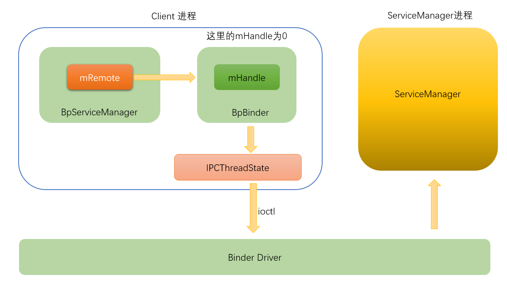
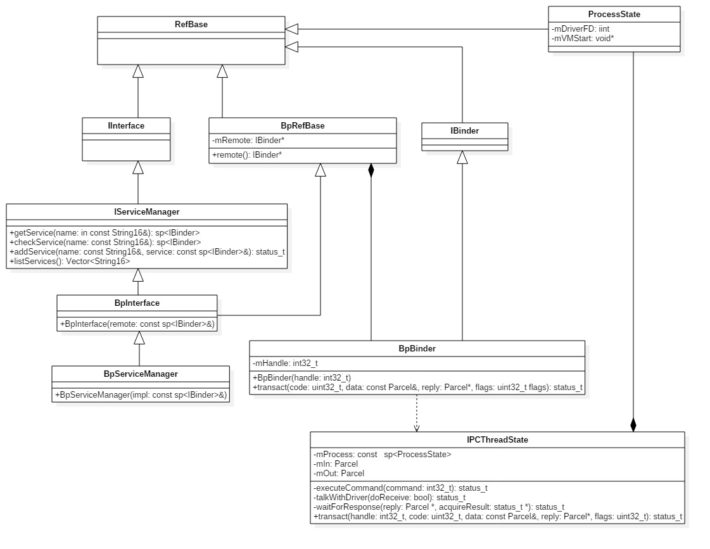
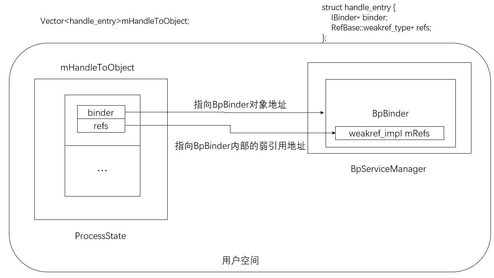

## defaultServiceManager

以下描述`client`进程获取`ServiceManager`的代理的过程，`client`获取service代理对象的过程中就表示想要与binder驱动通信，就会open Binder设备，映射`1M - 8K`大小的空间

，设置最大的binder线程数15。






`client`获取Service Manager的代理对象可以使用`defaultServiceManager()`方法

frameworks\base\libs\binder\IServiceManager.cpp 

```c
sp<IServiceManager> defaultServiceManager()
{
    if (gDefaultServiceManager != NULL) return gDefaultServiceManager;
    {
        AutoMutex _l(gDefaultServiceManagerLock);
        if (gDefaultServiceManager == NULL) {
            gDefaultServiceManager = interface_cast<IServiceManager>(ProcessState::self()->getContextObject(NULL));
        }
    }
    
    return gDefaultServiceManager;
}
```

## ProcessState::self()

frameworks\base\libs\binder\ProcessState.cpp

```c
sp<ProcessState> ProcessState::self()
{
    if (gProcess != NULL) return gProcess;
    
    AutoMutex _l(gProcessMutex);
    if (gProcess == NULL) gProcess = new ProcessState;
    return gProcess;
}
```

`ProcessState`是每个进程一份，`client`进程调用`ProcessState::self()`就会打开binder设备，并将文件描述符放在`mDriverFD`中。如果一个进程使用`ProcessState`这个类来初始化`Binder`服务，这个进程的Binder内核内存上限就是`BINDER_VM_SIZE`，也就是`1MB-8KB`

能否不用ProcessState来初始化Binder服务，来突破1M-8KB的限制？

答案是当然可以了，Binder服务的初始化有两步，open打开Binder驱动，mmap在Binder驱动中申请内核空间内存，所以我们只要手写open，mmap就可以轻松突破这个限制。源码中已经给了类似的例子。

```c
// frameworks\base\cmds\servicemanager\bctest.c
int main(int argc, char **argv)
{
    int fd;
    struct binder_state *bs;
    void *svcmgr = BINDER_SERVICE_MANAGER;

    bs = binder_open(128*1024);

   ...
    return 0;
}
```

那么能否随便申请内存大小呢？

答案肯定是不能的，在Binder驱动中mmap的具体实现中还有一个4M的限制。

那么可以可以申请的内存是`1MB-8KB`到`4M`吗？

不是的，如果是异步的话是这个值的一半，具体我们到分析binder驱动时再讲


frameworks\base\libs\binder\ProcessState.cpp

```c
#define BINDER_VM_SIZE ((1*1024*1024) - (4096 *2))  // 1M - 8K

ProcessState::ProcessState()
    : mDriverFD(open_driver())
    , mVMStart(MAP_FAILED)
    ...
{
    if (mDriverFD >= 0) {
        // XXX Ideally, there should be a specific define for whether we
        // have mmap (or whether we could possibly have the kernel module
        // availabla).
#if !defined(HAVE_WIN32_IPC)
        // mmap the binder, providing a chunk of virtual address space to receive transactions.
        mVMStart = mmap(0, BINDER_VM_SIZE, PROT_READ, MAP_PRIVATE | MAP_NORESERVE, mDriverFD, 0);
        if (mVMStart == MAP_FAILED) {
            // *sigh*
            LOGE("Using /dev/binder failed: unable to mmap transaction memory.\n");
            close(mDriverFD);
            mDriverFD = -1;
        }
#else
        mDriverFD = -1;
#endif
    }
    if (mDriverFD < 0) {
        // Need to run without the driver, starting our own thread pool.
    }
}
```


```c
static int open_driver()
{
    if (gSingleProcess) {
        return -1;
    }

    // 会调用驱动的binder_open方法
    int fd = open("/dev/binder", O_RDWR);
    if (fd >= 0) {
        fcntl(fd, F_SETFD, FD_CLOEXEC);
        int vers;
#if defined(HAVE_ANDROID_OS)
        status_t result = ioctl(fd, BINDER_VERSION, &vers);
#else
        status_t result = -1;
        errno = EPERM;
#endif
        if (result == -1) {
            LOGE("Binder ioctl to obtain version failed: %s", strerror(errno));
            close(fd);
            fd = -1;
        }
        if (result != 0 || vers != BINDER_CURRENT_PROTOCOL_VERSION) {
            LOGE("Binder driver protocol does not match user space protocol!");
            close(fd);
            fd = -1;
        }
#if defined(HAVE_ANDROID_OS)
        // 告诉binder驱动，该client进程最多可以有15个binder线程
        size_t maxThreads = 15;
        result = ioctl(fd, BINDER_SET_MAX_THREADS, &maxThreads);
        if (result == -1) {
            LOGE("Binder ioctl to set max threads failed: %s", strerror(errno));
        }
#endif
        
    } else {
        LOGW("Opening '/dev/binder' failed: %s\n", strerror(errno));
    }
    return fd;
}
```

调用完`open_driver`后，会在内核中生成该进程的`binder_proc`结构，用来描述该进程，再执行`mmap`后，映射了设备，分配了内核缓冲区，缓冲区的起始地址放在`mVMStart`中。

## getContextObject

frameworks\base\libs\binder\ProcessState.cpp

```c
sp<IBinder> ProcessState::getContextObject(const sp<IBinder>& caller)
{
    if (supportsProcesses()) {
        // 支持binder设备
        return getStrongProxyForHandle(0);
    } else {
        return getContextObject(String16("default"), caller);
    }
}

bool ProcessState::supportsProcesses() const
{
    return mDriverFD >= 0;
}
```


设备是支持binder设备的，所以会执行`getStrongProxyForHandle(0)`。这个`0`是一个句柄值，因为service Manager对应的句柄就是`0`


```c
struct handle_entry {
      IBinder* binder; // Binder代理对象，即BpBinder
      RefBase::weakref_type* refs; // 内部的一个弱引用计数对象
  };
```

frameworks\base\libs\binder\ProcessState.cpp

```c++
sp<IBinder> ProcessState::getStrongProxyForHandle(int32_t handle)
{
    sp<IBinder> result;

    AutoMutex _l(mLock);

    handle_entry* e = lookupHandleLocked(handle);

    if (e != NULL) {
        // We need to create a new BpBinder if there isn't currently one, OR we
        // are unable to acquire a weak reference on this current one.  See comment
        // in getWeakProxyForHandle() for more info about this.
        IBinder* b = e->binder;
        if (b == NULL || !e->refs->attemptIncWeak(this)) {
            b = new BpBinder(handle); 
            e->binder = b;
            if (b) e->refs = b->getWeakRefs();
            result = b;
        } else {
            // This little bit of nastyness is to allow us to add a primary
            // reference to the remote proxy when this team doesn't have one
            // but another team is sending the handle to us.
            result.force_set(b);
            e->refs->decWeak(this);
        }
    }

    return result;
}

ProcessState::handle_entry* ProcessState::lookupHandleLocked(int32_t handle)
{
    const size_t N=mHandleToObject.size();
    if (N <= (size_t)handle) {
        handle_entry e;
        e.binder = NULL;
        e.refs = NULL;
        status_t err = mHandleToObject.insertAt(e, N, handle+1-N);
        if (err < NO_ERROR) return NULL;
    }
    return &mHandleToObject.editItemAt(handle);
}
```

如果b为NULL，就会创建一个`BpBinder`,如果不为NULL，需要检查这个Binder代理对象是否还活着，即调用`attemptIncWeak`来尝试增加它的弱引用计数

frameworks\base\include\binder\ProcessState.h

```c++
class ProcessState : public virtual RefBase
{
public:
    static  sp<ProcessState>    self();

    static  void                setSingleProcess(bool singleProcess);

            void                setContextObject(const sp<IBinder>& object);
            sp<IBinder>         getContextObject(const sp<IBinder>& caller);
        
            void                setContextObject(const sp<IBinder>& object,
                                                 const String16& name);
            sp<IBinder>         getContextObject(const String16& name,
                                                 const sp<IBinder>& caller);
                                                 
            bool                supportsProcesses() const;

            void                startThreadPool();
                        
    typedef bool (*context_check_func)(const String16& name,
                                       const sp<IBinder>& caller,
                                       void* userData);
        
            bool                isContextManager(void) const;
            bool                becomeContextManager(
                                    context_check_func checkFunc,
                                    void* userData);

            sp<IBinder>         getStrongProxyForHandle(int32_t handle);
            wp<IBinder>         getWeakProxyForHandle(int32_t handle);
            void                expungeHandle(int32_t handle, IBinder* binder);

            void                setArgs(int argc, const char* const argv[]);
            int                 getArgC() const;
            const char* const*  getArgV() const;

            void                setArgV0(const char* txt);

            void                spawnPooledThread(bool isMain);
            
private:
    friend class IPCThreadState;
    
                                ProcessState();
                                ~ProcessState();

                                ProcessState(const ProcessState& o);
            ProcessState&       operator=(const ProcessState& o);
            
            struct handle_entry {
                IBinder* binder;
                RefBase::weakref_type* refs;
            };
            
            handle_entry*       lookupHandleLocked(int32_t handle);

            int                 mDriverFD;
            void*               mVMStart;
            
    mutable Mutex               mLock;  // protects everything below.
            
            Vector<handle_entry>mHandleToObject;

            bool                mManagesContexts;
            context_check_func  mBinderContextCheckFunc;
            void*               mBinderContextUserData;
            
            KeyedVector<String16, sp<IBinder> >
                                mContexts;


            String8             mRootDir;
            bool                mThreadPoolStarted;
    volatile int32_t            mThreadPoolSeq;
};
```

进程的binder代理对象都保存在`ProcessState`类的成员变量`mHandleToObject`中



## interface_cast

frameworks\base\include\binder\IInterface.h

```c
template<typename INTERFACE>
inline sp<INTERFACE> interface_cast(const sp<IBinder>& obj)
{
    return INTERFACE::asInterface(obj);
}
```

```c
#define DECLARE_META_INTERFACE(INTERFACE)                               \
    static const android::String16 descriptor;                          \
    static android::sp<I##INTERFACE> asInterface(                       \
            const android::sp<android::IBinder>& obj);                  \
    virtual const android::String16& getInterfaceDescriptor() const;    \
    I##INTERFACE();                                                     \
    virtual ~I##INTERFACE();                                            \
```


```c
DECLARE_META_INTERFACE(ServiceManager);
```

展开就是

```c
static const android::String16 descriptor;
static android::sp<IServiceManager> asInterface(const android::sp<android::IBinder>& obj);
virtual const android::String16& getInterfaceDescriptor() const;
IServiceManager(); 
virtual ~IServiceManager();
```


## asInterface


```c
IMPLEMENT_META_INTERFACE(ServiceManager, "android.os.IServiceManager");
```

```c
#define IMPLEMENT_META_INTERFACE(INTERFACE, NAME)                       \
    const android::String16 I##INTERFACE::descriptor(NAME);             \
    const android::String16&                                            \
            I##INTERFACE::getInterfaceDescriptor() const {              \
        return I##INTERFACE::descriptor;                                \
    }                                                                   \
    android::sp<I##INTERFACE> I##INTERFACE::asInterface(                \
            const android::sp<android::IBinder>& obj)                   \
    {                                                                   \
        android::sp<I##INTERFACE> intr;                                 \
        if (obj != NULL) {                                              \
            intr = static_cast<I##INTERFACE*>(                          \
                obj->queryLocalInterface(                               \
                        I##INTERFACE::descriptor).get());               \
            if (intr == NULL) {                                         \
                intr = new Bp##INTERFACE(obj);                          \
            }                                                           \
        }                                                               \
        return intr;                                                    \
    }                                                                   \
    I##INTERFACE::I##INTERFACE() { }                                    \
    I##INTERFACE::~I##INTERFACE() { }                                   \
```

```c++
const android::String16 IServiceManager:descriptor("android.os.IServiceManager");            
const android::String16& IServiceManager::getInterfaceDescriptor() const 
{              
    return IServiceManager::descriptor;                                
}                                                                   
android::sp<IServiceManager> IServiceManager::asInterface(const android::sp<android::IBinder>& obj)                   
{   
    	// obj就是BpBinder
        android::sp<IServiceManager> intr;                                 
        if (obj != NULL) {        
            
            // obj是一个智能指针，重写了-> 运算符，语句 p->m 被解释为 (p.operator->())->m
            // obj->queryLocalInterface(IServiceManager::descriptor) 返回一个另一个sp，只不过这个sp内部的m_ptr 是NULL
            // 所以调用get时返回了NULL
            intr = static_cast<IServiceManager*>(obj->queryLocalInterface(IServiceManager::descriptor).get());               
            if (intr == NULL) {                                         
                intr = new BpServiceManager(obj);                          
            }                                                           
        }                                                               
        return intr;                                                    
    }                                                                   
IServiceManager::IServiceManager() { }                                    
IServiceManager::~IServiceManager() { }                                   
```


frameworks\base\include\binder\BpBinder.h

```c++
class BpBinder : public IBinder
{
public:
                        BpBinder(int32_t handle);

    inline  int32_t     handle() const { return mHandle; }

    virtual const String16&    getInterfaceDescriptor() const;
    virtual bool        isBinderAlive() const;
    virtual status_t    pingBinder();
    virtual status_t    dump(int fd, const Vector<String16>& args);

    virtual status_t    transact(   uint32_t code,
                                    const Parcel& data,
                                    Parcel* reply,
                                    uint32_t flags = 0);

    virtual status_t    linkToDeath(const sp<DeathRecipient>& recipient,
                                    void* cookie = NULL,
                                    uint32_t flags = 0);
    virtual status_t    unlinkToDeath(  const wp<DeathRecipient>& recipient,
                                        void* cookie = NULL,
                                        uint32_t flags = 0,
                                        wp<DeathRecipient>* outRecipient = NULL);

    virtual void        attachObject(   const void* objectID,
                                        void* object,
                                        void* cleanupCookie,
                                        object_cleanup_func func);
    virtual void*       findObject(const void* objectID) const;
    virtual void        detachObject(const void* objectID);

    virtual BpBinder*   remoteBinder();

            status_t    setConstantData(const void* data, size_t size);
            void        sendObituary();

    class ObjectManager
    {
    public:
                    ObjectManager();
                    ~ObjectManager();

        void        attach( const void* objectID,
                            void* object,
                            void* cleanupCookie,
                            IBinder::object_cleanup_func func);
        void*       find(const void* objectID) const;
        void        detach(const void* objectID);

        void        kill();

    private:
                    ObjectManager(const ObjectManager&);
        ObjectManager& operator=(const ObjectManager&);

        struct entry_t
        {
            void* object;
            void* cleanupCookie;
            IBinder::object_cleanup_func func;
        };

        KeyedVector<const void*, entry_t> mObjects;
    };

protected:
    virtual             ~BpBinder();
    virtual void        onFirstRef();
    virtual void        onLastStrongRef(const void* id);
    virtual bool        onIncStrongAttempted(uint32_t flags, const void* id);

private:
    const   int32_t             mHandle; // 重要

    struct Obituary {
        wp<DeathRecipient> recipient;
        void* cookie;
        uint32_t flags;
    };

            void                reportOneDeath(const Obituary& obit);
            bool                isDescriptorCached() const;

    mutable Mutex               mLock;
            volatile int32_t    mAlive;
            volatile int32_t    mObitsSent;
            Vector<Obituary>*   mObituaries;
            ObjectManager       mObjects;
            Parcel*             mConstantData;
    mutable String16            mDescriptorCache;
};
```


frameworks\base\libs\binder\Binder.cpp

```c++
sp<IInterface>  IBinder::queryLocalInterface(const String16& descriptor)
{
    return NULL;
}
```

`BpBinder`的`queryLocalInterface`返方法返返回的是NULL，那么`asInterface`返回的就是`BpServiceManager`


frameworks\base\libs\binder\IServiceManager.cpp

```c++
class BpServiceManager : public BpInterface<IServiceManager>
{
public:
    BpServiceManager(const sp<IBinder>& impl)
        : BpInterface<IServiceManager>(impl)
    {
    }

    virtual sp<IBinder> getService(const String16& name) const
    {
        unsigned n;
        for (n = 0; n < 5; n++){
            sp<IBinder> svc = checkService(name);
            if (svc != NULL) return svc;
            LOGI("Waiting for service %s...\n", String8(name).string());
            sleep(1);
        }
        return NULL;
    }

    virtual sp<IBinder> checkService( const String16& name) const
    {
        Parcel data, reply;
        data.writeInterfaceToken(IServiceManager::getInterfaceDescriptor());
        data.writeString16(name);
        remote()->transact(CHECK_SERVICE_TRANSACTION, data, &reply);
        return reply.readStrongBinder();
    }

    virtual status_t addService(const String16& name, const sp<IBinder>& service)
    {
        Parcel data, reply;
        data.writeInterfaceToken(IServiceManager::getInterfaceDescriptor());
        data.writeString16(name);
        data.writeStrongBinder(service);
        status_t err = remote()->transact(ADD_SERVICE_TRANSACTION, data, &reply);
        return err == NO_ERROR ? reply.readExceptionCode() : err;
    }

    virtual Vector<String16> listServices()
    {
        Vector<String16> res;
        int n = 0;

        for (;;) {
            Parcel data, reply;
            data.writeInterfaceToken(IServiceManager::getInterfaceDescriptor());
            data.writeInt32(n++);
            status_t err = remote()->transact(LIST_SERVICES_TRANSACTION, data, &reply);
            if (err != NO_ERROR)
                break;
            res.add(reply.readString16());
        }
        return res;
    }
};
```


frameworks\base\include\binder\IInterface.h

```c++
template<typename INTERFACE>
class BpInterface : public INTERFACE, public BpRefBase
{
public:
                                BpInterface(const sp<IBinder>& remote);

protected:
    virtual IBinder*            onAsBinder();
};
```

