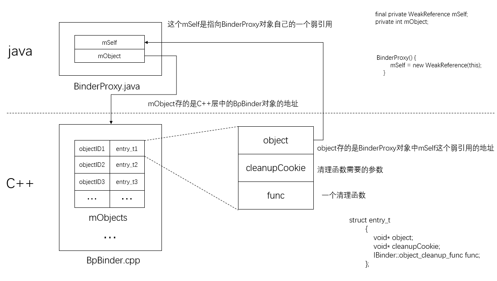
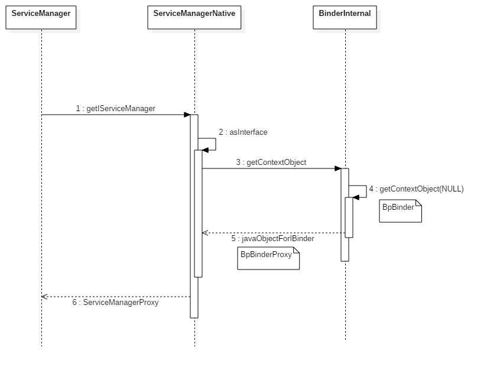

frameworks\base\core\java\android\os\ServiceManager.java

```java
public final class ServiceManager {
    private static final String TAG = "ServiceManager";

    private static IServiceManager sServiceManager;
    private static HashMap<String, IBinder> sCache = new HashMap<String, IBinder>();

    private static IServiceManager getIServiceManager() {
        if (sServiceManager != null) {
            return sServiceManager;
        }

        // Find the service manager
        // 最后得到的是java层的ServiceManagerProxy
        sServiceManager = ServiceManagerNative.asInterface(BinderInternal.getContextObject());
        return sServiceManager;
    }
    
    ....
 
 }
```

`BinderInternal.getContextObject()`返回的是一个java层的`BinderProxy`对象


frameworks\base\core\java\com\android\internal\os\BinderInternal.java

````java
public class BinderInternal {

	 /**
     * Return the global "context object" of the system.  This is usually
     * an implementation of IServiceManager, which you can use to find
     * other services.
     */
    public static final native IBinder getContextObject();
    
    ....
    
    
}
````


frameworks\base\core\jni\android_util_Binder.cpp

```c++
static jobject android_os_BinderInternal_getContextObject(JNIEnv* env, jobject clazz)
{
 	// 这个就是BpBinder
    sp<IBinder> b = ProcessState::self()->getContextObject(NULL);
    
    // 如果是Binder代理对象（BpBinder），就会返回BinderProxy对象
    return javaObjectForIBinder(env, b);
}
```

这里`getContextObject`传了一个NULL承参数，即0过来，表示想要获取ServiceManager的代理对象，b就是`BpBinder`,那么`javaObjectForIBinder`返回的就是`BpBinderProxy`对象。

在分析`javaObjectForIBinder`之前先看看几个数据结构

```c++
static struct bindernative_offsets_t
{
    // Class state.
    jclass mClass;                   // 指向java层的Binder类对象，android.os.Binder.java
    jmethodID mExecTransact;         // java层的Binder类中的execTransact方法

    // Object state.
    jfieldID mObject;                // java层的Binder类中的mObject属性

} gBinderOffsets;
```

`gBinderOffsets`保存了`Binder.java`类本身以及其成员方法`execTransact()`和成员属性`mObject`，这为JNI层访问Java层提供通道。另外通过查询获取Java层 binder信息后保存到`gBinderOffsets`，而不再需要每次查找binder类信息的方式能大幅提高效率，是由于每次查询需要花费较多的CPU时间，尤其是频繁访问时，但用额外的结构体来保存这些信息，是以空间换时间的方法。

在Android系统开始过程中，`Zygote`启动时会有一个"虚拟机注册过程"，该过程调用`AndroidRuntime::startReg()`方法来完成`JNI`方法的注册

frameworks\base\core\jni\AndroidRuntime.cpp

```c++
int AndroidRuntime::startReg(JNIEnv* env)
{
    androidSetCreateThreadFunc((android_create_thread_fn) javaCreateThreadEtc);
    env->PushLocalFrame(200);

    // 注册jni方法
    if (register_jni_procs(gRegJNI, NELEM(gRegJNI), env) < 0) {
        env->PopLocalFrame(NULL);
        return -1;
    }
    env->PopLocalFrame(NULL);
    return 0;
}
```

`gRegJNI `是一个数组，记录所有需要注册的JNI方法，其中有一项便是

frameworks\base\core\jni\AndroidRuntime.cpp

```c++
static const RegJNIRec gRegJNI[] = {
...
    REG_JNI(register_android_os_SystemProperties),
    // *****  重点部分  *****
    REG_JNI(register_android_os_Binder),
    // *****  重点部分  *****
    REG_JNI(register_android_os_Parcel),
...  
};
```


frameworks/base/core/jni/android_util_Binder.cpp

```c++
const char* const kBinderInternalPathName = "com/android/internal/os/BinderInternal";

int register_android_os_Binder(JNIEnv* env)
{
    // 注册Binder类的 jin方法
    if (int_register_android_os_Binder(env) < 0)
        return -1;
    // 注册 BinderInternal类的jni方法
    if (int_register_android_os_BinderInternal(env) < 0)
        return -1;
    // 注册BinderProxy类的jni方法
    if (int_register_android_os_BinderProxy(env) < 0)
        return -1;
    if (int_register_android_os_Parcel(env) < 0)
        return -1;
    return 0;
}
```

frameworks/base/core/jni/android_util_Binder.cpp

```c++
const char* const kBinderPathName = "android/os/Binder";

static int int_register_android_os_Binder(JNIEnv* env)
{
    jclass clazz;

    clazz = env->FindClass(kBinderPathName);
    LOG_FATAL_IF(clazz == NULL, "Unable to find class android.os.Binder");

    gBinderOffsets.mClass = (jclass) env->NewGlobalRef(clazz);
    gBinderOffsets.mExecTransact = env->GetMethodID(clazz, "execTransact", "(IIII)Z");
    assert(gBinderOffsets.mExecTransact);

    gBinderOffsets.mObject = env->GetFieldID(clazz, "mObject", "I");
    assert(gBinderOffsets.mObject);

    return AndroidRuntime::registerNativeMethods(env, kBinderPathName,gBinderMethods, NELEM(gBinderMethods));
}
```

这个时候`gBinderOffsets`就被初始化了。


frameworks/base/core/jni/android_util_Binder.cpp

```c++
static struct binderproxy_offsets_t
{
    // Class state.
    jclass mClass;              // java层android.os.BinderProxy类
    jmethodID mConstructor;     // 无参的构造函数
    jmethodID mSendDeathNotice; // sendDeathNotice方法

    // Object state.
    jfieldID mObject;           
    jfieldID mSelf;

} gBinderProxyOffsets;

static struct weakreference_offsets_t
{
    // Class state.
    jclass mClass;
    jmethodID mGet;

} gWeakReferenceOffsets;
```

```c++
const char* const kBinderProxyPathName = "android/os/BinderProxy";

static int int_register_android_os_BinderProxy(JNIEnv* env)
{
    jclass clazz;

    clazz = env->FindClass("java/lang/ref/WeakReference");
    LOG_FATAL_IF(clazz == NULL, "Unable to find class java.lang.ref.WeakReference");
    gWeakReferenceOffsets.mClass = (jclass) env->NewGlobalRef(clazz);
    gWeakReferenceOffsets.mGet = env->GetMethodID(clazz, "get", "()Ljava/lang/Object;");
    assert(gWeakReferenceOffsets.mGet);

    clazz = env->FindClass("java/lang/Error");
    LOG_FATAL_IF(clazz == NULL, "Unable to find class java.lang.Error");
    gErrorOffsets.mClass = (jclass) env->NewGlobalRef(clazz);
    
    clazz = env->FindClass(kBinderProxyPathName);
    LOG_FATAL_IF(clazz == NULL, "Unable to find class android.os.BinderProxy");

    gBinderProxyOffsets.mClass = (jclass) env->NewGlobalRef(clazz);
    gBinderProxyOffsets.mConstructor = env->GetMethodID(clazz, "<init>", "()V");
    assert(gBinderProxyOffsets.mConstructor);
    gBinderProxyOffsets.mSendDeathNotice = env->GetStaticMethodID(clazz, "sendDeathNotice", "(Landroid/os/IBinder$DeathRecipient;)V");
    assert(gBinderProxyOffsets.mSendDeathNotice);

    gBinderProxyOffsets.mObject = env->GetFieldID(clazz, "mObject", "I");
    assert(gBinderProxyOffsets.mObject);
    gBinderProxyOffsets.mSelf = env->GetFieldID(clazz, "mSelf", "Ljava/lang/ref/WeakReference;");
    assert(gBinderProxyOffsets.mSelf);

    return AndroidRuntime::registerNativeMethods(
        env, kBinderProxyPathName,
        gBinderProxyMethods, NELEM(gBinderProxyMethods));
}
```

了解这些数据结构以后，再来看`javaObjectForIBinder`


sp<IBinder> b = ProcessState::self()->getContextObject(NULL);

```c++
jobject javaObjectForIBinder(JNIEnv* env, const sp<IBinder>& val)
{
    // val 就是BpBinder对象
    if (val == NULL) return NULL;

    // 用来检查IBinder是一个Binder代理对象，还是一个javaBBinder本地对象
    if (val->checkSubclass(&gBinderOffsets)) {
        // One of our own!
        jobject object = static_cast<JavaBBinder*>(val.get())->object();
        //printf("objectForBinder %p: it's our own %p!\n", val.get(), object);
        return object;
    }

    // For the rest of the function we will hold this lock, to serialize
    // looking/creation of Java proxies for native Binder proxies.
    AutoMutex _l(mProxyLock);

    // Someone else's...  do we know about it?
    // 调用Binder代理对象的findObject来检查当前进程之前是否已经为它创建过一个BinderProxy对象了
    // 一个弱引用
    jobject object = (jobject)val->findObject(&gBinderProxyOffsets);
    if (object != NULL) {
        // 查看 BinderProxy是否已经失效
        jobject res = env->CallObjectMethod(object, gWeakReferenceOffsets.mGet);
        if (res != NULL) {
            LOGV("objectForBinder %p: found existing %p!\n", val.get(), res);
            return res;
        }
        LOGV("Proxy object %p of IBinder %p no longer in working set!!!", object, val.get());
        //  到这里就表示BinderProxy已经失效
        android_atomic_dec(&gNumProxyRefs);
        // Binder代理对象解除与一个无效的BinderProxy对象之间的关系
        val->detachObject(&gBinderProxyOffsets);
        env->DeleteGlobalRef(object);
    }
    

    // 创建一个java服务代理对象（BinderProxy）
    object = env->NewObject(gBinderProxyOffsets.mClass, gBinderProxyOffsets.mConstructor);
    if (object != NULL) {
        LOGV("objectForBinder %p: created new %p!\n", val.get(), object);
        // The proxy holds a reference to the native object.
        
        // 关联Binder代理对象，mObject保存了Binder代理对象的地址
        env->SetIntField(object, gBinderProxyOffsets.mObject, (int)val.get());
        // 现在有个java服务代理对象引用了Binder代理对象，所以增在Binder代理对象的强引用计数
        val->incStrong(object);

        // The native object needs to hold a weak reference back to the
        // proxy, so we can retrieve the same proxy if it is still active.
        // 回去BinderProxy对象中的mSelf这个弱引用
        jobject refObject = env->NewGlobalRef(
                env->GetObjectField(object, gBinderProxyOffsets.mSelf));
        
        // 调用BpBinder这个attachObject
        val->attachObject(&gBinderProxyOffsets, refObject,jnienv_to_javavm(env), proxy_cleanup);

        // Note that a new object reference has been created.
        android_atomic_inc(&gNumProxyRefs);
        incRefsCreated(env);
    }

    return object;
}

static JavaVM* jnienv_to_javavm(JNIEnv* env)
{
    JavaVM* vm;
    return env->GetJavaVM(&vm) >= 0 ? vm : NULL;
}

static JNIEnv* javavm_to_jnienv(JavaVM* vm)
{
    JNIEnv* env;
    return vm->GetEnv((void **)&env, JNI_VERSION_1_4) >= 0 ? env : NULL;
}

static void proxy_cleanup(const void* id, void* obj, void* cleanupCookie)
{
    android_atomic_dec(&gNumProxyRefs);
    JNIEnv* env = javavm_to_jnienv((JavaVM*)cleanupCookie);
    env->DeleteGlobalRef((jobject)obj);
}

```

`checkSubclass`需要靠子类重写，要不然默认就是false

frameworks\base\libs\binder\Binder.cpp

```c++
bool IBinder::checkSubclass(const void* /*subclassID*/) const
{
    return false;
}
```


frameworks\base\libs\binder\Binder.cpp

```c++
class JavaBBinder : public BBinder
{
    public:
        bool    checkSubclass(const void* subclassID) const
        {
            return subclassID == &gBinderOffsets;
        }

        jobject object() const
        {
            return mObject;
        }
    
    ...

	private:
        JavaVM* const   mVM;
        jobject const   mObject;
}
```


Binder代理对象是如何与一个java服务代理对象建立关联的?

Binder代理对象内部有个成员变量`mObject`,它的类型为`ObjectManager`,用来管理与该Binder代理对象关联的外部对象。

frameworks\base\include\binder\BpBinder.h

```c++
class ObjectManager
{
    public:
                    ObjectManager();
                    ~ObjectManager();

        void        attach( const void* objectID,
                            void* object,
                            void* cleanupCookie,
                            IBinder::object_cleanup_func func);
        void*       find(const void* objectID) const;
        void        detach(const void* objectID);

        void        kill();

    private:
                    ObjectManager(const ObjectManager&);
        ObjectManager& operator=(const ObjectManager&);

        struct entry_t
        {
            void* object; // 指向一个外部对象的一个弱引用对象
            void* cleanupCookie;   // 是函数指针func所指向的清理函数的一个调用参数
            IBinder::object_cleanup_func func; // 清理成员变量object所指向的外部对象 
        };

        KeyedVector<const void*, entry_t> mObjects;
    };
```




frameworks\base\libs\binder\BpBinder.cpp

```c++
void BpBinder::attachObject(const void* objectID, void* object, void* cleanupCookie, object_cleanup_func func)
{
    AutoMutex _l(mLock);
    LOGV("Attaching object %p to binder %p (manager=%p)", object, this, &mObjects);
    mObjects.attach(objectID, object, cleanupCookie, func);
}
```


frameworks\base\core\java\android\os\ServiceManagerNative.java

```c++
static public IServiceManager asInterface(IBinder obj)
    {
        if (obj == null) {
            return null;
        }
    	// 这个obj就是BinderProxy对象,而BinderProxy对象的queryLocalInterface返回的是null
        IServiceManager in = (IServiceManager)obj.queryLocalInterface(descriptor);
        if (in != null) {
            return in;
        }
        
        return new ServiceManagerProxy(obj);
    }
```

frameworks\base\core\java\android\os\Binder.java

```java
final class BinderProxy implements IBinder {
   ...
    public IInterface queryLocalInterface(String descriptor) {
        return null;
    }
    
  	....  
  }
```



