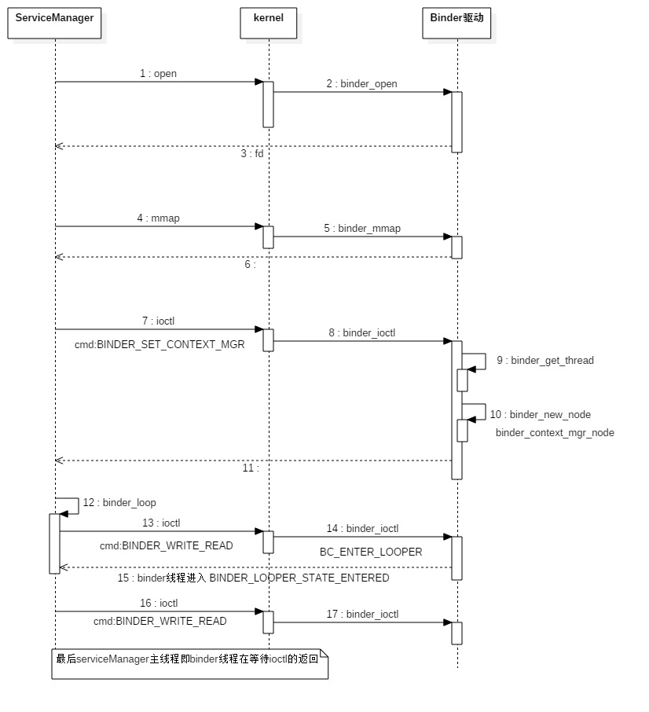

## main

Service Manager是由init进程负责启动的，而init是在系统启动时启动的，因此Service Manager也是在系统系统启动时启动的。

启动流程：

1. 打开binder设备，此时binder驱动会在内核创建`binder_proc`来关联该进程
2. 注册成为上下文管理者，使用ioctl发送`BINDER_SET_CONTEXT_MGR`，binder驱动会将该线程设置为binder线程，创建`binder_thread`，并创建`binder_node`
3. 使用ioctl发送`BINDER_WRITE_READ`，请求`BC_ENTER_LOOPER`，binder驱动收到后，会给binder线程设置`BINDER_LOOPER_STATE_ENTERED`状态，表示立即返回到用户空间
4. 用ioctl发送`BINDER_WRITE_READ`，再次请求`BC_ENTER_LOOPER`，由于这次没有数据，binder会挂起该线程，等带client的访问

frameworks/base/cmds/servicemanager/service_manager.c

```c++
int main(int argc, char **argv)
{
    struct binder_state *bs;
    void *svcmgr = BINDER_SERVICE_MANAGER;

    // 1.打开binder设备
    
	// kmalloc() 申请的内存位于物理内存映射区域，而且在物理上也是连续的，
	// 它们与真实的物理地址只有一个固定的偏移，因为存在较简单的转换关系，
	// 所以对申请的内存大小有限制，不能超过128KB
    bs = binder_open(128*1024);

    // 2.注册成为上下文管理者
    if (binder_become_context_manager(bs)) {
        LOGE("cannot become context manager (%s)\n", strerror(errno));
        return -1;
    }

    svcmgr_handle = svcmgr;
    //3.循环等待client请求
    binder_loop(bs, svcmgr_handler);
    return 0;
}
```

一般client与别的进程的service进行交互时，service都会有自己的本地Binder对象，但是serviceManager是一个特殊的service，它的本地对象是一个虚拟的对象`BINDER_SERVICE_MANAGER`，这个虚拟的Binder本地对象的地址等于0，并且在Binder驱动中引用了它的Binder引用的句柄值也是0


frameworks\base\cmds\servicemanager\binder.h

```c#
/* the one magic object */
#define BINDER_SERVICE_MANAGER ((void*) 0)
```


frameworks/base/cmds/servicemanager/binder.c

```c
struct binder_state
{
    int fd;           // binder_open后会返回一个文件描述符，通过该fd，可以找到内核中的file结构体，通过该file结构体可以找到打开该文件的进程
    void *mapped;     // 内核缓冲区的起始地址
    unsigned mapsize; //映射的内核缓冲区的空间大小
};
```

## binder_open

打开binder设备，并且映射binder设备文件，mapsize就是`128K`,即`128K`的内核缓冲区，调用`binder_open`和内核就会为该进程创建一个`binder_proc`,用来描述该进程在内核中的状态。

frameworks\base\cmds\servicemanager\binder.c

```c
struct binder_state *binder_open(unsigned mapsize)
{
    struct binder_state *bs;

    // 分配binder_state内存空间，bs就是指向该内存空间的地址
    bs = malloc(sizeof(*bs));
    if (!bs) {
        errno = ENOMEM;
        return 0;
    }

    // 打开binder设备，会调用驱动的binder_open,在内核中创建binder_proc
    bs->fd = open("/dev/binder", O_RDWR);
    if (bs->fd < 0) {
        fprintf(stderr,"binder: cannot open device (%s)\n",strerror(errno));
        goto fail_open;
    }

    // 由前面可知，mapsize是128K
    bs->mapsize = mapsize;
    bs->mapped = mmap(NULL, mapsize, PROT_READ, MAP_PRIVATE, bs->fd, 0);
    if (bs->mapped == MAP_FAILED) {
        fprintf(stderr,"binder: cannot map device (%s)\n",strerror(errno));
        goto fail_map;
    }
    return bs;

fail_map:
    close(bs->fd);
fail_open:
    free(bs);
    return 0;
}
```


drivers\staging\android\binder.c

```c
static int binder_open(struct inode *nodp, struct file *filp)
{
    // 此时初始化的时候还是null
	struct binder_proc *proc;

	if (binder_debug_mask & BINDER_DEBUG_OPEN_CLOSE)
		printk(KERN_INFO "binder_open: %d:%d\n", current->group_leader->pid, current->pid);

    // 分配binder_proc内存空间，proc就是指向该空间的地址
	proc = kzalloc(sizeof(*proc), GFP_KERNEL);
	if (proc == NULL)
		return -ENOMEM;
    
    // #define get_task_struct(tsk) do { atomic_inc(&(tsk)->usage); } while(0)
    // get_task_struct是一个宏定义 include\linux\sched.h
    // 增加current的引用
	get_task_struct(current);
    
    // 将当前线程的task保存到binder的tsk
	proc->tsk = current;
	/*
		static inline void INIT_LIST_HEAD(struct list_head *list)
		{
			list->next = list;
			list->prev = list;
		}
	*/
	// include\linux\list.h
    
    // 初始化todo队列，还是一个空的
	INIT_LIST_HEAD(&proc->todo);
    
    // 初始化等待队列，也是空的
	init_waitqueue_head(&proc->wait);
    
	proc->default_priority = task_nice(current);
	
	mutex_lock(&binder_lock);
	binder_stats.obj_created[BINDER_STAT_PROC]++;
	/*
	struct hlist_head {
		struct hlist_node *first;
	};

	struct hlist_node {
		struct hlist_node *next, **pprev;
	};
	*/
    
    // 将proc->proc_node添加到binder_procs列表上
	hlist_add_head(&proc->proc_node, &binder_procs);
    
	proc->pid = current->group_leader->pid;
	INIT_LIST_HEAD(&proc->delivered_death);
	filp->private_data = proc;
	mutex_unlock(&binder_lock);

    // 创建pid目录
	if (binder_proc_dir_entry_proc) {
		char strbuf[11];
		snprintf(strbuf, sizeof(strbuf), "%u", proc->pid);
		remove_proc_entry(strbuf, binder_proc_dir_entry_proc);
		create_proc_read_entry(strbuf, S_IRUGO, binder_proc_dir_entry_proc, binder_read_proc_proc, proc);
	}

	return 0;
}
```

`binder_open`函数还是比较简单的，主要是创建了`binder_proc`,并且追加到`binder_procs`列表上。


frameworks\base\cmds\servicemanager\binder.c

```c
int binder_become_context_manager(struct binder_state *bs)
{
    return ioctl(bs->fd, BINDER_SET_CONTEXT_MGR, 0);
}
```


drivers\staging\android\binder.h

```c#
#define	BINDER_SET_CONTEXT_MGR		_IOW('b', 7, int)
```

## binder_ioctl

drivers/staging/android/binder.c

```c
static long binder_ioctl(struct file *filp, unsigned int cmd, unsigned long arg)
{
	int ret;
    // 在打开binder设备时会创建binder_proc
	struct binder_proc *proc = filp->private_data;
    // 
	struct binder_thread *thread;
    
    // 计算参数的大小
	unsigned int size = _IOC_SIZE(cmd);
    
    // 用户空间的参数
	void __user *ubuf = (void __user *)arg;


	....

	mutex_lock(&binder_lock);
    
    // 获取当前线程binder_thread，如果没有就创建一个，并且插入到proc->threads这个红黑树上
    thread = binder_get_thread(proc);
    ...
	case BINDER_SET_CONTEXT_MGR:
    
    	// 不可以重复设置 BINDER_SET_CONTEXT_MGR
		if (binder_context_mgr_node != NULL) {
			printk(KERN_ERR "binder: BINDER_SET_CONTEXT_MGR already set\n");
			ret = -EBUSY;
			goto err;
		}
		if (binder_context_mgr_uid != -1) {
			if (binder_context_mgr_uid != current->cred->euid) {
				printk(KERN_ERR "binder: BINDER_SET_"
				       "CONTEXT_MGR bad uid %d != %d\n",
				       current->cred->euid,
				       binder_context_mgr_uid);
				ret = -EPERM;
				goto err;
			}
		} else
			binder_context_mgr_uid = current->cred->euid;
    
    	// 创建一个binder_node实体对象，然后插入到proc->nodes这个红黑树上
		binder_context_mgr_node = binder_new_node(proc, NULL, NULL);
		if (binder_context_mgr_node == NULL) {
			ret = -ENOMEM;
			goto err;
		}
    
        // 避免被释放
        // 内部弱引用+1
		binder_context_mgr_node->local_weak_refs++;
     	// 内部强引用+1
		binder_context_mgr_node->local_strong_refs++;
    	// Binder驱动已经请求ServiceManager进程增加ServiceManager组件的强引用和弱引用计数了
        // 由于系统运行期间，ServiceManager是一定存在的，因此，Binder驱动实际上不需要请求增加它的引用计数
		binder_context_mgr_node->has_strong_ref = 1;
		binder_context_mgr_node->has_weak_ref = 1;
		break;
	...
	}
	ret = 0;
err:
	if (thread)
		thread->looper &= ~BINDER_LOOPER_STATE_NEED_RETURN;
	mutex_unlock(&binder_lock);
	wait_event_interruptible(binder_user_error_wait, binder_stop_on_user_error < 2);
	if (ret && ret != -ERESTARTSYS)
		printk(KERN_INFO "binder: %d:%d ioctl %x %lx returned %d\n", proc->pid, current->pid, cmd, arg, ret);
	return ret;
}
```

## binder_get_thread

Service Manager在调用ioctl时，就会创建`binder_thread`结构，用来描述当前线程，这是`Service Manager`的主线程，也是一个Binder线程，这样Binder驱动可以给该线程发送数据。进程的所有binder线程都保存在`binder_proc`的threads这个红黑树上，

drivers/staging/android/binder.c

```c
static struct binder_thread *binder_get_thread(struct binder_proc *proc)
{
	struct binder_thread *thread = NULL;
	struct rb_node *parent = NULL;
	struct rb_node **p = &proc->threads.rb_node;

    // 在rb_node这个红黑树上找到对应的binder_thread，可能没有，就会返回NULL
	while (*p) {
		parent = *p;
		thread = rb_entry(parent, struct binder_thread, rb_node);
		if (current->pid < thread->pid)
			p = &(*p)->rb_left;
		else if (current->pid > thread->pid)
			p = &(*p)->rb_right;
		else
			break;
	}
    
    
	if (*p == NULL) {
        // 没有找到，重新分配一个
		thread = kzalloc(sizeof(*thread), GFP_KERNEL);
		if (thread == NULL)
			return NULL;
        // 用于统计
		binder_stats.obj_created[BINDER_STAT_THREAD]++;
        
		thread->proc = proc;   // 关联binder_proc
		thread->pid = current->pid;
		init_waitqueue_head(&thread->wait); // 初始化等待队列
		INIT_LIST_HEAD(&thread->todo);      // 初始化任务todo队列
        // 插入到红黑树中
		rb_link_node(&thread->rb_node, parent, p);
		rb_insert_color(&thread->rb_node, &proc->threads);
        
        // 刚刚创建的binder线程，BINDER_LOOPER_STATE_NEED_RETURN表示需要立刻返回到用户空间
		thread->looper |= BINDER_LOOPER_STATE_NEED_RETURN;
		thread->return_error = BR_OK;
		thread->return_error2 = BR_OK;
	}
	return thread;
}
```

检查对应`threads`红黑树上是否已经有该线程对应的`binder_thread`,


## binder_new_node

drivers/staging/android/binder.c

```c
// ptr:binder本地对象的一个弱引用计数对象的地址
// cookie: binder本地对象地址（BBinder，用户空间创建运行在service）
// 如果是serviceManager，ptr和cookie就是NULL
static struct binder_node * binder_new_node(struct binder_proc *proc, void __user *ptr, void __user *cookie)
{
    // 当前进程上所有的binder实体对象
	struct rb_node **p = &proc->nodes.rb_node;
	struct rb_node *parent = NULL;
	struct binder_node *node;

    // 找到对应ptr的binder_node，注意serviceManager的ptr是NULL，即0
	while (*p) {
		parent = *p;
		node = rb_entry(parent, struct binder_node, rb_node);

		if (ptr < node->ptr)
			p = &(*p)->rb_left;
		else if (ptr > node->ptr)
			p = &(*p)->rb_right;
		else
			return NULL;
	}

    // 没有找不到，重新创建一个
	node = kzalloc(sizeof(*node), GFP_KERNEL);
	if (node == NULL)
		return NULL;
    
	binder_stats.obj_created[BINDER_STAT_NODE]++;
    
    // 插入到proc->node这个红黑树上
	rb_link_node(&node->rb_node, parent, p);
	rb_insert_color(&node->rb_node, &proc->nodes);
    
	node->debug_id = ++binder_last_id;
    
    // 关联proc
	node->proc = proc;
	node->ptr = ptr;
	node->cookie = cookie;
    
	node->work.type = BINDER_WORK_NODE;
	INIT_LIST_HEAD(&node->work.entry);
	INIT_LIST_HEAD(&node->async_todo);
	if (binder_debug_mask & BINDER_DEBUG_INTERNAL_REFS)
		printk(KERN_INFO "binder: %d:%d node %d u%p c%p created\n",
		       proc->pid, current->pid, node->debug_id,
		       node->ptr, node->cookie);
	return node;
}
```


## binder_loop

frameworks/base/cmds/servicemanager/binder.c

```c
void binder_loop(struct binder_state *bs, binder_handler func)
{
    int res;
    // BINDER_WRITE_READ 协议的数据 需要binder_write_read
    struct binder_write_read bwr;
    
    // 用来包含协议 32字节
    unsigned readbuf[32];

    // 没有数据发送给binder驱动，后面会被改写
    bwr.write_size = 0;
    bwr.write_consumed = 0;
    bwr.write_buffer = 0;
    
    // 写入ioctl命令
    readbuf[0] = BC_ENTER_LOOPER;
    // 向binder驱动写入数据，使用 BINDER_WRITE_READ 协议
    binder_write(bs, readbuf, sizeof(unsigned));

    // binder驱动处理BC_ENTER_LOOPER后，返回用户空间
    for (;;) {
        // 这下binder驱动可以向用户空间写数据了，数据放在readbuf
        bwr.read_size = sizeof(readbuf);
        bwr.read_consumed = 0;
        bwr.read_buffer = (unsigned) readbuf;

        // 继续调用BINDER_WRITE_READ
        res = ioctl(bs->fd, BINDER_WRITE_READ, &bwr);

        if (res < 0) {
            LOGE("binder_loop: ioctl failed (%s)\n", strerror(errno));
            break;
        }

        res = binder_parse(bs, 0, readbuf, bwr.read_consumed, func);
        if (res == 0) {
            LOGE("binder_loop: unexpected reply?!\n");
            break;
        }
        if (res < 0) {
            LOGE("binder_loop: io error %d %s\n", res, strerror(errno));
            break;
        }
    }
}

int binder_write(struct binder_state *bs, void *data, unsigned len)
{
    // 输出缓冲区大小是len字节，表示binder需要处理这里面的数据
    // 输入缓冲区大小是0，表示binder驱动不要返回数据给进程了
    struct binder_write_read bwr;
    int res;
    bwr.write_size = len;
    bwr.write_consumed = 0;
    bwr.write_buffer = (unsigned) data;
    bwr.read_size = 0;
    bwr.read_consumed = 0;
    bwr.read_buffer = 0;
    res = ioctl(bs->fd, BINDER_WRITE_READ, &bwr);
    if (res < 0) {
        fprintf(stderr,"binder_write: ioctl failed (%s)\n",
                strerror(errno));
    }
    return res;
}
```


drivers/staging/android/binder.c

```c
static long binder_ioctl(struct file *filp, unsigned int cmd, unsigned long arg)
{
	int ret;
	struct binder_proc *proc = filp->private_data;
	struct binder_thread *thread;
	unsigned int size = _IOC_SIZE(cmd);
    
    // 用户空间的binder_write_read
	void __user *ubuf = (void __user *)arg;
	
    ...

	mutex_lock(&binder_lock);
    
    // 由于前面使用BINDER_SET_CONTEXT_MGR协议时，binder驱动已经创建了该线程的binder_thread
	thread = binder_get_thread(proc);
	...

	switch (cmd) {
	case BINDER_WRITE_READ: {
        
		struct binder_write_read bwr;
		if (size != sizeof(struct binder_write_read)) {
			ret = -EINVAL;
			goto err;
		}
        // 将用户空间的binder_write_read 拷贝到 内核中的 bwr
		if (copy_from_user(&bwr, ubuf, sizeof(bwr))) {
			ret = -EFAULT;
			goto err;
		}
        
		...
            
        // 目前时service manager
        // 此时输入缓冲区长度大于0
        // write_size大于0，表示用户进程有数据发送到驱动，则调用binder_thread_write发送数据 
		if (bwr.write_size > 0) {
			ret = binder_thread_write(proc, thread, (void __user *)bwr.write_buffer, bwr.write_size, &bwr.write_consumed);
			if (ret < 0) {
                // binder_thread_write中有错误发生，则read_consumed设为0，表示kernel没有数据返回给进程
				bwr.read_consumed = 0;
                // 将bwr返回给用户态调用者，bwr在binder_thread_write中会被修改
				if (copy_to_user(ubuf, &bwr, sizeof(bwr)))
					ret = -EFAULT;
				goto err;
			}
		}
        
        // read_size大于0， 表示进程用户态地址空间希望有数据返回给它，则调用binder_thread_read进行处理
		if (bwr.read_size > 0) {
			ret = binder_thread_read(proc, thread, (void __user *)bwr.read_buffer, bwr.read_size, &bwr.read_consumed, filp->f_flags & O_NONBLOCK);
			if (!list_empty(&proc->todo))
                // 读取完后，如果proc->todo链表不为空，则唤醒在proc->wait等待队列上的进程
				wake_up_interruptible(&proc->wait);
			if (ret < 0) {
                // 如果binder_thread_read返回小于0，可能处理一半就中断了，需要将bwr拷贝回进程的用户态地址
				if (copy_to_user(ubuf, &bwr, sizeof(bwr)))
					ret = -EFAULT;
				goto err;
			}
		}
		if (binder_debug_mask & BINDER_DEBUG_READ_WRITE)
			printk(KERN_INFO "binder: %d:%d wrote %ld of %ld, read return %ld of %ld\n",
			       proc->pid, thread->pid, bwr.write_consumed, bwr.write_size, bwr.read_consumed, bwr.read_size);
        // 处理成功的情况，也需要将bwr拷贝回进程的用户态地址空间
		if (copy_to_user(ubuf, &bwr, sizeof(bwr))) {
			ret = -EFAULT;
			goto err;
		}
		break;
	}
	...
	}
	ret = 0;
err:
	if (thread)
		thread->looper &= ~BINDER_LOOPER_STATE_NEED_RETURN;
	mutex_unlock(&binder_lock);
	wait_event_interruptible(binder_user_error_wait, binder_stop_on_user_error < 2);
	if (ret && ret != -ERESTARTSYS)
		printk(KERN_INFO "binder: %d:%d ioctl %x %lx returned %d\n", proc->pid, current->pid, cmd, arg, ret);
	return ret;
}
```


## binder_thread_write

drivers/staging/android/binder.c

```c
int binder_thread_write(struct binder_proc *proc, struct binder_thread *thread, void __user *buffer, int size, signed long *consumed)
{
    // BC_ENTER_LOOPER
	uint32_t cmd;
    
    // 用户空间的buffer，就是unsigned readbuf[32]的地址
	void __user *ptr = buffer + *consumed;
    
    // 用户空间的buffer结束的地址
	void __user *end = buffer + size;

	while (ptr < end && thread->return_error == BR_OK) {
        
        // 从用户空间中的buffer 即readbuf[32]中读取4字节到cmd中，即BC_ENTER_LOOPER
		if (get_user(cmd, (uint32_t __user *)ptr))
			return -EFAULT;
        
        // 
		ptr += sizeof(uint32_t);
        
		if (_IOC_NR(cmd) < ARRAY_SIZE(binder_stats.bc)) {
			binder_stats.bc[_IOC_NR(cmd)]++;
			proc->stats.bc[_IOC_NR(cmd)]++;
			thread->stats.bc[_IOC_NR(cmd)]++;
		}
		switch (cmd) {
		
                ...
            
		case BC_ENTER_LOOPER:
			...
			...
            // 很简单，添加一个标识，就返回到binder_ioctl，然后就返回到用户空间
			thread->looper |= BINDER_LOOPER_STATE_ENTERED;
			break;
		...
            
         // binder驱动消费掉了多少缓冲区字节
		*consumed = ptr - buffer;
	}
	return 0;
}
```




## binder_parse

frameworks\base\cmds\servicemanager\binder.c

```c
int binder_parse(struct binder_state *bs, struct binder_io *bio, uint32_t *ptr, uint32_t size, binder_handler func)
{
    int r = 1;
	// ptr是uint32_t类型的指针，ptr加1表示地址增加4个字节，所以size/4表示该空间可以划分为4字节的数量
    uint32_t *end = ptr + (size / 4);

    while (ptr < end) {
		// 一个cmd占据uint32_t
        uint32_t cmd = *ptr++;
#if TRACE
        fprintf(stderr,"%s:\n", cmd_name(cmd));
#endif
        switch(cmd) {
        case BR_NOOP:
            break;
        case BR_TRANSACTION_COMPLETE:
            break;
        case BR_INCREFS:
        case BR_ACQUIRE:
        case BR_RELEASE:
        case BR_DECREFS:
#if TRACE
            fprintf(stderr,"  %08x %08x\n", ptr[0], ptr[1]);
#endif
            ptr += 2;
            break;
        case BR_TRANSACTION: {
            struct binder_txn *txn = (void *) ptr;
            if ((end - ptr) * sizeof(uint32_t) < sizeof(struct binder_txn)) {
                LOGE("parse: txn too small!\n");
                return -1;
            }
			// 追踪调试
            binder_dump_txn(txn);
            if (func) {
                unsigned rdata[256/4];
                struct binder_io msg;
                struct binder_io reply;
                int res;

                bio_init(&reply, rdata, sizeof(rdata), 4);
                bio_init_from_txn(&msg, txn);
                res = func(bs, txn, &msg, &reply);
                binder_send_reply(bs, &reply, txn->data, res);
            }
			// 跳过这个命令占用的空间
            ptr += sizeof(*txn) / sizeof(uint32_t);
            break;
        }
        case BR_REPLY: {
            struct binder_txn *txn = (void*) ptr;
            if ((end - ptr) * sizeof(uint32_t) < sizeof(struct binder_txn)) {
                LOGE("parse: reply too small!\n");
                return -1;
            }
            binder_dump_txn(txn);
            if (bio) {
                bio_init_from_txn(bio, txn);
                bio = 0;
            } else {
                    /* todo FREE BUFFER */
            }
            ptr += (sizeof(*txn) / sizeof(uint32_t));
            r = 0;
            break;
        }
        case BR_DEAD_BINDER: {
            struct binder_death *death = (void*) *ptr++;
            death->func(bs, death->ptr);
            break;
        }
        case BR_FAILED_REPLY:
            r = -1;
            break;
        case BR_DEAD_REPLY:
            r = -1;
            break;
        default:
            LOGE("parse: OOPS %d\n", cmd);
            return -1;
        }
    }

    return r;
}
```


frameworks\base\cmds\servicemanager\binder.c

```c
void bio_init_from_txn(struct binder_io *bio, struct binder_txn *txn)
{
    bio->data = bio->data0 = txn->data;
    bio->offs = bio->offs0 = txn->offs;
    bio->data_avail = txn->data_size;
    bio->offs_avail = txn->offs_size / 4;
    bio->flags = BIO_F_SHARED;
}

void bio_init(struct binder_io *bio, void *data, uint32_t maxdata, uint32_t maxoffs)
{
    uint32_t n = maxoffs * sizeof(uint32_t);

    if (n > maxdata) {
        bio->flags = BIO_F_OVERFLOW;
        bio->data_avail = 0;
        bio->offs_avail = 0;
        return;
    }

    bio->data = bio->data0 = data + n;
    bio->offs = bio->offs0 = data;
    bio->data_avail = maxdata - n;
    bio->offs_avail = maxoffs;
    bio->flags = 0;
}
```


## svcmgr_handler


frameworks\base\cmds\servicemanager\service_manager.c

```c
int svcmgr_handler(struct binder_state *bs,
                   struct binder_txn *txn,
                   struct binder_io *msg,
                   struct binder_io *reply)
{
    struct svcinfo *si;
    uint16_t *s;
    unsigned len;
    void *ptr;
    uint32_t strict_policy;

    if (txn->target != svcmgr_handle)
        return -1;

    // Equivalent to Parcel::enforceInterface(), reading the RPC
    // header with the strict mode policy mask and the interface name.
    // Note that we ignore the strict_policy and don't propagate it
    // further (since we do no outbound RPCs anyway).
    strict_policy = bio_get_uint32(msg);
    s = bio_get_string16(msg, &len);
    if ((len != (sizeof(svcmgr_id) / 2)) ||
        memcmp(svcmgr_id, s, sizeof(svcmgr_id))) {
        fprintf(stderr,"invalid id %s\n", str8(s));
        return -1;
    }

    switch(txn->code) {
    case SVC_MGR_GET_SERVICE:
    case SVC_MGR_CHECK_SERVICE:
        s = bio_get_string16(msg, &len);
        ptr = do_find_service(bs, s, len);
        if (!ptr)
            break;
        bio_put_ref(reply, ptr);
        return 0;

    case SVC_MGR_ADD_SERVICE:
        s = bio_get_string16(msg, &len);
        ptr = bio_get_ref(msg);
        if (do_add_service(bs, s, len, ptr, txn->sender_euid))
            return -1;
        break;

    case SVC_MGR_LIST_SERVICES: {
        unsigned n = bio_get_uint32(msg);

        si = svclist;
        while ((n-- > 0) && si)
            si = si->next;
        if (si) {
            bio_put_string16(reply, si->name);
            return 0;
        }
        return -1;
    }
    default:
        LOGE("unknown code %d\n", txn->code);
        return -1;
    }

    bio_put_uint32(reply, 0);
    return 0;
}
```


## binder_send_reply


frameworks\base\cmds\servicemanager\binder.c

```c
void binder_send_reply(struct binder_state *bs,
                       struct binder_io *reply,
                       void *buffer_to_free,
                       int status)
{
    struct {
        uint32_t cmd_free;
        void *buffer;
        uint32_t cmd_reply;
        struct binder_txn txn;
    } __attribute__((packed)) data;

    data.cmd_free = BC_FREE_BUFFER;
    data.buffer = buffer_to_free;
    data.cmd_reply = BC_REPLY;
    data.txn.target = 0;
    data.txn.cookie = 0;
    data.txn.code = 0;
    if (status) {
        data.txn.flags = TF_STATUS_CODE;
        data.txn.data_size = sizeof(int);
        data.txn.offs_size = 0;
        data.txn.data = &status;
        data.txn.offs = 0;
    } else {
        data.txn.flags = 0;
        data.txn.data_size = reply->data - reply->data0;
        data.txn.offs_size = ((char*) reply->offs) - ((char*) reply->offs0);
        data.txn.data = reply->data0;
        data.txn.offs = reply->offs0;
    }
    binder_write(bs, &data, sizeof(data));
}
```


```c
void *bio_get_ref(struct binder_io *bio)
{
    struct binder_object *obj;

    obj = _bio_get_obj(bio);
    if (!obj)
        return 0;

    if (obj->type == BINDER_TYPE_HANDLE)
        return obj->pointer;

    return 0;
}
```

