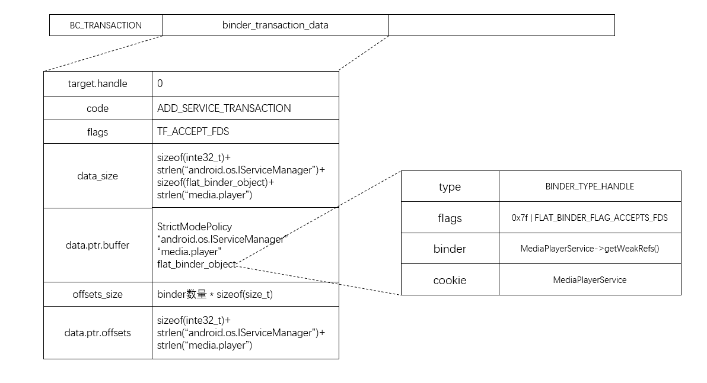

```c++
frameworks\base\media\libmediaplayerservice\MediaPlayerService.h
frameworks\base\include\media\IMediaPlayerService.h
frameworks\base\include\binder\IInterface.h
```

我们拿`MediaPlayerService`来研究

frameworks\base\media\mediaserver\main_mediaserver.cpp

```c++
int main(int argc, char** argv)
{
    sp<ProcessState> proc(ProcessState::self());
    sp<IServiceManager> sm = defaultServiceManager();  //BpBinder
    LOGI("ServiceManager: %p", sm.get()); 
    AudioFlinger::instantiate();
    MediaPlayerService::instantiate();
    CameraService::instantiate();
    AudioPolicyService::instantiate();
    ProcessState::self()->startThreadPool();
    IPCThreadState::self()->joinThreadPool();
}
```

`ProcessState::self()`会打开binder设备并映射空间，再内核中创建`binder_proc`结构。

`sp<IServiceManager> sm = defaultServiceManager();`拿到了ServiceManager的代理对象即`BpServiceManager`


frameworks\base\media\libmediaplayerservice\MediaPlayerService.h

```c++
class MediaPlayerService : public BnMediaPlayerService
{
 	...
	public:
    	static  void                instantiate();
    ...

}
```

frameworks\base\include\media\IMediaPlayerService.h

```c++
class IMediaPlayerService: public IInterface
{
public:
    DECLARE_META_INTERFACE(MediaPlayerService);

	...	
};

class BnMediaPlayerService: public BnInterface<IMediaPlayerService>
{
public:
    virtual status_t    onTransact( uint32_t code,
                                    const Parcel& data,
                                    Parcel* reply,
                                    uint32_t flags = 0);
};
```


frameworks\base\media\libmedia\IMediaPlayerService.cpp

```c++
IMPLEMENT_META_INTERFACE(MediaPlayerService, "android.media.IMediaPlayerService");
```


frameworks\base\include\binder\IInterface.h

```c++
#define DECLARE_META_INTERFACE(INTERFACE)                               \
    static const android::String16 descriptor;                          \
    static android::sp<I##INTERFACE> asInterface(                       \
            const android::sp<android::IBinder>& obj);                  \
    virtual const android::String16& getInterfaceDescriptor() const;    \
    I##INTERFACE();                                                     \
    virtual ~I##INTERFACE();                                            \


#define IMPLEMENT_META_INTERFACE(INTERFACE, NAME)                       \
    const android::String16 I##INTERFACE::descriptor(NAME);             \
    const android::String16&                                            \
            I##INTERFACE::getInterfaceDescriptor() const {              \
        return I##INTERFACE::descriptor;                                \
    }                                                                   \
    android::sp<I##INTERFACE> I##INTERFACE::asInterface(                \
            const android::sp<android::IBinder>& obj)                   \
    {                                                                   \
        android::sp<I##INTERFACE> intr;                                 \
        if (obj != NULL) {                                              \
            intr = static_cast<I##INTERFACE*>(                          \
                obj->queryLocalInterface(                               \
                        I##INTERFACE::descriptor).get());               \
            if (intr == NULL) {                                         \
                intr = new Bp##INTERFACE(obj);                          \
            }                                                           \
        }                                                               \
        return intr;                                                    \
    }                                                                   \
    I##INTERFACE::I##INTERFACE() { }                                    \
    I##INTERFACE::~I##INTERFACE() { }                                   \
```

展开就是

```c++
static const android::String16 descriptor;                          
static android::sp<IMediaPlayerService> asInterface(const android::sp<android::IBinder>& obj);                  
virtual const android::String16& getInterfaceDescriptor() const;    
IMediaPlayerService();                                                     
virtual ~IMediaPlayerService();
```


```c++
class IMediaPlayerService: public IInterface
{
public:
    static const android::String16 descriptor;                          
	static android::sp<IMediaPlayerService> asInterface(const android::sp<android::IBinder>& obj);                  
	virtual const android::String16& getInterfaceDescriptor() const;    
	IMediaPlayerService();                                                     
	virtual ~IMediaPlayerService();

	...	
};
```


```c++
    const android::String16 IMediaPlayerService::descriptor("android.media.IMediaPlayerService");

    const android::String16& IMediaPlayerService::getInterfaceDescriptor() const {              
        return IMediaPlayerService::descriptor;                                
    }  

    android::sp<IMediaPlayerService> IMediaPlayerService::asInterface(const android::sp<android::IBinder>& obj)                   
    {                                                                   
        android::sp<IMediaPlayerService> intr;                                 
        if (obj != NULL) {                                              
            intr = static_cast<IMediaPlayerService*>(obj->queryLocalInterface(IMediaPlayerService::descriptor).get());               
            if (intr == NULL) {                                         
                intr = new BpMediaPlayerService(obj);                          
            }                                                           
        }                                                               
        return intr;                                                    
    }                                                                   
    IMediaPlayerService::IMediaPlayerService() { }                                    
    IMediaPlayerService::~IMediaPlayerService() { }                                   
```


frameworks\base\media\libmedia\IMediaPlayerService.cpp

```c++
class BpMediaPlayerService: public BpInterface<IMediaPlayerService>
{
public:
    BpMediaPlayerService(const sp<IBinder>& impl): BpInterface<IMediaPlayerService>(impl)
    {
    }
    ....
    
    
}
```


frameworks\base\include\binder\IInterface.h

```c++
template<typename INTERFACE>
class BpInterface : public INTERFACE, public BpRefBase
{
public:
                                BpInterface(const sp<IBinder>& remote);

protected:
    virtual IBinder*            onAsBinder();
};

template<typename INTERFACE>
class BnInterface : public INTERFACE, public BBinder
{
public:
    virtual sp<IInterface>      queryLocalInterface(const String16& _descriptor);
    virtual const String16&     getInterfaceDescriptor() const;

protected:
    virtual IBinder*            onAsBinder();
};
```


frameworks\base\media\libmediaplayerservice\MediaPlayerService.cpp

```c++
void MediaPlayerService::instantiate() {
    defaultServiceManager()->addService(String16("media.player"), new MediaPlayerService());
}
```

我们知道`defaultServiceManager()`返回的是一个`BpServiceManager`对象

```c++
class BpServiceManager : public BpInterface<IServiceManager>
{
public:
    BpServiceManager(const sp<IBinder>& impl): BpInterface<IServiceManager>(impl)
    {
    }

 ...

    virtual status_t addService(const String16& name, const sp<IBinder>& service)
    {
        Parcel data, reply;
        data.writeInterfaceToken(IServiceManager::getInterfaceDescriptor());
        data.writeString16(name);
        data.writeStrongBinder(service);
        status_t err = remote()->transact(ADD_SERVICE_TRANSACTION, data, &reply);
        return err == NO_ERROR ? reply.readExceptionCode() : err;
    }

...
};
```


frameworks\base\libs\binder\Parcel.cpp

```c++
status_t Parcel::writeInterfaceToken(const String16& interface)
{
    writeInt32(IPCThreadState::self()->getStrictModePolicy() | STRICT_MODE_PENALTY_GATHER);
    // currently the interface identification token is just its name as a string
    return writeString16(interface);
}

status_t Parcel::writeStrongBinder(const sp<IBinder>& val)
{
    // 将要注册的Service组件发封装成一个flat_binder_object结构体
    return flatten_binder(ProcessState::self(), val, this);
}

// 现在研究的是MediaPlayerService的注册过程，那个这个binder就是MediaPlayerService
status_t flatten_binder(const sp<ProcessState>& proc,const sp<IBinder>& binder, Parcel* out)
{
    flat_binder_object obj;
    // 0x7f用来描述将要注册的Service组件在处理一个进程间通信请求时，它所使用的Server线程的优先级不能低于0x7f
    // FLAT_BINDER_FLAG_ACCEPTS_FDS表示可以将包含文件描述符的进程间通信数据传递给将要注册Service组件处理
    obj.flags = 0x7f | FLAT_BINDER_FLAG_ACCEPTS_FDS;
    if (binder != NULL) {
        IBinder *local = binder->localBinder();
        if (!local) {
            BpBinder *proxy = binder->remoteBinder();
            if (proxy == NULL) {
                LOGE("null proxy");
            }
            const int32_t handle = proxy ? proxy->handle() : 0;
            obj.type = BINDER_TYPE_HANDLE;
            obj.handle = handle;
            obj.cookie = NULL;
        } else {
            obj.type = BINDER_TYPE_BINDER;
            obj.binder = local->getWeakRefs();
            obj.cookie = local;
        }
    } else {
        obj.type = BINDER_TYPE_BINDER;
        obj.binder = NULL;
        obj.cookie = NULL;
    }
    
    return finish_flatten_binder(binder, obj, out);
}

inline static status_t finish_flatten_binder(const sp<IBinder>& binder, const flat_binder_object& flat, Parcel* out)
{
    return out->writeObject(flat, false);
}
```


先来看看`Parcel`的初始化

```c++
Parcel::Parcel()
{
    initState();
}

...
    
void Parcel::initState()
{
    mError = NO_ERROR;
    mData = 0;
    mDataSize = 0;
    mDataCapacity = 0;
    mDataPos = 0;
    LOGV("initState Setting data size of %p to %d\n", this, mDataSize);
    LOGV("initState Setting data pos of %p to %d\n", this, mDataPos);
    mObjects = NULL;
    mObjectsSize = 0;
    mObjectsCapacity = 0;
    mNextObjectHint = 0;
    mHasFds = false;
    mFdsKnown = true;
    mOwner = NULL;
}
```

构造函数是调用initState()函数，在该函数中，初始化成员变量，指针型成员变量`mData`、`mObjects`都为nullptr，整数型成员变量`mDataSize`、`mDataCapacity`、`mDataPos`、`mObjectsSize`、`mObjectsCapacity`都赋值为0。


frameworks\base\libs\binder\Parcel.cpp

```c++
status_t Parcel::writeObject(const flat_binder_object& val, bool nullMetaData)
{
    const bool enoughData = (mDataPos+sizeof(val)) <= mDataCapacity;
    const bool enoughObjects = mObjectsSize < mObjectsCapacity;
    if (enoughData && enoughObjects) {
restart_write:
        *reinterpret_cast<flat_binder_object*>(mData+mDataPos) = val;
        
        // Need to write meta-data?
        if (nullMetaData || val.binder != NULL) {
            mObjects[mObjectsSize] = mDataPos;
            acquire_object(ProcessState::self(), val, this);
            mObjectsSize++;
        }
        
        // remember if it's a file descriptor
        if (val.type == BINDER_TYPE_FD) {
            mHasFds = mFdsKnown = true;
        }

        return finishWrite(sizeof(flat_binder_object));
    }

    if (!enoughData) {
        // 没有足够的空间，先扩容
        const status_t err = growData(sizeof(val));
        if (err != NO_ERROR) return err;
    }
    if (!enoughObjects) {
        size_t newSize = ((mObjectsSize+2)*3)/2;
        size_t* objects = (size_t*)realloc(mObjects, newSize*sizeof(size_t));
        if (objects == NULL) return NO_MEMORY;
        mObjects = objects;
        mObjectsCapacity = newSize;
    }
    
    goto restart_write;
}
```


drivers/staging/android/binder.c

```c
struct flat_binder_object {
	/* 8 bytes for large_flat_header. */
	unsigned long		type;
	unsigned long		flags;

	/* 8 bytes of data. */
	union {
		void		*binder;	/* local object */
		signed long	handle;		/* remote object */
	};

	/* extra data associated with local object */
	void			*cookie;
};
```


Client进程和Server进程的一次进程间通信过程可以划分为如下5个步骤：

1. Client进程将进程间通信数据封装成一个`Parcel`对象，以便可以将进程间通信数据转递给Binder驱动程序。
2. Client进程向Binder驱动程序发送一个`BC_TRANSACTION`命令协议，Binder驱动程序根据协议内容找到目标Server进程之后，就会向Client进程发送一个`BR_TRANSACTION_COMPLETE`返回协议，表示它的进程间通信请求已经被接受。Client进程接受到Binder驱动发送给它的`BR_TRANSACTION_COMPLETE`返回协议，并且对它进行处理后，就会再次进入到Binder驱动程序中去等待目标Server进程返回进程间通信结果。
3. Binder驱动程序在向Client进程发送`BR_TRANSACTION_COMPLETE`返回协议的同时，也会向目标Server进程发送一个`BR_TRANSACTION`命令协议，请求目标Server进程处理该进程间通信请求。
4. Server进程接受到Binder驱动程序发送来的`BR_TRANSACTION`返回协议，并且对它进行处理之后，就会相向Binder驱动程序发送一个`BC_REPLY`命令协议。Binder驱动程序根据协议内容找到目标Client之后，就会向Server进程发送一个`BR_TRANSACTION_COMPLETE`返回协议，表示它返回的进程间通信结果已经收到了。Server进程接受到Binder驱动程序发送给它的`BR_TRANSACTION_COMPLETE`返回协议，并且对它进行处理之后，一次进程通信过程就结束了。接着它会再次进入到Binder驱动程序中去等待下一次进程间通信请求。
5. Binder驱动程序向Server进程发送`BR_TRANSACTION_COMPLETE`返回协议的同时，也会向目标Client进程发送一个`BR_REPLY`返回协议，表示Server进程已经处理完成它的进程间通信请求了，并且将进程间通信结果返回给它。


## 发送和处理BC_TRANSACTION

至此MediaPlayerService想要向ServiceManager添加服务,数据已经写到data中，这个`remote()`获取的也是`BpBinder`对象

```c
status_t err = remote()->transact(ADD_SERVICE_TRANSACTION, data, &reply);
```


frameworks\base\include\binder\BpBinder.h

```c++
virtual status_t transact(   uint32_t code,
                                const Parcel& data,
                                Parcel* reply,
                                uint32_t flags = 0);
```

`flags`表示的是一个同步的进程间请求还是一个异步的，默认参数`0`表示同步请求


frameworks\base\libs\binder\BpBinder.cpp

```c++
status_t BpBinder::transact(uint32_t code, const Parcel& data, Parcel* reply, uint32_t flags)
{
    // Once a binder has died, it will never come back to life.
    if (mAlive) {
        status_t status = IPCThreadState::self()->transact(
            mHandle, code, data, reply, flags);
        if (status == DEAD_OBJECT) mAlive = 0;
        return status;
    }

    return DEAD_OBJECT;
}
```

因为现在正在向ServiceManager请求，所有这里的`mHandle`的值是0

又回到了`IPCThreadState`中


frameworks\base\libs\binder\IPCThreadState.cpp

```c++
status_t IPCThreadState::transact(int32_t handle, uint32_t code, const Parcel& data, Parcel* reply, uint32_t flags)
{
    // 数据是否正确
    status_t err = data.errorCheck();

    // 允许Server进程在返回结果中携带文件描述符
    flags |= TF_ACCEPT_FDS;

   ....
    
    if (err == NO_ERROR) {
        LOG_ONEWAY(">>>> SEND from pid %d uid %d %s", getpid(), getuid(),
            (flags & TF_ONE_WAY) == 0 ? "READ REPLY" : "ONE WAY");
        err = writeTransactionData(BC_TRANSACTION, flags, handle, code, data, NULL);
    }
    
    if (err != NO_ERROR) {
        if (reply) reply->setError(err);
        return (mLastError = err);
    }
    
    if ((flags & TF_ONE_WAY) == 0) {
        ...
        if (reply) {
            err = waitForResponse(reply);
        } else {
            Parcel fakeReply;
            err = waitForResponse(&fakeReply);
        }
        ...
        
        IF_LOG_TRANSACTIONS() {
            TextOutput::Bundle _b(alog);
            alog << "BR_REPLY thr " << (void*)pthread_self() << " / hand "
                << handle << ": ";
            if (reply) alog << indent << *reply << dedent << endl;
            else alog << "(none requested)" << endl;
        }
    } else {
        err = waitForResponse(NULL, NULL);
    }
    
    return err;
}
```


`BC_TRANSACTION`协议后面跟的通信数据使用一个`binder_transaction_data`结构体来描述，所以需要将`Parcel`对象data的内容写到`binder_transaction_data`中

```c++
status_t IPCThreadState::writeTransactionData(int32_t cmd, uint32_t binderFlags,
    int32_t handle, uint32_t code, const Parcel& data, status_t* statusBuffer)
{
    binder_transaction_data tr;

    tr.target.handle = handle;
    tr.code = code;
    tr.flags = binderFlags;
    
    const status_t err = data.errorCheck();
    if (err == NO_ERROR) {
        tr.data_size = data.ipcDataSize();
        tr.data.ptr.buffer = data.ipcData();
        tr.offsets_size = data.ipcObjectsCount()*sizeof(size_t);
        tr.data.ptr.offsets = data.ipcObjects();
    } else if (statusBuffer) {
        tr.flags |= TF_STATUS_CODE;
        *statusBuffer = err;
        tr.data_size = sizeof(status_t);
        tr.data.ptr.buffer = statusBuffer;
        tr.offsets_size = 0;
        tr.data.ptr.offsets = NULL;
    } else {
        return (mLastError = err);
    }
    
    // 把协议BC_TRANSACTION和数据binder_transaction_data写到mOut缓冲区中
    mOut.writeInt32(cmd);
    mOut.write(&tr, sizeof(tr));
    
    return NO_ERROR;
}
```

`binder_transaction_data`数据结构具体详见`Binder数据结构`这篇文章





frameworks\base\libs\binder\IPCThreadState.cpp

```c++
status_t IPCThreadState::waitForResponse(Parcel *reply, status_t *acquireResult)
{
    int32_t cmd;
    int32_t err;

    while (1) {
        if ((err=talkWithDriver()) < NO_ERROR) break;
        err = mIn.errorCheck();
        if (err < NO_ERROR) break;
        if (mIn.dataAvail() == 0) continue;
        
        cmd = mIn.readInt32();
        
        IF_LOG_COMMANDS() {
            alog << "Processing waitForResponse Command: "
                << getReturnString(cmd) << endl;
        }

        switch (cmd) {
        case BR_TRANSACTION_COMPLETE:
            if (!reply && !acquireResult) goto finish;
            break;
        
        case BR_DEAD_REPLY:
            err = DEAD_OBJECT;
            goto finish;

        case BR_FAILED_REPLY:
            err = FAILED_TRANSACTION;
            goto finish;
        
        case BR_ACQUIRE_RESULT:
            {
                LOG_ASSERT(acquireResult != NULL, "Unexpected brACQUIRE_RESULT");
                const int32_t result = mIn.readInt32();
                if (!acquireResult) continue;
                *acquireResult = result ? NO_ERROR : INVALID_OPERATION;
            }
            goto finish;
        
        case BR_REPLY:
            {
                binder_transaction_data tr;
                err = mIn.read(&tr, sizeof(tr));
                LOG_ASSERT(err == NO_ERROR, "Not enough command data for brREPLY");
                if (err != NO_ERROR) goto finish;

                if (reply) {
                    if ((tr.flags & TF_STATUS_CODE) == 0) {
                        reply->ipcSetDataReference(
                            reinterpret_cast<const uint8_t*>(tr.data.ptr.buffer),
                            tr.data_size,
                            reinterpret_cast<const size_t*>(tr.data.ptr.offsets),
                            tr.offsets_size/sizeof(size_t),
                            freeBuffer, this);
                    } else {
                        err = *static_cast<const status_t*>(tr.data.ptr.buffer);
                        freeBuffer(NULL,
                            reinterpret_cast<const uint8_t*>(tr.data.ptr.buffer),
                            tr.data_size,
                            reinterpret_cast<const size_t*>(tr.data.ptr.offsets),
                            tr.offsets_size/sizeof(size_t), this);
                    }
                } else {
                    freeBuffer(NULL,
                        reinterpret_cast<const uint8_t*>(tr.data.ptr.buffer),
                        tr.data_size,
                        reinterpret_cast<const size_t*>(tr.data.ptr.offsets),
                        tr.offsets_size/sizeof(size_t), this);
                    continue;
                }
            }
            goto finish;

        default:
            err = executeCommand(cmd);
            if (err != NO_ERROR) goto finish;
            break;
        }
    }

finish:
    if (err != NO_ERROR) {
        if (acquireResult) *acquireResult = err;
        if (reply) reply->setError(err);
        mLastError = err;
    }
    
    return err;
}
```


`BC_TRANSACTION`协议后面跟的通信数据使用一个`binder_transaction_data`结构体来描述，所以需要将`Parcel`对象data的内容写到`binder_transaction_data`中,然后将这个

`binder_transaction_data`结构体写入到一个`binder_write_read`结构体中，最后才能通过IO控制命令`BINDER_WRITE_READ`将一个`BC_TRANSACTION`命令协议发送给Binder驱动程序处理。

```c++
/**

doReceive：描述调用者是否希望
*/
status_t IPCThreadState::talkWithDriver(bool doReceive)
{
    ...
    
    binder_write_read bwr;
    
    // Is the read buffer empty?
    const bool needRead = mIn.dataPosition() >= mIn.dataSize();
    
    // We don't want to write anything if we are still reading
    // from data left in the input buffer and the caller
    // has requested to read the next data.
    const size_t outAvail = (!doReceive || needRead) ? mOut.dataSize() : 0;
    
    bwr.write_size = outAvail;
    bwr.write_buffer = (long unsigned int)mOut.data();

    // This is what we'll read.
    if (doReceive && needRead) {
        bwr.read_size = mIn.dataCapacity();
        bwr.read_buffer = (long unsigned int)mIn.data();
    } else {
        bwr.read_size = 0;
    }
    
    IF_LOG_COMMANDS() {
        TextOutput::Bundle _b(alog);
        if (outAvail != 0) {
            alog << "Sending commands to driver: " << indent;
            const void* cmds = (const void*)bwr.write_buffer;
            const void* end = ((const uint8_t*)cmds)+bwr.write_size;
            alog << HexDump(cmds, bwr.write_size) << endl;
            while (cmds < end) cmds = printCommand(alog, cmds);
            alog << dedent;
        }
        alog << "Size of receive buffer: " << bwr.read_size
            << ", needRead: " << needRead << ", doReceive: " << doReceive << endl;
    }
    
    // Return immediately if there is nothing to do.
    if ((bwr.write_size == 0) && (bwr.read_size == 0)) return NO_ERROR;
    
    bwr.write_consumed = 0;
    bwr.read_consumed = 0;
    status_t err;
    do {
        IF_LOG_COMMANDS() {
            alog << "About to read/write, write size = " << mOut.dataSize() << endl;
        }
#if defined(HAVE_ANDROID_OS)
        if (ioctl(mProcess->mDriverFD, BINDER_WRITE_READ, &bwr) >= 0)
            err = NO_ERROR;
        else
            err = -errno;
#else
        err = INVALID_OPERATION;
#endif
        IF_LOG_COMMANDS() {
            alog << "Finished read/write, write size = " << mOut.dataSize() << endl;
        }
    } while (err == -EINTR);
    
    IF_LOG_COMMANDS() {
        alog << "Our err: " << (void*)err << ", write consumed: "
            << bwr.write_consumed << " (of " << mOut.dataSize()
			<< "), read consumed: " << bwr.read_consumed << endl;
    }

    if (err >= NO_ERROR) {
        if (bwr.write_consumed > 0) {
            if (bwr.write_consumed < (ssize_t)mOut.dataSize())
                mOut.remove(0, bwr.write_consumed);
            else
                mOut.setDataSize(0);
        }
        if (bwr.read_consumed > 0) {
            mIn.setDataSize(bwr.read_consumed);
            mIn.setDataPosition(0);
        }
        IF_LOG_COMMANDS() {
            TextOutput::Bundle _b(alog);
            alog << "Remaining data size: " << mOut.dataSize() << endl;
            alog << "Received commands from driver: " << indent;
            const void* cmds = mIn.data();
            const void* end = mIn.data() + mIn.dataSize();
            alog << HexDump(cmds, mIn.dataSize()) << endl;
            while (cmds < end) cmds = printReturnCommand(alog, cmds);
            alog << dedent;
        }
        return NO_ERROR;
    }
    
    return err;
}
```

