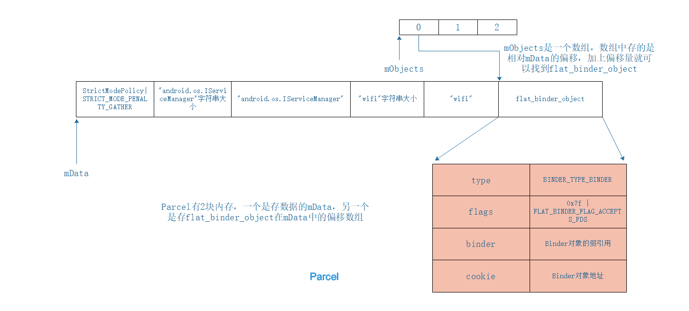
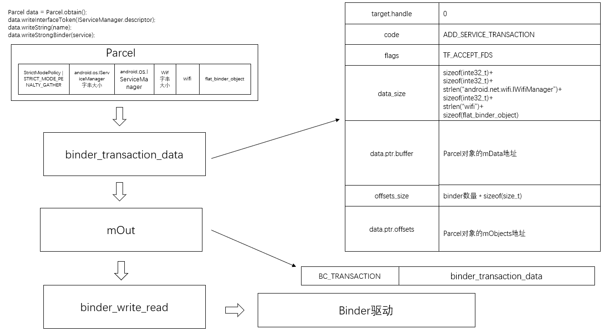
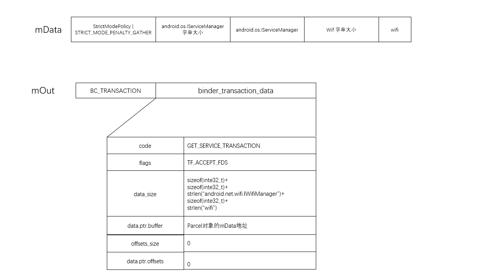

## WifiService

frameworks\base\services\java\com\android\server\WifiService.java

```java
public class WifiService extends IWifiManager.Stub {
	....
}
```

frameworks\base\wifi\java\android\net\wifi\IWifiManager.aidl

```java
public interface IWifiManager extends android.os.IInterface{

	public static abstract class IWifiManager.Stub extends android.os.Binder implements android.net.wifi.IWifiManager{
        
        private static final java.lang.String DESCRIPTOR = "android.net.wifi.IWifiManager";
    	
    	public Stub(){
            this.attachInterface(this,DESCRIPTOR);
        }
   	
   		 public static android.net.wifi.IWifiManager asInterface(android.os.Binder obj){
        	if(obj == null){
            	return null;
        	}
        	android.os.IInterface iin = (android.os.IInterface)obj.queryLocalInterface(DESCRIPTOR);
        	if( iin != null && iin instanceof android.net.wifi.IWifiManager){
             	return (android.net.wifi.IWifiManager)iin;
        	}
       		return new android.net.wifi.IWifiManager.Stub.Proxy(obj);
   		 }
    
   		 public android.od.IBinder asBinder(){
         		return this;
    	  }
    
    		.....
        
        
    	 private static final class Proxy implements android.net.wifi.IWifiManager{
             private android.od.IBinder mRemote;
             
             Proxy(android.os.IBinder remote){
                 mRemote = remote;
             }
             
              public android.od.IBinder asBinder(){
         		return mRemotes;
    	  	  }
             
             ....
         }
                
    }
    ....

}
```


frameworks\base\core\java\android\os\Binder.java

```java
public class Binder implements IBinder {

    // c++层 JavaBBinderHolder的指针地址
    private int mObject;
    
    // 实现了IInterface的 IWifiManager.Stub对象
    private IInterface mOwner;   
    
    // android.net.wifi.IWifiManager
    private String mDescriptor;  
    
    public Binder() {
        // 会在JNI层构造JavaBBinderHolder对象
        init();
        ...
    }
    
	public void attachInterface(IInterface owner, String descriptor) {
        mOwner = owner;
        mDescriptor = descriptor;
    }
    
    private native final void init();
    
    ....
	
}
```


## WifiService 启动

Wifiservice的启动地方在system server中

frameworks\base\services\java\com\android\server\SystemServer.java

```java
    native public static void init1(String[] args);

    public static void main(String[] args) {
        ....
        
        System.loadLibrary("android_servers");
        init1(args);
    }
```

frameworks\base\services\jni\com_android_server_SystemServer.cpp

```c
extern "C" int system_init();

static void android_server_SystemServer_init1(JNIEnv* env, jobject clazz)
{
    system_init();
}
```


rameworks\base\cmds\system_server\library\system_init.cpp

```c++
extern "C" status_t system_init()
{
   ....
    
    AndroidRuntime* runtime = AndroidRuntime::getRuntime();

    LOGI("System server: starting Android services.\n");
   
    // 执行到SystemServer的init2函数
    runtime->callStatic("com/android/server/SystemServer", "init2");
   .....
    return NO_ERROR;
}
```


frameworks\base\services\java\com\android\server\SystemServer.java

```java
public static final void init2() {
        Slog.i(TAG, "Entered the Android system server!");
        Thread thr = new ServerThread();
        thr.setName("android.server.ServerThread");
        thr.start();
}
```

`WifiService `的启动是在`ConnectivityService`中。

frameworks\base\services\java\com\android\server\SystemServer.java

```java
@Override
public void run() {
    ....
    
    try {
        Slog.i(TAG, "Connectivity Service");
        connectivity = ConnectivityService.getInstance(context);
        ServiceManager.addService(Context.CONNECTIVITY_SERVICE, connectivity);
    } catch (Throwable e) {
        Slog.e(TAG, "Failure starting Connectivity Service", e);
    }
  
    ....
}  
    
```


frameworks\base\services\java\com\android\server\ConnectivityService.java

```java
private ConnectivityService(Context context) {

    ....
        
	 for (int netType : mPriorityList) {
            switch (mNetAttributes[netType].mRadio) {
            case ConnectivityManager.TYPE_WIFI:
                if (DBG) Slog.v(TAG, "Starting Wifi Service.");
                
                WifiStateTracker wst = new WifiStateTracker(context, mHandler);
                WifiService wifiService = new WifiService(context, wst);
                // wifi
                ServiceManager.addService(Context.WIFI_SERVICE, wifiService);
                wifiService.startWifi();
                mNetTrackers[ConnectivityManager.TYPE_WIFI] = wst;
                wst.startMonitoring();

                break;
     ....

}
```

`WifiService`是`Binder`的子类,构造函数中有个`init`方法,这个`init`就对应`JNI`层的`android_os_Binder_init`


frameworks\base\core\jni\android_util_Binder.cpp

```c++
static void android_os_Binder_init(JNIEnv* env, jobject clazz)
{
    // clazz就是java层的WifiService对象
    JavaBBinderHolder* jbh = new JavaBBinderHolder(env, clazz);
    if (jbh == NULL) {
        jniThrowException(env, "java/lang/OutOfMemoryError", NULL);
        return;
    }
    LOGV("Java Binder %p: acquiring first ref on holder %p", clazz, jbh);
    jbh->incStrong(clazz); // 增加强引用计数
    
    // 将Binder中的mObject赋值jbh
    env->SetIntField(clazz, gBinderOffsets.mObject, (int)jbh);
}
```

构造一个`JavaBBinderHolder`对象，参数`clazz`就是Java层的`WifiService`对象。注意，也就是`WifiService`在构造的时候就已经在JNI层创建了`JavaBBinderHolder`，记住这个，后面注册时，会取出来。


frameworks\base\core\jni\android_util_Binder.cpp

```c++
class JavaBBinderHolder : public RefBase
{
public:
    JavaBBinderHolder(JNIEnv* env, jobject object) : mObject(object)
    {
        LOGV("Creating JavaBBinderHolder for Object %p\n", object);
    }
    ~JavaBBinderHolder()
    {
        LOGV("Destroying JavaBBinderHolder for Object %p\n", mObject);
    }

    sp<JavaBBinder> get(JNIEnv* env)
    {
        AutoMutex _l(mLock);
        // 升级强指针
        // 第一次调用肯定为NULL
        sp<JavaBBinder> b = mBinder.promote();
        if (b == NULL) {
            // 构造一个JavaBBinder,把对应java层Service对象传递进去
            b = new JavaBBinder(env, mObject);
            mBinder = b;
            LOGV("Creating JavaBinder %p (refs %p) for Object %p, weakCount=%d\n",
                 b.get(), b->getWeakRefs(), mObject, b->getWeakRefs()->getWeakCount());
        }

        return b;
    }

    sp<JavaBBinder> getExisting()
    {
        AutoMutex _l(mLock);
        return mBinder.promote();
    }

private:
    Mutex           mLock;
    jobject         mObject;   // 对应java层Service对象
    wp<JavaBBinder> mBinder;   // JavaBBinder的弱引用
};
```


frameworks\base\core\jni\android_util_Binder.cpp

```c++
class JavaBBinder : public BBinder
{
public:
    
    // object:wifiService
    JavaBBinder(JNIEnv* env, jobject object)  : mVM(jnienv_to_javavm(env)), mObject(env->NewGlobalRef(object))
    {
        LOGV("Creating JavaBBinder %p\n", this);
        android_atomic_inc(&gNumLocalRefs);
        incRefsCreated(env);
    }

    bool   checkSubclass(const void* subclassID) const
    {
        return subclassID == &gBinderOffsets;
    }

    jobject object() const
    {
        return mObject;
    }

protected:
    virtual ~JavaBBinder()
    {
        android_atomic_dec(&gNumLocalRefs);
        JNIEnv* env = javavm_to_jnienv(mVM);
        env->DeleteGlobalRef(mObject);
    }

    virtual status_t onTransact( uint32_t code, const Parcel& data, Parcel* reply, uint32_t flags = 0)
    {
        JNIEnv* env = javavm_to_jnienv(mVM);

        IPCThreadState* thread_state = IPCThreadState::self();
        const int strict_policy_before = thread_state->getStrictModePolicy();
        thread_state->setLastTransactionBinderFlags(flags);

      
        jboolean res = env->CallBooleanMethod(mObject, gBinderOffsets.mExecTransact,
            code, (int32_t)&data, (int32_t)reply, flags);
        jthrowable excep = env->ExceptionOccurred();

        // Restore the Java binder thread's state if it changed while
        // processing a call (as it would if the Parcel's header had a
        // new policy mask and Parcel.enforceInterface() changed
        // it...)
        const int strict_policy_after = thread_state->getStrictModePolicy();
        if (strict_policy_after != strict_policy_before) {
            // Our thread-local...
            thread_state->setStrictModePolicy(strict_policy_before);
            // And the Java-level thread-local...
            set_dalvik_blockguard_policy(env, strict_policy_before);
        }

        if (excep) {
            report_exception(env, excep,
                "*** Uncaught remote exception!  "
                "(Exceptions are not yet supported across processes.)");
            res = JNI_FALSE;

            /* clean up JNI local ref -- we don't return to Java code */
            env->DeleteLocalRef(excep);
        }

        //aout << "onTransact to Java code; result=" << res << endl
        //    << "Transact from " << this << " to Java code returning "
        //    << reply << ": " << *reply << endl;
        return res != JNI_FALSE ? NO_ERROR : UNKNOWN_TRANSACTION;
    }

    virtual status_t dump(int fd, const Vector<String16>& args)
    {
        return 0;
    }

private:
    JavaVM* const   mVM;
    // 对应java层Service对象
    jobject const   mObject;
};
```


## 注册WifiService

### getIServiceManager

frameworks\base\services\java\com\android\server\ConnectivityService.java

```java
// Context.WIFI_SERVICE 值就是 wifi
ServiceManager.addService(Context.WIFI_SERVICE, wifiService);
```

frameworks\base\core\java\android\os\ServiceManager.java

```java
public static void addService(String name, IBinder service) {
     try {
         // name是wifi
         // servcie就是 wifiService对象
         getIServiceManager().addService(name, service);
       } catch (RemoteException e) {
           Log.e(TAG, "error in addService", e);
      }
}

private static IServiceManager getIServiceManager() {
        if (sServiceManager != null) {
            return sServiceManager;
        }

        // Find the service manager
        // ServiceManagerProxy
        sServiceManager = ServiceManagerNative.asInterface(BinderInternal.getContextObject());
        return sServiceManager;
    }
```

获取ServiceManager代理对象的流程已经在其他章节讲过了。这里的`sServiceManager`返回的是`ServiceManagerProxy`


### ServiceManagerProxy


frameworks\base\core\java\android\os\ServiceManagerNative.java

```java
class ServiceManagerProxy implements IServiceManager {
    ...
	public void addService(String name, IBinder service) throws RemoteException {
        Parcel data = Parcel.obtain();
        Parcel reply = Parcel.obtain();
        // android.os.IServiceManager
        data.writeInterfaceToken(IServiceManager.descriptor);
        // wifi
        data.writeString(name);
        // wifiService
        data.writeStrongBinder(service);
        // 这个mRemote就是BinderProxy
        mRemote.transact(ADD_SERVICE_TRANSACTION, data, reply, 0);
        reply.recycle();
        data.recycle();
	 }
    
    ...
}
```

Client进程和Server进程的一次进程间通信过程可以划分为如下5个步骤：

1. Client进程将进程间通信数据封装成一个`Parcel`对象，以便可以将进程间通信数据转递给Binder驱动程序。
2. Client进程向Binder驱动程序发送一个`BC_TRANSACTION`命令协议，Binder驱动程序根据协议内容找到目标Server进程之后，就会向Client进程发送一个`BR_TRANSACTION_COMPLETE`返回协议，表示它的进程间通信请求已经被接受。Client进程接受到Binder驱动发送给它的`BR_TRANSACTION_COMPLETE`返回协议，并且对它进行处理后，就会再次进入到Binder驱动程序中去等待目标Server进程返回进程间通信结果。
3. Binder驱动程序在向Client进程发送`BR_TRANSACTION_COMPLETE`返回协议的同时，也会向目标Server进程发送一个`BR_TRANSACTION`命令协议，请求目标Server进程处理该进程间通信请求。
4. Server进程接受到Binder驱动程序发送来的`BR_TRANSACTION`返回协议，并且对它进行处理之后，就会相向Binder驱动程序发送一个`BC_REPLY`命令协议。Binder驱动程序根据协议内容找到目标Client之后，就会向Server进程发送一个`BR_TRANSACTION_COMPLETE`返回协议，表示它返回的进程间通信结果已经收到了。Server进程接受到Binder驱动程序发送给它的`BR_TRANSACTION_COMPLETE`返回协议，并且对它进行处理之后，一次进程通信过程就结束了。接着它会再次进入到Binder驱动程序中去等待下一次进程间通信请求。
5. Binder驱动程序向Server进程发送`BR_TRANSACTION_COMPLETE`返回协议的同时，也会向目标Client进程发送一个`BR_REPLY`返回协议，表示Server进程已经处理完成它的进程间通信请求了，并且将进程间通信结果返回给它。


frameworks\base\core\jni\android_util_Binder.cpp

```c++
static void android_os_Parcel_writeStrongBinder(JNIEnv* env, jobject clazz, jobject object)
{
    // clazz 对应java层的Parcel对象，用来获取一个C++层的Parcel对象
    Parcel* parcel = parcelForJavaObject(env, clazz);
    if (parcel != NULL) {
        // 相当于writeStrongBinder(JavaBBinder)
        // 因为JavaBBinder继承Binder
        // 所以就是writeStrongBinder(Binder)，这个类型比较重要，后面向Parcel写对象时会判断对象类型
        const status_t err = parcel->writeStrongBinder(ibinderForJavaObject(env, object));
        if (err != NO_ERROR) {
            jniThrowException(env, "java/lang/OutOfMemoryError", NULL);
        }
    }
}
```

`ibinderForJavaObject(env, object)`返回的是一个C++层的`JavaBBinderHolder`对象

### ibinderForJavaObject


```c++
sp<IBinder> ibinderForJavaObject(JNIEnv* env, jobject obj)
{
    // obj是java层的 android.os.IBinder 对象,即这个的wifiService
    if (obj == NULL) return NULL;

    // 查看obj是否是 android.os.Binder 类
    if (env->IsInstanceOf(obj, gBinderOffsets.mClass)) {
        // wifiServices是 android.os.Binder的子类
        // 从wifiServices获取mObject，即c++层中的JavaBBinderHolder对象
        JavaBBinderHolder* jbh = (JavaBBinderHolder*) env->GetIntField(obj, gBinderOffsets.mObject);
        //  get方法就可以获得C++层的JavaBBinder对象
        return jbh != NULL ? jbh->get(env) : NULL;
    }

    // android.os.BinderProxy
    // 这个是给ServiceManager使用的
    if (env->IsInstanceOf(obj, gBinderProxyOffsets.mClass)) {
        return (IBinder*) env->GetIntField(obj, gBinderProxyOffsets.mObject);
    }

    LOGW("ibinderForJavaObject: %p is not a Binder object", obj);
    return NULL;
}
```

### Parcel#writeStrongBinder


frameworks\base\libs\binder\Parcel.cpp

```c++
status_t Parcel::writeStrongBinder(const sp<IBinder>& val)
{
    // 根据上面，这个val是JavaBBinder对象
    return flatten_binder(ProcessState::self(), val, this);
}
```


frameworks\base\libs\binder\Parcel.cpp

```c++
inline static status_t finish_flatten_binder(const sp<IBinder>& binder, const flat_binder_object& flat, Parcel* out)
{
    // 根据上面，这个binder是JavaBBinder对象
    return out->writeObject(flat, false);
}

status_t flatten_binder(const sp<ProcessState>& proc, const sp<IBinder>& binder, Parcel* out)
{
     // 根据上面，这个binder是JavaBBinder对象
    flat_binder_object obj;
    
    // 0x7f用来描述将要注册的Service组件在处理一个进程间通信请求时，它所使用的Server线程的优先级不能低于0x7f
    // FLAT_BINDER_FLAG_ACCEPTS_FDS表示可以将包含文件描述符的进程间通信数据传递给将要注册Service组件处理
    obj.flags = 0x7f | FLAT_BINDER_FLAG_ACCEPTS_FDS;
    if (binder != NULL) {
        
        // BBinder对象的 localBinder返回的就是自己，那么这个local指向的就是JavaBBinder对象
        IBinder *local = binder->localBinder();
        if (!local) {
            BpBinder *proxy = binder->remoteBinder();
            if (proxy == NULL) {
                LOGE("null proxy");
            }
            const int32_t handle = proxy ? proxy->handle() : 0;
            obj.type = BINDER_TYPE_HANDLE;
            obj.handle = handle;
            obj.cookie = NULL;
        } else {
            // BINDER_TYPE_BINDER 类型
            obj.type = BINDER_TYPE_BINDER;
            // JavaBBinder对象的弱引用
            obj.binder = local->getWeakRefs();
            // JavaBBinder对象地址
            obj.cookie = local;
        }
    } else {
        obj.type = BINDER_TYPE_BINDER;
        obj.binder = NULL;
        obj.cookie = NULL;
    }
    
    return finish_flatten_binder(binder, obj, out);
}
```

先构造一个`flat_binder_object`，然后往`Parcel`中写




frameworks\base\libs\binder\Binder.cpp

```c++
BBinder* BBinder::localBinder()
{
    return this;
}
```

### BinderProxy#transact

现在数据已经写入到缓冲区中，接下来分析

```c++
 // 这个mRemote就是BinderProxy
 mRemote.transact(ADD_SERVICE_TRANSACTION, data, reply, 0);
```


frameworks\base\core\java\android\os\Binder.java

```java
final class BinderProxy implements IBinder {
    final private WeakReference mSelf;  // 这个mSelf是指向BinderProxy对象自己的一个弱引用
    private int mObject;                // mObject存的是C++层中的BpBinder对象的地址

    
    ....
        
 // code:想要调用ServicManager什么函数
 // data:方法参数
 // reply:返回的数据
 // flags:同步还是异步，默认0表示同步
 public native boolean transact(int code, Parcel data, Parcel reply, int flags) throws RemoteException;
		// 调用JNI中的android_os_BinderProxy_transact方法
    ...
}

```


frameworks\base\core\jni\android_util_Binder.cpp

````c++
/**
obj：java层的BinderProxy对象
code：想要调用ServicManager什么函数
dataObj：java层的data
replyObj：reply
flags：同步还是异步，默认0表示同步
*/
static jboolean android_os_BinderProxy_transact(JNIEnv* env, jobject obj,
                                                jint code, jobject dataObj,
                                                jobject replyObj, jint flags)
{
    if (dataObj == NULL) {
        jniThrowException(env, "java/lang/NullPointerException", NULL);
        return JNI_FALSE;
    }

    // 获取一个c++层的Parcel对象,用与写
    Parcel* data = parcelForJavaObject(env, dataObj);
    if (data == NULL) {
        return JNI_FALSE;
    }
    // 获取一个c++层的Parcel对象
    Parcel* reply = parcelForJavaObject(env, replyObj);
    if (reply == NULL && replyObj != NULL) {
        return JNI_FALSE;
    }

   
    // 获取java层的BinderProxy对象中mObject，即拿到c++层的BpBinder对象
    IBinder* target = (IBinder*) env->GetIntField(obj, gBinderProxyOffsets.mObject);
    if (target == NULL) {
        jniThrowException(env, "java/lang/IllegalStateException", "Binder has been finalized!");
        return JNI_FALSE;
    }

    // Only log the binder call duration for things on the Java-level main thread.
    // But if we don't
    const bool time_binder_calls = should_time_binder_calls();

    int64_t start_millis;
    if (time_binder_calls) {
        start_millis = uptimeMillis();
    }
    
    // 调用BpBinder的transact方法
    status_t err = target->transact(code, *data, reply, flags);
    
    
    
    //if (reply) printf("Transact from Java code to %p received: ", target); reply->print();
    if (time_binder_calls) {
        conditionally_log_binder_call(start_millis, target, code);
    }

    if (err == NO_ERROR) {
        return JNI_TRUE;
    } else if (err == UNKNOWN_TRANSACTION) {
        return JNI_FALSE;
    }

    signalExceptionForError(env, obj, err);
    return JNI_FALSE;
}
````


frameworks\base\libs\binder\BpBinder.cpp

```c++
status_t BpBinder::transact(uint32_t code, const Parcel& data, Parcel* reply, uint32_t flags)
{
    // Once a binder has died, it will never come back to life.
    if (mAlive) {
        status_t status = IPCThreadState::self()->transact(mHandle, code, data, reply, flags);
        if (status == DEAD_OBJECT) mAlive = 0;
        return status;
    }

    return DEAD_OBJECT;
}
```

实际上是调用了`IPCThreadState`的`transact`方法

### IPCThreadState#transact


frameworks\base\libs\binder\IPCThreadState.cpp

```c++
status_t IPCThreadState::transact(int32_t handle,
                                  uint32_t code, const Parcel& data,
                                  Parcel* reply, uint32_t flags)
{
    status_t err = data.errorCheck();

    
    flags |= TF_ACCEPT_FDS;

    ...
    
    if (err == NO_ERROR) {
        // 将数据转换为binder_transaction_data后，在写入到mOut中
        err = writeTransactionData(BC_TRANSACTION, flags, handle, code, data, NULL);
    }
    
    if (err != NO_ERROR) {
        if (reply) reply->setError(err);
        return (mLastError = err);
    }
    
    if ((flags & TF_ONE_WAY) == 0) {
        // 同步消息
       ...
        if (reply) {
            // 希望有回复
            err = waitForResponse(reply);
        } else {
            Parcel fakeReply;
            err = waitForResponse(&fakeReply);
        }
       ...
        
        ...
    } else {
        err = waitForResponse(NULL, NULL);
    }
    
    return err;
}
```


frameworks\base\libs\binder\IPCThreadState.cpp

```c++
status_t IPCThreadState::writeTransactionData(int32_t cmd, uint32_t binderFlags,
    int32_t handle, uint32_t code, const Parcel& data, status_t* statusBuffer)
{
    // 先将数据转换为binder_transaction_data结构数据
    binder_transaction_data tr;

    // 此时我们正想和serviceManager通信。所以handle为0
    tr.target.handle = handle;
    // 此时wifiservice想要注册，所以code为ADD_SERVICE_TRANSACTION
    tr.code = code;
    tr.flags = binderFlags;
    
    const status_t err = data.errorCheck();
    if (err == NO_ERROR) {
        // Parcel中数据量的大小
        tr.data_size = data.ipcDataSize();
        // Parcel中数据缓冲区的地址
        tr.data.ptr.buffer = data.ipcData();
        // Parcel中偏移数组的大小
        tr.offsets_size = data.ipcObjectsCount()*sizeof(size_t);
        // Parcel中偏移数组的地址
        tr.data.ptr.offsets = data.ipcObjects();
    } else if (statusBuffer) {
        tr.flags |= TF_STATUS_CODE;
        *statusBuffer = err;
        tr.data_size = sizeof(status_t);
        tr.data.ptr.buffer = statusBuffer;
        tr.offsets_size = 0;
        tr.data.ptr.offsets = NULL;
    } else {
        return (mLastError = err);
    }
    
    // 再把数据写入到mOut中
    // 首先是 BC_TRANSACTION 
    mOut.writeInt32(cmd);
    // 然后是binder_transaction_data的地址
    mOut.write(&tr, sizeof(tr));
    
    return NO_ERROR;
}
```


至此`mOut`里面就有一个`BC_TRANSACTION`命令协议。

### IPCThreadState#talkWithDriver


frameworks\base\include\binder\IPCThreadState.h

参数`doReceive`有个默认值true

```c++
 status_t            talkWithDriver(bool doReceive=true);
```


drivers\staging\android\binder.h

```c#
#define BINDER_WRITE_READ   		_IOWR('b', 1, struct binder_write_read)
```


frameworks\base\libs\binder\IPCThreadState.cpp

```c++
// 头文件中已经定义doReceive默认参数为true
status_t IPCThreadState::talkWithDriver(bool doReceive)
{
    
    binder_write_read bwr;
    
    // Is the read buffer empty?
    // 进程已经处理完上次Binder驱动发送的返回协议，那么needRead就是true
    const bool needRead = mIn.dataPosition() >= mIn.dataSize();
    
    // We don't want to write anything if we are still reading
    // from data left in the input buffer and the caller
    // has requested to read the next data.
    const size_t outAvail = (!doReceive || needRead) ? mOut.dataSize() : 0;
    
    bwr.write_size = outAvail;
    // 缓冲区的地址
    bwr.write_buffer = (long unsigned int)mOut.data();

    // This is what we'll read.
    if (doReceive && needRead) {
        bwr.read_size = mIn.dataCapacity();
        bwr.read_buffer = (long unsigned int)mIn.data();
    } else {
        bwr.read_size = 0;
    }
    
  .....
    
    // Return immediately if there is nothing to do.
    if ((bwr.write_size == 0) && (bwr.read_size == 0)) return NO_ERROR;
    
    bwr.write_consumed = 0;
    bwr.read_consumed = 0;
    status_t err;
    do {
       ...
#if defined(HAVE_ANDROID_OS)
           // BINDER_WRITE_READ:  _IOWR('b', 1, struct binder_write_read)
        if (ioctl(mProcess->mDriverFD, BINDER_WRITE_READ, &bwr) >= 0)
            err = NO_ERROR;
        else
            err = -errno;
#else
        err = INVALID_OPERATION;
#endif
        ...
    } while (err == -EINTR);
    
    ...

    if (err >= NO_ERROR) {
        if (bwr.write_consumed > 0) {
            if (bwr.write_consumed < (ssize_t)mOut.dataSize())
                mOut.remove(0, bwr.write_consumed);
            else
                mOut.setDataSize(0);
        }
        if (bwr.read_consumed > 0) {
            mIn.setDataSize(bwr.read_consumed);
            mIn.setDataPosition(0);
        }
        ...
        return NO_ERROR;
    }
    
    return err;
}
```

`talkWithDriver`使用IO命令`BINDER_WRITE_READ`来与Binder驱动交互，它需要定义一个`binder_write_read`结构体来指定输入缓冲区和输出缓冲区。

drivers\staging\android\binder.c

```c
// cmd:就是上面传进来的 BINDER_WRITE_READ,而BINDER_WRITE_READ就是 _IOWR('b', 1, struct binder_write_read)
// arg:就是&bwr地址
static long binder_ioctl(struct file *filp, unsigned int cmd, unsigned long arg)
{
	int ret;
	//  wifiservce进程在open("/dev/binder")时已经创建了proc
    struct binder_proc *proc = filp->private_data;
    
	struct binder_thread *thread;
    
    // struct binder_write_read的大小
	unsigned int size = _IOC_SIZE(cmd);

    // binder_write_read的用户空间地址
	void __user *ubuf = (void __user *)arg;

	ret = wait_event_interruptible(binder_user_error_wait, binder_stop_on_user_error < 2);
	if (ret)
		return ret;

	mutex_lock(&binder_lock);
	thread = binder_get_thread(proc);
	if (thread == NULL) {
		ret = -ENOMEM;
		goto err;
	}

	switch (cmd) {
	case BINDER_WRITE_READ: {
		
        struct binder_write_read bwr;
        
		if (size != sizeof(struct binder_write_read)) {
			ret = -EINVAL;
			goto err;
		}
        // 把在用户空间的ubuf数据赋值到&bwr
		if (copy_from_user(&bwr, ubuf, sizeof(bwr))) {
			ret = -EFAULT;
			goto err;
		}
		...
            
		if (bwr.write_size > 0) {
            
            // 我们知道，上面的给bwr设置的write_size是大于0的
			ret = binder_thread_write(proc, thread, (void __user *)bwr.write_buffer, bwr.write_size, &bwr.write_consumed);
			if (ret < 0) {
				bwr.read_consumed = 0;
				if (copy_to_user(ubuf, &bwr, sizeof(bwr)))
					ret = -EFAULT;
				goto err;
			}
		}
		if (bwr.read_size > 0) {
			ret = binder_thread_read(proc, thread, (void __user *)bwr.read_buffer, bwr.read_size, &bwr.read_consumed, filp->f_flags & O_NONBLOCK);
			if (!list_empty(&proc->todo))
				wake_up_interruptible(&proc->wait);
			if (ret < 0) {
				if (copy_to_user(ubuf, &bwr, sizeof(bwr)))
					ret = -EFAULT;
				goto err;
			}
		}
		if (binder_debug_mask & BINDER_DEBUG_READ_WRITE)
			printk(KERN_INFO "binder: %d:%d wrote %ld of %ld, read return %ld of %ld\n",
			       proc->pid, thread->pid, bwr.write_consumed, bwr.write_size, bwr.read_consumed, bwr.read_size);
		if (copy_to_user(ubuf, &bwr, sizeof(bwr))) {
			ret = -EFAULT;
			goto err;
		}
		break;
	}
            
	.....
        
	}
	ret = 0;
err:
	if (thread)
		thread->looper &= ~BINDER_LOOPER_STATE_NEED_RETURN;
	mutex_unlock(&binder_lock);
	wait_event_interruptible(binder_user_error_wait, binder_stop_on_user_error < 2);
	if (ret && ret != -ERESTARTSYS)
		printk(KERN_INFO "binder: %d:%d ioctl %x %lx returned %d\n", proc->pid, current->pid, cmd, arg, ret);
	return ret;
}
```

### binder_thread_write


drivers\staging\android\binder.c

```c
int
binder_thread_write(struct binder_proc *proc, struct binder_thread *thread, void __user *buffer, int size, signed long *consumed)
{
	uint32_t cmd;
    // 驱动需要读取缓冲区的起始于结束地址
	void __user *ptr = buffer + *consumed;
	void __user *end = buffer + size;

	while (ptr < end && thread->return_error == BR_OK) {
		if (get_user(cmd, (uint32_t __user *)ptr))
			return -EFAULT;
        // 读取到cmd后，指针移动sizeof(uint32_t)大小，为了读取后面的 binder_transaction_data 
		ptr += sizeof(uint32_t);
		...
		switch (cmd) {
		...

		case BC_TRANSACTION:
		case BC_REPLY: {
			struct binder_transaction_data tr;

			if (copy_from_user(&tr, ptr, sizeof(tr)))
				return -EFAULT;
            
            // 指针跳过 binder_transaction_data ，指向下个 cmd
			ptr += sizeof(tr);
            
			binder_transaction(proc, thread, &tr, cmd == BC_REPLY);
			break;
		}

		...
		}
		*consumed = ptr - buffer;
	}
	return 0;
}
```



`binder_transaction`函数有点长，分段分析,`reply`用来描述处理的是`BC_TRANSACTION`还是`BC_REPLY`协议,这里我们研究`BC_TRANSACTION`

drivers\staging\android\binder.c

```c
// reply：用来描述处理的是BC_TRANSACTION还是BC_REPLY协议
static void
binder_transaction(struct binder_proc *proc, struct binder_thread *thread,struct binder_transaction_data *tr, int reply)
{
	struct binder_transaction *t;
	struct binder_work *tcomplete;
	size_t *offp, *off_end;
	struct binder_proc *target_proc;
	struct binder_thread *target_thread = NULL;
	struct binder_node *target_node = NULL;
	struct list_head *target_list;
	wait_queue_head_t *target_wait;
	struct binder_transaction *in_reply_to = NULL;
	struct binder_transaction_log_entry *e;
	uint32_t return_error;

	...
    
    if (reply) {
        ....
    }else {
        
        // 我们想把wifiService注册到ServiceManager中，那么target.handle就是0,即tr->target.handle就是false
		if (tr->target.handle) {
          ...
		} else {
            // 拿到ServiceManager在binder驱动中的binder实体对象
			target_node = binder_context_mgr_node;
			if (target_node == NULL) {
				return_error = BR_DEAD_REPLY;
				goto err_no_context_mgr_node;
			}
		}
        
		...
        // 拿到binder实体对象就可以拿到对应进程的binder_proc,即ServiceManager进程的binder_proc
		target_proc = target_node->proc;
        
		if (target_proc == NULL) {
			return_error = BR_DEAD_REPLY;
			goto err_dead_binder;
		}
        
        // TF_ONE_WAY位为1，就表示需要异步传输，不需要等待回复数据
        // transaction_stack不为null表示该线程正在等待其他线程的返回
        // thread是wifiService进程的线程
        // 这里是在找该thread依赖的事务有没有serviceManager binder线程
        // 如果是同步请求，尝试寻找一个在等待其他事物执行的线程，这是一种优化调度
		if (!(tr->flags & TF_ONE_WAY) && thread->transaction_stack) {
			struct binder_transaction *tmp;
			tmp = thread->transaction_stack;
			...
			while (tmp) {
				if (tmp->from && tmp->from->proc == target_proc)
					target_thread = tmp->from;
				tmp = tmp->from_parent;
			}
		}
	}
    
	if (target_thread) {
		...
		target_list = &target_thread->todo;
		target_wait = &target_thread->wait;
	} else {
		target_list = &target_proc->todo;
		target_wait = &target_proc->wait;
	}
    ....
```


drivers\staging\android\binder.c

```c++
	....
       

	/* TODO: reuse incoming transaction for reply */
    // 分配 binder_transaction空间
	t = kzalloc(sizeof(*t), GFP_KERNEL);
	if (t == NULL) {
		return_error = BR_FAILED_REPLY;
		goto err_alloc_t_failed;
	}
	...

    // 分配 binder_work空间
	tcomplete = kzalloc(sizeof(*tcomplete), GFP_KERNEL);
	if (tcomplete == NULL) {
		return_error = BR_FAILED_REPLY;
		goto err_alloc_tcomplete_failed;
	}
	...

	t->debug_id = ++binder_last_id;
	...

    // reply：用来描述处理的是BC_TRANSACTION还是BC_REPLY协议
    // 我们现在正在处理BC_TRANSACTION，即reply值为0，!reply 就是true
	if (!reply && !(tr->flags & TF_ONE_WAY))
        // 处理BC_TRANSACTION的同步请求
        // 把客户端的线程放在from中，以便目标线程或者进程处理完请求后，通知源线程
		t->from = thread;
	else
		t->from = NULL;

	t->sender_euid = proc->tsk->cred->euid;
	t->to_proc = target_proc;
	t->to_thread = target_thread;
	t->code = tr->code;                // ADD_SERVICE_TRANSACTION
	t->flags = tr->flags;              // TF_ACCEPT_FDS
	t->priority = task_nice(current);

	// 为binder_transaction分配一个内核缓冲区，以便可以将进程间通信数据拷贝到它里面
	t->buffer = binder_alloc_buf(target_proc, tr->data_size,
		tr->offsets_size, !reply && (t->flags & TF_ONE_WAY));

	if (t->buffer == NULL) {
		return_error = BR_FAILED_REPLY;
		goto err_binder_alloc_buf_failed;
	}
	t->buffer->allow_user_free = 0;
	t->buffer->debug_id = t->debug_id;
	t->buffer->transaction = t;
	t->buffer->target_node = target_node;
	if (target_node)
		binder_inc_node(target_node, 1, 0, NULL);

   // 用来保存偏移数组的起始位置
	offp = (size_t *)(t->buffer->data + ALIGN(tr->data_size, sizeof(void *)));

   
	// binder_transaction_data
 	// 将用户空间tr->data.ptr.buffer 的数据拷贝到t->buffer->data，数据大小为tr->data_size
	if (copy_from_user(t->buffer->data, tr->data.ptr.buffer, tr->data_size)) {
		binder_user_error("binder: %d:%d got transaction with invalid "
			"data ptr\n", proc->pid, thread->pid);
		return_error = BR_FAILED_REPLY;
		goto err_copy_data_failed;
	}
 	
	// 拷贝偏移数组
	if (copy_from_user(offp, tr->data.ptr.offsets, tr->offsets_size)) {
		binder_user_error("binder: %d:%d got transaction with invalid "
			"offsets ptr\n", proc->pid, thread->pid);
		return_error = BR_FAILED_REPLY;
		goto err_copy_data_failed;
	}

	if (!IS_ALIGNED(tr->offsets_size, sizeof(size_t))) {
		binder_user_error("binder: %d:%d got transaction with "
			"invalid offsets size, %zd\n",
			proc->pid, thread->pid, tr->offsets_size);
		return_error = BR_FAILED_REPLY;
		goto err_bad_offset;
	}
	 
	// 偏移数组结束的位置，里面保存的是 flat_binder_object
	off_end = (void *)offp + tr->offsets_size;
```

drivers\staging\android\binder.c

```c++
	// 处理通信数据中的binder对象
	// 偏移数组中可能有多个flat_binder_object，所以for循环检查
	for (; offp < off_end; offp++) {
		struct flat_binder_object *fp;
		if (*offp > t->buffer->data_size - sizeof(*fp) ||
		    t->buffer->data_size < sizeof(*fp) ||
		    !IS_ALIGNED(*offp, sizeof(void *))) {
			binder_user_error("binder: %d:%d got transaction with "
				"invalid offset, %zd\n",
				proc->pid, thread->pid, *offp);
			return_error = BR_FAILED_REPLY;
			goto err_bad_offset;
		}
        // offp中存的是偏移地址，加上起始地址 t->buffer->data 就知道flat_binder_object真实地址
		fp = (struct flat_binder_object *)(t->buffer->data + *offp);
        
		switch (fp->type) {
		case BINDER_TYPE_BINDER:
		case BINDER_TYPE_WEAK_BINDER: {
			struct binder_ref *ref;
            
            // 现在研究的是注册wifiService，那么这个fp->binder就是 JavaBBinder对象的弱引用地址
            // 第一次，node为NULL
			struct binder_node *node = binder_get_node(proc, fp->binder);
			if (node == NULL) {
                
                // 新创建一个，注意现在研究的是注册wifiService
                //  fp->binder的值是JavaBBinder对象的弱引用地址
                //  fp->cookie就是JavaBBinder对象
				node = binder_new_node(proc, fp->binder, fp->cookie);
                
				if (node == NULL) {
					return_error = BR_FAILED_REPLY;
					goto err_binder_new_node_failed;
				}
				node->min_priority = fp->flags & FLAT_BINDER_FLAG_PRIORITY_MASK;
				node->accept_fds = !!(fp->flags & FLAT_BINDER_FLAG_ACCEPTS_FDS);
			}
			if (fp->cookie != node->cookie) {
				binder_user_error("binder: %d:%d sending u%p "
					"node %d, cookie mismatch %p != %p\n",
					proc->pid, thread->pid,
					fp->binder, node->debug_id,
					fp->cookie, node->cookie);
				goto err_binder_get_ref_for_node_failed;
			}
            
            // 创建一个binder引用对象
			ref = binder_get_ref_for_node(target_proc, node);
			if (ref == NULL) {
				return_error = BR_FAILED_REPLY;
				goto err_binder_get_ref_for_node_failed;
			}
            
            // 注意type类型的变化
			if (fp->type == BINDER_TYPE_BINDER)
				fp->type = BINDER_TYPE_HANDLE;
			else
				fp->type = BINDER_TYPE_WEAK_HANDLE;
            
            // 现在我们想找ServiceManager,ref->desc值为0
			fp->handle = ref->desc;
            
			binder_inc_ref(ref, fp->type == BINDER_TYPE_HANDLE, &thread->todo);
			
            if (binder_debug_mask & BINDER_DEBUG_TRANSACTION)
				printk(KERN_INFO "        node %d u%p -> ref %d desc %d\n",
				       node->debug_id, node->ptr, ref->debug_id, ref->desc);
		} break;
		......
	}
```


drivers\staging\android\binder.c

```c++
	if (reply) {
		...
	} else if (!(t->flags & TF_ONE_WAY)) {
		BUG_ON(t->buffer->async_transaction != 0);
        // 同步事务，需要回复
		t->need_reply = 1;
        // t是我们刚刚创建的binder_transaction，
		t->from_parent = thread->transaction_stack;
        // 将事务压入到源线程的transaction_stack中
		thread->transaction_stack = t;
	} else {
		BUG_ON(target_node == NULL);
		BUG_ON(t->buffer->async_transaction != 1);
		if (target_node->has_async_transaction) {
			target_list = &target_node->async_todo;
			target_wait = NULL;
		} else
			target_node->has_async_transaction = 1;
	}

	// 事务类型 BINDER_WORK_TRANSACTION
	t->work.type = BINDER_WORK_TRANSACTION;
	//添加到目标进程或者目标线程的工作队列中
	list_add_tail(&t->work.entry, target_list);
	
	// 将一个工作项binder_work添加到源线程的工作队列中
	// 函数结束后，源线程中的todo列表中就会有任务
	tcomplete->type = BINDER_WORK_TRANSACTION_COMPLETE;
	list_add_tail(&tcomplete->entry, &thread->todo);

	if (target_wait)
        // 唤醒目标进程或者目标线程，有个BINDER_WORK_TRANSACTION事务
		wake_up_interruptible(target_wait);
	return;

....
```


### binder_thread_read

drivers\staging\android\binder.c

```c++
static int
binder_thread_read(struct binder_proc *proc, struct binder_thread *thread,void  __user *buffer, int size, signed long *consumed, int non_block)
{
	void __user *ptr = buffer + *consumed;
	void __user *end = buffer + size;

	int ret = 0;
	int wait_for_proc_work;

	if (*consumed == 0) {
		if (put_user(BR_NOOP, (uint32_t __user *)ptr))
			return -EFAULT;
		ptr += sizeof(uint32_t);
	}

retry:
    // 线程是否已经把事情都做完了
	wait_for_proc_work = thread->transaction_stack == NULL && list_empty(&thread->todo);

	if (thread->return_error != BR_OK && ptr < end) {
		if (thread->return_error2 != BR_OK) {
			if (put_user(thread->return_error2, (uint32_t __user *)ptr))
				return -EFAULT;
			ptr += sizeof(uint32_t);
			if (ptr == end)
				goto done;
			thread->return_error2 = BR_OK;
		}
		if (put_user(thread->return_error, (uint32_t __user *)ptr))
			return -EFAULT;
		ptr += sizeof(uint32_t);
		thread->return_error = BR_OK;
		goto done;
	}


	thread->looper |= BINDER_LOOPER_STATE_WAITING;
	if (wait_for_proc_work)
        // 又一个线程空闲了，增加计数
		proc->ready_threads++;
    
	mutex_unlock(&binder_lock);
	if (wait_for_proc_work) {
		if (!(thread->looper & (BINDER_LOOPER_STATE_REGISTERED |
					BINDER_LOOPER_STATE_ENTERED))) {
			binder_user_error("binder: %d:%d ERROR: Thread waiting "
				"for process work before calling BC_REGISTER_"
				"LOOPER or BC_ENTER_LOOPER (state %x)\n",
				proc->pid, thread->pid, thread->looper);
			wait_event_interruptible(binder_user_error_wait, binder_stop_on_user_error < 2);
		}
		binder_set_nice(proc->default_priority);
		if (non_block) {
			if (!binder_has_proc_work(proc, thread))
				ret = -EAGAIN;
		} else
			ret = wait_event_interruptible_exclusive(proc->wait, binder_has_proc_work(proc, thread));
	} else {
		if (non_block) {
			if (!binder_has_thread_work(thread))
				ret = -EAGAIN;
		} else
			ret = wait_event_interruptible(thread->wait, binder_has_thread_work(thread));
	}
	mutex_lock(&binder_lock);
	if (wait_for_proc_work)
        // 线程有活干了，减少计数
		proc->ready_threads--;
	thread->looper &= ~BINDER_LOOPER_STATE_WAITING;

	if (ret)
		return ret;

	while (1) {
		uint32_t cmd;
		struct binder_transaction_data tr;
		struct binder_work *w;
		struct binder_transaction *t = NULL;

        // 我们刚刚往源线程的todo队列中放了一个 BINDER_WORK_TRANSACTION_COMPLETE 类型的binder_work
		if (!list_empty(&thread->todo))
			w = list_first_entry(&thread->todo, struct binder_work, entry);
		else if (!list_empty(&proc->todo) && wait_for_proc_work)
			w = list_first_entry(&proc->todo, struct binder_work, entry);
		else {
			if (ptr - buffer == 4 && !(thread->looper & BINDER_LOOPER_STATE_NEED_RETURN)) /* no data added */
				goto retry;
			break;
		}

		if (end - ptr < sizeof(tr) + 4)
			break;

		switch (w->type) {
		case BINDER_WORK_TRANSACTION: {
			t = container_of(w, struct binder_transaction, work);
		} break;
		case BINDER_WORK_TRANSACTION_COMPLETE: {
			cmd = BR_TRANSACTION_COMPLETE;
            
            // 把 BR_TRANSACTION_COMPLETE 放进用户空间的缓冲区中
			if (put_user(cmd, (uint32_t __user *)ptr))
				return -EFAULT;
			ptr += sizeof(uint32_t);

			binder_stat_br(proc, thread, cmd);
			if (binder_debug_mask & BINDER_DEBUG_TRANSACTION_COMPLETE)
				printk(KERN_INFO "binder: %d:%d BR_TRANSACTION_COMPLETE\n",
				       proc->pid, thread->pid);
			// 
			list_del(&w->entry);
			kfree(w);
			binder_stats.obj_deleted[BINDER_STAT_TRANSACTION_COMPLETE]++;
		} break;
		case BINDER_WORK_NODE: {
			struct binder_node *node = container_of(w, struct binder_node, work);
			uint32_t cmd = BR_NOOP;
			const char *cmd_name;
			int strong = node->internal_strong_refs || node->local_strong_refs;
			int weak = !hlist_empty(&node->refs) || node->local_weak_refs || strong;
			if (weak && !node->has_weak_ref) {
				cmd = BR_INCREFS;
				cmd_name = "BR_INCREFS";
				node->has_weak_ref = 1;
				node->pending_weak_ref = 1;
				node->local_weak_refs++;
			} else if (strong && !node->has_strong_ref) {
				cmd = BR_ACQUIRE;
				cmd_name = "BR_ACQUIRE";
				node->has_strong_ref = 1;
				node->pending_strong_ref = 1;
				node->local_strong_refs++;
			} else if (!strong && node->has_strong_ref) {
				cmd = BR_RELEASE;
				cmd_name = "BR_RELEASE";
				node->has_strong_ref = 0;
			} else if (!weak && node->has_weak_ref) {
				cmd = BR_DECREFS;
				cmd_name = "BR_DECREFS";
				node->has_weak_ref = 0;
			}
			if (cmd != BR_NOOP) {
				if (put_user(cmd, (uint32_t __user *)ptr))
					return -EFAULT;
				ptr += sizeof(uint32_t);
				if (put_user(node->ptr, (void * __user *)ptr))
					return -EFAULT;
				ptr += sizeof(void *);
				if (put_user(node->cookie, (void * __user *)ptr))
					return -EFAULT;
				ptr += sizeof(void *);

				binder_stat_br(proc, thread, cmd);
				if (binder_debug_mask & BINDER_DEBUG_USER_REFS)
					printk(KERN_INFO "binder: %d:%d %s %d u%p c%p\n",
					       proc->pid, thread->pid, cmd_name, node->debug_id, node->ptr, node->cookie);
			} else {
				list_del_init(&w->entry);
				if (!weak && !strong) {
					if (binder_debug_mask & BINDER_DEBUG_INTERNAL_REFS)
						printk(KERN_INFO "binder: %d:%d node %d u%p c%p deleted\n",
						       proc->pid, thread->pid, node->debug_id, node->ptr, node->cookie);
					rb_erase(&node->rb_node, &proc->nodes);
					kfree(node);
					binder_stats.obj_deleted[BINDER_STAT_NODE]++;
				} else {
					if (binder_debug_mask & BINDER_DEBUG_INTERNAL_REFS)
						printk(KERN_INFO "binder: %d:%d node %d u%p c%p state unchanged\n",
						       proc->pid, thread->pid, node->debug_id, node->ptr, node->cookie);
				}
			}
		} break;
		case BINDER_WORK_DEAD_BINDER:
		case BINDER_WORK_DEAD_BINDER_AND_CLEAR:
		case BINDER_WORK_CLEAR_DEATH_NOTIFICATION: {
			struct binder_ref_death *death = container_of(w, struct binder_ref_death, work);
			uint32_t cmd;
			if (w->type == BINDER_WORK_CLEAR_DEATH_NOTIFICATION)
				cmd = BR_CLEAR_DEATH_NOTIFICATION_DONE;
			else
				cmd = BR_DEAD_BINDER;
			if (put_user(cmd, (uint32_t __user *)ptr))
				return -EFAULT;
			ptr += sizeof(uint32_t);
			if (put_user(death->cookie, (void * __user *)ptr))
				return -EFAULT;
			ptr += sizeof(void *);
			if (binder_debug_mask & BINDER_DEBUG_DEATH_NOTIFICATION)
				printk(KERN_INFO "binder: %d:%d %s %p\n",
				       proc->pid, thread->pid,
				       cmd == BR_DEAD_BINDER ?
				       "BR_DEAD_BINDER" :
				       "BR_CLEAR_DEATH_NOTIFICATION_DONE",
				       death->cookie);

			if (w->type == BINDER_WORK_CLEAR_DEATH_NOTIFICATION) {
				list_del(&w->entry);
				kfree(death);
				binder_stats.obj_deleted[BINDER_STAT_DEATH]++;
			} else
				list_move(&w->entry, &proc->delivered_death);
			if (cmd == BR_DEAD_BINDER)
				goto done; /* DEAD_BINDER notifications can cause transactions */
		} break;
		}

        
        
        // 当binder_work的类型是BINDER_WORK_TRANSACTION时，t不为NULL
		if (!t)
			continue;

		BUG_ON(t->buffer == NULL);
		if (t->buffer->target_node) {
			struct binder_node *target_node = t->buffer->target_node;
			tr.target.ptr = target_node->ptr;
			tr.cookie =  target_node->cookie;
			t->saved_priority = task_nice(current);
			if (t->priority < target_node->min_priority &&
			    !(t->flags & TF_ONE_WAY))
				binder_set_nice(t->priority);
			else if (!(t->flags & TF_ONE_WAY) ||
				 t->saved_priority > target_node->min_priority)
				binder_set_nice(target_node->min_priority);
			cmd = BR_TRANSACTION;
		} else {
			tr.target.ptr = NULL;
			tr.cookie = NULL;
			cmd = BR_REPLY;
		}
		tr.code = t->code;
		tr.flags = t->flags;
		tr.sender_euid = t->sender_euid;

		if (t->from) {
			struct task_struct *sender = t->from->proc->tsk;
			tr.sender_pid = task_tgid_nr_ns(sender, current->nsproxy->pid_ns);
		} else {
			tr.sender_pid = 0;
		}

		tr.data_size = t->buffer->data_size;
		tr.offsets_size = t->buffer->offsets_size;
		tr.data.ptr.buffer = (void *)t->buffer->data + proc->user_buffer_offset;
		tr.data.ptr.offsets = tr.data.ptr.buffer + ALIGN(t->buffer->data_size, sizeof(void *));

		if (put_user(cmd, (uint32_t __user *)ptr))
			return -EFAULT;
		ptr += sizeof(uint32_t);
		if (copy_to_user(ptr, &tr, sizeof(tr)))
			return -EFAULT;
		ptr += sizeof(tr);

		binder_stat_br(proc, thread, cmd);
		if (binder_debug_mask & BINDER_DEBUG_TRANSACTION)
			printk(KERN_INFO "binder: %d:%d %s %d %d:%d, cmd %d"
				"size %zd-%zd ptr %p-%p\n",
			       proc->pid, thread->pid,
			       (cmd == BR_TRANSACTION) ? "BR_TRANSACTION" : "BR_REPLY",
			       t->debug_id, t->from ? t->from->proc->pid : 0,
			       t->from ? t->from->pid : 0, cmd,
			       t->buffer->data_size, t->buffer->offsets_size,
			       tr.data.ptr.buffer, tr.data.ptr.offsets);

		list_del(&t->work.entry);
		t->buffer->allow_user_free = 1;
		if (cmd == BR_TRANSACTION && !(t->flags & TF_ONE_WAY)) {
			t->to_parent = thread->transaction_stack;
			t->to_thread = thread;
			thread->transaction_stack = t;
		} else {
			t->buffer->transaction = NULL;
			kfree(t);
			binder_stats.obj_deleted[BINDER_STAT_TRANSACTION]++;
		}
		break;
	}

done:

    // 发送给用户态的字节数
	*consumed = ptr - buffer;
	if (proc->requested_threads + proc->ready_threads == 0 &&
	    proc->requested_threads_started < proc->max_threads &&
	    (thread->looper & (BINDER_LOOPER_STATE_REGISTERED |
	     BINDER_LOOPER_STATE_ENTERED)) /* the user-space code fails to */
	     /*spawn a new thread if we leave this out */) {
		proc->requested_threads++;
		if (binder_debug_mask & BINDER_DEBUG_THREADS)
			printk(KERN_INFO "binder: %d:%d BR_SPAWN_LOOPER\n",
			       proc->pid, thread->pid);
		if (put_user(BR_SPAWN_LOOPER, (uint32_t __user *)buffer))
			return -EFAULT;
	}
	return 0;
}
```


`ServiceManager`主线程启动并注册binder线程后，就等待client端发送数据


frameworks\base\cmds\servicemanager\binder.c

```c++
void binder_loop(struct binder_state *bs, binder_handler func)
{
    int res;
    struct binder_write_read bwr;
    unsigned readbuf[32];

    bwr.write_size = 0;
    bwr.write_consumed = 0;
    bwr.write_buffer = 0;
    
    readbuf[0] = BC_ENTER_LOOPER;
    binder_write(bs, readbuf, sizeof(unsigned));

    for (;;) {
        bwr.read_size = sizeof(readbuf);
        bwr.read_consumed = 0;
        bwr.read_buffer = (unsigned) readbuf;

        res = ioctl(bs->fd, BINDER_WRITE_READ, &bwr);

        if (res < 0) {
            LOGE("binder_loop: ioctl failed (%s)\n", strerror(errno));
            break;
        }

        // 数据发送过来
        res = binder_parse(bs, 0, readbuf, bwr.read_consumed, func);
        if (res == 0) {
            LOGE("binder_loop: unexpected reply?!\n");
            break;
        }
        if (res < 0) {
            LOGE("binder_loop: io error %d %s\n", res, strerror(errno));
            break;
        }
    }
}
```


## 获取WifiService服务代理

一般都是这么获取系统的服务

```java
WifiManager wifiManager = (WifiManager) getSystemService(Context.WIFI_SERVICE);

```

frameworks\base\core\java\android\app\ContextImpl.java

```java
@Override
    public Object getSystemService(String name) {
        ...
        } else if (WIFI_SERVICE.equals(name)) {
            return getWifiManager();
        } 
           ....
```


frameworks\base\core\java\android\app\ContextImpl.java

```java
private WifiManager getWifiManager()
{
    synchronized (sSync) {
        if (sWifiManager == null) {
            IBinder b = ServiceManager.getService(WIFI_SERVICE);
            IWifiManager service = IWifiManager.Stub.asInterface(b);
            sWifiManager = new WifiManager(service, mMainThread.getHandler());
        }
    }
    return sWifiManager;
}
```


frameworks\base\core\java\android\os\ServiceManager.java

```java
    public static IBinder getService(String name) {
        try {
            IBinder service = sCache.get(name);
            if (service != null) {
                return service;
            } else {
                // ServiceManagerProxy
                return getIServiceManager().getService(name);
            }
        } catch (RemoteException e) {
            Log.e(TAG, "error in getService", e);
        }
        return null;
    }
```

`getIServiceManager()`获取到的是一个`ServiceManagerProxy`


frameworks\base\core\java\android\os\ServiceManagerNative.java

```java

class ServiceManagerProxy implements IServiceManager {
    public ServiceManagerProxy(IBinder remote) {
        mRemote = remote;
    }
    
    public IBinder asBinder() {
        return mRemote;
    }
    
    
    public IBinder getService(String name) throws RemoteException {
        // name:wifi
        Parcel data = Parcel.obtain();
        Parcel reply = Parcel.obtain();
        // android.os.IServiceManager
        data.writeInterfaceToken(IServiceManager.descriptor);
        data.writeString(name);
        //mRemote就是BinderProxy
        mRemote.transact(GET_SERVICE_TRANSACTION, data, reply, 0);
        IBinder binder = reply.readStrongBinder();
        reply.recycle();
        data.recycle();
        return binder;
    }
    
 .....   
}

```


frameworks\base\core\java\android\os\Binder.java

```java
final class BinderProxy implements IBinder {

 	public native boolean transact(int code, Parcel data, Parcel reply, int flags) throws RemoteException;
            
    ....
            
 }
```


frameworks\base\core\jni\android_util_Binder.cpp

````c++

// obj:BinderProxy对象
// code:GET_SERVICE_TRANSACTION
// dataObj:Parcel
// replyObj:Parcel
// flags:0
static jboolean android_os_BinderProxy_transact(JNIEnv* env, jobject obj,
                                                jint code, jobject dataObj,
                                                jobject replyObj, jint flags)
    
{
    if (dataObj == NULL) {
        jniThrowException(env, "java/lang/NullPointerException", NULL);
        return JNI_FALSE;
    }

    // 获取c++层的Parcel对象
    Parcel* data = parcelForJavaObject(env, dataObj);
    if (data == NULL) {
        return JNI_FALSE;
    }
     // 获取c++层的Parcel对象
    Parcel* reply = parcelForJavaObject(env, replyObj);
    if (reply == NULL && replyObj != NULL) {
        return JNI_FALSE;
    }

    // BpBinder对象
    IBinder* target = (IBinder*) env->GetIntField(obj, gBinderProxyOffsets.mObject);
    if (target == NULL) {
        jniThrowException(env, "java/lang/IllegalStateException", "Binder has been finalized!");
        return JNI_FALSE;
    }

   ...
   
    // 调用BpBinder的transact
    status_t err = target->transact(code, *data, reply, flags);
    //if (reply) printf("Transact from Java code to %p received: ", target); reply->print();
    if (time_binder_calls) {
        conditionally_log_binder_call(start_millis, target, code);
    }

    if (err == NO_ERROR) {
        return JNI_TRUE;
    } else if (err == UNKNOWN_TRANSACTION) {
        return JNI_FALSE;
    }

    signalExceptionForError(env, obj, err);
    return JNI_FALSE;
}
````


frameworks\base\libs\binder\BpBinder.cpp

```c++
// code:GET_SERVICE_TRANSACTION
// data:Parcel
// reply:Parcel
// flags:0
status_t BpBinder::transact(uint32_t code, const Parcel& data, Parcel* reply, uint32_t flags)
{
    // Once a binder has died, it will never come back to life.
    if (mAlive) {
        // mHandle:0
        status_t status = IPCThreadState::self()->transact(mHandle, code, data, reply, flags);
        if (status == DEAD_OBJECT) mAlive = 0;
        return status;
    }

    return DEAD_OBJECT;
}
```


frameworks\base\libs\binder\IPCThreadState.cpp

```c++
status_t IPCThreadState::transact(int32_t handle,
                                  uint32_t code, const Parcel& data,
                                  Parcel* reply, uint32_t flags)
{
    status_t err = data.errorCheck();

    flags |= TF_ACCEPT_FDS;

    ...
    
    if (err == NO_ERROR) {
        LOG_ONEWAY(">>>> SEND from pid %d uid %d %s", getpid(), getuid(),
            (flags & TF_ONE_WAY) == 0 ? "READ REPLY" : "ONE WAY");
        err = writeTransactionData(BC_TRANSACTION, flags, handle, code, data, NULL);
    }
    
    if (err != NO_ERROR) {
        if (reply) reply->setError(err);
        return (mLastError = err);
    }
    
    if ((flags & TF_ONE_WAY) == 0) {
        #if 0
        if (code == 4) { // relayout
            LOGI(">>>>>> CALLING transaction 4");
        } else {
            LOGI(">>>>>> CALLING transaction %d", code);
        }
        #endif
        if (reply) {
            err = waitForResponse(reply);
        } else {
            Parcel fakeReply;
            err = waitForResponse(&fakeReply);
        }
        #if 0
        if (code == 4) { // relayout
            LOGI("<<<<<< RETURNING transaction 4");
        } else {
            LOGI("<<<<<< RETURNING transaction %d", code);
        }
        #endif
        
        IF_LOG_TRANSACTIONS() {
            TextOutput::Bundle _b(alog);
            alog << "BR_REPLY thr " << (void*)pthread_self() << " / hand "
                << handle << ": ";
            if (reply) alog << indent << *reply << dedent << endl;
            else alog << "(none requested)" << endl;
        }
    } else {
        err = waitForResponse(NULL, NULL);
    }
    
    return err;
}
```



struct binder_write_read {
	signed long	write_size;	/* bytes to write */
	signed long	write_consumed;	/* bytes consumed by driver */
	unsigned long	write_buffer;
	signed long	read_size;	/* bytes to read */
	signed long	read_consumed;	/* bytes consumed by driver */
	unsigned long	read_buffer;
};


