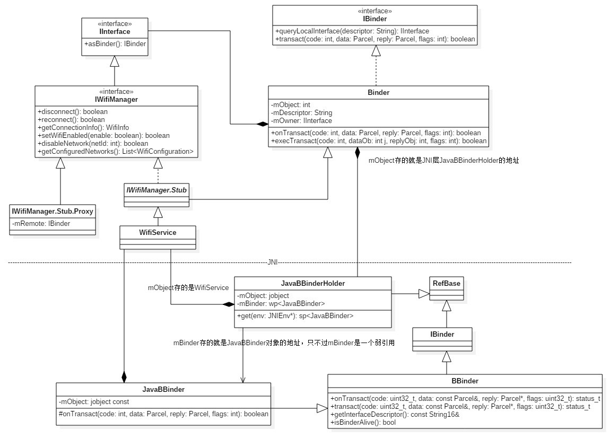
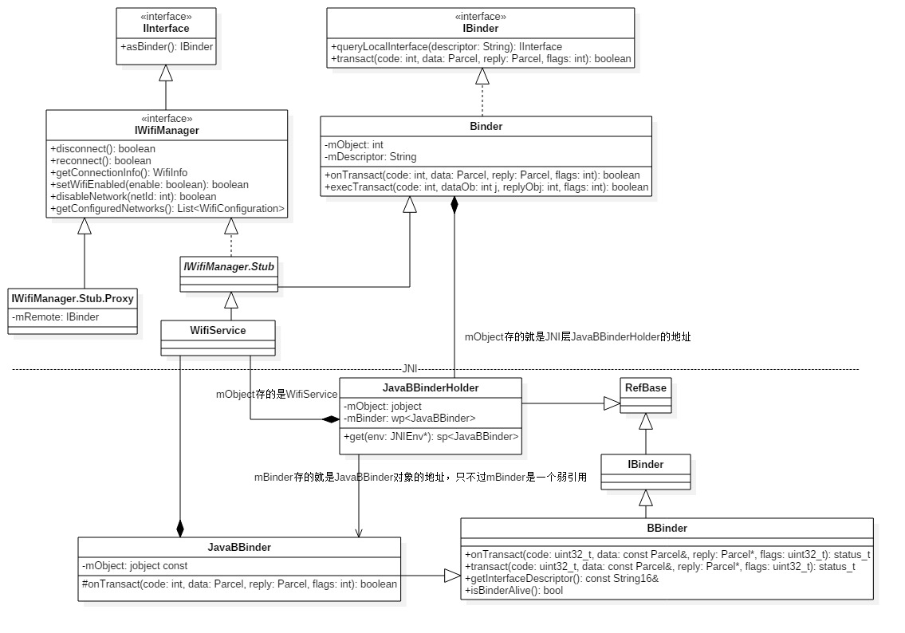
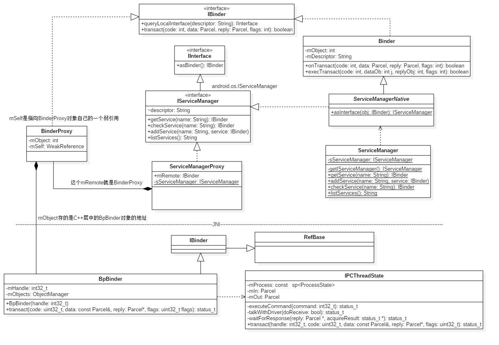
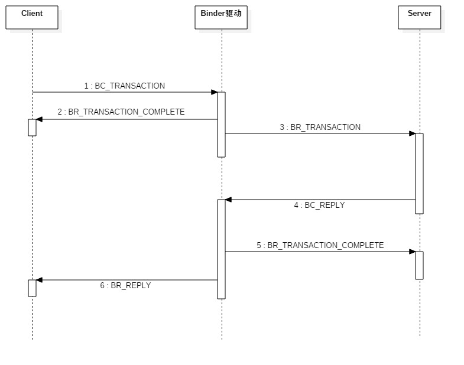
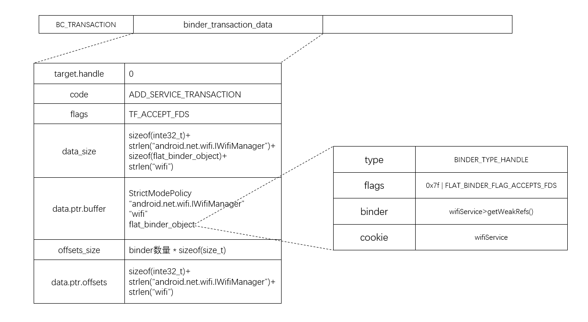
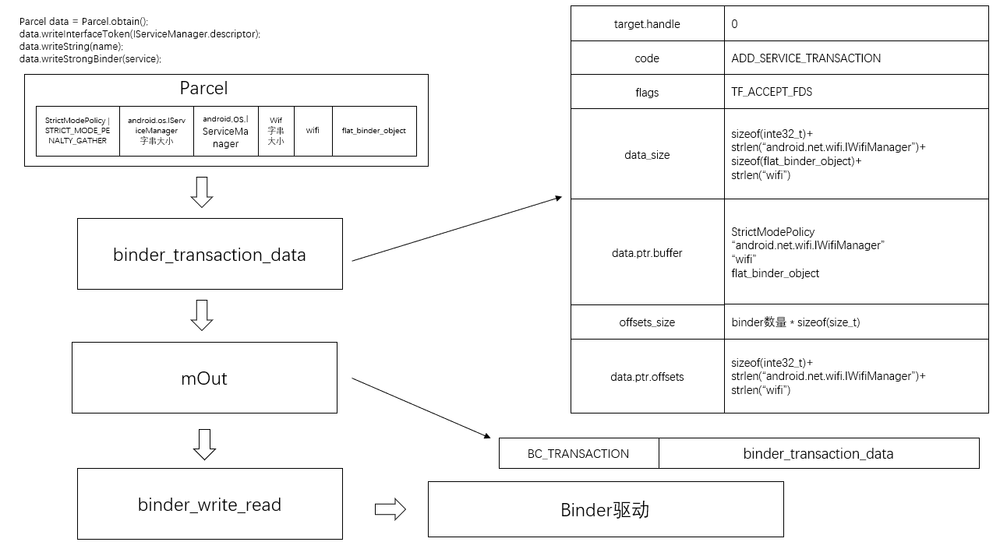

frameworks\base\services\java\com\android\server\WifiService.java

```java
public class WifiService extends IWifiManager.Stub {
	....
}
```

frameworks\base\wifi\java\android\net\wifi\IWifiManager.aidl

```java
public interface IWifiManager extends android.os.IInterface{

	public static abstract class IWifiManager.Stub extends android.os.Binder implements android.net.wifi.IWifiManager{
        
        private static final java.lang.String DESCRIPTOR = "android.net.wifi.IWifiManager";
    	
    	public Stub(){
            this.attachInterface(this,DESCRIPTOR);
        }
   	
   		 public static android.net.wifi.IWifiManager asInterface(android.os.Binder obj){
        	if(obj == null){
            	return null;
        	}
        	android.os.IInterface iin = (android.os.IInterface)obj.queryLocalInterface(DESCRIPTOR);
        	if( iin != null && iin instanceof android.net.wifi.IWifiManager){
             	return (android.net.wifi.IWifiManager)iin;
        	}
       		return new android.net.wifi.IWifiManager.Stub.Proxy(obj);
   		 }
    
   		 public android.od.IBinder asBinder(){
         		return this;
    	  }
    
    		.....
        
        
    	 private static final class Proxy implements android.net.wifi.IWifiManager{
             private android.od.IBinder mRemote;
             
             Proxy(android.os.IBinder remote){
                 mRemote = remote;
             }
             
              public android.od.IBinder asBinder(){
         		return mRemotes;
    	  	  }
             
             ....
         }
                
    }
    ....

}
```


## WifiService 启动

Wifiservice的启动地方在system server中

frameworks\base\services\java\com\android\server\SystemServer.java

```java
    native public static void init1(String[] args);

    public static void main(String[] args) {
        ....
        
        System.loadLibrary("android_servers");
        init1(args);
    }
```

frameworks\base\services\jni\com_android_server_SystemServer.cpp

```c
extern "C" int system_init();

static void android_server_SystemServer_init1(JNIEnv* env, jobject clazz)
{
    system_init();
}
```


rameworks\base\cmds\system_server\library\system_init.cpp

```c++
extern "C" status_t system_init()
{
   ....
    
    AndroidRuntime* runtime = AndroidRuntime::getRuntime();

    LOGI("System server: starting Android services.\n");
   
    // 执行到SystemServer的init2函数
    runtime->callStatic("com/android/server/SystemServer", "init2");
   .....
    return NO_ERROR;
}
```


frameworks\base\services\java\com\android\server\SystemServer.java

```java
public static final void init2() {
        Slog.i(TAG, "Entered the Android system server!");
        Thread thr = new ServerThread();
        thr.setName("android.server.ServerThread");
        thr.start();
}
```

`WifiService `的启动是在`ConnectivityService`中。

frameworks\base\services\java\com\android\server\SystemServer.java

```java
@Override
public void run() {
    ....
    
    try {
        Slog.i(TAG, "Connectivity Service");
        connectivity = ConnectivityService.getInstance(context);
        ServiceManager.addService(Context.CONNECTIVITY_SERVICE, connectivity);
    } catch (Throwable e) {
        Slog.e(TAG, "Failure starting Connectivity Service", e);
    }
  
    ....
}  
    
```


frameworks\base\services\java\com\android\server\ConnectivityService.java

```java
private ConnectivityService(Context context) {

    ....
        
	 for (int netType : mPriorityList) {
            switch (mNetAttributes[netType].mRadio) {
            case ConnectivityManager.TYPE_WIFI:
                if (DBG) Slog.v(TAG, "Starting Wifi Service.");
                
                WifiStateTracker wst = new WifiStateTracker(context, mHandler);
                WifiService wifiService = new WifiService(context, wst);
                ServiceManager.addService(Context.WIFI_SERVICE, wifiService);
                wifiService.startWifi();
                mNetTrackers[ConnectivityManager.TYPE_WIFI] = wst;
                wst.startMonitoring();

                break;
     ....

}
```


`WifiService`是`Binder`的子类,构造函数中有个`init`方法

```java
public class Binder implements IBinder{

	public Binder() {
        init();

       ...
    }
    
     private native final void init();
}
```

这个`init`就对应`JNI`层的`android_os_Binder_init`

frameworks\base\core\jni\android_util_Binder.cpp

```c++
static void android_os_Binder_init(JNIEnv* env, jobject clazz)
{
    JavaBBinderHolder* jbh = new JavaBBinderHolder(env, clazz);
    if (jbh == NULL) {
        jniThrowException(env, "java/lang/OutOfMemoryError", NULL);
        return;
    }
    LOGV("Java Binder %p: acquiring first ref on holder %p", clazz, jbh);
    jbh->incStrong(clazz); // 增加强引用计数
    
    // 将Binder中的mObject赋值jbh
    env->SetIntField(clazz, gBinderOffsets.mObject, (int)jbh);
}
```

构造一个`JavaBBinderHolder`对象，参数`clazz`就是Java层的`WifiService`对象。注意，也就是`WifiService`在构造的时候就已经在JNI层创建了`JavaBBinderHolder`，记住这个，后面注册时，会取出来。


frameworks\base\core\jni\android_util_Binder.cpp

```c++
class JavaBBinderHolder : public RefBase
{
public:
    JavaBBinderHolder(JNIEnv* env, jobject object) : mObject(object)
    {
        LOGV("Creating JavaBBinderHolder for Object %p\n", object);
    }
    ~JavaBBinderHolder()
    {
        LOGV("Destroying JavaBBinderHolder for Object %p\n", mObject);
    }

    sp<JavaBBinder> get(JNIEnv* env)
    {
        AutoMutex _l(mLock);
        // 升级强指针
        // 第一次调用肯定为NULL
        sp<JavaBBinder> b = mBinder.promote();
        if (b == NULL) {
            // 构造一个JavaBBinder,把对应java层Service对象传递进去
            b = new JavaBBinder(env, mObject);
            mBinder = b;
            LOGV("Creating JavaBinder %p (refs %p) for Object %p, weakCount=%d\n",
                 b.get(), b->getWeakRefs(), mObject, b->getWeakRefs()->getWeakCount());
        }

        return b;
    }

    sp<JavaBBinder> getExisting()
    {
        AutoMutex _l(mLock);
        return mBinder.promote();
    }

private:
    Mutex           mLock;
    jobject         mObject;   // 对应java层Service对象
    wp<JavaBBinder> mBinder;   // JavaBBinder的弱引用
};
```




frameworks\base\core\jni\android_util_Binder.cpp

```c++
class JavaBBinder : public BBinder
{
public:
    JavaBBinder(JNIEnv* env, jobject object)  : mVM(jnienv_to_javavm(env)), mObject(env->NewGlobalRef(object))
    {
        LOGV("Creating JavaBBinder %p\n", this);
        android_atomic_inc(&gNumLocalRefs);
        incRefsCreated(env);
    }

    bool    checkSubclass(const void* subclassID) const
    {
        return subclassID == &gBinderOffsets;
    }

    jobject object() const
    {
        return mObject;
    }

protected:
    virtual ~JavaBBinder()
    {
        LOGV("Destroying JavaBBinder %p\n", this);
        android_atomic_dec(&gNumLocalRefs);
        JNIEnv* env = javavm_to_jnienv(mVM);
        env->DeleteGlobalRef(mObject);
    }

    virtual status_t onTransact( uint32_t code, const Parcel& data, Parcel* reply, uint32_t flags = 0)
    {
        JNIEnv* env = javavm_to_jnienv(mVM);

        LOGV("onTransact() on %p calling object %p in env %p vm %p\n", this, mObject, env, mVM);

        IPCThreadState* thread_state = IPCThreadState::self();
        const int strict_policy_before = thread_state->getStrictModePolicy();
        thread_state->setLastTransactionBinderFlags(flags);

        //printf("Transact from %p to Java code sending: ", this);
        //data.print();
        //printf("\n");
        jboolean res = env->CallBooleanMethod(mObject, gBinderOffsets.mExecTransact,
            code, (int32_t)&data, (int32_t)reply, flags);
        jthrowable excep = env->ExceptionOccurred();

        // Restore the Java binder thread's state if it changed while
        // processing a call (as it would if the Parcel's header had a
        // new policy mask and Parcel.enforceInterface() changed
        // it...)
        const int strict_policy_after = thread_state->getStrictModePolicy();
        if (strict_policy_after != strict_policy_before) {
            // Our thread-local...
            thread_state->setStrictModePolicy(strict_policy_before);
            // And the Java-level thread-local...
            set_dalvik_blockguard_policy(env, strict_policy_before);
        }

        if (excep) {
            report_exception(env, excep,
                "*** Uncaught remote exception!  "
                "(Exceptions are not yet supported across processes.)");
            res = JNI_FALSE;

            /* clean up JNI local ref -- we don't return to Java code */
            env->DeleteLocalRef(excep);
        }

        //aout << "onTransact to Java code; result=" << res << endl
        //    << "Transact from " << this << " to Java code returning "
        //    << reply << ": " << *reply << endl;
        return res != JNI_FALSE ? NO_ERROR : UNKNOWN_TRANSACTION;
    }

    virtual status_t dump(int fd, const Vector<String16>& args)
    {
        return 0;
    }

private:
    JavaVM* const   mVM;
    jobject const   mObject;
};
```



## 注册WifiService

frameworks\base\services\java\com\android\server\ConnectivityService.java

```java
// Context.WIFI_SERVICE 值就是 wifi
ServiceManager.addService(Context.WIFI_SERVICE, wifiService);
```

frameworks\base\core\java\android\os\ServiceManager.java

```java
public static void addService(String name, IBinder service) {
     try {
         getIServiceManager().addService(name, service);
       } catch (RemoteException e) {
           Log.e(TAG, "error in addService", e);
      }
}

private static IServiceManager getIServiceManager() {
        if (sServiceManager != null) {
            return sServiceManager;
        }

        // Find the service manager
        // ServiceManagerProxy
        sServiceManager = ServiceManagerNative.asInterface(BinderInternal.getContextObject());
        return sServiceManager;
    }
```

获取ServiceManager代理对象的流程已经在其他章节讲过了。这里的`sServiceManager`返回的是`ServiceManagerProxy`



frameworks\base\core\java\android\os\ServiceManagerNative.java

```java
class ServiceManagerProxy implements IServiceManager {
    ...
	public void addService(String name, IBinder service) throws RemoteException {
        Parcel data = Parcel.obtain();
        Parcel reply = Parcel.obtain();
        data.writeInterfaceToken(IServiceManager.descriptor);
        data.writeString(name);
        data.writeStrongBinder(service);
        // 这个mRemote就是BinderProxy
        mRemote.transact(ADD_SERVICE_TRANSACTION, data, reply, 0);
        reply.recycle();
        data.recycle();
	 }
    
    ...
}
```

Client进程和Server进程的一次进程间通信过程可以划分为如下5个步骤：

1. Client进程将进程间通信数据封装成一个`Parcel`对象，以便可以将进程间通信数据转递给Binder驱动程序。
2. Client进程向Binder驱动程序发送一个`BC_TRANSACTION`命令协议，Binder驱动程序根据协议内容找到目标Server进程之后，就会向Client进程发送一个`BR_TRANSACTION_COMPLETE`返回协议，表示它的进程间通信请求已经被接受。Client进程接受到Binder驱动发送给它的`BR_TRANSACTION_COMPLETE`返回协议，并且对它进行处理后，就会再次进入到Binder驱动程序中去等待目标Server进程返回进程间通信结果。
3. Binder驱动程序在向Client进程发送`BR_TRANSACTION_COMPLETE`返回协议的同时，也会向目标Server进程发送一个`BR_TRANSACTION`命令协议，请求目标Server进程处理该进程间通信请求。
4. Server进程接受到Binder驱动程序发送来的`BR_TRANSACTION`返回协议，并且对它进行处理之后，就会相向Binder驱动程序发送一个`BC_REPLY`命令协议。Binder驱动程序根据协议内容找到目标Client之后，就会向Server进程发送一个`BR_TRANSACTION_COMPLETE`返回协议，表示它返回的进程间通信结果已经收到了。Server进程接受到Binder驱动程序发送给它的`BR_TRANSACTION_COMPLETE`返回协议，并且对它进行处理之后，一次进程通信过程就结束了。接着它会再次进入到Binder驱动程序中去等待下一次进程间通信请求。
5. Binder驱动程序向Server进程发送`BR_TRANSACTION_COMPLETE`返回协议的同时，也会向目标Client进程发送一个`BR_REPLY`返回协议，表示Server进程已经处理完成它的进程间通信请求了，并且将进程间通信结果返回给它。




frameworks\base\core\jni\android_util_Binder.cpp

```c++
static void android_os_Parcel_writeStrongBinder(JNIEnv* env, jobject clazz, jobject object)
{
    // clazz 对应java层的Parcel对象，用来获取一个C++层的Parcel对象
    Parcel* parcel = parcelForJavaObject(env, clazz);
    if (parcel != NULL) {
        // 相当于writeStrongBinder(JavaBBinder)
        // 因为JavaBBinder继承Binder
        // 所以就是writeStrongBinder(Binder)，这个类型比较重要，后面向Parcel写对象时会判断对象类型
        const status_t err = parcel->writeStrongBinder(ibinderForJavaObject(env, object));
        if (err != NO_ERROR) {
            jniThrowException(env, "java/lang/OutOfMemoryError", NULL);
        }
    }
}
```

`ibinderForJavaObject(env, object)`返回的是一个C++层的`JavaBBinderHolder`对象


```c++
sp<IBinder> ibinderForJavaObject(JNIEnv* env, jobject obj)
{
    // obj是java层的 android.os.IBinder 对象,即这个的wifiService
    if (obj == NULL) return NULL;

    // 查看obj是否是 android.os.Binder 类
    if (env->IsInstanceOf(obj, gBinderOffsets.mClass)) {
        // wifiServices是 android.os.Binder的子类
        // 从wifiServices获取mObject，即c++层中的JavaBBinderHolder对象
        JavaBBinderHolder* jbh = (JavaBBinderHolder*) env->GetIntField(obj, gBinderOffsets.mObject);
        //  get方法就可以获得JavaBBinder对象
        return jbh != NULL ? jbh->get(env) : NULL;
    }

    // android.os.BinderProxy
    // 这个是给ServiceManager使用的
    if (env->IsInstanceOf(obj, gBinderProxyOffsets.mClass)) {
        return (IBinder*) env->GetIntField(obj, gBinderProxyOffsets.mObject);
    }

    LOGW("ibinderForJavaObject: %p is not a Binder object", obj);
    return NULL;
}
```


frameworks\base\libs\binder\Parcel.cpp

```c++
status_t Parcel::writeStrongBinder(const sp<IBinder>& val)
{
    // 根据上面，这个val是JavaBBinder对象
    return flatten_binder(ProcessState::self(), val, this);
}
```


frameworks\base\libs\binder\Parcel.cpp

```c++
inline static status_t finish_flatten_binder(const sp<IBinder>& binder, const flat_binder_object& flat, Parcel* out)
{
    // 根据上面，这个binder是JavaBBinder对象
    return out->writeObject(flat, false);
}

status_t flatten_binder(const sp<ProcessState>& proc, const sp<IBinder>& binder, Parcel* out)
{
     // 根据上面，这个binder是JavaBBinder对象
    flat_binder_object obj;
    
    // 0x7f用来描述将要注册的Service组件在处理一个进程间通信请求时，它所使用的Server线程的优先级不能低于0x7f
    // FLAT_BINDER_FLAG_ACCEPTS_FDS表示可以将包含文件描述符的进程间通信数据传递给将要注册Service组件处理
    obj.flags = 0x7f | FLAT_BINDER_FLAG_ACCEPTS_FDS;
    if (binder != NULL) {
        
        // BBinder对象的 localBinder返回的就是自己，那么这个local指向的就是JavaBBinder对象
        IBinder *local = binder->localBinder();
        if (!local) {
            BpBinder *proxy = binder->remoteBinder();
            if (proxy == NULL) {
                LOGE("null proxy");
            }
            const int32_t handle = proxy ? proxy->handle() : 0;
            obj.type = BINDER_TYPE_HANDLE;
            obj.handle = handle;
            obj.cookie = NULL;
        } else {
            // BINDER_TYPE_BINDER 类型
            obj.type = BINDER_TYPE_BINDER;
            // JavaBBinder对象的弱引用
            obj.binder = local->getWeakRefs();
            // JavaBBinder对象地址
            obj.cookie = local;
        }
    } else {
        obj.type = BINDER_TYPE_BINDER;
        obj.binder = NULL;
        obj.cookie = NULL;
    }
    
    return finish_flatten_binder(binder, obj, out);
}
```

先构造一个`flat_binder_object`，然后往`Parcel`中写


frameworks\base\libs\binder\Binder.cpp

```c++
BBinder* BBinder::localBinder()
{
    return this;
}
```

现在数据已经写入到缓冲区中，接下来分析

```c++
 // 这个mRemote就是BinderProxy
 mRemote.transact(ADD_SERVICE_TRANSACTION, data, reply, 0);
```


frameworks\base\core\java\android\os\Binder.java

```java
final class BinderProxy implements IBinder {
    final private WeakReference mSelf;  // 这个mSelf是指向BinderProxy对象自己的一个弱引用
    private int mObject;                // mObject存的是C++层中的BpBinder对象的地址

    
    ....
        
 // code:想要调用ServicManager什么函数
 // data:方法参数
 // reply:返回的数据
 // flags:同步还是异步，默认0表示同步
 public native boolean transact(int code, Parcel data, Parcel reply, int flags) throws RemoteException;
		// 调用JNI中的android_os_BinderProxy_transact方法
    ...
}

```


frameworks\base\core\jni\android_util_Binder.cpp

````c++
/**
obj：java层的BinderProxy对象
code：想要调用ServicManager什么函数
dataObj：java层的data
replyObj：reply
flags：同步还是异步，默认0表示同步
*/
static jboolean android_os_BinderProxy_transact(JNIEnv* env, jobject obj,
                                                jint code, jobject dataObj,
                                                jobject replyObj, jint flags)
{
    if (dataObj == NULL) {
        jniThrowException(env, "java/lang/NullPointerException", NULL);
        return JNI_FALSE;
    }

    // 获取一个c++层的Parcel对象,用与写
    Parcel* data = parcelForJavaObject(env, dataObj);
    if (data == NULL) {
        return JNI_FALSE;
    }
    // 获取一个c++层的Parcel对象
    Parcel* reply = parcelForJavaObject(env, replyObj);
    if (reply == NULL && replyObj != NULL) {
        return JNI_FALSE;
    }

   
    // 获取java层的BinderProxy对象中mObject，即拿到c++层的BpBinder对象
    IBinder* target = (IBinder*)
        env->GetIntField(obj, gBinderProxyOffsets.mObject);
    if (target == NULL) {
        jniThrowException(env, "java/lang/IllegalStateException", "Binder has been finalized!");
        return JNI_FALSE;
    }

    LOGV("Java code calling transact on %p in Java object %p with code %d\n",
            target, obj, code);

    // Only log the binder call duration for things on the Java-level main thread.
    // But if we don't
    const bool time_binder_calls = should_time_binder_calls();

    int64_t start_millis;
    if (time_binder_calls) {
        start_millis = uptimeMillis();
    }
    //printf("Transact from Java code to %p sending: ", target); data->print();
    
    // 调用BpBinder的transact方法
    status_t err = target->transact(code, *data, reply, flags);
    //if (reply) printf("Transact from Java code to %p received: ", target); reply->print();
    if (time_binder_calls) {
        conditionally_log_binder_call(start_millis, target, code);
    }

    if (err == NO_ERROR) {
        return JNI_TRUE;
    } else if (err == UNKNOWN_TRANSACTION) {
        return JNI_FALSE;
    }

    signalExceptionForError(env, obj, err);
    return JNI_FALSE;
}
````


frameworks\base\libs\binder\BpBinder.cpp

```c++
status_t BpBinder::transact(uint32_t code, const Parcel& data, Parcel* reply, uint32_t flags)
{
    // Once a binder has died, it will never come back to life.
    if (mAlive) {
        status_t status = IPCThreadState::self()->transact(mHandle, code, data, reply, flags);
        if (status == DEAD_OBJECT) mAlive = 0;
        return status;
    }

    return DEAD_OBJECT;
}
```

实际上是调用了`IPCThreadState`的`transact`方法


frameworks\base\libs\binder\IPCThreadState.cpp

```c++
status_t IPCThreadState::transact(int32_t handle,
                                  uint32_t code, const Parcel& data,
                                  Parcel* reply, uint32_t flags)
{
    status_t err = data.errorCheck();

    
    flags |= TF_ACCEPT_FDS;

    ...
    
    if (err == NO_ERROR) {
        LOG_ONEWAY(">>>> SEND from pid %d uid %d %s", getpid(), getuid(),
            (flags & TF_ONE_WAY) == 0 ? "READ REPLY" : "ONE WAY");
        err = writeTransactionData(BC_TRANSACTION, flags, handle, code, data, NULL);
    }
    
    if (err != NO_ERROR) {
        if (reply) reply->setError(err);
        return (mLastError = err);
    }
    
    if ((flags & TF_ONE_WAY) == 0) {
        #if 0
        if (code == 4) { // relayout
            LOGI(">>>>>> CALLING transaction 4");
        } else {
            LOGI(">>>>>> CALLING transaction %d", code);
        }
        #endif
        if (reply) {
            err = waitForResponse(reply);
        } else {
            Parcel fakeReply;
            err = waitForResponse(&fakeReply);
        }
        #if 0
        if (code == 4) { // relayout
            LOGI("<<<<<< RETURNING transaction 4");
        } else {
            LOGI("<<<<<< RETURNING transaction %d", code);
        }
        #endif
        
        IF_LOG_TRANSACTIONS() {
            TextOutput::Bundle _b(alog);
            alog << "BR_REPLY thr " << (void*)pthread_self() << " / hand "
                << handle << ": ";
            if (reply) alog << indent << *reply << dedent << endl;
            else alog << "(none requested)" << endl;
        }
    } else {
        err = waitForResponse(NULL, NULL);
    }
    
    return err;
}
```


frameworks\base\libs\binder\IPCThreadState.cpp

```c++
status_t IPCThreadState::writeTransactionData(int32_t cmd, uint32_t binderFlags,
    int32_t handle, uint32_t code, const Parcel& data, status_t* statusBuffer)
{
    binder_transaction_data tr;

    tr.target.handle = handle;
    tr.code = code;
    tr.flags = binderFlags;
    
    const status_t err = data.errorCheck();
    if (err == NO_ERROR) {
        tr.data_size = data.ipcDataSize();
        tr.data.ptr.buffer = data.ipcData();
        tr.offsets_size = data.ipcObjectsCount()*sizeof(size_t);
        tr.data.ptr.offsets = data.ipcObjects();
    } else if (statusBuffer) {
        tr.flags |= TF_STATUS_CODE;
        *statusBuffer = err;
        tr.data_size = sizeof(status_t);
        tr.data.ptr.buffer = statusBuffer;
        tr.offsets_size = 0;
        tr.data.ptr.offsets = NULL;
    } else {
        return (mLastError = err);
    }
    
    mOut.writeInt32(cmd);
    mOut.write(&tr, sizeof(tr));
    
    return NO_ERROR;
}
```



至此`mOut`里面就有一个`BC_TRANSACTION`命令协议。


frameworks\base\include\binder\IPCThreadState.h

参数`doReceive`有个默认值true

```c++
 status_t            talkWithDriver(bool doReceive=true);
```


frameworks\base\libs\binder\IPCThreadState.cpp

```c++
status_t IPCThreadState::talkWithDriver(bool doReceive)
{
    LOG_ASSERT(mProcess->mDriverFD >= 0, "Binder driver is not opened");
    
    binder_write_read bwr;
    
    // Is the read buffer empty?
    // 进程已经处理完上次Binder驱动发送的返回协议，那么needRead就是true
    const bool needRead = mIn.dataPosition() >= mIn.dataSize();
    
    // We don't want to write anything if we are still reading
    // from data left in the input buffer and the caller
    // has requested to read the next data.
    const size_t outAvail = (!doReceive || needRead) ? mOut.dataSize() : 0;
    
    bwr.write_size = outAvail;
    // 缓冲区的地址
    bwr.write_buffer = (long unsigned int)mOut.data();

    // This is what we'll read.
    if (doReceive && needRead) {
        bwr.read_size = mIn.dataCapacity();
        bwr.read_buffer = (long unsigned int)mIn.data();
    } else {
        bwr.read_size = 0;
    }
    
  .....
    
    // Return immediately if there is nothing to do.
    if ((bwr.write_size == 0) && (bwr.read_size == 0)) return NO_ERROR;
    
    bwr.write_consumed = 0;
    bwr.read_consumed = 0;
    status_t err;
    do {
       ...
#if defined(HAVE_ANDROID_OS)
        if (ioctl(mProcess->mDriverFD, BINDER_WRITE_READ, &bwr) >= 0)
            err = NO_ERROR;
        else
            err = -errno;
#else
        err = INVALID_OPERATION;
#endif
        ...
    } while (err == -EINTR);
    
    ...

    if (err >= NO_ERROR) {
        if (bwr.write_consumed > 0) {
            if (bwr.write_consumed < (ssize_t)mOut.dataSize())
                mOut.remove(0, bwr.write_consumed);
            else
                mOut.setDataSize(0);
        }
        if (bwr.read_consumed > 0) {
            mIn.setDataSize(bwr.read_consumed);
            mIn.setDataPosition(0);
        }
        ...
        return NO_ERROR;
    }
    
    return err;
}
```

`talkWithDriver`使用IO命令`BINDER_WRITE_READ`来与Binder驱动交互，它需要定义一个`binder_write_read`结构体来指定输入缓冲区和输出缓冲区。


drivers\staging\android\binder.c

```c
// cmd:就是上面传进来的 BINDER_WRITE_READ
// arg:就是&bwr地址
static long binder_ioctl(struct file *filp, unsigned int cmd, unsigned long arg)
{
	int ret;
	struct binder_proc *proc = filp->private_data;
	struct binder_thread *thread;
	unsigned int size = _IOC_SIZE(cmd);
	void __user *ubuf = (void __user *)arg;

	ret = wait_event_interruptible(binder_user_error_wait, binder_stop_on_user_error < 2);
	if (ret)
		return ret;

	mutex_lock(&binder_lock);
	thread = binder_get_thread(proc);
	if (thread == NULL) {
		ret = -ENOMEM;
		goto err;
	}

	switch (cmd) {
	case BINDER_WRITE_READ: {
		
        struct binder_write_read bwr;
        
		if (size != sizeof(struct binder_write_read)) {
			ret = -EINVAL;
			goto err;
		}
        // 把在用户空间的ubuf数据赋值到&bwr
		if (copy_from_user(&bwr, ubuf, sizeof(bwr))) {
			ret = -EFAULT;
			goto err;
		}
		...
            
		if (bwr.write_size > 0) {
            
            // 我们知道，上面的给bwr设置的write_size是大于0的
			ret = binder_thread_write(proc, thread, (void __user *)bwr.write_buffer, bwr.write_size, &bwr.write_consumed);
			if (ret < 0) {
				bwr.read_consumed = 0;
				if (copy_to_user(ubuf, &bwr, sizeof(bwr)))
					ret = -EFAULT;
				goto err;
			}
		}
		if (bwr.read_size > 0) {
			ret = binder_thread_read(proc, thread, (void __user *)bwr.read_buffer, bwr.read_size, &bwr.read_consumed, filp->f_flags & O_NONBLOCK);
			if (!list_empty(&proc->todo))
				wake_up_interruptible(&proc->wait);
			if (ret < 0) {
				if (copy_to_user(ubuf, &bwr, sizeof(bwr)))
					ret = -EFAULT;
				goto err;
			}
		}
		if (binder_debug_mask & BINDER_DEBUG_READ_WRITE)
			printk(KERN_INFO "binder: %d:%d wrote %ld of %ld, read return %ld of %ld\n",
			       proc->pid, thread->pid, bwr.write_consumed, bwr.write_size, bwr.read_consumed, bwr.read_size);
		if (copy_to_user(ubuf, &bwr, sizeof(bwr))) {
			ret = -EFAULT;
			goto err;
		}
		break;
	}
            
	.....
        
	}
	ret = 0;
err:
	if (thread)
		thread->looper &= ~BINDER_LOOPER_STATE_NEED_RETURN;
	mutex_unlock(&binder_lock);
	wait_event_interruptible(binder_user_error_wait, binder_stop_on_user_error < 2);
	if (ret && ret != -ERESTARTSYS)
		printk(KERN_INFO "binder: %d:%d ioctl %x %lx returned %d\n", proc->pid, current->pid, cmd, arg, ret);
	return ret;
}
```


drivers\staging\android\binder.c

```c
int
binder_thread_write(struct binder_proc *proc, struct binder_thread *thread,
		    void __user *buffer, int size, signed long *consumed)
{
	uint32_t cmd;
    // 驱动需要读取缓冲区的起始于结束地址
	void __user *ptr = buffer + *consumed;
	void __user *end = buffer + size;

	while (ptr < end && thread->return_error == BR_OK) {
		if (get_user(cmd, (uint32_t __user *)ptr))
			return -EFAULT;
        // 读取到cmd后，指针移动sizeof(uint32_t)大小，为了读取后面的
		ptr += sizeof(uint32_t);
		...
		switch (cmd) {
		...

		case BC_TRANSACTION:
		case BC_REPLY: {
			struct binder_transaction_data tr;

			if (copy_from_user(&tr, ptr, sizeof(tr)))
				return -EFAULT;
			ptr += sizeof(tr);
			binder_transaction(proc, thread, &tr, cmd == BC_REPLY);
			break;
		}

		...
		}
		*consumed = ptr - buffer;
	}
	return 0;
}
```




`binder_transaction`函数有点长，分段分析,`reply`用来描述处理的是`BC_TRANSACTION`还是`BC_REPLY`协议,这里我们研究`BC_TRANSACTION`

drivers\staging\android\binder.c

```c
// reply：用来描述处理的是BC_TRANSACTION还是BC_REPLY协议
static void
binder_transaction(struct binder_proc *proc, struct binder_thread *thread,struct binder_transaction_data *tr, int reply)
{
	struct binder_transaction *t;
	struct binder_work *tcomplete;
	size_t *offp, *off_end;
	struct binder_proc *target_proc;
	struct binder_thread *target_thread = NULL;
	struct binder_node *target_node = NULL;
	struct list_head *target_list;
	wait_queue_head_t *target_wait;
	struct binder_transaction *in_reply_to = NULL;
	struct binder_transaction_log_entry *e;
	uint32_t return_error;

	e = binder_transaction_log_add(&binder_transaction_log);
	e->call_type = reply ? 2 : !!(tr->flags & TF_ONE_WAY);
	e->from_proc = proc->pid;
	e->from_thread = thread->pid;
	e->target_handle = tr->target.handle;
	e->data_size = tr->data_size;
	e->offsets_size = tr->offsets_size;
    
    if (reply) {
        ....
    }else {
        
        // 我们想把wifiService注册到ServiceManager中，那么target.handle就是0,即tr->target.handle就是false
		if (tr->target.handle) {
          ...
		} else {
            // 拿到ServiceManager在binder驱动中的binder实体对象
			target_node = binder_context_mgr_node;
			if (target_node == NULL) {
				return_error = BR_DEAD_REPLY;
				goto err_no_context_mgr_node;
			}
		}
        
		...
        // 拿到binder实体对象就可以拿到对应进程的binder_proc    
		target_proc = target_node->proc;
        
		if (target_proc == NULL) {
			return_error = BR_DEAD_REPLY;
			goto err_dead_binder;
		}
        
        // TF_ONE_WAY位为1，就表示需要异步传输，不需要等待回复数据
		if (!(tr->flags & TF_ONE_WAY) && thread->transaction_stack) {
			struct binder_transaction *tmp;
			tmp = thread->transaction_stack;
			if (tmp->to_thread != thread) {
				....
				return_error = BR_FAILED_REPLY;
				goto err_bad_call_stack;
			}
			while (tmp) {
				if (tmp->from && tmp->from->proc == target_proc)
					target_thread = tmp->from;
				tmp = tmp->from_parent;
			}
		}
	}
    
	if (target_thread) {
		e->to_thread = target_thread->pid;
		target_list = &target_thread->todo;
		target_wait = &target_thread->wait;
	} else {
		target_list = &target_proc->todo;
		target_wait = &target_proc->wait;
	}
```


## 获取WifiService服务代理

