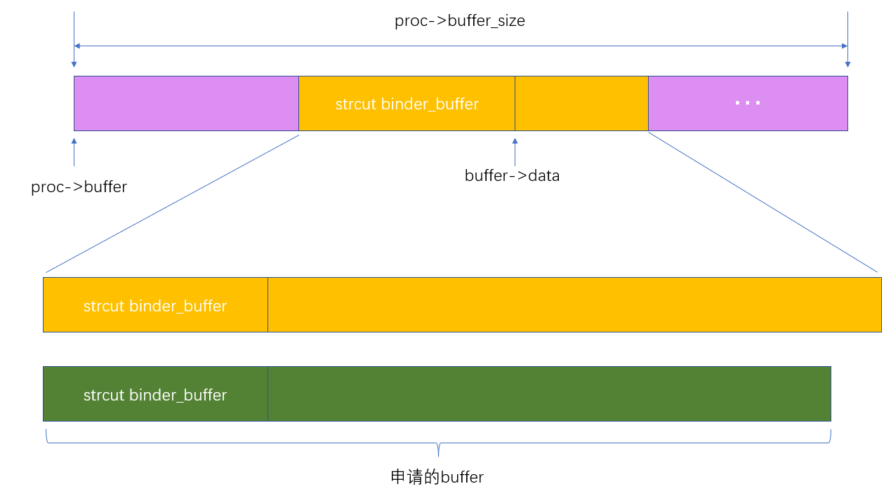
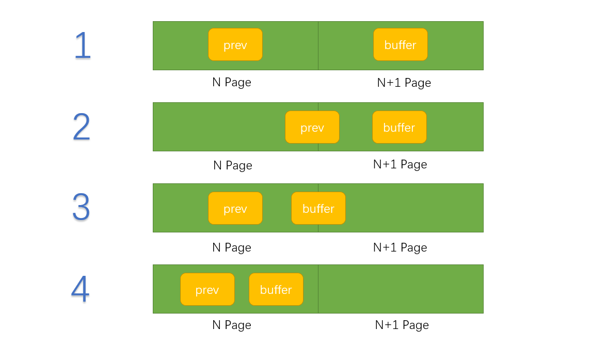
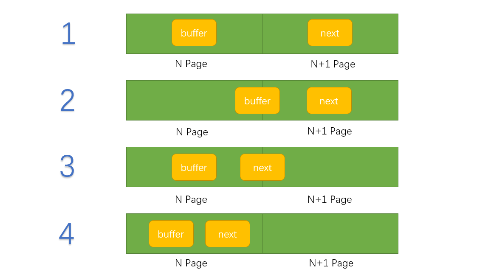

## 分配内核缓冲区

当一个进程使用命令协议`BC_TRANSACTION`或者`BC_REPLY`向另一个进程传递数据时，Binder驱动就会从用户空间拷贝数据到内核空间，然后再传递给目标进程。这时候Binder驱动就需要再目标进程的.内存池中分配出一小块内核缓冲区来保存这些数据

drivers\staging\android\binder.c

```java
/*
proc:目标进程
data_size：数据区大小
offsets_size：偏移数组大小
is_async：请求的内核缓冲区是用于异步事务还是同步事务,true:异步事务
*/
static struct binder_buffer *binder_alloc_buf(struct binder_proc *proc,
	size_t data_size, size_t offsets_size, int is_async)
{
	
	struct rb_node *n = proc->free_buffers.rb_node;
	struct binder_buffer *buffer;
	size_t buffer_size;
	struct rb_node *best_fit = NULL;
	void *has_page_addr;
	void *end_page_addr;
	size_t size;

	if (proc->vma == NULL) {
		printk(KERN_ERR "binder: %d: binder_alloc_buf, no vma\n",
		       proc->pid);
		return NULL;
	}

	// 数据分为data区的数据（里面包含基本类型的数据和binder对象）
	// 还有offsets数组大小，这里用来记录data区中binder对象的偏移位置
	// 注意这个size只是整个数据的一部分，还有binder_buffer结构体占用的空间
	size = ALIGN(data_size, sizeof(void *)) +
		ALIGN(offsets_size, sizeof(void *));

	// 有溢出，数据太大了
	if (size < data_size || size < offsets_size) {
		binder_user_error("binder: %d: got transaction with invalid "
			"size %zd-%zd\n", proc->pid, data_size, offsets_size);
		return NULL;
	}

    // 如果是异步事务，检查异步事务的内存空间
	// 在binder_mmap时已经将异步事务的内核缓冲区大小为其一半，防止异步事务消耗过多的内核缓冲区
	if (is_async &&
	    proc->free_async_space < size + sizeof(struct binder_buffer)) {
		if (binder_debug_mask & BINDER_DEBUG_BUFFER_ALLOC)
			printk(KERN_ERR "binder: %d: binder_alloc_buf size %zd f"
			       "ailed, no async space left\n", proc->pid, size);
		return NULL;
	}

    // 在空闲的节点中，查找大小最合适的buffer，空闲节点是以大小为序组织在红黑树中的
	while (n) {
		buffer = rb_entry(n, struct binder_buffer, rb_node);
		BUG_ON(!buffer->free);
		buffer_size = binder_buffer_size(proc, buffer);
		
		if (size < buffer_size) {
			// 红黑树嘛，小的值在左边
			best_fit = n;
			n = n->rb_left;
		} else if (size > buffer_size)
			// 大的值在右边
			n = n->rb_right;
		else {
			best_fit = n;
			break;
		}
	}
	// 该循环结束后，best_fit指向空闲节点中buffer的大小与请求大小最接近且满足请求大小的节点
	if (best_fit == NULL) {
		printk(KERN_ERR "binder: %d: binder_alloc_buf size %zd failed, "
		       "no address space\n", proc->pid, size);
		return NULL;
	}
	// 没有找到大小与请求大小正好的节点(节点拥有的地址空间本次分配后有剩余)，
	// 将buffer和buffer_size修正为best_fit指向节点的地址和大小，
	// 如果找到大小相等的，这两个值已经是正确的了。
	if (n == NULL) {
		buffer = rb_entry(best_fit, struct binder_buffer, rb_node);
		buffer_size = binder_buffer_size(proc, buffer);
	}
	if (binder_debug_mask & BINDER_DEBUG_BUFFER_ALLOC)
		printk(KERN_INFO "binder: %d: binder_alloc_buf size %zd got buff"
		       "er %p size %zd\n", proc->pid, size, buffer, buffer_size);

	// 该binder_buffer节点所管理的虚拟地址空间最后一页的起始虚拟地址
	// 对齐4KB字节位置
	has_page_addr = (void *)(((uintptr_t)buffer->data + buffer_size) & PAGE_MASK);
	if (n == NULL) {
		// 裁剪内核缓冲区，4是4字节，一页就是4字节，物理内存按照一页进行分配
		if (size + sizeof(struct binder_buffer) + 4 >= buffer_size)
			// 节点空闲地址空间在本次分配后不足于容纳其他的binder_buffer
			buffer_size = size; /* no room for other buffers */
		else
			// 多申请一个binder_buffer，记录节点分配后剩余空间的状态
			buffer_size = size + sizeof(struct binder_buffer);
	}
	// 请求地址空间中最后一页的页末地址
	end_page_addr = (void *)PAGE_ALIGN((uintptr_t)buffer->data + buffer_size);
	if (end_page_addr > has_page_addr)
		end_page_addr = has_page_addr;
	
	// 分配物理页框，并和内核态地址和用户地址空间建立映射
	if (binder_update_page_range(proc, 1,
	     // 这里从data开始进行页对齐的原因是：binder_buffer本身所在的页已经分配过物理页框了
	    (void *)PAGE_ALIGN((uintptr_t)buffer->data), end_page_addr, NULL))
		return NULL;

	// 从空闲buffer红黑树中移除该节点
	rb_erase(best_fit, &proc->free_buffers);
	buffer->free = 0;
	// 将分配的binder_buffer插入到已分配地址的红黑树中
	binder_insert_allocated_buffer(proc, buffer);
	
	// 如果找到节点所拥有的buffer大小超过请求分配的大小（外加sizeof(struct binder_buffer) + 4）
	// 则将节点剩余未分配的空间重新插入到空闲buffer的红黑树中
	if (buffer_size != size) {
		struct binder_buffer *new_buffer = (void *)buffer->data + size;
		list_add(&new_buffer->entry, &buffer->entry);
		new_buffer->free = 1;
		binder_insert_free_buffer(proc, new_buffer);
	}
	if (binder_debug_mask & BINDER_DEBUG_BUFFER_ALLOC)
		printk(KERN_INFO "binder: %d: binder_alloc_buf size %zd got "
		       "%p\n", proc->pid, size, buffer);
	buffer->data_size = data_size;
	buffer->offsets_size = offsets_size;
	buffer->async_transaction = is_async;
	if (is_async) {
		// 如果是异步的，还需要更新异步空间的大小。
		proc->free_async_space -= size + sizeof(struct binder_buffer);
		if (binder_debug_mask & BINDER_DEBUG_BUFFER_ALLOC_ASYNC)
			printk(KERN_INFO "binder: %d: binder_alloc_buf size %zd "
			       "async free %zd\n", proc->pid, size,
			       proc->free_async_space);
	}

	return buffer;
}
```


假如找到了一个buffer使用，但是这个buffer中的buffer_size比申请的还大，那么需要考虑两种情况

1. 剩余的空间还能给下一个binder_buffer使用


2. 分配后，剩下的空间已经不足以给下一个binder_buffer使用




## 释放内核缓冲区

当一个进程处理完成Binder驱动给它发送的返回协议`BR_TRANSATION`或者`BR_REPLY`之后，它就会使用命令`BC_FREEE_BUFFER`来通知Binder驱动释放相应的内核缓冲区。

drivers\staging\android\binder.c

```c++
static void binder_free_buf(struct binder_proc *proc, struct binder_buffer *buffer)
{
	size_t size, buffer_size;

	// 计算要释放的内核缓冲区buffer的大小
	buffer_size = binder_buffer_size(proc, buffer);

	size = ALIGN(buffer->data_size, sizeof(void *)) +
		ALIGN(buffer->offsets_size, sizeof(void *));
		
	if (binder_debug_mask & BINDER_DEBUG_BUFFER_ALLOC)
		printk(KERN_INFO "binder: %d: binder_free_buf %p size %zd buffer"
		       "_size %zd\n", proc->pid, buffer, size, buffer_size);

	BUG_ON(buffer->free);
	BUG_ON(size > buffer_size);
	BUG_ON(buffer->transaction != NULL);
	BUG_ON((void *)buffer < proc->buffer);
	BUG_ON((void *)buffer > proc->buffer + proc->buffer_size);

	// 是否是用于异步事务
	if (buffer->async_transaction) {
		// 增加异步任务缓冲区大小
		proc->free_async_space += size + sizeof(struct binder_buffer);
		if (binder_debug_mask & BINDER_DEBUG_BUFFER_ALLOC_ASYNC)
			printk(KERN_INFO "binder: %d: binder_free_buf size %zd "
			       "async free %zd\n", proc->pid, size,
			       proc->free_async_space);
	}

	// 释放物理页面
	binder_update_page_range(proc, 0,
		(void *)PAGE_ALIGN((uintptr_t)buffer->data),
		(void *)(((uintptr_t)buffer->data + buffer_size) & PAGE_MASK),
		NULL);
    
	// 从红黑树中删除,后面会把合并好更大的空间添加到allocated_buffers红黑树中的
	rb_erase(&buffer->rb_node, &proc->allocated_buffers);
    
    // 表示这块缓冲区可以左为下次分配使用
	buffer->free = 1;
	
	if (!list_is_last(&buffer->entry, &proc->buffers)) {
		// 不是buffers链表中的最后一个元素
		// 找到这个buffer的下一个
		struct binder_buffer *next = list_entry(buffer->entry.next,struct binder_buffer, entry);
		if (next->free) {
            // next是空闲的，可能就会与buffer合并成一个更大的缓冲区，之所以所可能，还要看 binder_delete_free_buffer 函数
			// 下一个也是空闲的，就从free_buffers红黑树中删除
			// 因为要准备合并了，所以从free_buffers中删除
			rb_erase(&next->rb_node, &proc->free_buffers);
			// 假设 可以删除next，那么buffer的节点目前还是不会删除的，buffer中的结构体还在，用来描述的信息都在，只不过data区域的空用内存变大了
			binder_delete_free_buffer(proc, next);
		}
	}
    
	if (proc->buffers.next != &buffer->entry) {
        // 不能把buffers中的都删掉，因为还要靠它描述内存中的一些信息
        //  看看 buffer前面的缓冲区是不是free状态，如果是free状态，就把buffer合并到prev上
		struct binder_buffer *prev = list_entry(buffer->entry.prev, struct binder_buffer, entry);
		if (prev->free) {
            // 删除buffer，这样prev中的data区域就变大了，这不就是buffer合并到prev上了吗
			binder_delete_free_buffer(proc, buffer);
			rb_erase(&prev->rb_node, &proc->free_buffers);
			buffer = prev;
		}
	}
    
    // 重新插入合并好的缓冲区
	binder_insert_free_buffer(proc, buffer);
}
```

注意释放缓冲区时需要和这个缓冲区前后对比（缓冲区都在buffers这个链表中）


drivers\staging\android\binder.c

```c++
/*
1.要保证 buffer 指向的不是目标进程的第一个缓冲区
2.该缓冲区及它前面一个缓冲区都必须是空闲的。
*/
static void binder_delete_free_buffer(struct binder_proc *proc, struct binder_buffer *buffer)
{
	struct binder_buffer *prev, *next = NULL;
	int free_page_end = 1;
	int free_page_start = 1;

	BUG_ON(proc->buffers.next == &buffer->entry);
	 
	prev = list_entry(buffer->entry.prev, struct binder_buffer, entry);
	BUG_ON(!prev->free);
	if (buffer_end_page(prev) == buffer_start_page(buffer)) {
		free_page_start = 0;
		if (buffer_end_page(prev) == buffer_end_page(buffer))
			free_page_end = 0;
		if (binder_debug_mask & BINDER_DEBUG_BUFFER_ALLOC)
			printk(KERN_INFO "binder: %d: merge free, buffer %p "
			       "share page with %p\n", proc->pid, buffer, prev);
	}
    
    .....
        
```

`prev`与`buffer`两个之间很可能出现横跨物理页面，就会出现下面4种情况





- `buffer_end_page(prev) == buffer_start_page(buffer)`

  属于第2、3、4种，不能释放buffer end所在的页面，因为prev也在该页面

- `buffer_end_page(prev) == buffer_end_page(buffer)`

  属于第4种，不能释放buffer所在的页面，因为prev也在该页面

drivers\staging\android\binder.c

```c++
....

if (!list_is_last(&buffer->entry, &proc->buffers)) {
		next = list_entry(buffer->entry.next, struct binder_buffer, entry);
		if (buffer_start_page(next) == buffer_end_page(buffer)) {
			free_page_end = 0;
			if (buffer_start_page(next) == buffer_start_page(buffer))
				free_page_start = 0;
			if (binder_debug_mask & BINDER_DEBUG_BUFFER_ALLOC)
				printk(KERN_INFO "binder: %d: merge free, "
				       "buffer %p share page with %p\n",
				       proc->pid, buffer, prev);
		}
	}
....
```

现在buffer需要和下一个节点比较



- `buffer_start_page(next) == buffer_end_page(buffer)`

  属于第2、3、4种，不能释放buffer end 所在的页面，因为next也在该页面，就是

  第2种不能释放`N+1 Page`的页面

  第3种不能释放`N Page`的页面

  第4种不能释放`N Page`的页面

- `buffer_start_page(next) == buffer_start_page(buffer)`

  属于第4种，不能释放buffer start所在的页面，因为next也在该页面，即不能释放`N Page`的页面

  

drivers\staging\android\binder.c

```c++
    ....
    // 删除链表种的 buffer
    list_del(&buffer->entry);
	
    // 查看这两个标志位
	if (free_page_start || free_page_end) {
		if (binder_debug_mask & BINDER_DEBUG_BUFFER_ALLOC)
			printk(KERN_INFO "binder: %d: merge free, buffer %p do "
			       "not share page%s%s with with %p or %p\n",
			       proc->pid, buffer, free_page_start ? "" : " end",
			       free_page_end ? "" : " start", prev, next);
        
      
		binder_update_page_range(
            proc,
            0,    // 0 表示释放 ，1表示分配
            free_page_start ? buffer_start_page(buffer) : buffer_end_page(buffer), 
			(free_page_end ? buffer_end_page(buffer) :buffer_start_page(buffer)) + PAGE_SIZE, NULL);
	}
```


