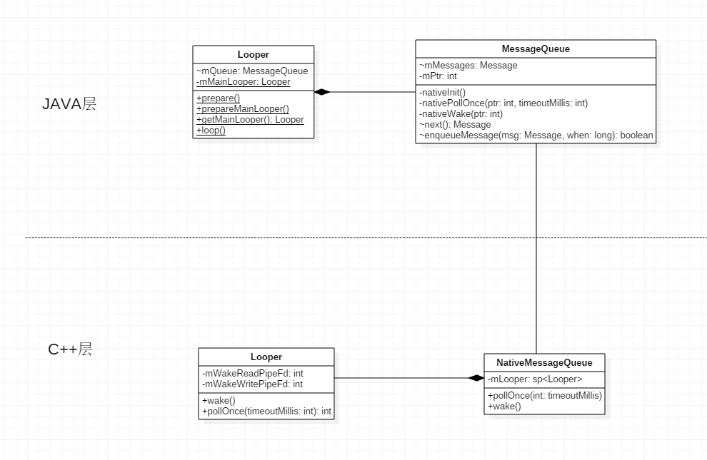

## 消息队列的创建

frameworks\base\core\java\android\os\Looper.java

```java
public class Looper {

    ....
        
     private static final ThreadLocal sThreadLocal = new ThreadLocal();
     final MessageQueue mQueue;
     private static Looper mMainLooper = null;
    
    ....
        
     private Looper() {
        // 在内部创建一个MessageQueue
        mQueue = new MessageQueue();
        mRun = true;
        mThread = Thread.currentThread();
    }
    
        
     public static final void prepare() {
        if (sThreadLocal.get() != null) {
            throw new RuntimeException("Only one Looper may be created per thread");
        }
        sThreadLocal.set(new Looper());
    }
    
    
    public static final void prepareMainLooper() {
        prepare();
        setMainLooper(myLooper());
        if (Process.supportsProcesses()) {
            myLooper().mQueue.mQuitAllowed = false;
        }
    }

}
```

`MessageQueue`的创建是在`Looper`的构造函数中

```java
public class MessageQueue {

    ...
        
    private int mPtr; // used by native code，JNI层的 NativeMessageQueue对象地址
    
    private native void nativeInit();
    private native void nativeDestroy();
    private native void nativePollOnce(int ptr, int timeoutMillis);
    private native void nativeWake(int ptr);
    
    ...
        
	MessageQueue() {
        nativeInit();
    }
    
    ...
    
}
```

frameworks\base\core\jni\android_os_MessageQueue.cpp

```c++
static JNINativeMethod gMessageQueueMethods[] = {
    /* name, signature, funcPtr */
    { "nativeInit", "()V", (void*)android_os_MessageQueue_nativeInit },
    { "nativeDestroy", "()V", (void*)android_os_MessageQueue_nativeDestroy },
    { "nativePollOnce", "(II)V", (void*)android_os_MessageQueue_nativePollOnce },
    { "nativeWake", "(I)V", (void*)android_os_MessageQueue_nativeWake }
};
```

`nativeInit`函数对应`android_os_MessageQueue_nativeInit`


frameworks\base\core\jni\android_os_MessageQueue.cpp

```c++
static void android_os_MessageQueue_nativeInit(JNIEnv* env, jobject obj) {
    
    // obj 就是java层的MessageQueue对象
    NativeMessageQueue* nativeMessageQueue = new NativeMessageQueue();
    if (! nativeMessageQueue) {
        jniThrowRuntimeException(env, "Unable to allocate native queue");
        return;
    }

    android_os_MessageQueue_setNativeMessageQueue(env, obj, nativeMessageQueue);
}

static void android_os_MessageQueue_setNativeMessageQueue(JNIEnv* env, jobject messageQueueObj, NativeMessageQueue* nativeMessageQueue) {
    env->SetIntField(messageQueueObj, gMessageQueueClassInfo.mPtr,reinterpret_cast<jint>(nativeMessageQueue));
}
```

`NativeMessageQueue`类的声明

frameworks\base\core\jni\android_os_MessageQueue.cpp

```c++
class NativeMessageQueue {
public:
    NativeMessageQueue();
    ~NativeMessageQueue();

    inline sp<Looper> getLooper() { return mLooper; }

    void pollOnce(int timeoutMillis);
    void wake();

private:
    sp<Looper> mLooper;
};
```


frameworks\base\core\jni\android_os_MessageQueue.cpp

```c++
NativeMessageQueue::NativeMessageQueue() {
    // 查看当前线程中的mLooper
    mLooper = Looper::getForThread();
    if (mLooper == NULL) {
        // 当前线程没有mLooper，创建一个，并且关联当前线程
        mLooper = new Looper(false);
        Looper::setForThread(mLooper);
    }
}
```


frameworks\base\libs\utils\Looper.cpp

```c++
Looper::Looper(bool allowNonCallbacks) : mAllowNonCallbacks(allowNonCallbacks), mResponseIndex(0) {
    int wakeFds[2];
    // 创建一个管道
    int result = pipe(wakeFds);
    LOG_ALWAYS_FATAL_IF(result != 0, "Could not create wake pipe.  errno=%d", errno);

    // 保存读写文件描述符
    mWakeReadPipeFd = wakeFds[0];
    mWakeWritePipeFd = wakeFds[1];

    
    result = fcntl(mWakeReadPipeFd, F_SETFL, O_NONBLOCK);
    LOG_ALWAYS_FATAL_IF(result != 0, "Could not make wake read pipe non-blocking.  errno=%d",
            errno);

    result = fcntl(mWakeWritePipeFd, F_SETFL, O_NONBLOCK);
    LOG_ALWAYS_FATAL_IF(result != 0, "Could not make wake write pipe non-blocking.  errno=%d",
            errno);

#ifdef LOOPER_USES_EPOLL
    // Allocate the epoll instance and register the wake pipe.
    // 创建epoll
    mEpollFd = epoll_create(EPOLL_SIZE_HINT);
    LOG_ALWAYS_FATAL_IF(mEpollFd < 0, "Could not create epoll instance.  errno=%d", errno);

    struct epoll_event eventItem;
    memset(& eventItem, 0, sizeof(epoll_event)); // zero out unused members of data field union
    eventItem.events = EPOLLIN;
   
    // 将前面所创建的管道的读端文件描述符添加到这个epoll实例中
    eventItem.data.fd = mWakeReadPipeFd;
    result = epoll_ctl(mEpollFd, EPOLL_CTL_ADD, mWakeReadPipeFd, & eventItem);
    LOG_ALWAYS_FATAL_IF(result != 0, "Could not add wake read pipe to epoll instance.  errno=%d",
            errno);
#else
    // Add the wake pipe to the head of the request list with a null callback.
    struct pollfd requestedFd;
    requestedFd.fd = mWakeReadPipeFd;
    requestedFd.events = POLLIN;
    mRequestedFds.push(requestedFd);

    Request request;
    request.fd = mWakeReadPipeFd;
    request.callback = NULL;
    request.ident = 0;
    request.data = NULL;
    mRequests.push(request);

    mPolling = false;
    mWaiters = 0;
#endif

#ifdef LOOPER_STATISTICS
    mPendingWakeTime = -1;
    mPendingWakeCount = 0;
    mSampledWakeCycles = 0;
    mSampledWakeCountSum = 0;
    mSampledWakeLatencySum = 0;

    mSampledPolls = 0;
    mSampledZeroPollCount = 0;
    mSampledZeroPollLatencySum = 0;
    mSampledTimeoutPollCount = 0;
    mSampledTimeoutPollLatencySum = 0;
#endif
}
```

C++层中的Looper对象有两个类型为int的成员变量`mWakeReadPipeFd`和`mWakeWritePipeFd`，它们分别用来描述有一个管道的读端文件描述符和写端文件描述符。当一个线程的消息队列没有消息需要处理时，它就会在这个管道的读端文件描述符上进行睡眠等待，直到其他线程通过这个管道的写端文件描述符来唤醒它为止。




## 消息循环

frameworks\base\core\java\android\os\Looper.java

```java
public static final void loop() {
        Looper me = myLooper();
        MessageQueue queue = me.mQueue;
        while (true) {
            Message msg = queue.next(); // might block
            //if (!me.mRun) {
            //    break;
            //}
            if (msg != null) {
                if (msg.target == null) {
                    // No target is a magic identifier for the quit message.
                    return;
                }
                if (me.mLogging!= null) me.mLogging.println(
                        ">>>>> Dispatching to " + msg.target + " "
                        + msg.callback + ": " + msg.what
                        );
                msg.target.dispatchMessage(msg);
                if (me.mLogging!= null) me.mLogging.println(
                        "<<<<< Finished to    " + msg.target + " "
                        + msg.callback);
                msg.recycle();
            }
        }
    }
```

调用`loop()`后就会不停的获取消息，如果有消息，`msg`就不为null，否则就会在`queue.next()`阻塞住。


```java
final Message next() {
    	// 用来保存注册到消息队列中的空闲消息处理器的个数，它的值是在下面计算的
        int pendingIdleHandlerCount = -1; // -1 only during first iteration
    
    	// 用来描述消息队列中没有新的消息需要处理时，当前线程需要进入睡眠等待状态的时间
        // 如果等于0，表示即使队列中没有新的消息需要处理，当前线程也不要进入睡眠等待状态
    	// 如果等于-1，表示队列中没有新的消息需要处理时，当前线程需要无限地处于睡眠等待状态，直到它被其他线程唤醒为止
        int nextPollTimeoutMillis = 0;

        for (;;) {
            if (nextPollTimeoutMillis != 0) {
                Binder.flushPendingCommands();
            }
            
            // nativePollOnce的调用很可能会导致当前线程进入睡眠等待，如果进入等待，nextPollTimeoutMillis就表示需要睡眠等待多久
            nativePollOnce(mPtr, nextPollTimeoutMillis);

            //  nativePollOnce 返回，处理消息
            synchronized (this) {
                // Try to retrieve the next message.  Return if found.
                final long now = SystemClock.uptimeMillis();
                
                // 如果有消息需要处理，mMessages就不会为null
                final Message msg = mMessages;
                if (msg != null) {
                    final long when = msg.when;
                    if (now >= when) {
                        // 消息需要处理的时间小于等于系统时间，表示该消息需要立即被处理
                        mBlocked = false;
                        // 下一个消息
                        mMessages = msg.next;
                        msg.next = null;
                        if (Config.LOGV) Log.v("MessageQueue", "Returning message: " + msg);
                        
                        // 返回到 Lopper的loop中处理
                        return msg;
                    } else {
                        
                        // 时间还没有到，计算下距离when相差多少，然后下次nativePollOnce时，当前线程就会睡眠多久
                        nextPollTimeoutMillis = (int) Math.min(when - now, Integer.MAX_VALUE);
                    }
                } else {
                    
                    // 没有消息需要处理，下一次调用 nativePollOnce 时，当前线程就会无限的处于睡眠状态，直到它被其他线程唤醒为止
                    nextPollTimeoutMillis = -1;
                }

                // If first time, then get the number of idlers to run.
                if (pendingIdleHandlerCount < 0) {
                    pendingIdleHandlerCount = mIdleHandlers.size();
                }
                if (pendingIdleHandlerCount == 0) {
                    // No idle handlers to run.  Loop and wait some more.
                    mBlocked = true;
                    continue;
                }

                if (mPendingIdleHandlers == null) {
                    mPendingIdleHandlers = new IdleHandler[Math.max(pendingIdleHandlerCount, 4)];
                }
                mPendingIdleHandlers = mIdleHandlers.toArray(mPendingIdleHandlers);
            }

            // Run the idle handlers.
            // We only ever reach this code block during the first iteration.
            for (int i = 0; i < pendingIdleHandlerCount; i++) {
                final IdleHandler idler = mPendingIdleHandlers[i];
                mPendingIdleHandlers[i] = null; // release the reference to the handler

                boolean keep = false;
                try {
                    keep = idler.queueIdle();
                } catch (Throwable t) {
                    Log.wtf("MessageQueue", "IdleHandler threw exception", t);
                }

                if (!keep) {
                    synchronized (this) {
                        mIdleHandlers.remove(idler);
                    }
                }
            }

            // Reset the idle handler count to 0 so we do not run them again.
            pendingIdleHandlerCount = 0;

            // While calling an idle handler, a new message could have been delivered
            // so go back and look again for a pending message without waiting.
            nextPollTimeoutMillis = 0;
        }
    }
```


frameworks\base\core\jni\android_os_MessageQueue.cpp

```c++
static void android_os_MessageQueue_nativePollOnce(JNIEnv* env, jobject obj, jint ptr, jint timeoutMillis) {
    NativeMessageQueue* nativeMessageQueue = reinterpret_cast<NativeMessageQueue*>(ptr);
    nativeMessageQueue->pollOnce(timeoutMillis);
}

void NativeMessageQueue::pollOnce(int timeoutMillis) {
    mLooper->pollOnce(timeoutMillis);
}
```


frameworks\base\include\utils\Looper.h

```c++
int pollOnce(int timeoutMillis, int* outFd, int* outEvents, void** outData);
 
inline int pollOnce(int timeoutMillis) {
     return pollOnce(timeoutMillis, NULL, NULL, NULL);
}
```


frameworks\base\libs\utils\Looper.cpp

```c++
int Looper::pollOnce(int timeoutMillis, int* outFd, int* outEvents, void** outData) {
    int result = 0;
    for (;;) {
        while (mResponseIndex < mResponses.size()) {
            const Response& response = mResponses.itemAt(mResponseIndex++);
            if (! response.request.callback) {
#if DEBUG_POLL_AND_WAKE
                LOGD("%p ~ pollOnce - returning signalled identifier %d: "
                        "fd=%d, events=0x%x, data=%p", this,
                        response.request.ident, response.request.fd,
                        response.events, response.request.data);
#endif
                if (outFd != NULL) *outFd = response.request.fd;
                if (outEvents != NULL) *outEvents = response.events;
                if (outData != NULL) *outData = response.request.data;
                return response.request.ident;
            }
        }

        if (result != 0) {
#if DEBUG_POLL_AND_WAKE
            LOGD("%p ~ pollOnce - returning result %d", this, result);
#endif
            if (outFd != NULL) *outFd = 0;
            if (outEvents != NULL) *outEvents = NULL;
            if (outData != NULL) *outData = NULL;
            return result;
        }

        result = pollInner(timeoutMillis);
    }
}
```


frameworks\base\libs\utils\Looper.cpp

```c++
int Looper::pollInner(int timeoutMillis) {
    ...

    int result = ALOOPER_POLL_WAKE;
    mResponses.clear();
    mResponseIndex = 0;

	...


    struct epoll_event eventItems[EPOLL_MAX_EVENTS];
    int eventCount = epoll_wait(mEpollFd, eventItems, EPOLL_MAX_EVENTS, timeoutMillis);
    bool acquiredLock = false;
	...
        
    for (int i = 0; i < eventCount; i++) {
        int fd = eventItems[i].data.fd;
        uint32_t epollEvents = eventItems[i].events;
        if (fd == mWakeReadPipeFd) {
            if (epollEvents & EPOLLIN) {
                	// 其他线程向当前线程关联的一个管道写入了一个新的数据，读取数据
                    awoken();
            } else {
                LOGW("Ignoring unexpected epoll events 0x%x on wake read pipe.", epollEvents);
            }
        } else {
            if (! acquiredLock) {
                mLock.lock();
                acquiredLock = true;
            }

            ...
        }
    }
    if (acquiredLock) {
        mLock.unlock();
    }


...
    return result;
}
```


frameworks\base\libs\utils\Looper.cpp

```c++
void Looper::awoken() {
...

    char buffer[16];
    ssize_t nRead;
    do {
        // 读取管道中的数据
        nRead = read(mWakeReadPipeFd, buffer, sizeof(buffer));
    } while ((nRead == -1 && errno == EINTR) || nRead == sizeof(buffer));
}
```

## 发送消息

frameworks\base\core\java\android\os\Handler.java

```java
public class Handler {

	...
	
  	public void handleMessage(Message msg) {
  	}
  
 	public Handler() {
       ...

        mLooper = Looper.myLooper();
        if (mLooper == null) {
            throw new RuntimeException(
                "Can't create handler inside thread that has not called Looper.prepare()");
        }
        mQueue = mLooper.mQueue;
        mCallback = null;
    }
  
	...

}
```

