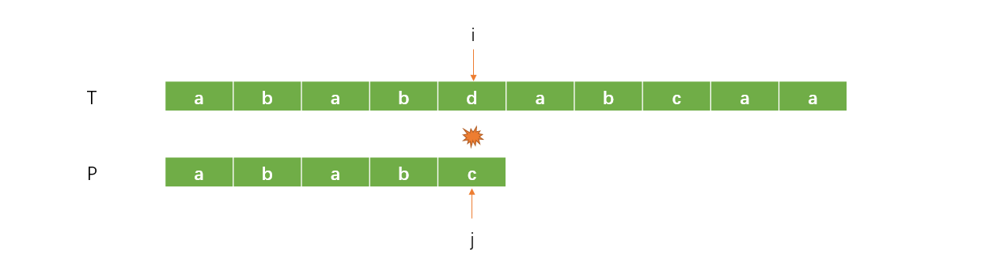
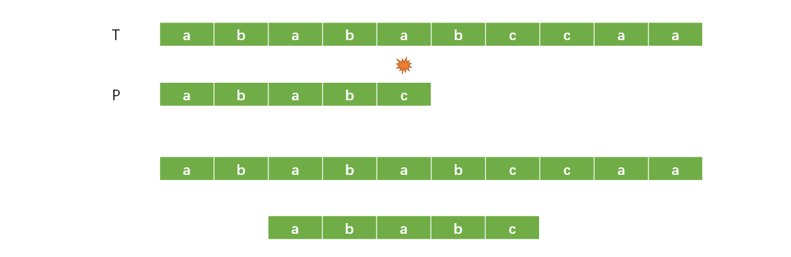
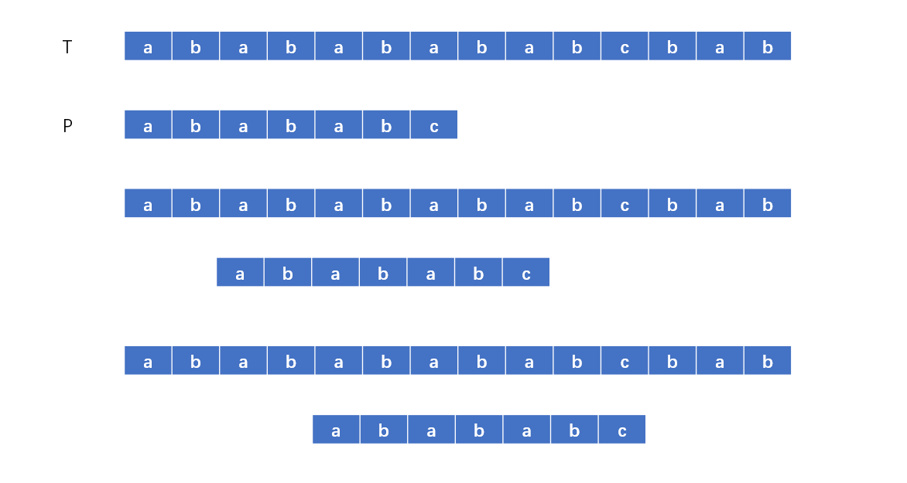

## 朴素字符串比较

朴素字符串比较就是主串T与匹配串P一个一个字符进行比较，假设主串有m个字符，匹配串有n个字符，那么就要比较（m-n+1）n个（m>n）


```java
public static int simple(String t, String p) {
    if (t == null || p == null) {
        return -1;
    }
    if (t.length() < p.length()) {
        return -1;
    }
    char[] ct = t.toCharArray();
    char[] cp = p.toCharArray();
    for (int i = 0; i < ct.length - cp.length + 1; i++) {
        for (int j = 0; j < cp.length; j++) {
            if (ct[i + j] == cp[j]) {
                if (j == cp.length - 1) {
                    // 已经完全匹配
                    return i;
                }
            } else {
                break;
            }
        }
    }
    return -1;
}
```

## 素朴算法的猜想

主串的每个字符都要与匹配串进行比较，其实并没有必要


a与b不匹配，匹配串每次移动一个位置，简称滑动，已经明知道匹配串的第一个位置的字符b不匹配主串的第1与第2位置的字符a，如果直接匹配b，跳过主串不匹配的字符。


## 前缀与后缀

那么匹配串需要滑动多少才能和当前主串的匹配位置相等，在明白前，先搞清楚前缀与后缀的概念

前缀：除了最后一个字母外，一个字符串的全部实现组合。

后缀：除了第一个字母外，一个字符串的全部实现组合

比如：abababa

前缀：a、ab、aba、abab、ababa、ababab

后缀：a、ba、aba、baba、ababa、bababa


假如有这样的一个主串T : babaabababada，匹配串是P : abababa


首先T[0]与P[0]不匹配，并且下一个T[1]与P[0]是匹配的，按照人类的想法，就是把P向右移动一位。


T[1]== P[0]、T[2] == P[1]、T[3] == P[2] ，但是T[4] ≠ P[3]


按照之前的朴素算法，P这个时候就要向右移动一位，并且i指针又开始回去了，做了重复的计算。


i指针可以不用向前回退，那就要让j指针回退。上图中T[4] ≠ P[3]，但是P[3]之前的肯定是匹配的，就是aba，其前缀是a、ab；后缀是ba、a，前缀与后缀可以重合的就只有a，那么最大可重合元素数就是1,

为什么要计算这个最大重合数？

假如有这样的一个字符串，abab，其前缀：a、ab、aba；后缀bab、ab、b；可以重合的就是ab，那么最大可重合数就是2.**也就是说abab向右移动2位，前缀与后缀就可以重合**。理解这个非常重要，理解这个就理解了kmp算法的一半原理。

接下来就只要知道一个字符串的所有前缀表就可以知道需要移动的位数了，手动计算abababa的前缀表

假如abababa中只有最后的一个字符a没有匹配上，那么也就是说ababab是匹配的。

ababab
前缀：a、ab、aba、abab、ababa；后缀：babab、abab、bab、ab、b；最大重合数：4


这样操作的含义：

当前字符不匹配，就去找当前字符的前面字串的最大重合数，例如上面例子中的4 ，P[6]与T[i]不匹配，j指针回溯到4，即拿T[4]与P[i]比较，前面的abab就可以与主串达到最大匹配数量4


没有看懂？我再举个例子

假设有一个匹配串abad


在T[3]这里不匹配，找到前面的字串aba，aba的前缀：a、ab；后缀ba、a；最大重合数是1（就是首尾的a），j回溯到1后与i比较，此时j前面的子串已经达到和T重合的最大数量。注意i可没有回溯。


也就是说，如果j位置不匹配，就寻找j前面的子串的最大重合数，然后将j回溯到这个最大值处。此时就需要重建一个前缀表

理解前缀与后缀后，来看看为什么求这个最大重合数,假如有这么个字符串，T和P，d与c不相等，也就是说前面的abab一定是相等的。



假如我们一点一点移动P


b与a不相等，继续移动P,T中的ab与P中的ab也可以重合，而且还是最大的重合，也就是说，没有到达最大重合数时，一次一次移动肯定都是不相等的。


那么为什么只需要移动到最大重合数那里就可以了，我们再来看一个,a与c处不相等，a处前面的子串一定需要让前后缀重合最大，a处后面的子串肯可能会与P移动后的字串匹配上。



## 前缀表next

在哪个地方不相等，就找到前面位置的前缀，比如P=“ababc”

- 如果在P[0]处即a不相等，后面就不要匹配了，next[0]=0

- 如果在P[1]处即b不相等，前面字串就是a，next[1]=0

- 如果在P[2]处即a不相等，前面字串就是ab，next[2]=0

- 如果在P[3]处即b不相等，前面字串就是aba，这么短，我们可以看出来，其实是有规律的，需要根据前面来推导处此处的值，前面是ab，没有公共前后缀，此时后面再追加一个a，而且还和P[0]相等，也就是说aba有一个a的公共前后缀，即next[3]=1

- 如果在P[4]处即c不相等，前面字串就是abab，我们知道next[3]=1，即aba在b处是对称的，如果追加一个b，即abab就是在中间的b和a之间对称，而且对称可以达到2个，

  这个规律就是如果`P[next[j - 1]] == P[j]`，那么`next[j] = next[j -1 ] +1`

```java
public int kmp(String t, String p) {
        if (t == null || p == null) {
            return -1;
        }
        if (t.length() == 0 || p.length() == 0) {
            return -1;
        }
        if (t.length() < p.length()) {
            return -1;
        }
        char[] ct = t.toCharArray();
        char[] cp = p.toCharArray();

        int[] next = getNext(p);
        int i = 0;
        int j = 0;
        while (i < t.length() && j < p.length()) {
            if (ct[i] != cp[j]) {
                if (j == 0) {
                    // 一开始就不匹配，i指针增加
                    i++;
                } else {
                    // 从前缀表里找，重点，从匹配的前一个开始找
                    j = next[j - 1];
                }
            } else {
                if (j == p.length() - 1) {
                    //完全匹配
                    return i - j;
                }
                // 相等，继续向后匹配，增加i、j指针
                j++;
                i++;
            }
        }
        return -1;
    }

    /**
     * 用来获取前缀表
     */
    public int[] getNext(String ps) {
        char[] p = ps.toCharArray();
        int[] next = new int[p.length];
        next[0] = 0; // 给第一个位置的前缀为0
        for (int j = 1; j < p.length; j++) {
            if (p[next[j - 1]] == p[j]) {
                next[j] = next[j - 1] + 1;
            }
        }
        return next;
    }
```





下面是早期的思路（模仿）：


接下来加计算前缀表

假设有匹配串 abaabbabaa

如果 j = 0 处不匹配，后面也没必要比较了，i向前增加，注意这是一个重要的跳转条件，next[0]=-1，-1是一个默认给定的值；

如果 j = 1 处不匹配，子串a的前缀与后缀重合的最大值为0,  next[1]=0；

如果j = 2 处不匹配，子串ab的前缀与后缀重合的最大值为0,  next[1]=0；

如果j =3 处不匹配，子串aba的前缀与后缀重合的最大值为1  next[2]=1；

如果j =4 处不匹配，子串abaa的前缀与后缀重合的最大值为1  next[3]=1；

如果j =5 处不匹配，子串abaab的前缀与后缀重合的最大值为2  next[4]=2；

....

如何写好这个逻辑的代码？需要找规律，其实就2种：

1. P[j + 1 ] == P[next[j]]

   比如这种情况 abab，已知 j = 3, next[j - 1] = next[2] = 1,P[next[2]] =P[1] = b; 求next[j]

   解： next[j] = next[j-1] + 1

   因为aba的最大重合数是1，也就是在b的位置，现在在后面添加一个b，这个b和P[1]的值b是一样的，必然会将重合数增1。

2. P[j + 1]  ≠  next[j] 

   - P[0] == P[j + 1]

     首尾字符相等，那么重合数只能是1,即next[j] = 0

   - P[0] ≠ P[j + 1]

     首尾字符不相等，前缀与后缀不会再有重合这种情况，即next[j] = 0

经过上面的解释，我们用前面的next值推导出后面的。

如果 j =6 处不匹配，P[5] = b；next[4] =2, P[2] = a, 因为P[5]  ≠  P[2],且P[0] ≠  P[5]  ， 则  next[5]=0；

如果 j =7 处不匹配，P[6] = a；next[5] =0, P[0] = a, 因为P[6]  ==  P[0] ， 则  next[6]=next[5] +1 = 1；

如果 j =8 处不匹配，P[7] = b；next[6] =1, P[1] = b, 因为P[7]  ==  P[1] ， 则  next[7]=next[6] +1 = 2；

如果 j =9 处不匹配，P[8] = a；next[7] =2, P[2] = a, 因为P[8]  ==  P[2] ， 则  next[8]=next[7] +1 = 3；


```java
public static int[] getNext(String ps) {
    char[] p = ps.toCharArray();
    int[] next = new int[p.length];
    next[0] = -1;// 默认给给定的值
    // j 表示当前不匹配字符的位置
    // 比如 abaabbabaa，如果j == 2，那么不匹配字符就是a，那么在j前面的子串就是ab
    // j 从1开始，因为0已经是-1了，0表示当前字符a不匹配，首字符不匹配，整个串都不会匹配
    // 1 表示从b开始计算，b的前面就是a
    // 在计算过程中会有2个特殊的位置，一个是j == 0，一个是j== 1
    // j == 0时，next[j] == -1这是我们初始的默认值，不用管，你要是愿意你初始其他值也行，不过在KMP中需要用到这个初始值，不过给-1好计算，-1+1=0
    // j == 1时，也就是ab，但是ab前面的字串只有a，只有一个字符，a没有前缀也没有后缀，重合数为0，即next[1] = 0
    int j = 1;
    while (j < p.length) {
        int k = next[j-1]; // 计算需要用到前面的值
        if (k == -1 || p[j-1] == p[k]) {
            // k == -1的原因上面已经说过了
            next[j] = next[j-1] + 1; // k++
        } else {
            if (p[0] == p[j-1]) {
                next[j] = 1;
            } else {
                next[j] = 0;
            }
        }
        j++;
    }
    return next;
}
```

## kmp实现

有了前缀表，kmp算法就比较简单了

```java
 public static int kmp(String t, String p) {
        if (t == null || p == null) {
            return -1;
        }
        if (t.length() < p.length()) {
            return -1;
        }
        char[] ct = t.toCharArray();
        char[] cp = p.toCharArray();

        int[] next = getNext(p);

        int i = 0;
        int j = 0;
        while (i < ct.length && j < cp.length) {
            if (j == -1 || ct[i] == cp[j]) {
                if (j == cp.length - 1) {
                    // 已经完全匹配
                    return i - j;
                }
                // j == -1 表示匹配串首字符开始进行匹配
                // 如果首字符不匹配，i向右移动，j++还是0，下一次又从匹配串的首字符开始匹配
                // 如果j != -1 ,那么i与j处的字符相等，比较下一个
                i++;
                j++;
            } else {
                //  匹配串j处不匹配，到前缀表中找到j需要回溯的位置
                System.out.println(j);
                j = next[j];
            }
        }
        return -1;
    }
```

