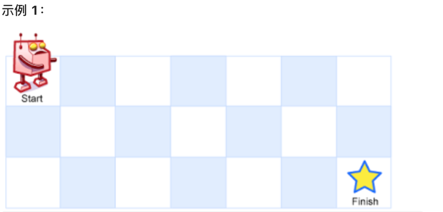

## 什么是动态规划

动态规划，英文：`Dynamic Programming`，简称DP，如果某一问题有很多重叠子问题，使用动态规划是最有效的。

所以动态规划中每一个状态一定是由上一个状态推导出来的，**这一点就区分于贪心**，贪心没有状态推导，而是从局部直接选最优的，

### 不同路径

一个机器人位于一个 m x n 网格的左上角 （起始点在下图中标记为 “Start” ）。

机器人每次只能向下或者向右移动一步。机器人试图达到网格的右下角（在下图中标记为 “Finish” ）。

问总共有多少条不同的路径？

[力扣题目链接](https://leetcode-cn.com/problems/unique-paths/)

 


如果从起始点开始走，那么到(m[0],n[0])就是0，因为已经在起始位置了，

到(m[1],n[0])，有1种

到(m[2],n[0])，有1种

到(m[3],n[0])，有1种

到(m[4],n[0])，有1种

到(m[5],n[0])，有1种

到(m[6],n[0])，有1种

到(m[0],n[1])，有1种

到(m[0],n[2])，有1种

现在已经在数组初始化好，接下来计算(m[1],n[1])，这个位置我可以从 (m[0],n[0]) -> (m[1],n[0]) -> (m[1],n[1]),或者  (m[0],n[0]) -> (m[0],n[1]) -> (m[1],n[1]),有2种，也就是(m[1],n[0])与(m[0],n[1])之和。以此类推可以计算剩下的位置，最后就是有28种


```java
class Solution {
public:
    int uniquePaths(int m, int n) {
        vector<vector<int>> dp(m, vector<int>(n, 0));
        for (int i = 0; i < m; i++) dp[i][0] = 1;
        for (int j = 0; j < n; j++) dp[0][j] = 1;
        for (int i = 1; i < m; i++) {
            for (int j = 1; j < n; j++) {
                dp[i][j] = dp[i - 1][j] + dp[i][j - 1];
            }
        }
        return dp[m - 1][n - 1];
    }
};
```

- 时间复杂度：O(m × n)
- 空间复杂度：O(m × n)

接下来用第二种数论的方法计算

我们从起到到终点，无论怎么走，水平走动需要的步数是 `m - 1`种，垂直方向上的步数一定是`n-1`种,那么总共需要走的步数就是 `m - 1 + n - 1`种， 即`m + n -2`

可以这么思考，一共有`m + n -2`条空穴，需要选出`m-1`个空虚用来作为水平方向上的移动位置，剩下的就作为垂直方向上的移动位置了
$$
C_{m + n -2}^{m - 1} = C_{m  + n -2}^{n-1} = \frac{(m+n-2)!}{(m-1)! \cdot (n-1)!}
$$

$$
带入 m = 7,n=3,C_{7+3-2}^{7-1} = \frac{(7+3-2)!}{(7-1)! \cdot (3-1)!} =\frac{8!}{6! \cdot 2!} = 28
$$

- 时间复杂度：O(m)
- 空间复杂度：O(1)


