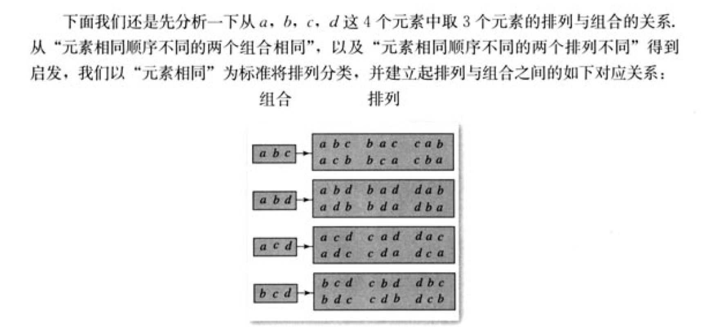

## 排列

一般地，从n个不同元素中取出m（m<=n）个元素，按照一定的顺序排成一列，叫做从n个不同元素中取出m个元素的一个排列（arrangement）

从n个不同元素中取出m（m<=n）个元素的所有不同排列的个数叫做从n个不同元素中取出m个元素的排列数，用符号
$$
A_{n}^{m}
$$

$$
A_{n}^{m} = n(n-1)(n-2)\cdots(n-m+1) ,n,m\in N^{*},且m \leqslant n
$$

n个不同元素全部取出来的一个排列，叫做n个元素的一个全排列
$$
A_{n}^{n} = n(n-1)(n-2)(n-3)\cdots 3 \times2\times1 = n!
$$

$$
A_{n}^{m} = \frac{A_{n}^{n}}{A_{n-m}^{n-m}} = \frac{n(n-1)(n-2)(n-3)\cdots 3 \times2\times1}{(n-m)(n-m-1)(n-m-2)(n-m-3)\cdots 3 \times2\times1}
=\frac{n(n-1)(n-2)(n-3)\cdots(n-m+1)(n-m)(n-m-1)(n-m-2)\cdots3 \times2\times1}{(n-m)(n-m-1)(n-m-2)(n-m-3)\cdots \times2\times 1}\\
=n(n-1)(n-2)\cdots(n-m+1)
$$

$$
A_n^m=\frac{n!}{(n-m)!}
$$

## 组合

一般地，从n个不同元素中取出m（m<=n）个元素合成一组，叫做从n个元素取出m个元素的一个组合（combination）

排列与顺序有关，组合与顺序无关

从n个不同元素中取出m（m<=n）个元素的所有不同组合的个数，叫做从n个不同元素中取出m个元素的组合数，用符号
$$
C_n^m
$$

$$
A_4^3 = C_4^3 \cdot A_3^3
$$

$$
C_n^m = \frac{A_n^m}{A_m^m}=\frac{n(n-1)(n-2)(n-3)\cdots(n-m+1)}{m!}=\frac{\frac{n!}{(n-m)!}}{m!}=\frac{n!}{m!(n-m)!}
$$

$$
性质1：C_n^m = C_n^{n-m}\\
性质2：C_{n+1}^m=C_n^{m}+C_n^{m-1}
$$

## 排列与组合模型

### 相邻问题-捆绑策略

n个元素，m个元素相邻，问有多少种排列

1.记者要为5名志愿者和他们帮助的2为老人拍照，要求排成一排，两位老人相邻，但不排在两端，有多少种排列
$$
先将老人捆绑在一起，这样就可以看成一个元素，内部可以对老人进行排列，就有A_2^2种排法\\
不排在两端，因为已经对老人进行了捆绑，这下相当与有6个元素，不在两端，那么就从剩下的4个中选择2个位置有C_4^1中组合\\
剩下的5个位置给学生，就有A_5^5中排列\\
最后一共有 A_2^2C_4^1A_5^5种排列
$$
2.把5件不同的产品排成一排，若产品A与产品B相邻，且产品A与产品C不相邻，有多少排法
$$
特殊元素特殊对待，A是特殊元素，A既要与B相邻，有不能与C相邻，先求简单的 ，先求A与B相邻的排法,把A和B捆绑成一个元素：有A_2^2A_4^4种排法\\
A与B相邻的排法中当然这里面肯定有A与C相邻的，那么我们只要把A与C相邻的去掉，就是剩下满足A与B相邻且A与C不相邻的了\\
A与B相邻且A与C相邻,就把这三个元素进行捆绑，A与B相邻且A与C相邻的排法有A_2^2种，然后对所有元素排列，有A_3^3,那么A与B相邻且A与C相邻一共有A_2^2A_3^3\\
那么最后一共有 A_2^2A_4^4 -  A_2^2A_3^3
$$

### 重复问题-倍缩策略

n个元素，分成m类，每一类中有k个元素重复

1.今有2个红球，3个黄球，4个白球，同色球不加区分，将这9个球排成一列，有多少排法
$$
假如同色球加以区分，先9个位置上取出2个位置给红球就是C_9^2A_2^2\\
从剩下7个位置上取出3个位置给黄球就是C_7^3A_3^3\\
剩下的给白球：A_4^4 \\
那么一共有 C_9^2A_2^2 \cdot C_7^3A_3^3 \cdot  A_4^4 = A_9^9\\

也可以从另一种角度理解：9个位置，先从9个中抽出2个给红球有C_9^2中，因为同色求不加区分，2个红球不用再排列了\\
然后再从剩下的7个中取3个给黄球有C_7^3,剩下的位置全部给白球，\\最后排法就有C_9^2 \cdot C_7^3种
$$
2.用数字2，3组成4位数，且数字2，3至少出现一次，这样的4位数有多少个

这种情况需要分开讨论：

第一种：数字2出现1次，那么数字3就是4次

第二种: 数字2出现2次，那么数字3就是2次

第三种：数字2出现3次，那么数字3就是1次
$$
第一种 ：  C_4^1\\
第二种 ： C_4^2\\
第三种 ： C_4^1\\
最后一共的排列有C_4^1 + C_4^2 + C_4^1 =  4  + 6 + 4 + 14
$$

### 不相邻问题 - 插空策略

n个元素，要求m个元素不相邻

针对这样的问题，方法是先不处理特殊元素，先把其他的排列好，然后再从空位中选择插入

1. 5个人站成一排，其中甲乙不相邻的排法

$$
先处理剩下的3个人，有A_3^3种排列，3个人站好就会有4个空位，只要再从这4个空位中选择2个给甲乙就可以，有A_4^2种\\
那么最后一共有A_3^3 \cdot A_4^2
$$

### 顺序一定问题

n个元素，分成m组，每一组种元素顺序一定

1.12名同学合影站成前排4人后排8人，现从后排8人中抽2人调整到前排，若其他人的相对顺序不变，则不同的调整方式有多少种
$$
先从后排8人中抽取2人有C_8^2种\\
将这2人放在前排就会有6个元素，6个元素的全排列有A_6^6种，但是原来的前排4人顺序不能动，现在除去重复就是\frac{A_6^6}{A_4^4}\\
最后一共有C_8^2 \cdot \frac{A_6^6}{A_4^4}
$$
2.某个工程队有6项工程需要单独完成，其中工程乙必须在工程甲完成后才能进行，工程丙必须在工程乙完成后才能进行，工程丁必须在工程丙完成后立即进行，那么安排这6项工程的不同排列方法有多少

$$
注意丙丁是一个相邻元素，捆绑后相当于有5个元素，那么对这5个元素进行全排列有A_5^5种\\

要求：甲 -> 乙 ->丙丁，那么甲，乙，丙丁的顺序就是一定的，就需要除重，甲，乙，丙丁全排列就有A_3^3种\\
最后，一共有\frac{A_5^5}{A_3^3}
$$

### 环排问题

n个元素，选m个元素围成一圈

思路：m个元素围成一圈，可以看成m个顶点（多边形），从相邻两点处的曲线处剪断，这样就会把m个元素转换为m个直线排列

n个元素选m个元素排列有
$$
A_n^m
$$
假设从n个元素选m个元素环排的数量为N，则对应的直排数量就是m * N个
$$
m\cdot N = A_n^m\\
\therefore N = \frac{1}{m} A_n^m
$$
1.4个女孩和6个男孩围成一圈，有多少种排列
$$
就是从10个元素中取10个围成一圈，有\frac{1}{10} A_{10}^{10} = A_9^9
$$

