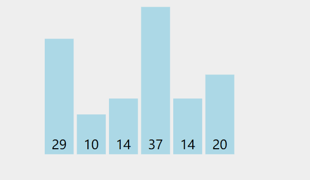
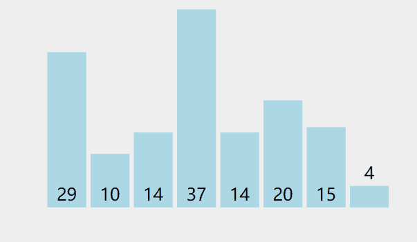
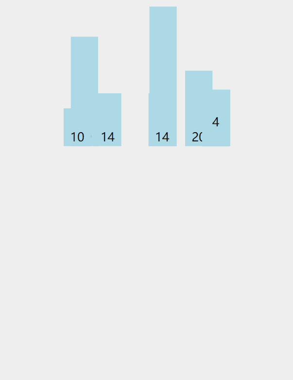
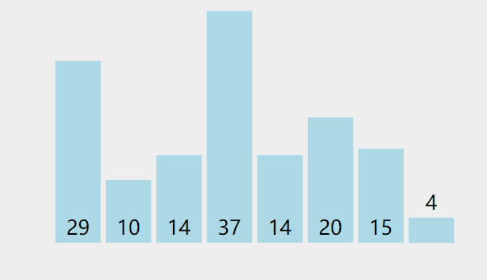
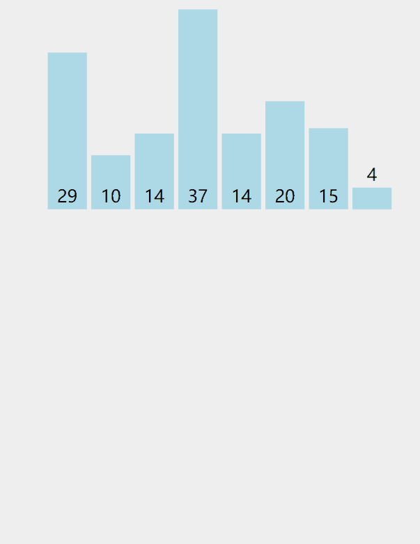

## 冒泡排序（Bubble Sort）

```java
    /**
     * 冒泡排序，从小到大排
     */
    public static void bubble(int[] array) {
        for (int i = 0; i < array.length; i++) {
            for (int j = i + 1; j < array.length; j++) {
                if (array[i] > array[j]) {
                    int temp = array[i];
                    array[i] = array[j];
                    array[j] = temp;
                }
            }
        }
    }
```



## 选择排序（Selection Sort）

```java
/**
 * 从小到大排
 * 选择排序,与冒泡排序的区别是交换的次数,这样挪动的数组元素就比冒泡少
 */
public static void select(int[] array) {
    for (int i = 0; i < array.length; i++) {
        int min = i;
        // 找到比当前min位置还小的数
        for (int j = i + 1; j < array.length; j++) {
            if (array[min] > array[j]) {
                min = j; //更新最小的位置
            }
        }
        if (min != i) {
            int temp = array[min];
            array[min] = array[i];
            array[i] = temp;
        }
    }
}
```



## 插入排序（Insertion Sort）

```java
/**
 * 插入排序，从小到大排
 */
public static void insert(int[] array) {
    // 注意起始位置，i==0的位置，只有一个元素，一个元素就是已经排好的
    for (int i = 1; i < array.length; i++) {
        // 后一个元素，需要和前面的元素进行比较
        int k = i;
        
        // k位置的元素和已经排好序的元素进行逐一比较
        for (int j = i - 1; j >= 0; j--) {
            if (array[j] > array[k]) {
                int temp = array[k];
                array[k] = array[j];
                array[j] = temp;
                // k递减，表示逐个比较
                k--;
            }
        }
    }
}
```




## 快速排序（Quick Sort）

```java
/**
 * 快速排序
 */
public static void quick(int[] array, int left, int right) {
    if (left >= right || array == null || array.length <= 1) {
        return;
    }
    int i = left;
    int j = right;
    // 让left所在的位置的值为基准值
    int pivot = array[left];
    while (i < j) {
        // 1. 从右边向左边找到比基准值小的位置，找到就停止
        // 一定要先从右边向左边开始找
        while (j > i && array[j] >= pivot) {
            j--;
        }

        // 从左边向右边找到一个比基准值大的值，找到就停止
        while (j > i && array[i] <= pivot) {
            i++;
        }

        // 交换2个值
        if (j > i) {
            int temp = array[i];
            array[i] = array[j];
            array[j] = temp;
        }
    }
    // 交换基准值
    // 在基准值的左边都是比只准值小的
    // 在基准值的右边都是比基准值大的
    // 一个大数组被分成了2个部分，递归另外2个部分的数组
    array[left] = array[i];
    array[i] = pivot;
    quick(array, left, i - 1);
    quick(array, i + 1, right);
}
```




## 归并排序（Merge Sort）

```java
/**
 * 归并排序
 */
private static void mergeSort(int[] array) {
    if (array == null || array.length <= 1) {
        return;
    }
    int[] temp = new int[array.length];
    sort(array, 0, array.length - 1, temp);
}

private static void sort(int[] array, int left, int right, int[] temp) {
    if (left >= right) {
        return;
    }
    int mid = (left + right) / 2;
    sort(array, left, mid, temp);
    sort(array, mid + 1, right, temp);
    merge(array, left, mid, right, temp);
}

private static void merge(int[] array, int left, int mid, int right, int[] temp) {
    int i = left;
    int j = mid + 1;
    int k = 0;
    while (i <= mid && j <= right) {
        if (array[i] < array[j]) {
            temp[k] = array[i];
            k++;
            i++;
        } else {
            temp[k] = array[j];
            k++;
            j++;
        }
    }

    while (j <= right) {
        temp[k++] = array[j++];
    }
    while (i <= mid) {
        temp[k++] = array[i++];
    }
    System.arraycopy(temp, 0, array, left, right - left + 1);
}
```





## 希尔排序（Shell Sort）


## 堆排序（Heap Sort）


## 计数排序（Counting Sort）


## 桶排序（Bucket Sort）


## 基数排序（Radix Sort）


 动画来源 https://visualgo.net/zh/sorting

