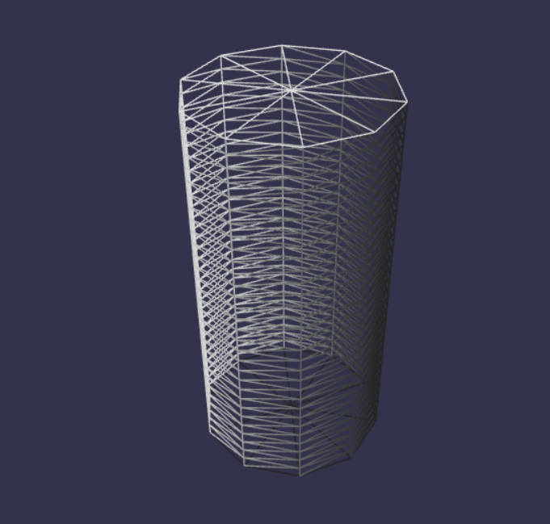
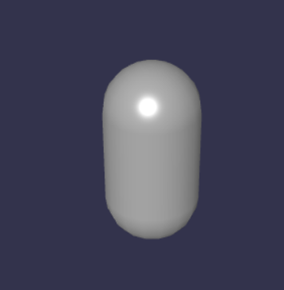

## Cameras


### Universal Camera

适合第一人称射击游戏，可与所有键盘，鼠标，触摸和游戏手柄一起使用

### *Arc Rotate Camera*

可以旋转，并且始终朝着目标点


`````javascript
// Parameters: name, alpha, beta, radius, target position, scene
var camera = new BABYLON.ArcRotateCamera("Camera", 0, 0, 10, new BABYLON.Vector3(0, 0, 0), scene);
// Positions the camera overwriting alpha, beta, radius
camera.setPosition(new BABYLON.Vector3(0, 0, 20));
// This attaches the camera to the canvas
camera.attachControl(canvas, true);
`````


### *Follow Camera*

### *Anaglyph Camera*

### *Device Orientation Cameras*

### *Virtual Joysticks Camera* 

### *Virtual Reality Camera*


## Light

### Point Light

```javascript
	var scene = new BABYLON.Scene(engine);
    var camera = new BABYLON.ArcRotateCamera("Camera", -Math.PI / 2,  Math.PI / 2, 5, BABYLON.Vector3.Zero(), scene);
    camera.attachControl(canvas, true);
	
	var light = new BABYLON.PointLight("light", new BABYLON.Vector3(0, 1, 0), scene);
	light.diffuse = new BABYLON.Color3(1, 0, 0); // 漫射光
	light.specular = new BABYLON.Color3(0, 1, 0); //反射光

	var sphere = BABYLON.MeshBuilder.CreateSphere("sphere", {}, scene);
	sphere.position.z = 1;
```

-  diffuse  漫射光
-  intensity  光照强度，默认是1  
-  specular 反射光


### Directional Light

```javascript
    var scene = new BABYLON.Scene(engine);
    var camera = new BABYLON.ArcRotateCamera("Camera", -Math.PI / 2,  Math.PI / 2, 5, BABYLON.Vector3.Zero(), scene);
	camera.attachControl(canvas, true);
	
	//Light direction is directly down
	var light = new BABYLON.DirectionalLight("DirectionalLight", new BABYLON.Vector3(-1, 0, 0), scene); // 朝着x轴负方向照射
	light.diffuse = new BABYLON.Color3(1,1, 0);  // 漫射光
	light.specular = new BABYLON.Color3(0, 1, 1); //  反射光

	var sphere = BABYLON.MeshBuilder.CreateSphere("sphere", {}, scene);
```


### Spot Light

````javascript
    var scene = new BABYLON.Scene(engine);
    var camera = new BABYLON.ArcRotateCamera("Camera", -Math.PI / 2,  Math.PI / 2, 5, BABYLON.Vector3.Zero(), scene);
	camera.attachControl(canvas, true);
	
    // exponent 灯光的衰减速度
    var light = new BABYLON.SpotLight("spotLight", 
    new BABYLON.Vector3(1, 1, 1),  // 聚光灯的位置
    new BABYLON.Vector3(-1,-1,-1), Math.PI / 2, 20, scene); // 聚光灯的照射方向
	light.diffuse = new BABYLON.Color3(1, 0, 0);
	light.specular = new BABYLON.Color3(0, 1, 0);

	var sphere = BABYLON.MeshBuilder.CreateSphere("sphere", {}, scene);	
````


### Hemispheric Light

-  groundColor

```javascript
    var scene = new BABYLON.Scene(engine);
    var camera = new BABYLON.ArcRotateCamera("Camera", -Math.PI / 2,  Math.PI / 2, 5, BABYLON.Vector3.Zero(), scene);
	camera.attachControl(canvas, true);
	
    var light = new BABYLON.HemisphericLight("hemiLight", 
    new BABYLON.Vector3(-1, 1, 0), scene);
	light.diffuse = new BABYLON.Color3(1, 0, 0);
	light.specular = new BABYLON.Color3(0, 1, 0);
	light.groundColor = new BABYLON.Color3(0, 1, 0);

	var sphere = BABYLON.MeshBuilder.CreateSphere("sphere", {}, scene);
```


## MeshBuilder

### Box

````javascript
CreateBox(name: string, options: { backUVs?: Vector4; bottomBaseAt?: number; depth?: number; faceColors?: Color4[]; faceUV?: Vector4[]; frontUVs?: Vector4; height?: number; sideOrientation?: number; size?: number; topBaseAt?: number; updatable?: boolean; width?: number; wrap?: boolean }, scene?: Nullable<Scene>): Mesh
````

- size : Box的大小，默认是1
-  width 、height、depth： 设置x、y、z方向上的大小，默认是1
- faceColors：设置每个面的颜色，顺序为后前右左上下
- faceUV: 设置UV坐标，顺序为后前右左上下
- backUVs: 反面UV坐标，当`BABYLON.Mesh.DOUBLESIDE`设置才有效
- frontUVs：正面UV坐标，当`BABYLON.Mesh.DOUBLESIDE`设置才有效
- sideOrientation ：指正反面的方向，默认为`BABYLON.Mesh.DEFAULT`,可选值为`BABYLON.Mesh.FRONTSIDE`,`BABYLON.Mesh.BACKSIDE`,`BABYLON.Mesh.DOUBLESIDE`。考虑性能原因，BABYLON会在默认情况下只渲染前面，可以修改该参数实现只渲染后面或两面都渲染。

```javascript
   const scene = new BABYLON.Scene(engine);

    const camera = new BABYLON.ArcRotateCamera("camera", -Math.PI / 2, Math.PI / 2.5, 3, new BABYLON.Vector3(0, 0, 0));
    camera.attachControl(canvas, true);

    const light = new BABYLON.HemisphericLight("light", new BABYLON.Vector3(0, 1, 0));

    const box = BABYLON.MeshBuilder.CreateBox("box", {});
```


```javascript
    const box = BABYLON.MeshBuilder.CreateBox("box", {faceColors:
    [new BABYLON.Color4(0.17, 0.33, 0.83),
    new BABYLON.Color4(0,1,0),
    new BABYLON.Color4(0.79, 0.1, 0.62),
    new BABYLON.Color4(0.9, 0.81, 0.04),
    new BABYLON.Color4(1,0,0),
    new BABYLON.Color4(1,1,1)]}); // 顺序为后前右左上下
```


```javascript
    var mat = new BABYLON.StandardMaterial("mat", scene);
    var texture = new BABYLON.Texture("http://jerome.bousquie.fr/BJS/images/spriteAtlas.png", scene);
    mat.diffuseTexture = texture;

    var columns = 6;  // 6 columns
    var rows = 4;  // 4 rows

    var faceUV = new Array(6);

    for (var i = 0; i < 6; i++) {
        faceUV[i] = new BABYLON.Vector4(i / columns, 0, (i + 1) / columns, 1 / rows);
    }

    var options = {
        width: 10,
        height: 10,
        depth: 10,
        faceUV: faceUV
    };

    var box = BABYLON.MeshBuilder.CreateBox('box', options, scene);
    box.material = mat;
```


注意UV坐标，原点在左下角，使用（0，0）和（1，1）将使用整个纹理图集


### Cylinder

```javascript
CreateCylinder(name: string, options: { arc?: number; backUVs?: Vector4; cap?: number; diameter?: number; diameterBottom?: number; diameterTop?: number; enclose?: boolean; faceColors?: Color4[]; faceUV?: Vector4[]; frontUVs?: Vector4; hasRings?: boolean; height?: number; sideOrientation?: number; subdivisions?: number; tessellation?: number; updatable?: boolean }, scene?: Nullable<Scene>): Mesh
```

- diameterTop : 顶部的直径，如果为0可以创建圆锥
- diameterBottom：底部的直径，不可以为0
- diameter ：上下的直径，默认值1
- tessellation：值越大，表面越光滑，默认值24
- subdivisions：值越大，表面越光滑，默认值1
- faceColors:表面的颜色，数组中 0 : bottom cap, 1 : cylinder tube, 2 : top cap
- faceUV: 数组中  0 : bottom cap, 1 : cylinder tube, 2 : top cap
- arc:

```javascript
   const scene = new BABYLON.Scene(engine);
    
    const camera = new BABYLON.ArcRotateCamera("Camera", Math.PI / 2, Math.PI / 2, 4, BABYLON.Vector3.Zero(), scene);
    camera.attachControl(canvas, true);
    const light = new BABYLON.HemisphericLight("light", new BABYLON.Vector3(1, 1, 0), scene);

    const cylinder = BABYLON.MeshBuilder.CreateCylinder("cylinder", {});
```


```javascript
    const scene = new BABYLON.Scene(engine);
    
    const camera = new BABYLON.ArcRotateCamera("Camera", Math.PI / 2, Math.PI / 2, 4, BABYLON.Vector3.Zero(), scene);
    camera.attachControl(canvas, true);
    const light = new BABYLON.HemisphericLight("light", new BABYLON.Vector3(1, 1, 0), scene);

    const cylinder = BABYLON.MeshBuilder.CreateCylinder("cylinder", {diameterTop: 0});
```


```javascript
    const cylinder = BABYLON.MeshBuilder.CreateCylinder("cylinder", {
        diameterTop: 0,
        tessellation:10});
```


`````javascript
    const cylinder = BABYLON.MeshBuilder.CreateCylinder("cylinder", {
        diameterTop: 0,
        tessellation:100});
`````


````javascript
  const cylinder = BABYLON.MeshBuilder.CreateCylinder("cylinder", {
        subdivisions:30,
        tessellation:10});
        
    var mat = new BABYLON.StandardMaterial("mat", scene);
    mat.wireframe =true
    cylinder.material =mat		
````



```javascript
   const faceColors = new Array()
   faceColors[0] = new BABYLON.Color4(1,0,0);
   faceColors[1] = new BABYLON.Color4(0,1,0);
   faceColors[2] = new BABYLON.Color4(0,0,1);

   const cylinder = BABYLON.MeshBuilder.CreateCylinder("cylinder", {faceColors:faceColors});
```


```javascript
	const faceUV = [];
	faceUV[0] =	new BABYLON.Vector4(0, 0, 0, 0);
    faceUV[1] =	new BABYLON.Vector4(1, 0, 0.25, 1); // x, z swapped to flip image
    faceUV[2] = new BABYLON.Vector4(0, 0, 0.24, 1);
	
    const faceColors = [ ];
    faceColors[0] = new BABYLON.Color4(0.5, 0.5, 0.5, 1)
	
	const can = BABYLON.MeshBuilder.CreateCylinder("can", {height:1.16, faceUV: faceUV, faceColors: faceColors});
	can.material = canMaterial;
```


```javascript
const cylinder = BABYLON.MeshBuilder.CreateCylinder("cylinder", {arc: 0.6, sideOrientation: BABYLON.Mesh.DOUBLESIDE});
```


### Capsule

```javascript
const capsule = BABYLON.MeshBuilder.CreateCapsule("ribbon", options, scene); 
```

- orientation 


```javascript
 	const scene = new BABYLON.Scene(engine);
    
    const camera = new BABYLON.ArcRotateCamera("Camera", 3 * Math.PI / 4, Math.PI / 4, 4, BABYLON.Vector3.Zero(), scene);
    camera.attachControl(canvas, true);
    const light = new BABYLON.HemisphericLight("light", new BABYLON.Vector3(1, 1, 1));
    light.intensity = 0.7;

    const capsule = new BABYLON.MeshBuilder.CreateCapsule("capsule", {}, scene)
```



- subdivisions

  把中间的圆柱分成几段，默认为2

````javascript
 const capsule = new BABYLON.MeshBuilder.CreateCapsule("capsule", {
            orientation:new BABYLON.Vector3.Up(),
            subdivisions:40,
    }, scene)
    var mat = new BABYLON.StandardMaterial("mat", scene);
    mat.wireframe =true
    capsule.material =mat	
````


- tessellation

  ```javascript
   const capsule = new BABYLON.MeshBuilder.CreateCapsule("capsule", {
              orientation:new BABYLON.Vector3.Up(),
              subdivisions:2,
              tessellation:4
      }, scene)
      var mat = new BABYLON.StandardMaterial("mat", scene);
      mat.wireframe =true
      capsule.material =mat	
  ```

  

- radius

  半径

  ```javascript
      const capsule = new BABYLON.MeshBuilder.CreateCapsule("capsule", {
              orientation:new BABYLON.Vector3.Up(),
              subdivisions:2,
              height:1,
              radius:0.1
      }, scene)
      var mat = new BABYLON.StandardMaterial("mat", scene);
      mat.wireframe =true
      capsule.material =mat
  ```

  

- capSubdivisions、topCapSubdivisions、bottomCapSubdivisions

```javascript
    const capsule = new BABYLON.MeshBuilder.CreateCapsule("capsule", {
            orientation:new BABYLON.Vector3.Up(),
            subdivisions:2
            height:1
            capSubdivisions:30
    }, scene)

    var mat = new BABYLON.StandardMaterial("mat", scene);
    mat.wireframe =true
    capsule.material =mat
```


```javascript
    const capsule = new BABYLON.MeshBuilder.CreateCapsule("capsule", {
            orientation:new BABYLON.Vector3.Up(),
            subdivisions:2,
            height:1
            topCapSubdivisions:50,
            bottomCapSubdivisions:20
    }, scene)
    var mat = new BABYLON.StandardMaterial("mat", scene);
    mat.wireframe =true
    capsule.material =mat
```


- radiusTop与radiusBottom

````javascript
   const capsule = new BABYLON.MeshBuilder.CreateCapsule("capsule", {
            orientation:new BABYLON.Vector3.Up(),
            subdivisions:2,
            height:1
            radiusTop:0.1,
            radiusBottom:0.4
    }, scene)
    var mat = new BABYLON.StandardMaterial("mat", scene);
    mat.wireframe =true
    capsule.material =mat
````


### Plane

````javascript
const plane = BABYLON.MeshBuilder.CreatePlane("plane", options, scene);
````

- size:默认值1
- width：宽
- height：高
- sideOrientation：默认值 DEFAULTSIDE
- frontUVs：只有设置BABYLON.Mesh.DOUBLESIDE才有效
- backUVs：只有设置BABYLON.Mesh.DOUBLESIDE才有效

````javascript
 const scene = new BABYLON.Scene(engine);
    
    const camera = new BABYLON.ArcRotateCamera("Camera", -Math.PI / 2, Math.PI / 2, 3, BABYLON.Vector3.Zero());
    camera.attachControl(canvas, true);
    const light = new BABYLON.HemisphericLight("light", new BABYLON.Vector3(1, 1, 0));

	const mat = new BABYLON.StandardMaterial("");
	mat.diffuseTexture = new BABYLON.Texture("https://assets.babylonjs.com/environments/tile1.jpg");

    const f = new BABYLON.Vector4(0,0, 0.5, 1); // front image = half the whole image along the width 
	const b = new BABYLON.Vector4(0.5,0, 1, 1); // back image = second half along the width
    
    const plane = BABYLON.MeshBuilder.CreatePlane("plane", {frontUVs: f, backUVs: b, sideOrientation: BABYLON.Mesh.DOUBLESIDE});
    plane.material = mat;
````


### TiledPlane

````javascript
const tiledPlane = BABYLON.MeshBuilder.CreateTiledPlane("plane", options, scene)
````

- size : 默认值1

- sideOrientation：绘制方向

- width、height：宽高

- tileSize：

- pattern：

  ```javascript
  BABYLON.Mesh.NO_FLIP, default
  BABYLON.Mesh.FLIP_TILE,
  BABYLON.Mesh.ROTATE_TILE,
  BABYLON.Mesh.FLIP_ROW,
  BABYLON.Mesh.ROTATE_ROW,
  BABYLON.Mesh.FLIP_N_ROTATE_TILE,
  BABYLON.Mesh.FLIP_N_ROTATE_ROW
  ```

- alignVertical

  ```javascript
  BABYLON.Mesh.CENTER, default
  BABYLON.Mesh.TOP,
  BABYLON.Mesh.BOTTOM
  ```

- alignHorizontal

  ```javascript
  BABYLON.Mesh.CENTER, default
  BABYLON.Mesh.LEFT,
  BABYLON.Mesh.RIGHT
  ```

- frontUVs：只有设置BABYLON.Mesh.DOUBLESIDE才有效
- backUVs：只有设置BABYLON.Mesh.DOUBLESIDE才有效


```javascript
	const mat = new BABYLON.StandardMaterial("");
	mat.diffuseTexture = new 							     BABYLON.Texture("https://ss0.bdstatic.com/70cFuHSh_Q1YnxGkpoWK1HF6hhy/it/u=2984976270,3834537218&fm=26&gp=0.jpg");
	const options = {
		width: 10,
		height: 10
	}
	const tiledPane = BABYLON.MeshBuilder.CreateTiledPlane("", options);
	tiledPane.material = mat;
```


`````javascript
	const options = {
		width: 10,
		height: 10,
		tileSize: 2,
		tileWidth:2
	}
`````


````javascript
    const pat = BABYLON.Mesh.FLIP_TILE; // y轴方向水平垂直翻转
	const options = {
		pattern: pat,
		width: 10,
		height: 10,
		tileSize: 2,
		tileWidth:2
	}
````


```javascript
	const pat = BABYLON.Mesh.ROTATE_TILE; // 旋转180度
	const options = {
		pattern: pat,
		width: 10,
		height: 10,
		tileSize: 2,
		tileWidth:2
	}
```


```javascript
	const pat = BABYLON.Mesh.FLIP_ROW; // 对y轴方向翻转
	const options = {
		pattern: pat,
		width: 10,
		height: 10,
		tileSize: 2,
		tileWidth:2
	}
```


```javascript
	const pat = BABYLON.Mesh.ROTATE_ROW; // 每行旋转180度
	const options = {
		pattern: pat,
		width: 10,
		height: 10,
		tileSize: 2,
		tileWidth:2
	}
```


```javascript
const pat = BABYLON.Mesh.FLIP_N_ROTATE_TILE; //既有翻转又有旋转
```


```javascript
const pat = BABYLON.Mesh.FLIP_N_ROTATE_ROW;
```


当tile图片的大小超过平面的宽或者高度时，tile将会被裁切显示,用alignVertical、alignHorizontal可以控制平面的上下左右那边可以显完整tile

```javascript
	const pat = BABYLON.Mesh.FLIP_TILE;
	const options = {
		pattern: pat,
		width: 10,
		height: 10,
		tileSize: 4,
		tileWidth:4,
        alignVertical:BABYLON.Mesh.CENTER,
        alignHorizontal:BABYLON.Mesh.CENTER
	}
```


```javascript
	const options = {
		pattern: pat,
		width: 10,
		height: 10,
		tileSize: 4,
		tileWidth:4,
        // 平面的左边和上边显示了完整的tile
        alignVertical:BABYLON.Mesh.TOP,
        alignHorizontal:BABYLON.Mesh.LEFT
	}
```


```javascript
	const options = {
		pattern: pat,
		width: 10,
		height: 10,
		tileSize: 4,
		tileWidth:4,
        alignVertical:BABYLON.Mesh.BOTTOM,
        alignHorizontal:BABYLON.Mesh.RIGHT
	}
```


### TiledBox

```javascript
    var mat = new BABYLON.StandardMaterial("bricks");
	mat.diffuseTexture = new BABYLON.Texture("https://assets.babylonjs.com/environments/bricktile.jpg");
	
	const pat = BABYLON.Mesh.FLIP_TILE;
	const av = BABYLON.Mesh.TOP;
	const ah = BABYLON.Mesh.LEFT;
	
	const options = {
		sideOrientation: BABYLON.Mesh.DOUBLESIDE,
		pattern: pat,
		alignVertical: av,
		alignHorizontal: ah,
		width: 6.9,
		height: 3.9,
		depth: 2.8,
		tileSize: 1,
		tileWidth:3
	}
	
	const tiledBox = BABYLON.MeshBuilder.CreateTiledBox("", options);
	tiledBox.material = mat;
```


### Sphere


| option          | value                                                        | default value      |
| :-------------- | :----------------------------------------------------------- | :----------------- |
| segments        | *(number)* number of horizontal segments                     | 32                 |
| diameter        | *(number)* diameter of the sphere                            | 1                  |
| diameterX       | *(number)* diameter on X axis, overwrites *diameter* option  | diameter           |
| diameterY       | *(number)* diameter on Y axis, overwrites *diameter* option  | diameter           |
| diameterZ       | *(number)* diameter on Z axis, overwrites *diameter* option  | diameter           |
| arc             | *(number)* ratio of the circumference (latitude) between 0 and 1 | 1                  |
| slice           | *(number)* ratio of the height (longitude) between 0 and 1   | 1                  |
| updatable       | *(boolean)* true if the mesh is updatable                    | false              |
| sideOrientation | *(number)* side orientation                                  | DEFAULTSIDE        |
| frontUVs        | *(Vector4)* **ONLY WHEN sideOrientation:BABYLON.Mesh.DOUBLESIDE set** | Vector4(0, 0, 1,1) |
| backUVs         | *(Vector4)* **ONLY WHEN sideOrientation:BABYLON.Mesh.DOUBLESIDE set** | Vector4(0, 0, 1,1) |

```javascript
   const sphere = BABYLON.MeshBuilder.CreateSphere("sphere", {
        segments:20, // 分段数
        diameter:1.5 //直径
    });
    const mat = new BABYLON.StandardMaterial();
    mat.wireframe = true
    sphere.material = mat
```


```javascript
   const sphere = BABYLON.MeshBuilder.CreateSphere("sphere", {
        segments:20, // 分段数
        diameter:1.5 //直径
        diameterX:1,
        diameterY:1.5,
        diameterZ:2,
    });
    const mat = new BABYLON.StandardMaterial();
    mat.wireframe = true
    sphere.material = mat
```


`````javascript

    const sphere = BABYLON.MeshBuilder.CreateSphere("sphere", {
        segments:20,
        diameter:1,
        sideOrientation:BABYLON.Mesh.DOUBLESIDE
        arc:0.7
    });
`````


````javascript
    const sphere = BABYLON.MeshBuilder.CreateSphere("sphere", {
        segments:20,
        diameter:1,
        sideOrientation:BABYLON.Mesh.DOUBLESIDE,
        slice:0.3
    });
````


### Ground 

| option       | value                                     | default value |
| :----------- | :---------------------------------------- | :------------ |
| width        | *(number)* size of the width              | 1             |
| height       | *(number)* size of the height             | 1             |
| updatable    | *(boolean)* true if the mesh is updatable | false         |
| subdivisions | *(number)* number of square subdivisions  | 1             |

```javascript
 const ground = BABYLON.MeshBuilder.CreateGround("ground", 
    {height: 3, width: 3});
```


````javascript
    const ground = BABYLON.MeshBuilder.CreateGround("ground", 
    {height: 2, width:2, subdivisions: 7});

    const mat = new BABYLON.StandardMaterial();
    mat.wireframe = true;
    ground.material = mat;
````


### TiledGround

| option       | value                                                        | default value |
| :----------- | :----------------------------------------------------------- | :------------ |
| xmin         | *(number)* map min x coordinate value                        | -1            |
| zmin         | *(number)* map min z coordinate value                        | -1            |
| xmax         | *(number)* map max x coordinate value                        | 1             |
| zmin         | *(number)* map max z coordinate value                        | 1             |
| subdivisions | *object* *( {w: number, h: number} )* number of subdivisions (tiles) on the height and the width of the map | {w: 6, h: 6}  |
| precision    | *( {w: number, h: number} )* number of subdivisions on the height and the width of each tile | {w: 2, h: 2}  |
| updatable    | *(boolean)* true if the mesh is updatable                    | false         |


## Materials

#### 

```javascript
    var scene = new BABYLON.Scene(engine);
    var camera = new BABYLON.ArcRotateCamera("Camera", -Math.PI / 2,  Math.PI / 4, 5, BABYLON.Vector3.Zero(), scene);
    camera.attachControl(canvas, true);
	
	//Light direction is up and left
	var light = new BABYLON.HemisphericLight("hemiLight", new BABYLON.Vector3(-1, 1, 0), scene);
	light.diffuse = new BABYLON.Color3(1, 1, 1);
	
	var mat0 = new BABYLON.StandardMaterial("mat0", scene);
	mat0.diffuseColor = new BABYLON.Color3(1, 0, 0);
	mat0.bumpTexture = new BABYLON.Texture("http://i.imgur.com/wGyk6os.png", scene);
	
	var mat1 = new BABYLON.StandardMaterial("mat1", scene);
	mat1.diffuseTexture = new BABYLON.Texture("http://i.imgur.com/Wk1cGEq.png", scene);
	mat1.bumpTexture = new BABYLON.Texture("http://i.imgur.com/wGyk6os.png", scene);
	
	var mat2 = new BABYLON.StandardMaterial("mat2", scene);
	mat2.diffuseTexture = new BABYLON.Texture("textures/grass.png", scene);
	mat2.bumpTexture = new BABYLON.Texture("http://i.imgur.com/wGyk6os.png", scene);
	
	//colour and bump
	var sphere0 = BABYLON.MeshBuilder.CreateSphere("sphere0", {}, scene);
	sphere0.position.x = -1.5;
	sphere0.material = mat0;	
	
	//original image and bump
	var sphere1 = BABYLON.MeshBuilder.CreateSphere("sphere1", {}, scene);
	sphere1.material = mat1;
	
	//other image and bump
	var sphere2 = BABYLON.MeshBuilder.CreateSphere("sphere2", {}, scene);
	sphere2.material = mat2;
	sphere2.position.x = 1.5;
```


## Particle System

- minSize 、maxSize ：粒子大小可以在给定范围内随机变化
- minScaleX 、maxScaleX 、minScaleY、maxScaleY ：粒子的图像x、y方向上的缩放范围
- color1 、color2 、colorDead ：粒子颜色的变化范围
- minEmitPower 、maxEmitPower ：粒子的速度可以由Power 决定，值越大，速度越快
- minAngularSpeed、maxAngularSpeed ：粒子的旋转弧度范围
- translationPivot ：控制粒子的变换，默认时粒子图片的中心，使用该值可以控制相对位置
- direction1 、direction2：粒子的发发射范围，向量的值越大，粒子的速度越快
- gravity ：重力
- emitRate ：每秒粒子的发射数量，值越大，粒子越密集
- minLifeTime、maxLifeTime：粒子的寿命范围
- 

````javascript
    const particleSystem = new BABYLON.ParticleSystem("particles", 2000);

    //Texture of each particle
    particleSystem.particleTexture = new BABYLON.Texture("textures/flare.png");

    // Position where the particles are emiited from
    particleSystem.emitter = new BABYLON.Vector3(0, 0.5, 0);

    particleSystem.start();
````


````javascript
BABYLON.ParticleHelper.CreateDefault(new BABYLON.Vector3(0, 0.5, 0)).start();
````

```javascript
    const particleSystem = new BABYLON.ParticleSystem("particles", 2000);

    //Texture of each particle
    particleSystem.particleTexture = new BABYLON.Texture("textures/flare.png");

    //Create box whose position will determine the emission origin
    const box = BABYLON.MeshBuilder.CreateBox("box", {});
    box.position = new BABYLON.Vector3(1, 2, 5);

    // Position where the particles are emitted from
    particleSystem.emitter = box; 

    particleSystem.start();
```


### Emitter

#### Point Emitter

修改

- direction1: Vector3,
- direction2: Vector3,

```javascript
var pointEmitter = particleSystem.createPointEmitter(new BABYLON.Vector3(-7, 8, 3), new BABYLON.Vector3(7, 8, -3));

```


#### Box Emitter

修改

- direction1: Vector3,
- direction2: Vector3,
- minEmitBox: Vector3,
- maxEmitBox: Vector3

```javascript
var boxEmitter = particleSystem.createBoxEmitter(new BABYLON.Vector3(-7, 8, 3), new BABYLON.Vector3(7, 8, -3), new BABYLON.Vector3(-1, 0, 0), new BABYLON.Vector3(1, 0, 0));
```


#### Sphere Emitter

```javascript
var sphereEmitter = particleSystem.createSphereEmitter(1.2);
```


#### Directed Sphere Emitter

修改

- radius: Number,
- direction1: Vector3,
- direction2: Vector3,

````javascript
var sphereEmitter = particleSystem.createDirectedSphereEmitter(1.2, new BABYLON.Vector3(1, 1, 1), new BABYLON.Vector3(2, 8, 2));
````


#### Hemispheric Emitter

半球形发射器

```javascript
var hemisphericEmitter = particleSystem.createHemisphericEmitter(1.2);
```


#### Cylinder Emitter

`````javascript
var cylinderEmitter = particleSystem.createCylinderEmitter(1,1,0,0);
`````


#### Cone Emitter

````javascript
var coneEmitter = particleSystem.createConeEmitter(2, Math.PI / 3);
````


#### Mesh Emitter

`````javascript
var meshEmitter = new BABYLON.MeshParticleEmitter(sphere);
`````

**Please note that the MeshParticleEmitter is not supported by GPU Particle**


### Animating Particles

这里谈论的是粒子纹理的动画，而不是任何运动或粒子本身。

需要把 isAnimationSheetEnabled   设置为true

```javascript
particleSystem = new BABYLON.ParticleSystem("particles", capacity, scene, null, true); // on construction

或者
particleSystem = new BABYLON.ParticleSystem("particles", capacity)
particleSystem.isAnimationSheetEnabled = true; //after construction
```


````javascript
    particleSystem.startSpriteCellID = 0;
    particleSystem.endSpriteCellID = 9;    // 这里只用了前10个精灵
    particleSystem.spriteCellHeight = 64; // 每个精灵的高度
    particleSystem.spriteCellWidth = 64;  // 每个精灵的宽度
    particleSystem.spriteCellLoop = true;
````


## Animation


