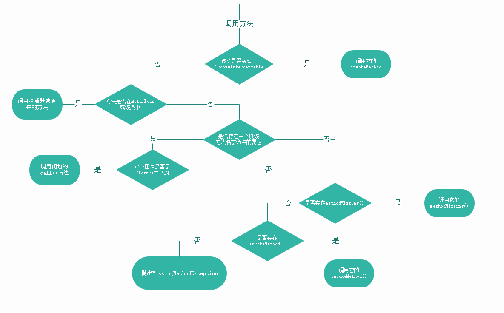

## 自动导入

```java.lang```、```java.util```、```java.io```、```java.net```、```java.math.BigDecimal```、```java.math.BigInteger```、```groovy.lang```、```groovy.util```


```def```用于定义方法、属性和局部变量。

在groovy中方法内部不能有任何这样的代码块

## 创建数组

```groovy
int[] ar = [1,2,3,4]
println("class is " + ar.getClass().name)  //class is [I

def list = [1,2,3,4]  //省略 int[]就会认为是ArrayList
println("class is " + list.getClass().name)  //class is java.util.ArrayList

def ar2 = [1,2,3,4] as int[] //借助 as 操作符
println("class is " + ar2.getClass().name)  //class is [I
```

## 动态类型

动态类型不等于弱类型

```groovy
// 动态类型
def takeHelp(helper){  //没有指定类型，默认Object
    helper.helpSomeThing() // 没有指定类型，这就是能力设计（Design by Capability）
}

class Man{
    def helpSomeThing(){
        println("Man is helping")
    }
}
class Woman{
    def helpSomeThing(){
        println("Woman is helping")
    }
}

takeHelp(new Man())
takeHelp(new Woman())
```


## 支持多态

```groovy
class Employee{
    def raise(Number amount){
        println "Employee got raise"
    }
}

class Executive extends Employee{
    @Override
    def raise(Number amount) {
        println "Executive got raise"
    }

    def raise(BigDecimal amount) {
        println "Executive got outlandish raise"
    }
}

def giveRaise(Employee employee){
    employee.raise(new BigDecimal(10000))
}

giveRaise(new Employee())  //Employee got raise
giveRaise(new Executive()) //Executive got outlandish raise

```


## 闭包（Closure）

```groovy
def pickEven(n,block){
    for (int i =2;i<=n;i+=2){
        block(i)
    }
}
pickEven(10,{println(it)})
pickEven(10,){println(it)} // 如果闭包是最后一个参数，可以使用这样的优雅语法
```

闭包不能单独存在，只能符到一个方法上，或者赋值给一个变量；在闭包中，return也是可选的，如果没有显式的return，最后的表达式的值（可能式null）会自动返回给调用者。

```groovy
def tellFortune(Closure closure){
    closure new Date(),"今天日期"  //传参
}

tellFortune {date,fortune->
    println("$date,$fortune")
}
```

### 关闭资源

```groovy
new FileWriter("output.txt").withWriter {
    it.write("@shell") // 不需要自己调用close
}
```

```groovy
public static <T> T withReader(Reader reader, @ClosureParams(value=SimpleType.class, options="java.io.Reader") Closure<T> closure) throws IOException {
    try {
        T result = closure.call(reader); //调用闭包

        Reader temp = reader;
        reader = null;
        temp.close(); //自动关闭

        return result;
    } finally {
        closeWithWarning(reader); //自动关闭
    }
}
```


###  this 、owner、delegate

这三个是闭包的属性，用于确定由哪个对象处理该闭包内的方法调用。一般而言，delegate会设置和owner

```groovy.lang.Closure```   

```groovy
private Object delegate;
private Object owner;
private Object thisObject;
...
protected Class[] parameterTypes; // 参数类型
protected int maximumNumberOfParameters; //闭包参数个数
```


```groovy
def examiningClosure(closure){
    closure()
}


examiningClosure{
    println "In First Closure"
    println "class is" + getClass().name
    println "this is "+ this + " , super :" +this.getClass().superclass.name
    println "owner is " + owner + " , super :"+owner.getClass().superclass.name
    println "delegate is " +delegate +" , super :"+delegate.getClass().superclass.name


    examiningClosure{
        println "In Closure within the First Closure"
        println "class is" + getClass().name
        println "this is "+ this + " , super :" +this.getClass().superclass.name
        println "owner is " + owner + " , super :"+owner.getClass().superclass.name
        println "delegate is " +delegate +" , super :"+delegate.getClass().superclass.name
    }
}

// output

In First Closure
class isDemo$_run_closure6
this is Demo@2362f559 , super :groovy.lang.Script
owner is Demo@2362f559 , super :groovy.lang.Script
delegate is Demo@2362f559 , super :groovy.lang.Script
In Closure within the First Closure
class isDemo$_run_closure6$_closure7
this is Demo@2362f559 , super :groovy.lang.Script
owner is Demo$_run_closure6@d35dea7 , super :groovy.lang.Closure
delegate is Demo$_run_closure6@d35dea7 , super :groovy.lang.Closure
```

闭包内的this指向的是该闭包所绑定的对象（正在执行的上下文），在闭包中引用的变量和方法都会绑定到this，它负责处理任何方法调用，以及对任何属性或变量的访问，如果this无法处理，则转向owner，最后就是delegate。

```groovy
class Handler{
    def f1(){
        println "f1 of Handler called..."
    }

    def f2(){
        println "f2 of Handler called..."
    }
}

class Example{
    def f1(){
        println "f1 of Example called..."
    }

    def f2(){
        println "f2 of Example called..."
    }

    def foo(closure){
        closure.delegate = new Handler()
        closure()
    }
}

def f1(){
    println "f1 of Script called..."
}

// 主要此时的环境是在Script中
new Example().foo{
    println "this is "+ this    		// this is Demo@544fa968
    println "owner is "+ owner   		// owner is Demo@544fa968
    println "delegate is "+ delegate    // delegate is Handler@2df3b89c
    f1()   //  f1 of Script called...
    f2()   //  f2 of Handler called...
}
```


### 递归


转换为迭代

```groovy
factorial = { int number,BigInteger theFactorial ->
    number == 1 ? theFactorial : factorial.trampoline(number -1 ,number * theFactorial)
}
factorial = factorial.trampoline()

println "factorial of 5 is ${factorial(5,1)}"
```


```groovy
public Closure<V> trampoline(final Object... args) {
    return new TrampolineClosure<V>(this.curry(args));
}

```


## 字符串

```groovy
println 'hi said "This is groovy"'  //单引号，纯粹的字面常量
println "This is groovy"    // 双引号可以加表达式
println 'a' as char    //显示使用字符

// 多行字符串
println ''' 
This 
is 
groovy  ''' 
```


## Object 的扩展


### 访问属性

```groovy
class Car{
    int miles,fuelLevel
}

def car = new Car(miles: 10,fuelLevel: 20)

println(car.miles)
println(car.getAt("miles"))
println(car.getProperty("fuelLevel"))

car.setProperty("miles",30)
println(car["miles"])
```

### 调用方法

```groovy
class Car{
    int miles,fuelLevel

    def print(){
        println "This car is $miles, $fuelLevel"
    }
}
```

```
car.print()
car.invokeMethod("print",null)
```


## 扩展模块

我们可以在编译时向现有类添加实例方法或者静态方法，并在运行时在应用中使用。要使用该特性，需要做到两点：首先，想要添加的方法必须定义在一个扩展模块类中；其次，需要在清单文件（manifest）中放一些描述信息，告诉Groovy编译器要查找的扩展模块。


## 元编程


```groovy
package groovy.lang;

public interface GroovyObject {

    Object invokeMethod(String name, Object args);
    
    Object getProperty(String propertyName);
    
    void setProperty(String propertyName, Object newValue);
    
    MetaClass getMetaClass();
    
    void setMetaClass(MetaClass metaClass);
}
```

````groovy
package groovy.lang;

public interface GroovyInterceptable extends GroovyObject {
}
````

当我们调用一个方法时，Groovy会检查目标对象是一个POJO还是一个POGO,对于不同的对象类型，Groovy的方法处理是不同的。


```groovy
package groovy.lang;

import org.codehaus.groovy.ast.ClassNode;

import java.util.List;


public interface MetaClass extends MetaObjectProtocol {

    
     Object invokeMethod(Class sender, Object receiver, String methodName, Object[] arguments, boolean isCallToSuper, boolean fromInsideClass);

   
     Object getProperty(Class sender, Object receiver, String property, boolean isCallToSuper, boolean fromInsideClass);

     void setProperty(Class sender, Object receiver, String property, Object value, boolean isCallToSuper, boolean fromInsideClass);

     Object invokeMissingMethod(Object instance, String methodName, Object[] arguments);

     Object invokeMissingProperty(Object instance, String propertyName, Object optionalValue, boolean isGetter);

   
     Object getAttribute(Class sender, Object receiver, String messageName, boolean useSuper);

     void setAttribute(Class sender, Object receiver, String messageName, Object messageValue, boolean useSuper, boolean fromInsideClass);
    
    
     void initialize();

     List<MetaProperty> getProperties();

     List<MetaMethod> getMethods();
    
     ClassNode getClassNode();

     List<MetaMethod> getMetaMethods();
    
     int selectConstructorAndTransformArguments(int numberOfConstructors, Object[] arguments);

     MetaMethod pickMethod(String methodName, Class[] arguments);
}

```





如果对象实现了``` GroovyInterceptable``` ,那么所有的调用都会被路由给它的``` invokeMethod()```

有点类似AOP编程。

### 查询方法和属性

在运行时，可以查询一个对象的方法和属性，以确定该对象是否支持某一特定行为，对于要在运行时动态添加的行为，这一点尤为重要，不仅可以向类添加行为，还可以向类的一些实例添加行为。

##  MOP拦截方法

三种方式拦截：

- MetaClass拦截

- 对象实现``` GroovyInterceptable``` 接口

- 使用分类（Categories）


### MetaClass拦截

使用MetaClass拦截调用有一个好处，就是可以拦截POJO上的调用。


```groovy
class Car {

    def check() {
        System.out.println("check called")
    }

    def start() {
        System.out.println("start called")
    }

    def drive() {
        System.out.println("drive called")
    }
}


Car.metaClass.invokeMethod = { String name, args ->
    System.out.println("Call to $name intetface ...")
    if (name != "check") {
        Car.metaClass.getMetaMethod("check").invoke(delegate, null)
    }
    def validMethod = Car.metaClass.getMetaMethod(name, args)
    if (validMethod != null) {
        validMethod.invoke(delegate, args)
    } else {
        Car.metaClass.invokeMissingMethod(delegate, name, args)
    }
}
def car = new Car()
car.start()
car.drive()
car.check()
car.speed()

println(Car.metaClass.getClass().name)  // groovy.lang.ExpandoMetaClass
```

```ExpandoMetaClass```是```MetaClass```接口的一个实现类，也是Groovy中负责实现动态行为的关键类之一，通过该类添加方法可以实现向类中注入行为，甚至可以用该类特化单个对象。
默认情况下，Groovy目前并没有使用```ExpandoMetaClass```，当我们向```metaClass```中添加一个方法时。默认的```metaClass```会被用一个```ExpandoMetaClass```实例替换掉。

#### 向MetaClass 动态添加方法

```groovy
def printMetaClassInfo(instance){
    println("MetaClass of $instance is ${instance.metaClass.class.simpleName}")
}

printMetaClassInfo(2)
println("MetaClass of Integer is ${Integer.metaClass.class.simpleName}")
println("Add a method to Integer metaClass")
Integer.metaClass.someNewMethod ={->System.out.println("Integer someNewMethod called ...") }
printMetaClassInfo(2)
println("MetaClass of Integer is ${Integer.metaClass.class.simpleName}")
2.someNewMethod()
```

```groovy
MetaClass of 2 is HandleMetaClass
MetaClass of Integer is HandleMetaClass
Add a method to Integer metaClass
MetaClass of 2 is HandleMetaClass
MetaClass of Integer is ExpandoMetaClass
Integer someNewMethod called ...
```


### 实现 GroovyInterceptable  接口

```groovy
class Car implements GroovyInterceptable{

    def check(){
        System.out.println("check called")
    }
    def start(){
        System.out.println("start called")
    }
    def drive(){
        System.out.println("drive called")
    }

    @Override
    def invokeMethod(String name, Object args) {
        System.out.println("invokeMethod called...")
        if(name != "check"){
            Car.metaClass.getMetaMethod("check").invoke(this,null)
        }
        def validMethod = Car.metaClass.getMetaMethod(name,args)
        if(validMethod != null){
            validMethod.invoke(this,args)
        }else{
            Car.metaClass.invokeMethod(this,name,args)
        }
    }
}

def car = new Car()
car.start()
car.drive()
car.check()
car.speed()
```


### MOP方法注入

Groovy的MOP支持以下3种注入行为中的任何一种：

- 分类（category）
- ExpandoMetaClass
- Mixin

#### 使用分类注入方法

分类是一种能够修改类的MetaClass的对象，而且这种修改仅在代码块的作用域和执行线程内有效，当退出代码块时，一切会恢复原状。分类可以嵌套，也可以在一个代码块内应用多个分类。

```groovy
// 一个格式化字符串功能
class StringUtil{

	// 分类要求注入的方法是静态的
    def static toSSN(self){
        if(self.size() == 9){
            "${self[0..2]} - ${self[3..4]} - ${self[5..8]}"
        }
    }

}

//特殊方法use，接受两个参数，一个分类，一个闭包
use(StringUtil){
    println("123456789".toSSN()) // 注入的方法仅在use块中有效
    println(new StringBuilder("987654321").toSSN())
}


// println("123456789".toSSN())  // MissingMethodException
```

在块内调用String和StringBuilder实例上的toSSN()，会被路由到分类StringUtil中的静态方法。toSSN()中的self参数会被指派为目标实例，因为我们没有定义self参数的类型，其类型默认为Object，toSSN()可以在任何对象上使用。如果想限制该方法仅支持String和StringBuilder，则必须使用显式的参数类型创建两个版本的toSSN()

或者使用注解，让编译器将方法转变为静态方法。

```groovy
@Category(String)
class StringUtil{

    def toSSN(){
        if(this.size() == 9){
            "${this[0..2]} - ${this[3..4]} - ${this[5..8]}"
        }
    }

}
use(StringUtil){
    println("123456789".toSSN())
}
```


当调用use()时，Groovy将在脚本中调用的use()方法路由到了```org.codehaus.groovy.runtime.GroovyCategorySupport```类的use中

````groovy
  public static <T> T use(Class categoryClass, Closure<T> closure) {
        return THREAD_INFO.getInfo().use(categoryClass, closure);
    }
````

```groovy
private <T> T use(Class categoryClass, Closure<T> closure) {
    newScope(); //定义一个新的作用域
    try {
        use(categoryClass);
        return closure.call();
    } finally {
        endScope();  //新的作用域结束
    }
}
```

```groovy
private void use(Class categoryClass) {
    CachedClass cachedClass = ReflectionCache.getCachedClass(categoryClass);
    LinkedList<CachedClass> classStack = new LinkedList<CachedClass>();
    for (CachedClass superClass = cachedClass; superClass.getTheClass()!=Object.class; superClass = superClass.getCachedSuperClass()) {
        classStack.add(superClass);
    }

    while (!classStack.isEmpty()) {
        CachedClass klazz = classStack.removeLast();
        applyUse(klazz);
    }
}
```

```groovy
private void applyUse(CachedClass cachedClass) {
    CachedMethod[] methods = cachedClass.getMethods();
    for (CachedMethod cachedMethod : methods) {
        // 查找public静态方法
        if (cachedMethod.isStatic() && cachedMethod.isPublic()) {
            CachedClass[] paramTypes = cachedMethod.getParameterTypes();
            if (paramTypes.length > 0) {
                CachedClass metaClass = paramTypes[0];
                CategoryMethod mmethod = new CategoryMethod(cachedMethod, metaClass.getTheClass());
                final String name = cachedMethod.getName();
                CategoryMethodList list = get(name);
                if (list == null || list.level != level) {
                    list = new CategoryMethodList(name, level, list);
                    put(name, list);
                }
                list.add(mmethod);
                Collections.sort(list);
                cachePropertyAccessor(mmethod);
            }
        }
    }
}
```

####  使用ExpandoMetaClass 注入方法

 ##### 注入实例方法

```groovy
Integer.metaClass.daysFromNow = {
    Calendar today = Calendar.instance
    today.add(Calendar.DAY_OF_MONTH,delegate)
    today.time
}

println(5.daysFromNow())
```

如果没有括号，就会被当最一个属性，需要定义一个get方法

```groovy
Integer.metaClass.getDaysFromNow = {
    Calendar today = Calendar.instance
    today.add(Calendar.DAY_OF_MONTH,delegate)
    today.time
}

println(5.daysFromNow)
```

##### 注入静态方法

```groovy
Integer.metaClass.'static'.isEven = {val -> val % 2 == 0}
println("Is 2 even ? " + Integer.isEven(2))
println("Is 3 even ? " + Integer.isEven(3))
```

##### 注入构造器

```groovy
// 添加一个构造器
Integer.metaClass.constructor << { Calendar calendar ->
    new Integer(calendar.get(Calendar.DAY_OF_MONTH))
}

println new Integer(Calendar.instance)
```

```groovy
// 替换构造器
Integer.metaClass.constructor = {int val ->
    constructor = Integer.class.getConstructor(Integer.TYPE)
    constructor.newInstance(val)
}
println new Integer(5)
```

##### EMC DSL

```groovy
Integer.metaClass{
    daysFromNow = {
        Calendar today = Calendar.instance
        today.add(Calendar.DAY_OF_MONTH,delegate)
        today.time
    }
    getDaysFromNow = {
        Calendar today = Calendar.instance
        today.add(Calendar.DAY_OF_MONTH,delegate)
        today.time
    }
    'static'{
        isEven = { val -> val % 2 == 0}
    }
    constructor = {Calendar calendar->
        new Integer(calendar.get(Calendar.DAY_OF_MONTH))
    }

    constructor = {int val->
        constructor = Integer.class.getConstructor(Integer.TYPE)
        constructor.newInstance(val)
    }
}
```

#### 向具体实例中注入方法

##### 替换实例中的metaClass

```groovy
class Person {
    def play() {
        println("playing....")
    }
}

def emc = new ExpandoMetaClass(Person)
emc.sing = {
    "oh baby baby..."
}
emc.initialize()
def jack = new Person()
def paul = new Person()
jack.metaClass = emc
println(jack.sing())
//println(paul.sing())  // MissingMethodException
```


##### 直接向实例的metaClass中添加

```groovy
def jack = new Person()
def paul = new Person()
jack.metaClass.sing = {
    "oh baby baby..."
}
println(jack.sing())
//println(paul.sing())  // MissingMethodException
```

##### EMC DSL

```groovy
def jack = new Person()
def paul = new Person()
jack.metaClass {
    sing = {
        "oh baby baby..."
    }
    dance = {
        "start the music..."
    }
}
println(jack.sing())
println(jack.dance())
//println(paul.sing())  // MissingMethodException
```

#### Mixin注入方法

```groovy
@Mixin(Friend)  //已经过时了，不推荐
class Person{
    String firstName
    String lastName

    def getName(){
        "$firstName $lastName"
    }
}

def john = new Person(firstName: "John",lastName: "Smith")
println(john.listen())
```

```groovy
class Dog {
    def name
}
Dog.mixin(Friend)  /使用 mixin方法
def buddy = new Dog(name: "Buddy")
println(buddy.listen())
```

```groovy
class Cat{
    def name
}
def rude = new Cat(name: "Rude")
// rude.listen() // 不具备 listen方法

def socks = new Cat(name: "Socks")
socks.metaClass.mixin(Friend) //只有这个 socks实例才有listen方法
println(socks.listen())
```