## Field Descriptor

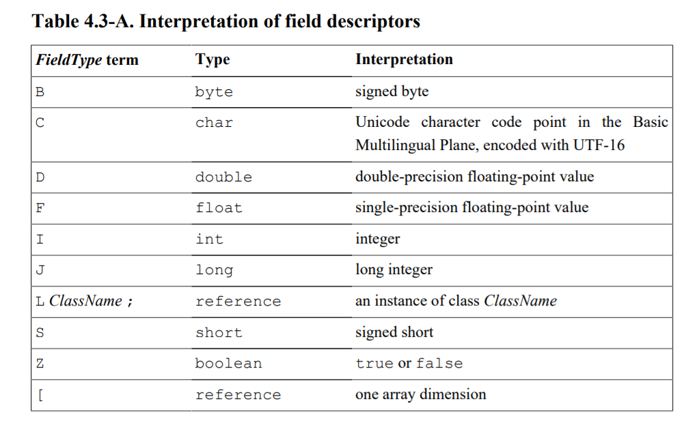

## Method Descriptor 

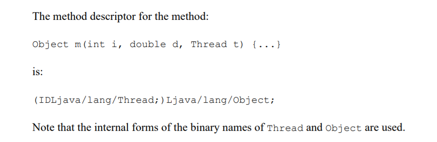

## ClassFile Struct

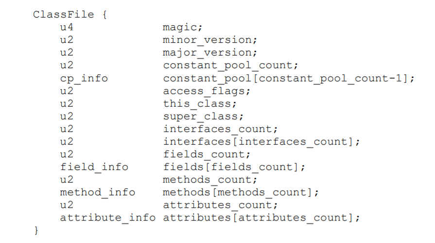

### magic

魔数 `0xCAFEBABE`

### minor_version, major_version

次版本与主版本

### constant_pool_count,constant_pool[]

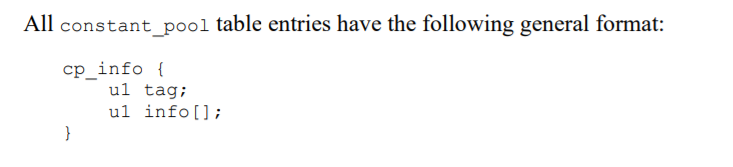

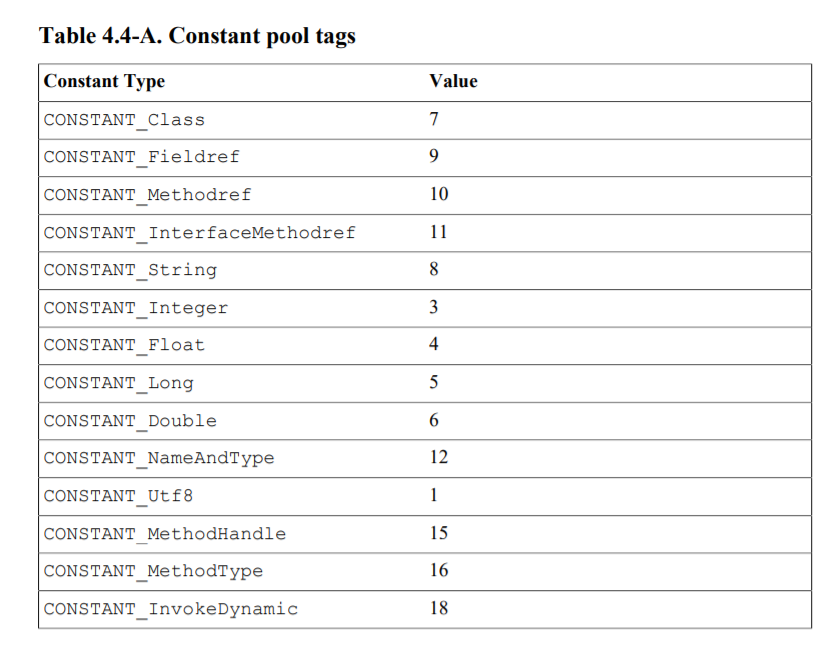

#### CONSTANT_Class_info

The `CONSTANT_Class_info` structure is used to represent a class or an interface

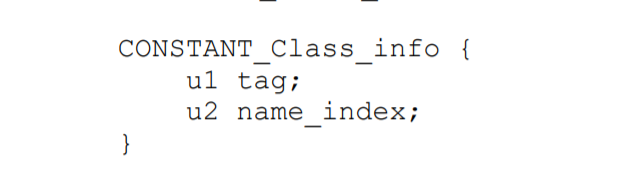

The value of the `name_index` item must be a valid index into the `constant_pool` table. The `constant_pool` entry at that index must be a `CONSTANT_Utf8_info` structure

#### CONSTANT_Fieldref_info

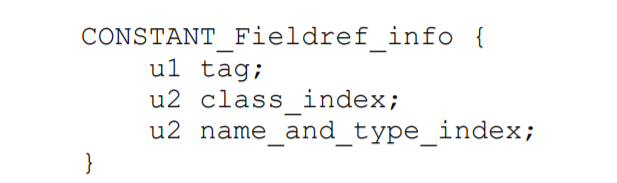

The value of the `class_index` item must be a valid index into the `constant_pool` table. The `constant_pool entry` at that index must be a `CONSTANT_Class_info` structure representing a class or interface type that has the field or method as a member.

The `class_index` item of a `CONSTANT_Fieldref_info` structure may be either a class type or an interface type.

The value of the `name_and_type_index` item must be a valid index into the `constant_pool `table. The `constant_pool` entry at that index must be a `CONSTANT_NameAndType_info` structure . This `constant_pool` entry indicates the name and descriptor of the field or method.

#### CONSTANT_Methodref_info

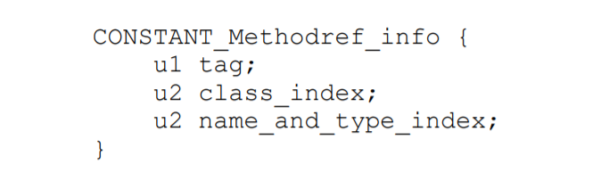

The value of the `class_index` item must be a valid index into the `constant_pool` table. The `constant_pool entry` at that index must be a `CONSTANT_Class_info` structure representing a class or interface type that has the field or method as a member.

The `class_index item` of a `CONSTANT_Methodref_info` structure must be a class type, not an interface type.

The value of the `name_and_type_index` item must be a valid index into the `constant_pool `table. The `constant_pool` entry at that index must be a `CONSTANT_NameAndType_info` structure . This `constant_pool` entry indicates the name and descriptor of the field or method.

In a `CONSTANT_Fieldref_info`, the indicated descriptor must be a field descriptor . Otherwise, the indicated descriptor must be a method descriptor .

If the name of the method of a` CONSTANT_Methodref_info` structure begins with a `'<' ('/u003c')`, then the name must be the special name `<init>`, representing an instance initialization method . The return type of such a method must be `void`.

#### CONSTANT_InterfaceMethodref_info

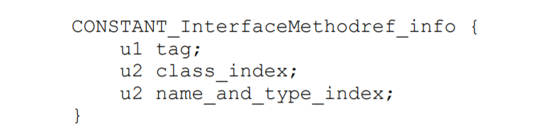

The value of the `class_index` item must be a valid index into the `constant_pool` table. The `constant_pool entry` at that index must be a `CONSTANT_Class_info` structure representing a class or interface type that has the field or method as a member.

The `class_index` item of a `CONSTANT_InterfaceMethodref_info` structure must be an interface type.

The value of the `name_and_type_index` item must be a valid index into the `constant_pool `table. The `constant_pool` entry at that index must be a `CONSTANT_NameAndType_info` structure . This `constant_pool` entry indicates the name and descriptor of the field or method.

#### CONSTANT_String_info

字符串常量

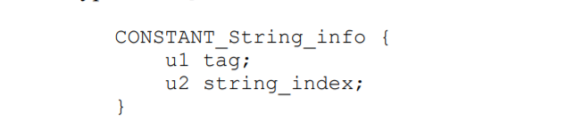

The value of the `string_index` item must be a valid index into the `constant_pool` table. The `constant_pool `entry at that index must be a `CONSTANT_Utf8_info` structure representing the sequence of Unicode code points to which the String object is to be initialized.

#### CONSTANT_Integer_info

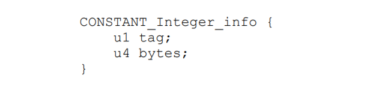

The bytes item of the CONSTANT_Integer_info structure represents the value of the int constant. The bytes of the value are stored in big-endian (high byte first) order.

####  CONSTANT_Float_info

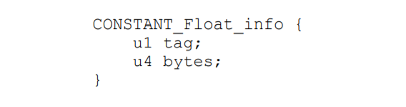

The bytes item of the CONSTANT_Float_info structure represents the value of the float constant in IEEE 754 floating-point single format. The bytes of the single format representation are stored in big-endian (high byte first) order.

#### CONSTANT_Long_info

####  CONSTANT_Double_info

#### CONSTANT_NameAndType_info

The value of the `name_index` item must be a valid index into the `constant_pool `table. The constant_pool entry at that index must be a`CONSTANT_Utf8_info` structure representing either the special method name  or a valid unqualified name denoting a field or method

The value of the `descriptor_index` item must be a valid index into the constant_pool table. The constant_pool entry at that index must be a `CONSTANT_Utf8_info` structure representing a valid `field descriptor` or` method descriptor`

#### CONSTANT_Utf8_info 

#### CONSTANT_MethodHandle_info

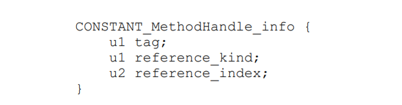

The value of the `reference_kind` item must be in the range `1 to 9`. The value denotes the kind of this method handle, which characterizes its bytecode behavior

The value of the` reference_index` item must be a valid index into the `constant_pool` table. The constant_pool entry at that index must be as follows:

- If the value of the reference_kind item is 1 (REF_getField), 2 (REF_getStatic), 3 (REF_putField), or 4 (REF_putStatic), then the constant_pool entry at that index must be a CONSTANT_Fieldref_info structure representing a field for which a method handle is to be created.

- If the value of the reference_kind item is 5 (REF_invokeVirtual) or 8 (REF_newInvokeSpecial), then the constant_pool entry at that index must be a CONSTANT_Methodref_info structure  representing a class's method or constructor  for which a method handle is to be created.

- If the value of the reference_kind item is 6 (REF_invokeStatic) or 7 (REF_invokeSpecial), then if the class file version number is less than 52.0, the constant_pool entry at that index must be a CONSTANT_Methodref_info structure representing a class's method for which a method handle is to be created; if the class file version number is 52.0 or above, the constant_pool entry at that index must be either a CONSTANT_Methodref_info structure or a CONSTANT_InterfaceMethodref_info structure representing a class's or interface's method for which a method handle is to be created.

- If the value of the reference_kind item is 9 (REF_invokeInterface), then the constant_pool entry at that index must be a CONSTANT_InterfaceMethodref_info structure representing an interface's method for which a method handle is to be created.

  If the value of the reference_kind item is 5 (REF_invokeVirtual), 6 (REF_invokeStatic), 7 (REF_invokeSpecial), or 9 (REF_invokeInterface), the name of the method represented by a CONSTANT_Methodref_info structure or a CONSTANT_InterfaceMethodref_info structure must not be  <clinit>or<clinit>

  If the value is 8 (REF_newInvokeSpecial), the name of the method represented by a CONSTANT_Methodref_info structure must be <clinit>.

#### CONSTANT_MethodType_info

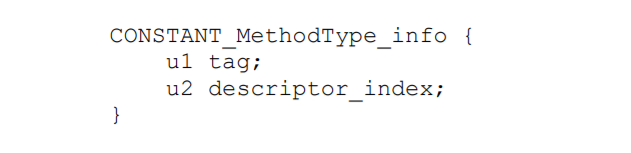

The value of the `descriptor_index` item must be a valid index into the constant_pool table. The constant_pool entry at that index must be a CONSTANT_Utf8_info structure representing a `method descriptor`

#### CONSTANT_InvokeDynamic_info

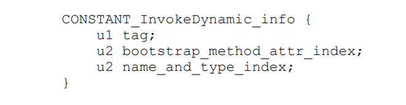

The value of the bootstrap_method_attr_index item must be a valid index into the bootstrap_methods array of the bootstrap method table  of this class file.

The value of the name_and_type_index item must be a valid index into the constant_pool table. The constant_pool entry at that index must be a CONSTANT_NameAndType_info structure representing a method name and method descriptor .

### access_flags

If the `ACC_INTERFACE `flag is not set, this class file defines a class, not an interface.

If the `ACC_INTERFACE` flag is set, the` ACC_ABSTRACT` flag must also be set, and the `ACC_FINAL`, `ACC_SUPER`, and `ACC_ENUM` flags set must not be set.

The `ACC_SYNTHETIC` flag indicates that this class or interface was generated by a compiler and does not appear in source code.

An annotation type must have its `ACC_ANNOTATION` flag set. If the `ACC_ANNOTATION `flag is set, the `ACC_INTERFACE` flag must also be set

The `ACC_ENUM` flag indicates that this class or its superclass is declared as an enumerated type.

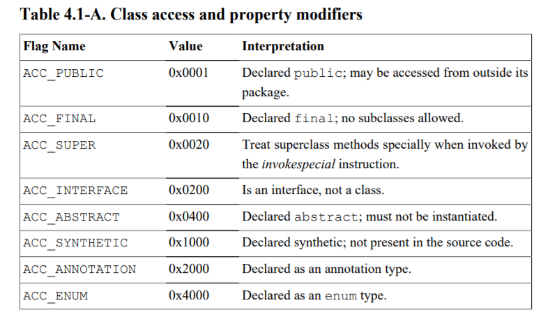

### this_class

它的值是一个索引，用该索引可以在`constant_pool`中找到一个`CONSTANT_Class_info`的数据结构。

### super_class

该值可以为0或者其他值，如果不是非0的值，就一定可以在`constant_pool`中找到一个`CONSTANT_Class_info`的数据结构，来表示该类的直接父类。

### interfaces_count,interfaces[]

该数组里面的值都是索引，用索引可以在`constant_pool`中找到一个`CONSTANT_Class_info`的数据结构。

### fields_count，fields[]

每一项都是`field_info`的结构

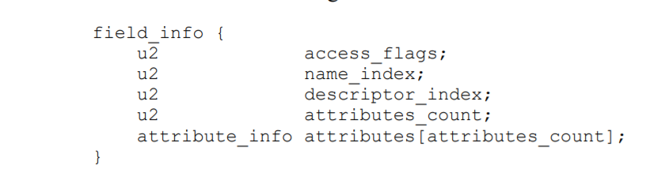

- The value of the` access_flags` item is a mask of flags used to denote access permission to and properties of this field. The interpretation of each flag, when set, is specified in Table 4.5-A.

- The value of the `name_index` item must be a valid index into the constant_pool table. The constant_pool entry at that index must be a CONSTANT_Utf8_info structure  which represents a valid unqualified name denoting a field.

- The value of the `descriptor_index` item must be a valid index into the constant_pool table. The constant_pool entry at that index must be a CONSTANT_Utf8_info structure  which represents a valid field descriptor

- The value of the `attributes_count` item indicates the number of additional attributes of this field.

-  Each value of the attributes table must be an `attribute_info` structure

  

### methods_count，methods[]

每一项都是`method_info`的结构

### attributes_count,attributes[]

每一项都是`attribute_info`的结构

参考：

https://docs.oracle.com/javase/specs/jvms/se8/jvms8.pdf

