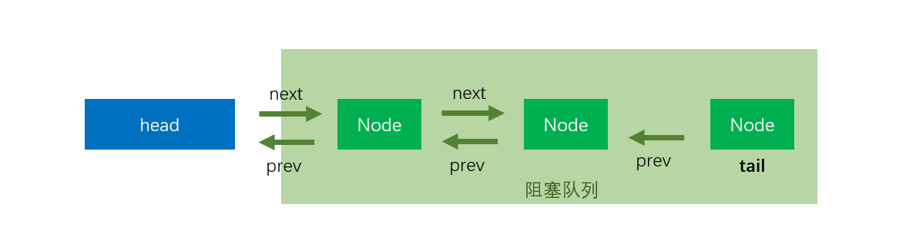

## 前言

AQS（AbstractQueuedSynchronizer）是JAVA中众多锁以及并发工具的基础，其底层采用乐观锁，大量使用了CAS操作， 并且在冲突时，采用自旋方式重试，以实现轻量级和高效地获取锁。

AQS中实现了锁的获取框架，锁的实际获取逻辑交由子类去实现，就锁的获取操作而言，子类必须重写 `tryAcquire`方法。

## acquire

```java
public final void acquire(int arg) {
    // 尝试获取锁，tryAcquire由AQS子类自己实现
    // 如果tryAcquire(arg) 返回true, 也就结束了,也就不需要进队列排队了
    if (!tryAcquire(arg) &&
        // tryAcquire(arg)没有成功，这个时候需要把当前线程挂起，放到阻塞队列中
        acquireQueued(addWaiter(Node.EXCLUSIVE), arg))
        // acquireQueued
        selfInterrupt();
}
```

- tryAcquire(arg)

  该方法由继承AQS的子类实现, 为获取锁的具体逻辑。

- addWaiter(node)

  该方法由AQS实现, 负责在tryAcquire(arg)获取锁失败后调用, 将当前请求锁的线程包装成Node扔到`sync queue`中去，并返回这个Node。

- acquireQueued(final Node node, int arg)

​	在前驱节点就是head节点的时候,继续尝试获取锁

​	将当前线程挂起,使CPU不再调度它

- selfInterrupt

​	该方法由AQS实现, 用于中断当前线程。由于在整个抢锁过程中，我们都是不响应中断的。那如果在抢锁的过程中发生了中断怎么办呢，总不能假装没看见呀。AQS的做法简单的记	录有没有有发生过中断，如果返回的时候发现曾经发生过中断，则在退出`acquire`方法之前，就调用`selfInterrupt`自我中断一下，就好像将这个发生在抢锁过程中的中断“推	迟”到抢锁结束以后再发生一样。

## addWaiter

每一个处于独占锁模式下的节点，它的`nextWaiter`一定是null

```java
private Node addWaiter(Node mode) {
    // 把线程包装成node，同时进入到队列中
    Node node = new Node(Thread.currentThread(), mode);
    // Try the fast path of enq; backup to full enq on failure
    Node pred = tail;
    // 
    if (pred != null) {
        // 队列不为空，
        // 注意此处有可能会有多个线程并发，也就是说可以通过mode的prev字段找到前置节点
        node.prev = pred;
        // 以CAS方式自己设置为队尾
        // 如果失败，可能是队列空了，或者有其他线程抢占了，后面就会以自旋的方式插入队尾
        if (compareAndSetTail(pred, node)) {
            pred.next = node;
            return node;
        }
    }
    enq(node);
    return node;
}

```

如果在` node.prev = pred;`处并发执行就会出现下面这种情况


假如线程执行到这里被挂起`pred.next = node;`，可能会出现下面这个


能执行到`enq`这个方法，说明当前线程获取锁已经失败了，或者队列还没有初始化，我们已经把它包装成一个Node,准备把它扔到等待队列中去

```java
// 采用自旋的方式入队,总能入队
private Node enq(final Node node) {
    for (;;) {
        // tail 的修饰符是 volatile ，所以保证线程间的可见性
        Node t = tail;
        if (t == null) { // Must initialize
            // 先初始化头节点，然后自旋
            if (compareAndSetHead(new Node()))
                tail = head;
        } else {
            // 插入到队尾,如果这里出现并发也会出现上面那种情况
            node.prev = t;
            // 如果这里出现并发，只有一个线程会成功
            if (compareAndSetTail(t, node)) {
                // 假如成功的线程执行到这里时，CPU突然切换其他线程执行，注意tail节点可以通过prev字段找到它的前置节点
                // 但是它的前置节点的next字段可找不到tail
                t.next = node;
                return t;
            }
        }
    }
}
```




线程成功设置自己位tail节点后，执行`t.next = node;`后就会是下面的图了


## acquireQueued

(1) 能执行到该方法, 说明`addWaiter` 方法已经成功将包装了当前Thread的节点添加到了等待队列的队尾
(2) 该方法中将再次尝试去获取锁
(3) 在再次尝试获取锁失败后, 判断是否需要把当前线程挂起

head节点就是个哑节点，它不代表任何线程，或者代表了持有锁的线程，如果当前节点的前驱节点就是head节点，那就说明当前节点已经是排在整个等待队列最前面的了。

```java
final boolean acquireQueued(final Node node, int arg) {
    boolean failed = true;
    try {
        boolean interrupted = false;
        // 自旋
        for (;;) {
            // 前置节点
            final Node p = node.predecessor();
            // 如果p是头结点，说明当前节点在真实数据队列的首部，就尝试获取锁（别忘了头结点是虚节点）
            // p == head 说明当前节点虽然进到了阻塞队列，但是是阻塞队列的第一个，因为它的前驱是head
            // 注意，阻塞队列不包含head节点，head一般指的是占有锁的线程，head后面的才称为阻塞队列
            // head是延时初始化的，而且new Node()的时候没有设置任何线程
            // 也就是说，当前的head不属于任何一个线程，所以作为队头
            if (p == head && tryAcquire(arg)) {
                // 别的线程已经执行完了，或者就是刚初始化的head，那么尝试获取锁
                // 获取锁成功，头指针移动到当前node
                // 重新设置队头
                setHead(node);
                // 帮助GC回收之前的head
                p.next = null; // help GC
                failed = false;
                return interrupted;
            }
            
            // 说明p为头节点且当前没有获取到锁（可能是非公平锁被抢占了）或者是p不为头结点，这个时候就要判断当前node是否要
            // 被阻塞（被阻塞条件：前驱节点的waitStatus为-1），防止无限循环浪费资源。
            if (shouldParkAfterFailedAcquire(p, node) &&
                parkAndCheckInterrupt())
                interrupted = true;
        }
    } finally {
        // 跳出for循环并不一定是拿到了锁，也可能是tryAcquire(arg)抛出了异常，因为是子类重写tryAcquire(arg)，
        // 我们并不知道子类如何去实现他，一旦子类获取锁抛出异常，就必须要走finally的cancelAcquire(node);方法，将本身节点从同步队列中移除
        if (failed)
            cancelAcquire(node);
    }
}
```

 `if (p == head && tryAcquire(arg)) `

这个方法的本质是丢弃原来的head，将head指向已经获得了锁的node。但是接着又将该node的thread属性置为null了，**这某种意义上导致了这个新的head节点又成为了一个哑节点，它不代表任何线程**。为什么要这样做呢，因为在tryAcquire调用成功后，exclusiveOwnerThread属性就已经记录了当前获取锁的线程了，此处没有必要再记录。**这某种程度上就是将当前线程从等待队列里面拿出来了，是一个变相的出队操作。**

## shouldParkAfterFailedAcquire

在独占锁锁的获取操作中，`waitStatus`我们只用到了其中的两个——`CANCELLED`和`SIGNAL`,

```java
static final int CANCELLED =  1;
static final int SIGNAL    = -1;
static final int CONDITION = -2;
static final int PROPAGATE = -3;
```

前面我们在创建节点的时候并没有给waitStatus赋值，因此每一个节点最开始的时候waitStatus的值都被初始化为0,即不属于上面任何一种状态。

`ANCELLED`状态很好理解，它表示Node所代表的当前线程已经取消了排队，即放弃获取锁了。

`SIGNAL`这个状态就有点意思了，它不是表征当前节点的状态，而是当前节点的下一个节点的状态。
当一个节点的waitStatus被置为`SIGNAL`，就说明它的下一个节点（即它的后继节点）已经被挂起了（或者马上就要被挂起了），因此在当前节点释放了锁或者放弃获取锁时，如果它的waitStatus属性为`SIGNAL`，它还要完成一个额外的操作——唤醒它的后继节点。

有意思的是，`SIGNAL`这个状态的设置常常不是节点自己给自己设的，而是后继节点设置的,换个角度讲，当我们决定要将一个线程挂起之前，首先要确保自己的前驱节点的waitStatus为`SIGNAL`，这就相当于给自己设一个闹钟再去睡，这个闹钟会在恰当的时候叫醒自己，否则，如果一直没有人来叫醒自己，自己可能就一直睡到天荒地老了。

```java
// 靠前驱节点判断当前线程是否应该被阻塞
// 当前线程没有抢到锁，是否需要挂起当前线程?
// 第一个参数是前驱节点，第二个参数才是代表当前线程的节点
private static boolean shouldParkAfterFailedAcquire(Node pred, Node node) {
        // 获取前驱结点的节点状态
        int ws = pred.waitStatus;
        // 前驱节点的 waitStatus == -1 ，说明前驱节点状态正常，当前线程需要挂起，直接可以返回true
        if (ws == Node.SIGNAL)
            /*
             * This node has already set status asking a release
             * to signal it, so it can safely park.
             */
            return true;
        // 前驱节点 waitStatus大于0 ，之前说过，大于0 说明前驱节点取消了排队
        // 这里需要知道这点：进入阻塞队列排队的线程会被挂起，而唤醒的操作是由前驱节点完成的。
        // 所以下面这块代码说的是将当前节点的prev指向waitStatus<=0的节点，
        if (ws > 0) {
            /*
             * Predecessor was cancelled. Skip over predecessors and
             * indicate retry.
             */
            do {
                // 环向前查找取消节点，把取消节点从队列中剔除
                node.prev = pred = pred.prev;
            } while (pred.waitStatus > 0);
            pred.next = node;
        } else {
            // 前驱节点的waitStatus不等于-1和1，那也就是只可能是0，-2，-3
            // 在我们前面的源码中，都没有看到有设置waitStatus的，所以每个新的node入队时，waitStatu都是0
            // 正常情况下，前驱节点是之前的 tail，那么它的 waitStatus 应该是 0
            // 用CAS将前驱节点的waitStatus设置为Node.SIGNAL(也就是-1)
            /*
             * waitStatus must be 0 or PROPAGATE.  Indicate that we
             * need a signal, but don't park yet.  Caller will need to
             * retry to make sure it cannot acquire before parking.
             */
            compareAndSetWaitStatus(pred, ws, Node.SIGNAL);
        }
        return false;
    }


  
   // 这里用了LockSupport.park(this)来挂起线程，然后就停在这里了，等待被唤醒
   private final boolean parkAndCheckInterrupt() {
        LockSupport.park(this); // 挂起线程
        return Thread.interrupted(); // 检查线程中断标志位，并且清楚中断标记
    }
```

当shouldParkAfterFailedAcquire返回false后，会继续回到循环中再次尝试获取锁——这是因为此时我们的前驱节点可能已经变了（搞不好前驱节点就变成head节点了呢）。

## cancelAcquire

```java
private void cancelAcquire(Node node) {
    // Ignore if node doesn't exist
    if (node == null)
        return;

    node.thread = null;

    // Skip cancelled predecessors
    Node pred = node.prev;
    while (pred.waitStatus > 0)
        node.prev = pred = pred.prev;

    // predNext is the apparent node to unsplice. CASes below will
    // fail if not, in which case, we lost race vs another cancel
    // or signal, so no further action is necessary.
    Node predNext = pred.next;

    // Can use unconditional write instead of CAS here.
    // After this atomic step, other Nodes can skip past us.
    // Before, we are free of interference from other threads.
    node.waitStatus = Node.CANCELLED;

    // If we are the tail, remove ourselves.
    if (node == tail && compareAndSetTail(node, pred)) {
        compareAndSetNext(pred, predNext, null);
    } else {
        // If successor needs signal, try to set pred's next-link
        // so it will get one. Otherwise wake it up to propagate.
        int ws;
        if (pred != head &&
            ((ws = pred.waitStatus) == Node.SIGNAL ||
             (ws <= 0 && compareAndSetWaitStatus(pred, ws, Node.SIGNAL))) &&
            pred.thread != null) {
            Node next = node.next;
            if (next != null && next.waitStatus <= 0)
                compareAndSetNext(pred, predNext, next);
        } else {
            unparkSuccessor(node);
        }

        node.next = node; // help GC
    }
}
```
