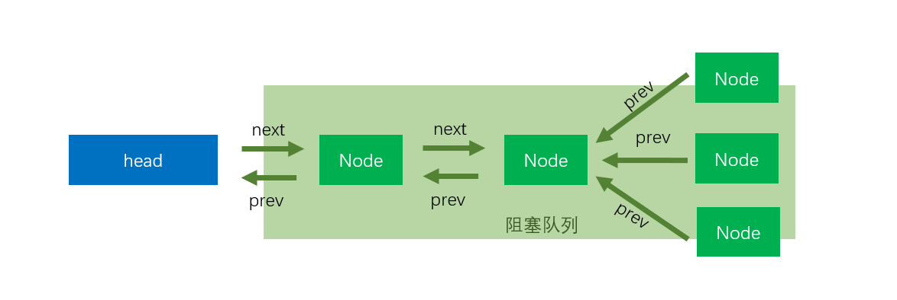
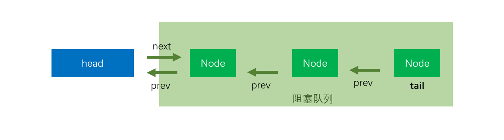
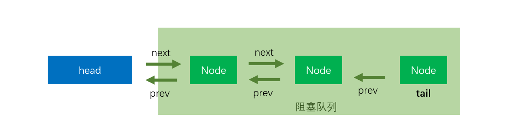
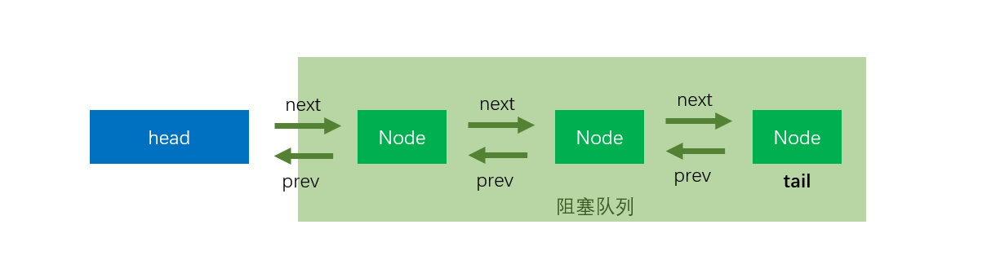

## AQS

AQS就是`AbstractQueuedSynchronizer`，AQS内部维护一个双向链表

AQS只是一个框架，具体资源的获取/释放方式交由自定义同步器去实现，这里的接口没有定义成`abstract`是因为独占模式下只需实现`tryAcquire-tryRelease`，而共享模式下只用实现`tryAcquireShared-tryReleaseShared`。因此没必要定义成abstract类型。

```java
// 头结点，不代表任何线程,是一个虚拟节点
private transient volatile Node head;

// 阻塞的尾节点，每个新的节点进来，都插入到最后，也就形成了一个链表
private transient volatile Node tail;

// 这个是最重要的，代表当前锁的状态，0代表没有被占用，大于 0 代表有线程持有当前锁
// 这个值可以大于 1，是因为锁可以重入，每次重入都加上 1
private volatile int state;

// 代表当前持有独占锁的线程，举个最重要的使用例子，因为锁可以重入
// reentrantLock.lock()可以嵌套调用多次，所以每次用这个来判断当前线程是否已经拥有了锁
// if (currentThread == getExclusiveOwnerThread()) {state++}
private transient Thread exclusiveOwnerThread; //继承自AbstractOwnableSynchronizer
```

在`AQS`中的队列是一个CLH队列，它的`head`节点永远是一个哑结点（dummy node), 它不代表任何线程（某些情况下可以看做是代表了当前持有锁的线程），**因此head所指向的Node的thread属性永远是null**。只有从次头节点往后的所有节点才代表了所有等待锁的线程。也就是说，在当前线程没有抢到锁被包装成Node扔到队列中时，**即使队列是空的，它也会排在第二个**

## acquire

```java
public final void acquire(int arg) {
    // 尝试获取锁，tryAcquire由AQS子类自己实现
    // 如果tryAcquire(arg) 返回true, 也就结束了,也就不需要进队列排队了
    if (!tryAcquire(arg) &&
        // tryAcquire(arg)没有成功，这个时候需要把当前线程挂起，放到阻塞队列中
        acquireQueued(addWaiter(Node.EXCLUSIVE), arg))
        // acquireQueued
        selfInterrupt();
}
```

`tryAcquire`由`AQS`子类自己实现，分为公平与非公平，如果没有获取到锁，那就进入排队。

- tryAcquire(arg)

  该方法由继承AQS的子类实现, 为获取锁的具体逻辑。

- addWaiter(node)

  该方法由AQS实现, 负责在tryAcquire(arg)获取锁失败后调用, 将当前请求锁的线程包装成Node扔到`sync queue`中去，并返回这个Node。

- acquireQueued(final Node node, int arg)

​	在前驱节点就是head节点的时候,继续尝试获取锁

​	将当前线程挂起,使CPU不再调度它

- selfInterrupt

​	该方法由AQS实现, 用于中断当前线程。由于在整个抢锁过程中，我们都是不响应中断的。那如果在抢锁的过程中发生了中断怎么办呢，总不能假装没看见呀。AQS的做法简单的记	录有没有有发生过中断，如果返回的时候发现曾经发生过中断，则在退出`acquire`方法之前，就调用`selfInterrupt`自我中断一下，就好像将这个发生在抢锁过程中的中断“推	迟”到抢锁结束以后再发生一样。

## addWaiter

```java
private Node addWaiter(Node mode) {
    // 把线程包装成node，同时进入到队列中
    Node node = new Node(Thread.currentThread(), mode);
    // Try the fast path of enq; backup to full enq on failure
    Node pred = tail;
    // 
    if (pred != null) {
        // 队列不为空，
        // 注意此处有可能会有多个线程并发，也就是说可以通过mode的prev字段找到前置节点
        node.prev = pred;
        // 以CAS方式自己设置为队尾
        // 如果失败，可能是队列空了，或者有其他线程抢占了，后面就会以自旋的方式插入队尾
        if (compareAndSetTail(pred, node)) {
            pred.next = node;
            return node;
        }
    }
    enq(node);
    return node;
}
```

如果在` node.prev = pred;`处并发执行就会出现下面这种情况




假如线程执行到这里被挂起`pred.next = node;`，可能会出现下面这个



这就是后面代码在遍历时为什么从tail开始遍历的原因

能执行到`enq`这个方法，说明当前线程获取锁已经失败了，或者队列还没有初始化，我们已经把它包装成一个Node,准备把它扔到等待队列中去

```java
// 采用自旋的方式入队,总能入队
private Node enq(final Node node) {
    for (;;) {
        // tail 的修饰符是 volatile ，所以保证线程间的可见性
        Node t = tail;
        if (t == null) { // Must initialize
            // 先初始化头节点，然后自旋
            if (compareAndSetHead(new Node()))
                tail = head;
        } else {
            // 插入到队尾,如果这里出现并发也会出现上面那种情况
            node.prev = t;
            // 如果这里出现并发，只有一个线程会成功
            if (compareAndSetTail(t, node)) {
                // 假如成功的线程执行到这里时，CPU突然切换其他线程执行，注意tail节点可以通过prev字段找到它的前置节点
                // 但是它的前置节点的next字段可找不到tail
                t.next = node;
                return t;
            }
        }
    }
}
```



线程成功设置自己位tail节点后，执行`t.next = node;`后就会是下面的图了




## acquireQueued

```java
final boolean acquireQueued(final Node node, int arg) {
    boolean failed = true;
    try {
        boolean interrupted = false;
        // 自旋
        for (;;) {
            // 前置节点
            final Node p = node.predecessor();
            // 如果p是头结点，说明当前节点在真实数据队列的首部，就尝试获取锁（别忘了头结点是虚节点）
            // p == head 说明当前节点虽然进到了阻塞队列，但是是阻塞队列的第一个，因为它的前驱是head
            // 注意，阻塞队列不包含head节点，head一般指的是占有锁的线程，head后面的才称为阻塞队列
            // head是延时初始化的，而且new Node()的时候没有设置任何线程
            // 也就是说，当前的head不属于任何一个线程，所以作为队头
            if (p == head && tryAcquire(arg)) {
                // 别的线程已经执行完了，或者就是刚初始化的head，那么尝试获取锁
                // 获取锁成功，头指针移动到当前node
                // 重新设置队头
                setHead(node);
                // 帮助GC回收之前的head
                p.next = null; // help GC
                failed = false;
                return interrupted;
            }
            
            // 说明p为头节点且当前没有获取到锁（可能是非公平锁被抢占了）或者是p不为头结点，这个时候就要判断当前node是否要
            // 被阻塞（被阻塞条件：前驱节点的waitStatus为-1），防止无限循环浪费资源。
            if (shouldParkAfterFailedAcquire(p, node) &&
                parkAndCheckInterrupt())
                interrupted = true;
        }
    } finally {
        // 跳出for循环并不一定是拿到了锁，也可能是tryAcquire(arg)抛出了异常，因为是子类重写tryAcquire(arg)，
        // 我们并不知道子类如何去实现他，一旦子类获取锁抛出异常，就必须要走finally的cancelAcquire(node);方法，将本身节点从同步队列中移除
        if (failed)
            cancelAcquire(node);
    }
}
```

(1) 能执行到该方法, 说明`addWaiter`方法已经成功将包装了当前Thread的节点添加到了等待队列的队尾
(2) 该方法中将再次尝试去获取锁
(3) 在再次尝试获取锁失败后, 判断是否需要把当前线程挂起

head节点就是个哑节点，它不代表任何线程，或者代表了持有锁的线程，如果当前节点的前驱节点就是head节点，那就说明当前节点已经是排在整个等待队列最前面的了。

## shouldParkAfterFailedAcquire

`waitStatus`的值一共有4个

```java
static final int CANCELLED =  1;
static final int SIGNAL    = -1;
static final int CONDITION = -2;
static final int PROPAGATE = -3;
```

前面我们在创建节点的时候并没有给`waitStatus`赋值，因此每一个节点最开始的时候`waitStatus`的值都被初始化为0,即不属于上面任何一种状态。

`CANCELLED`状态很好理解，它表示Node所代表的当前线程已经取消了排队，即放弃获取锁了。

`SIGNAL`这个状态就有点意思了，它不是表征当前节点的状态，而是当前节点的下一个节点的状态。
当一个节点的waitStatus被置为`SIGNAL`，就说明它的下一个节点（即它的后继节点）已经被挂起了（或者马上就要被挂起了），因此在当前节点释放了锁或者放弃获取锁时，如果它的waitStatus属性为`SIGNAL`，它还要完成一个额外的操作——唤醒它的后继节点。

有意思的是，`SIGNAL`这个状态的设置常常不是节点自己给自己设的，而是后继节点设置的,换个角度讲，当我们决定要将一个线程挂起之前，首先要确保自己的前驱节点的waitStatus为`SIGNAL`，这就相当于给自己设一个闹钟再去睡，这个闹钟会在恰当的时候叫醒自己，否则，如果一直没有人来叫醒自己，自己可能就一直睡到天荒地老了。

```java
// 靠前驱节点判断当前线程是否应该被阻塞
// 当前线程没有抢到锁，是否需要挂起当前线程?
// 第一个参数是前驱节点，第二个参数才是代表当前线程的节点
private static boolean shouldParkAfterFailedAcquire(Node pred, Node node) {
        // 获取前驱结点的节点状态
        int ws = pred.waitStatus;
        // 前驱节点的 waitStatus == Node.SIGNAL ，说明前驱节点完成任务后需要唤醒后继节点，即当前线程需要挂起，直接可以返回true
        if (ws == Node.SIGNAL)
            /*
             * This node has already set status asking a release
             * to signal it, so it can safely park.
             */
            return true;
        // 前驱节点 waitStatus大于0 ，之前说过，大于0 说明前驱节点取消了排队
        // 这里需要知道这点：进入阻塞队列排队的线程会被挂起，而唤醒的操作是由前驱节点完成的。
        // 所以下面这块代码说的是将当前节点的prev指向waitStatus<=0的节点，
        if (ws > 0) {
            /*
             * Predecessor was cancelled. Skip over predecessors and
             * indicate retry.
             */
            do {
                // 环向前查找取消节点，把取消节点从队列中剔除
                node.prev = pred = pred.prev;
            } while (pred.waitStatus > 0);
            pred.next = node;
        } else {
            // 前驱节点的waitStatus不等于-1和1，那也就是只可能是0，-2，-3
            // 在我们前面的源码中，都没有看到有设置waitStatus的，所以每个新的node入队时，waitStatu都是0
            // 正常情况下，前驱节点是之前的 tail，那么它的 waitStatus 应该是 0
            // 用CAS将前驱节点的waitStatus设置为Node.SIGNAL(也就是-1)
            /*
             * waitStatus must be 0 or PROPAGATE.  Indicate that we
             * need a signal, but don't park yet.  Caller will need to
             * retry to make sure it cannot acquire before parking.
             */
            compareAndSetWaitStatus(pred, ws, Node.SIGNAL);
        }
        return false;
 }
  
 // 这里用了LockSupport.park(this)来挂起线程，然后就停在这里了，等待被唤醒
 private final boolean parkAndCheckInterrupt() {
     LockSupport.park(this); // 挂起线程
     return Thread.interrupted(); // 检查线程中断标志位，并且清除中断标记
 }
```

当`shouldParkAfterFailedAcquire`返回false后，会继续回到循环中再次尝试获取锁——这是因为此时我们的前驱节点可能已经变了（搞不好前驱节点就变成head节点了呢）。

## cancelAcquire

能执行到`cancelAcquire`说明前面的`acquireQueued`有异常抛出

```java
private void cancelAcquire(Node node) {
    // Ignore if node doesn't exist
    if (node == null)
        return;

    node.thread = null;

    // Skip cancelled predecessors
    Node pred = node.prev;
    while (pred.waitStatus > 0)
        node.prev = pred = pred.prev;

    // predNext is the apparent node to unsplice. CASes below will
    // fail if not, in which case, we lost race vs another cancel
    // or signal, so no further action is necessary.
    Node predNext = pred.next;

    // Can use unconditional write instead of CAS here.
    // After this atomic step, other Nodes can skip past us.
    // Before, we are free of interference from other threads.
    node.waitStatus = Node.CANCELLED;

    // If we are the tail, remove ourselves.
    if (node == tail && compareAndSetTail(node, pred)) {
        compareAndSetNext(pred, predNext, null);
    } else {
        // If successor needs signal, try to set pred's next-link
        // so it will get one. Otherwise wake it up to propagate.
        int ws;
        if (pred != head &&
            ((ws = pred.waitStatus) == Node.SIGNAL ||
             (ws <= 0 && compareAndSetWaitStatus(pred, ws, Node.SIGNAL))) &&
            pred.thread != null) {
            Node next = node.next;
            if (next != null && next.waitStatus <= 0)
                compareAndSetNext(pred, predNext, next);
        } else {
            unparkSuccessor(node);
        }

        node.next = node; // help GC
    }
}
```

https://yangsanity.me/2021/08/16/AQS-cancelAcquire/	


## release

```java
public final boolean release(int arg) {
    if (tryRelease(arg)) {  // 该方法由继承AQS的子类实现, 为释放锁的具体逻辑
        // 锁成功释放之后, 接下来就是唤醒后继节点
        Node h = head;
        if (h != null && h.waitStatus != 0)
            unparkSuccessor(h); // 唤醒后继线程
        return true;
    }
    return false;
}
```

能执行到释放锁的线程, 一定是已经获取了锁的线程，另外, 相比获取锁的操作, 这里并没有使用任何CAS操作, 也是因为当前线程已经持有了锁, 所以可以直接安全的操作, 不会产生竞争.

`h!=null` 我们容易理解, `h.waitStatus != 0`是个什么意思呢?

我不妨逆向来思考一下, waitStatus在什么条件下等于0? 从上一篇文章到现在, 我们发现之前给 waitStatus赋值过的地方只有一处, 那就是[`shouldParkAfterFailedAcquire`](https://segmentfault.com/a/1190000015739343#articleHeader9) 函数中将前驱节点的 `waitStatus`设为`Node.SIGNAL`, 除此之外, 就没有了.

然而, 真的没有了吗???

其实还有一处, 那就是新建一个节点的时候, 在[`addWaiter`](https://segmentfault.com/a/1190000015739343#articleHeader7) 函数中, 当我们将一个新的节点添加进队列或者初始化空队列的时候, 都会新建节点 而新建的节点的`waitStatus`在没有赋值的情况下都会初始化为0.

所以当一个head节点的`waitStatus`为0说明什么呢, 说明这个head节点后面没有在挂起等待中的后继节点了(如果有的话, head的ws就会被后继节点设为`Node.SIGNAL`了), 自然也就不要执行 `unparkSuccessor` 操作了.

## unparkSuccessor

唤醒`node`的下一个非取消节点

```java
private void unparkSuccessor(Node node) {
   
    // 如果head节点的ws比0小, 则直接将它设为0
    int ws = node.waitStatus;
    if (ws < 0)
        // 头节点已经释放了，把头节点的状态设置为0
        compareAndSetWaitStatus(node, ws, 0);
    
    // 通常情况下, 要唤醒的节点就是自己的后继节点
    // 如果后继节点存在且也在等待锁, 那就直接唤醒它
    // 但是有可能存在 后继节点取消等待锁 的情况
    // 此时从尾节点开始向前找起, 直到找到距离head节点最近的ws<=0的节点
    Node s = node.next;
    if (s == null || s.waitStatus > 0) {
        s = null;
        for (Node t = tail; t != null && t != node; t = t.prev)
            if (t.waitStatus <= 0)
                s = t;
    }
    // 如果找到了还在等待锁的节点,则唤醒它
    if (s != null)
        LockSupport.unpark(s.thread);
}

```


## acquireShared

共享锁与独占锁最大的区别在于，独占锁是**独占的，排他的**，因此在独占锁中有一个`exclusiveOwnerThread`属性，用来记录当前持有锁的线程。**当独占锁已经被某个线程持有时，其他线程只能等待它被释放后，才能去争锁，并且同一时刻只有一个线程能争锁成功。**

而对于共享锁而言，由于锁是可以被共享的，因此**它可以被多个线程同时持有**。换句话说，如果一个线程成功获取了共享锁，那么其他等待在这个共享锁上的线程就也可以尝试去获取锁，并且极有可能获取成功。

```java
public final void acquireShared(int arg) {
    if (tryAcquireShared(arg) < 0)
        doAcquireShared(arg);
}
```

这里`tryAcquireShared()`依然需要自定义同步器去实现。但是AQS已经把其返回值的语义定义好了：

1. 负值，代表获取资源失败
2. 0，代表获取资源成功，但没有剩余资源
3. 正值，表示获取资源成功，并且还有剩余资源，其他线程还可以尝试去获取

```java
private void doAcquireShared(int arg) {
    	// 进入阻塞队列,注意，经过addWaiter方法，那么队列就已经初始化好了，head与tail不为null了
        final Node node = addWaiter(Node.SHARED);
        // 标记是否成功获取资源  
        boolean failed = true;
        try {
            boolean interrupted = false;
            // 自旋
            for (;;) {
                // 前置节点
                final Node p = node.predecessor();
                if (p == head) {
                    // 前置节点是头节点，也就是说阻塞队列中很可能只要自己一个节点，那么就先尝试获取读锁
                    int r = tryAcquireShared(arg);
                    // 大于等于0标识获取锁成功
                    if (r >= 0) {
                        // 将head指向自己，还有剩余资源或者后继节点状态小于0时，可以再唤醒之后的线程  
                        setHeadAndPropagate(node, r);
                        p.next = null; // help GC
                        if (interrupted)
                            // 如果等待过程中被打断过，此时将中断补上
                            selfInterrupt();
                        failed = false;
                        return;
                    }
                }
                // 进入到这，说明不是头节点或者获取资源失败了
                if (shouldParkAfterFailedAcquire(p, node) &&
                    parkAndCheckInterrupt())
                    interrupted = true;
            }
        } finally {
            if (failed)
                cancelAcquire(node);
        }
    }
```


```java
    private void setHeadAndPropagate(Node node, int propagate) {
        Node h = head; // Record old head for check below
        // 设置当前节点为头节点，并且会把当前节点的前驱节点置为null  
        setHead(node);
        // 如果还有剩余资源 或者 后继节点正在等待被唤醒 或者没有后继节点 或者后继节点为共享，就尝试唤醒下一个节点
        if (propagate > 0 || h == null || h.waitStatus < 0 ||
            (h = head) == null || h.waitStatus < 0) {
            // 唤醒后继共享节点
            Node s = node.next;
            if (s == null || s.isShared())
                doReleaseShared();
        }
    }
```

入参`node`所代表的线程一定是当前执行的线程，`propagate`则代表`tryAcquireShared`的返回值，由于有`if (r >= 0)`的保证，`propagate`必定为 `>=0`，这里返回值的意思是：如果`>0`，说明我这次获取共享锁成功后，还有剩余共享锁可以获取；如果=0，说明我这次获取共享锁成功后，没有剩余共享锁可以获取。

此方法在setHead()的基础上多了一步，就是自己苏醒的同时，如果条件符合（比如还有剩余资源等多个保守条件），还会尝试去唤醒后继结点，因为这是是共享模式！至于最终是如何唤醒后继节点的逻辑这里依然是通过调用`doReleaseShared()`方法实现的.

1. ### propagate > 0

   表示还有剩余资源，唤醒后继共享节点

2. ### h == null || h.waitStatus < 0

   首先判断旧head是否为`null`，一般情况下是不可能是等于null，除非旧`head`刚好被`gc`了。`h == null`不满足，继续判断`h.waitStatus < 0`，`h.waitStatus`可能等于0，可能等于-3。

   `h.waitStatus=0`的情况，某个线程释放了锁(`release or releaseShared`)或者前一个节点获取共享锁传播`setHeadAndPropagate`，唤醒后继节点的时候将`h.waitStatus=-1`设置为0。

    `h.waitStatus=-3`，`doReleaseShared`唤醒head后继节点后`h.waitStatus`从-1到0，还没来得及更新head，即被唤醒的共享节点还没有`setHeadAndPropagate`，又有其他线程`doReleaseShared`唤醒head后继节点`h.waitStatus`从0到-3。

3. ### (h = head) == null || h.waitStatus < 0

​	首先判断新head是否为空，一般情况下新head不为空，`(h = head) == null`不满足，判断`h.waitStatus < 0`，`h.waitStatus`可能等于0，可能小于0（-3 or -1)


## doReleaseShared

```java
private void doReleaseShared() {
    for (;;) {
        // 现在的头节点是已经成功获取共享资源的节点  
        Node h = head;
        if (h != null && h != tail) {
            int ws = h.waitStatus;
            
            // 如果后继节点正在等待同步资源，并要求被唤醒 
            if (ws == Node.SIGNAL) {
                // 在唤醒后继节点之前先将自身同步状态置为0  
                if (!compareAndSetWaitStatus(h, Node.SIGNAL, 0))
                    // 如果头结点状态被改变(例如取消了等待或者等待新的条件满足)，不再是SIGNAL，需要重新进行自旋，找到另外的合适的后继节点  
                    continue;            // loop to recheck cases
                // 如果设置节点同步状态的CAS操作成功，表示后继节点确实需要被唤醒，那么就唤醒h的后继节点 
                unparkSuccessor(h);
            }
            else if (ws == 0 &&
                     !compareAndSetWaitStatus(h, 0, Node.PROPAGATE))
                // CAS更改节点同步状态失败，需要重新进行自旋  
                continue;                // loop on failed CAS
        }
        if (h == head)                   // loop if head changed
            break;
    }
}
```
