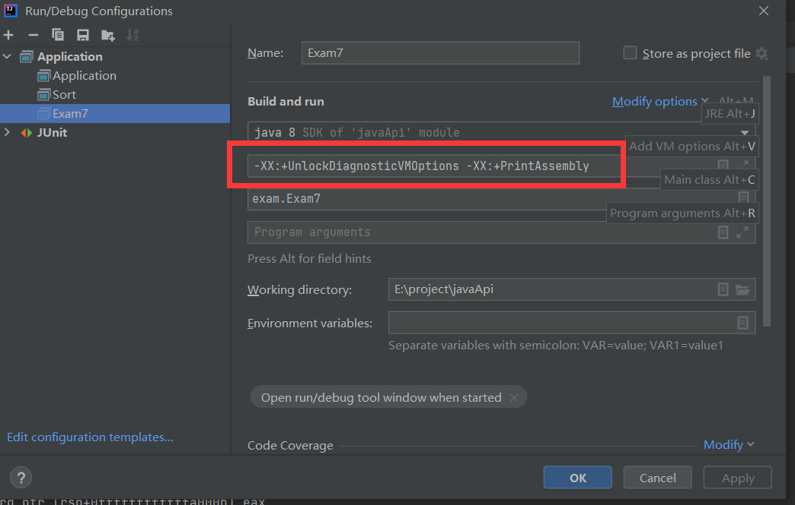
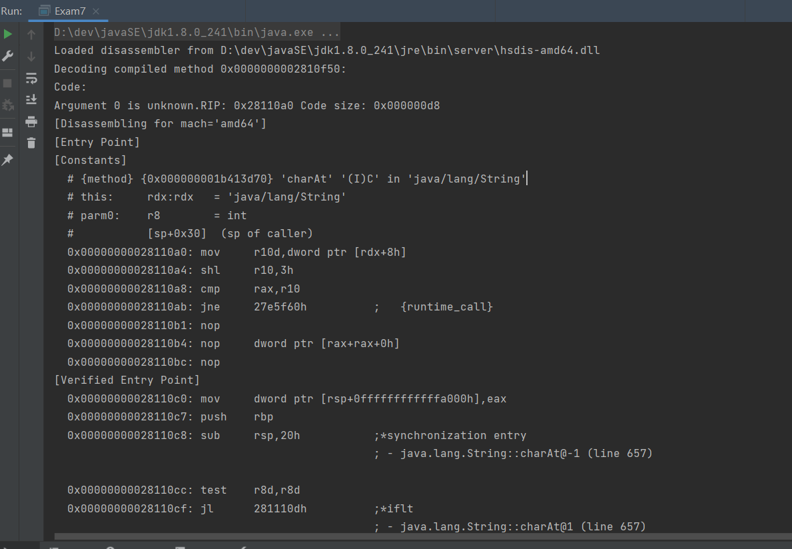

## 安装

下载 [***\*hsdis-1.2.0-win32-amd64.zip\****](https://sourceforge.net/projects/fcml/files/fcml-1.2.0/hsdis-1.2.0-win32-amd64.zip/download)

我使用的是`jdk1.8.0_241`,根据你自己的java环境来，将`hsdis-amd64.dll`复制到 `jdk1.8.0_241\jre\bin\server`中


```cassandra
java -XX:+UnlockDiagnosticVMOptions -XX:+PrintAssembly -Xcomp Hello.java > Hello.asm
```

就会出现类似

````c++
Decoding compiled method 0x00000000029e2cd0:
Code:
Argument 0 is unknown.RIP: 0x29e2ee0 Code size: 0x000007a8
[Disassembling for mach='amd64']
[Entry Point]
[Verified Entry Point]
[Constants]
  # {method} {0x000000001b5568b0} '<clinit>' '()V' in 'java/lang/invoke/MethodHandle'
  #           [sp+0x80]  (sp of caller)
  0x00000000029e2ee0: mov     dword ptr [rsp+0ffffffffffffa000h],eax
  0x00000000029e2ee7: push    rbp
  0x00000000029e2ee8: sub     rsp,70h
  0x00000000029e2eec: mov     rdx,1b6ef858h     ;   {metadata(method data for {method} {0x000000001b5568b0} '<clinit>' '()V' in 'java/lang/invoke/MethodHandle')}
  0x00000000029e2ef6: mov     esi,dword ptr [rdx+0dch]
  0x00000000029e2efc: add     esi,8h
  0x00000000029e2eff: mov     dword ptr [rdx+0dch],esi
  0x00000000029e2f05: mov     rdx,1b5568a8h     ;   {metadata({method} {0x000000001b5568b0} '<clinit>' '()V' in 'java/lang/invoke/MethodHandle')}
  0x00000000029e2f0f: and     esi,0h
  0x00000000029e2f12: cmp     esi,0h
  0x00000000029e2f15: je      29e337ch          ;*ldc  ; - java.lang.invoke.MethodHandle::<clinit>@0 (line 421)
````

或者

- 运行时添加参数： -XX:+UnlockDiagnosticVMOptions -XX:+PrintAssembly






## 输出过滤

默认情况下，PrintAssembly输出的是所有的信息，但是JDK内部的代码我们不可能进行修改，一般来说并不关心他们的assembly输出，如果要指定我们自己编写的方法，可以使用CompileCommand：

```java
java -XX:CompileCommand=help -version
```

```
C:\Users\lihao>java -XX:CompileCommand=help -version
  CompileCommand and the CompilerOracle allows simple control over
  what's allowed to be compiled.  The standard supported directives
  are exclude and compileonly.  The exclude directive stops a method
  from being compiled and compileonly excludes all methods except for
  the ones mentioned by compileonly directives.  The basic form of
  all commands is a command name followed by the name of the method
  in one of two forms: the standard class file format as in
  class/name.methodName or the PrintCompilation format
  class.name::methodName.  The method name can optionally be followed
  by a space then the signature of the method in the class file
  format.  Otherwise the directive applies to all methods with the
  same name and class regardless of signature.  Leading and trailing
  *'s in the class and/or method name allows a small amount of
  wildcarding.

  Examples:

  exclude java/lang/StringBuffer.append
  compileonly java/lang/StringBuffer.toString ()Ljava/lang/String;
  exclude java/lang/String*.*
  exclude *.toString
java version "1.8.0_241"
Java(TM) SE Runtime Environment (build 1.8.0_241-b07)
Java HotSpot(TM) 64-Bit Server VM (build 25.241-b07, mixed mode)
```


https://jpbempel.github.io/2016/03/16/compilecommand-jvm-option.html