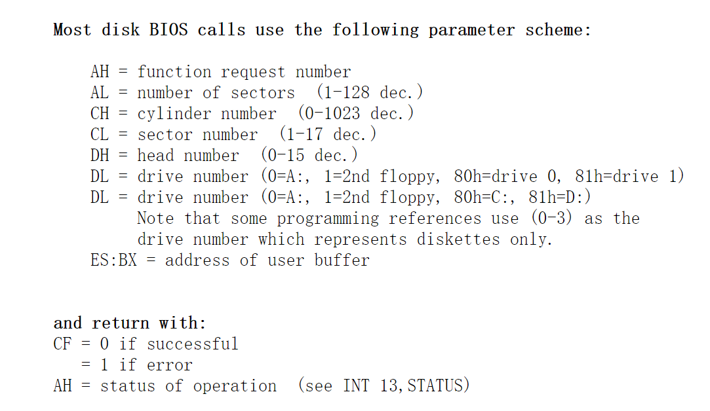
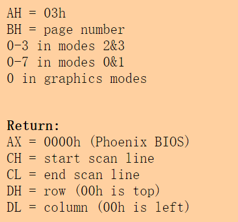

## 职责

bios 启动后会把磁盘的第一个扇区读取到内存中，然后把cpu的控制权交给刚刚加载进来的数据， bootsect开始把自己复制到0x9000这个段地址空间，加载setup到0x9000：0x0200内存地址处，然后把system加载到0x1000段地址空间，至此bootsect的任务结束了，把cpu的控制权交给了setup。

##  0x07c0：0x0000 复制到 0x9000 ：0x0000

`movw`:把**ds:si**指向的**字**复制到**es:di**所指向的位置,即把0x07c0：0x0的字复制到 0x9000 ：0x0的位置，每次复制一个字，一共256个字，即512字节，即一个扇区的数据。

注意当前是实模式，内存寻址是段地址+偏移地址。复制结束后，跳转到go这个标签出继续执行。

`jmpi`：跳转后，段寄存器cs的值就是INITSEG，即0x9000 ，go是一个偏移值，即后面的 mov	ax,cs处的偏移值，跳转到0x9000这个地址后，设置了栈顶的位置。

把一个扇区的数据复制到段0x9000段后，将段寄存器ds、es、ss都设置为0x9000，栈定设置为0x9000:0xFF00。


````java
_start:
	mov	ax,#BOOTSEG  ! ax = 0x07c0
	mov	ds,ax        ! ds = 0x07c0 
	mov	ax,#INITSEG  ! 0x9000 
	mov	es,ax        ! es = 0x9000
	mov	cx,#256      ! cx = 256
	sub	si,si        ! si清0
	sub	di,di        ! di清0
	rep
	movw
	jmpi	go,INITSEG
        
go:	mov	ax,cs     ! jmpi后，cs=0x9000，即ax = 0x9000
	mov	ds,ax     ! ds = 0x9000  
	mov	es,ax     ! es = 0x9000
! put stack at 0x9ff00.
	mov	ss,ax     ! 栈的段地址为 ss =  0x9000
	mov	sp,#0xFF00		! arbitrary value >>512,栈顶就在 ss:sp =  0x9000:0xFF00
````

## 加载setup

[int 13，AH=2](http://www.ctyme.com/intr/rb-0607.htm),把扇区的数据读取到内存，BIOS已经把第一个扇区读取到内存了，接下来读取4个扇区的数据到 0x9000：0x0200。


```c++
load_setup:
	mov	dx,#0x0000		! drive 0, head 0， DL=0软盘，DH=0磁头号0
	mov	cx,#0x0002		! sector 2, track 0，CL=2扇区号2，CH=0柱面号0
	mov	bx,#0x0200		! address = 512, in INITSEG，ES = 0x9000，bx = 0x0200，数据将会被读取到这个地址
	mov	ax,#0x0200+SETUPLEN	! service 2, nr of sectors，AH = 2功能号，AL=4读取4个扇区
	int	0x13			! read it
	jnc	ok_load_setup	! ok - continue，cf=0，就是读取没有问题
	mov	dx,#0x0000      ! 读取失败，
	mov	ax,#0x0000		! reset the diskette
	int	0x13
	j	load_setup      ! 加载失败就不停的重试了 
        
```

关于int 13的描述如下：



把4个扇区的setup加载到内存后，接下来确定一个磁道的扇区数。[int 13 AH=8](http://www.ctyme.com/intr/rb-0621.htm),读取磁道的扇区数到变量 sectors

````c++
ok_load_setup:

! Get disk drive parameters, specifically nr of sectors/track
    
	mov	dl,#0x00        ! dl=0 软盘
	mov	ax,#0x0800		! AH=8 is get drive parameters
	int	0x13
	mov	ch,#0x00        ! 清空ch
	seg cs 
	mov	sectors,cx      ! 清空ch后，cl就是磁道的扇区数，保存到cs:sectors这个位置，也就是给变量sectors赋值
 	mov	ax,#INITSEG     ! ax = 0x9000
	mov	es,ax           ! es = 0x9000
````


```java
    ! int 0x10中断 功能号ah=0x03,读取光标位置
	mov	ah,#0x03		! read cursor pos
	xor	bh,bh           ! bh 置为0，作为int 0x10中断的输入：bh=页号

	! 发出中断， 返回：ch=扫描开始线；cl=扫描结束线；dh=行号； dl=列号
	int	0x10
	

	! 显示24个字符
	mov	cx,#24

	! bh=0，页=0；bl=7，字符属性=7
	mov	bx,#0x0007		! page 0, attribute 7 (normal)

	! es:bp寄存器指向要显示的字符串
	mov	bp,#msg1

	! BIOS中断0x10功能号ah=0x13，功能：显示字符串
	! 输入：al=放置光标方式及规定属性。0x01表示使用bl中属性值，光标停在字符串结尾处；
	! es:bp 指向要显示的字符串起始位置。 cx=显示字符串个数； bh=显示页面号
	! bl=字符属性； dh=行号； dl=页号
	mov	ax,#0x1301		! write string, move cursor
	int	0x10
```





## 加载system

目前为止已经加载了5个扇区的数据了，先把段寄存器es的值设置为0x1000，读取扇区的数据就会放在es：bx这个地址。call指令先把下一条指令的地址(call kill_motor所在的地址)存到栈中，等到ret指令的指令会把上次存到栈中的地址弹出给ip。

```c++
mov	ax,#SYSSEG  ! ax = 0x1000
mov	es,ax		! segment of 0x010000 ，es = ax  = 0x1000
call	read_it ! 执行call指令，先把后面的地址存到ip中，然后跳转 read_it 标号处执行  
call	kill_motor  ! 关闭软盘的驱动马达
```

接下来开始读取system，system的数据比较多,目前来说，寄存器还是通用寄存器ax是16位的，2的16次方就是64KB，一开始段寄存器es的值是0x1000，也就是内存的第二个段，es的值可能因为人为的疏忽而导致没有对其64KB，所以这里检测了是否已经对其了，如果没有对其，那就会死机了。如果es的值大于0x4000，就说明读取完成了，读取了3个段的数据，一共64*3 = 192KB的数据。

假如第一个段起始地址是0x00000，那么第二个段起始地址就是0x10000，第三个段起始地址是0x20000，看到规律没有,因为ax中的值是es赋值的，是段寄存器中的值，只要ax中的值是类似0x0000、0x1000、0x2000、0x3000...这样的就是64KB对齐的，所以与上0x0fff，只要结果不是0，说明没有在段的起始位置，就是有问题的。


```c++
read_it:  
	mov ax,es        ! 前面已经设置了es的内容是0x1000， ax = 0x1000
	test ax,#0x0fff  ! 对其64KB，也就是保证ax是一个段的起始地址，正常情况下：test ax,#0x0fff结果为0，则ZF=1。不满足JNE跳转条件（ZF=0）
die:	
	jne die			 ! es must be at 64kB boundary
        
	xor bx,bx		 ! bx 为段内偏移，因为后面使用中断读取扇区后，数据是放在es:bx中的，先把bx清0，bx是段内的偏移，就是说把system放到一个新的段中
        			 ! 清bx 寄存器，用于表示当前段内存放数据的开始位置	
rp_read:
	mov ax,es          
	cmp ax,#ENDSEG	 ! ax - ENDSEG的结果会修改ZF标志，如果结果为0，则ZF=1，否则ZF=0，表示是否已经把system读取完毕？
	jb ok1_read      ! jb指令当进位CF标志位为1时跳转到ok1_read标号处,cmp是减法，如果CF = 1,说明有借位，此时ax的值比#ENDSEG的值小
        			 ! 说明没有读完,跳转ok1_read处执行	
	ret              ! system读取完毕，返回
```

这段代码还在0x9000段里，段寄存器cs的值就是0x9000，sectors表示的是一个磁道的扇区数，在读取磁道时用来判断是否已经读取完一个磁道，sread表示一个磁道的已读扇区，

````c++
ok1_read:
	seg cs          ! 0x9000
	mov ax,sectors  ! 每个磁道有多少的扇区数赋值给ax 
	sub ax,sread    ! 一个磁道的扇区数 - 一个磁道已读扇区数就是这个磁道未读扇区数，保存在ax中
	mov cx,ax       ! cx = 一个磁道还有多少扇区未读
	shl cx,#9       ! 左移9位，相当一乘以2的9次方，即512，因为一个扇区就是512字节，前面cx中是一个磁道中未读扇区数，然后乘以512就是未读字节数
	add cx,bx       ! 读取的扇区数据是放在es:bx指向的内存地址中的，这个时候就需要检查再一次读取会不会超过一个段（64KB）
	jnc ok2_read    ! 相加没有溢出，CF=0，not 0即为真，跳转到ok2_read标号处执行
	je ok2_read     ! ZF = 1,刚好相加等于64KB,一个段空间被填满了，跳转到ok2_read标号处执行
	xor ax,ax       ! 超过一个段地址空间了，ax清0
	sub ax,bx       ! 由于寄存器是16位无符号的，所以0-bx = 65536-bx，結果为段內剩余字节数
	shr ax,#9       ! 右移9位，除以512，ax存的就是这个段还可以读取的扇区数,后面read_track中al中保存的就是需要读取的扇区数
        
ok2_read:
	call read_track  ! 先把下一条指令的地址保存到栈中，然后跳转到read_track标号处执行，等到ret指令弹出指令给ip
	mov cx,ax        ! 读取后，al中保存着实际读取的扇区数数量，cx就表示这次这个磁道已经读了多少扇区 
	add ax,sread     ! 刚才读取这个磁道的扇区数 + 已经读取这个磁道的扇区数，ax = 现在读取这个磁道的扇区总数
	seg cs           ! 下面的指令用到了sectors，这个sectors所在的段就是cs，seg就是指定段地址 
	cmp ax,sectors   ! 如果当前磁道上的还有扇区未读，则跳转到ok3_read 处
	jne ok3_read
	mov ax,#1        ! 到这里说明上次一个磁道的扇区全部读取完毕，否则准备读下一磁道
	sub ax,head      ! ax - head,如果当前是0号磁头，ax - head 就是1，ZF=0,jne为真，就会跳转到ok4_read标号处；如果head已经是1号磁头，ax - head	
	jne ok4_read     ! 就是0，ZF=1，jne为假，可以读取下一个磁道了
	inc track        
ok4_read:
	mov head,ax      ! ax不是0就是1，即0号磁头与1号磁头，
	xor ax,ax        ! 清空ax，开始新的读取
        
! 能跳转到这里执行的有2条分支，一个是从ok2_read跳转而来，表明一个磁道上还有未读完的扇区，      
ok3_read:
	mov sread,ax     ! ax = 现在读取这个磁道的扇区总数，即sread = ax
	shl cx,#9        ! 左移9位，就是已经读取这个磁道的字节数
	add bx,cx        ! 检查有没有超过一个段大小，段的大小是16位的，最大值也就是65535
	jnc rp_read		 ! 如果bx+cx的值没有超过65535，即CF = 0，跳转到rp_read继续读
	mov ax,es        ! 已经超过65535了，先把es中的值复制到ax中
	add ax,#0x1000   ! 加上0x1000就是跳到了下一个段地址空间了，怎么理解呢?,是这样的，一个段寄存器是16位的，可以表达的数最多有65536个，最大值是65535
        			 ! 65536的二进制表示就是0001 0000 0000 0000 0000，想要进入下一个段地址空间，就要加上65536，可别忘了段地址+偏移地址的寻址方式
        			 ! 段地址还需要左移4位，0x1000的二进制形式就是0001 0000 0000 0000 ，
        			 ! 例如:        
        			 !		第一个段:0x0000 (0000 0000 0000 0000b) ,表示的段地址:0000 0000 0000 0000 0000b 
                     !      第二个段:0x1000 (0001 0000 0000 0000b) ,表示的段地址:0001 0000 0000 0000 0000b  
                     !      第三个段:0x2000 (0010 0000 0000 0000b) ,表示的段地址:0010 0000 0000 0000 0000b  
                     !      第四个段:0x3000 (0011 0000 0000 0000b) ,表示的段地址:0011 0000 0000 0000 0000b 
                     ! 以此类推，对其64KB就是16进制数的后3位全是0            
	mov es,ax        ! 把下一个段起始地址复制给es，因为读取的扇区会放在es:bx
	xor bx,bx        ! bx清0，开始准备在一个新段空间里些数据
	jmp rp_read      ! 跳转到rp_read开始读取

read_track:
	push ax         ! 保存 ax
	push bx         ! 保存 bx
	push cx         ! 保存 cx
	push dx         ! 保存 dx
	mov dx,track    ! dx = 当前磁道号
	mov cx,sread    ! cx = 一个扇区已经读取的扇区数
	inc cx          ! 下次开始读扇区号
	mov ch,dl       ! ch = 磁道号,cl = 读起始扇区号 
	mov dx,head     ! 磁头号
	mov dh,dl       ! dh = 磁头号
	mov dl,#0       ! dl = 0(读软驱)
	and dx,#0x0100  ! 磁头号最大也就是1
	mov ah,#2       ! ah = 2 表示读磁盘；al=读扇区数
	int 0x13        ! 读取磁盘扇区，如果读取成功，al中会保存实际读取的扇区数 
	jc bad_rt       ! 读取磁盘有问题，跳到bad_rt
	pop dx          ! 恢复 dx
	pop cx          ! 恢复 cx 
	pop bx          ! 恢复 bx
	pop ax          ! 恢复 ax
	ret             ! 返回，弹出上次的地址给ip
````

## 确定根设备号

此后，我们检查要使用哪个根文件系统设备（简称根设备）。如果已经指定了设备(!=0)， 就直接使用给定的设备。否则就需要根据 BIOS 报告的每磁道扇区数来确定到底使用/dev/PS0 (2,28) 还是 /dev/at0 (2,8)。
上面一行中两个设备文件的含义：在 Linux 中软驱的主设备号是 2，次设备号 = type * 4 + nr，其中 nr 为 0-3 分别对应软驱 A、B、C 或 D；type 是软驱的类型（2Æ1.2M 或 7Æ1.44M 等）。因为 7 * 4 + 0 = 28，所以 /dev/PS0 (2,28)指的是 1.44M A 驱动器,其设备号是 0x021c，同理 /dev/at0 (2,8)指的是 1.2M A 驱动器，其设备号是 0x0208。  

Linux设备号具体值的含义如下：
设备号=主设备号*256 + 次设备号（也即 dev_no = (major<<8) + minor ）（主设备号：1-内存,2-磁盘,3-硬盘,4-ttyx,5-tty,6-并行口,7-非命名管道）

-  0x300 - /dev/hd0 - 代表整个第 1 个硬盘；

-  0x301 - /dev/hd1 - 第 1 个盘的第 1 个分区；
   …

-  0x304 - /dev/hd4 - 第 1 个盘的第 4 个分区；

-  0x305 - /dev/hd5 - 代表整个第 2 个硬盘；

-  0x306 - /dev/hd6 - 第 2 个盘的第 1 个分区；
   …

-  0x309 - /dev/hd9 - 第 2 个盘的第 4 个分区；

   从 linux 内核 0.95 版后已经使用与现在相同的命名方法了。  

```c#
    seg cs
	mov	ax,root_dev
	cmp	ax,#0
	jne	root_defined
	seg cs
	mov	bx,sectors
	mov	ax,#0x0208		! /dev/ps0 - 1.2Mb
	cmp	bx,#15
	je	root_defined
	mov	ax,#0x021c		! /dev/PS0 - 1.44Mb
	cmp	bx,#18
	je	root_defined
undef_root:
	jmp undef_root
root_defined:
	seg cs
	mov	root_dev,ax

! after that (everyting loaded), we jump to
! the setup-routine loaded directly after
! the bootblock:

	jmpi	0,SETUPSEG  ! 跳转到setup处执行
```


