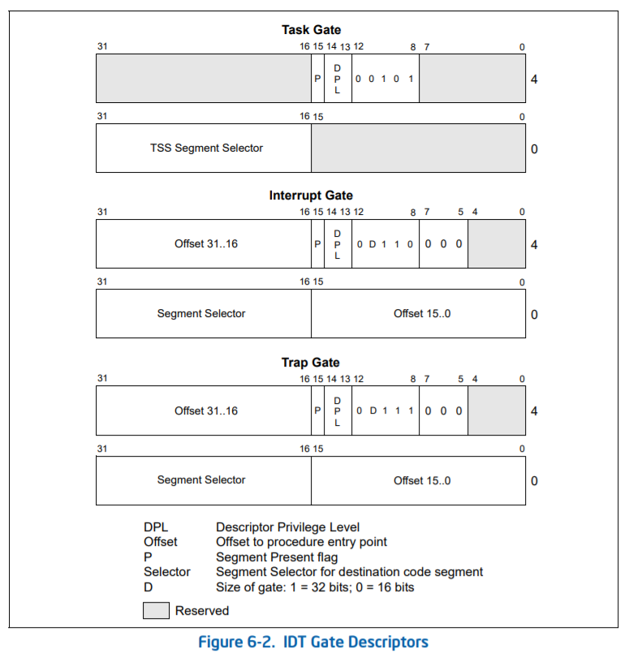
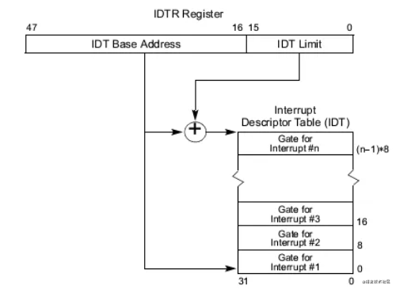
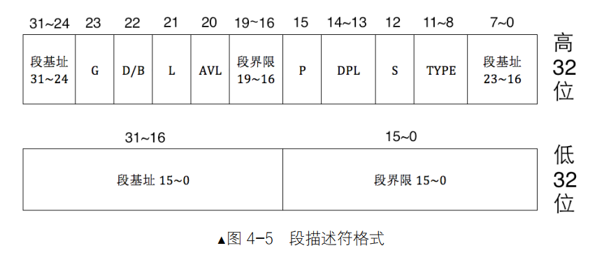
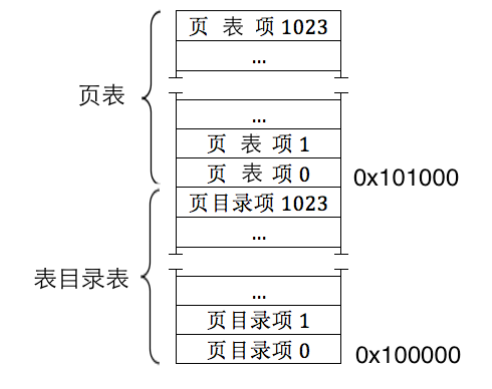
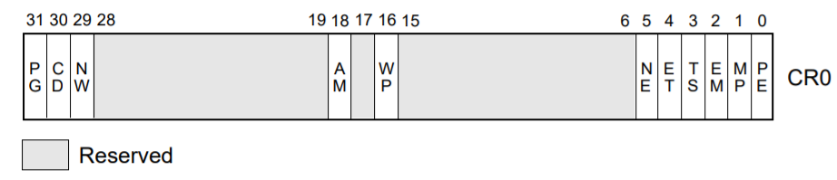
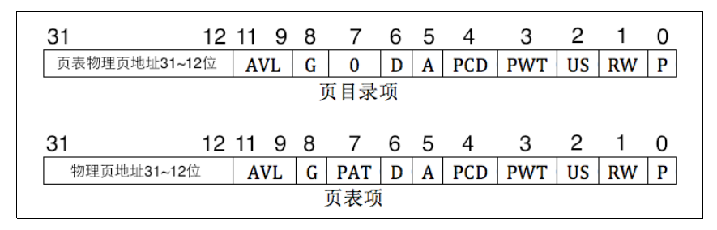

## 概述

经过前面，已经来到了保护模式 , 注意这里不是`intel汇编`格式，而是`AT&T汇编`。

```c++
startup_32:
	movl $0x10,%eax         # 把0x10立即数存到eax，即0001 0000,这是一个段描述符，RPL=0，TI=0，index=10b，即GDT中的第2个段描述符，内核数据段
	mov %ax,%ds
	mov %ax,%es
	mov %ax,%fs
	mov %ax,%gs
	lss stack_start,%esp    # ss:esp 设置堆栈，stack_start在sched.c中
	call setup_idt          # 重新设置idt
	call setup_gdt          # 重新设置gdt
	movl $0x10,%eax		# reload all the segment registers
	mov %ax,%ds		# after changing gdt. CS was already
	mov %ax,%es		# reloaded in 'setup_gdt'
	mov %ax,%fs
	mov %ax,%gs
	lss stack_start,%esp
	xorl %eax,%eax      # 清空eax
1:	incl %eax		    # check that A20 really IS enabled
	movl %eax,0x000000	# loop f orever if it isn't
	cmpl %eax,0x100000
	je 1b                # '1b'表示向后(backward)跳转到标号1 去
        
    movl %cr0,%eax		# check math chip
	andl $0x80000011,%eax	# Save PG,PE,ET
    orl $2,%eax		# set MP
	movl %eax,%cr0
	call check_x87
	jmp after_page_tables
```

A20如果没打开，则计算机处于20位的寻址模式，超过0xFFFFF寻址必然“回滚”。一个特例是0x100000会回滚到0x000000，也就是说，地址0x100000处存储的值必然和地址0x000000处存储的值完全相同。通过在内存0x000000位置写入一个数据，然后比较此处和1 MB（0x100000，注意，已超过实模式寻址范围）处数据是否一致，就可以检验A20地址线是否已打开。

x87协处理器：为了弥补x86系列在进行浮点运算时的不足，Intel于1980年推出了x87系列数学协处理器，那时是一个外置的、可选的芯片（笔者当时的80386计算机上就没安装80387协处理器）。1989年，Intel发布了486处理器。自从486开始，以后的CPU一般都内置了协处理器。这样，对于486以前的计算机而言，操作系统检验x87协处理器是否存在就非常必要了。

## 重新设置IDT

经过startup_32，ds= 0x10，es=0x10, fs=0x10, gs=0x10，段寄存器的值都是0x10，指向GDT中的第2个段描述符，内核数据段，这里用到ES进行赋值操作，ES的值是0x10，此时内核的数据段的基地址是0x00000000， 代码中ES:edi 数据赋值操作实际上就是把值复制到edi这个偏移地址，这里用的是中断门。

此时还没分页，任然使用段基址 + 偏移地址进行寻址，先把256个中断描述符置为哑门，后面等到main中再次初始化。



````c++
setup_idt:
	lea ignore_int,%edx           # 把ignore_int的偏移地址赋值故给edx
	movl $0x00080000,%eax         # 0x0008是段选择子，index=1，指向GDT的第二个段描述符，即内核代码段
	movw %dx,%ax		          # 偏移值的低16 位置入eax 的低16 位中，此时eax含有中断描述符的底4字节
	movw $0x8E00,%dx	          # 1000 1110 0000 0000,P=1,DPL=0表示内核态，Type=01110表示这是一个中断门

	lea idt,%edi                  # 将idt的偏移地址给edi,idt处的数据还没有初始化，256个来连续8字节的内存空间全部是0
	mov $256,%ecx                 # 256次循环
rp_sidt:                        
	movl %eax,(%edi)              # 把eax的中的内容赋值到ES:edi中去
	movl %edx,4(%edi)             # 把edx的中的内容赋值到ES:[edi+4]中去
	addl $8,%edi
	dec %ecx
	jne rp_sidt
	lidt idt_descr                # 加载idt到idtr寄存器
	ret
````

```c++
idt:	.fill 256,8,0		# idt is uninitialized
    
```


```c++
ignore_int:
	pushl %eax
	pushl %ecx
	pushl %edx
	push %ds
	push %es
	push %fs
	movl $0x10,%eax  # 0001 0000,这是一个段描述符，RPL=0，TI=0，index=10b，即GDT中的第2个段描述符，内核数据段
	mov %ax,%ds
	mov %ax,%es
	mov %ax,%fs
	pushl $int_msg 
	call printk      # 调用函数 ，显示Unknown interrupt\n\r 
	popl %eax     
	pop %fs
	pop %es
	pop %ds
	popl %edx
	popl %ecx
	popl %eax
	iret            # 返回用户态
```




```c++
# idtr寄存器是一个48位的
idt_descr:
	.word 256*8-1		# idt contains 256 entries
	.long idt           # idt的偏移地址
```

## 重新设置GDT

GDT第一个段描述符默认不用为NULL，第二个为内核代码段，第三个为内核数据段，段基址都是0x00000000

````c++
setup_gdt:
	lgdt gdt_descr
	ret
````


`````c++
gdt_descr:
	.word 256*8-1   # so does gdt (not that that's any
	.long gdt		# magic number, but it works for me :^)
`````

  

- 0x00c09a0000000fff:

  ​	   0000 0000 1100 0000 1001 1010 0000 0000     P=1，DPL = 0，S=1，Type=1010表示一致性代码段，G=1表示段界限单位是4KB，D/B=1，

  ​       0000 0000 0000 0000 0000 1111 1111 1111     段基址为0，段界限4096 * 4096=16MB

- 0x00c0920000000fff：

  ​		0000 0000 1100 0000 1001 0010 0000 0000  Type = 0010表示数据段

   		0000 0000 0000 0000 0000 1111 1111 1111

  

```c++
gdt: .quad 0x0000000000000000	/* NULL descriptor */
	 .quad 0x00c09a0000000fff	/* 16MB */
	 .quad 0x00c0920000000fff	/* 16MB */
	 .quad 0x0000000000000000	/* TEMPORARY - don't use */
	 .fill 252,8,0			    /* space for LDT's and TSS's etc */
```

## 分页

32为的虚拟地址分成3个部分，高10位（第31~22位）用来定位一个页目录项；中间10位（ 第21 ~ 12位）用来在页表中定位一个页表项；最后的12位（第11~0位）是偏移地址。

二级页表是这样的： 页目录中有1024 个页目录项PDE，每个PDE占据4字节，每个PDE的高 10 位（第31～22 位）用来定位一个页目录项，拿到PDE就知道了页表在哪了，中间的10位用于在页表中定位页表项PTE，每个页表有1024个页表项，每个页表项也是4字节，每个PTE指向的一个物理页是4KB，那么每个页表就可以表示1024 * 4KB = 4MB的内存空间，  一共有1024个页目录，可以表示1024 * 4MB = 4GB的物理内存空间。

这里是模拟了call指令的行为，call指令的执行会先把下一步指令地址压入栈，等到ret指令执行时，会把上次压栈的指令弹出给ip，这里没有用call，用jmp代替，但是已经把main函数的地址压入栈了，等到分页完成，就会执行main函数。 

````c++
after_page_tables:
	pushl $0		# These are the parameters to main :-)
	pushl $0
	pushl $0
	pushl $L6		# return address for main, if it decides to.
	pushl $main     # main函数地址，分页后返回就会执行main函数了
	jmp setup_paging  
````

`stosl` 指令相当于将` eax` 中的值保存到` ES:EDI` 指向的地址中，若设置了标志寄存器EFLAGS中的方向位置位(即在` stosl`指令前使用`STD`指令)则EDI自减4，否则(使用`CLD`指令)EDI自增4。所以这里` ecx`的值就是1024 * 5，每次移动4个字节，1024 * 5就是移动了1024* 5 * 4个字节，也就是5KB(5页)。`pg_dir`的初始位置在0x0000这个位置。

```c++
.org 0x1000
pg0:

.org 0x2000
pg1:

.org 0x3000
pg2:

.org 0x4000
pg3:
```

先把页目录项填写好



一个页目录大小是4KB，刚好一个页大小，每个PDT大小4字节，也就是有1024个PDT，

````c++
setup_paging:
	movl $1024*5,%ecx		# 首先对1页目录+4个页表清0
	xorl %eax,%eax          # eax清0
	xorl %edi,%edi			# edi清0
	cld;rep;stosl           # cld指令将DF标志清0,stosl将eax中的值复制到es:edi中,每次4个字节
        
	movl $pg0+7,pg_dir		# 0x1007,0000 0000 0000 0000 0001 0000 0000 0111b,P=1,RW=1,US=1,页目录中第1个
	movl $pg1+7,pg_dir+4	# 0x2007,0000 0000 0000 0000 0010 0000 0000 0111b,P=1,RW=1,US=1,页目录中第2个
	movl $pg2+7,pg_dir+8	# 0x3007,0000 0000 0000 0000 0011 0000 0000 0111b,P=1,RW=1,US=1,页目录中第3个
	movl $pg3+7,pg_dir+12	# 0x4007,0000 0000 0000 0000 0100 0000 0000 0111b,P=1,RW=1,US=1,页目录中第4个
	movl $pg3+4092,%edi     # 最后页表项的地址
	movl $0xfff007,%eax		/*  16Mb - 4096 + 7 (r/w user,p) */
	std                     # DF标志置位1
1:	stosl			        # 把eax中的值0xfff007给es:edi
	subl $0x1000,%eax       # eax- 0x1000，前一个段
	jge 1b                  # 如果小于 0 则说明全添写好了。
	xorl %eax,%eax		    # eax清0，因为页目录在 0x0000
    movl %eax,%cr3		    # 给cr3寄存器赋值，指定页目录物理地址，后面虚拟地址转物理地址时先找到cr3中的值，也就是页表物理地址。
	movl %cr0,%eax          # 
	orl $0x80000000,%eax    # PG=1，打开分页
	movl %eax,%cr0		/* set paging (PG) bit */
	ret			/* this also flushes prefetch-queue */
````





4 字节大小，但其内容并不全是物理地址，只有第12～31 位才是物理地址，这才20 位，因该是32位啊~， 因为页目录项和页表项中的都是物理页地址，标准页大小是4KB，故地址都是4K 的倍数，也就是地址的低12 位是0，所以只需要记录物理地址高20 位就可以啦。这样省出来的12 位。