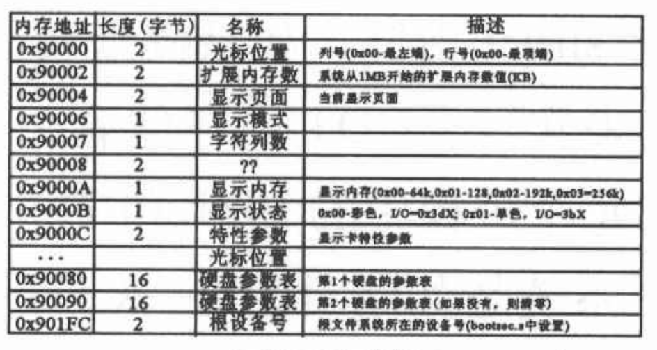
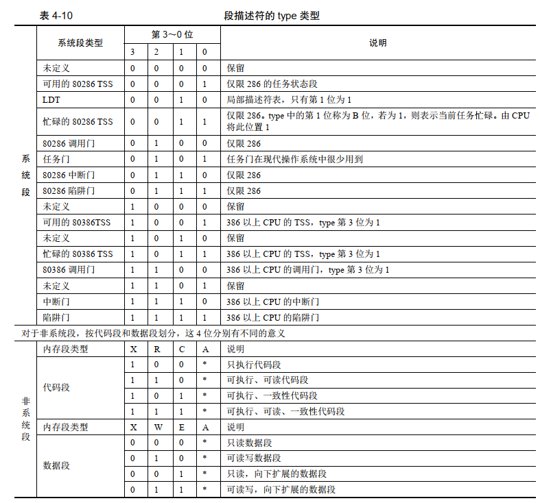
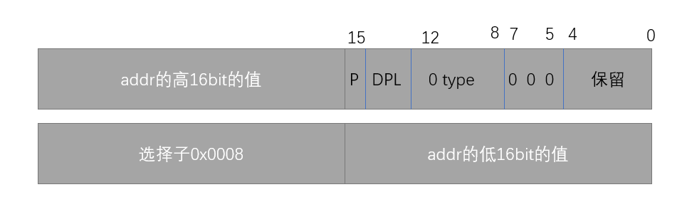
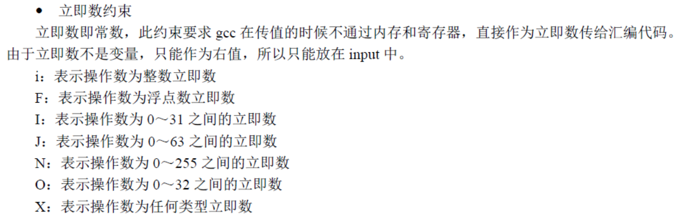
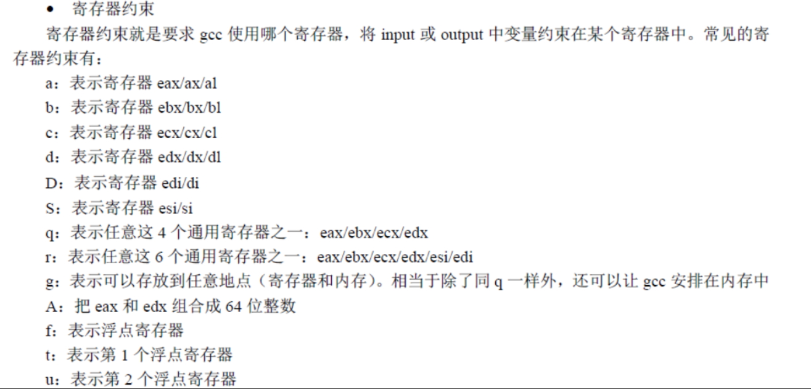
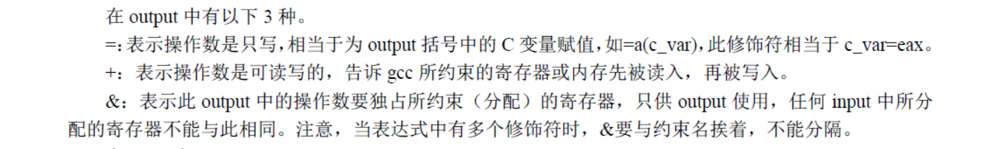

## 一些参数

还记得在setup中获取的一些系统信息吗



````c
#define EXT_MEM_K (*(unsigned short *)0x90002)
#define DRIVE_INFO (*(struct drive_info *)0x90080)
#define ORIG_ROOT_DEV (*(unsigned short *)0x901FC)
````

- 0x90002

  这个物理地址存折扩展内存大小

```c++
! 获取扩展内存的大小，kB为单位	
! Get memory size (extended mem, kB)
mov	ah,#0x88
int	0x15
mov	[2],ax    ! ds:[2]即 0x9000:0x0002这个位置存着扩展内存的大小（kB）
```


- 0x90080

  一个磁盘信息占据16字节，`drive_info`占据32字节，所以linux0.11最多支持2个硬盘。

````c
! Get hd0 data

	mov	ax,#0x0000
	mov	ds,ax           ! 段寄存器ds=0，内存地址从0开始
	lds	si,[4*0x41]     ! ds:si,即0x0000:4*0x41地址的地方存着hd0的参数
	mov	ax,#INITSEG     ! ax = 0x9000
	mov	es,ax           ! es = ax = 0x9000
	mov	di,#0x0080      ! di = 0x0080  
	mov	cx,#0x10        ! cx = 0x10,循环16次,
	rep                 ! 把ds:si的数据复制到es:di的地方，即 0x0000:4*0x41 -> 0x9000:0x0080,一共复制16字节
	movsb
````

- 0x901FC

​        bootsect被复制到0x90000地址处，root_dev的偏移地址就是0x01FC，那么真实的物理地址就是`0x901FC`

```c

.org 508
root_dev:
	.word ROOT_DEV
```


## 物理内存格局初始化

先获取总内存，因为linux最大支持16MB，后面我们都按照16MB计算，打开A20后，寻址空间虽然可以达到4GB，但都是虚拟的。按照内存大小设置缓冲区大小。

``````c
	memory_end = (1<<20) + (EXT_MEM_K<<10);     // 内存大小=1MB + 扩展内存(k)*1024 byte
	memory_end &= 0xfffff000;                   // 忽略不到4KB(1页)的内存数,4KB的对齐
	if (memory_end > 16*1024*1024)              // 内存超过16MB，则按16MB计
		memory_end = 16*1024*1024;
	if (memory_end > 12*1024*1024)              // 如果内存>12MB,则设置缓冲区末端=4MB
		buffer_memory_end = 4*1024*1024;
	else if (memory_end > 6*1024*1024)          // 否则若内存>6MB,则设置缓冲区末端=2MB
		buffer_memory_end = 2*1024*1024;
	else
		buffer_memory_end = 1*1024*1024;        // 否则设置缓冲区末端=1MB
	main_memory_start = buffer_memory_end;
``````

## 物理内存管理初始化

计算高端内存15MB的页面数，每个页占据4KB，mem_map数组标记高端内存中页面的使用情况，0表示未使用，向系统申请可以使用，1表示已经被使用。

```c++
// linux0.11内核默认支持的最大内存容量是16MB，可以修改这些定义适合更多的内存。
// 内存低端(1MB)
#define LOW_MEM 0x100000
// 分页内存15 MB，主内存区最多15M.
#define PAGING_MEMORY (15*1024*1024)
// 主内存分页后的物理内存页面数（3840）
#define PAGING_PAGES (PAGING_MEMORY>>12)
// 指定地址映射为页号
#define MAP_NR(addr) (((addr)-LOW_MEM)>>12)
// 页面被占用标志.
#define USED 100


// 物理内存映射字节图（1字节代表1页内存）。每个页面对应的字节用于标志页面当前引
// 用（占用）次数。它最大可以映射15MB的内存空间。在初始化函数mem_init()中，对于
// 不能用做主内存页面的位置均都预先被设置成USED（100）.
static unsigned char mem_map [ PAGING_PAGES ] = {0,};


.....

// 物理内存管理初始化
// 该函数对1MB以上的内存区域以页面为单位进行管理前的初始化设置工作。一个页面长度
// 为4KB bytes.该函数把1MB以上所有物理内存划分成一个个页面，并使用一个页面映射字节
// 数组mem_map[]来管理所有这些页面。对于具有16MB内存容量的机器，该数组共有3840
// 项((16MB-1MB)/4KB)，即可管理3840个物理页面。每当一个物理内存页面被占用时就把
// mem_map[]中对应的字节值增1；若释放一个物理页面，就把对应字节值减1。若字节值为0，
// 则表示对应页面空闲；若字节值大于或等于1，则表示对应页面被占用或被不同程序共享占用。
// 在该版本的Linux内核中，最多能管理16MB的物理内存，大于16MB的内存将弃之不用。
// 对于具有16MB内存的PC机系统，在没有设置虚拟盘RAMDISK的情况下start_mem通常是4MB，
// end_mem是16MB。因此此时主内存区范围是4MB-16MB,共有3072个物理页面可供分配。而
// 范围0-1MB内存空间用于内核系统（其实内核只使用0-640Kb，剩下的部分被部分高速缓冲和
// 设备内存占用）。
// 参数start_mem是可用做页面分配的主内存区起始地址（已去除RANDISK所占内存空间）。
// end_mem是实际物理内存最大地址。而地址范围start_mem到end_mem是主内存区。
void mem_init(long start_mem, long end_mem)
{
	int i;

    // 首先将1MB到16MB范围内所有内存页面对应的内存映射字节数组项置为已占用状态，
    // 即各项字节全部设置成USED(100)。PAGING_PAGES被定义为(PAGING_MEMORY>>12)，
    // 即1MB以上所有物理内存分页后的内存页面数(15MB/4KB = 3840).
	HIGH_MEMORY = end_mem;                  // 设置内存最高端(16MB)
	for (i=0 ; i<PAGING_PAGES ; i++)
		mem_map[i] = USED;
    // 然后计算主内存区起始内存start_mem处页面对应内存映射字节数组中项号i和主内存区页面数。
    // 此时mem_map[]数组的第i项正对应主内存区中第1个页面。最后将主内存区中页面对应的数组项
    // 清零(表示空闲)。对于具有16MB物理内存的系统，mem_map[]中对应4MB-16MB主内存区的项被清零。
	i = MAP_NR(start_mem);      // 主内存区其实位置处页面号
	end_mem -= start_mem;
	end_mem >>= 12;             // 主内存区中的总页面数
	while (end_mem-->0)
		mem_map[i++]=0;         // 标记主内存每个页都未使用
}
```

## 中断向量初始化

kernel/traps.c

```c++
// 异常(陷阱)中断程序初始化子程序。设置他们的中断调用门(中断向量)。
// set_trap_gate()与set_system_gate()都使用了中断描述符表IDT中的陷阱门(Trap Gate),
// 他们之间的主要区别在于前者设置的特权级为0，后者是3.因此断点陷阱中断int3、溢出中断
// overflow和边界出错中断bounds可以由任何程序产生。
// 这两个函数均是嵌入式汇编宏程序(include/asm/system.h中)
void trap_init(void)
{
	int i;
	// 设置除操作出错的中断向量值。
	set_trap_gate(0,&divide_error);
	set_trap_gate(1,&debug);
	set_trap_gate(2,&nmi);
	set_system_gate(3,&int3);	/* int3-5 can be called from all */
	set_system_gate(4,&overflow);
	set_system_gate(5,&bounds);
	set_trap_gate(6,&invalid_op);
	set_trap_gate(7,&device_not_available);
	set_trap_gate(8,&double_fault);
	set_trap_gate(9,&coprocessor_segment_overrun);
	set_trap_gate(10,&invalid_TSS);
	set_trap_gate(11,&segment_not_present);
	set_trap_gate(12,&stack_segment);
	set_trap_gate(13,&general_protection);
	set_trap_gate(14,&page_fault);
	set_trap_gate(15,&reserved);
	set_trap_gate(16,&coprocessor_error);
	// 下面把int17-47的陷阱门先均设置为reserved,以后各硬件初始化时会重新设置自己的陷阱门。
	for (i=17;i<48;i++)
		set_trap_gate(i,&reserved);
	// 设置协处理器中断0x2d(45)陷阱门描述符，并允许其产生中断请求。设置并行口中断描述符。
	set_trap_gate(45,&irq13);
	outb_p(inb_p(0x21)&0xfb,0x21);  // 允许8259A主芯片的IRQ2中断请求。
	outb(inb_p(0xA1)&0xdf,0xA1);    // 允许8259A从芯片的IRQ3中断请求。
	set_trap_gate(39,&parallel_interrupt); // 设置并行口1的中断0x27陷阱门的描述符。
    
}
```

include/asm/system.h



```java
// 设置陷阱门函数
#define set_trap_gate(n,addr) \     
	_set_gate(&idt[n],15,0,addr)                      // 15表示的是陷阱门，type=1111

// 设置系统调用门函数
#define set_system_gate(n,addr) \
	_set_gate(&idt[n],15,3,addr)


#define _set_gate(gate_addr,type,dpl,addr) \
__asm__ ("movw %%dx,%%ax\n\t" \
	"movw %0,%%dx\n\t" \                               // (short) (0x8000+(dpl<<13)+(type<<8))的值给dx
	"movl %%eax,%1\n\t" \                              // 把eax中的值给gate_addr这个地址当作内容，此时的eax的高16bit是选择子0x0008，即内核代码段
 	"movl %%edx,%2" \                                  // eax 的低16bit是addr低16位的地址，此时edx的值是高16bit是addr的高16位的地址，低16bit是
	: \                                                // (short) (0x8000+(dpl<<13)+(type<<8))的值
	: "i" ((short) (0x8000+(dpl<<13)+(type<<8))), \    //  1 dpl(2bit) 0 type(4bit) 0000 0000， 即 P=1 
	"o" (*((char *) (gate_addr))), \                  
	"o" (*(4+(char *) (gate_addr))), \
	"d" ((char *) (addr)),"a" (0x00080000))
```








## 切换到用户态

```java
#define move_to_user_mode() \
__asm__ ("movl %%esp,%%eax\n\t" \
	"pushl $0x17\n\t" \
	"pushl %%eax\n\t" \
	"pushfl\n\t" \
	"pushl $0x0f\n\t" \
	"pushl $1f\n\t" \
	"iret\n" \
	"1:\tmovl $0x17,%%eax\n\t" \
	"movw %%ax,%%ds\n\t" \
	"movw %%ax,%%es\n\t" \
	"movw %%ax,%%fs\n\t" \
	"movw %%ax,%%gs" \
	:::"ax")
```

## fork进程

```c
// 下面_syscall0()是unistd.h中的内嵌宏代码。以嵌入汇编的形式调用Linux的系统调用中断
// 0x80.该中断是所有系统调用的入口。该条语句实际上是int fork()创建进程系统调用。可展
// 开看之就会立刻明白。syscall0名称中最后的0表示无参数，1表示1个参数。
static inline _syscall0(int,fork)
```

```java
#define _syscall0(type,name) \
type name(void) \
{ \
long __res; \
__asm__ volatile ("int $0x80" \
	: "=a" (__res) \
	: "0" (__NR_##name)); \
if (__res >= 0) \
	return (type) __res; \
errno = -__res; \
return -1; \
}
```

转开后就是

```java
int fork(void) 
{ 
long __res; 
__asm__ volatile ("int $0x80" \
	: "=a" (__res) \
	: "0" (__NR_fork)); \
if (__res >= 0) \
	return (int) __res; \
errno = -__res; \
return -1; \
}
```

``` #define __NR_fork	2```


在 sched.c中 设置了0x80中断门```set_system_gate(0x80,&system_call);```




