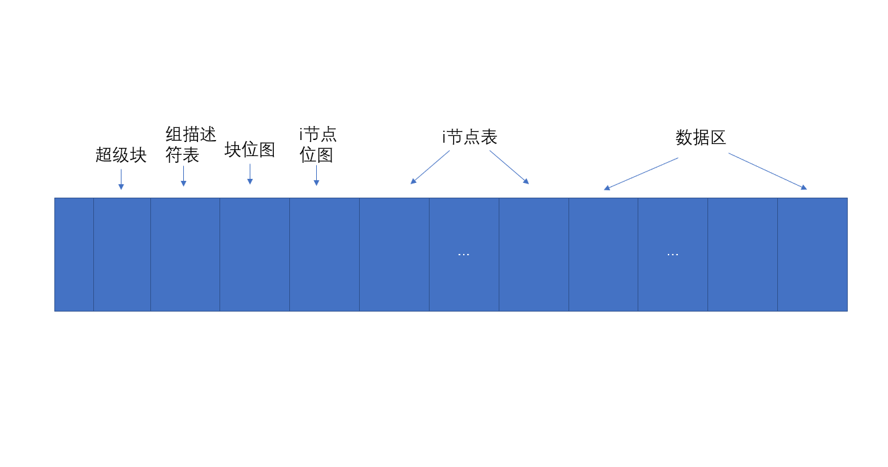
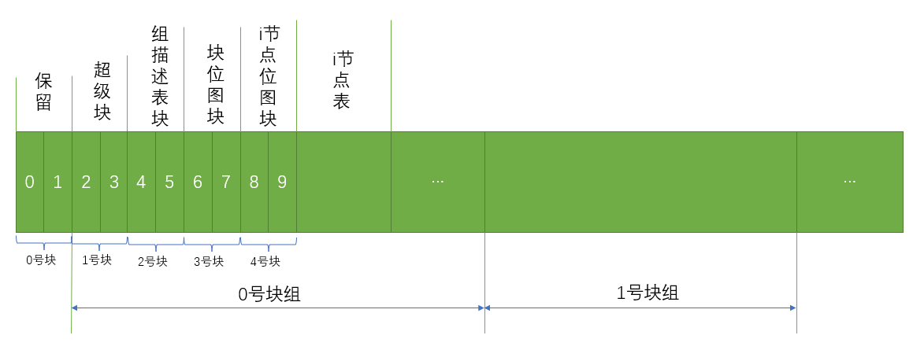
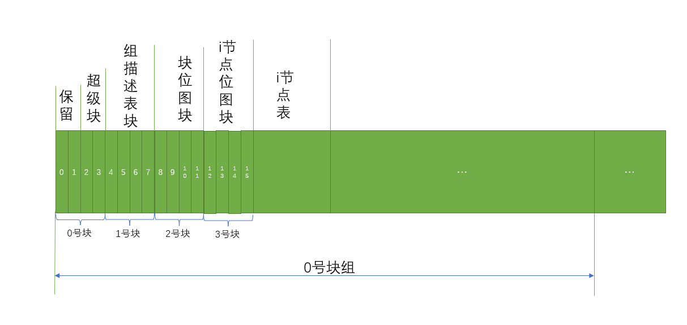
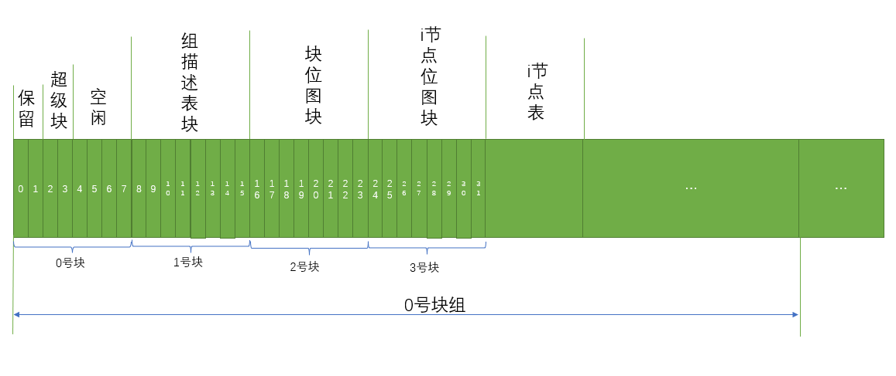
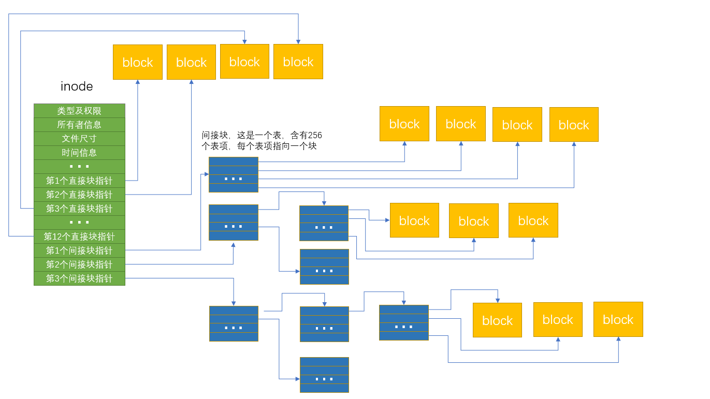

## 概述

硬盘最底层的读写IO一次是一个扇区512字节，如果要读写大量文件，以扇区为单位肯定很慢很消耗性能，所以硬盘使用了一个称作逻辑块的概念。逻辑块是逻辑的，由磁盘驱动器负责维护和操作，它并非是像扇区一样物理划分的。一个逻辑块的大小可能包含一个或多个扇区，每个逻辑块都有唯一的地址，称为LBA。有了逻辑块之后，磁盘控制器对数据的操作就以逻辑块为单位，一次读写一个逻辑块，磁盘控制器知道如何将逻辑块翻译成对应的扇区并读写数据。

`Ext2`和`Ext3`是许多Linux操作系统发行版本的默认文件系统，一般情况下将其统称位`ExtX`，ExtX基于UFS（Unix File System）,是一种快速、稳定的文件系统。

`ExtX`对多字节数据的排列使用`Little-endian`顺序，即低位在前，高位在后。

`ExtX`将整个文件系统划分为许多个`块（Block）`，用`块`作为数据的存储单元。`块由若干个连续的扇区组成`，通常为2个扇区，4个扇区或者8个扇区，这个值的大小会记录在位于文件系统2~3号扇区的`超级块`中。

所有的块都被赋予一个地址，地址由0开始编号，0号块起始于文件系统的第一个扇区。

所有的块被划分成若干个相等的`块组`，每个块组包含同样数量的块。但由于整个文件系统可能会不是块组大小的整数倍，因此最后一个块组有可能小于其他的块组。

如果超级块中定义了在文件系统开始处设定保留区域，则保留区域不属于任何块组，0号块组也相应地跟在保留扇区后面开始。

为了确定一个块属于哪个快组，可以用这样计算：（ 当前块号 - 0号块组起始块号） / 每组块数

ExtX的基本布局信息存储在一个称为“`超级块`”的结构中，第一个超级块位于文件系统的2号扇区，占据2个扇区的大小。前2个扇区用来存放引导程序，称为引导扇区。如果没有引导程序则保留不用的。通常情况下，只有0号块组的超级块信息被文件系统使用。ExtX默认激活一种称为“稀疏超级块”的特性，就是只在某些块组中存放超级块的备份，而不是在所有的块组中存放超级块的备份。

## 整体布局

一个Extx文件系统被分成若干个块组，每个块组的结构基本相同，我们以第一个快组为例给出它的结构框架

0~1号扇区保留为引导代码扇区，如果没有引导代码，则该两个扇区为空，全部用0填充。

### 块大小为1024字节

### 块大小是2048字节

### 块大小是4096字节

## 超级块

超级块数据结构

| 字节数 | 含义                 |
| ------ | -------------------- |
| 4      | 文件系统总的i-节点数 |
|4|文件系统总块数|
|4|为文件系统预保留的块数|
|4|空闲块数|
|4|空闲i-节点数|
|4|0号块组起始块号|
|4|每个块占用的字节数,假设该值为n，则块大小为2的n次方再乘以1024个字节|
|4|片段大小（与块大小字段完全相同），在UFS文件系统中，为了减少存储数据时文件尾部浪费的空间，将一个块有划分成若干个片段。ExtX文件系统来源与UFS，也在超级块中保留了这个字段，但ExtX并不支持将块划分成片段，因此，片段大小总是与块大小相等|
|4|每个块组所含块数|
|4|每个块组所含片段数|
|4|每块组i-节点数|
|4|最后挂载时间|
|4|最后写入时间|
|2|最大挂载数|
|2|Extx文件系统签名标志“53EF”|
|2|文件系统状态，0x0001表示文件系统正常，0x0002表示有错误，0x0004表示恢复了孤立的i-节点|
|2|错误处理方式，即遇到文件系统错误时，操作系统应该采取何种处理方法。1表示继续运行，2表示以只读方式重新挂载文件系统，3表示紧急处理|
|2|次版本级别|
|4|最后进行一致性检查时间|
|4|一致性检查间隔时间|
|4|创建本文件系统的操作系数，0表示Linux，1表示GNU Hurd,2表示Masix，3表示FreeBSD,4表示Lites|
|4|主版本级别，0表示初始版本，1表示动态版本|
|2|默认UID保留块|
|2|默认GID保留块|
|2|第一个非保留i-节点，也就是用户数据可以使用的第一个i-节点号，通常为11号i-节点，不过这个i-节点总是被“lost+found”目录所使用|
|2|每个i-节点结构的大小|
|2|本超级块所在的块组号|
|4|兼容特征标志|
|4|非兼容特征标志|
|4|只读兼容特征标志|
|16|文件系统ID|
|16|卷名|
|64|最后挂载路径|
|4|位图使用运算法则|
|1|文件再分配块数|
|1|目录再分配块数|
|2|未使用|
|16|日志ID|
|4|日志i-节点|
|4|日志设备|
|4|孤立i-节点表头|
|788|未使用|

## 组描述符表块

组描述符表起始于超级块后面的块，组描述符的起始位置在超级块中加以描述，由文件系统中描述每个块组的组描述符组成，文件系统中的每个块组都在这个表中拥有一个包含该组相关信息的描述项。

如果没有激活稀疏超级块特性，则在每个块中都会有一个组描述符表的备份。但通常Linux会默认激活稀疏超级块特性，因此只会在某些块组中存在组描述符表的备份，其他的块组中则没有。在没有超级块备份及组描述符备份的块组中，也不会为超级块和组描述符保留空间。

组描述符数据结构

| 字节数 | 含义                       |
| ------ | -------------------------- |
| 4      | 块位图起始地址（块号）     |
| 4      | i-节点位图起始地址（块号） |
| 4      | i-节点表起始地址（块号）   |
| 2      | 该块组中的空闲块数         |
| 2      | 该块组中的空闲i-节点数     |
| 2      | 该块组中的目录数           |
| 2      | 填充                       |
| 12     | 未用                       |

## 块位图

文件内容保存在块中，块的分配情况记录在块位图中。 每个块组都有一个描述本组内所有块的分配情况的块位图结构。 块位图占用一个块的空间。 块位图中的每个bit对一个一个块，如果某个块已经配分配使用，则与该块对应的块位图的bit位被置位1，未使用的是0。

## i-节点位图块

与块位图类似，注意i-节点号的编号与其他结构的由0开始编号不同，`它是由1开始编号`，即整个文件系统内的所有i-节点由1开始编号，第一个i-节点为“1号i-节点”。

## i-节点表

Extx文件系统使用`i-node`存储文件及目录的元数据，每个`i-node`的大小固定为128个字节大小，所属有的i-node存放在i-node表中，每个块组中都有一个本块组的i-node表。

i-节点数据结构

| 字节数 | 含义                                                         |
| ------ | ------------------------------------------------------------ |
| 2      | 文件模式（类型及权限），0~9bit表示权限，每个bit对应一种权限；10~11bit描述可执行文件和目录的某些属性；12~15bit定义该节点所描述的对象的文件类型 |
| 2      | UID的低16位                                                  |
| 4      | 大小字节数低32位                                             |
| 4      | 最后的访问时间                                               |
| 4      | i-节点改变时间                                               |
| 4      | 删除时间                                                     |
| 2      | GID的低16位                                                  |
| 2      | 链接数，即有多少个文件（或目录）指向这个i-节点。如果链接数为0且没有程序打开这个文件，则这个i-节点没有被分配。如果链接数等于0但有程序打开这个文件，则它为一个孤节点，当程序关闭后它将会被删除。 |
| 4      | 扇区数                                                       |
| 4      | 标志                                                         |
| 4      | 未使用                                                       |
| 4      | 第1个直接块指针                                              |
| 4      | 第2个直接块指针                                              |
| 4      | 第3个直接块指针                                              |
| 4      | 第4个直接块指针                                              |
| 4      | 第5个直接块指针                                              |
| 4      | 第6个直接块指针                                              |
| 4      | 第7个直接块指针                                              |
| 4      | 第8个直接块指针                                              |
| 4      | 第9个直接块指针                                              |
| 4      | 第10个直接块指针                                             |
| 4      | 第11个直接块指针                                             |
| 4      | 第12个直接块指针                                             |
| 4      | 一个一级间接块指针                                           |
| 4      | 一个二级间接块指针                                           |
| 4      | 一个三级间接块指针                                           |
| 4      | 时代号（NFS）                                                |
| 4      | 扩展属性块（文件ACL）                                        |
| 4      | 大小字节数高32位（目录ACL）                                  |
| 4      | 片段地址                                                     |
| 1      | 片段索引号                                                   |
| 1      | 片段大小                                                     |
| 2      | 未使用                                                       |
| 2      | UID高16位                                                    |
| 2      | GID高16位                                                    |
| 4      | 未使用                                                       |

### 文件模式

- 0~9bit表示权限

| 权限值 | 含义           |
| ------ | -------------- |
| 0x001  | 其他用户可执行 |
|0x002|其他用户可写|
|0x004|其他用户可读|
|0x008|同组用户可执行|
|0x010|同组用户可写|
|0x020|同组用户可读|
|0x040|属主可执行|
|0x080|属主可写|
|0x100|属组可读|

- 10~11bit描述可执行文件和目录的某些属性

如果一个可执行文件的“驻留位”被设置，则当该程序被关闭后仍然会有代码驻留在内存中。

如果此位作用于一个目录，则只有文件的属主才能够删除这个目录中的内容。

如果对一个可执行文件设置了“SUID”位和“SGID”位，则进程是根据文件的用户标识和组标识决定是否启动进程，而不是根据用户。

| 标志值 | 含义 |
| ------ | ---- |
|  0x200 |驻留位 |
|0x400|SGID|
|0x800|SUID|

- 12~15bit定义该节点所描述的对象的文件类型

| 类型值 | 含义     |
| ------ | -------- |
| 0x1000 | 先进先出 |
|0x2000|字符设备|
|0x4000|目录|
|0x6000|块设备|
|0x8000|正常文件|
|0xA000|动态链接|
|0xC000|套接字|

## 目录项

一个i-节点代表一个文件，目录也是文件，普通文件会将数据存储到块中，目录也一样，只不过目录存的是目录项这个结构，i-节点是没有名字的，你看的带有名字的文件中的名字其实是存在目录项这个结构中。

| 字节 | 含义                                                   |
| ---- | ------------------------------------------------------ |
| 4    | i-节点号                                               |
| 2    | 目录项长度                                             |
| 1    | 名字的长度                                             |
| 1    | 文件类型，0x01表示文件；0x02表示目录；0x03表示符号链接 |
| 变长 | 名字                                                   |

## 链接和挂载点

Extx提供的硬链接和软链接功能使用户可以为一个文件或目录定义多个名字。

- 硬链接是在源文件（或目录）所在的卷内为其增加另外的名字

  创建硬链接时，操作系统为硬链接分配一个新的目录项并使其指向源i-节点。i-节点中的链接数也相应的加1。

- 软链接也是文件或目录的第二个名字，但它可以跨越不同的卷

在Unix中，目录既可以用于存储文件也可以作为卷的挂载点。

