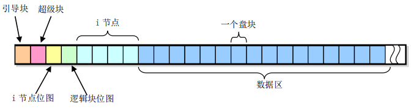
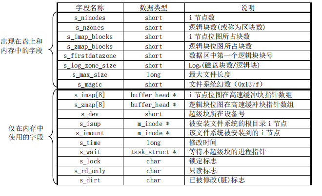
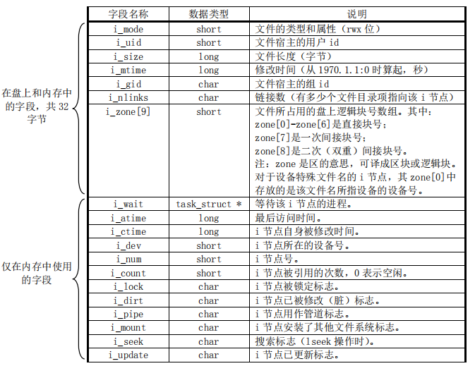
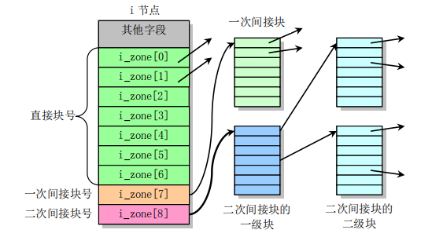
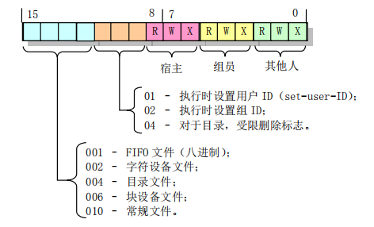

## MINIX文件系统

**MINIX文件系统**（英语：MINIX file system），一种[文件系统](https://zh.wikipedia.org/wiki/檔案系統)，是[MINIX](https://zh.wikipedia.org/wiki/MINIX)[操作系统](https://zh.wikipedia.org/wiki/作業系統)中的原生文件系统，由[安德鲁·斯图尔特·塔能鲍姆](https://zh.wikipedia.org/wiki/安德鲁·斯图尔特·塔能鲍姆)于1980年代创作，于1987年伴随着Minix 1.0版一同释出。它源自于[Unix文件系统](https://zh.wikipedia.org/wiki/Unix文件系统)的基本结构，为了使源代码简洁，以方便教学，许多复杂的功能都没有在这个文件系统中实作，但这也使得它的效能与功能受限。[林纳斯·托瓦兹](https://zh.wikipedia.org/wiki/林纳斯·托瓦兹)在1991年创作[Linux核心](https://zh.wikipedia.org/wiki/Linux核心)时，最初采用了Minix文件系统，直到1992年4月，才以[延伸文件系统](https://zh.wikipedia.org/wiki/延伸檔案系統)来取代它。


## 基本概念

minix 文件系统由 **6 个部分组成**：引导块、超级块、i 节点位图块、逻辑块位图块、i 节点块、数据区。对于一个普通的磁盘块设备来说，这 6 个部分的分布如下（以 360KB 的磁盘为例）：




图中一个格子表示一个盘块，**每个盘块大小 1KB**，故一共有 360 个盘块，现对这 6 个部分分开描述


### 引导块

​	引导块是总是存储在第一个块。在系统启动时，它包含了引导加载程序的加载和运行一个操作系统。但一个系统中并非所有盘设备都用于作为引导设备，对于不用引导的盘片，这一块可以不含代码，但必须留出这一块的空间以保证 minix 文件系统格式的统一。如果内核映像文件放在文件系统中，那么就可以在引导块内存放引导程序，由它来获取、加载文件系统中的内核映像文件

### 超级块

第二个块是超块，它是存储有关文件系统，即允许操作系统来定位和理解其它文件系统结构数据 ,`super_block`



其中有个新概念叫**逻辑块**，其实在 Minix 1.0 中，逻辑块与盘块没有区别，一个逻辑块也是 1KB，但在高版本的文件系统中，一个逻辑块通常表示物理上相邻的 x 个盘块（x 是 2 的幂次）。在超级块中，记录一个逻辑块对应多少盘块的字段是 s_log_zone_size。

由上图可知，逻辑块位图最多使用 8 块缓冲块（s_zmap[8]），每个缓冲块代表 8192（1K * 8bits）个盘块，因此 Minix 1.0 文件系统最大支持 64MB 的块设备。

```c
// fs.h
#define NR_SUPER 8
...
extern struct super_block super_block[NR_SUPER];
```

在 Linux 0.11 中，被加载的文件系统超级块保存在数组 super_block 中（定义在 fs/super.c），该数组有 8 项，表明 Linux 0.11 系统中最多可以同时加载 8 个文件系统。


### i 节点块与数据区

i 节点是个结构体，用于存放设备上**每个文件和目录名**的相关信息，实际上文件系统中不是以直观的 [文件名/目录名] 的形式来组织文件层级关系，**每个文件和目录都有自己对应的 i 节点**，该结构体保存了文件和目录的一些信息，其中就包含了 [文件内容/目录块] 的**索引信息**。即**文件里的实际内容**及**一个目录下有哪些文件**保存在**数据区**的盘块里，而 [文件/目录名] 对应的 i 节点中有字段指向数据区中实际存储数据的盘块，从而可以获取到其数据

继续以 360 KB 磁盘为例，该文件系统中有 120 个 i 节点（创建文件系统时自动初始化的），每个 i 节点结构体大小是 32 个字节，所以一共需要 32 * 120 = 3840 个字节的连续空间来存储这 120 个 i 节点，舍入一下就是 4 个盘块。对照第一张图，在数据区前确实有 4 个连续的盘块作为 i 节点块





其中 i_zone[9] 数组就是用来存放文件所占用的数据区中的逻辑块号。前 7 项是直接块号，即前 7 项中的每一项指向一个数据区中的盘块；第 8 项是一次间接块号，即该项指向数据区中的一个盘块（1KB），而该盘块中的每两个字节（注意 i_zone 定义的类型为 short 数组）又指向一个数据区中的盘块，所以 i_zone 中的第 8 项实际可以获取到数据区中的 512（1024 / 2）个盘块；第 9 项是二次间接块号，与第 8 项稍有不同的是经一次间接后找到的盘块其又指向 512 个盘块，故实际上第 9 项可以获取到 512 * 512 个盘块。所以对于 Minix 1.0 文件系统来说，一个文件最大长度为 （7 + 512 + 512 * 512）* 1KB = 262663KB，示意图如下：



i_mode 字段也值得考究，它是一个 16 位的字段，用于保存文件的类型和访问权限属性（如 “ls -l” 命令查看到的 “drw-r–r–”），其每位的含义如下：




由此可以得知，其实我们常区分的文件和目录在宏观上并没有多少差别，它们都是文件，只不过是不同类型的文件罢了


### i 节点位图块与逻辑块位图块

i 节点位图用于说明对应的 i 节点是否被使用，1 个比特位代表一个 i 节点，这也就能解释为什么一个盘块可以表示 8192 个 i 节点的使用情况。逻辑位图块与之相似，每个比特位代表对应数据区中盘块的使用情况。这两个块有个共同点，就是它们的最低比特位（位 0）都闲置不用（置为 1）

对于 360 KB 磁盘中的文件系统来说，120 个 i 节点对应 121 位比特位（包含闲置的最低比特位），故一个 i 节点位图块就能搞定。同时，360 个盘块除开非数据区的盘块外一共有 352 个，对应 353 位比特位（同理），因此一个逻辑块位图块也能搞定

## 文件系统目录项结构

通过上面的描述我们可以得知，要想获取一个文件的内容，比如我想获取 /usr/root/hello.c 的内容，顺序查询 hello.c 对应 i 节点的 i_zone 数组即可。那么问题来了，该文件对应的 i 节点地址又从何知晓呢？

实际上，存在一种数据结构叫做目录项，其定义在 include/linux/fs.h：

```c
// Line 36
#define NAME_LEN 14
#define ROOT_INO 1

// Line 157
struct dir_entry {
	unsigned short inode;
	char name[NAME_LEN];
};
```


一个目录项包含最大长度为 14 字节的文件名和 i 节点号，故一个目录项长度为 16 字节，一个盘块最多可以存放 64（1024 / 16）个目录项。而且**根目录（/）的 i 节点号是确定的**，为 1。所以如果我想获取 /usr/root/hello.c 的内容，首先就去到 1 号 i 节点（根目录），该 i 节点的 i_zone[0] 中保存了**根目录下**所有文件的目录项（如 bin、dev、root 等目录文件的目录项）。通过 usr 这个文件名就可以在目录项中找到其对应的 i 节点号，进而找到 /usr 对应的 i 节点，该 i 节点的 i_zone[0] 中也保存了 /usr 目录下所有文件的目录项，通过文件名 root 找到 /usr/root 对应的 i 节点，以此类推便可找到 /usr/root/hello.c 对应的 i 节点，文件名就是这样一层层地被解析到对应 i 节点的

> 硬链接与符号链接

现在就可以来说说 i 节点中的 i_nlinks 字段了，有多少个文件目录项指向该 i 节点，i_nlinks 的值就是多少，其还有一个名称叫做文件的**硬链接数**。由于目录项的存在，导致多个不同文件名可以同时表示一个文件（只要最后的 inode 值相同），只有当 i 节点的硬链接数为 0 时内核才会真正从磁盘上删除该文件的数据

想必在平时 “ls -a” 时会发现每个目录下都有两个特殊的目录文件 ‘.’ 和 ‘..’，’.’ 对应的目录项给出当前目录的 i 节点号，’..’ 对应的目录项给出了当前目录的父级目录的 i 节点号。所以对于一个目录（比如 /usr/bin）来说，其硬链接数最少为 2，一个是父级目录 /usr 的目录项中有一项指向 /usr/bin 的 i 节点，另一个则是 /usr/bin 目录下的 ‘.’。如果 /usr/bin 目录下还有子目录，则这些子目录的 ‘..’ 也会指向 /usr/bin 的 i 节点，故一个目录的硬链接数等于 **2 + 子目录数**

另一个与之对应的名词是**符号链接**（ln -s），与硬链接不同，符号链接文件的数据块中存放的是作为**链接对象的路径名字符串**，访问符号链接文件时，内核会读取文件中的路径，然后去访问指定的文件，所以符号链接并不会增加目标文件的硬链接数

硬链接与符号链接有一个很关键的区别，那就是因为目录项中的 i 节点号仅能用于当前文件系统，故**硬链接不能跨越文件系统**。而符号链接则因其存储的是链接对象的路径名，故其可以不局限在一个文件系统中

## 高速缓冲区

块设备的访问速度与内存的访问速度相差甚远，每次文件系统在访问块设备中数据时缓慢的 I/O 操作会对系统性能产生巨大的影响。为了提高系统性能，内核在内存中开辟了一个**高速数据缓冲区**，并将其划分为一个个**与盘块大小相等的缓冲块**来使用和管理，以期减少访问块设备的次数。

高速缓冲中存放着最近被使用过的各个块设备中的数据块，当需要从块设备中读取数据时，缓冲区管理程序会先到高速缓冲里找，如果找到了就直接拿来用，否则发出读块设备命令，将数据读到高速缓冲中。当需要把数据写到块设备中时，系统在高速缓冲中找一块空闲缓冲块对这些要写入的数据进行**临时存放**，直到进行设备数据同步时（如 sync 命令）才会真正将数据写到块设备中

之前在 main.c 源码阅读的文章中给出的内存分布图：


其中的高速缓冲就是这里提到的高速数据缓冲区


> https://zh.wikipedia.org/wiki/MINIX%E6%96%87%E4%BB%B6%E7%B3%BB%E7%BB%9F
