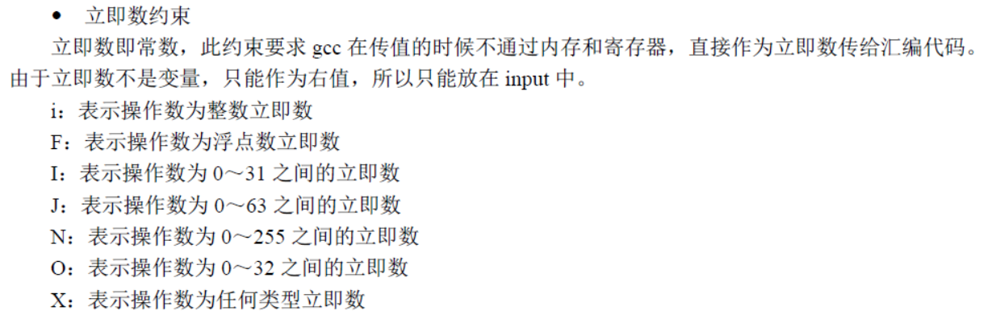
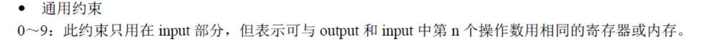

## 定义

fork函数先从当前任务表（task）里找到一个任务号（进程pid），如果可以找到，就会复制当前进程`current`结构体的数据(task_struct),然后复制进程页表项，将RW置位0，为以后写时复制做准备。子进程与父进程共享内存。然后处理信号。切换进程后，CPU会自动的加载每个 task_struct中的TSS数据，并且保存前一个进程的CPU状态到TSS中。进程fork后，就等着调度了。注意，子进程在初始化的时候往eax寄存器中存进去了0，eax用于函数返回值。也就是说子进程会返回0，而父进程会返回自己的pid。

`````c
if (!fork()) {		/* we count on this going ok */
	 init();        // 在新建的子进程(任务1)中执行。
 }
`````

*init/main.c*

```c++
static inline _syscall0(int,fork)
```

*include/unistd.h*

````apl
#define __NR_fork	2

#define _syscall0(type,name) \
type name(void) \
{ \
long __res; \
__asm__ volatile ("int $0x80" \
	: "=a" (__res) \
	: "0" (__NR_##name)); \
if (__res >= 0) \
	return (type) __res; \
errno = -__res; \
return -1; \
}

````

宏展开后就是

`````c
int fork(void) 
{ 
long __res; 
__asm__ volatile ("int $0x80" : "=a" (__res) : "0" (__NR_fork));
if (__res >= 0) 
	return (type) __res; 
errno = -__res; 
return -1; 
}
`````

- volatile 是可选的。如果用了它，则是向GCC 声明不允许对该内联汇编优化，否则当 使用了优化选项(-O)进行编译时，GCC 将会根据自己的判断决定是否将这个内联汇编表达式中的指令优化掉。
- int 0x80 是系统调用，"a"表示使用eax寄存器，"="表示只写，类似 _res = eax
- 0～9：此约束只用在 input 部分，但表示可与 output 和 input 中第 n 个操作数用相同的寄存器或内存  ，`"0" (__NR_fork))`表示表示沿用上一次的约束，就是把`__NR_fork`的值2放到`eax`寄存器中。

## 0x80中断

在sched_init执行时调用了set_system_gate(0x80,&system_call);

```c
sys_fork:
	call find_empty_process
	testl %eax,%eax             # 在eax中返回进程号pid。若返回负数则退出。
	js 1f
	push %gs
	pushl %esi
	pushl %edi
	pushl %ebp
	pushl %eax
	call copy_process
	addl $20,%esp               # 丢弃这里所有压栈内容。
1:	ret
```


```c
// 为新进程取得不重复的进程号last_pid.函数返回在任务数组中的任务号(数组项)。
int find_empty_process(void)
{
	int i;

    // 首先获取新的进程号。如果last_pid增1后超出进程号的整数表示范围，则重新从1开始
    // 使用pid号。然后在任务数组中搜索刚设置的pid号是否已经被任何任务使用。如果是则
    // 跳转到函数开始出重新获得一个pid号。接着在任务数组中为新任务寻找一个空闲项，并
    // 返回项号。last_pid是一个全局变量，不用返回。如果此时任务数组中64个项已经被全部
    // 占用，则返回出错码。
	repeat:
		if ((++last_pid)<0) last_pid=1;
		for(i=0 ; i<NR_TASKS ; i++)
			if (task[i] && task[i]->pid == last_pid) goto repeat;
	for(i=1 ; i<NR_TASKS ; i++)         // 任务0项被排除在外
		if (!task[i])
			return i;
	return -EAGAIN;
}

```

```c
// 复制进程
// 该函数的参数进入系统调用中断处理过程开始，直到调用本系统调用处理过程
// 和调用本函数前时逐步压入栈的各寄存器的值。这些在system_call.s程序中
// 逐步压入栈的值(参数)包括：
// 1. CPU执行中断指令压入的用户栈地址ss和esp,标志寄存器eflags和返回地址cs和eip;
// 2. 在刚进入system_call时压入栈的段寄存器ds、es、fs和edx、ecx、ebx；
// 3. 调用sys_call_table中sys_fork函数时压入栈的返回地址(用参数none表示)；
// 4. 在调用copy_process()分配任务数组项号。
int copy_process(int nr,long ebp,long edi,long esi,long gs,long none,
		long ebx,long ecx,long edx,
		long fs,long es,long ds,
		long eip,long cs,long eflags,long esp,long ss)
{
	struct task_struct *p;
	int i;
	struct file *f;

    // 首先为新任务数据结构分配内存。如果内存分配出错，则返回出错码并退出。
    // 然后将新任务结构指针放入任务数组的nr项中。其中nr为任务号，由前面
    // find_empty_process()返回。接着把当前进程任务结构内容复制到刚申请到
    // 的内存页面p开始处。
    // 返回的是真实的物理地址
	p = (struct task_struct *) get_free_page();
	if (!p)
		return -EAGAIN;
	task[nr] = p;
	*p = *current;	/* NOTE! this doesn't copy the supervisor stack */
    // 随后对复制来的进程结构内容进行一些修改，作为新进程的任务结构。先将
    // 进程的状态置为不可中断等待状态，以防止内核调度其执行。然后设置新进程
    // 的进程号pid和父进程号father，并初始化进程运行时间片值等于其priority值
    // 接着复位新进程的信号位图、报警定时值、会话(session)领导标志leader、进程
    // 及其子进程在内核和用户态运行时间统计值，还设置进程开始运行的系统时间start_time.
	p->state = TASK_UNINTERRUPTIBLE;
	p->pid = last_pid;              // 新进程号。也由find_empty_process()得到。
	p->father = current->pid;       // 设置父进程
	p->counter = p->priority;       // 运行时间片值
	p->signal = 0;                  // 信号位图置0
	p->alarm = 0;                   // 报警定时值(滴答数)
	p->leader = 0;		/* process leadership doesn't inherit */
	p->utime = p->stime = 0;        // 用户态时间和和心态运行时间
	p->cutime = p->cstime = 0;      // 子进程用户态和和心态运行时间
	p->start_time = jiffies;        // 进程开始运行时间(当前时间滴答数)
    // 再修改任务状态段TSS数据，由于系统给任务结构p分配了1页新内存，所以(PAGE_SIZE+
    // (long)p)让esp0正好指向该页顶端。ss0:esp0用作程序在内核态执行时的栈。另外，
    // 每个任务在GDT表中都有两个段描述符，一个是任务的TSS段描述符，另一个是任务的LDT
    // 表描述符。下面语句就是把GDT中本任务LDT段描述符和选择符保存在本任务的TSS段中。
    // 当CPU执行切换任务时，会自动从TSS中把LDT段描述符的选择符加载到ldtr寄存器中。
	p->tss.back_link = 0;
	p->tss.esp0 = PAGE_SIZE + (long) p;     // 任务内核态栈指针。
	p->tss.ss0 = 0x10;                      // 内核态栈的段选择符(与内核数据段相同)
	p->tss.eip = eip;                       // 指令代码指针
	p->tss.eflags = eflags;                 // 标志寄存器
	p->tss.eax = 0;                         // 这是当fork()返回时新进程会返回0的原因所在
	p->tss.ecx = ecx;
	p->tss.edx = edx;
	p->tss.ebx = ebx;
	p->tss.esp = esp;
	p->tss.ebp = ebp;
	p->tss.esi = esi;
	p->tss.edi = edi;
	p->tss.es = es & 0xffff;                // 段寄存器仅16位有效
	p->tss.cs = cs & 0xffff;
	p->tss.ss = ss & 0xffff;
	p->tss.ds = ds & 0xffff;
	p->tss.fs = fs & 0xffff;
	p->tss.gs = gs & 0xffff;
	p->tss.ldt = _LDT(nr);                  // 任务局部表描述符的选择符(LDT描述符在GDT中)
	p->tss.trace_bitmap = 0x80000000;       // 高16位有效
    // 如果当前任务使用了协处理器，就保存其上下文。汇编指令clts用于清除控制寄存器CRO中
    // 的任务已交换(TS)标志。每当发生任务切换，CPU都会设置该标志。该标志用于管理数学协
    // 处理器：如果该标志置位，那么每个ESC指令都会被捕获(异常7)。如果协处理器存在标志MP
    // 也同时置位的话，那么WAIT指令也会捕获。因此，如果任务切换发生在一个ESC指令开始执行
    // 之后，则协处理器中的内容就可能需要在执行新的ESC指令之前保存起来。捕获处理句柄会
    // 保存协处理器的内容并复位TS标志。指令fnsave用于把协处理器的所有状态保存到目的操作数
    // 指定的内存区域中。
	if (last_task_used_math == current)
		__asm__("clts ; fnsave %0"::"m" (p->tss.i387));
    // 接下来复制进程页表。即在线性地址空间中设置新任务代码段和数据段描述符中的基址和限长，
    // 并复制页表。如果出错(返回值不是0)，则复位任务数组中相应项并释放为该新任务分配的用于
    // 任务结构的内存页。
	if (copy_mem(nr,p)) {
		task[nr] = NULL;
		free_page((long) p);
		return -EAGAIN;
	}
    // 如果父进程中有文件是打开的，则将对应文件的打开次数增1，因为这里创建的子进程会与父
    // 进程共享这些打开的文件。将当前进程(父进程)的pwd，root和executable引用次数均增1.
    // 与上面同样的道理，子进程也引用了这些i节点。
	for (i=0; i<NR_OPEN;i++)
		if ((f=p->filp[i]))
			f->f_count++;
	if (current->pwd)
		current->pwd->i_count++;
	if (current->root)
		current->root->i_count++;
	if (current->executable)
		current->executable->i_count++;
    // 随后GDT表中设置新任务TSS段和LDT段描述符项。这两个段的限长均被设置成104字节。
    // set_tss_desc()和set_ldt_desc()在system.h中定义。"gdt+(nr<<1)+FIRST_TSS_ENTRY"是
    // 任务nr的TSS描述符项在全局表中的地址。因为每个任务占用GDT表中2项，因此上式中
    // 要包括'(nr<<1)'.程序然后把新进程设置成就绪态。另外在任务切换时，任务寄存器tr由
    // CPU自动加载。最后返回新进程号。
	set_tss_desc(gdt+(nr<<1)+FIRST_TSS_ENTRY,&(p->tss));
	set_ldt_desc(gdt+(nr<<1)+FIRST_LDT_ENTRY,&(p->ldt));
	p->state = TASK_RUNNING;	/* do this last, just in case */
	return last_pid;
}
```


```c
#define TASK_RUNNING		 0
#define TASK_INTERRUPTIBLE	 1
#define TASK_UNINTERRUPTIBLE 2
#define TASK_ZOMBIE		     3
#define TASK_STOPPED		 4
```


```c
// 在主内存区中取空闲屋里页面。如果已经没有可用物理内存页面，则返回0.
// 输入：%1(ax=0) - 0; %2(LOW_MEM)内存字节位图管理的其实位置；%3(cx=PAGING_PAGES);
// %4(edi=mem_map+PAGING_PAGES-1).
// 输出：返回%0(ax=物理内存页面起始地址)。
// 上面%4寄存器实际指向mem_map[]内存字节位图的最后一个字节。本函数从位图末端开
// 始向前扫描所有页面标志（页面总数PAGING_PAGE），若有页面空闲（内存位图字节为
// 0）则返回页面地址。注意！本函数只是指出在主内存区的一页空闲物理内存页面，但
// 并没有映射到某个进程的地址空间中去。后面的put_page()函数即用于把指定页面映射
// 到某个进程地址空间中。当然对于内核使用本函数并不需要再使用put_page()进行映射，
// 因为内核代码和数据空间（16MB）已经对等地映射到物理地址空间。
unsigned long get_free_page(void)
{
register unsigned long __res asm("ax");

__asm__("std ; repne ; scasb\n\t"   // 置方向位，al(0)与对应每个页面的(di)内容比较
	"jne 1f\n\t"                    // 如果没有等于0的字节，则跳转结束(返回0).
	"movb $1,1(%%edi)\n\t"          // 1 => [1+edi],将对应页面内存映像bit位置1.
	"sall $12,%%ecx\n\t"            // 页面数*4k = 相对页面其实地址
	"addl %2,%%ecx\n\t"             // 再加上低端内存地址，得页面实际物理起始地址
	"movl %%ecx,%%edx\n\t"          // 将页面实际其实地址->edx寄存器。
	"movl $1024,%%ecx\n\t"          // 寄存器ecx置计数值1024
	"leal 4092(%%edx),%%edi\n\t"    // 将4092+edx的位置->dei（该页面的末端地址）
	"rep ; stosl\n\t"               // 将edi所指内存清零(反方向，即将该页面清零)
	"movl %%edx,%%eax\n"            // 将页面起始地址->eax（返回值）
	"1:"
	:"=a" (__res)
	:"0" (0),"i" (LOW_MEM),"c" (PAGING_PAGES),
	"D" (mem_map+PAGING_PAGES-1)
	);
return __res;           // 返回空闲物理页面地址(若无空闲页面则返回0).
}
```

`cld`指令将DF标志清零，`std`指令将DF标志置1,标志寄存器的第10位是方向标志`DF（Direction Flag）`，`DF=0`表示正向传送(往高地址去)，`DF=1`表示反向传送(往低地址去)。

`scasb`指令是比较`eax`或者`ax`或者`al`中的值与`edi`或者`di`中的值，每比较一次，`edi`或者`di`自动变化，指向上一个或者下一个单元，这里使用`std`就是`edi`减1

`repne`是repeat not equal，不相等就重复执行，`ecx`里保存着循环的次数

`repne scasb` 就是查找`edi`中与`eax`中的值是否相等，如果找到，`ZF`=1则退出指令的执行；如果没找到，已全部找遍则退出


` stosl` 指令相当于将` eax` 中的值保存到` ES:EDI` 指向的地址中，若设置了标志寄存器EFLAGS中的方向位置位(即在` stosl`指令前使用`STD`指令)则EDI自减4，否则(使用`CLD`指令)EDI自增4








## 复制页表

```c
// 复制内存页表
// 参数nr是新任务号：p是新任务数据结构指针。该函数为新任务在线性地址空间中
// 设置代码段和数据段基址、限长，并复制页表。由于Linux系统采用了写时复制
// (copy on write)技术，因此这里仅为新进程设置自己的页目录表项和页表项，而
// 没有实际为新进程分配物理内存页面。此时新进程与其父进程共享所有内存页面。
// 操作成功返回0，否则返回出错号。
int copy_mem(int nr,struct task_struct * p)
{
	unsigned long old_data_base,new_data_base,data_limit;
	unsigned long old_code_base,new_code_base,code_limit;

    // 首先取当前进程局部描述符表中代表中代码段描述符和数据段描述符项中的
    // 的段限长(字节数)。0x0f是代码段选择符：0x17是数据段选择符。然后取
    // 当前进程代码段和数据段在线性地址空间中的基地址。由于Linux-0.11内核
    // 还不支持代码和数据段分立的情况，因此这里需要检查代码段和数据段基址
    // 和限长是否都分别相同。否则内核显示出错信息，并停止运行。
	code_limit=get_limit(0x0f);  // 0000 1111 表示RPL=3 TI=1（在LDT中），索引1，就是代码段
	data_limit=get_limit(0x17);  // 0001 0111 表示RPL=3 TI=1（在LDT中），索引2，就是数据段
	old_code_base = get_base(current->ldt[1]);
	old_data_base = get_base(current->ldt[2]);
	if (old_data_base != old_code_base)
		panic("We don't support separate I&D");
	if (data_limit < code_limit)
		panic("Bad data_limit");
    // 然后设置创建中的新进程在线性地址空间中的基地址等于(64MB * 其任务号)，
    // 并用该值设置新进程局部描述符表中段描述符中的基地址。接着设置新进程
    // 的页目录表项和页表项，即复制当前进程(父进程)的页目录表项和页表项。
    // 此时子进程共享父进程的内存页面。正常情况下copy_page_tables()返回0，
    // 否则表示出错，则释放刚申请的页表项。
	new_data_base = new_code_base = nr * 0x4000000;
	p->start_code = new_code_base;
	set_base(p->ldt[1],new_code_base);
	set_base(p->ldt[2],new_data_base);
    
    // 设置新进程的页目录表项和页表项。即把新进程的线性地址内存页对应到实际物理地址内存页面上
	if (copy_page_tables(old_data_base,new_data_base,data_limit)) {
		printk("free_page_tables: from copy_mem\n");
		free_page_tables(new_data_base,data_limit);
		return -ENOMEM;
	}
	return 0;
}
```


指令lsl 是Load Segment Limit 缩写。它从指定段描述符中取出分散的限长比特位拼成完整的段限长值放入指定寄存器中。所得的段限长是实际字节数减1，因此这里还需要加1 后才返回。

```java
#define get_limit(segment) ({ \
unsigned long __limit; \
__asm__("lsll %1,%0 \n\t incl %0":"=r" (__limit):"r" (segment)); \
__limit;})
```


```java
static inline unsigned long _get_base(char * addr)
{
         unsigned long __base;
         __asm__("movb %3,%%dh\n\t"
                 "movb %2,%%dl\n\t"
                 "shll $16,%%edx\n\t"
                 "movw %1,%%dx"
                 :"=&d" (__base)
                 :"m" (*((addr)+2)),
                  "m" (*((addr)+4)),
                  "m" (*((addr)+7)));
         return __base;
}

#define get_base(ldt) _get_base( ((char *)&(ldt)) )
```


由于Linux系统采用了写时复制(copy on write)技术，`copy_mem`仅为新进程设置自己的页目录表项和页表项，而没有实际为新进程分配物理内存页面。此时新进程与其父进程共享所有内存页面。 系统设置全局描述符表GDT中的分段描述符项数最大为256，其中2项空闲，2项系统使用，每个进程使用两项。因此，此时系统可以最多容纳(256-4)/2 +1 =127个任务，并且虚拟地址范围是((256-4)/2)*64MB =4G。 4G正好与CPU的线性地址空间范围或物理地址空间范围相同，因此在0.11内核中比较容易混淆三种地址概念， 从Linux内核0.99版以后，对内存空间的使用方式发生了变化。每个进程可以单独享用整个4G的地址空间范围。


```c
// 复制页目录表项和页表项
// 复制指定线性地址和长度内存对应的页目录项和页表项，从而被复制的页目录和页表对
// 应的原物理内存页面区被两套页表映射而共享使用。复制时，需申请新页面来存放新页
// 表，原物理内存区将被共享。此后两个进程（父进程和其子进程）将共享内存区，直到
// 有一个进程执行谢操作时，内核才会为写操作进程分配新的内存页(写时复制机制)。
// 参数from、to是线性地址，size是需要复制（共享）的内存长度，单位是byte.
int copy_page_tables(unsigned long from,unsigned long to,long size)
{
	unsigned long * from_page_table;
	unsigned long * to_page_table;
	unsigned long this_page;
	unsigned long * from_dir, * to_dir;
	unsigned long nr;

    // 首先检测参数给出的原地址from和目的地址to的有效性。原地址和目的地址都需要
    // 在4Mb内存边界地址上。否则出错死机。作这样的要求是因为一个页表的1024项可
    // 管理4Mb内存。源地址from和目的地址to只有满足这个要求才能保证从一个页表的
    // 第一项开始复制页表项，并且新页表的最初所有项都是有效的。然后取得源地址和
    // 目的地址的其实目录项指针(from_dir 和 to_dir).再根据参数给出的长度size计
    // 算要复制的内存块占用的页表数(即目录项数)。
	if ((from&0x3fffff) || (to&0x3fffff))
		panic("copy_page_tables called with wrong alignment");
	from_dir = (unsigned long *) ((from>>20) & 0xffc); /* _pg_dir = 0 */
	to_dir = (unsigned long *) ((to>>20) & 0xffc);
    
    // 一个页目录项管理1024个页表项，一共管理1024 * 4KB = 4MB的内存空间
    // size 就是需要多少个页目录项
	size = ((unsigned) (size+0x3fffff)) >> 22;
    // 在得到了源起始目录项指针from_dir和目的起始目录项指针to_dir以及需要复制的
    // 页表个数size后，下面开始对每个页目录项依次申请1页内存来保存对应的页表，并
    // 且开始页表项复制操作。如果目的目录指定的页表已经存在(P=1)，则出错死机。
    // 如果源目录项无效，即指定的页表不存在(P=1),则继续循环处理下一个页目录项。
	for( ; size-->0 ; from_dir++,to_dir++) {
		if (1 & *to_dir)
			panic("copy_page_tables: already exist");
		if (!(1 & *from_dir))
			continue;
        // 在验证了当前源目录项和目的项正常之后，我们取源目录项中页表地址
        // from_page_table。为了保存目的目录项对应的页表，需要在住内存区中申请1
        // 页空闲内存页。如果取空闲页面函数get_free_page()返回0，则说明没有申请
        // 到空闲内存页面，可能是内存不够。于是返回-1值退出。
		from_page_table = (unsigned long *) (0xfffff000 & *from_dir);
		if (!(to_page_table = (unsigned long *) get_free_page()))
			return -1;	/* Out of memory, see freeing */
        // 否则我们设置目的目录项信息，把最后3位置位，即当前目录的目录项 | 7，
        // 表示对应页表映射的内存页面是用户级的，并且可读写、存在(Usr,R/W,Present).
        // (如果U/S位是0，则R/W就没有作用。如果U/S位是1，而R/W是0，那么运行在用
        // 户层的代码就只能读页面。如果U/S和R/W都置位，则就有读写的权限)。然后
        // 针对当前处理的页目录项对应的页表，设置需要复制的页面项数。如果是在内
        // 核空间，则仅需复制头160页对应的页表项(nr=160),对应于开始640KB物理内存
        // 否则需要复制一个页表中的所有1024个页表项(nr=1024)，可映射4MB物理内存。
		*to_dir = ((unsigned long) to_page_table) | 7;
		nr = (from==0)?0xA0:1024;
        // 此时对于当前页表，开始循环复制指定的nr个内存页面表项。先取出源页表的
        // 内容，如果当前源页表没有使用，则不用复制该表项，继续处理下一项。否则
        // 复位表项中R/W标志(位1置0)，即让页表对应的内存页面只读。然后将页表项复制
        // 到目录页表中。
		for ( ; nr-- > 0 ; from_page_table++,to_page_table++) {
			this_page = *from_page_table;
            
            // 如果当前源页面没有使用，则不用复制
			if (!(1 & this_page))
				continue;
            // 复位页表项中R/W 标志(置0)。(如果U/S 位是0，则R/W 就没有作用。如果U/S 是1，而R/W 是0
            // 那么运行在用户层的代码就只能读页面。如果U/S 和R/W 都置位，则就有写的权限。
			this_page &= ~2;
			*to_page_table = this_page;
            // 如果该页表所指物理页面的地址在1MB以上，则需要设置内存页面映射数
            // 组mem_map[]，于是计算页面号，并以它为索引在页面映射数组相应项中
            // 增加引用次数。而对于位于1MB以下的页面，说明是内核页面，因此不需
            // 要对mem_map[]进行设置。因为mem_map[]仅用于管理主内存区中的页面使
            // 用情况。因此对于内核移动到任务0中并且调用fork()创建任务1时(用于
            // 运行init())，由于此时复制的页面还仍然都在内核代码区域，因此以下
            // 判断中的语句不会执行，任务0的页面仍然可以随时读写。只有当调用fork()
            // 的父进程代码处于主内存区(页面位置大于1MB)时才会执行。这种情况需要
            // 在进程调用execve()，并装载执行了新程序代码时才会出现。
            // *from_page_table = this_page; 这句是令源页表项所指内存页也为只读。
            // 因为现在开始有两个进程公用内存区了。若其中1个进程需要进行写操作，
            // 则可以通过页异常写保护处理为执行写操作的进程匹配1页新空闲页面，也
            // 即进行写时复制(copy on write)操作。
			if (this_page > LOW_MEM) {
				*from_page_table = this_page;
				this_page -= LOW_MEM;
				this_page >>= 12;
				mem_map[this_page]++;
			}
		}
	}
	invalidate();
	return 0;
}
```


- P，Present，意为存在位。若为1 表示该页存在于物理内存中，若为0 表示该表不在物理内存中。操作系统的页式虚拟内存管理便是通过P 位和相应的pagefault 异常来实现的
- RW，Read/Write，意为读写位。若为1 表示可读可写，若为0 表示可读不可写
- US，User/Supervisor，意为普通用户/超级用户位。若为1 时，表示处于User 级，任意级别（0、1、2、3）特权的程序都可以访问该页。若为0，表示处于Supervisor 级，特权级别为3 的程序不允许访问该页，该页只允许特权级别为0、1、2 的程序可以访问
- PWT，Page-level Write-Through，意为页级通写位，也称页级写透位。若为1 表示此项采用通写方式，表示该页不仅是普通内存，还是高速缓存
- PCD，Page-level Cache Disable，意为页级高速缓存禁止位。若为1 表示该页启用高速缓存，为0 表示禁止将该页缓存。
- A，Accessed，意为访问位。若为1 表示该页被CPU 访问过啦，所以该位是由CPU 设置的。
- D，Dirty，意为脏页位。当CPU 对一个页面执行写操作时，就会设置对应页表项的D 位为1。此项仅针对页表项有效，并不会修改页目录项中的D 位

