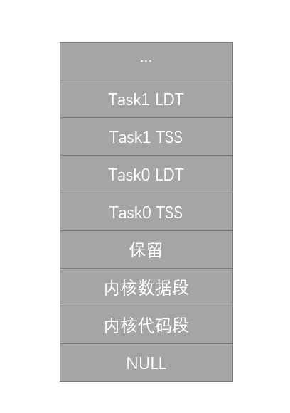
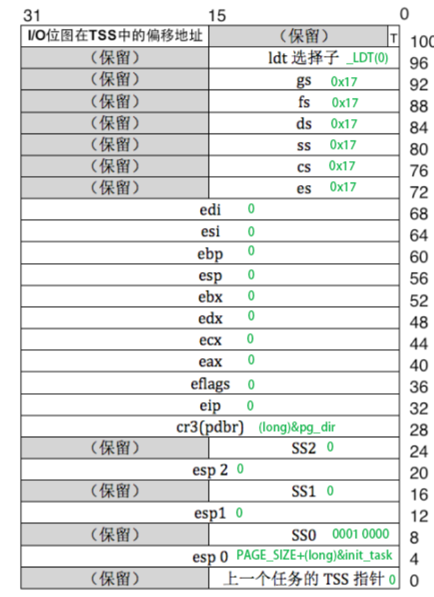
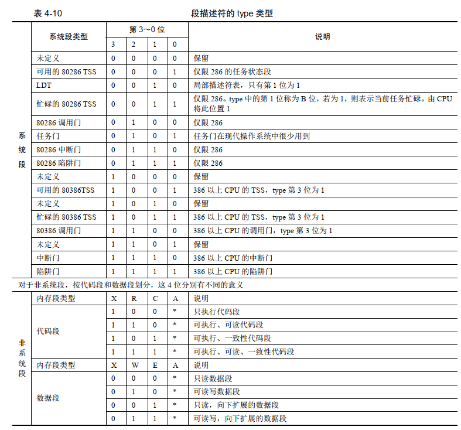

## 任务

一个任务（进程）就是一个task_struct结构体


````c++
struct tss_struct {
	long	back_link;	/* 16 high bits zero */
	long	esp0;
	long	ss0;		/* 16 high bits zero */
	long	esp1;
	long	ss1;		/* 16 high bits zero */
	long	esp2;
	long	ss2;		/* 16 high bits zero */
	long	cr3;
	long	eip;
	long	eflags;
	long	eax,ecx,edx,ebx;
	long	esp;
	long	ebp;
	long	esi;
	long	edi;
	long	es;		/* 16 high bits zero */
	long	cs;		/* 16 high bits zero */
	long	ss;		/* 16 high bits zero */
	long	ds;		/* 16 high bits zero */
	long	fs;		/* 16 high bits zero */
	long	gs;		/* 16 high bits zero */
	long	ldt;		/* 16 high bits zero */
	long	trace_bitmap;	/* bits: trace 0, bitmap 16-31 */
	struct i387_struct i387;
};

struct task_struct {
/* these are hardcoded - don't touch */
	long state;	/* -1 unrunnable, 0 runnable, >0 stopped */
	long counter;
	long priority;
	long signal;
	struct sigaction sigaction[32];
	long blocked;	/* bitmap of masked signals */
/* various fields */
	int exit_code;
	unsigned long start_code,end_code,end_data,brk,start_stack;
	long pid,father,pgrp,session,leader;
	unsigned short uid,euid,suid;
	unsigned short gid,egid,sgid;
	long alarm;
	long utime,stime,cutime,cstime,start_time;
	unsigned short used_math;
/* file system info */
	int tty;		/* -1 if no tty, so it must be signed */
	unsigned short umask;
	struct m_inode * pwd;
	struct m_inode * root;
	struct m_inode * executable;
	unsigned long close_on_exec;
	struct file * filp[NR_OPEN];
/* ldt for this task 0 - zero 1 - cs 2 - ds&ss */
	struct desc_struct ldt[3];
/* tss for this task */
	struct tss_struct tss;
};


struct sigaction {
	void (*sa_handler)(int);
	sigset_t sa_mask;
	int sa_flags;
	void (*sa_restorer)(void);
};
````

- state 

  表示任务的状态，可以取的值 - 1表示不可运行；0表示正在运行；如果任务被阻塞，有的阻塞是可以被打断的，状态1就是这样的，2就是不可被中断的；如果父进程死了而没有杀死子进程，子进程就会变成僵尸进程，僵尸进程统一由init进程管理；4表示进程结束了。

  `````c
  #define TASK_RUNNING		0
  #define TASK_INTERRUPTIBLE	1
  #define TASK_UNINTERRUPTIBLE	2
  #define TASK_ZOMBIE		3
  #define TASK_STOPPED		4
  `````

- counter

  任务运行时间计数(递减)（滴答数），运行时间片。

- priority

  运行优先数。任务开始运行时 counter = priority，越大运行越长

- signal

  信号。是位图，每个比特位代表一种信号，信号值=位偏移值+1。

- sigaction

  信号执行属性结构，对应信号将要执行的操作和标志信息

- blocked

  进程信号屏蔽码（对应信号位图）

- exit_code

  任务执行停止的退出码，其父进程会取

- start_code

  代码段地址

- end_code

  代码长度（字节数）

- end_data

  代码长度 + 数据长度（字节数）

- brk

  总长度（字节数）

- start_stack

  堆栈段地址

- pid

  进程标识号(进程号)

- father

  父进程号

- pgrp

  父进程组号

- session

  会话号

- leader

  会话首领

- uid,euid,suid

  用户标识号（用户 id）、有效用户 id、保存的用户 id

- gid,egid,sgid

  组标识号（组 id）、有效组 id、保存的组 id

- alarm

  报警定时值（滴答数）

- utime,stime,cutime,cstime,start_time

  用户态运行时间（滴答数）、系统态运行时间（滴答数）、子进程用户态运行时间、子进程系统态运行时间、进程开始运行时刻

- used_math

  标志：是否使用了协处理器

- tty

  进程使用 tty 的子设备号。-1 表示没有使用

- umask

  文件创建属性屏蔽位

- pwd

  当前工作目录 i 节点结构  

- root

  根目录 i 节点结构  

- executable

  执行文件 i 节点结构  

- close_on_exec

  执行时关闭文件句柄位图标志  

- filp[NR_OPEN]

  进程打开的文件

- ldt

  本任务的局部表描述符。0-空，1-代码段 cs，2-数据和堆栈段 ds&ss  

- tss

  本进程的任务状态段信息结构  


````cassandra
#define INIT_TASK /
/* state etc */	{ 0,15,15, /                // 任务的状态TASK_RUNNING,运行时间片，优先级
/* signals */	0,{{},},0, /                // 信号，信号位图
/* ec,brk... */	0,0,0,0,0,0, /              // 
/* pid etc.. */	0,-1,0,0,0, /
/* uid etc */	0,0,0,0,0,0, /
/* alarm */	0,0,0,0,0,0, /
/* math */	0, /
/* fs info */	-1,0022,NULL,NULL,NULL,0, /
/* filp */	{NULL,}, /
	{ /
		{0,0}, /                       // 任务0的LDT的第一个为0
/* ldt */	{0x9f,0xc0fa00}, /         // 0000 0000 0000 0000 0000 0000 1001 1111    0000 0000 1100 0000 1111 1010 0000 0000 
		{0x9f,0xc0f200}, /             // 0000 0000 0000 0000 0000 0000 1001 1111    0000 0000 1100 0000 1111 0010 0000 0000
	}, /
/*tss*/	{0,PAGE_SIZE+(long)&init_task,0x10,0,0,0,0,(long)&pg_dir,/
	 0,0,0,0,0,0,0,0, /
	 0,0,0x17,0x17,0x17,0x17,0x17,0x17, /
	 _LDT(0),0x80000000, /
		{} /
	}, /
}

````


0000 0000 1100 0000     1111 1010 0000 0000

0000 0000 0000 0000     0000 0000 1001 1111

- G=1，所以段大小是0x9f * 4KB = 636个段，

- 基址为0

- DPL=3

- P=1

- S=1，S 为 0 表示系统段， S 为 1 表示非系统段， TYPE=1010，表示这是一个一致性代码段，并且还没有被CPU访问过

- D/B, 对于代码段来说，此位是 D 位， 若 D 为 0，表示指令中的有效地址和操作数是 16 位，指令有效地址用 IP 寄存器。若 D 为 1，表示指令中的有效地址及操作数是 32 位，指令有效地址用 EIP 寄存器。对于栈段来说，此位是 B 位，用来指定操作数大小，此操作数涉及到栈指针寄存器的选择及栈的地址上限。若 B 为 0，使用的是 sp 寄存器，也就是栈的起始地址是 16 位寄存器的最大寻址范围， 0xFFFF。若 B 为 1，使用的是 esp 寄存器，也就是栈的起始地址是 32 位寄存器的最大寻址范围0xFFFFFFFF。  

0000 0000 1100 0000      1111 0010 0000 0000

0000 0000 0000 0000      0000 0000 1001 1111

与上面不一样的就是TYPE，为 0010，表示可读写数据段


PAGE_SIZE+(long)&init_task 就是0特級权限時使用的esp0

```c
// 每个任务(进程)在内核态运行时都有自己的内核态堆栈。这里定义了任务的内核态堆栈结构。
// 定义任务联合(任务结构成员和stack字符数组成员)。因为一个任务的数据结构与其内核态堆栈
// 在同一内存页中，所以从堆栈段寄存器ss可以获得其数据端选择符。
union task_union {
	struct task_struct task;
	char stack[PAGE_SIZE];
};

static union task_union init_task = {INIT_TASK,};

// 计算在全局表中第n 个任务的TSS 描述符的索引号（选择符）
#define _TSS(n) ((((unsigned long) n)<<4)+(FIRST_TSS_ENTRY<<3))
// 计算在全局表中第n 个任务的LDT 描述符的索引号。
// FIRST_LDT_ENTRY 是任务0的LDT的索引值，每个描述符占据8字节，所以左移3位，因为LDT前面有一个TSS，所以n向左移动4位
#define _LDT(n) ((((unsigned long) n)<<4)+(FIRST_LDT_ENTRY<<3))

#define ltr(n) __asm__("ltr %%ax"::"a" (_TSS(n)))
#define lldt(n) __asm__("lldt %%ax"::"a" (_LDT(n)))

```







```c 

// 每个任务(进程)在内核态运行时都有自己的内核态堆栈。这里定义了任务的内核态堆栈结构。
// 定义任务联合(任务结构成员和stack字符数组成员)。因为一个任务的数据结构与其内核态堆栈
// 在同一内存页中，所以从堆栈段寄存器ss可以获得其数据端选择符。
union task_union {
	struct task_struct task;
	char stack[PAGE_SIZE];
};

static union task_union init_task = {INIT_TASK,};   // 定义初始任务的数据


。。。。
    
    

void sched_init(void)
{
	int i;
	struct desc_struct * p;                 // 描述符结构指针

    // Linux系统开发之初，内核不成熟。内核代码会被经常修改。Linus怕自己无意中修改了
    // 这些关键性的数据结构，造成与POSIX标准的不兼容。这里加入下面这个判断语句并无
    // 必要，纯粹是为了提醒自己以及其他修改内核代码的人。
	if (sizeof(struct sigaction) != 16)         // sigaction 是存放有关信号状态的结构
		panic("Struct sigaction MUST be 16 bytes");
    
    // 在全局描述符表中设置初始任务(任务0)的任务状态段描述符和局部数据表描述符。
    // FIRST_TSS_ENTRY和FIRST_LDT_ENTRY的值分别是4和5，定义在include/linux/sched.h
    // 中；gdt是一个描述符表数组(include/linux/head.h)，实际上对应程序head.s中
    // 全局描述符表基址（_gdt）.因此gtd+FIRST_TSS_ENTRY即为gdt[FIRST_TSS_ENTRY](即为gdt[4]),
    // 也即gdt数组第4项的地址。
	set_tss_desc(gdt+FIRST_TSS_ENTRY,&(init_task.task.tss));
	set_ldt_desc(gdt+FIRST_LDT_ENTRY,&(init_task.task.ldt));
    // 清任务数组和描述符表项(注意 i=1 开始，所以初始任务的描述符还在)。描述符项结构
    // 定义在文件include/linux/head.h中。
    // NR_TASKS = 64
    // 初始化其他任务，task0已经初始化好了，接下来清空剩下63个任务的内存空间
	p = gdt+2+FIRST_TSS_ENTRY;
	for(i=1;i<NR_TASKS;i++) {
		task[i] = NULL;
		p->a=p->b=0;
		p++;
		p->a=p->b=0;
		p++;
	}
    
/* Clear NT, so that we won't have troubles with that later on */
    // NT标志用于控制程序的递归调用(Nested Task)。当NT置位时，那么当前中断任务执行
    // iret指令时就会引起任务切换。NT指出TSS中的back_link字段是否有效。
	__asm__("pushfl ; andl $0xffffbfff,(%esp) ; popfl");   // 复位NT标志
    
    // 将任务0 的TSS 加载到任务寄存器tr
	ltr(0);
    
    // 将任务0局部描述符表加载到局部描述符表寄存器
	lldt(0);
    // 下面代码用于初始化8253定时器。通道0，选择工作方式3，二进制计数方式。通道0的
    // 输出引脚接在中断控制主芯片的IRQ0上，它每10毫秒发出一个IRQ0请求。LATCH是初始
    // 定时计数值。
	outb_p(0x36,0x43);		/* binary, mode 3, LSB/MSB, ch 0 */
	outb_p(LATCH & 0xff , 0x40);	/* LSB */
	outb(LATCH >> 8 , 0x40);	/* MSB */
    // 设置时钟中断处理程序句柄(设置时钟中断门)。修改中断控制器屏蔽码，允许时钟中断。
    // 然后设置系统调用中断门。这两个设置中断描述符表IDT中描述符在宏定义在文件
    // include/asm/system.h中。
	set_intr_gate(0x20,&timer_interrupt);
    
    // 修改中断控制器屏蔽码，允许时钟中断
	outb(inb_p(0x21)&~0x01,0x21);
    
    // 设置系统调用中断门
	set_system_gate(0x80,&system_call);
}
```

这里的gdt是head中的gdt

```c
gdt: .quad 0x0000000000000000	/* NULL descriptor */
	 .quad 0x00c09a0000000fff	/* 16Mb */
	 .quad 0x00c0920000000fff	/* 16Mb */
	 .quad 0x0000000000000000	/* TEMPORARY - don't use */
	 .fill 252,8,0			/* space for LDT's and TSS's etc */

```

`````apl
#define _set_tssldt_desc(n,addr,type) /
__asm__ ("movw $104,%1/n/t" /
	"movw %%ax,%2/n/t" /
	"rorl $16,%%eax/n/t" /
	"movb %%al,%3/n/t" /
	"movb $" type ",%4/n/t" /
	"movb $0x00,%5/n/t" /
	"movb %%ah,%6/n/t" /
	"rorl $16,%%eax" /
	::"a" (addr), "m" (*(n)), "m" (*(n+2)), "m" (*(n+4)), /
	 "m" (*(n+5)), "m" (*(n+6)), "m" (*(n+7)) /
	)

#define set_tss_desc(n,addr) _set_tssldt_desc(((char *) (n)),((int)(addr)),"0x89")
#define set_ldt_desc(n,addr) _set_tssldt_desc(((char *) (n)),((int)(addr)),"0x82")  
`````

- "a" (addr) 

   把addr的值存到eax中

- movw $104,%1 ：

  把tss描述符的长度写进描述符的0~15位

- movw %%ax,%2

  eax中存的是addr的32位地址，ax里就是addr的0~15bit 存到tss描述符的16~31位中

- rorl $16,%%eax

  eax向右移动16位，此时ax中就只有adrr的高16位地址了

- movb %%al,%3

  把addr的16~23bit的地址存到tss描述符的高32位地址的0~7bit位

- movb $" type ",%4

  把type的值存进去。这里的0x89不仅包含type，即1000 1001，P=1，DPL=0；0x82即1000 0010 ，P=1，DPL=0，type是0010表示的是LDT

- movb $0x00,%5

  limit 16~19位置0

- movb %%ah,%6

  把addr的24~32bit的 地址存到Base24~32bit中
  
- rorl $16,%%eax
  
  前面已经把eax右移16bit了，现在又右移16bit，意思就是把eax清0
  
  
  
  
  
  
  


## 任务


`````c++
struct task_struct {
/* these are hardcoded - don't touch */
	long state;	/* -1 unrunnable, 0 runnable, >0 stopped */
	long counter;
	long priority;
	long signal;
	struct sigaction sigaction[32];
	long blocked;	/* bitmap of masked signals */
/* various fields */
	int exit_code;
	unsigned long start_code,end_code,end_data,brk,start_stack;
	long pid,father,pgrp,session,leader;
	unsigned short uid,euid,suid;
	unsigned short gid,egid,sgid;
	long alarm;
	long utime,stime,cutime,cstime,start_time;
	unsigned short used_math;
/* file system info */
	int tty;		/* -1 if no tty, so it must be signed */
	unsigned short umask;
	struct m_inode * pwd;
	struct m_inode * root;
	struct m_inode * executable;
	unsigned long close_on_exec;
	struct file * filp[NR_OPEN];
/* ldt for this task 0 - zero 1 - cs 2 - ds&ss */
	struct desc_struct ldt[3];
/* tss for this task */
	struct tss_struct tss;
};
`````


参考

https://www.intel.cn/content/www/cn/zh/architecture-and-technology/64-ia-32-architectures-software-developer-vol-3a-part-1-manual.html