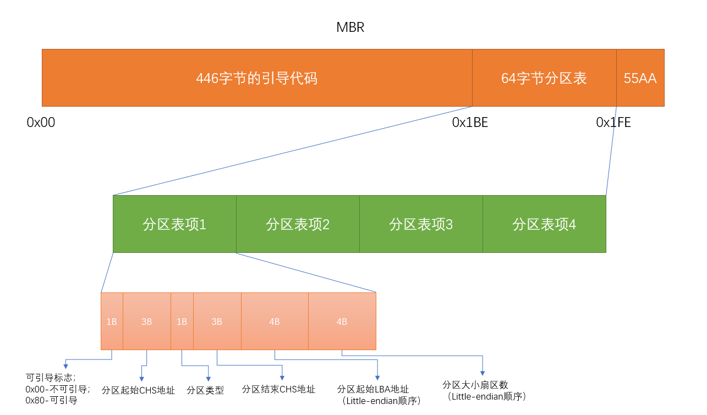
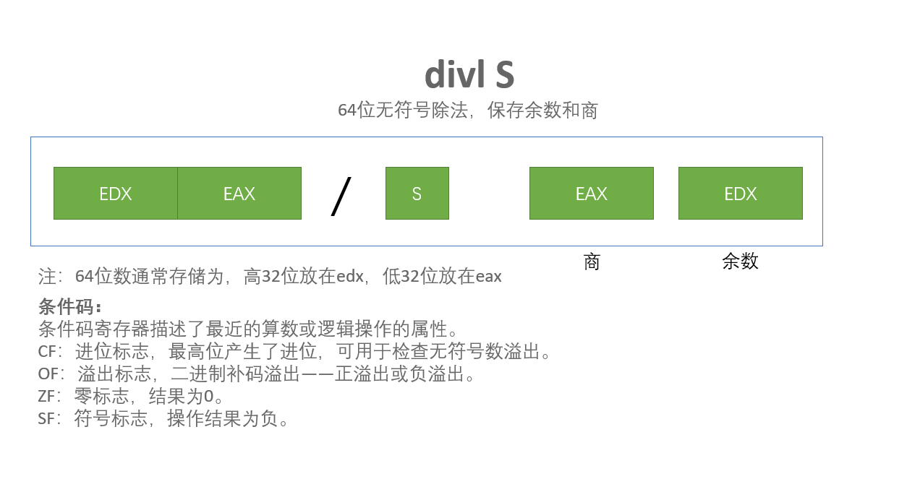
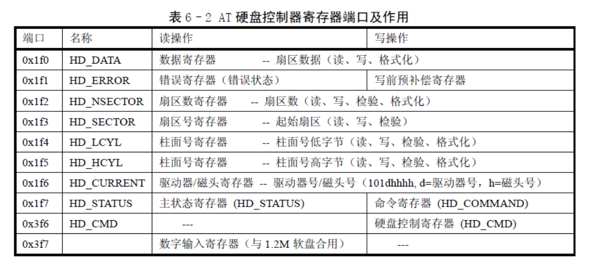

## 关于硬盘版本号

设备号`306`这是Linux老式的硬盘命名方式，具体值的含义如下：

设备号=主设备号*256 +次设备号（也即 dev_no = (major<<8) + minor），

其中主设备号：

- 1-内存
- 2-磁盘
- 3-硬盘
- 4-ttyx
- 5-tty
- 6-并行口
- 7-非命名管道


硬盘的逻辑设备号（主设备号为3）

| 逻辑设备号 | 对应设备文件 | 说明                     |
| ---------- | ------------ | ------------------------ |
| 0x300      | /dev/hd0     | 代表整个第1个硬盘        |
| 0x301      | /dev/hd1     | 表示第1个硬盘的第1个分区 |
| 0x302      | /dev/hd2     | 表示第1个硬盘的第2个分区 |
| 0x303      | /dev/hd3     | 表示第1个硬盘的第3个分区 |
| 0x304      | /dev/hd4     | 表示第1个硬盘的第4个分区 |
| 0x305      | /dev/hd5     | 代表整个第2个硬盘        |
| 0x306      | /dev/hd6     | 表示第2个硬盘的第1个分区 |
| 0x307      | /dev/hd7     | 表示第2个硬盘的第2个分区 |
| 0x308      | /dev/hd8     | 表示第2个硬盘的第3个分区 |
| 0x309      | /dev/hd9     | 表示第2个硬盘的第4个分区 |

软盘的逻辑设备号：

（主设备号为*2*，次设备号*=type \* 4 + nr*，其中*nr*为*0-3*分别对应软驱*A*、*B*、*C*、*D*；*type*是软驱的类型*2*：*1.2MB*，*7*：*1.44MB*等）

| 逻辑设备号 | 对应设备文件 | 说明                                                   |
| ---------- | ------------ | ------------------------------------------------------ |
| 0x021C     | /dev/PS0     | 1.44MB A驱动器，major = 2 ； minor = 7 \* 4 + 0 = 28。 |
| 0x0208     | /dev/at0     | 1.2MB A驱动器，major = 2；minor = 2 \* 4 + 0 = 8。     |

## DOS分区

Microsoft将使用DOS分区体系的磁盘称为“主引导记录（Master Boot Recorded，MBR）磁盘”。使用DOS分区体系时，磁盘的第一个扇区也称为`主引导记录MBR`。




16个字节的分区信息

*include/linux/hdreg.h*

```c
struct partition {
	unsigned char boot_ind;		/* 0x80 - active (unused) */
	unsigned char head;		
	unsigned char sector;		
	unsigned char cyl;		
	unsigned char sys_ind;		
	unsigned char end_head;		
	unsigned char end_sector;	
	unsigned char end_cyl;		
	unsigned int start_sect;	/* starting sector counting from 0 */
	unsigned int nr_sects;		/* nr of sectors in partition */
};
```

## 硬盘系统初始化

设置硬盘中断描述符，并允许硬盘控制器发送中断请求信号。该函数设置硬盘设备的请求项处理函数指针为`do_hd_request()`,然后设置硬盘中断门描述符。`hd_interrupt`(kernel/system_call.s)是其中断处理过程。硬盘中断号为`int 0x2E(46)`,对应8259A芯片的中断请求信号IRQ13.接着复位接联的主8250A int2 的屏蔽位，允许从片发出中断请求信号。再复位硬盘的中断请求屏蔽位(在从片上)，允许硬盘控制器发送中断信号。中断描述符表IDT内中断门描述符设置宏`set_intr_gate()`。

*kernel/blk_drv/hd.c*

```c
void hd_init(void)
{
	blk_dev[MAJOR_NR].request_fn = DEVICE_REQUEST;      // do_hd_request()
	set_intr_gate(0x2E,&hd_interrupt);
	outb_p(inb_p(0x21)&0xfb,0x21);                      // 复位接联的主8259A int2的屏蔽位
	outb(inb_p(0xA1)&0xbf,0xA1);                        // 复位硬盘中断请求屏蔽位(在从片上)
}
```

这里讲的是硬盘，所以`MAJOR_NR`就是`3`,`DEVICE_REQUEST`就是`do_hd_request`

## 加载文件系统

`hd_struct`结构定义了硬盘分区结构。给出每个分区的物理起始扇区号、分区扇区总数。其中5的倍数处的项（例如hd[0]和hd[5]等）代表整个硬盘中的参数。

hd[0]代表的是第一个硬盘的信息，起始扇区号是0，总的扇区数就是整个硬盘的扇区数

hd[1]代表的是第一个硬盘的第一个分区的信息，起始扇区就是第一个分区起始扇区，扇区数就是第一个分区总的扇区数，以此类推。

hd[5]代表的是第二个硬盘的信息

*kernel/blk_drv/hd.c*

```apl
static struct hd_struct {
	long start_sect;  // 起始的扇区号
	long nr_sects;    // 总扇区数  
} hd[5*MAX_HD]={{0,0},};  // MAX_HD==2,LINUX0.11最多支持2个硬盘
```


*kernel/blk_drv/hd.c*

在执行`setup.s`程序后，`0x90080`这个地址存放的是硬盘的参数，等到`sys_setup`函数执行结束后，就可以知道系统中有多少硬盘`NR_HD`,以及硬盘的信息和分区表的信息都在`hd`结构数组中。

```c
int sys_setup(void * BIOS)
{
	static int callable = 1;
	int i,drive;
	unsigned char cmos_disks;
	struct partition *p;          // 分区结构
	struct buffer_head * bh;

	if (!callable)                // 只能调用一次
		return -1;
	callable = 0;

// 如果没有在config.h 中定义硬盘参数，就从0x90080 处读入
#ifndef HD_TYPE
	for (drive=0 ; drive<2 ; drive++) {
		hd_info[drive].cyl = *(unsigned short *) BIOS;        // 柱面数
		hd_info[drive].head = *(unsigned char *) (2+BIOS);    // 磁头数
		hd_info[drive].wpcom = *(unsigned short *) (5+BIOS);  // 写前预补偿柱面号
		hd_info[drive].ctl = *(unsigned char *) (8+BIOS);     // 控制字节
		hd_info[drive].lzone = *(unsigned short *) (12+BIOS); // 磁头着陆区柱面号	
		hd_info[drive].sect = *(unsigned char *) (14+BIOS);   // 每磁道扇区
		BIOS += 16;                                           // 每个硬盘的参数表长16 字节，这里BIOS 指向下一个表 
	}
    // setup.s程序里如果没有第二个硬盘信息，那么这16字节的空间会被清0的
    // 所以这里查看第二个硬盘的柱面数，为0说明没有第二个硬盘
	if (hd_info[1].cyl)
		NR_HD=2;
	else
		NR_HD=1;
#endif
    
    // 设置每个硬盘的起始扇区号和扇区总数
	for (i=0 ; i<NR_HD ; i++) {
		hd[i*5].start_sect = 0;                                               // 硬盘起始扇区号
		hd[i*5].nr_sects = hd_info[i].head * hd_info[i].sect*hd_info[i].cyl;  // 硬盘总扇区数，磁头 * 每磁道扇区数 * 柱面数
	}

	/*
		We querry CMOS about hard disks : it could be that 
		we have a SCSI/ESDI/etc controller that is BIOS
		compatable with ST-506, and thus showing up in our
		BIOS table, but not register compatable, and therefore
		not present in CMOS.

		Furthurmore, we will assume that our ST-506 drives
		<if any> are the primary drives in the system, and 
		the ones reflected as drive 1 or 2.

		The first drive is stored in the high nibble of CMOS
		byte 0x12, the second in the low nibble.  This will be
		either a 4 bit drive type or 0xf indicating use byte 0x19 
		for an 8 bit type, drive 1, 0x1a for drive 2 in CMOS.

		Needless to say, a non-zero value means we have 
		an AT controller hard disk for that drive.

		
	*/

    // 检测硬盘到底是否是AT 控制器兼容的
	if ((cmos_disks = CMOS_READ(0x12)) & 0xf0)
		if (cmos_disks & 0x0f)
			NR_HD = 2;
		else
			NR_HD = 1;
	else
		NR_HD = 0;
    
    // 若NR_HD=0，则两个硬盘都不是AT 控制器兼容的，硬盘数据结构清零。
    // 若NR_HD=1，则将第2 个硬盘的参数清零。
	for (i = NR_HD ; i < 2 ; i++) {
		hd[i*5].start_sect = 0;
		hd[i*5].nr_sects = 0;
	}
    
    // 读取每一个硬盘上第1 块数据（第1 个扇区有用），获取其中的分区表信息。
    // 首先利用函数bread()读硬盘第1 块数据(fs/buffer.c,267)，参数中的0x300 是硬盘的主设备号
    // 然后根据硬盘头1 个扇区位置0x1fe 处的两个字节是否为'55AA'来判断该扇区中位于0x1BE 开始的
    // 分区表是否有效。最后将分区表信息放入硬盘分区数据结构hd 中。
    // 0x300表示第1个硬盘，0x301是第1个硬盘的第1个分区，0x302是第1个硬盘的第2个分区，0x303是第1个硬盘的第3个分区，0x303是第1个硬盘的第4个分区
    // 0x305表示第2个硬盘，0x306是第2个硬盘的第1个分区，0x307是第2个硬盘的第2个分区，0x308是第2个硬盘的第3个分区，0x309是第2个硬盘的第4个分区
    // 所以才有 drive * 5
	for (drive=0 ; drive<NR_HD ; drive++) {
		if (!(bh = bread(0x300 + drive*5,0))) {
			printk("Unable to read partition table of drive %d\n\r",
				drive);
			panic("");
		}
		if (bh->b_data[510] != 0x55 || (unsigned char)
		    bh->b_data[511] != 0xAA) {
			printk("Bad partition table on drive %d\n\r",drive);
			panic("");
		}
		p = 0x1BE + (void *)bh->b_data;  // 分区表位于硬盘第1 扇区的 0x1BE 处
        
        // 读取分区表
		for (i=1;i<5;i++,p++) {
			hd[i+5*drive].start_sect = p->start_sect;
			hd[i+5*drive].nr_sects = p->nr_sects;
		}
		brelse(bh);  // 释放为存放硬盘块而申请的内存缓冲区页
	}
	if (NR_HD)
		printk("Partition table%s ok.\n\r",(NR_HD>1)?"s":"");
	rd_load();  // 加载（创建）RAMDISK(kernel/blk_drv/ramdisk.c)
	mount_root(); // 安装根文件系统
	return (0);

```

## 从设备上读取数据块

该函数根据指定的设备号 dev 和数据块号 block，首先在高速缓冲区中申请一块缓冲块。如果该缓冲块中已经包含有有效的数据就直接返回该缓冲块指针，否则就从设备中读取指定的数据块到该缓冲块中并返回缓冲块指针。

*linux/fs/buffer.c*

```c
struct buffer_head * bread(int dev,int block)
{
	struct buffer_head * bh;

    // 在高速缓冲区中申请一块缓冲块。如果返回值是NULL，则表示内核出错，停机。
    // 然后我们判断其中说是否已有可用数据。如果该缓冲块中数据是有效的（已更新）
    // 可以直接使用，则返回。
	if (!(bh=getblk(dev,block)))
		panic("bread: getblk returned NULL\n");
	if (bh->b_uptodate)
		return bh;
    // 否则我们就调用底层快设备读写ll_rw_block函数，产生读设备块请求。然后
    // 等待指定数据块被读入，并等待缓冲区解锁。在睡眠醒来之后，如果该缓冲区已
    // 更新，则返回缓冲区头指针，退出。否则表明读设备操作失败，于是释放该缓
    // 冲区，返回NULL，退出。
	ll_rw_block(READ,bh);
	wait_on_buffer(bh);
	if (bh->b_uptodate)
		return bh;
	brelse(bh);
	return NULL;
}
```


*linux/kernel/blk_dev/ll_rw.c*

`NR_BLK_DEV`是块设备的数量，大小是`7`。

```c
struct blk_dev_struct blk_dev[NR_BLK_DEV] = {
	{ NULL, NULL },		/* no_dev */   0 - NULL
	{ NULL, NULL },		/* dev mem */  1 - 内存
	{ NULL, NULL },		/* dev fd */   2 - 软驱设备
	{ NULL, NULL },		/* dev hd */   3 - 硬盘设备
	{ NULL, NULL },		/* dev ttyx */ 4 - ttyx 设备
	{ NULL, NULL },		/* dev tty */  5 - tty 设备 	
	{ NULL, NULL }		/* dev lp */   6 - lp 打印机设备
};
```


```c
void ll_rw_block(int rw, struct buffer_head * bh)
{
	unsigned int major; // 主设备号（对于硬盘是3）。

    // 如果设备的主设备号不存在或者该设备的读写操作函数不存在，则显示出错信息，并返回
	if ((major=MAJOR(bh->b_dev)) >= NR_BLK_DEV ||
	!(blk_dev[major].request_fn)) {
		printk("Trying to read nonexistent block-device\n\r");
		return;
	}
	make_request(major,rw,bh);
}
```

*include/linux/fs.h*

```c
#define MAJOR(a) (((unsigned)(a))>>8)
```

*linux/kernel/blk_dev/ll_rw.c*

创建请求项并插入请求队列。参数是：主设备号major，命令rw，存放数据的缓冲区头指针bh。

```c
static void make_request(int major,int rw, struct buffer_head * bh)
{
	struct request * req;
	int rw_ahead;

/* WRITEA/READA is special case - it is not really needed, so if the */
/* buffer is locked, we just forget about it, else it's a normal read */
	if ((rw_ahead = (rw == READA || rw == WRITEA))) {
		if (bh->b_lock)
			return;
		if (rw == READA)
			rw = READ;
		else
			rw = WRITE;
	}
	if (rw!=READ && rw!=WRITE)
		panic("Bad block dev command, must be R/W/RA/WA");
    
    // 锁定缓冲区，如果缓冲区已经上锁，则当前任务（进程）就会睡眠，直到被明确地唤醒。
	lock_buffer(bh);
    
    // 如果命令是写并且缓冲区数据不脏（没有被修改过），或者命令是读并且缓冲区数据是更新过的，
    // 则不用添加这个请求。将缓冲区解锁并退出。
	if ((rw == WRITE && !bh->b_dirt) || (rw == READ && bh->b_uptodate)) {
		unlock_buffer(bh);
		return;
	}
repeat:
/* we don't allow the write-requests to fill up the queue completely:
 * we want some room for reads: they take precedence. The last third
 * of the requests are only for reads.
 */
    
    // 我们不能让队列中全都是写请求项：我们需要为读请求保留一些空间：读操作是优先的。请求队列的后三分之一空间是为读准备的。
	if (rw == READ)
		req = request+NR_REQUEST;
	else
		req = request+((NR_REQUEST*2)/3);
/* find an empty request */
	while (--req >= request)
        //  从后向前搜索，当请求结构request 的dev 字段值=-1 时，表示该项未被占用
		if (req->dev<0)
			break;
/* if none found, sleep on new requests: check for rw_ahead */
	if (req < request) {
		if (rw_ahead) {
			unlock_buffer(bh);
			return;
		}
		sleep_on(&wait_for_request);
		goto repeat;
	}
/* fill up the request-info, and add it to the queue */
    // 向空闲请求项中填写请求信息，并将其加入队列中
	req->dev = bh->b_dev;                     // 设备号
	req->cmd = rw;                            // 命令(READ/WRITE)
	req->errors=0;                            // 操作时产生的错误次数
	req->sector = bh->b_blocknr<<1;           // 起始扇区。块号转换成扇区号(1块=2扇区)
	req->nr_sectors = 2;                      // 读写扇区数。 
	req->buffer = bh->b_data;                 // 数据缓冲区。  
	req->waiting = NULL;                      // 任务等待操作执行完成的地方
	req->bh = bh;                             // 缓冲块头指针。
	req->next = NULL;                         // 指向下一请求项。  
	add_request(major+blk_dev,req);           // 将请求项加入队列中
}


static inline void lock_buffer(struct buffer_head * bh)
{
	cli();  // 关中断
	while (bh->b_lock)
		sleep_on(&bh->b_wait);  // 如果已经被锁了，就等待
	bh->b_lock=1;   // 立刻锁定
	sti();  // 开中断
}
```


向链表中加入请求项。参数dev 指定块设备，req 是请求项结构信息指针

```c
static void add_request(struct blk_dev_struct * dev, struct request * req)
{
	struct request * tmp;

	req->next = NULL;
	cli();       // 关中断
	if (req->bh)
		req->bh->b_dirt = 0;         // 清缓冲区“脏”标志。
    
    // 如果dev 的当前请求(current_request)子段为空，则表示目前该设备没有请求项，本次是第1 个
	// 请求项，因此可将块设备当前请求指针直接指向该请求项，并立刻执行相应设备的请求函数。
	if (!(tmp = dev->current_request)) {
		dev->current_request = req;
		sti();     // 开中断
		(dev->request_fn)();     // 执行设备请求函数，对于硬盘是do_hd_request()
		return;
	}
    
    // 如果目前该设备已经有请求项在等待，则首先利用电梯算法搜索最佳插入位置，然后将当前请求插入
    // 到请求链表中。电梯算法的作用是让磁盘磁头的移动距离最小，从而改善硬盘访问时间。
	for ( ; tmp->next ; tmp=tmp->next)
		if ((IN_ORDER(tmp,req) || 
		    !IN_ORDER(tmp,tmp->next)) &&
		    IN_ORDER(req,tmp->next))
			break;
	req->next=tmp->next;
	tmp->next=req;
	sti();
}
```


执行硬盘读写请求操作,请求项的初始化在`make_request`函数中

1.检查是否含有请求项，如果没有直接退出

2.

*linux/kernel/hd.c*

```c
void do_hd_request(void)
{
	int i,r = 0;
	unsigned int block,dev;
	unsigned int sec,head,cyl;
	unsigned int nsect;

	INIT_REQUEST;
    // 取设备号中的子设备号, 子设备号即是硬盘上的分区号。
	dev = MINOR(CURRENT->dev);
	block = CURRENT->sector; // 请求的起始扇区，请求项的初始化在make_request函数中
    
    // 如果子设备号不存在或者起始扇区大于该分区扇区数-2，则结束该请求，并跳转到标号repeat 处
	// （定义在INIT_REQUEST 开始处）。因为一次要求读写2 个扇区（512*2 字节），所以请求的扇区号
	// 不能大于分区中最后倒数第二个扇区号。
	if (dev >= 5*NR_HD || block+2 > hd[dev].nr_sects) {
		end_request(0);
		goto repeat;
	}
	block += hd[dev].start_sect;
    
    //此时dev 代表硬盘
	dev /= 5; 
    
    // 想要读取的扇区号block已经存到了eax寄存器中，数字0被存到了edx寄存器，每磁道扇区sect被存进其他寄存器
    // 现在我们有了这个分区的绝对扇区号和每磁道扇区数，相除，余数就是在这个磁道上的扇区位置。
	__asm__("divl %4":"=a" (block),"=d" (sec):"0" (block),"1" (0),"r" (hd_info[dev].sect));
    // 经过上面的运算，block的值就是在哪个磁道上
    // 除以磁头数就是在哪个柱面，余数就是在哪个磁头上，结果就得到了CHS
	__asm__("divl %4":"=a" (cyl),"=d" (head):"0" (block),"1" (0),"r" (hd_info[dev].head));
    
    // 扇区号是从1开始编号的
	sec++;
    
    // 欲读/写的扇区数
	nsect = CURRENT->nr_sectors;
    
    
	if (reset) {
		reset = 0;
		recalibrate = 1;
		reset_hd(CURRENT_DEV);
		return;
	}
	if (recalibrate) {
		recalibrate = 0;
		hd_out(dev,hd_info[CURRENT_DEV].sect,0,0,0,
			WIN_RESTORE,&recal_intr);
		return;
	}	
	if (CURRENT->cmd == WRITE) {
		hd_out(dev,nsect,sec,head,cyl,WIN_WRITE,&write_intr);
		for(i=0 ; i<3000 && !(r=inb_p(HD_STATUS)&DRQ_STAT) ; i++)
			/* nothing */ ;
		if (!r) {
			bad_rw_intr();
			goto repeat;
		}
		port_write(HD_DATA,CURRENT->buffer,256);
	} else if (CURRENT->cmd == READ) {
		hd_out(dev,nsect,sec,head,cyl,WIN_READ,&read_intr);
	} else
		panic("unknown hd-command");
}
```




检测请求项的合法性，若已没有请求项则退出

```apl
#define INIT_REQUEST \
repeat: \
	if (!CURRENT) \
		return; \
	if (MAJOR(CURRENT->dev) != MAJOR_NR) \
		panic(DEVICE_NAME ": request list destroyed"); \
	if (CURRENT->bh) { \
		if (!CURRENT->bh->b_lock) \
			panic(DEVICE_NAME ": block not locked"); \
	}

#endif
```


```c
// 向硬盘控制器发送命令块
// 调用参数：drive - 硬盘号(0-1)； nsect - 读写扇区数
// sect - 起始扇区； head - 磁头号；
// cyl - 柱面号； cmd - 命令码
// *intr_addr() - 硬盘中断发生时处理程序中将调用的C 处理函数
static void hd_out(unsigned int drive,unsigned int nsect,unsigned int sect,
		unsigned int head,unsigned int cyl,unsigned int cmd,
		void (*intr_addr)(void))
{
	register int port asm("dx"); // port 变量对应寄存器dx

	if (drive>1 || head>15)
		panic("Trying to write bad sector");
	if (!controller_ready())
		panic("HD controller not ready");
	do_hd = intr_addr;                      // do_hd 函数指针将在硬盘中断程序中被调用
	outb_p(hd_info[drive].ctl,HD_CMD);      // 向控制寄存器(0x3f6)输出控制字节
	port=HD_DATA;                           // 置dx 为数据寄存器端口(0x1f0)。
	outb_p(hd_info[drive].wpcom>>2,++port); // 参数：写预补偿柱面号(需除4)
	outb_p(nsect,++port);                   // 参数：读/写扇区总数。
	outb_p(sect,++port);                    // 参数：起始扇区。
	outb_p(cyl,++port);                     // 参数：柱面号低8 位。
	outb_p(cyl>>8,++port);                  // 参数：柱面号高8 位。
	outb_p(0xA0|(drive<<4)|head,++port);    // 参数：驱动器号+磁头号
	outb(cmd,++port);                       // 命令：硬盘控制命令
}
```

// do_hd在对应的驱动中声明，比如在 blk.h中

```c
....

#elif (MAJOR_NR == 3)
...
#define DEVICE_INTR do_hd
....

#ifdef DEVICE_INTR
void (*DEVICE_INTR)(void) = NULL;   // 如果是磁盘就是 do_hd,do_hd就在这声明
#endif
```

这个函数的作用就是把要读取的drive - 硬盘号(0-1)、 nsect - 读写扇区数、sect - 起始扇区、 head - 磁头号、cyl - 柱面号、cmd - 命令码（读/写）都通过端口发送到硬盘控制器去。就是相当于系统向硬盘发出了读取数据的通知。当这个函数运行结束后就返回了，接下下的读数据的工作交给硬盘控制器。如果读取数据成功，那么数据会被放到硬盘控制器的一个缓冲区中。当然由于一些原因，硬盘控制器和硬盘也有可能读取数据失败。无论是以失败还是成功结束读取操作，硬盘控制器都会通知操作系统。通知操作系统的方式是通过中断（这个中断是外部中断由硬盘控制器触发中断控制器8259产生的）。中断的处理函数就是intr_addr参数 这是一个函数指针，如果中读操作intr_addr参数就会被值为read_intr（）如果是写操作intr_addr参数就会被值为write_intr（）。


## 硬盘中断

*kernel/system_call.s*

```c
### int46 - (int 0x2e)硬盘中断处理程序，响应硬件中断请求IRQ4。
# 当请求的硬盘操作完成或出错就会发出此中断信号。
# 首先向8259A中断控制从芯片发送结束硬件中断指令(EOI),然后取变量do_hd中的函数指针
# 放入edx寄存器中，并置do_hd为NULL，接着判断edx函数指针是否为空。如果为空，则给edx
# 赋值指向unexpected_hd_interrupt(),用于显示出错信息。随后向8259A主芯片送EOI指令，
# 并调用edx中指针指向的函数：read_intr(),write_intr()或unexpected_hd_interrupt().
hd_interrupt:
	pushl %eax
	pushl %ecx
	pushl %edx
	push %ds
	push %es
	push %fs
	movl $0x10,%eax     # ds,es 置为内核数据段
	mov %ax,%ds
	mov %ax,%es
	movl $0x17,%eax     # fs 置为调用程序的局部数据段
	mov %ax,%fs
# 由于初始化中断控制芯片时没有采用自动EOI，所以这里需要发指令结束该硬件中断。
	movb $0x20,%al
	outb %al,$0xA0		# EOI to interrupt controller #1  送从8259A
	jmp 1f			# give port chance to breathe
1:	jmp 1f          # 延时作用。
# do_hd定义为一个函数指针，将被赋值read_intr()或write_intr()函数地址。放到edx
# 寄存器后就将do_hd指针变量置为NULL。然后测试得到的函数指针，若该指针为空，则
# 赋予该指针指向C函数unexpected_hd_interrupt()，以处理未知硬盘中断。
1:	xorl %edx,%edx              # edx 被置为0，即NULL  
	xchgl do_hd,%edx            # 交换，do_hd的值变成了NULL，edx的值变成了之前do_hd的地址 
	testl %edx,%edx             # TEST指令与AND指令相同，只是它不存储结果。它只修改标志，用来检查一个数是否是正数、负数或者0，测试函数指针是否为NULL
	jne 1f                      # 若空，则使指针指向C函数unexpected_hd_interrup().
	movl $unexpected_hd_interrupt,%edx
1:	outb %al,$0x20              # 送主8259A中断控制器EOI命令(结束硬件中断)
	call *%edx		# "interesting" way of handling intr.
	pop %fs                     # 上句调用do_hd指向C函数
	pop %es
	pop %ds
	popl %edx
	popl %ecx
	popl %eax
	iret
```


*kernel/blk_drv/hd.c*

```c
#define port_read(port,buf,nr) \
__asm__("cld;rep;insw"::"d" (port),"D" (buf),"c" (nr))


static void read_intr(void)
{
	if (win_result()) {
		bad_rw_intr();                    // 则进行读写硬盘失败处理
		do_hd_request();                  // 然后再次请求硬盘作相应(复位)处理。
		return;
	}
	port_read(HD_DATA,CURRENT->buffer,256);  // 将数据从数据寄存器口读到请求结构缓冲区。
	CURRENT->errors = 0;
	CURRENT->buffer += 512;
	CURRENT->sector++;                     // 起始扇区号加1
	if (--CURRENT->nr_sectors) {           // 如果所需读出的扇区数还没有读完，则
		do_hd = &read_intr;                // 再次置硬盘调用C 函数指针为read_intr()
		return;                            // 因为硬盘中断处理程序每次调用do_hd 时
	}                                      // 都会将该函数指针置空
 	end_request(1);                        // 若全部扇区数据已经读完，则处理请求结束事宜
	do_hd_request();                       // 执行其它硬盘请求操作
}


// 检测硬盘执行命令后的状态。(win_表示温切斯特硬盘的缩写)
// 读取状态寄存器中的命令执行结果状态。返回0 表示正常，1 出错。如果执行命令错，
// 则再读错误寄存器HD_ERROR(0x1f1)。
static int win_result(void)
{
	int i=inb_p(HD_STATUS); // 0x1f7 取状态信息。	

	if ((i & (BUSY_STAT | READY_STAT | WRERR_STAT | SEEK_STAT | ERR_STAT))
		== (READY_STAT | SEEK_STAT))
		return(0); /* ok */
	if (i&1) i=inb(HD_ERROR);  // 若ERR_STAT 置位，则读取错误寄存器
	return (1);
}
```




*kernel/blk_drv/blk.h*

```c
static inline void end_request(int uptodate)
{
	DEVICE_OFF(CURRENT->dev);
	if (CURRENT->bh) {
		CURRENT->bh->b_uptodate = uptodate;
		unlock_buffer(CURRENT->bh);
	}
	if (!uptodate) {
		printk(DEVICE_NAME " I/O error\n\r");
		printk("dev %04x, block %d\n\r",CURRENT->dev,
			CURRENT->bh->b_blocknr);
	}
	wake_up(&CURRENT->waiting);
	wake_up(&wait_for_request);
	CURRENT->dev = -1;

```

## 安装根文件系统

*fs/super.c*

```c
// 安装根文件系统
// 该函数属于系统初始化操作的一部分。函数首先初始化文件表数组file_table[]和超级块表（数组）
// 然后读取根文件系统超级块，并取得文件系统根i节点。最后统计并显示出根文件系统上的可用资源
// （空闲块数和空闲i节点数）。该函数会在系统开机进行初始化设置时被调用。
void mount_root(void)
{
	int i,free;
	struct super_block * p;
	struct m_inode * mi;

    // 若磁盘i节点结构不是32字节，则出错停机。该判断用于防止修改代码时出现不一致情况。
	if (32 != sizeof (struct d_inode))
		panic("bad i-node size");
    // 首先初始化文件表数组（共64项，即系统同时只能打开64个文件）和超级块表。这里将所有文件
    // 结构中的引用计数设置为0（表示空闲），并发超级块表中各项结构的设备字段初始化为0（也
    // 表示空闲）。如果根文件系统所在设备是软盘的话，就提示“插入根文件系统盘，并按回车键”，
    // 并等待按键。
	for(i=0;i<NR_FILE;i++)
		file_table[i].f_count=0;                        // 初始化文件表
	if (MAJOR(ROOT_DEV) == 2) {
		printk("Insert root floppy and press ENTER");   // 提示插入根文件系统盘
		wait_for_keypress();
	}
	for(p = &super_block[0] ; p < &super_block[NR_SUPER] ; p++) {
		p->s_dev = 0;
		p->s_lock = 0;
		p->s_wait = NULL;
	}
    // 做好以上“份外”的初始化工作之后，我们开始安装根文件系统。于是从根设备上读取文件系统
    // 超级块，并取得文件系统的根i节点（1号节点）在内存i节点表中的指针。如果读根设备上超级
    // 块是吧或取根节点失败，则都显示信息并停机。
	if (!(p=read_super(ROOT_DEV)))
		panic("Unable to mount root");
	if (!(mi=iget(ROOT_DEV,ROOT_INO)))
		panic("Unable to read root i-node");
    // 现在我们对超级块和根i节点进行设置。把根i节点引用次数递增3次。因此后面也引用了该i节点。
    // 另外，iget()函数中i节点引用计数已被设置为1。然后置该超级块的被安装文件系统i节点和被
    // 安装到i节点。再设置当前进程的当前工作目录和根目录i节点。此时当前进程是1号进程（init进程）。
	mi->i_count += 3 ;	/* NOTE! it is logically used 4 times, not 1 */
	p->s_isup = p->s_imount = mi;
	current->pwd = mi;
	current->root = mi;
    // 然后我们对根文件系统的资源作统计工作。统计该设备上空闲块数和空闲i节点数。首先令i等于
    // 超级块中表明的设备逻辑块总数。然后根据逻辑块相应bit位的占用情况统计出空闲块数。这里
    // 宏函数set_bit()只是在测试bit位，而非设置bit位。“i&8191”用于取得i节点号在当前位图块中对应
    // 的bit位偏移值。"i>>13"是将i除以8192，也即除一个磁盘块包含的bit位数。
	free=0;
	i=p->s_nzones;
	while (-- i >= 0)
		if (!set_bit(i&8191,p->s_zmap[i>>13]->b_data))
			free++;
    // 在显示过设备上空闲逻辑块数/逻辑块总数之后。我们再统计设备上空闲i节点数。首先令i等于超级块
    // 中表明的设备上i节点总数+1.加1是将0节点也统计进去，然后根据i节点位图相应bit位的占用情况计算
    // 出空闲i节点数。最后再显示设备上可用空闲i节点数和i节点总数
	printk("%d/%d free blocks\n\r",free,p->s_nzones);
	free=0;
	i=p->s_ninodes+1;
	while (-- i >= 0)
		if (!set_bit(i&8191,p->s_imap[i>>13]->b_data))
			free++;
	printk("%d/%d free inodes\n\r",free,p->s_ninodes);
}
```


