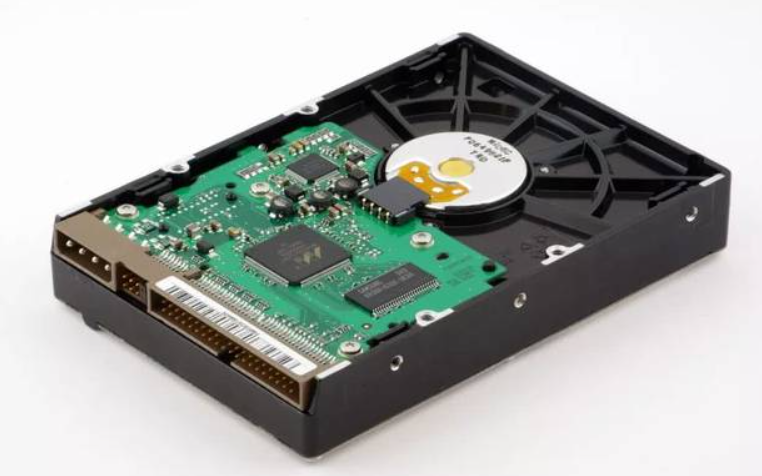
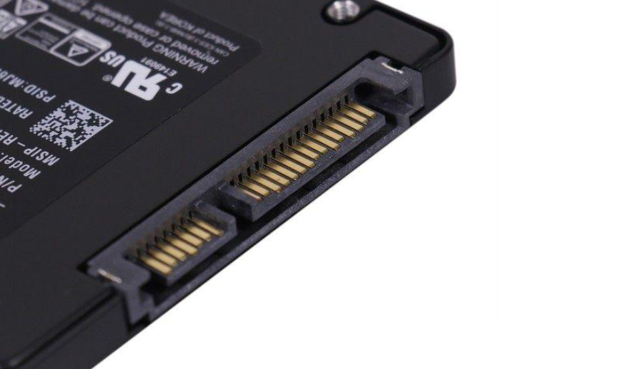
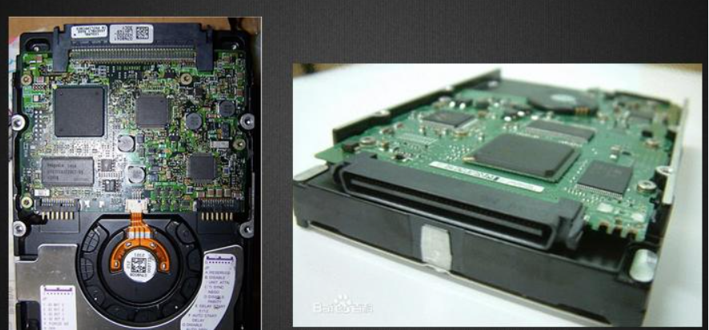
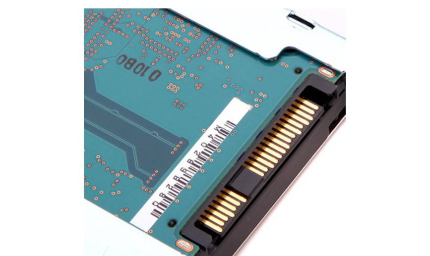
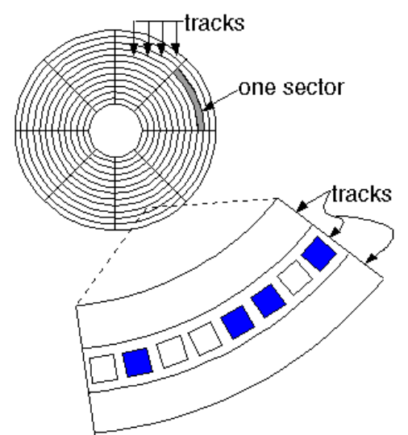

## 物理C/H/S

每张盘片都有上下两个面，每个面上都可以划分出一个一个磁道（Track，简称T），每个磁道还要划分为若干个扇区（Sector，简称S），每个盘面都对应地有一个读写磁头（Head,简称H），所有盘面上的同一个编号的磁道构成一个圆柱形结构，称为柱面（Cylinder，简称C），所以硬盘中某一个具体扇区的地址就是该扇区所在的盘面号（由磁头号H代替）、柱面号C及扇区号S三个参数组成，即C/H/S。

## 硬盘接口

### IDE接口

IDE全称“Integrated Drive Electronics”，即电子集成驱动器。IDE代表着硬盘的一种类型，它的接口标准为`ATA(AT Attachment)`

## SATA接口

`SATA`是`Serial ATA`的简称

### SCSI接口

### SAS接口

SAS是新一代的SCSI技术，和SATA硬盘相同，都是采用串行技术以获得更高的传输速度，并通过缩短连接改善内部空间等。SAS向下兼容SATA。

## ## 扇区、磁道、柱面、磁头编号

在逻辑上扇区从`1`开始编号，[图片来源](https://irishmalveda.blogspot.com/2009/06/storage-structure.html)。

在逻辑上，柱面的编号是和磁道的编号相统一的，都是从外向内自`0`开始顺序编号。

硬盘中都会有一个或者多个盘片，每一个盘片又有两个盘面，每一个盘面都有一个盘面号，逻辑上按顺序从上而下自`0`开始一次编号，每个盘面都对应一个磁头，逻辑盘面号也可以称为逻辑磁头号。

## 逻辑C/H/S

上面说的物理C/H/S，那是硬盘内部的地址，对于程序来说使用逻辑C/H/S访问硬盘，

