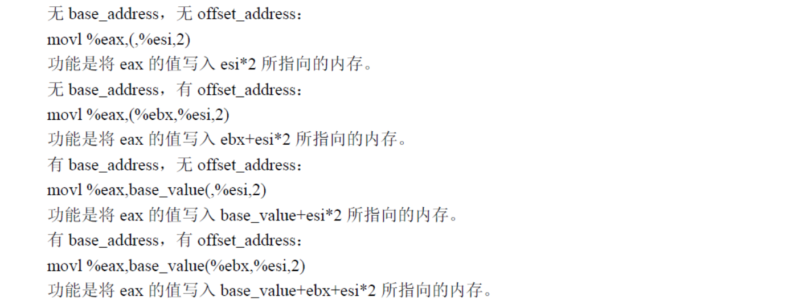

```
nr_system_calls = 72        # Linux 0.11 版本内核中的系统共调用总数。
```

```c#
#define __NR_setup	0	/* used only by init, to get system going */
#define __NR_exit	1
#define __NR_fork	2
#define __NR_read	3
#define __NR_write	4
#define __NR_open	5
#define __NR_close	6
#define __NR_waitpid	7
#define __NR_creat	8
#define __NR_link	9
#define __NR_unlink	10
#define __NR_execve	11
#define __NR_chdir	12
#define __NR_time	13
#define __NR_mknod	14
#define __NR_chmod	15
#define __NR_chown	16
#define __NR_break	17
#define __NR_stat	18
#define __NR_lseek	19
#define __NR_getpid	20
#define __NR_mount	21
#define __NR_umount	22
#define __NR_setuid	23
#define __NR_getuid	24
#define __NR_stime	25
#define __NR_ptrace	26
#define __NR_alarm	27
#define __NR_fstat	28
#define __NR_pause	29
#define __NR_utime	30
#define __NR_stty	31
#define __NR_gtty	32
#define __NR_access	33
#define __NR_nice	34
#define __NR_ftime	35
#define __NR_sync	36
#define __NR_kill	37
#define __NR_rename	38
#define __NR_mkdir	39
#define __NR_rmdir	40
#define __NR_dup	41
#define __NR_pipe	42
#define __NR_times	43
#define __NR_prof	44
#define __NR_brk	45
#define __NR_setgid	46
#define __NR_getgid	47
#define __NR_signal	48
#define __NR_geteuid	49
#define __NR_getegid	50
#define __NR_acct	51
#define __NR_phys	52
#define __NR_lock	53
#define __NR_ioctl	54
#define __NR_fcntl	55
#define __NR_mpx	56
#define __NR_setpgid	57
#define __NR_ulimit	58
#define __NR_uname	59
#define __NR_umask	60
#define __NR_chroot	61
#define __NR_ustat	62
#define __NR_dup2	63
#define __NR_getppid	64
#define __NR_getpgrp	65
#define __NR_setsid	66
#define __NR_sigaction	67
#define __NR_sgetmask	68
#define __NR_ssetmask	69
#define __NR_setreuid	70
#define __NR_setregid	71
```

```
#define SIGHUP		 1
#define SIGINT		 2
#define SIGQUIT		 3
#define SIGILL		 4
#define SIGTRAP		 5
#define SIGABRT		 6
#define SIGIOT		 6
#define SIGUNUSED	 7
#define SIGFPE		 8
#define SIGKILL		 9
#define SIGUSR1		10
#define SIGSEGV		11
#define SIGUSR2		12
#define SIGPIPE		13
#define SIGALRM		14
#define SIGTERM		15
#define SIGSTKFLT	16
#define SIGCHLD		17
#define SIGCONT		18
#define SIGSTOP		19
#define SIGTSTP		20
#define SIGTTIN		21
#define SIGTTOU		22
```

想要调用系统函数，可以使用0x80号中断，调用号参数放在eax中

```
#define TASK_RUNNING		0
#define TASK_INTERRUPTIBLE	1
#define TASK_UNINTERRUPTIBLE	2
#define TASK_ZOMBIE		3
#define TASK_STOPPED		4
```

```c#
# 以下这些是任务结构(task_struct)中变量的偏移值
state	= 0		# these are offsets into the task-struct. # 进程状态码
counter	= 4     # 任务运行时间计数（递减），运行时间片
priority = 8    # 运行优先数。任务开始运行时counter=priority,越大则运行时间越长
signal	= 12    # 是信号位图，每个bit代表一种信号，信号值=位偏移值+1
# 信号执行属性结构数组的偏移量，对应信号将要执行的操作和标志信息。
sigaction = 16		# MUST be 16 (=len of sigaction)
blocked = (33*16)   # 受阻塞信号位图的偏移量

# 以下定义在sigaction结构中的偏移量。
# offsets within sigaction
sa_handler = 0              # 信号处理过程的句柄
sa_mask = 4                 # 信号屏蔽码
sa_flags = 8                # 信号集
sa_restorer = 12            # 恢复函数指针
```


```c#
system_call:
	cmpl $nr_system_calls-1,%eax    # 调用号如果超出范围的话就在eax中置-1并退出
	ja bad_sys_call
	push %ds                        # 保存原段寄存器值
	push %es
	push %fs
# 一个系统调用最多可带有3个参数，也可以不带参数。下面入栈的ebx、ecx和edx中放着系统
# 调用相应C语言函数的调用函数。这几个寄存器入栈的顺序是由GNU GCC规定的，
# ebx 中可存放第1个参数，ecx中存放第2个参数，edx中存放第3个参数。
# 系统调用语句可参见头文件include/unistd.h中的系统调用宏。
	pushl %edx
	pushl %ecx		    # push %ebx,%ecx,%edx as parameters
	pushl %ebx		    # to the system call
	movl $0x10,%edx		# set up ds,es to kernel space,内核的数据段
	mov %dx,%ds
	mov %dx,%es
# fs指向局部数据段(局部描述符表中数据段描述符)，即指向执行本次系统调用的用户程序的数据段。
# 注意,在Linux 0.11 中内核给任务分配的代码和数据内存段是重叠的，他们的段基址和段限长相同。
	movl $0x17,%edx		# fs points to local data space   0001 0111，RPL=3，TI=1，index=2，
	mov %dx,%fs
# 下面这句操作数的含义是：调用地址=[_sys_call_table + %eax * 4]
# sys_call_table[]是一个指针数组，定义在include/linux/sys.h中，该指针数组中设置了所有72
# 个系统调用C处理函数地址。
	call sys_call_table(,%eax,4)        # 间接调用指定功能C函数，地址是 sys_call_table[eax *4],数组的类型是int类型的函数指针
	pushl %eax                          # 系统调用的返回结果会存到eax中，把系统调用返回值入栈
# 下面几行查看当前任务的运行状态。如果不在就绪状态(state != 0)就去执行调度程序。如果该
# 任务在就绪状态，但其时间片已用完(counter = 0),则也去执行调度程序。例如当后台进程组中的
# 进程执行控制终端读写操作时，那么默认条件下该后台进程组所有进程会收到SIGTTIN或SIGTTOU
# 信号，导致进程组中所有进程处于停止状态。而当前进程则会立刻返回。
	movl current,%eax                   # 取当前任务(进程)数据结构地址→eax
	cmpl $0,state(%eax)		    		# state，查看当前任务的状态
	jne reschedule                      # 不是TASK_RUNNING状态就去重新调度
	cmpl $0,counter(%eax)				# counter
	je reschedule                       # 如果时间片已经用完就去重新调度
        
# 以下这段代码执行从系统调用C函数返回后，对信号进行识别处理。其他中断服务程序退出时也
# 将跳转到这里进行处理后才退出中断过程，例如后面的处理器出错中断int 16.
ret_from_sys_call:
# 首先判别当前任务是否是初始任务task0,如果是则不比对其进行信号量方面的处理，直接返回。
	movl current,%eax		# task[0] cannot have signals
	cmpl task,%eax          # 当前任务是不是task0
	je 3f                   # 向前(forward)跳转到标号3处退出中断处理
    
# 通过对原调用程序代码选择符的检查来判断调用程序是否是用户任务。如果不是则直接退出中断。
# 这是因为任务在内核态执行时不可抢占。否则对任务进行信号量的识别处理。这里比较选择符是否
# 为用户代码段的选择符0x000f(RPL=3,局部表，第一个段(代码段))来判断是否为用户任务。如果不是
# 则说明是某个中断服务程序跳转到上面的，于是跳转退出中断程序。如果原堆栈段选择符不为
# 0x17(即原堆栈不在用户段中)，也说明本次系统调用的调用者不是用户任务，则也退出。
	cmpw $0x0f,CS(%esp)		# was old code segment supervisor ?
	jne 3f
	cmpw $0x17,OLDSS(%esp)		# was stack segment = 0x17 ?
	jne 3f
    
# 下面这段代码用于处理当前任务中的信号。首先取当前任务结构中的信号位图(32位，每位代表1种
# 信号)，然后用任务结构中的信号阻塞(屏蔽)码，阻塞不允许的信号位，取得数值最小的信号值，
# 再把原信号位图中该信号对应的位复位(置0)，最后将该信号值作为参数之一调用do_signal().
# do_signal()在kernel/signal.c中，其参数包括13个入栈信息。
	movl signal(%eax),%ebx          # 取信号位图→ebx,每1位代表1种信号，共32个信号
	movl blocked(%eax),%ecx         # 取阻塞(屏蔽)信号位图→ecx
	notl %ecx                       # 每位取反
	andl %ebx,%ecx                  # 获得许可信号位图
	bsfl %ecx,%ecx                  # 从0位开始扫描，如果第一个操作数ecx中没有1，则ZF=0,否则ZF=1，并且将第一个bit位是1的索引加载到第二个操作数中
	je 3f                           # 如果没有信号则向前跳转退出
    
	btrl %ecx,%ebx                  # 此时ecx中保存的是第一个可用的信号索引，btrl将该索引位上的值保存到CF中，并把该位置1，复位该信号(ebx含有原signal位图)
	movl %ebx,signal(%eax)          # 重新保存signal位图信息→current->signal.
	incl %ecx                       # 索引加1，因为信号值是从1开始的，将信号调整为从1开始的数(1-32)
	pushl %ecx                      # 信号值入栈作为调用do_signal的参数之一
	call do_signal                  # 调用C函数信号处理程序(kernel/signal.c)
	popl %eax                       # 弹出入栈的信号值
    
3:	popl %eax                       # eax中含有上面入栈系统调用的返回值
	popl %ebx
	popl %ecx
	popl %edx
	pop %fs
	pop %es
	pop %ds
	iret
```



## btrl

Bit Test and Set ,指令先将指定位的值存储到 CF 标志中然后设置该位.

mov $0x80, %al 
btsl $7, %eax
这里对寄存器 eax 的第 7 位进行测试并置位。因为，要测试的第 7 位由于第 1 条 mov 指令已经变为 1，所以在执行 bts 指令后，这个 1 会被存在 CF 中，然后对该位置 1 ，置位后 eax 自然是 0x80 。


sys_call_table在 /include/linux/sys.h 中进行了定义

```apl
fn_ptr sys_call_table[] = { sys_setup, sys_exit, sys_fork, sys_read,
sys_write, sys_open, sys_close, sys_waitpid, sys_creat, sys_link,
sys_unlink, sys_execve, sys_chdir, sys_time, sys_mknod, sys_chmod,
sys_chown, sys_break, sys_stat, sys_lseek, sys_getpid, sys_mount,
sys_umount, sys_setuid, sys_getuid, sys_stime, sys_ptrace, sys_alarm,
sys_fstat, sys_pause, sys_utime, sys_stty, sys_gtty, sys_access,
sys_nice, sys_ftime, sys_sync, sys_kill, sys_rename, sys_mkdir,
sys_rmdir, sys_dup, sys_pipe, sys_times, sys_prof, sys_brk, sys_setgid,
sys_getgid, sys_signal, sys_geteuid, sys_getegid, sys_acct, sys_phys,
sys_lock, sys_ioctl, sys_fcntl, sys_mpx, sys_setpgid, sys_ulimit,
sys_uname, sys_umask, sys_chroot, sys_ustat, sys_dup2, sys_getppid,
sys_getpgrp, sys_setsid, sys_sigaction, sys_sgetmask, sys_ssetmask,
sys_setreuid,sys_setregid };
```

参考

[[IA-32 汇编语言参考手册 >[第 2 章指令集映射 ] >[位指令] ](https://docs.oracle.com/cd/E19455-01/806-3773/instructionset-89/index.html)

