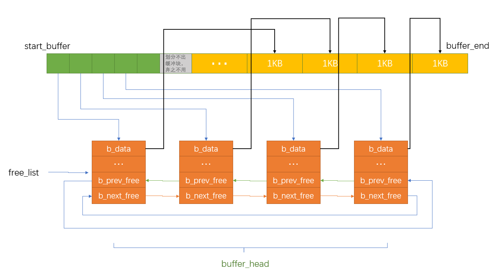

缓冲区的作用是提高系统效率，相对CPU来说，低速的IO设备是CPU受不了的，那就把IO设备中的数据先读取到缓冲区中，然后再复制到用户空间，如果想写数据到IO设备，进程先修改自己空间中的数据（用户空间），然后复制到缓冲区，然会就会等待系统同步数据到IO了。那么我们使用的open、read函数就是从磁盘数据到缓冲区然后到用户空间，经过了2次的复制。后面我们学习内存映射，直接把磁盘数据映射到用户空间，数据只需要一次复制，进一步提高IO效率。


linux0.11最大支持16MB的内存大小，假设现在内存就是16MB，那么缓存区的末端就在4MB的地址地方。 变量`end`是由编译时的连接程序ld生成，用于表明内核代码的末端。


*include/linux/fs.h*

```c
#define BLOCK_SIZE 1024 //块大小

#define NR_HASH 307

struct buffer_head {
	char * b_data;			/* pointer to data block (1024 bytes) */
	unsigned long b_blocknr;	/* block number */
	unsigned short b_dev;		/* device (0 = free) */
	unsigned char b_uptodate;
	unsigned char b_dirt;		/* 0-clean,1-dirty */
	unsigned char b_count;		/* users using this block */
	unsigned char b_lock;		/* 0 - ok, 1 -locked */
	struct task_struct * b_wait;
	struct buffer_head * b_prev;
	struct buffer_head * b_next;
	struct buffer_head * b_prev_free;
	struct buffer_head * b_next_free;
};
```

`b_uptodate`表示该缓冲区的中的数据已经是最新的了。进程可以使用该缓冲中的数据，否咋就是垃圾。`b_dirt`表示该缓冲区的数据已经被修改，与磁盘中的数据不一致，需要同步到磁盘。


*linux/fs/buffer.c*

```c
extern int end;

struct buffer_head * start_buffer = (struct buffer_head *) &end;

static struct buffer_head * free_list;              // 空闲缓冲块链表头指针

struct buffer_head * hash_table[NR_HASH];           // NR_HASH ＝ 307项

...

void buffer_init(long buffer_end)
{
	struct buffer_head * h = start_buffer;
	void * b;
	int i;

    // 首先根据参数提供的缓冲区高端位置确定实际缓冲区高端位置b。如果缓冲区高端等于1MB，
    // 则因为从640KB - 1MB被显示内存和BIOS占用，所以实际可用缓冲区内存高端位置应该是
    // 640KB。否则缓冲区内存高端一定大于1MB。
	if (buffer_end == 1<<20)
		b = (void *) (640*1024);
	else
		b = (void *) buffer_end;
 
	while ( (b -= BLOCK_SIZE) >= ((void *) (h+1)) ) {
		h->b_dev = 0;                       // 使用该缓冲块的设备号
		h->b_dirt = 0;                      // 脏标志，即缓冲块修改标志
		h->b_count = 0;                     // 缓冲块引用计数
		h->b_lock = 0;                      // 缓冲块锁定标志
		h->b_uptodate = 0;                  // 缓冲块更新标志(或称数据有效标志)
		h->b_wait = NULL;                   // 指向等待该缓冲块解锁的进程
		h->b_next = NULL;                   // 指向具有相同hash值的下一个缓冲头
		h->b_prev = NULL;                   // 指向具有相同hash值的前一个缓冲头
		h->b_data = (char *) b;             // 指向对应缓冲块数据块（1024字节）
		h->b_prev_free = h-1;               // 指向链表中前一项
		h->b_next_free = h+1;               // 指向连表中后一项
		h++;                                // h指向下一新缓冲头位置
		NR_BUFFERS++;                       // 缓冲区块数累加
		if (b == (void *) 0x100000)         // 若b递减到等于1MB，则跳过384KB
			b = (void *) 0xA0000;           // 让b指向地址0xA0000(640KB)处
	}
	h--;                                    // 让h指向最后一个有效缓冲块头
	free_list = start_buffer;               // 让空闲链表头指向头一个缓冲快
	free_list->b_prev_free = h;             // 链表头的b_prev_free指向前一项(即最后一项)。
	h->b_next_free = free_list;             // h的下一项指针指向第一项，形成一个环链
    // 最后初始化hash表，置表中所有指针为NULL。
	for (i=0;i<NR_HASH;i++)
		hash_table[i]=NULL;
}
```

`buffer_init`就是创建一些缓冲块，每个大小1024字节




## 申请缓冲区

*linux/fs/buffer.c*

```c
struct buffer_head * getblk(int dev,int block)
{
	struct buffer_head * tmp, * bh;

repeat:
    // 搜索hash表，如果指定块已经在高速缓冲中，则返回对应缓冲区头指针，退出。
	if ((bh = get_hash_table(dev,block)))
		return bh;
    // 扫描空闲数据块链表，寻找空闲缓冲区。
    // 首先让tmp指向空闲链表的第一个空闲缓冲区头
	tmp = free_list;
	do {
        // 如果该缓冲区正被使用（引用计数不等于0），则继续扫描下一项。对于
        // b_count = 0的块，即高速缓冲中当前没有引用的块不一定就是干净的
        // (b_dirt=0)或没有锁定的(b_lock=0)。因此，我们还是需要继续下面的判断
        // 和选择。例如当一个任务该写过一块内容后就释放了，于是该块b_count()=0
        // 但b_lock不等于0；当一个任务执行breada()预读几个块时，只要ll_rw_block()
        // 命令发出后，它就会递减b_count; 但此时实际上硬盘访问操作可能还在进行，
        // 因此此时b_lock=1, 但b_count=0.
		if (tmp->b_count)
			continue;
        // 如果缓冲头指针bh为空，或者tmp所指缓冲头的标志(修改、锁定)权重小于bh
        // 头标志的权重，则让bh指向tmp缓冲块头。如果该tmp缓冲块头表明缓冲块既
        // 没有修改也没有锁定标志置位，则说明已为指定设备上的块取得对应的高速
        // 缓冲块，则退出循环。否则我们就继续执行本循环，看看能否找到一个BANDNESS()
        // 最小的缓冲块。
		if (!bh || BADNESS(tmp)<BADNESS(bh)) {
			bh = tmp;
			if (!BADNESS(tmp))
				break;
		}
/* and repeat until we find something good */
	} while ((tmp = tmp->b_next_free) != free_list);
    // 如果循环检查发现所有缓冲块都正在被使用(所有缓冲块的头部引用计数都>0)中，
    // 则睡眠等待有空闲缓冲块可用。当有空闲缓冲块可用时本进程会呗明确的唤醒。
    // 然后我们跳转到函数开始处重新查找空闲缓冲块。
	if (!bh) {
		sleep_on(&buffer_wait);
		goto repeat;
	}
    // 执行到这里，说明我们已经找到了一个比较合适的空闲缓冲块了。于是先等待该缓冲区
    // 解锁。如果在我们睡眠阶段该缓冲区又被其他任务使用的话，只好重复上述寻找过程。
	wait_on_buffer(bh);
	if (bh->b_count)
		goto repeat;
    // 如果该缓冲区已被修改，则将数据写盘，并再次等待缓冲区解锁。同样地，若该缓冲区
    // 又被其他任务使用的话，只好再重复上述寻找过程。
	while (bh->b_dirt) {
		sync_dev(bh->b_dev);
		wait_on_buffer(bh);
		if (bh->b_count)
			goto repeat;
	}
/* NOTE!! While we slept waiting for this block, somebody else might */
/* already have added "this" block to the cache. check it */
    // 在高速缓冲hash表中检查指定设备和块的缓冲块是否乘我们睡眠之际已经被加入
    // 进去。如果是的话，就再次重复上述寻找过程。
	if (find_buffer(dev,block))
		goto repeat;
/* OK, FINALLY we know that this buffer is the only one of it's kind, */
/* and that it's unused (b_count=0), unlocked (b_lock=0), and clean */
    // 于是让我们占用此缓冲块。置引用计数为1，复位修改标志和有效(更新)标志。
	bh->b_count=1;
	bh->b_dirt=0;
	bh->b_uptodate=0;
    // 从hash队列和空闲队列块链表中移出该缓冲区头，让该缓冲区用于指定设备和
    // 其上的指定块。然后根据此新的设备号和块号重新插入空闲链表和hash队列新
    // 位置处。并最终返回缓冲头指针。
	remove_from_queues(bh);
	bh->b_dev=dev;
	bh->b_blocknr=block;
	insert_into_queues(bh);
	return bh;
}


// 设备数据同步。
// 同步设备和内存高速缓冲中数据，其中sync_inode()定义在inode.c中。
int sys_sync(void)
{
	int i;
	struct buffer_head * bh;

    // 首先调用i节点同步函数，把内存i节点表中所有修改过的i节点写入高速缓冲中。
    // 然后扫描所有高速缓冲区，对已被修改的缓冲块产生写盘请求，将缓冲中数据写入
    // 盘中，做到高速缓冲中的数据与设备中的同步。
	sync_inodes();		/* write out inodes into buffers */
	bh = start_buffer;
	for (i=0 ; i<NR_BUFFERS ; i++,bh++) {
		wait_on_buffer(bh);                 // 等待缓冲区解锁(如果已经上锁的话)
		if (bh->b_dirt)
			ll_rw_block(WRITE,bh);          // 产生写设备块请求
	}
	return 0;
}
```


```c
struct buffer_head * get_hash_table(int dev, int block)
{
	struct buffer_head * bh;

	for (;;) {
        // 在高速缓冲中寻找给定设备和指定块的缓冲区块，如果没有找到则返回NULL。
		if (!(bh=find_buffer(dev,block)))
			return NULL;
        // 对该缓冲块增加引用计数，并等待该缓冲块解锁。由于经过了睡眠状态，
        // 因此有必要在验证该缓冲块的正确性，并返回缓冲块头指针。
		bh->b_count++;
		wait_on_buffer(bh);
		if (bh->b_dev == dev && bh->b_blocknr == block)
			return bh;
        // 如果在睡眠时该缓冲块所属的设备号或块设备号发生了改变，则撤消对它的
        // 引用计数，重新寻找。
		bh->b_count--;
	}
}

// 等待指定缓冲块解锁
// 如果指定的缓冲块bh已经上锁就让进程不可中断地睡眠在该缓冲块的等待队列b_wait中。
// 在缓冲块解锁时，其等待队列上的所有进程将被唤醒。虽然是在关闭中断(cli)之后
// 去睡眠的，但这样做并不会影响在其他进程上下文中影响中断。因为每个进程都在自己的
// TSS段中保存了标志寄存器EFLAGS的值，所以在进程切换时CPU中当前EFLAGS的值也随之
// 改变。使用sleep_on进入睡眠状态的进程需要用wake_up明确地唤醒。
static inline void wait_on_buffer(struct buffer_head * bh)
{
	cli();                          // 关中断
	while (bh->b_lock)              // 如果已被上锁则进程进入睡眠，等待其解锁
		sleep_on(&bh->b_wait);
	sti();                          // 开中断
}
```


先根据设备号和块号在hash表里找找看是否已经存在这样的缓冲块，如果没有就返回NULL。

```c
#define _hashfn(dev,block) (((unsigned)(dev^block))%NR_HASH)
#define hash(dev,block) hash_table[_hashfn(dev,block)]

// 利用hash表在高速缓冲区中寻找给定设备和指定块号的缓冲区块。
// 如果找到则返回缓冲区块的指针，否则返回NULL。
static struct buffer_head * find_buffer(int dev, int block)
{		
	struct buffer_head * tmp;

    // 搜索hash表，寻找指定设备号和块号的缓冲块。
	for (tmp = hash(dev,block) ; tmp != NULL ; tmp = tmp->b_next)
		if (tmp->b_dev==dev && tmp->b_blocknr==block)
			return tmp;
	return NULL;
}

// 从hash队列和空闲缓冲区队列中移走缓冲块。
// hash队列是双向链表结构，空闲缓冲块队列是双向循环链表结构。
static inline void remove_from_queues(struct buffer_head * bh)
{
/* remove from hash-queue */
	if (bh->b_next)
		bh->b_next->b_prev = bh->b_prev;
	if (bh->b_prev)
		bh->b_prev->b_next = bh->b_next;
    // 如果该缓冲区是该队列的头一个块，则让hash表的对应项指向本队列中的下一个
    // 缓冲区。
	if (hash(bh->b_dev,bh->b_blocknr) == bh)
		hash(bh->b_dev,bh->b_blocknr) = bh->b_next;
/* remove from free list */
	if (!(bh->b_prev_free) || !(bh->b_next_free))
		panic("Free block list corrupted");
	bh->b_prev_free->b_next_free = bh->b_next_free;
	bh->b_next_free->b_prev_free = bh->b_prev_free;
    // 如果空闲链表头指向本缓冲区，则让其指向下一缓冲区。
	if (free_list == bh)
		free_list = bh->b_next_free;
}

//// 将缓冲块插入空闲链表尾部，同时放入hash队列中。
static inline void insert_into_queues(struct buffer_head * bh)
{
/* put at end of free list */
	bh->b_next_free = free_list;
	bh->b_prev_free = free_list->b_prev_free;
	free_list->b_prev_free->b_next_free = bh;
	free_list->b_prev_free = bh;
/* put the buffer in new hash-queue if it has a device */
    // 请注意当hash表某项第1次插入项时，hash()计算值肯定为Null，因此此时得到
    // 的bh->b_next肯定是NULL，所以应该在bh->b_next不为NULL时才能给b_prev赋
    // bh值。
	bh->b_prev = NULL;
	bh->b_next = NULL;
	if (!bh->b_dev)
		return;
	bh->b_next = hash(bh->b_dev,bh->b_blocknr);
	hash(bh->b_dev,bh->b_blocknr) = bh;
	bh->b_next->b_prev = bh;                // 此句前应添加"if (bh->b_next)"判断
}
```


*linux/kernel/sched.c*

```c
// 把当前任务置为不可中断的等待状态，并让睡眠队列指针指向当前任务。
// 只有明确的唤醒时才会返回。该函数提供了进程与中断处理程序之间的同步机制。函数参数P是等待
// 任务队列头指针。指针是含有一个变量地址的变量。这里参数p使用了指针的指针形式'**p',这是因为
// C函数参数只能传值，没有直接的方式让被调用函数改变调用该函数程序中变量的值。但是指针'*p'
// 指向的目标(这里是任务结构)会改变，因此为了能修改调用该函数程序中原来就是指针的变量的值，
// 就需要传递指针'*p'的指针，即'**p'.
void sleep_on(struct task_struct **p)
{
	struct task_struct *tmp;

    // 若指针无效，则退出。(指针所指向的对象可以是NULL，但指针本身不应该为0).另外，如果
    // 当前任务是任务0，则死机。因为任务0的运行不依赖自己的状态，所以内核代码把任务0置为
    // 睡眠状态毫无意义。
	if (!p)
		return;
	if (current == &(init_task.task))
		panic("task[0] trying to sleep");
    // 让tmp指向已经在等待队列上的任务(如果有的话)，例如inode->i_wait.并且将睡眠队列头的
    // 等等指针指向当前任务。这样就把当前任务插入到了*p的等待队列中。然后将当前任务置为
    // 不可中断的等待状态，并执行重新调度。
	tmp = *p;
	*p = current;
	current->state = TASK_UNINTERRUPTIBLE;
	schedule();
    // 只有当这个等待任务被唤醒时，调度程序才又返回到这里，表示本进程已被明确的唤醒(就
    // 续态)。既然大家都在等待同样的资源，那么在资源可用时，就有必要唤醒所有等待该该资源
    // 的进程。该函数嵌套调用，也会嵌套唤醒所有等待该资源的进程。这里嵌套调用是指一个
    // 进程调用了sleep_on()后就会在该函数中被切换掉，控制权呗转移到其他进程中。此时若有
    // 进程也需要使用同一资源，那么也会使用同一个等待队列头指针作为参数调用sleep_on()函数，
    // 并且也会陷入该函数而不会返回。只有当内核某处代码以队列头指针作为参数wake_up了队列，
    // 那么当系统切换去执行头指针所指的进程A时，该进程才会继续执行下面的代码，把队列后一个
    // 进程B置位就绪状态(唤醒)。而当轮到B进程执行时，它也才可能继续执行下面的代码。若它
    // 后面还有等待的进程C，那它也会把C唤醒等。在这前面还应该添加一行：*p = tmp.
	if (tmp)                    // 若在其前还有存在的等待的任务，则也将其置为就绪状态(唤醒).
		tmp->state=0;
}
```


