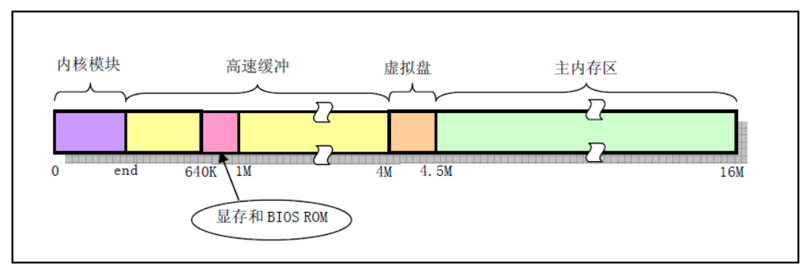
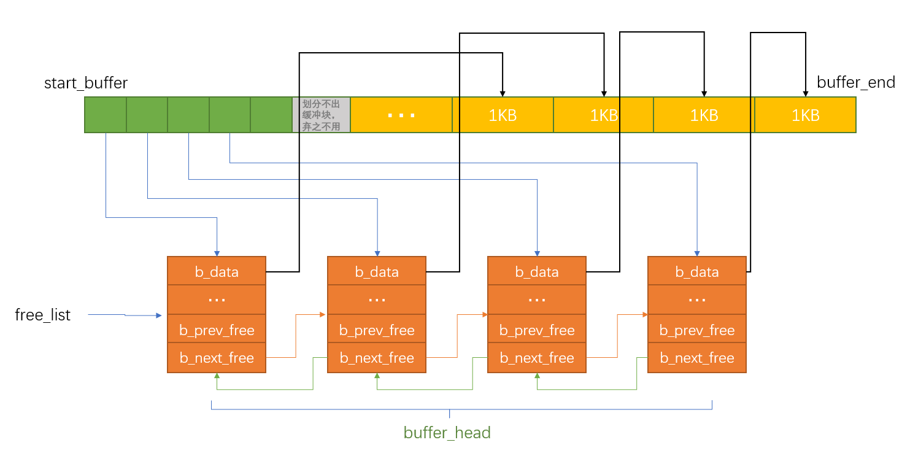

缓冲区的作用是提高系统效率，相对CPU来说，低速的IO设备是CPU受不了的，那就把IO设备中的数据先读取到缓冲区中，然后再复制到用户空间，如果想写数据到IO设备，进程先修改自己空间中的数据（用户空间），然后复制到缓冲区，然会就会等待系统同步数据到IO了。那么我们使用的open、read函数就是从磁盘数据到缓冲区然后到用户空间，经过了2次的复制。后面我们学习内存映射，直接把磁盘数据映射到用户空间，数据只需要一次复制，进一步提高IO效率。



linux0.11最大支持16MB的内存大小，假设现在内存就是16MB，那么缓存区的末端就在4MB的地址地方。 变量`end`是由编译时的连接程序ld生成，用于表明内核代码的末端。


*include/linux/fs.h*

```c
#define BLOCK_SIZE 1024 //块大小

#define NR_HASH 307

struct buffer_head {
	char * b_data;			/* pointer to data block (1024 bytes) */
	unsigned long b_blocknr;	/* block number */
	unsigned short b_dev;		/* device (0 = free) */
	unsigned char b_uptodate;
	unsigned char b_dirt;		/* 0-clean,1-dirty */
	unsigned char b_count;		/* users using this block */
	unsigned char b_lock;		/* 0 - ok, 1 -locked */
	struct task_struct * b_wait;
	struct buffer_head * b_prev;
	struct buffer_head * b_next;
	struct buffer_head * b_prev_free;
	struct buffer_head * b_next_free;
};
```

`b_uptodate`表示该缓冲区的中的数据已经是最新的了。进程可以使用该缓冲中的数据，否咋就是垃圾。`b_dirt`表示该缓冲区的数据已经被修改，与磁盘中的数据不一致，需要同步到磁盘。


*linux/fs/buffer.c*

```c
extern int end;

struct buffer_head * start_buffer = (struct buffer_head *) &end;

static struct buffer_head * free_list;              // 空闲缓冲块链表头指针

struct buffer_head * hash_table[NR_HASH];           // NR_HASH ＝ 307项

...

void buffer_init(long buffer_end)
{
	struct buffer_head * h = start_buffer;
	void * b;
	int i;

    // 首先根据参数提供的缓冲区高端位置确定实际缓冲区高端位置b。如果缓冲区高端等于1MB，
    // 则因为从640KB - 1MB被显示内存和BIOS占用，所以实际可用缓冲区内存高端位置应该是
    // 640KB。否则缓冲区内存高端一定大于1MB。
	if (buffer_end == 1<<20)
		b = (void *) (640*1024);
	else
		b = (void *) buffer_end;
 
	while ( (b -= BLOCK_SIZE) >= ((void *) (h+1)) ) {
		h->b_dev = 0;                       // 使用该缓冲块的设备号
		h->b_dirt = 0;                      // 脏标志，即缓冲块修改标志
		h->b_count = 0;                     // 缓冲块引用计数
		h->b_lock = 0;                      // 缓冲块锁定标志
		h->b_uptodate = 0;                  // 缓冲块更新标志(或称数据有效标志)
		h->b_wait = NULL;                   // 指向等待该缓冲块解锁的进程
		h->b_next = NULL;                   // 指向具有相同hash值的下一个缓冲头
		h->b_prev = NULL;                   // 指向具有相同hash值的前一个缓冲头
		h->b_data = (char *) b;             // 指向对应缓冲块数据块（1024字节）
		h->b_prev_free = h-1;               // 指向链表中前一项
		h->b_next_free = h+1;               // 指向连表中后一项
		h++;                                // h指向下一新缓冲头位置
		NR_BUFFERS++;                       // 缓冲区块数累加
		if (b == (void *) 0x100000)         // 若b递减到等于1MB，则跳过384KB
			b = (void *) 0xA0000;           // 让b指向地址0xA0000(640KB)处
	}
	h--;                                    // 让h指向最后一个有效缓冲块头
	free_list = start_buffer;               // 让空闲链表头指向头一个缓冲快
	free_list->b_prev_free = h;             // 链表头的b_prev_free指向前一项(即最后一项)。
	h->b_next_free = free_list;             // h的下一项指针指向第一项，形成一个环链
    // 最后初始化hash表，置表中所有指针为NULL。
	for (i=0;i<NR_HASH;i++)
		hash_table[i]=NULL;
}
```

`buffer_init`就是创建一些缓冲块，每个大小1024字节



