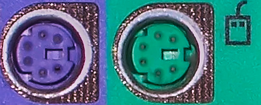
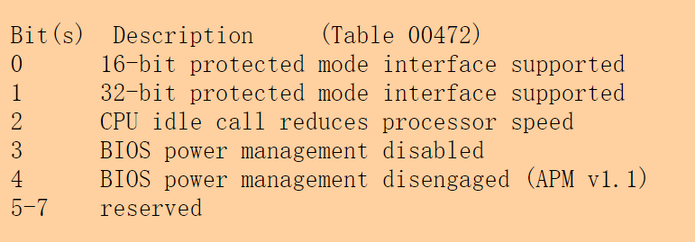
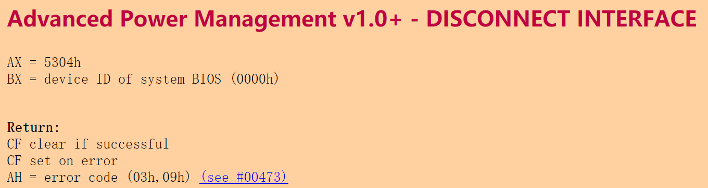

```start_of_setup:
start_of_setup:
# Bootlin depends on this being done early
	movw	$0x01500, %ax    # ah =15 
	movb	$0x81, %dl       # 第2个硬盘的驱动器号
	int	$0x13
```

在基本 Int13H 调用中, 0 - 0x7F之间的驱动器号代表可移动驱动器0x80 - 0xFF 之间的驱动器号代表固定驱动器. 但在扩展 Int13H调用中0x80 - 0xFF 之间还包括一些新出现的可移动驱动器, 比如活动硬盘等.这些驱动器支持先进的锁定,解锁等功能.

检查系统是否存在第2 个硬盘，如果不存在则第2 个表清零

````#ifdef SAFE_RESET_DISK_CONTROLLER
#ifdef SAFE_RESET_DISK_CONTROLLER
# Reset the disk controller.
	movw	$0x0000, %ax
	movb	$0x80, %dl
	int	$0x13  # 重置磁盘控制器
#endif
````

一个历史遗留的产物。在上述代码中我们看到如果预定义了宏SAFE_RESET_DISK_CONTROLLER，那么将调用BIOS中断例程0x13重置磁盘控制器。而这仅仅只是针对老式硬盘的代码，目前的硬盘并不需要执行这些指令，留着它仅仅是为了兼容老式硬盘，因此内核文件中并未预定义这个宏。


```````
# Set %ds = %cs, we know that SETUPSEG = %cs at this point
	movw	%cs, %ax		# aka SETUPSEG
	movw	%ax, %ds
# Check signature at end of setup
	cmpw	$SIG1, setup_sig1      # 0xAA55
	jne	bad_sig

	cmpw	$SIG2, setup_sig2
	jne	bad_sig

	jmp	good_sig1
```````

setup_sig1与setup_sig2都放在setup的最后,作用是防止引导程序LILO加载setup不完整，这儿用软盘启动，不担心这个,直接跳到good_sig1去

```
good_sig1:
	jmp	good_sig
```


```
DELTA_INITSEG = SETUPSEG - INITSEG	# 0x0020
```


```
good_sig:
	movw	%cs, %ax			# aka SETUPSEG
	subw	$DELTA_INITSEG, %ax 		# 
	movw	%ax, %ds
# Check if an old loader tries to load a big-kernel
	testb	$LOADED_HIGH, %cs:loadflags	# Do we have a big kernel?
	jz	loader_ok			# No, no danger for old loaders.

	cmpb	$0, %cs:type_of_loader 		# Do we have a loader that
						# can deal with us?
	jnz	loader_ok			# Yes, continue.

	pushw	%cs				# No, we have an old loader,
	popw	%ds				# die. 
	lea	loader_panic_mess, %si
	call	prtstr

	jmp	no_sig_loop
```

```
bootsect_helper:
	cmpw	$0, %cs:bootsect_es       # cs:bootsect_es 在编译时被静态的设置为0。因此 										      #	bootsect 第一次调用这个子程序时(当时还未开始读内核) ， 										# 不会转到bootsect_second。 以后调用时，该处的值已是 									  #	0x1000，所以会直接转到 bootsect_second。
	jnz	bootsect_second               # cs:bootsect_es != 0时直接跳到bootsect_second 处执行 
	movb	$0x20, %cs:type_of_loader
	movw	%es, %ax   				   # es=0x1000
	shrw	$4, %ax                    # ax=es=0x1000,ah=0x10,因此 shrw ax 后，ah=1
	movb	%ah, %cs:bootsect_src_base+2  # 将 cs:bootsect_src_base 处的值设置为 0x10000,这											 # 个值将保持不变

	movw	%es, %ax                      # ax=es=0x1000=SYSSEG
	movw	%ax, %cs:bootsect_es          # cs:bootsect_es=es=0x1000,这个值也将保持不变
	subw	$SYSSEG, %ax				  # ax=0，可看作是(已转移的内核总字节数/16)	
	lret					# 返回。 第一次被调用时只做以上的这些工作，并不做内核转移。 以后被调							# 用时就不做这些工作了，而是直接转到bootsect_second
```

``

```
bootsect_src_base:
	.byte	0x00, 0x00, 0x01	# base = 0x010000
	.byte	0x93				# typbyte
	.word	0				    # limit16,base24 =0
```


bootsect_second 从这开始是主体代码。 当读到 0x10000 处的内核达到 64K 的话， 就调用 0x15 号功能将 0x10000 处 的 64K 移到扩展内存(0x100000 处)

```
bootsect_second:
	pushw	%cx
	pushw	%si
	pushw	%bx
	testw	%bx, %bx			# 当bootsect读满一个段时，bx会被重置为0
	jne	bootsect_ex             # 当读入而尚未转移的内核达到64K时才实施转移(bx=0 时)；否则不转
								# 移而跳到bootsect_ex 处，那里把ax赋值为已转移到0x100000
								# 的内核字节数后就返回(当>=syssize 时,返回bootsect 中后
								# 还会继续返回；否则返回后会继续从磁盘读，直至读满64K 为止)
	movw	$0x8000, %cx		# full 64K, INT15 moves words
								# 满64K 时, 即调用int 0x15 进行转移；cx 为转
                                # 移的双字节数，即转移0x8000*2=0x10000 字节
	pushw	%cs
	popw	%es
	movw	$bootsect_gdt, %si
	movw	$0x8700, %ax     # ah=0x87,es:si指向gdt表(这里是bootsect_gdt),cx=待转移的双字节数
	int	$0x15                # 这个gdt 中包含目标地址和源地址的描述符
	jc	bootsect_panic		 # 转移失败则跳到bootsect_panic执行

	movw	%cs:bootsect_es, %es		# 每次转移64K结束后，es始终恢复为0x1000。这就使每次转										 # 移64K后，返回bootsect后还从磁盘读入64K到0x10000
	incb	%cs:bootsect_dst_base+2		# 目标基地址增加0x10000
	
bootsect_ex:
	movb	%cs:bootsect_dst_base+2, %ah
	shlb	$4, %ah				# we now have the number of
						        # moved frames in %ax
	xorb	%al, %al
	popw	%bx
	popw	%si
	popw	%cx
	lret	         # 返回到bootsect中
```

这里说明一下。movb % cs:bootsect_dst_base +2, % ah以后,ah 的初始值为0x10;     shlb $4,%ah 后是0x100,那么ax 初始值是0x0000(最高位“溢出”了)以后目标地址每次增加0x10000,ah 每次会增加1， 经过左移后,ax 每次增加0x1000,正好是(已转移到扩展内存的内核字节数/16)


````
bootsect_gdt:
	.word	0, 0, 0, 0
	.word	0, 0, 0, 0
````


在启动阶段， CPU 运行于实地址模式下， 只能借助(16 位段寄存器:16 位逻辑地址) 的模式访问不高于1MB 的内存， int0x15 的0x87 号功能实际是借助了保护模式的访存能力把内核数据移动到扩展内存中的， 因此在调用前预先设置了GDT 中的两个段描述符， 一个段描述符是指向源地址0x10000， 这是
不变的； 另一个目标段描述符的基址bootsect_dst_base 指向目标地址0x100000， 每次移完0x10000 字节后， 目标段址也后移0x10000， 两个段长度都被预设为0x10000 (每次移动64KB 的内存块)。当读内核循环结束后， bzImage 的自解压内核映像就位于内存0x100000 处。


````
l@ubuntu:~$ dmesg | grep e820
[    0.000000] e820: BIOS-provided physical RAM map:
[    0.000000] BIOS-e820: [mem 0x0000000000000000-0x000000000009e7ff] usable
[    0.000000] BIOS-e820: [mem 0x000000000009e800-0x000000000009ffff] reserved
[    0.000000] BIOS-e820: [mem 0x00000000000dc000-0x00000000000fffff] reserved
[    0.000000] BIOS-e820: [mem 0x0000000000100000-0x00000000bfecffff] usable
[    0.000000] BIOS-e820: [mem 0x00000000bfed0000-0x00000000bfefefff] ACPI data
[    0.000000] BIOS-e820: [mem 0x00000000bfeff000-0x00000000bfefffff] ACPI NVS
[    0.000000] BIOS-e820: [mem 0x00000000bff00000-0x00000000bfffffff] usable
[    0.000000] BIOS-e820: [mem 0x00000000f0000000-0x00000000f7ffffff] reserved
[    0.000000] BIOS-e820: [mem 0x00000000fec00000-0x00000000fec0ffff] reserved
[    0.000000] BIOS-e820: [mem 0x00000000fee00000-0x00000000fee00fff] reserved
[    0.000000] BIOS-e820: [mem 0x00000000fffe0000-0x00000000ffffffff] reserved
[    0.000000] BIOS-e820: [mem 0x0000000100000000-0x0000000191bfffff] usable
[    0.000000] e820: update [mem 0x00000000-0x00000fff] usable ==> reserved
[    0.000000] e820: remove [mem 0x000a0000-0x000fffff] usable
[    0.000000] e820: last_pfn = 0x191c00 max_arch_pfn = 0x400000000
[    0.000000] e820: update [mem 0xc0000000-0xffffffff] usable ==> reserved
[    0.000000] e820: last_pfn = 0xc0000 max_arch_pfn = 0x400000000
[    0.000000] e820: [mem 0xc0000000-0xefffffff] available for PCI devices
[    0.619424] e820: reserve RAM buffer [mem 0x0009e800-0x0009ffff]
[    0.619426] e820: reserve RAM buffer [mem 0xbfed0000-0xbfffffff]
[    0.619426] e820: reserve RAM buffer [mem 0x191c00000-0x193ffffff]

````




**PS/2接口**是一种[PC兼容型](https://zh.wikipedia.org/wiki/PC相容型)电脑系统上的接口，可以用来链接[键盘](https://zh.wikipedia.org/wiki/鍵盤)及[鼠标](https://zh.wikipedia.org/wiki/滑鼠)。PS/2的命名来自于1987年时IBM所推出的[个人电脑](https://zh.wikipedia.org/wiki/個人電腦)：[PS/2](https://zh.wikipedia.org/wiki/PS/2)系列。PS/2鼠标连接通常用来取代旧式的序列鼠标接口（[DB-9](https://zh.wikipedia.org/w/index.php?title=DB-9&action=edit&redlink=1) [RS-232](https://zh.wikipedia.org/wiki/RS-232)）；而PS/2键盘连接则用来取代为[IBM PC/AT](https://zh.wikipedia.org/wiki/IBM_PC/AT)所设计的大型5-pin [DIN接口](https://zh.wikipedia.org/wiki/DIN连接器)。PS/2的键盘及鼠标接口在电气特性上十分类似，其中主要的差别在于键盘接口需要双向的沟通。在早期如果对调键盘和鼠标的插槽，大部分的台式机[主板](https://zh.wikipedia.org/wiki/主機板)不能将其正确识别。现在已经出现共享接口，能够随意插入键盘或鼠标并正确识别处理。

目前PS/2接口已经慢慢的被[USB](https://zh.wikipedia.org/wiki/通用序列匯流排)所取代，只有少部分的[台式机](https://zh.wikipedia.org/wiki/桌上型電腦)仍然提供完整的PS/2[键盘](https://zh.wikipedia.org/wiki/鍵盤)及[鼠标](https://zh.wikipedia.org/wiki/滑鼠)接口，少部分机器则已无PS/2，大部分的机器仅提供一组[键盘](https://zh.wikipedia.org/wiki/鍵盤)及[鼠标](https://zh.wikipedia.org/wiki/滑鼠)可以共享之PS/2接口或是仅可供[键盘](https://zh.wikipedia.org/wiki/鍵盤)使用。有些鼠标及键盘可以使用转换器将接口由USB转成PS/2，亦有可从USB分接成键盘鼠标用PS/2接口的转接线。不过，由于USB接口对键盘无特殊调整下最大只能支持6键无冲突，而PS/2键盘接口可以支持所有按键同时而无冲突。[[1/]](https://zh.wikipedia.org/wiki/PS/2接口#cite_note-1)[[2/]](https://zh.wikipedia.org/wiki/PS/2接口#cite_note-2)因此大部分主板PS/2键盘连接端口仍然被保留，或是仅保留一组PS/2[键盘](https://zh.wikipedia.org/wiki/鍵盤)及鼠标都可共享之PS/2端口，同时保留[键盘](https://zh.wikipedia.org/wiki/鍵盤)及[鼠标](https://zh.wikipedia.org/wiki/滑鼠)各自单独接口之主板目前已经比较少。

PS/2接口从定义上不支持[热插拔](https://zh.wikipedia.org/wiki/熱插拔)，尽管在实践中，大部分PS/2键盘热插拔可以直接使用，但也应当避免热插拔行为。哪怕设备支持混用键盘鼠标接口，跨接口类型的热插拔一般无法实现，需要重启设备后才能正常工作，这是控制器及操作系统共同导致的。


````
	movw	$0x05300, %ax		   # APM BIOS installation check
	xorw	%bx, %bx               # 设备ID（0 = APM BIOS）
	int	$0x15
	
    cmpw	$0x0504d, %bx		   # Check for "PM" signature
	jne	done_apm_bios			   # No signature, no APM BIOS

	andw	$0x02, %cx			   # Is 32 bit supported?
	je	done_apm_bios			   # No 32-bit, no (good) APM BIOS
	
````

检查是否甚至支持APM，APM（高级电源管理）是由Intel和Microsoft开发的电源管理标准， 该标准允许操作系统控制发送到设备的电量。ACPI取代APM作为操作系统的主要电源管理系统，主要是因为SMP和APM不能很好地融合在一起。[参考文章](http://www.ctyme.com/intr/rb-1394.htm#Table472)


返回值CX的含义如下图




````
	movw	$0x05304, %ax		   # Disconnect first just in case
	xorw	%bx, %bx
	int	$0x15					   # ignore return code
````




	movw	$0x05303, %ax		   # 32 bit connect
	xorl	%ebx, %ebx
	xorw	%cx, %cx			# paranoia :-)
	xorw	%dx, %dx			#   ...
	xorl	%esi, %esi			#   ...
	xorw	%di, %di			#   ...
	int	$0x15
	jc	no_32_apm_bios			# Ack, error. 


````
	movw	%ax,  (66)			# BIOS code segment
	movl	%ebx, (68)			# BIOS entry point offset
	movw	%cx,  (72)			# BIOS 16 bit code segment
	movw	%dx,  (74)			# BIOS data segment
	movl	%esi, (78)			# BIOS code segment lengths
	movw	%di,  (82)			# BIOS data segment length
````


`````
# Redo the installation check as the 32 bit connect
# modifies the flags returned on some BIOSs

	movw	$0x05300, %ax		# APM BIOS installation check
	xorw	%bx, %bx
	xorw	%cx, %cx			# paranoia
	int	$0x15
	jc	apm_disconnect			# error -> shouldn't happen

	cmpw	$0x0504d, %bx		# check for "PM" signature
	jne	apm_disconnect			# no sig -> shouldn't happen

	movw	%ax, (64)			# record the APM BIOS version
	movw	%cx, (76)			# and flags
	jmp	done_apm_bios
`````


## 准备进入保护模式


````
# Now we want to move to protected mode ...
	cmpw	$0, %cs:realmode_swtch   # 偏移地址realmode_swtch处的值是0
	jz	rmodeswtch_normal            # 在这里realmod_swtch实际上是0，所以跳转到rmodeswtch_normal

	lcall	%cs:realmode_swtch

	jmp	rmodeswtch_end

rmodeswtch_normal:
        pushw	%cs
	call	default_switch            # 实际操作是在真正进入保护模式前关闭中断并禁止NMI
	
````

````
default_switch:
	cli					# no interrupts allowed !
	movb	$0x80, %al	# disable NMI for bootup
						# sequence
	outb	%al, $0x70
	lret
````


参考

http://www.uruk.org/orig-grub/mem64mb.html

[Interrupt Jump Table](http://www.ctyme.com/intr/int.htm)

