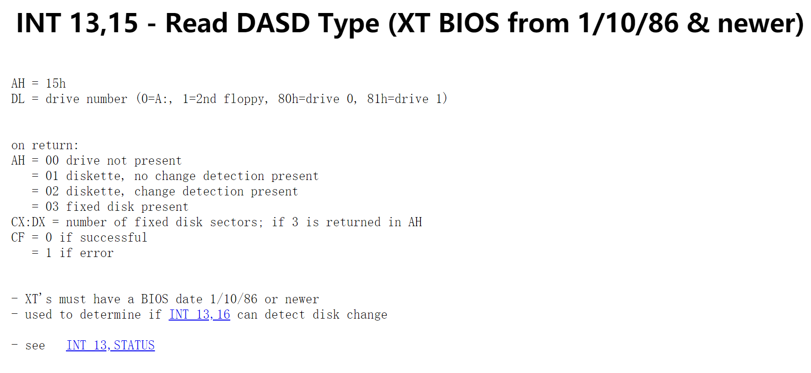
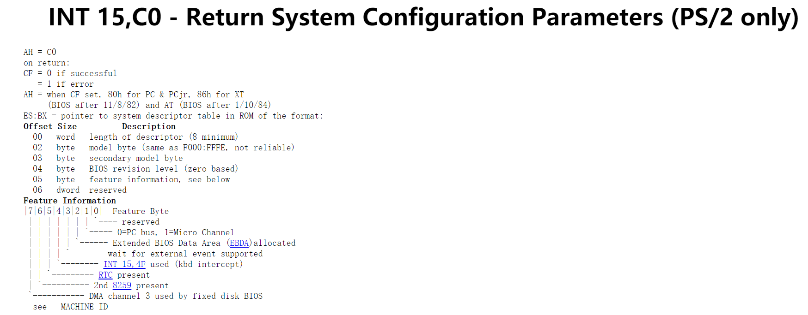

第1个硬盘参数表的首地址竟然是中断向量0x41 的向量值！而第2 个硬盘参数表紧接第1 个表的后面， 0x90080 处存放第1 个硬盘的表，0x90090 处存放第2 个硬盘的表。

```
# 第一个磁盘信息在0x9000:0x0080的位置
# Get hd0 data...
	xorw	%ax, %ax          		# ax 清0
	movw	%ax, %ds          		# ds = 0
	ldsw	(4 * 0x41), %si   		# 取中断向量0x41 的值,ds:4 * 0x41内存所在的值 -> si,
	movw	%cs, %ax				# cs=0x9020,即ax = 0x9020
	subw	$DELTA_INITSEG, %ax		# ax = 0x9000
	pushw	%ax
	movw	%ax, %es				# 0x9000 -> es
	movw	$0x0080, %di            # 0x0080 -> di
	movw	$0x10, %cx 				# 0x10 -> cx,一个硬盘信息占据16字节
	pushw	%cx                      
	cld
	rep
 	movsb                           # ds:si -> es:di, 即0:si ->  0x9000:di 
```

把第一个磁盘参数表从 4 * 0x41 的物理地址复制到 0x90080 物理地址处。


````
# 第二个磁盘参数在 	0x9000:0x0090这个位置
# Get hd1 data...
	xorw	%ax, %ax                # ax清0
	movw	%ax, %ds				# ds = 0
	ldsw	(4 * 0x46), %si         # 第二个磁盘信息的位置
	popw	%cx                     # cx = 0x10 
	popw	%es                   	# es = 0x9000
	movw	$0x0090, %di            # 
	rep
	movsb                           # ds:si -> es:di, 即0:si ->  0x9000:di
	
````

把第二个磁盘参数表从 4 * 0x46 的物理地址复制到 0x90090 物理地址处。

由此可见Linux 2.4.0最多吃支持2个磁盘，每个磁盘参数表是16字节

```
	movw	$0x01500, %ax           # 
	movb	$0x81, %dl
	int	$0x13
	jc	no_disk1                    # 没有第二个磁盘跳转到no_disk1
	
	cmpb	$3, %ah      
	je	is_disk1   					# 是磁盘就跳转到 is_disk1  
	
```



第二个磁盘不一定存在，没有就跳转到no_disk1标号处。


````
# 把第二个磁盘信息清0
no_disk1:
	movw	%cs, %ax				# cs = 0x9020,即ax = 0x9020
	subw	$DELTA_INITSEG, %ax 	# ax = 0x9000
	movw	%ax, %es				# 0x9000 -> es
	movw	$0x0090, %di			# 0x0090 -> di
	movw	$0x10, %cx              # 循环16次
	xorw	%ax, %ax                # ax清0
	cld								# 向高地址操作
	rep
	stosb							# 把al中的值复制到es:di中
````

没有第二个磁盘，就把0x9000 : 00x0090处的数据清0，一共16个字节。

 

`````
is_disk1:
# check for Micro Channel (MCA) bus
	movw	%cs, %ax				# cs = 0x9020,即ax = 0x9020
	subw	$DELTA_INITSEG, %ax		# ax = 0x9000
	movw	%ax, %ds				# 0x9000 -> ds
	xorw	%ax, %ax                # ax清0
	movw	%ax, (0xa0)			    # 0 -> ds:0xa0,  set table length to 0
	movb	$0xc0, %ah              # 0xc0 -> ah 
	stc
	int	$0x15				        # moves feature table to es:bx
	jc	no_mca               

	pushw	%ds
	movw	%es, %ax
	movw	%ax, %ds
	movw	%cs, %ax			# aka SETUPSEG
	subw	$DELTA_INITSEG, %ax		# aka INITSEG
	movw	%ax, %es
	movw	%bx, %si
	movw	$0xa0, %di
	movw	(%si), %cx
	addw	$2, %cx				# table length is a short
	cmpw	$0x10, %cx
	jc	sysdesc_ok

	movw	$0x10, %cx			# we keep only first 16 bytes
`````



**微通道架构**或**微通道**总线是[IBM](https://en.wikipedia.org/wiki/IBM)在1987年推出的[专有](https://en.wikipedia.org/wiki/Proprietary_hardware) [16](https://en.wikipedia.org/wiki/16-bit)[位](https://en.wikipedia.org/wiki/32-bit) 或[32位](https://en.wikipedia.org/wiki/32-bit)[并行](https://en.wikipedia.org/wiki/Parallel_communications)计算机[总线](https://en.wikipedia.org/wiki/Bus_(computing))，直到1990年代中期一直用于[PS / 2](https://en.wikipedia.org/wiki/IBM_Personal_System/2)和其他计算机。它的名称通常缩写为“ MCA”，尽管不是IBM。在IBM产品中，它取代了[ISA](https://en.wikipedia.org/wiki/Industry_Standard_Architecture)总线，随后又被[PCI](https://en.wikipedia.org/wiki/Conventional_PCI)总线体系结构取代。


参考：

[INT11](http://www.ctyme.com/intr/rb-0575.htm)

[Interrupt Jump Table](http://www.ctyme.com/intr/int.htm)

https://stanislavs.org/helppc/int_13.html

http://staff.ustc.edu.cn/~xyfeng/research/cos/resources/BIOS/Resources/assembly/int15-c0.html

https://en.wikipedia.org/wiki/Micro_Channel_architecture

