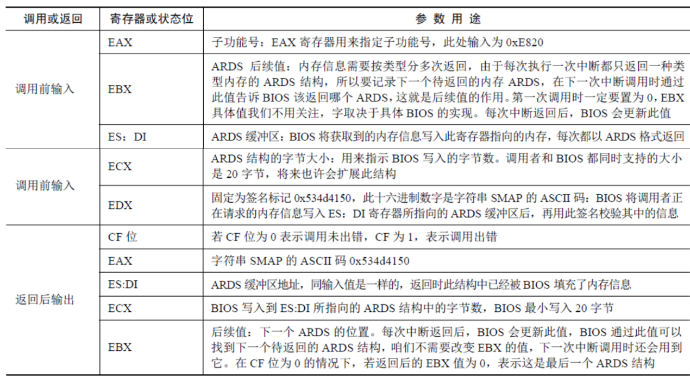

## 概览

由于在booting阶段的绝大部分时间里，主机处于实模式下，而在实模式下，我们通过正常手段能够访问的物理内存最大只能达到1M+64K（在A20 Gate被打开的情况下，否则，最大只能访问1M），所以我们无法直接通过内存访问来获取内存总量。因此，剩下的唯一手段就是通过BIOS中断。

获取机器内存容量的方法一般来讲有三种方法,这三种方法都是基于BIOS INT 15h中断,它们的名称依此为88h，E801h，E820h。


## EAX=0xE820

BIOS 中断 0x15 的子功能0xE820 能够获取系统的内存布局，由于系统内存各部分的类型属性不同，
BIOS 就按照类型属性来划分这片系统内存，所以这种查询呈迭代式，每次BIOS 只返回一种类型的内存信息，直到将所有内存类型返回完毕。子功能0xE820 的强大之处是返回的内存信息较丰富，包括多个属性字段，所以需要一种格式结构来组织这些数据。内存信息的内容是用地址范围描述符来描述的，用于存储这种描述符的结构称之为地址范围描述符（Address Range Descriptor Structure，ARDS）,此方法只能在实模式下使用。


此结构中的字段大小都是4 字节，共5 个字段，所以此结构大小为20 字节。每次int 0x15 之后，BIOS
就返回这样一个结构的数据。注意，ARDS 结构中用64 位宽度的属性来描述这段内存基地址（起始地址）及其长度，所以表中的基地址和长度都分为低32 位和高32 位两部分。

其中的 Type 字段用来描述这段内存的类型，这里所谓的类型是说明这段内存的用途，即其是可以被
操作系统使用，还是保留起来不能用。Type 字段的具体意义见表


如下一些原因造成BIOS将某个内存段标记为 AddressRangeReserved:

- 这个地址范围包含着系统ROM；

- 这个地址范围包含着被ROM使用的RAM；

- 这个地址范围被用作系统设备内存映射；

- 这个地址范围由于某种原因,不适合被标准设备用作设备内存空间。

  

BIOS 中断只是一段函数例程，调用它就要为其提供参数，现在介绍下BIOS 中断0x15 的0xe820 子
功能需要哪些参数。



一定注意,只有这个EBX为0,并且CF没有进位的时候,才表示这是最后一个地址范围描述符。


````
movb	%al, (E820NR)          # E820NR = 0x1e8,  al ->ds:0x1e8 ,即 0 -> 0x9000:0x1e8
							   # 把0放在这个内存地址是为了后面累计有多少个ARDS
#define SMAP  0x534d4150       # ascii 'SMAP'，一根魔数，探测成功后eax就是这个值

meme820:
	xorl	%ebx, %ebx			# ebx清0
	movw	$E820MAP, %di		# 0x2d0 -> di
	
jmpe820:
	movl	$0x0000e820, %eax	# e820, upper word zeroed
	movl	$SMAP, %edx			# ascii 'SMAP'
	movl	$20, %ecx			# size of the e820rec
	pushw	%ds					# ds = 0x9000
	popw	%es					# es = 0x9000
	int	$0x15					# 缓冲区es:di，把返回的查询值放入到物理地址0x902d0中。
	jc	bail820					# fall to e801 if it fails
	
	cmpl	$SMAP, %eax			# check the return is `SMAP'
	jne	bail820					# fall to e801 if it fails

good820:
	movb	(E820NR), %al		#  0x9000:0x1e8这个内存位置的值初始化为0，为累加做好准备
	cmpb	$E820MAX, %al       #  E820MAX = 32，最大支持32个地址范围描述符
	jnl	bail820

	incb	(E820NR)             # 累加一次
	movw	%di, %ax   			 # di -> ax
	addw	$20, %ax			 # ax累加20个字节，即下一个内存位置
	movw	%ax, %di             # 下一个内存位置
again820:
	cmpl	$0, %ebx			 # 检查有没有探测完
	jne	jmpe820				     # ebx不为0，继续探测
````

这个Linux 2.4.0 内核版本**arch/i386/boot/setup.S**中的代码，探测出的内存按照每个20字节放在内存 0x902d0的位置，最多32个，0x9000:0x1e8这个地址的内存值是ARDS的数量。记住这个内存地址，后面内核需要用到。


## AX=0xE801

0xE801最大只能识别4 GB 内存，不过这对咱们32 位地址总线足够了。稍微有点不便的是此方法检测到的内存是分别存放到两组寄存器中的。低于15 MB 的内存以1 KB 为单位大小来记录，单位数量在寄存器AX 和 CX 中记录，其中AX 和 CX 的值是一样的，所以在15 MB 空间以下的实际内存容量=AX 1024。AX、CX 最大值为0x3c00，即0x3c00 * 1024=15 MB。16 MB～4 GB 是以64 KB 为单位大小来记录的，单位数量在寄存器BX 和DX 中记录，其中 BX 和 DX 的值是一样的，所以16 MB 以上空间的内存实际大小=BX * 64 * 1024，不用在意 BX 和 DX 最大值是多少。此方法只能在实模式下使用。


中断返回后，AX 和CX 中，其值的单位是1KB，而BX 和DX 的单位是64KB。

	meme801:
		movw	$0xe801, %ax
		int	$0x15
		jc	mem88
		andl	$0xffff, %edx			# clear sign extend
		shll	$6, %edx			    # 64 * edx表示多少KB的内存，后面还需要*1024才能表示字节	
		movl	%edx, (0x1e0)			# 放在 0x9000:0x1e0的内存位置
		andl	$0xffff, %ecx			# clear sign extend 
		addl	%ecx, (0x1e0)			# ecx最大只有15MB，ecx里的内存值是多少KB，
										# 加上0x9000:0x1e0内存值，就是总内存

这个Linux 2.4.0 内核版本**arch/i386/boot/setup.S**中的代码


## AH=0x88

0x88方法是在Intel 80286出现的那天起就存在的，后续的PC及其兼容机为了保持向下兼容，都继续保留了这种方法。因此，这种方法在所有的IBM PC及其兼容机上都存在，所以看起来，booting只需要这种方法就可以获取物理内存总量，其它两种方法似乎没有存在的必要。但事实上，这种方法存在一个重要的缺陷，由于这种方法是在16-bit时代就存在的，所以，它通过16-bit寄存器来保存内存容量作为返回值。但16-bit所能够表示的最大值是64 KB。由于这种方法的返回值是以KB为单位，所以它能够表示的系统最大物理内存容量为64 MB，实际内存超过此容量也按照64 MB 返回。而对于今天的PC机来说，64 MB已经是很低的内存配置了，大多数PC机的实际物理内存配置都大于64 MB。此方法只能在实模式下使用。

即使内存容量大于64 MB，也只会显示63 MB，因为此中断只会显示1 MB之上的内存，不包括这1 MB


````
	movb	$0x88, %ah
	int	$0x15
	movw	%ax, (2)
	
````

这个Linux 2.4.0 内核版本**arch/i386/boot/setup.S**中的代码，将探测的内存值放在了0x9000:2这个地址内存。


## Q&A

- “实际物理内存”和“检测到的内存大小”，它们之间总是差1 MB？

很多问题都是祖上传下来的，即著名的历史遗留问题。80286 拥有24 位地址线，其寻址空间是16 MB。当时有一些ISA 设备要用到地址15 MB 以上的内存作为缓冲区，也就是此缓冲区为1 MB 大小，所以硬件系统就把这部分内存保留下来，操作系统不可以用此段内存空间。保留的这部分内存区域就像不可以访问的黑洞，这就成了内存空洞memory hole。现在虽然很少很少能碰到这些老ISA 设备了，但为了兼容，这部分空间还是保留下来，只不过是通过BIOS 选项的方式由用户自己选择是否开启。


参考

https://docs.huihoo.com/gnu_linux/own_os/booting-memory_check_6.htm

