## 集合

$$
N=\{0,1,2,\cdots,n,\cdots\}\\
N^{+}=\{1,2,\cdots,n,\cdots\}\\
Z=\{\cdots,-n,\cdots,-2,-1,0,1,2,\cdots,n,\cdots\}\\
Q=\{\frac{p}{q}|p\in Z,q \in N^{+},且p与q互质\}
$$

## 极限

$$
如果\lim\ f(x)=A,\lim \ g(x)=B,那么\\
\lim[f(x) \pm g(x)]=\lim\ f(x) \pm \lim\ g(x)\\
\lim[f(x) \cdot g(x)]=\lim\ f(x) \cdot \lim\ g(x)\\
\lim\ \frac{f(x)}{g(x)}=\frac{\lim\ f(x)}{\lim\ g(x)}=\frac{A}{B},B \neq0\\
\lim[cf(x)]=c\ \lim\ f(x)\\
\lim[f(x)]^{n}=[\lim\ f(x)]^{n}
$$

## 函数的连续性

$$
设函数y=f(x)在点x_0的某处领域内有定义，如果\\
\lim^{}_{\Delta{x} \to 0}\Delta{y}=\lim^{}_{\Delta{x} \to 0}[f(x_0+\Delta{x})-f(x_0)]=0 或者\\

\lim_{x \to x_0}f(x)=f(x_0)
$$

### 左连续

$$
x从x_0左侧趋于x_0\  \lim_{x \to x^-_0}=f(x^-_0)
$$

### 右连续

$$
x从x_0右侧趋于x_0 \lim_{x \to x^+_0}=f(x^+_0)
$$

## 导数

$$
f^{'}(x_0)=\lim_{\Delta{x} \to 0} \frac{\Delta{y}}{\Delta{x}}=\lim_{\Delta{x} \to 0} \frac{f(x_0+\Delta{x}) - f(x_0)}{\Delta{x}}\\
也可以记作y^{'}|_{x=x_0}, \frac{dy}{dx}|_{x=x_0},
\frac{df(x)}{dx}|_{x=x_0}
$$

### 常见函数导数

$$
幂函数f(x)=x^{\mu}的导数 f^{'}(x)=\mu{x}^{\mu -1}
$$

$$
正弦函数f(x)=\sin{x}的导数f^{'}(x)=\cos{x}\\
余弦函数f(x)=\cos{x}的导数f^{'}(x)=-\sin{x}\\
正切函数f(x)=\tan{x}的导数f^{'}(x)=\frac{1}{\cos^{2}{x}}=\sec^{2}{x}
$$

$$
指数函数f(x)=a^{x}的导数f^{'}(x)=a^{x}\ln{a}\\
特别的(e^{x})^{'}=e^{x}
$$

$$
对数函数f(x)=\log_{a}{x}的导数f^{'}(x)=\frac{1}{x\ln{a}}
$$

极限存在的充分必要条件是左、右极限都存在且相等，**因此在某点可导的充分必要条件也是左右极限存在且相等**。

### 求导法则

$$
[u(x)\pm v(x)]^{'}=u^{'}(x)\pm v^{'}(x)\\
[u(x)\cdot v(x)]^{'}=u^{'}(x)\cdot v(x)+v^{'}(x)\cdot u(x)\\
[\frac{u(x)}{v(x)}]^{'}=\frac{u^{'}(x)\cdot v(x) - v^{'}(x)\cdot u(x)}{v^{2}(x)}
$$

### 复合函数求导

$$
如果u=g(x)在点x可导，而y=f(u)在点u=g(x)可导，则复合函数y=f(u)=f(g(x))在点x可导，导函数为\\
\frac{dy}{dx}=f^{'}(u)\cdot{u^{'}}=f^{'}(u)\cdot{g^{'}(x)}
$$

证明：
$$
由于y=f(u)在点u可导，因此\\
\lim_{\Delta{u} \to 0} \frac{\Delta{y}}{\Delta{u}}=f^{'}(u)\\
\frac{\Delta{y}}{\Delta{u}}=f^{'}(u)+\alpha, \ \alpha为无穷小的值\\
\therefore \Delta{y}=\Delta{u} f^{'}(u) + \Delta{u}\alpha\\
\therefore \frac{\Delta{y}}{\Delta{x}} = f^{'}(u)\frac{\Delta{u}}{\Delta{x}}+\alpha\frac{\Delta{u}}{\Delta{x}}\\
\therefore \lim_{\Delta{x} \to 0}\frac{\Delta{y}}{\Delta{x}}=
\lim_{\Delta{x}\to 0}[f^{'}(u)\frac{\Delta{u}}{\Delta{x}}+\alpha\frac{\Delta{u}}{\Delta{x}}]\\
\because \lim_{\Delta{x} \to 0}\frac{\Delta{u}}{\Delta{x}}=g^{'}(x)\\
\therefore \lim_{\Delta{x} \to 0}\frac{\Delta{y}}{\Delta{x}}=f^{'}(u) \cdot g^{'}(x)
$$

## 高阶导数

$$
y^{''}=(y^{'})^{'}或 、\frac{d^{2}y}{dx^{2}}=\frac{d}{dx}(\frac{dy}{dx})
$$

$$
y=\sin{x}的n阶导数\\
y^{'}=\cos{x}=\sin(x+\frac{\pi}{2})\\
y^{''}=\cos(x+\frac{\pi}{2})=\sin(x+\frac{\pi}{2}+\frac{\pi}{2})=
\sin(x+2\cdot\frac{\pi}{2})\\
y^{'''}=\cos(x+2\cdot\frac{\pi}{2})=\sin(x+3\cdot\frac{\pi}{2})\\
y^{(4)}=\cos(x+3\cdot\frac{\pi}{2})=\sin(x+4\cdot\frac{\pi}{2})\\
\therefore y^{(n)}=\sin(x+n\cdot\frac{\pi}{2})\\
(\sin{x})^{(n)}=\sin(x+n\cdot\frac{\pi}{2})\\
类似的 (\cos{x})^{(n)}=\cos(x+n\cdot\frac{\pi}{2})\\
$$

$$
(u\pm v)^{(n)}=u^{(n)}\pm v^{(n)}\\
(uv)^{(n)}=u^{(n)}v+nu^{(n-1)}v^{'}+\frac{n(n-1)}{2!}u^{(n-2)}v^{''}+\cdots\\+\frac{n(n-1)\cdots(n-k+1)}{k!}u^{(n-k)}v^{(k)}+\cdots+uv^{(n)}\\=\sum^{n}_{k=0}C^{k}_{n}u^{(n-k)}v^{(k)}
$$

## 隐函数求导

$$
求方程 e^{y}+xy-e=0的导数\frac{dy}{dx}\\
解：\frac{d}{dx}(e^{y}+xy-e) = 0\\
\frac{d}{dx}(e^{y})+\frac{d}{dx}(xy)=0\\
\because y是一个关于x的函数，对e^{y}求导就是复合函数求导\\
\therefore (e^{y})^{'}=e^{y}\cdot y^{'}=e^{y}\cdot\frac{dy}{dx}\\
\therefore e^{y}\cdot\frac{dy}{dx} + y+ x\cdot \frac{dy}{dx} = 0\\
\therefore \frac{dy}{dx} = -\frac{y}{e^{y}+x} ,e^{y}+x \neq0
$$

## 参数方程导数

$$
\left\{ 
\begin{array}{c}
x= \varphi(t)\\
y=\psi(t)
\end{array}
\right.
$$

$$
\frac{dy}{dx}=\frac{\psi^{'}(t)}{\varphi^{'}(t)}
$$

$$
\frac{d^{2}y}{dx^{2}}=\frac{d}{dx}(\frac{dy}{dx})=\frac{d}{dt}(\frac{\psi^{'}(t)}{\varphi^{'}(t)})\cdot\frac{dt}{dx}=
\frac{\psi^{''}(t)\cdot\varphi^{'}(t) - \varphi^{''}(t)\psi^{'}(t)}{\varphi^{'2}(t)}\cdot\frac{1}{\varphi^{'}(t)}\\
=\frac{\psi^{''}(t)\cdot\varphi^{'}(t) - \varphi^{''}(t)\psi^{'}(t)}{\varphi^{'3}(t)}
$$

## 函数的微分

一般的，如果函数y=f（x）满足一定条件，则增量可以表示
$$
\Delta{y}=A\Delta{x}+o(\Delta{x})
$$

$$
微分 dy=f^{'}(x_0)\Delta{x}
$$

$$
函数的微分dy=f^{'}(x)\cdot\Delta{x}是函数的增量\Delta{y}的近似表达式，\\
一般来说，以dy近似代替\Delta{y}时所产生的误差只有当\Delta{x} \to 0时才趋于零
$$

## 泰勒公式

$$
f(x)=f(x_0)+f^{'}(x_0)(x-x_0)+\frac{f^{''}(x_0)}{2!}(x-x_0)^{2}+\cdots+\frac{f^{(n)}(x_0)}{n!}(x-x_0)^{n}+R_{n}(x)
$$

$$
R_n(x)=\frac{f^{(n+1)}(\xi)}{(n+1)!}(x-x_0)^{n+1}，\xi 是x与x_0之间的某个值
$$

## 曲线的凹凸性与拐点

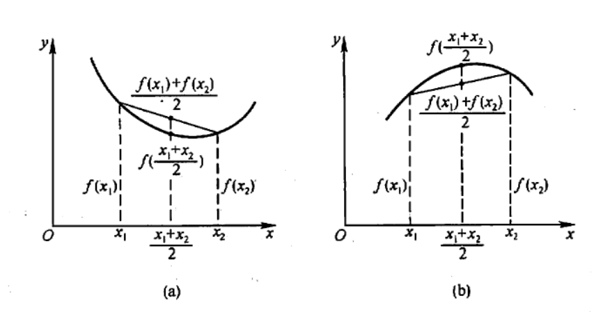

$$
一般的，设y=f(x)在区间I上连续，x_0是I的内点，如果曲线y=f(x)在经过点(x_0,f(x_0))时，\\
曲线的凹凸性改变了，那么称点(x_0,f(x_0))为这曲线的拐点
$$

## 曲率

### 微弧分公式

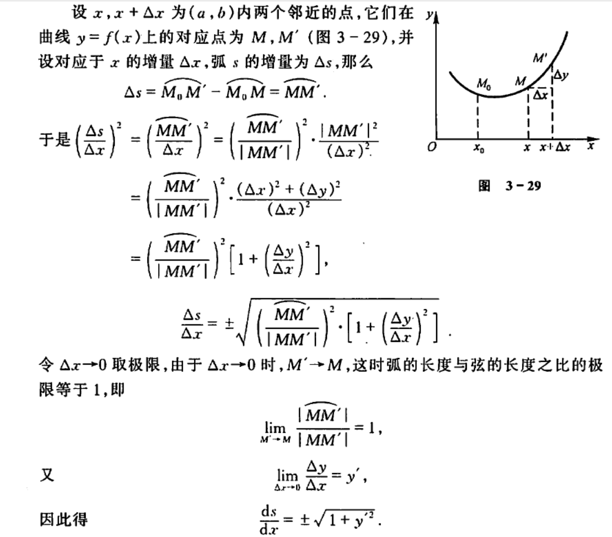

$$
弧s与x之间的关系s=s(s)\\
ds=\sqrt{1+y^{'2}}\cdot dx
$$

### 曲率K

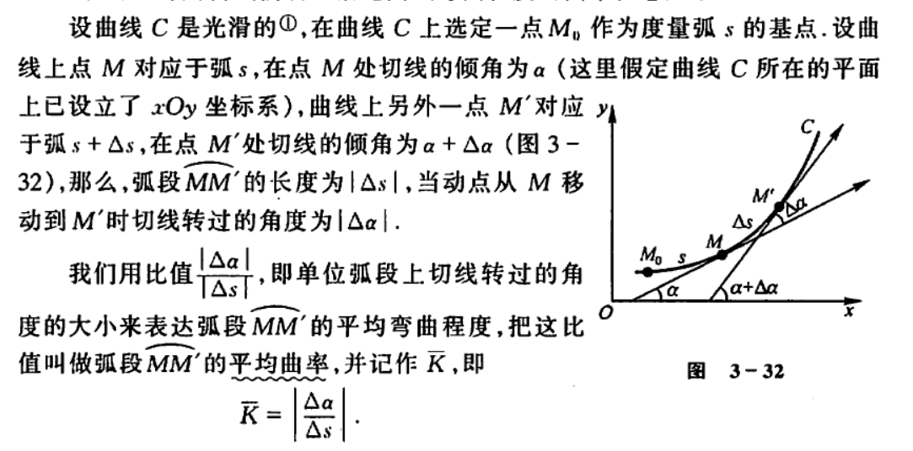
$$
当\Delta \alpha \to 0时，上述平均曲率的极限叫做曲线C在点M的曲率，记作 K=\lim_{\Delta \alpha \to 0} |\frac{\Delta \alpha}{\Delta s}| = |\frac{d\alpha}{ds}|
$$
### 圆的曲率

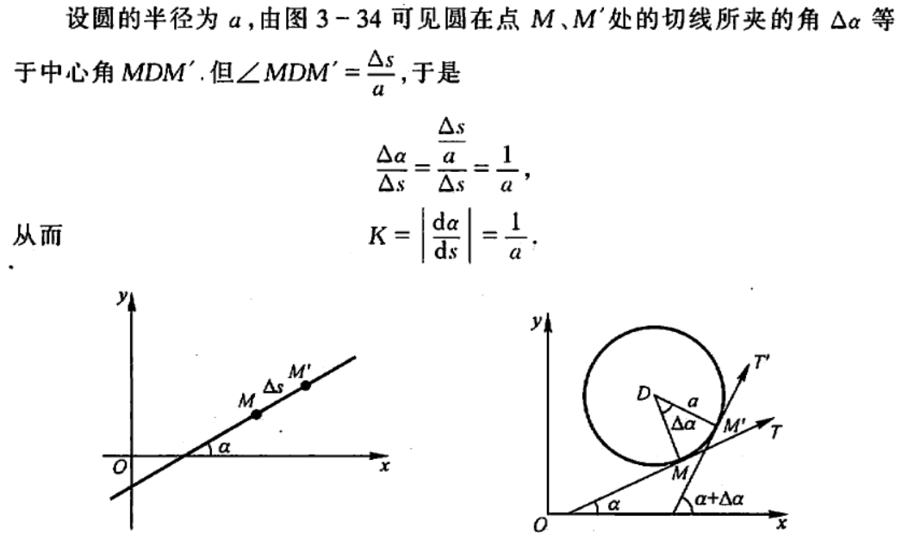

### 一般曲线的曲率

$$
设曲线的直线坐标方程式y=f(x),且f(x)具有二阶导数，因为\tan\alpha=y^{'}\\
所以 \sec^{2}\alpha \frac{d\alpha}{dx}=y^{''}\\
\frac{d\alpha}{dx}=\frac{y^{''}}{1+\tan^{2}{\alpha}}=\frac{y^{''}}{1+y^{'2}}\\
\therefore d\alpha=\frac{y^{''}}{1+y^{'2}} dx\\
\because ds=\sqrt{1+y^{'2}}dx\\
\because K=|\frac{d\alpha}{ds}|\\
\therefore 一般曲线的曲率 K=\frac{|y^{''}|}{(1+y^{'2})^{3/2}}
$$

$$
当|y^{'}| \ll1时，K \thickapprox |y^{''}|,可以 简化问题
$$

### 曲率中心计算

$$
设已知曲线的方程是y=f(x),且其二阶倒数y^{''}在点x不为零，则曲线在应点M(x,y)的曲率中心D(a,b)的坐标为\\

\left\{
\begin{array}{}
a=x-\frac{y^{'}(1+y^{'2})}{y^{''}}\\
b=y+\frac{1+y^{'2}}{y^{''}}
\end{array}
\right.
$$

## 不定积分

$$
在区间I上，函数f(x)的带有任意常数项的原函数称为f(x)在区间I上的不定积分，记作\int{f(x)}dx\\
\int{f(x)}dx=F(x)+C
$$

### 基本积分表

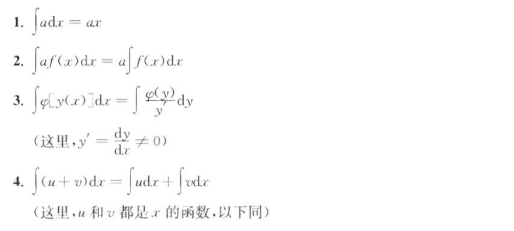

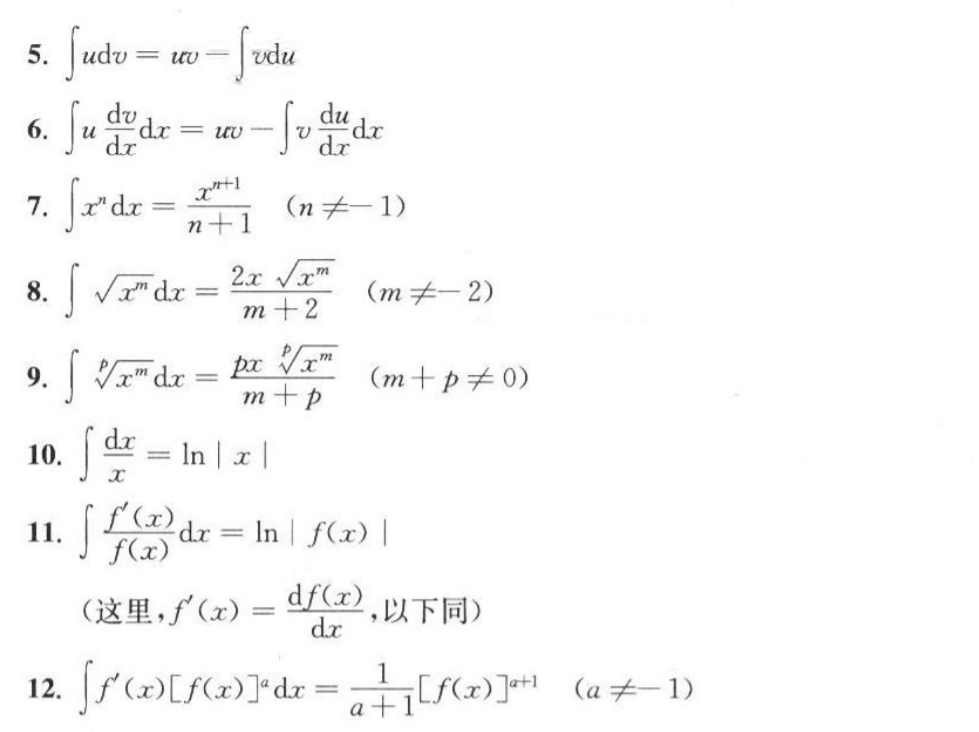

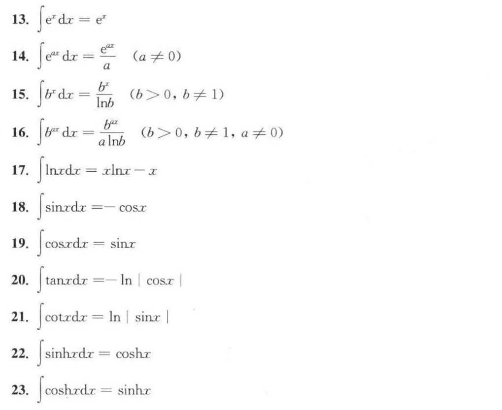

### 性质

$$
\int[f(x)\pm g(x)]dx=\int f(x)dx \pm \int g(x)dx\\
\int {kf(x)}dx=k\int{f(x)}dx\\
$$

### 第一类换元积分

$$
设f(u)具有原函数F(u),即\\
F^{'}(u)=f(u),\int{f(u)}du=F(u)+C\\
如果u是中间变量u=\varphi(x),且设\varphi(x)可微，那么，根据复合函数微分法，有\\
dF(u)=dF[\varphi(x)]=f[\varphi(x)]\varphi^{'}(x)dx\\
那么 \int{f[\varphi(x)]\varphi^{'}(x)}dx=F[\varphi(x)]+C=[\int {f(u)du}]_{u=\varphi(x)}
$$

### 第二类换元法

### 分部积分法

$$
设函数u=u(x)及v=v(x)具有连续函数，那么\\
(uv)^{'}=u^{'}v+v^{'}u\\
v^{'}u = (uv)^{'}-u^{'}v\\
\therefore \int v^{'}u dx=uv-\int{u^{'}v} dx
$$

## 定积分

$$
\int^{b}_{a}f(x)dx=I=\lim_{\lambda \to 0}\sum^{n}_{i=1}f(\xi_{i})\Delta{x_{i}}
$$

## 微积分

$$
\int^{b}_{a}f(x)dx=F(b)-F(a)
$$

## 反常积分

$$
\int^{+\infty}_{a}f(x)dx=\lim_{t \to +\infty}\int^{t}_{a}f(x)dx\\

\int^{b}_{-\infty}f(x)dx=\lim_{t \to -\infty}\int^{b}_{t}f(x)dx
$$

## 微分方程

在许多问题中，往往不能直接找出所需要的函数关系，但是根据问题所提供的情况，有时候可以列出含有要找的函数及其导数的关系式，这样的关系式就是所谓的微分方程。

$$
\frac{dy}{dx}=2x
$$

### 可分离变量的微分方程

一阶微分方程有时候也写成如下的对称形式：
$$
P(x,y)dx+Q(x,y)dy=0
$$
可以转成
$$
\frac{dy}{dx}=-\frac{P(x,y)}{Q(x,y)}, Q(x,y) \neq0
$$
一般的，如果一个一阶微分方程能写成
$$
g(y)dy = f(x)dx
$$
的形式，就是说，能把微分方程写成一端只含y的函数和dy，另一端只含x的函数和dx，那么原方程就称为可分离变量的微分方程。

### 齐次方程

如果一阶微分方程可以化成
$$
\frac{dy}{dx}=\varphi(\frac{y}{x})
$$
的形式，那么就称这方程为齐次方程

在齐次方程中引入未知函数
$$
u=\frac{y}{x}
$$
就可以化简为可分离变量的方程
$$
y=ux,\frac{dy}{dx}=u+x\frac{du}{dx}=\varphi{(u)}\\
$$
分离变量
$$
\frac{du}{\varphi{(u)}-u}=\frac{dx}{x}
$$
两端积分
$$
\int \frac{du}{\varphi{(u)}-u}=\int \frac{dx}{x}
$$

### 可化为齐次方程的方程

方程
$$
\frac{dy}{dx}=\frac{ax+by+c}{a_1x+b_1y+c_1}
$$
当c=c1=0的时候是齐次的，否则不是齐次的，在非齐次的情况下，可以用下面的变化转化为齐次的

令
$$
x=X+h,y=Y+k,h,k是待定的常数
$$
于是
$$
dx=dX，dy=dY
$$

方成就可以化为
$$
\frac{dY}{dX}=\frac{aX+bY+ah+bk+c}{a_1X+b_1Y+a_1h+b_1k+c_1}
$$

如果方程组
$$
\left\{
\begin{array}{x}
ah+bk+c=0\\
a_1h+b_1k+c_1=0
\end{array}
\right.
$$

如果
$$
\left|
\begin{matrix}
a&b\\
a_1&b_1
\end{matrix}
\right | \neq 0,即\frac{a_1}{a} \neq \frac{b_1}{b}
$$

那么可以定出h和k使它们满足上述方程组，这样就可以转化为齐次方程
$$
\frac{dY}{dX}=\frac{aX+bY}{a_1X+b_1Y}
$$

当
$$
\frac{a_1}{a} = \frac{b_1}{b}时，h及k无法求得，因此上述方法不能应用，但这时令\frac{a_1}{a} = \frac{b_1}{b}=\lambda
$$

方程就可以写成
$$
\frac{dy}{dx}=\frac{ax+by+c}{\lambda(ax+by)+c_1}
$$

引入新变量v=ax+by

$$
\frac{dv}{dx}=a+b\frac{dy}{dx} 或 \frac{dv}{dx}=\frac{1}{b}(\frac{dv}{dx}-a)
$$

于是就可以转化为可分离变量的方程
$$
\frac{1}{b}(\frac{dv}{dx}-a)=\frac{v+c}{\lambda v+c_1}
$$

### 一阶线性微分方程

$$
\frac{dy}{dx}+P(x)y=Q(x)
$$

### 伯努力方程

$$
\frac{dy}{dx}+P(x)y=Q(x)y^{n},n\neq0,1
$$

当n=0或者1时，就是线性微分方程

### 可降阶的高阶微分方程

$$
y^{(n)}=f(x)型的微分方程
$$

$$
y^{''}=f(x,y^{'})型的微分方程
$$

$$
y^{''}=f(y,y^{'})型的微分方程
$$

### 高阶线性微分方程

## 向量

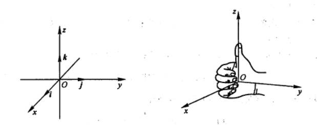

### 方向角与方向余弦

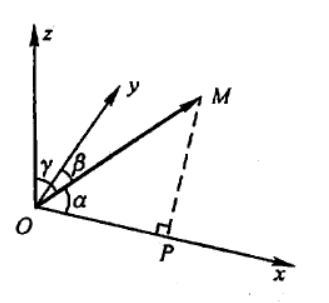

$$
(\cos\alpha,\cos\beta,\cos\gamma)=(\frac{x}{r},\frac{y}{r},\frac{z}{r})
$$

### 数量积

$$
\vec{a}\cdot \vec b=|\vec{a}||\vec{b}|\cos\theta
$$

$$
\cos\theta=\frac{\vec{a} \cdot\vec{b}}{|\vec{a}||\vec{b}|}=
\frac{x_ax_b+y_ay_b+z_az_b}{\sqrt{x_a^{2} + y_a^{2}+z_a^{2}} \cdot\sqrt{x_b^{2} + y_b^{2}+z_b^{2}}}
$$

### 向量积

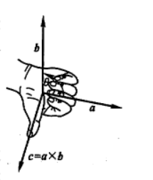

$$
\vec{c}=\vec{a}\times\vec{b}
$$

$$
\vec{a}\times\vec{b}=\left|
\begin{matrix}
i&j&k\\
x_a&y_a&z_a\\
x_b&y_b&z_b\\
\end{matrix}
\right|
$$

## 曲面方程

在空间解析几何中，任何曲面都可以看做点的几何轨迹，在这样的意义下，如果曲面S与三元方程
$$
F(x,y,z)=0
$$
如球面
$$
x^2+y^2+z^2=R^2
$$

## 空间曲线及其方程

空间曲线可以看做两个曲面的交线
$$
\left \{
\begin{array}{}
F(x,y,z)=0\\
G(x,y,z)=0
\end{array}
\right.
$$

## 平面及其方程

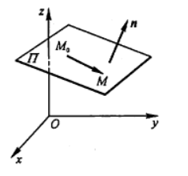

$$
设M(x,y,z)是平面上的任一点，那么向量\vec{M_0M}必与平面的法向量n垂直，即它们的数量积等于零\\
\vec{n}\cdot\vec{M_0M}=0\\
由于\vec{n}=(A,B,C),\vec{M_0M}=(x-x_0,y-y_0,z-z_0)\\
有A(x-x_0)+B(y-y_0)+C(z-z_0)=0
$$

### 平面的夹角

$$
\cos\theta=\frac{|A_1A_2+B_1B_2+C_1C_2|}{\sqrt{A_1^{2}+B_1^{2}+C_1^{2}} \cdot \sqrt{A_2^{2}+B_2^{2}+C_2^{2}}}
$$

### 平面外的一点到平面的距离

$$
d=\frac{|Ax_0+By_0+Cz_0+D|}{\sqrt{A^2+B^2+C^2}}
$$

## 空间直线及其方程

$$
\left\{
\begin{array}{}
A_1x+B_1y+C_1z+D_1=0\\
A_2x+B_2y+C_2z+D_2=0
\end{array}
\right.
$$

### 直线的对称式方程

由于过空间一点可作而且只能作一条直线平行于已知直线，所以当直线L上一点M0(x0,y0,z0)和它的一方向向量s=(m,n,p)为已知时，直线L的位置就完全确定了。
$$
\vec{M_0M}=(x-x_0,y-y_0,z-z_0)与\vec{s}=(m,n,p)对应成比例，\\
从而有

\frac{x-x_0}{m}=\frac{y-y_0}{n}=\frac{z-z_0}{p}
$$

### 两直线的夹角

$$
\cos\varphi=\frac{|m_1m_2+n_1n_2+p_1p_2|}{\sqrt{m^2_1+n^2_1+p^2_1}\cdot \sqrt{m^2_2+n^2_2+p^2_2}}
$$

## 偏导数

$$
设函数z=f(x,y)在点(x_0,y_0)的某一领域内有定义，当y固定在y_0而x在x_0处\\有增量\Delta{x}时，相应的函数有增量f(x_0+\Delta{x},y_0)-f(x_0,y_0),\\
如果\lim_{\Delta \to 0}\frac{f(x_0+\Delta{x},y_0)-f(x_0,y_0)}{\Delta{x}}存在，则称此极限为函数z=f(x,y)在点(x_0,y_0)\\
处的偏导数，记作\frac{\partial{z}}{\partial{x}}|_{x=x_0,y=y_0},\frac{\partial{f}}{\partial{x}}
|_{x=x_0,y=y_0},z_x|_{x=x_0,y=y_0}或f_x(x_0,y_0)
$$

$$
对一元函数来说，\frac{dy}{dx}可看作函数的微分dy与自变量的微分dx之商，而偏导数的记号是一个整体记号，不能看做分子与分母之商
$$

### 高阶偏导数

$$
\frac{\partial} {\partial{x}}(\frac{\partial{z}}{\partial{x}})=\frac{\partial^2{z}}{\partial{x^2}}=f_{xx}(x,y)\\

\frac{\partial} {\partial{y}}(\frac{\partial{z}}{\partial{x}})=\frac{\partial^2{z}}{\partial{x}\partial{y}}=f_{xy}(x,y)\\

\frac{\partial} {\partial{x}}(\frac{\partial{z}}{\partial{y}})=\frac{\partial^2{z}}{\partial{y}\partial{x}}=f_{yx}(x,y)\\
\frac{\partial} {\partial{y}}(\frac{\partial{z}}{\partial{y}})=\frac{\partial^2{z}}{\partial{y^2}}=f_{yy}(x,y)\\
$$

## 全微分

$$
dz=\frac{\partial{z}}{\partial{x}}dx+\frac{\partial{z}}{\partial{y}}dy
$$

## 多元复合函数的求导

### 一元函数与多元函数复合

$$
如果函数u=\varphi(t)及v=\psi(t)都在点t可导，函数z=f(u,v)在对应点(u,v)具有连续偏导数，\\则复合函数z=f[\varphi(t),\psi(t)]在点t可导，且\frac{dz}{dt}=\frac{\partial{z}}{\partial{u}}\frac{du}{dt}+\frac{\partial{z}}{\partial{v}}\frac{dv}{dt}
$$

### 多元函数与多元函数复合

$$
如果函数u=\varphi{(x,y)}及v=\psi{(x,y)}都在点(x,y)具有对x及对y的偏导数,\\
函数z=f(u,v)在对应点(u,v)具有连续偏导数，则复合函数z=f[\varphi{(x,y)},\psi{(x,y)}]\\
在点(x,y)的两个偏导数都存在，且有\\
\frac{\partial{z}}{\partial{x}}=\frac{\partial{z}}{\partial{u}}\frac{\partial{u}}{\partial{x}}+\frac{\partial{z}}{\partial{v}}\frac{\partial{v}}{\partial{x}} \\

\frac{\partial{z}}{\partial{y}}=\frac{\partial{z}}{\partial{u}}\frac{\partial{u}}{\partial{y}}+\frac{\partial{z}}{\partial{v}}\frac{\partial{v}}{\partial{y}}
$$

### 其他情形

$$
如果函数u=\varphi{(x,y)}在点(x,y)具有对x及对y的偏导数，函数v=\psi(y)\\在点y可导，函数z=f(u,v)在对应点(u,v)具有连续偏导数，则复合函数\\z=f[\varphi{(x,y)},\psi(y)]在点(x,y)的两个偏导数都存在，且有\\
\frac{\partial{z}}{\partial{x}}=\frac{\partial{z}}{\partial{u}}\frac{\partial{u}}{\partial{x}}\\
\frac{\partial{z}}{\partial{y}}=\frac{\partial{z}}{\partial{u}}\frac{\partial{u}}{\partial{y}}+\frac{\partial{z}}{\partial{v}}\frac{dv}{dy}
$$

## 多元隐函数求导

## 方向导数与梯度

偏导数反映的是函数沿坐标轴方向的变化率，但是只考虑函数沿坐标轴方向的变化率是不够的。

### 方向导数

$$
\frac{\partial{f}}{\partial{l}}|_{(x_0,y_0)}=f_{x}(x_0,y_0)\cos\alpha+f_{y}(x_0,y_0)\cos\beta
$$

### 梯度

$$
f_{x}(x_0,y_0)i+f_{y}(x_0,y_0)j,这向量称为函数f(x,y)在点P_{0}(x_0,y_0)的梯度，记作 grad \ f(x_0,y_0)\\
或\nabla{f(x_0,y_0)}
$$

$$
其中\nabla=\frac{\partial}{\partial{x}}i+\frac{\partial}{\partial{y}}称为（二维）向量微分算子或Nabla算子\\
\nabla{f}=\frac{\partial{f}}{\partial{x}}i+\frac{\partial{f}}{\partial{y}}j
$$

## 重积分

### 二重积分

$$
设f(x,y)是有界闭区域D上的有界函数，将闭区域D任意分成n个小闭区域\\
\Delta\sigma_{1}，\Delta\sigma_{2，\Delta\sigma_{3}}，\cdots,\Delta\sigma_{n}\\
其中\Delta\sigma_{i}表示第i个小闭区域，也表示它的面积，在每个\Delta\sigma_{i}上任取一点(\xi_{i},\eta_{i}),\\
作乘积f(\xi_{i},\eta_{i})\Delta\sigma_{i},并作和\sum_{i=1}^{n}f(\xi_{i},\eta_{i})\Delta\sigma_{i},如果当各小闭区域的直径中的最大值\lambda趋于零时，\\
这和的极限总存在，则称此极限为函数f(x,y)在闭区域D上的二重积分，记作\\
\iint_{D}{f(x,y)}d\sigma
$$

### 利用直角坐标计算二重积分

#### X型区域

X型区域的特点是：穿过D内部且平行于y轴的直线与D的边界相交不多于两点
$$
设区域D是\varphi_{1}{(x)} \le y\le \varphi_{2}{(x)},a\le y\le b
$$
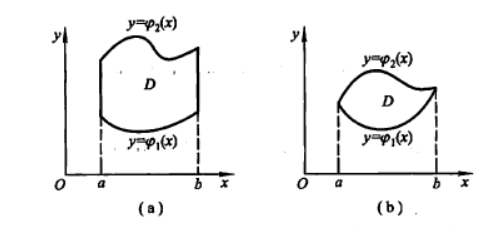

$$
先计算截面面积，为此，在区间[a,b]上任意取一点x_0,作平行与yOz面的平面x=x_0,这平面\\截曲顶柱体所得的截面是一个以区间[\varphi_{1}{x_0},\varphi_{2}{x_0}]为底、曲线z=f(x_0,y)为曲边的梯形，
\\所以这截面的面积为A(x_0)=\int^{\varphi_{2}{(x_0)}}_{\varphi_{1}{(x_0)}} f(x_0,y)dy\\
\therefore V=\int^{b}_{a}A(x)dx=\int^{b}_{a}{[\int^{\varphi_{2}{(x)}}_{\varphi_{1}{(x)}}f(x,y)dy]dx}\\
\therefore \iint_{D}f(x,y)d\sigma = \int^{b}_{a}{[\int^{\varphi_{2}{(x)}}_{\varphi_{1}{(x)}}f(x,y)dy]dx}=
\int^{b}_{a}dx\int^{\varphi_{2}{(x)}}_{\varphi_{1}{(x)}} f(x,y)dy
$$

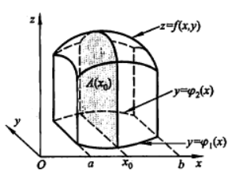

#### Y型区域

Y型区域的特点是：穿过D内部且平行于x轴的直线与D的边界相交不多于两点

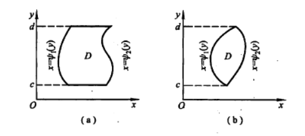
$$
区间D也可以是 \psi_{1}(y)\le x \le\psi_{2}(y),c\le y \le d
$$

$$
\iint_{D}f(x,y)d\sigma = \int^{d}_{c}{[\int^{\psi_{2}{(y)}}_{\psi{1}{(y)}}f(x,y)dx]dy}=
\int^{d}_{c}dy\int^{\psi{2}{(y)}}_{\psi{1}{(y)}} f(x,y)dx
$$

## 曲线积分与曲面积分

$$
\int_{L}f(x,y)ds
$$

$$
如果L是闭曲线，那么函数f(x,y)在闭曲线上对弧长的曲线积分为\oint{f(x,y)}ds
$$

## 无穷级数

### 常数项级数

$$
\sum^{\infty}_{n=1}u_{n}=u_1+u_2+u_3+\cdots+u_n+\cdots,\\
部分和s_n=\sum^{n}_{n=1}u_{n}=u_1+u_2+u_3+\cdots+u_n\\
等比级数 (几何级数)\sum^{\infty}_{n=0}aq^{n}=a+aq+aq^{2}+\cdots+aq^{n}+\cdots\\
函数项级数 u_{1}(x)+u_{2}(x)+u_{3}(x)+\cdots+u_{n}(x)+\cdots\\\
幂级数\sum^{\infty}{n=0}a_nx^{n}=a_0+a_1x+a_2x^2+\cdots+a_nx^{n}+\cdots
$$

### 欧拉公式

$$
设一个复数z，\\
e^{z}=1+z+\frac{(z)^{2}}{2!}+\cdots++\frac{(z)^{n}}{n!}+\cdots\\
当x=0时，z=iy\\ \therefore
e^{iy}=1+iy+\frac{(iy)^{2}}{2!}+\cdots++\frac{(iy)^{n}}{n!}+\cdots\\
=1+iy-\frac{(y)^{2}}{2!}-i\frac{(y)^{3}}{3!}
+\frac{(y)^{4}}{4!}+i\frac{(y)^{5}}{5!}-\cdots\\
=(1-\frac{(y)^{2}}{2!}+\frac{(y)^{4}}{4!}-\cdots)+i(y-\frac{(y)^{3}}{3!}+\frac{(y)^{5}}{5!}-\cdots)\\
=\cos{y}+i\sin{y}\\
\therefore e^{ix}=\cos{x}+i\sin{x}\\
$$

### 三角级数

$$
正弦函数f(t)=A_{n}\sin(n\omega t+\varphi_n)用级数表示就是\\
f(t)=A_0+\sum^{\infty}_{n=1}A_{n}\sin(n\omega t+\varphi_n)\\

A_{n}\sin(n\omega t+\varphi_n)=A_n\sin\varphi_n\cos n\omega t+A_n\cos \varphi_n\sin n \omega t\\
令A_0=\frac{a_0}{2},A_n\sin\varphi_n=a_n,A_n\cos\varphi_n=b_n,\omega =\frac{\pi}{l}\\
则f(t)=\frac{a_0}{2}+\sum^{\infty}_{n=1}(a_n\cos\frac{n\pi t}{l}+b_n\sin\frac{n\pi t}{l})\\
令x=\frac{\pi t}{l}\\
则f(t)=\frac{a_0}{2}+\sum^{\infty}_{n=1}(a_n\cos nx+ b_n\sin nx)\\
这样就把以2l为周期的三角函数转换成以2\pi为周期的三角函数
$$

$$
\int^{\pi}_{-\pi}\cos nx \ dx =0,(n=1,2,3,\cdots)\\
\int^{\pi}_{-\pi}\sin nx \ dx =0,(n=1,2,3,\cdots)\\
\int^{\pi}_{-\pi}\sin kx \ \cos nx \ dx =0,(k,n=1,2,3,\cdots)\\
\int^{\pi}_{-\pi}\cos kx \ \cos nx \ dx =0,(k,n=1,2,3,\cdots,k\neq n)\\
\int^{\pi}_{-\pi}\sin kx \ \sin nx \ dx =0,(k,n=1,2,3,\cdots,k\neq n)\\
\int^{\pi}_{-\pi}1  \ dx =2\pi\\
\int^{\pi}_{-\pi}\sin^{2} nx  dx =\pi,(n=1,2,3,\cdots)\\
\int^{\pi}_{-\pi}\cos^{2} nx  dx =\pi,(n=1,2,3,\cdots)\\
$$

### 傅里叶级数

- 周期是2PI的函数

$$
f(t)=\frac{a_0}{2}+\sum^{\infty}_{k=1}(a_k\cos kx+ b_k\sin kx)\\
能否用f(x)把a_0,a_1,b_1,\cdots表示出来？\\
先求a_0,\int^{\pi}_{-\pi}f(x)dx=\int^{\pi}_{-\pi}\frac{a_0}{2}dx+\sum^{\infty}_{k=1}[a_k\int^{\pi}_{-\pi}\cos kx dx+b_k\int^{\pi}_{-\pi}\sin kx dx]\\
\sum^{\infty}_{k=1}[a_k\int^{\pi}_{-\pi}\cos kx dx+b_k\int^{\pi}_{-\pi}\sin kx dx]=0\\
\int^{\pi}_{-\pi}f(x)dx=\int^{\pi}_{-\pi}\frac{a_0}{2}dx=\frac{a_0}{2}\cdot 2\pi\\
\therefore a_0=\frac{1}{\pi}\int^{\pi}_{-\pi}f(x)dx\\
$$

$$
求a_n,两端乘以\cos nx，就是\\
\int^{\pi}_{-\pi}f(x)\ \cos nx\ dx=\frac{a_0}{2}\int^{\pi}_{-\pi}\cos nx dx+ \sum^{\infty}_{k=1}[a_k\int^{\pi}_{-\pi}\cos kx cos nx dx+b_k\int^{\pi}_{-\pi}\sin kx \cos nx dx]\\
上式中，当k\neq n时，都为0，只有当k=n时\\
\int^{\pi}_{-\pi}f(x)\cos nx dx=a_n\int^{\pi}_{-\pi}\cos^{2}nxdx=a_n\pi\\
\therefore a_n=\frac{1}{\pi}\int^{\pi}_{-\pi}f(x)\cos nx dx,(n=1,2,3,\cdots)\\
类似的，两端乘以\sin nx 可以求出b_n\\
b_n=\frac{1}{\pi}\int^{\pi}_{-\pi}f(x)\sin nx dx,(n=1,2,3,\cdots)\\
当n=0时，a_n的表达式正好是a_0\\
$$

$$
a_n=\frac{1}{\pi}\int^{\pi}_{-\pi}f(x)\cos nx dx,(n=0,1,2,3,\cdots)\\
b_n=\frac{1}{\pi}\int^{\pi}_{-\pi}f(x)\sin nx dx,(n=1,2,3,\cdots)
$$

### 周期为2l的周期函数的傅里叶级数

$$
f(x)=\frac{a_0}{2}+\sum^{\infty}_{n=1}(a_n\cos\frac{n\pi x}{l}+b_n\sin\frac{n\pi x}{l})\\
a_n=\frac{1}{l}\int^{l}_{-l}f(x)\cos\frac{n\pi x}{l}dx, (n=0,1,2,\cdots)\\
b_n=\frac{1}{l}\int^{l}_{-l}f(x)\sin\frac{n\pi x}{l}dx, (n=1,2,\cdots)\\
当f(x)为奇函数时，f(x)=\sum^{\infty}_{n=1}b_{n}\sin\frac{n\pi x}{l}\\
b_n=\frac{2}{l}\int^{l}{0}f(x)\sin\frac{n\pi x}{l}dx\\
当f(x)为偶函数时，f(x)=\frac{a_0}{2}+\sum^{\infty}_{n=1}a_n\cos\frac{n\pi x}{l}\\

a_n=\frac{2}{l}\int^{l}{0}f(x)\cos\frac{n\pi x}{l}dx\\
$$

### 傅里叶级数的复数形式

$$
a_n=\frac{1}{l}\int^{l}_{-l}f(x)\cos\frac{n\pi x}{l}dx, (n=0,1,2,\cdots)\\
b_n=\frac{1}{l}\int^{l}_{-l}f(x)\sin\frac{n\pi x}{l}dx, (n=1,2,\cdots)\\
利用欧拉公式\cos t=\frac{e^{it}+e^{-it}}{2},\sin t=\frac{e^{it}-e^{-it}}{2i}\\
$$

