## OpenCV-Python

OpenCV-Python使用`Numpy`,这是一个高度优化的数据库操作库，具有MATLAB风格的语法，所有OpenCV数据结构都转换为Numpy数组，这也使得于使用Numpy的其他库（如SciPy和Matplotlib）集成更容易。

安装OpenCV之前需要先安装`numpy`、`matplotlib`

先安装OpenCV-Python，由于一些经典的算法被申请了版权，新的版本有很大的限制，所以选用3.4.3以下的版本

```python
pip install opencv-python==3.4.2.17
```

```python
import cv2
lena = cv2.imread("DSC02449.jpg")
cv2.imshow("image", lena)
cv2.waitKey(0)
```


想要利用`SIFT`和`SURF`等进行特征提时，还需要安装

````python
pip install opencv-contrib-python==3.4.2.17
````

如果想安装`matplotlib`

````python
pip install matplotlib
````


## OpenCV的模块

| 模块       | 说明                                                         |
| ---------- | ------------------------------------------------------------ |
| Core       | 该模块包含 OpenCV 库的基础结构以及基本操作。                 |
| Improc     | 图像处理模块包含基本的图像转换，包括滤波以及类似的卷积操作。 |
| Highgui    | 在 OpenCV 3.0中，分割为 imcodecs、videoio 以及 highgui 三部分。  这个模块包含可以用来显示图像或者简单的输入的用户交互函数。这可以看作是一个非常轻量级的 Windows UI 工具包。 |
| Video      | 该模块包含读取和写视频流的函数。                             |
| Calib3d    | 这个模块包括校准单个、双目以及多个相机的算法实现。           |
| Feature2d  | 这个模块包含用于检测、描述以及匹配特征点的算法。             |
| Objdectect | 这个模块包含检测特定目标，比如人脸或者行人的算法。也可以训练检测器并用来检测其他物体。 |
| Ml         | 机器学习模块本身是一个非常完备的模块，包含大量的机器学习算法实现并且这些算法都能和 OpenCV 的数据类型自然交互。 |
| Flann      | Flann 的意思是“快速最邻近库”。这个库包含一些你也许不会直接使用的方法，但是其他模块中的函数会调用它在数据集中进行最邻近搜索。 |
| GPU        | 在 OpenCV 中被分割为多个 cuda* 模块。  GPU 模块主要是函数在 CUDA GPU 上的优化实现，此外，还有一些仅用于 GPU 的功 能。其中一些函数能够返回很好的结果，但是需要足够好的计算资源，如果硬件没有GPU，则不会有什么提升。 |
| Photo      | 这是一个相当新的模块，包含计算摄影学的一些函数工具。         |
| Stitching  | 本模块是一个精巧的图像拼接流程实现。这是库中的新功能，但是，就像 Photo 模块一样，这个领域未来预计有很大的增长。 |
| Nonfree    | 在 OpenCV 3.0 中，被移到 opencv_contrib/xfeatures2d。  OpenCV 包含一些受到专利保护的或者受到使用限制的（比如 SIFT 算法）算法。这些算法被隔离到它们自己的模块中，以表明你需要做一些特殊的工作，才可以在商业产品中使用它们。 |
| Contrib    | 在 OpenCV 3.0 中，融合进了 opencv_contrib。  这个模块包含一些新的、还没有被集成进 OpenCV 库的东西。 |
| Legacy     | 在 OpenCV 3.0 中，被取消。  这个模块包含一些老的尚未被完全取消的东西。 |
| ocl        | 在OpenCV 3.0 中，被取消，取而代之的是 T-API。  这是一个较新的模块，可以认为它和 GPU 模块相似，它实现了开放并行编程的 Khronos OpenCL 标准。虽然现在模块的特性比 GPU 模块少很多，但 ocl 模块的目标是提供可以运行在任何 GPU 或者是其他可以搭载 Khronos 的并行设备。这与 GPU 模 块形成了鲜明的对比，后者使用 Nividia CUDA 工具包进行开发，因此只能在 Nividia GPU 设备上工作。 |

## 基本操作

### 图像的IO操作

```python
cv2.imread("DSC02449.jpg",cv2.IMREAD_GRAYSCALE)
```

- IMREAD_GRAYSCALE  ：  以灰度模式加载图像。
-  IMREAD_COLOR  ：以彩色模式加载图像，任何图像的透明度都被忽略。这是默认参数。
-  IMREAD_ANYCOLOR  ：和 IMREAD_UNCHANGED 一样，包括alpha通道的加载图像模式
-  IMREAD_ANYDEPTH   : 将保持图像原来的深度

### 显示图像

```python
cv2.imshow()
```

### 保存图像

```python
cv2.imwrite()
```

## 绘制几何图形

### 绘制直线

```python
import cv2 as cv
import numpy as np

w = 500
h = 500
d = 3
shape = (w, h, d)
img = np.zeros(shape, np.uint8)
cv.line(img, (0, 0), (int(w / 2), int(h / 2)), (0, 0, 255), 10)
cv.line(img, (w, 0), (int(w / 2), int(h / 2)), (0, 255, 0), 10)
cv.line(img, (w, h), (int(w / 2), int(h / 2)), (255, 0, 0), 10)
cv.namedWindow('line', cv.WINDOW_AUTOSIZE)
cv.imshow('line', img)
cv.waitKey(0)
cv.destroyAllWindows()
```

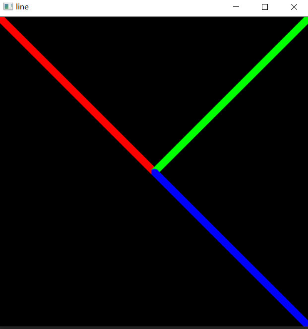


### 绘制圆形

```python
import cv2 as cv
import numpy as np

w = 500
h = 500
d = 3
shape = (w, h, d)
img1 = np.zeros(shape, np.uint8)
img2 = np.zeros(shape, np.uint8)
# BGR顺序
# thickness：可选参数。当该参数为正数时，表示待绘制圆形轮廓的粗细；当该参数为负值时，表示待绘制圆形为实心圆，即填充的圆形
# lineType：可选参数。用于设置线段的类型，可选8（8邻接连接线-默认）、4（4邻接连接线）和cv2.LINE_AA 为抗锯齿
cv.circle(img1, (w // 2, h // 2), 100, (0, 255, 0), -1, cv.LINE_8)
cv.circle(img2, (w // 2, h // 2), 100, (0, 255, 0), 5, cv.LINE_8)
cv.namedWindow('circle1', cv.WINDOW_AUTOSIZE)
cv.namedWindow('circle2', cv.WINDOW_AUTOSIZE)
cv.imshow('circle1', img1)
cv.imshow('circle2', img2)
cv.waitKey(0)
cv.destroyAllWindows()
```

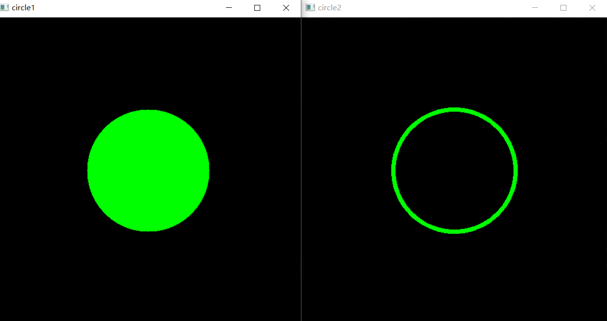

### 绘制矩形

```python
import cv2 as cv
import numpy as np

w = 500
h = 500
d = 3
shape = (w, h, d)
img1 = np.zeros(shape, np.uint8)
img2 = np.zeros(shape, np.uint8)

cv.rectangle(img1, (0, 0), (w // 2, h // 2), (0, 255, 0), -1, cv.LINE_8)
cv.rectangle(img2, (0, 0), (w // 2, h // 2), (0, 255, 0), 5, cv.LINE_8)

cv.namedWindow('rectangle1', cv.WINDOW_AUTOSIZE)
cv.namedWindow('rectangl2', cv.WINDOW_AUTOSIZE)
cv.imshow('rectangle1', img1)
cv.imshow('rectangl2', img2)
cv.waitKey(0)
cv.destroyAllWindows()
```
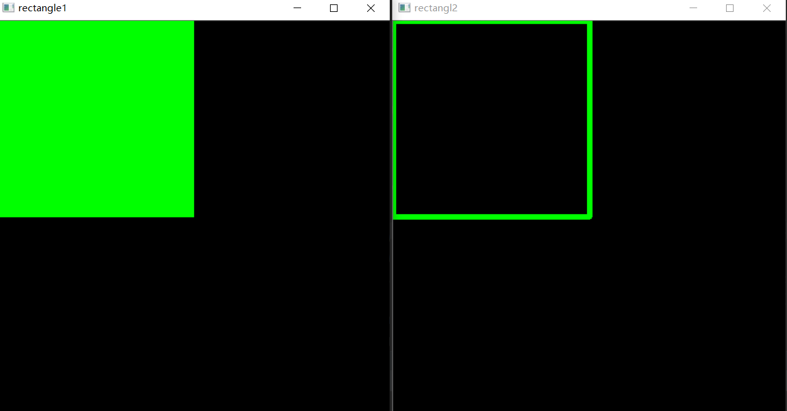

### 绘制椭圆

```python
import cv2 as cv
import numpy as np

w = 500
h = 500
d = 3
shape = (w, h, d)
img1 = np.zeros(shape, np.uint8)
img2 = np.zeros(shape, np.uint8)

cv.ellipse(img1, (w // 2, h // 2), (w // 4, h // 3), 0, 45, 270, (0, 255, 0), 10)
cv.ellipse(img2, (w // 2, h // 2), (w // 4, h // 3), 0, 45, 270, (0, 255, 0), -1)

cv.namedWindow('ellipse1', cv.WINDOW_AUTOSIZE)
cv.namedWindow('ellipse2', cv.WINDOW_AUTOSIZE)
cv.imshow('ellipse1', img1)
cv.imshow('ellipse2', img2)
cv.waitKey(0)
cv.destroyAllWindows()
```
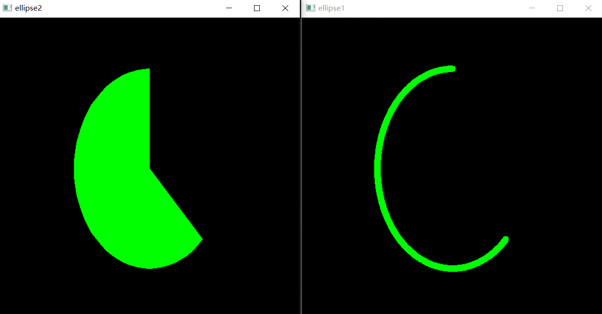

### 绘制任意多边形

```python
import cv2 as cv
import numpy as np

w = 500
h = 500
d = 3
shape = (w, h, d)
img1 = np.zeros(shape, np.uint8)
img2 = np.zeros(shape, np.uint8)

points = np.array([[50, 50], [w // 3 * 2, 50], [w // 3 * 2, h // 3 * 2], [w // 2, h // 5 * 4]], np.int32)  # 多边形的顶点坐标
cv.polylines(img1, [points], True, (255, 0, 0), 10)  # 画任意多边形
cv.polylines(img2, [points], True, (255, 0, 0), 10)  # 画任意多边形
cv.fillPoly(img2, [points], (0, 255, 0))

cv.namedWindow('polylines1', cv.WINDOW_AUTOSIZE)
cv.namedWindow('polylines2', cv.WINDOW_AUTOSIZE)
cv.imshow('polylines1', img1)
cv.imshow('polylines2', img2)
cv.waitKey(0)
cv.destroyAllWindows()
```

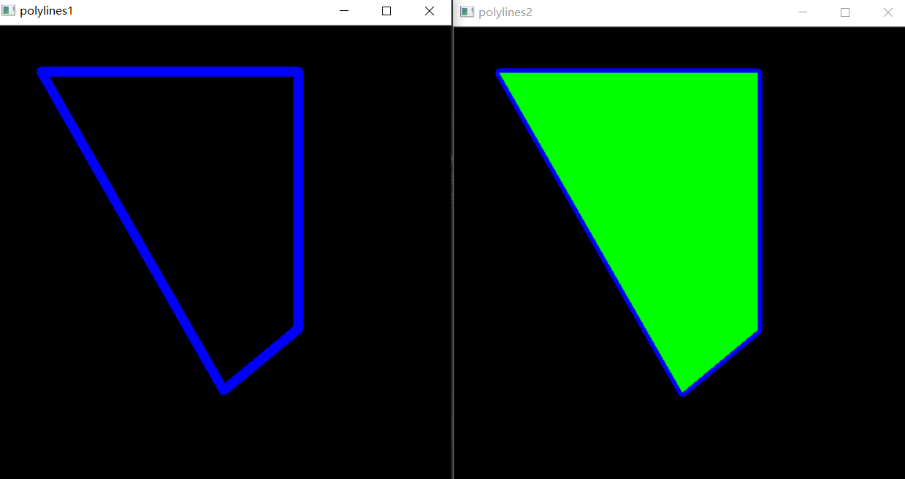

### 绘制文字

```python
import cv2 as cv
import numpy as np

w = 500
h = 500
d = 3
shape = (w, h, d)
img = np.zeros(shape, np.uint8)
font = cv.FONT_HERSHEY_SIMPLEX
cv.putText(img, 'OpenCV', (w // 2, h // 2), font, 1.2, (255, 255, 255), 2)
cv.line(img, (0, h // 2), (w, h // 2), (255, 255, 255))
cv.line(img, (w // 2, 0), (w // 2, h), (255, 255, 255))
cv.namedWindow('text', cv.WINDOW_AUTOSIZE)
cv.imshow('text', img)
cv.waitKey(0)
cv.destroyAllWindows()
```
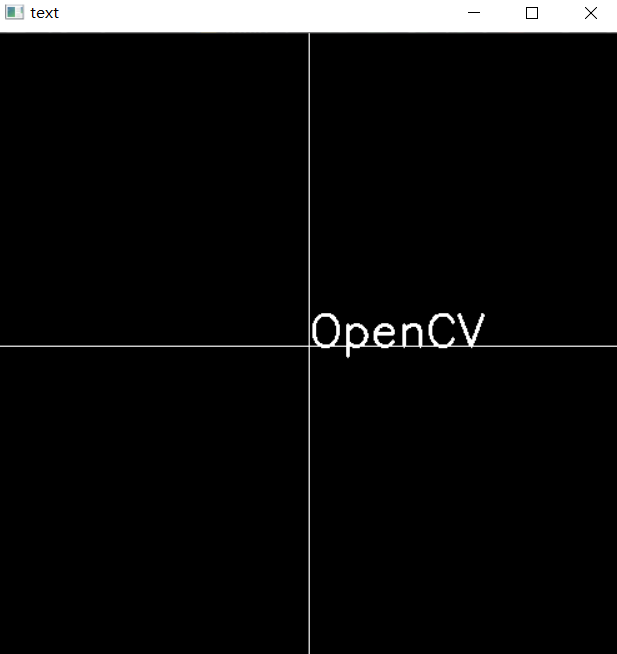

## 图像的基本属性

```python
img = cv.imread("L_1.png", cv.IMREAD_ANYCOLOR)
print(img.shape) # (1080, 1920, 3),行，列，通道数
print(img.size)  # 6220800 ，像素
print(img.dtype) # uint8
```

## 通道的拆分与合并

```python
b,g,r = cv.split(img)
img = cv.merge((g,))
```

## 色彩空间的改变

```python
img = cv.cvtColor(img,cv.COLOR_BGR2GRAY) 
```

## 图像操作

### 图像的加法

图像相加应该具有相同的大小和类型，或者第二个图像可以是标量值，OpenCV加法操作时饱和操作，Numpy时模运算

```python
x = np.uint8([250])
y = np.uint8([10])
print(cv.add(x, y))  # [[255]]
print(x + y)  # [4]
```


### 图像的混合

公式
$$
dst=\alpha  img1 + \alpha  img2 + Y
$$


注意：无论是图像相加还是图像混合，都要求图像大小一样

```python
import cv2 as cv
img1 = cv.imread("DSC02449.png", cv.IMREAD_ANYCOLOR)
img2 = cv.imread("L_1.png", cv.IMREAD_ANYCOLOR)
img3 = cv.addWeighted(img1, 0.7, img2, 0.3, 0)
cv.namedWindow('polylines', cv.WINDOW_AUTOSIZE)
cv.imshow('polylines', img3)
cv.waitKey(0)
cv.destroyAllWindows()
```

## 几何变化

### 缩放

```python
img = cv.imread("L_1.png", cv.IMREAD_ANYCOLOR)
# 绝对尺寸
img = cv.resize(img,(200,400),interpolation=cv.INTER_LINEAR)
cv.namedWindow('opencv', cv.WINDOW_AUTOSIZE)
cv.imshow('opencv', img)
cv.waitKey(0)
cv.destroyAllWindows()
```


```python
img = cv.imread("L_1.png", cv.IMREAD_ANYCOLOR)
# 相对尺寸
img = cv.resize(img,None,fx=0.4,fy=0.4,interpolation=cv.INTER_LINEAR)
cv.namedWindow('opencv', cv.WINDOW_AUTOSIZE)
cv.imshow('opencv', img)
cv.waitKey(0)
cv.destroyAllWindows()
```

2 平移
$$
M=\left[
\begin{matrix}
1 & 0 &t_{x}\\
0 & 1 &t_{y}
\end{matrix}

\right]
$$
对于（x,y）处的像素点，要把它移动到（x+tx,y+ty）

```python
img = cv.imread("L_1.png", cv.IMREAD_ANYCOLOR)
img = cv.resize(img, None, fx=0.3, fy=0.3, interpolation=cv.INTER_LINEAR)
rows, cols = img.shape[:2]
matrix = np.float32([[1, 0, 100], [0, 1, 50]])
# dsize 是输出图像的大小，它是宽高的形式，宽就是列数，高就是行数，所以就是(cols,rows)
img = cv.warpAffine(img, matrix, (cols,rows))
cv.namedWindow('opencv', cv.WINDOW_AUTOSIZE)
cv.imshow('opencv', img)
cv.waitKey(0)
cv.destroyAllWindows()
```

3 图像旋转
$$
\left\{
\begin{array}{c}
x^ {'} = x \cos \theta + y \sin\theta\\
y^ {'} = -x \sin \theta + y \cos\theta

\end{array}
\right.
$$


也可以写成
$$
\left[
\begin{matrix}
x^ {'} & y^ {'}&1
\end{matrix}
\right]=\left[
\begin{matrix}
x & y&1
\end{matrix}
\right] 

\left[
\begin{matrix}
\cos\theta & -\sin\theta&0\\
\sin\theta & \cos\theta&0\\
0 & 0&1\\
\end{matrix}
\right] 
$$


```python
img = cv.imread("DSC02449.png", cv.IMREAD_ANYCOLOR)
img = cv.resize(img, None, fx=0.3, fy=0.3, interpolation=cv.INTER_LINEAR)
rows, cols = img.shape[:2]
matrix = cv.getRotationMatrix2D((cols/2,rows/2),45,1) # 图像中心点旋转
# dsize 是输出图像的大小，它是宽高的形式，宽就是列数，高就是行数，所以就是(cols,rows)
img = cv.warpAffine(img, matrix, (cols,rows))
cv.namedWindow('opencv', cv.WINDOW_AUTOSIZE)
cv.imshow('opencv', img)
cv.waitKey(0)
cv.destroyAllWindows()
```
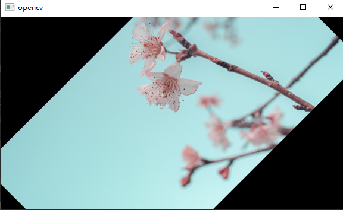


4 仿射变换

图像的仿射变换涉及到图像的形状位置角度的变化，主要是对图像的缩放、旋转、翻转和平移等操作的组合。


5 投射变换


## 形态学

### 连通性

在图像中，最小的单位是像素，每个像素周围有8个邻接像素，常见的邻接关系有3种：`4邻接`、

`D邻接`和`8邻接`

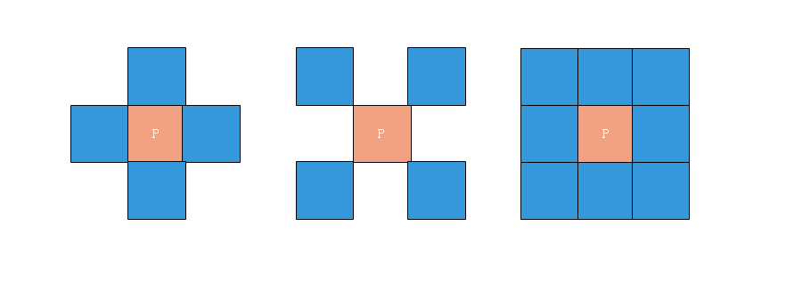

- 4邻接 :像素p（x,y）的4邻域是：（x+1,y）、(x-1,y)、（x,y-1）、（x,y+1）,

  用
  $$
  N_4(p)
  $$
  表示像素p的4邻接

- D邻接：像素p（x,y）的D邻域是（x+1,y+1）、(x+1,y-1)、(x-1,y+1)、（x-1，y-1），用
  $$
  N_D(p)
  $$
  表示像素p的D邻接

- 8邻接：像素p（x,y）的D邻域是：4邻域的点 + 8邻域的点，用
  $$
  N_8(p)
  $$
  表示。

  `连通性`是描述区域的边界的重要概念，两个像素连通的必要条件：

  1 两个像素的位置是否相邻

  2 两个像素的灰度值是否满足特定的相似性准则（或者是否相等）

 ### 形态学操作

  形态学转换是基于图像形状的一些简单操作。它通常在`二进制图像`上执行。`腐蚀`与`膨胀`是两个基本的形态学运算符。然后它的变体形式如开运算、闭运算、礼帽黑帽等。

  #### 腐蚀与膨胀

  腐蚀和膨胀都是针对白色部分（高亮部分）而言的。

  膨胀就是使图像中高亮部分扩张，效果图拥有比原图更大的高亮区域；

  腐蚀是原图中的高亮区域被蚕食，效果图拥有比原图更小的高亮区域。

  1 腐蚀

  具体操作：用一个结构元素扫描图像中的每一个像素，用结构元素中的每一个像素与其覆盖的像素做“与”操作，如果都为1，则该像素为1，否则为0，

  

```python
img = np.zeros((400, 400, 3), np.uint8)
img.fill(0)
rows, cols = img.shape[:2]
cv.putText(img, "TEXT", (int((cols / 3)), int(rows / 2)), cv.FONT_HERSHEY_PLAIN, 4, (255, 255, 255), 13)
cv.imshow('erode before', img)
kernel = np.ones((6, 6), np.uint8)
img = cv.erode(img, kernel) # 腐蚀
cv.namedWindow('erode after', cv.WINDOW_AUTOSIZE)
cv.imshow('erode after', img)
cv.waitKey(0)
cv.destroyAllWindows()
```

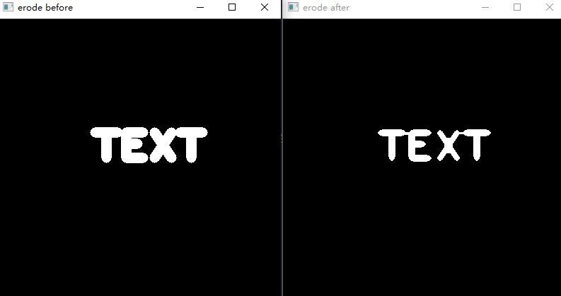


```python
img = np.zeros((400, 400, 3), np.uint8)
img.fill(0)
rows, cols = img.shape[:2]
cv.putText(img, "TEXT", (int((cols / 3)), int(rows / 2)), cv.FONT_HERSHEY_PLAIN, 4, (255, 255, 255), 13)
cv.imshow('erode before', img)
kernel = np.ones((6, 6), np.uint8)
img = cv.dilate(img, kernel) # 膨胀
cv.namedWindow('erode after', cv.WINDOW_AUTOSIZE)
cv.imshow('erode after', img)
cv.waitKey(0)
cv.destroyAllWindows()
```

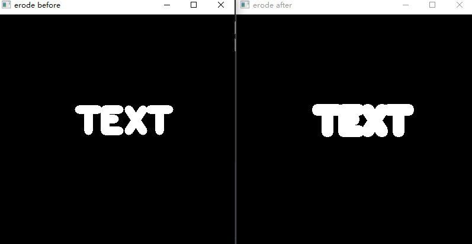

#### 开闭运算

1 开运算：先腐蚀后膨胀，其作用是：分离物体，消除小区域。特点：消除噪点，去除小的干扰块，而不影响原来的图

2 闭运算：先膨胀后腐蚀，作用是消除物体里面的孔洞。特点：可以填充闭合区域。


```python
img = cv.imread("test2.png")
kernel = np.ones((10, 10), np.uint8)
cv.imshow('MORPH_OPEN BEFORE', img)
img = cvopen = cv.morphologyEx(img, cv.MORPH_OPEN, kernel) # 开运算
cv.namedWindow('MORPH_OPEN AFTER', cv.WINDOW_AUTOSIZE)
cv.imshow('MORPH_OPEN AFTER', img)
cv.waitKey(0)
cv.destroyAllWindows()
```


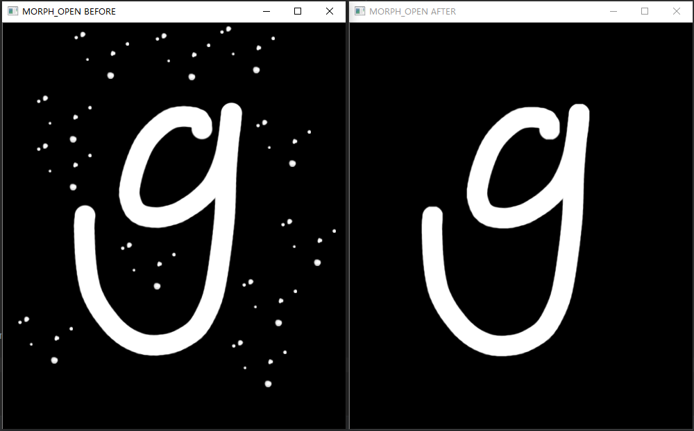


```python
img = cv.imread("test3.png")
kernel = np.ones((10, 10), np.uint8)
cv.imshow('MORPH_OPEN BEFORE', img)
img = cvopen = cv.morphologyEx(img, cv.MORPH_CLOSE, kernel) # 闭运算
cv.namedWindow('MORPH_OPEN AFTER', cv.WINDOW_AUTOSIZE)
cv.imshow('MORPH_OPEN AFTER', img)
cv.waitKey(0)
cv.destroyAllWindows()
```


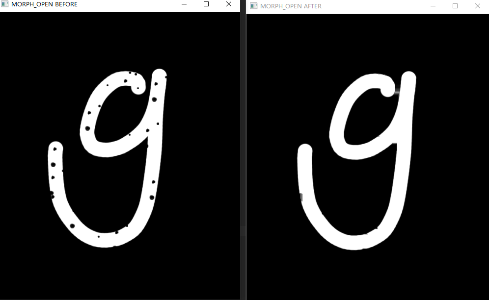

#### 礼帽和黑帽

1 礼帽运算：原图像与“开运算”的结果图只差。因为开运算带来的结果是放大了裂缝或者局部低亮度的区域，因此，从原图中减去开运算后的图，得到的效果图突出了比原图轮廓周围的区域更明亮的区域，且这一操作和选择的核的大小有关。

 礼帽运算用来分离比邻近点亮一些的斑块。当一幅图像具有大幅的背景的时候，而微小的物品比较有规律的情况下，可以使用 礼帽运算进行背景的提取。

2 黑帽运算：为“闭运算”的结果图与原图像之差。

黑帽运算后的效果图突出了比原图轮廓周围的区域更暗的区域，且这一操作和选择的核的大小有关。

黑帽运算用来分离比邻近点暗一些的斑块

```python
img = cv.imread("test2.png")
kernel = np.ones((10, 10), np.uint8)
cv.imshow('MORPH_TOPHAT BEFORE', img)
img = cvopen = cv.morphologyEx(img, cv.MORPH_TOPHAT, kernel)  # 礼帽运算
cv.namedWindow('MORPH_TOPHAT AFTER', cv.WINDOW_AUTOSIZE)
cv.imshow('MORPH_TOPHAT AFTER', img)
cv.waitKey(0)
cv.destroyAllWindows()
```


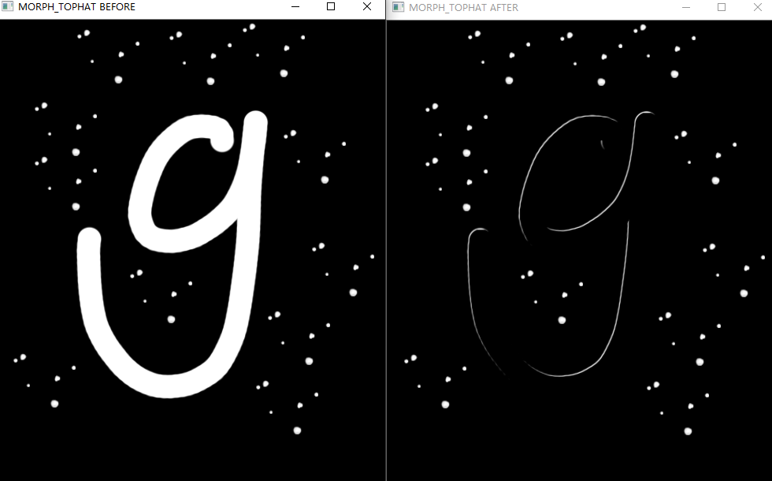


```python
img = cv.imread("test3.png")
kernel = np.ones((10, 10), np.uint8)
cv.imshow('MORPH_BLACKHAT BEFORE', img)
img = cvopen = cv.morphologyEx(img, cv.MORPH_BLACKHAT, kernel) # 黑帽运算
cv.namedWindow('MORPH_BLACKHAT AFTER', cv.WINDOW_AUTOSIZE)
cv.imshow('MORPH_BLACKHAT AFTER', img)
cv.waitKey(0)
cv.destroyAllWindows()
```


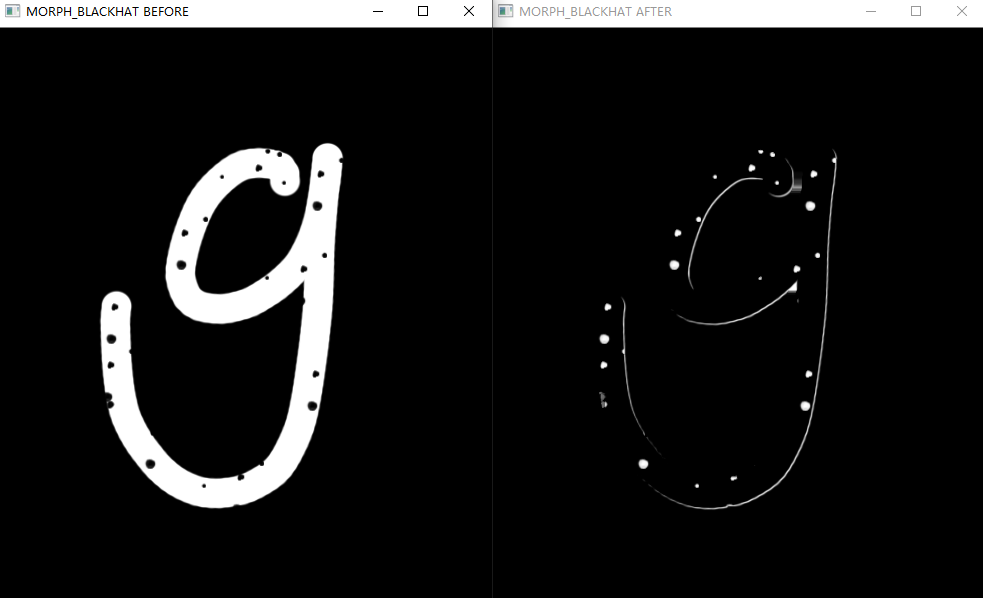


##  图像平滑

图像平滑从信号的角度看就是去除其中的高频信息，保留低频信息

### 均值滤波

```python
import cv2 as cv
import matplotlib.pyplot as plt

plt.rcParams['font.sans-serif']=['SimHei'] #用来正常显示中文标签
plt.rcParams['axes.unicode_minus']=False #用来正常显示负号

# 均值滤波
img = cv.imread("test3.png")
blur = cv.blur(img,(4,4))
plt.figure(figsize=(8, 8))

plt.subplot(121),plt.imshow(blur[:, :, ::-1]),plt.title("均值滤波后")
plt.xticks([]),plt.yticks([])

plt.subplot(122),plt.imshow(img[:, :, ::-1]),plt.title("原图")
plt.xticks([]),plt.yticks([])
plt.show()
```

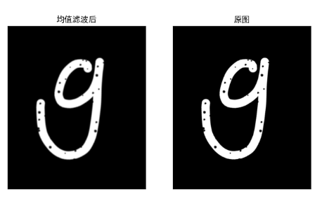

### 高斯滤波


`````python
import cv2 as cv
import matplotlib.pyplot as plt

plt.rcParams['font.sans-serif']=['SimHei'] #用来正常显示中文标签
plt.rcParams['axes.unicode_minus']=False #用来正常显示负号

# 均值滤波
img = cv.imread("test3.png")
blur = cv.GaussianBlur(img, (3, 3), 1)
plt.figure(figsize=(8, 8))

plt.subplot(121),plt.imshow(blur[:, :, ::-1]),plt.title("均值滤波后")
plt.xticks([]),plt.yticks([])

plt.subplot(122),plt.imshow(img[:, :, ::-1]),plt.title("原图")
plt.xticks([]),plt.yticks([])
plt.show()
`````

### 中值滤波

```python
blur = cv.medianBlur(img,  3)
```

## 直方图

```python
plt.rcParams['font.sans-serif'] = ['SimHei']  # 用来正常显示中文标签
plt.rcParams['axes.unicode_minus'] = False  # 用来正常显示负号

img = cv.imread("test4.png")
# channels :如果输入的是灰度图，它的值就是[0],如果是彩色图的，可以是是[0]、[1]、[2]分别代表这B、G、R
# hitSize:BIN的数目，如[256]
# ranges:像素值范围,通常[0,256]
hitstr = cv.calcHist([img], [0], None, [256], [0, 256])
plt.figure(figsize=(10, 6), dpi=100)
plt.plot(hitstr)
plt.grid()
plt.show()
```

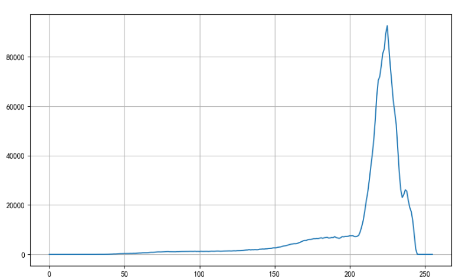

### 掩膜

掩膜是用选定的图像、图形或物体，对要处理的图像进行遮挡，来控制图像处理的区域。

在数字图像处理中，我们通常使用二维矩阵数组进行掩膜。掩膜是由0和1组成一个二进制图像，利用该掩膜 图像要处理的图像进行掩膜，其中1值的区域被处理，0值区域被屏蔽，不会处理。

掩膜的主要用途是：

- 提取感兴趣区域：用预先制作的感兴趣区掩模与待处理图像进行”与“操作，得到感兴趣区图像，感兴趣 区内图像值保持不变，而区外图像值都为0。

- 屏蔽作用：用掩模对图像上某些区域作屏蔽，使其不参加处理或不参加处理参数的计算，或仅对屏蔽区 作处理或统计。

- 结构特征提取：用相似性变量或图像匹配方法检测和提取图像中与掩模相似的结构特征。

- 特殊形状图像制作 

  

  掩膜在遥感影像处理中使用较多，当提取道路或者河流，或者房屋时，通过一个掩膜矩阵来对图像进行像素 过滤，然后将我们需要的地物或者标志突出显示出来。

我们使用cv.calcHist(）来查找完整图像的直方图。如果要查找图像某些区域的直方图，该怎么办？只需在 要查找直方图的区域上创建一个白色的掩膜图像，否则创建黑色，然后将其作为掩码mask传递即可。


```python
import cv2 as cv
import numpy as np
import matplotlib.pyplot as plt

plt.rcParams['font.sans-serif'] = ['SimHei']  # 用来正常显示中文标签
plt.rcParams['axes.unicode_minus'] = False  # 用来正常显示负号

# 掩膜
img = cv.imread("test4.png")

mask = np.zeros(img.shape[:2],np.uint8)
mask[400:500,200:500]=255
mask_img=cv.bitwise_and(img,img,mask=mask)
mask_histr=cv.calcHist([img],[0],mask,[256],[0,256])
fig,axes=plt.subplots(nrows=2,ncols=2)
axes[0,0].imshow(img,cmap=plt.cm.gray)
axes[0,0].set_title("原图")

axes[0,1].imshow(mask,cmap=plt.cm.gray)
axes[0,1].set_title("蒙版")

axes[1,0].imshow(mask_img,cmap=plt.cm.gray)
axes[1,0].set_title("掩膜后")

axes[1,1].plot(mask_histr)
axes[1,1].grid()
axes[1,1].set_title("灰度直方图")

plt.show()
```

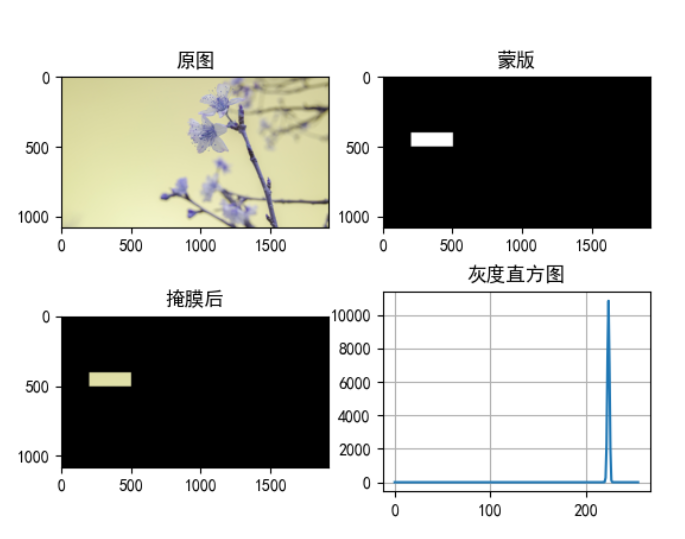

### 直方图均衡化

```python
import cv2 as cv
import numpy as np
import matplotlib.pyplot as plt

plt.rcParams['font.sans-serif'] = ['SimHei']  # 用来正常显示中文标签
plt.rcParams['axes.unicode_minus'] = False  # 用来正常显示负号

# 直方图均衡化
img = cv.imread("test4.png",cv.IMREAD_ANYDEPTH)
dst = cv.equalizeHist(img)
fig, axes = plt.subplots(nrows=2, ncols=1)
axes[0].imshow(img,cmap=plt.cm.get_cmap("gray"))
axes[0].set_title("原图")
axes[0].axis("off")

axes[1].imshow(dst,cmap=plt.cm.get_cmap("gray"))
axes[1].set_title("均衡化后")
axes[1].axis("off")

plt.show()
```

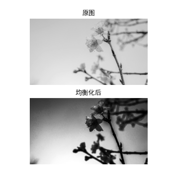

## 边缘检测

### Sobel算子

对于不连续的函数，一阶导数可以写成：
$$
f^{'}(x)=f(x)-f(x-1) 或\\
f^{'}(x)=f(x+1)-f(x)\\
则 f^{'}(x)=\frac{f(x+1) - f(x-1)}{2}
$$

$$
假设要处理的图像为I，在两个方向上求导：\\当模板大小为3时  \
G_{x}=\left[
\begin{matrix}
-1&0&+1\\
-2&0&+2\\
-1&0&+1
\end{matrix}
\right]*I
\\

G_{y}=\left[
\begin{matrix}
-1&-2&-1\\
0&0&0\\
+1&+2&+1
\end{matrix}
\right]*I
$$


$$
在图像的每一点，G=\sqrt{G^{2}_{x} +G^{2}_{y}  }
$$

```python
import cv2 as cv
import numpy as np
import matplotlib.pyplot as plt

plt.rcParams['font.sans-serif'] = ['SimHei']  # 用来正常显示中文标签
plt.rcParams['axes.unicode_minus'] = False  # 用来正常显示负号

# 边缘检测
img = cv.imread("test5.jpg",cv.IMREAD_ANYDEPTH)
# dx与dy:求导的阶数,值取0,1
# ksize:Sobel算子的大小,必须为奇数1,3,5,7,默认为3
x = cv.Sobel(img,cv.CV_16S,1,0)
y = cv.Sobel(img,cv.CV_16S,0,1)
Scale_absX = cv.convertScaleAbs(x)
Scale_absY = cv.convertScaleAbs(y)
result = cv.addWeighted(Scale_absX,0.5,Scale_absY,0.5,0)
plt.figure(figsize=(10,8),dpi=100)
plt.subplot(121),plt.imshow(img,cmap=plt.cm.get_cmap("gray")),plt.title("原图")
plt.xticks([]),plt.yticks([])
plt.subplot(122),plt.imshow(result,cmap=plt.cm.get_cmap("gray")),plt.title("边缘检测")
plt.xticks([]),plt.yticks([])
plt.show()
```

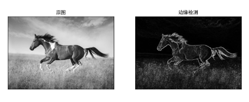


### Scharr算子

$$
当内核的大小为3时，Sobel内核可能产生较明显的误差，为了解决这一问题，\\使用Scharr函数，但该函数仅作用大小为3的内核
$$


$$
G_{x}=\left[
\begin{matrix}
-3&0&+3\\
-10&0&+10\\
-3&0&+3
\end{matrix}
\right]*I
\\

G_{y}=\left[
\begin{matrix}
-3&-10&-3\\
0&0&0\\
+3&+10&+3
\end{matrix}
\right]*I
$$


```python
# ksize=-1就是Scharr
x = cv.Sobel(img,cv.CV_16S,1,0,ksize=-1)
y = cv.Sobel(img,cv.CV_16S,0,1,ksize=-1)
```

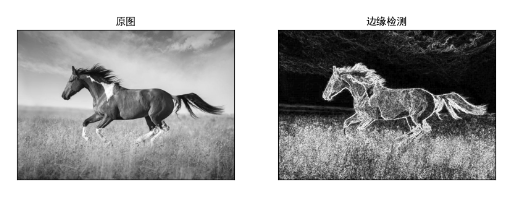


### Laplacian算子

Laplacian是利用二阶导数来检测边缘，因为图像是二维的，需要在二各方向求导
$$
f^{''}(x)=f^{'}(x+1)-f^{'}(x)=f(x+1)+f(x-1)-2f(x)
\\
卷积核为：\left[
\begin{matrix}
0&1&0\\
1&-4&1\\
0&1&0
\end{matrix}
\right]
$$


```python
img = cv.imread("test5.jpg",cv.IMREAD_ANYDEPTH)
result = cv.Laplacian(img,cv.CV_16S,ksize=5)
y = cv.Sobel(img,cv.CV_16S,0,1,ksize=-1)
Scale_abs = cv.convertScaleAbs(result)
plt.figure(figsize=(10,8),dpi=100)
plt.subplot(121),plt.imshow(img,cmap=plt.cm.get_cmap("gray")),plt.title("原图")
plt.xticks([]),plt.yticks([])
plt.subplot(122),plt.imshow(Scale_abs,cmap=plt.cm.get_cmap("gray")),plt.title("边缘检测")
plt.xticks([]),plt.yticks([])
plt.show()
```

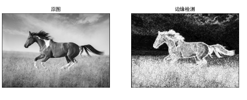


### Canny

```python
img = cv.imread("test7.jpg", cv.IMREAD_ANYDEPTH)
min_threshold = 0
max_threshold = 100
result = cv.Canny(img, min_threshold, max_threshold)
y = cv.Sobel(img, cv.CV_16S, 0, 1, ksize=-1)
Scale_abs = cv.convertScaleAbs(result)
plt.figure(figsize=(10, 8), dpi=100)
plt.subplot(121), plt.imshow(img, cmap=plt.cm.get_cmap("gray")), plt.title("原图")
plt.xticks([]), plt.yticks([])
plt.subplot(122), plt.imshow(Scale_abs, cmap=plt.cm.get_cmap("gray")), plt.title("边缘检测")
plt.xticks([]), plt.yticks([])
plt.show()
```

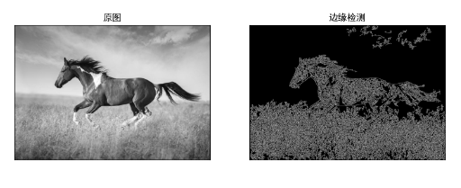


## 模板匹配与霍夫变换

### 模板匹配

```python
img = cv.imread("test9.jpg")
template = cv.imread("test10.jpg")
h, w = template.shape[:2]
res = cv.matchTemplate(img, template, cv.TM_CCOEFF)
min_val, max_val, min_loc, max_loc = cv.minMaxLoc(res)
top_left = max_loc
print(top_left)
print((w, h))
bottom_right = (top_left[0] + w, top_left[1] + h)
print(bottom_right)
cv.rectangle(img, top_left, bottom_right, (0, 255, 0), 2)
plt.imshow(img[:, :, ::-1])
plt.xticks([])
plt.yticks([])
plt.show()
```

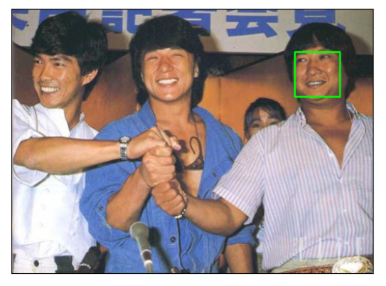


### 霍夫变换

霍夫变换常用来提取图像中的直线和圆等几何形状

```python
img = cv.imread("test.png")
# 转为灰度图
gray = cv.cvtColor(img, cv.COLOR_BGR2GRAY)
# 二值化，Canny边缘检测
edges = cv.Canny(gray, 50, 150)
h, w = img.shape[:2]
# img:就是需要检测的图像，要求是二值化的图像，所以在调用霍夫变换之前首先需要进行二值化，或者进行Canny边缘检测
# threshold:只有累加器中的值高于该阈值时才被认为时直线
lines = cv.HoughLines(edges, 1, np.pi / 180, 130)

for line in lines:
    rho, theta = line[0]
    a = np.cos(theta)
    b = np.sin(theta)
    x0 = a * rho
    y0 = b * rho
    x1 = int(x0 + 1000 * (-b))
    y1 = int(y0 + 1000 * (a))
    x2 = int(x0 - 1000 * (-b))
    y2 = int(y0 - 1000 * (a))
    cv.line(img, (x1, y1), (x2, y2), (0, 255, 0), 2)
plt.figure(figsize=(10, 8), dpi=100)
plt.imshow(img[:, :, ::-1])
plt.xticks([])
plt.yticks([])
plt.show()
```

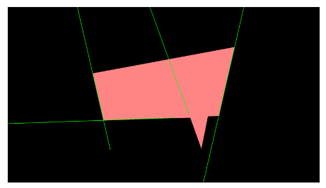

```python
img = cv.imread("test11.jpg")
# 转为灰度图
gray = cv.cvtColor(img, cv.COLOR_BGR2GRAY)
# 中值滤波，霍夫圆检测对噪声比较敏感，所以先去除噪点
blur_img = cv.medianBlur(gray, 1)
circles = cv.HoughCircles(blur_img, cv.HOUGH_GRADIENT, 2, 50, param1=8, param2=150, minRadius=10, maxRadius=100)
print(circles)
for circle in circles[0, :]:
    cv.circle(img, (circle[0], circle[1]), circle[2], (0, 255, 0), 2)
    cv.circle(img, (circle[0], circle[1]), 2, (0, 255, 0), thickness=-1)
plt.figure(figsize=(10, 8), dpi=100)
plt.imshow(img, cmap=plt.cm.get_cmap("gray"))
plt.xticks([])
plt.yticks([])
plt.show()
```

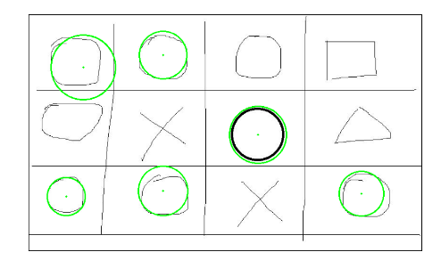

## 图像特征

### 角点

在邻域内的各个方向上灰度变化值足够高的点，是图像边缘曲线上曲率极大值的点。


#### Harris角点检测

Harris角点检测原理是利用移动的窗口在图像中计算灰度变化值，其中关键流程包括转化为灰度图像、计算差分图像、高斯平滑、计算局部极值、确认角点。

基于图像灰度的方法通过计算点的曲率及梯度来检测角点，避免了第一类方法存在的缺陷，此类方法主要有Moravec算子、Forstner算子、Harris算子、SUSAN算子等


```python
img = cv.imread("test12.jpg")
gray = cv.cvtColor(img, cv.COLOR_BGR2GRAY)
gray = np.float32(gray)
# blockSize:角点检测中要考虑的领域大小
# ksize :sobel求导使用过的核大小
# k的值取值参数[0.04,0.06]
dst = cv.cornerHarris(gray, 2, 3, 0.04)
img[dst>0.01*dst.max()]=[255,0,255]
plt.figure(figsize=(10, 8), dpi=100)
plt.imshow(img, cmap=plt.cm.get_cmap("gray"))
plt.xticks([])
plt.yticks([])
plt.show()
```

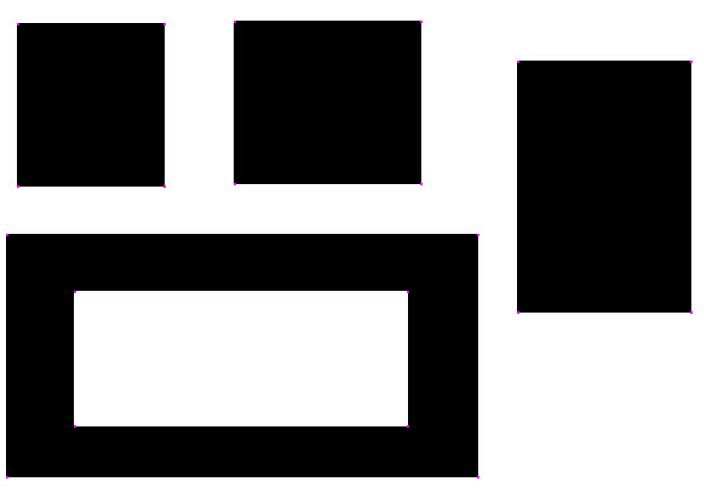

#### Shi-Tomas角点检测

```python
img = cv.imread("test13.jpg")
gray = cv.cvtColor(img, cv.COLOR_BGR2GRAY)
# maxCorners:获取角点的数目
# qualityLevel：取值0-1
# minDistance：角点之间最小的欧式距离，避免得到相邻特征点
dst = cv.goodFeaturesToTrack(gray, 1000, 0.1, 40)
for i in dst:
    x, y = i.ravel()
    cv.circle(img, (x, y), 6, (0, 255,0), -1)
plt.figure(figsize=(10, 8), dpi=100)
plt.imshow(img[:,:,::-1])
plt.xticks([])
plt.yticks([])
plt.show()
```

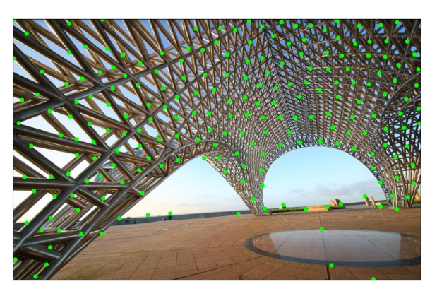

#### SIFT算法

SIFT（Scale Invariant Feature Transform）全称尺度不变特征变换，是1999年Lowe提出的一种局部特征描述算子，在2004年得到了改善。

SIFT算子是把图像中检测到的特征点用一个128维的特征向量进行描述，因此一幅图像经过SIFT算法后表示为一个128维的特征向量集，该特征向量集具有对图像缩放，平移，旋转不变的特征，对于光照、仿射和投影变换也有一定的不变性，是一种非常优秀的局部特征描述算法。

SIFT算法的流程分别为：

1. 尺度空间极点检测
2. 关键点精确定位
3. 关键点的方向确定
4. 特征向量的生成


```python
img = cv.imread("test5.jpg")
gray = cv.cvtColor(img, cv.COLOR_BGR2GRAY)
sift = cv.xfeatures2d.SIFT_create()
kp,des= sift.detectAndCompute(gray,None)
cv.drawKeypoints(img,kp,img,flags=cv.DrawMatchesFlags_DRAW_RICH_KEYPOINTS)
plt.figure(figsize=(10, 8), dpi=100)
plt.imshow(img[:, :, ::-1])
plt.xticks([])
plt.yticks([])
plt.show()
```