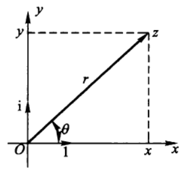
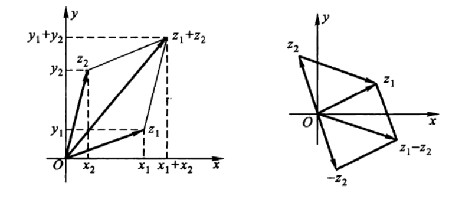
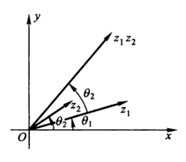
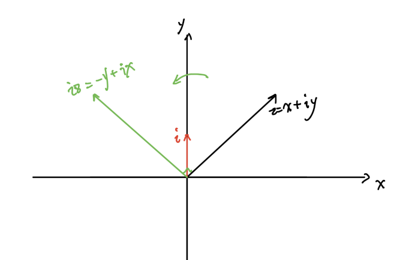
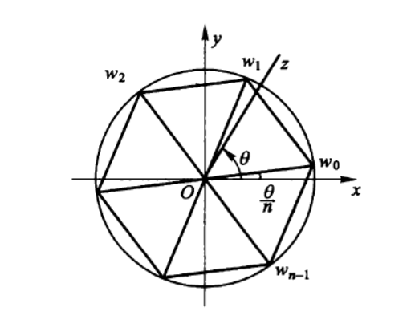

## 复数域

$$
z=x+iy或者z=x+yi,i^2=-1
$$

实数x与y分别称为复数z的实部和虚部，记作
$$
x=Re z,y=Im z
$$
虚部为零的复数就可以看作`实数`，虚部不为零的复数称为`虚数`
$$
x+iy和x-iy称为互为共轭复数
$$
复数运算
$$
z_1\pm z_2=(x_1\pm x_2)+i(y_1\pm y_2)\\
z_1 z_2=(x_1+iy_1)(x_2+iy_2)=(x_1x_2-y_1y_2)+i(x_1y_2+x_2y_1)\\
\frac{z_1}{z_2}=\frac{x_1+iy_1}{x_2+iy_2}=\frac{(x_1+iy_1)(x_2-iy_2)}{(x_2+iy_2)(x_2-iy_2)}=\frac{(x_1x_2+y_1y_2) + i(x_2y_1-x_1y_2)}{x^{2}_{2}+y^{2}_{2}},z_2\neq0
$$

## 复平面

## 复数的模与辐角

$$
r=|z|=\sqrt{x^2+y^2}\geqslant0
$$

$$
\tan\theta=\frac{y}{x},
称为复数z的辐角（Argument），记作\theta= Arg z
$$

我们知道，任一非零复数z有无穷多个辐角，今以arg z表示其中的一个特定值，并称合条件
$$
-\pi <arg\  z \le\pi
$$
的一个为Arg z的主值，或称之为z的主辐角。
$$
\theta=Arg\ z=arg \ z + 2k\pi,k=0,\pm1,\pm2,\cdots
$$
当z=0时，辐角无意义。

## 单位复数

$$
z=r(\cos\theta+i\sin\theta)
$$

当r=1时，有
$$
z=\cos\theta+i\sin\theta
$$
称为单位复数。
$$
e^{i\theta}=\cos\theta+i\sin\theta   \ (欧拉公式)
$$

$$
e^{i\theta_{1}}e^{i\theta_{2}}=e^{i(\theta_1+\theta_2)}\\
\frac{e^{i\theta_{1}}}{e^{i\theta_{2}}}=e^{i(\theta_1-\theta_2)}
$$

复数的指数形式
$$
z=re^{i\theta}
$$
也就是说，任一非零复数z总可以表成
$$
z=|z|e^{i \ arg\ z}
$$

## 复数乘法与旋转

$$
z_1z_2=r_1e^{i\theta_1}r_2e^{i\theta_2}=r_1r_2e^{i(\theta_1 +\theta_2)}\\

\frac{z_1}{z_2}=\frac{r_1e^{i\theta_1}}{r_2e^{i\theta_2}}=\frac{r_1}{r_2} e^{i(\theta_1-\theta_2)}
$$

$$
\therefore |z_1z_2|=|z_1||z_2|,|\frac{z_1}{z_2}|=\frac{|z_1|}{|z_2|},z_2 \neq 0
$$

**所以两个复数相乘相当于模相乘，辐角相加,相除就是模相除，辐角相减**

特别的我们拿`i`乘以一个复数
$$
iz=i(x+iy)=-y+ix
$$

## 复数的乘幂与方根

$$
z^{n}=(re^{i\theta})^{n}=r^{n}e^{in\theta}=r^{n}(\cos n\theta + i\sin n\theta),z \neq0\\
\therefore |z^{n}|=|z|^{n}\\
Arg\ z^{n}=nArg\ z
$$
当**r=1**,就是棣莫弗公式
$$
(\cos\theta + i\sin \theta)^{n}=\cos n\theta + i\sin n\theta
$$

$$
复数w的n次方就是复数z，求出复数w\\
w^{n}=z,z \neq0,n \geqslant2,整数
$$

$$
令记其根的总体为\sqrt[n]{z},设z=re^{i\theta},w=\rho e^{i\varphi},则\\

\rho^{n}e^{in\varphi}=re^{i\theta}\\
\therefore \rho^{n}=r,n\varphi=\theta+2k\pi
$$

$$
\therefore \rho =\sqrt[n]{r} =\sqrt[n]{|z|} \\
\varphi=\frac{\theta+2k\pi}{n}
$$

所以z的n次方根为
$$
w_k=\rho e^{i\varphi}=\sqrt[n]{r}e^{i\frac{\theta+2k\pi}{n}}=e^{i\frac{2k\pi}{n}}\cdot\sqrt[n]{r}e^{i\frac{\theta}{n}},k=0,\pm1,\pm2,\cdots
$$
把上面的式子改为
$$
w_k=e^{i\frac{2k\pi}{n}}\cdot w_0\\
w_0=\sqrt[n]{r}e^{i\frac{\theta}{n}}
$$

$$
w_k就是在复平面内由w_0依次绕原点旋转
\frac{2\pi}{n},2\cdot\frac{2\pi}{n},3\cdot\frac{2\pi}{n},\cdots
$$

## 复数乘法与矩阵

$$
假设复数 p = a+bi，乘上复数q=r\cos \theta +i r\sin\theta\\
pq=ar\cos\theta-br\sin\theta+(ar\sin\theta + br\cos\theta)i=a^{'}+b^{'}i\\
用矩阵表示\\
\left[
\begin{matrix}
a^{'}\\
b^{'}

\end{matrix}
\right]=
\left[
\begin{matrix}
\cos\theta & -\sin\theta\\
\sin\theta & \cos\theta\\

\end{matrix}
\right]\cdot\left[
\begin{matrix}
ar\\
br
\end{matrix}
\right]
$$

$$
这不就是二维空间中点（a,b）绕原点逆时针旋转\theta角吗,模长也扩大了r倍
$$

> https://www.youtube.com/watch?v=lKIBFLQZZUk

