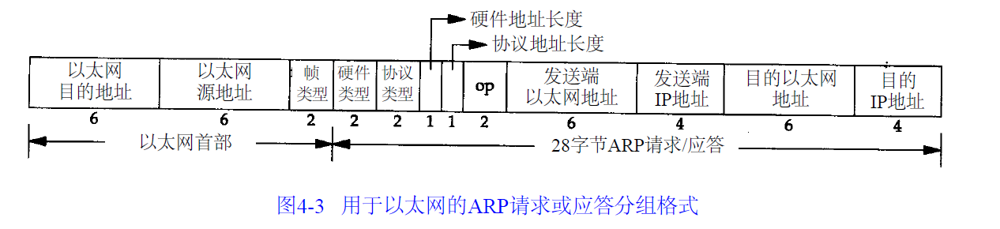
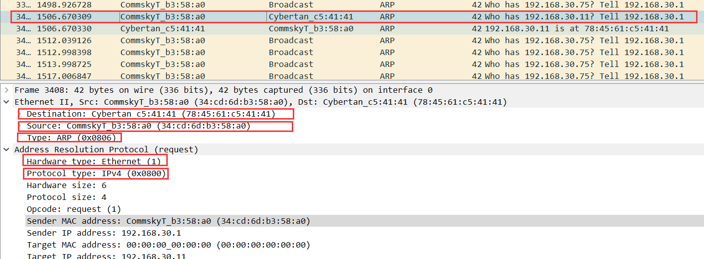

## 链路层

主要目的：

- 为IP模块发送和接受IP数据报
- 为A R P模块发送A R P请求和接收A R P应答
- 为R A R P发送R A R P请求和接收R A R P应答。

当一台主机把以太网数据帧发送到位于同一局域网上的另一台主机时，是根据48 bit的以太网地址来确定目的接口的。设备驱动程序从不检查I P数据报中的目的I P地址

AR P发送一份称作A R P请求的以太网数据帧给以太网上的每个主机。这个过程称作广播

目的主机的A R P层收到这份广播报文后，识别出这是发送端在寻问它的I P地址，于是发送一个A R P应答。这个A R P应答包含I P地址及对应的硬件地址。

