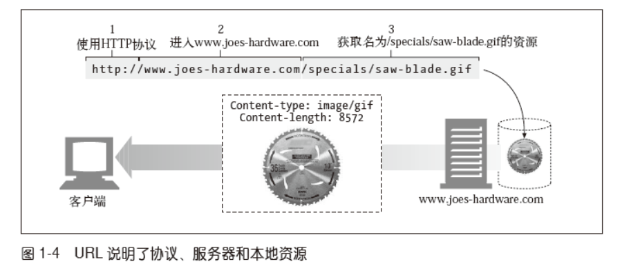
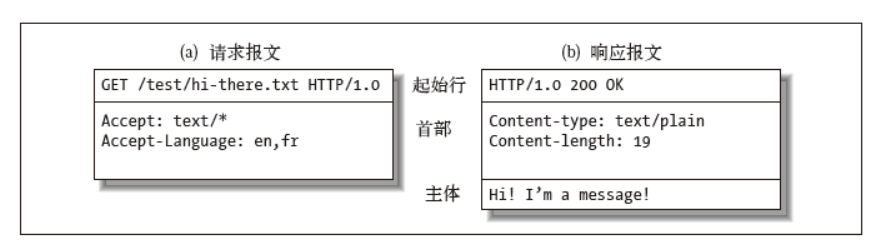

## 资源

### URI

每个Web服务器资源都有一个名字，这样客户端就可以说明它们感兴趣的资源是什么了。服务器资源名被称为统一资源标识符`（Uniform Resource Identifier，URI）`。
URI 就像因特网上的邮政地址一样，在世界范围内唯一标识并定位信息资源。URI 有两种形式，分别称为`URL` 和`URN`

### URL

统一资源定位符（URL）是资源标识符最常见的形式。URL 描述了一台特定服务器上某资源的特定位置。它们可以明确说明如何从一个精确、固定的位置获取资源。现在，几乎所有的URI都是URL

```jade
<scheme>://<user>:<password>@<host>:<port>/<path>;<params>?<query>#<frag>
```





### URN

URI 的第二种形式就是统一资源名（URN）。URN 是作为特定内容的唯一名称使用的，与目前的资源所在地无关。使用这些与位置无关的URN，就可以将资源四处搬移。通过URN，还可以用同一个名字通过多种网络访问协议来访问资源。


## Http报文

HTTP 报文是由一行一行的简单字符串组成的。HTTP 报文都是纯文本，不是二进制代码



## 协议版本

- HTTP/0.9

  HTTP 的1991 原型版本称为HTTP/0.9。这个协议有很多严重的设计缺陷，只应该用于与老客户端的交互。`HTTP/0.9`只支持`GET`方法，不支持多媒体内容的MIME类型、各种HTTP 首部，或者版本号。HTTP/0.9 定义的初衷是为了获取简单的HTML对象，它很快就被 `HTTP/1.0` 取代了。

- HTTP/1.0

  1.0 是第一个得到广泛使用的HTTP 版本。HTTP/1.0 添加了版本号、各种HTTP首部、一些额外的方法，以及对多媒体对象的处理。HTTP/1.0 使得包含生动图片的Web页面和交互式表格成为可能，而这些页面和表格促使万维网为人们广泛地接受。这个规范从未得到良好地说明。在这个HTTP 协议的商业演进和学术研究都在快速进行的时代，它集合了一系列的最佳实践。

- HTTP/1.0+

  在20 世纪90 年代中叶，很多流行的Web 客户端和服务器都在飞快地向HTTP中添加各种特性，以满足快速扩张且在商业上十分成功的万维网的需要。其中很多特性，包括持久的`keep-alive` 连接、虚拟主机支持，以及代理连接支持都被加入到HTTP之中，并成为非官方的事实标准。这种非正式的HTTP扩展版本通常称为HTTP/1.0+。	

- HTTP/1.1

  HTTP/1.1 重点关注的是校正HTTP 设计中的结构性缺陷，明确语义，引入重要的性能优化措施，并删除一些不好的特性。HTTP/1.1 还包含了对20世纪90 年代末正在发展中的更复杂的Web 应用程序和部署方式的支持。HTTP/1.1 是当前使用的HTTP版本。

- HTTP-NG（又名HTTP/2.0）

  HTTP-NG 是HTTP/1.1 后继结构的原型建议，它重点关注的是性能的大幅优化，以及更强大的服务逻辑远程执行框架。


## 缓存


### [If-Unmodified-Since](https://developer.mozilla.org/zh-CN/docs/Web/HTTP/Headers/If-Unmodified-Since)

HTTP协议中的 **`If-Unmodified-Since`** 消息头用于`请求`之中，使得当前请求成为条件式请求：只有当资源在指定的时间之后没有进行过修改的情况下，服务器才会返回请求的资源，或是接受 [`POST`](https://developer.mozilla.org/zh-CN/docs/Web/HTTP/Methods/POST) 或其他 non-[safe](https://developer.mozilla.org/zh-CN/docs/Glossary/safe) 方法的请求。如果所请求的资源在指定的时间之后发生了修改，那么会返回 [`412`](https://developer.mozilla.org/zh-CN/docs/Web/HTTP/Status/412) (Precondition Failed) 错误。

```
If-Unmodified-Since: Wed, 21 Oct 2015 07:28:00 GMT
```

### [If-Modified-Since](https://developer.mozilla.org/zh-CN/docs/Web/HTTP/Headers/If-Modified-Since)

**`If-Modified-Since`** 是一个条件式`请求`首部，服务器只在所请求的资源在给定的日期时间之后对内容进行过修改的情况下才会将资源返回，状态码为 [`200`](https://developer.mozilla.org/zh-CN/docs/Web/HTTP/Status/200) 。如果请求的资源从那时起未经修改，那么返回一个不带有消息主体的 [`304`](https://developer.mozilla.org/zh-CN/docs/Web/HTTP/Status/304) 响应，而在 [`Last-Modified`](https://developer.mozilla.org/zh-CN/docs/Web/HTTP/Headers/Last-Modified) 首部中会带有上次修改时间。 不同于  [`If-Unmodified-Since`](https://developer.mozilla.org/zh-CN/docs/Web/HTTP/Headers/If-Unmodified-Since), `If-Modified-Since` 只可以用在 [`GET`](https://developer.mozilla.org/zh-CN/docs/Web/HTTP/Methods/GET) 或 [`HEAD`](https://developer.mozilla.org/zh-CN/docs/Web/HTTP/Methods/HEAD) 请求中。

当与 [`If-None-Match`](https://developer.mozilla.org/zh-CN/docs/Web/HTTP/Headers/If-None-Match) 一同出现时，它（**`If-Modified-Since`**）会被忽略掉，除非服务器不支持 `If-None-Match`。

```
If-Modified-Since: Wed, 21 Oct 2015 07:28:00 GMT
```

### [Last-Modified](https://developer.mozilla.org/zh-CN/docs/Web/HTTP/Headers/Last-Modified)

The **`Last-Modified`** 是一个响应首部，其中包含源头服务器认定的资源做出修改的日期及时间。 它通常被用作一个验证器来判断接收到的或者存储的资源是否彼此一致。由于精确度比  [`ETag`](https://developer.mozilla.org/zh-CN/docs/Web/HTTP/Headers/ETag) 要低，所以这是一个备用机制。包含有  [`If-Modified-Since`](https://developer.mozilla.org/zh-CN/docs/Web/HTTP/Headers/If-Modified-Since) 或 [`If-Unmodified-Since`](https://developer.mozilla.org/zh-CN/docs/Web/HTTP/Headers/If-Unmodified-Since) 首部的条件请求会使用这个字段。

```
Last-Modified: Wed, 21 Oct 2015 07:28:00 GMT
```

### [If-None-Match](https://developer.mozilla.org/zh-CN/docs/Web/HTTP/Headers/If-None-Match)

**`If-None-Match`** 是一个条件式`请求`首部。对于 GET[`GET`](https://developer.mozilla.org/zh-CN/docs/Web/HTTP/Methods/GET) 和 [`HEAD`](https://developer.mozilla.org/zh-CN/docs/Web/HTTP/Methods/HEAD) 请求方法来说，当且仅当服务器上没有任何资源的 [`ETag`](https://developer.mozilla.org/zh-CN/docs/Web/HTTP/Headers/ETag) 属性值与这个首部中列出的相匹配的时候，服务器端会才返回所请求的资源，响应码为 [`200`](https://developer.mozilla.org/zh-CN/docs/Web/HTTP/Status/200) 。对于其他方法来说，当且仅当最终确认没有已存在的资源的 [`ETag`](https://developer.mozilla.org/zh-CN/docs/Web/HTTP/Headers/ETag) 属性值与这个首部中所列出的相匹配的时候，才会对请求进行相应的处理。

对于 [`GET`](https://developer.mozilla.org/zh-CN/docs/Web/HTTP/Methods/GET) 和 [`HEAD`](https://developer.mozilla.org/zh-CN/docs/Web/HTTP/Methods/HEAD) 方法来说，当验证失败的时候，服务器端必须返回响应码 304 （Not Modified，未改变）。对于能够引发服务器状态改变的方法，则返回 412 （Precondition Failed，前置条件失败）。需要注意的是，服务器端在生成状态码为 304 的响应的时候，必须同时生成以下会存在于对应的 200 响应中的首部：Cache-Control、Content-Location、Date、ETag、Expires 和 Vary 。

[`ETag`](https://developer.mozilla.org/zh-CN/docs/Web/HTTP/Headers/ETag) 属性之间的比较采用的是**弱比较算法**，即两个文件除了每个比特都相同外，内容一致也可以认为是相同的。例如，如果两个页面仅仅在页脚的生成时间有所不同，就可以认为二者是相同的。

当与 [`If-Modified-Since`](https://developer.mozilla.org/zh-CN/docs/Web/HTTP/Headers/If-Modified-Since) 一同使用的时候，If-None-Match 优先级更高（假如服务器支持的话）。

```
If-None-Match: <etag_value>
If-None-Match: <etag_value>, <etag_value>, …
If-None-Match: *
```

星号是一个特殊值，可以代表任意资源。它只用在进行资源上传时，通常是采用 [`PUT`](https://developer.mozilla.org/zh-CN/docs/Web/HTTP/Methods/PUT) 方法，来检测拥有相同识别ID的资源是否已经上传过了。防止之前操作数据的丢失。

### [Cache-Control](https://developer.mozilla.org/zh-CN/docs/Web/HTTP/Headers/Cache-Control)

`**Cache-Control**` 通用`消息头`字段，被用于在http请求和`响应`中，通过指定指令来实现缓存机制。缓存指令是单向的，这意味着在请求中设置的指令，不一定被包含在响应中。

- 缓存请求指令

```jav
Cache-Control: max-age=<seconds>
Cache-Control: max-stale[=<seconds>]
Cache-Control: min-fresh=<seconds>
Cache-control: no-cache
Cache-control: no-store
Cache-control: no-transform
Cache-control: only-if-cached
```


- 缓存响应指令

```
Cache-control: must-revalidate
Cache-control: no-cache
Cache-control: no-store
Cache-control: no-transform
Cache-control: public
Cache-control: private
Cache-control: proxy-revalidate
Cache-Control: max-age=<seconds>
Cache-control: s-maxage=<seconds>
```

**public**

表明响应可以被任何对象（包括：发送请求的客户端，代理服务器，等等）缓存，即使是通常不可缓存的内容。（例如：1.该响应没有`max-age`指令或`Expires`消息头；2. 该响应对应的请求方法是 [POST](https://developer.mozilla.org/zh-CN/docs/Web/HTTP/Methods/POST) 。）

**private**

表明响应只能被单个用户缓存，不能作为共享缓存（即代理服务器不能缓存它）。私有缓存可以缓存响应内容，比如：对应用户的本地浏览器。

**no-cache**

在发布缓存副本之前，强制要求缓存把请求提交给原始服务器进行验证(协商缓存验证)。

**no-store**

缓存不应存储有关客户端请求或服务器响应的任何内容，即不使用任何缓存。

**max-age=<seconds>**

设置缓存存储的最大周期，超过这个时间缓存被认为过期(单位秒)。与`Expires`相反，时间是相对于请求的时间。

**s-maxage=<seconds>**

覆盖`max-age`或者`Expires`头，但是仅适用于共享缓存(比如各个代理)，私有缓存会忽略它。

**max-stale[=<seconds>]**

表明客户端愿意接收一个已经过期的资源。可以设置一个可选的秒数，表示响应不能已经过时超过该给定的时间。

**min-fresh=<seconds>**

表示客户端希望获取一个能在指定的秒数内保持其最新状态的响应。

**must-revalidate**

一旦资源过期（比如已经超过`max-age`），在成功向原始服务器验证之前，缓存不能用该资源响应后续请求。

**proxy-revalidate**

与must-revalidate作用相同，但它仅适用于共享缓存（例如代理），并被私有缓存忽略。

**no-transform**

不得对资源进行转换或转变。`Content-Encoding`、`Content-Range`、`Content-Type`等HTTP头不能由代理修改。例如，非透明代理或者如[Google's Light Mode](https://support.google.com/webmasters/answer/6211428?hl=en)可能对图像格式进行转换，以便节省缓存空间或者减少缓慢链路上的流量。`no-transform`指令不允许这样做。

**only-if-cached**

表明客户端只接受已缓存的响应，并且不要向原始服务器检查是否有更新的拷贝。


### [Pragma](https://developer.mozilla.org/zh-CN/docs/Web/HTTP/Headers/Pragma)

`**Pragma**` 是一个在 HTTP/1.0 中规定的通用首部，这个首部的效果依赖于不同的实现，所以在“请求-响应”链中可能会有不同的效果。它用来向后兼容只支持 HTTP/1.0 协议的缓存服务器，那时候 HTTP/1.1 协议中的 Cache-Control 还没有出来。

```
Pragma: no-cache
```

与 Cache-Control: no-cache 效果一致。强制要求缓存服务器在返回缓存的版本之前将请求提交到源头服务器进行验证。


### [Expires](https://developer.mozilla.org/zh-CN/docs/Web/HTTP/Headers/Expires)

`**Expires**` 响应头包含日期/时间， 即在此时候之后，响应过期。

 如果在[`Cache-Control`](https://developer.mozilla.org/zh-CN/docs/Web/HTTP/Headers/Cache-Control)响应头设置了 "max-age" 或者 "s-max-age" 指令，那么 `Expires` 头会被忽略。

```
Expires: Wed, 21 Oct 2015 07:28:00 GMT
```
