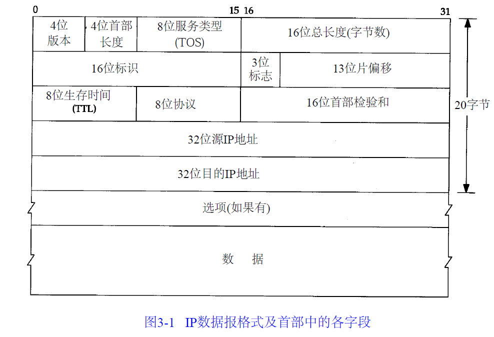
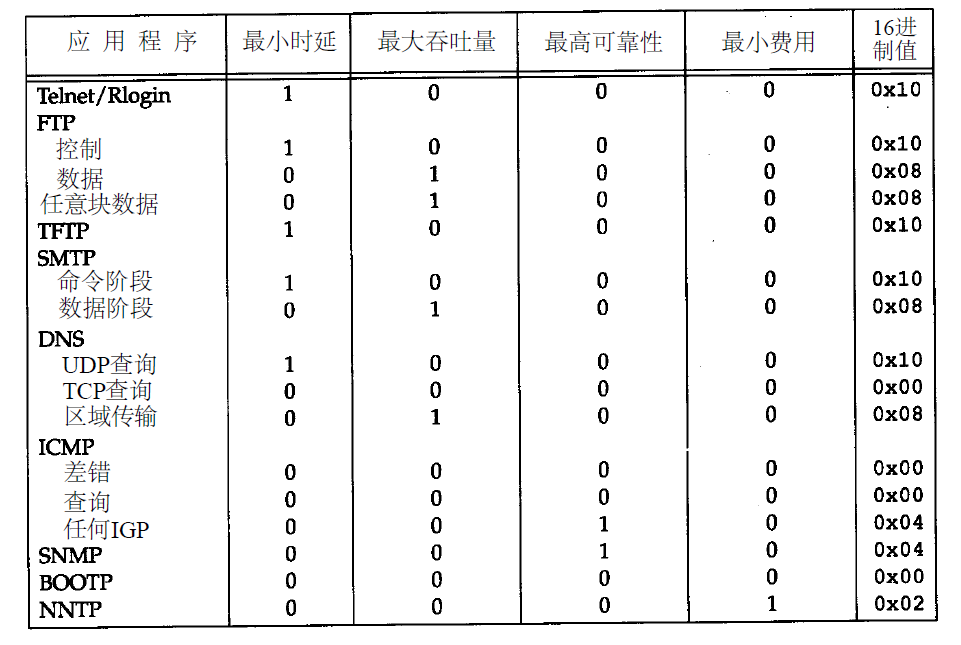

## IP首部

提供不可靠、无连接的数据报传送服务

- 4位版本：IPv4
- 首部长度：首部占32bit字的数目，由于是一个4比特长度，因此首部最长为60个字节，这种限制在某些路由器已经不起作用
- TOS：
- 

- 总长度：总长度字段是指整个I P数据报的长度，以字节为单位。利用首部长度字段和总长度字段，就可以知道I P数据报中数据内容的起始位置和长度。由于该字段长1 6比特，所以I P数据报最长可达65535字节
- 16位标识：标识字段唯一地标识主机发送的每一份数据报。通常每发送一份报文它的值就会加1
- TTL：设置了数据报可以经过的最多路由器数，T T L的初始值由源主机设置（通常为3 2或6 4），一旦经过一个处理它的路由器，它的值就减去1。当该字段的值为0时，数据报就被丢弃，并发送I C M P报文通知源主机
- 

