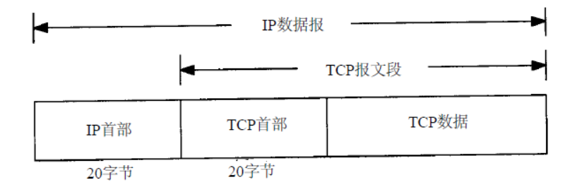
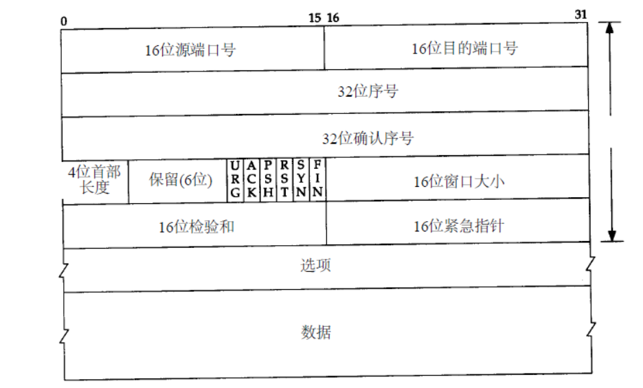

## 数据结构

TCP数据在IP中的封装,  TCP传递给IP的信息单位称为报文段或段（ segment ),  TCP为应用层提供全双工服

每个TCP段都包含源端和目的端的端口号，用于寻找发端和收端应用进程。这两个值加上IP首部中的源端IP地址和目的端IP地址唯一确定一个TCP连接。

有时，一个IP地址和一个端口号也称为一个插口（socket），这个术语出现在最早的TCP规范（RFC793）中。

序号用来标识从TCP发端向TCP收端发送的数据字节流，它表示在这个报文段中的的第一个数据字节。如果将字节流看作在两个应用程序间的单向流动，则TCP用序号对每个字节进行计数。序号是32bit的无符号数

- SYN 当SYN=1，ACK=0，表明是连接请求报文，若同意连接，则响应报文中应该使SYN=1，ACK=1；
- FIN 发送方完成数据发送
- RST 表明TCP连接中出现严重差错，必须释放连接，然后再重新建立连接
- PSH 尽可能快的将数据送往接收进程
- ACK 确认序号，仅当ACK=1时，确认号字段才有效。TCP规定，在连接建立后所有报文的传输都必须把ACK置1；
- URG 当URG=1，表明紧急指针字段有效。告诉系统此报文段中有紧急数据

## 如何提供可靠性

- 应用数据被分割成TCP认为最合适发送的数据块。这和UDP完全不同，应用程序产生的数据报长度将保持不变，由TCP传递给IP的信息单位称为`报文`或`段（segment）`。
- 当TCP发出一个段后，它启动一个定时器，等待目的端确认收到这个报文段。如果不能及时收到一个确认，将重发这个报文段。
- 当TCP收到TCP连接另一端的数据，它将发送一个确认。这个确认不是立即发送，通常将推迟几分之一秒。
- TCP将保持它首部和数据的校验和。
- 如果有必要TCP将对收到的数据进行重新排序
- TCP的接收端必须丢弃重复的数据
- TCP还能提供流量控制。

## 三次握手

TCP是一个面向连接的协议。无论哪一方向另一方发送数据之前，都必须先在双方之间建立一条连接。

1. 第一次握手：客户端向服务器发送报文段1，其中的 `SYN` 标志位的值为 1，表示这是一个`用于请求发起连接的报文段`，其中的序号字段 (Sequence Number，图中简写为seq)被设置为初始序号x (Initial Sequence Number，ISN)，TCP 连接双方均可随机选择初始序号。发送完报文段1之后，客户端进入 `SYN-SENT` 状态，等待服务器的确认。

   

2. 第二次握手：服务器在收到客户端的连接请求后，向客户端发送报文段2作为应答，其中 `ACK` 标志位设置为 1，表示对客户端做出应答，其确认序号字段 (Acknowledgment Number，图中简写为小写 ack) 生效，该字段值为 x + 1，也就是从客户端收到的报文段的序号加1，代表服务器期望下次收到客户端的数据的序号。此外，报文段2的 SYN 标志位也设置为1，代表这同时也是一个用于发起连接的报文段，序号 seq 设置为服务器初始序号y。发送完报文段2后，服务器进入 SYN-RECEIVED 状态。

3. 第三次握手：客户端在收到报文段2后，向服务器发送报文段3，其 ACK 标志位为1，代表对服务器做出应答，确认序号字段 ack 为 y + 1，序号字段 seq 为 x + 1。此报文段发送完毕后，双方都进入 `ESTABLISHED` 状态，表示连接已建立。

### TCP 建立连接为什么要三次握手而不是两次？

1. 防止已过期的连接请求报文突然又传送到服务器，因而产生错误

   在双方两次握手即可建立连接的情况下，假设客户端发送 A 报文段请求建立连接，由于网络原因造成 A 暂时无法到达服务器，服务器接收不到请求报文段就不会返回确认报文段，客户端在长时间得不到应答的情况下重新发送请求报文段 B，这次 B 顺利到达服务器，服务器随即返回确认报文并进入 ESTABLISHED 状态，客户端在收到 确认报文后也进入 ESTABLISHED 状态，双方建立连接并传输数据，之后正常断开连接。此时姗姗来迟的 A 报文段才到达服务器，服务器随即返回确认报文并进入 ESTABLISHED 状态，但是已经进入 CLOSED 状态的客户端无法再接受确认报文段，更无法进入 ESTABLISHED 状态，这将导致服务器长时间单方面等待，造成资源浪费。

2. 三次握手才能让双方均确认自己和对方的发送和接收能力都正常

   第一次握手：客户端只是发送处请求报文段，什么都无法确认，而服务器可以确认自己的接收能力和对方的发送能力正常；

   第二次握手：客户端可以确认自己发送能力和接收能力正常，对方发送能力和接收能力正常；

   第三次握手：服务器可以确认自己发送能力和接收能力正常，对方发送能力和接收能力正常；

   可见三次握手才能让双方都确认自己和对方的发送和接收能力全部正常，这样就可以愉快地进行通信了。

3. 告知对方自己的初始序号值，并确认收到对方的初始序号值

   TCP 实现了可靠的数据传输，原因之一就是 TCP 报文段中维护了序号字段和确认序号字段，也就是图中的 seq 和 ack，通过这两个字段双方都可以知道在自己发出的数据中，哪些是已经被对方确认接收的。这两个字段的值会在初始序号值得基础递增，如果是两次握手，只有发起方的初始序号可以得到确认，而另一方的初始序号则得不到确认。

### TCP 建立连接为什么要三次握手而不是四次？

因为三次握手已经可以确认双方的发送接收能力正常，双方都知道彼此已经准备好，而且也可以完成对双方初始序号值得确认，也就无需再第四次握手了。

### 有一种网络攻击是利用了 TCP 建立连接机制的漏洞，你了解吗？这个问题怎么解决？

在三次握手过程中，服务器在收到了客户端的 SYN 报文段后，会分配并初始化连接变量和缓存，并向客户端发送 SYN + ACK 报文段，这相当于是打开了一个“半开连接 (half-open connection)”，会消耗服务器资源。如果客户端正常返回了 ACK 报文段，那么双方可以正常建立连接，否则，服务器在等待一分钟后会终止这个“半开连接”并回收资源。这样的机制为 SYN洪泛攻击 (SYN flood attack)提供了机会，这是一种经典的 DoS攻击 (Denial of Service，拒绝服务攻击)，所谓的拒绝服务攻击就是通过进行攻击，使受害主机或网络不能提供良好的服务，从而间接达到攻击的目的。在 SYN 洪泛攻击中，攻击者发送大量的 SYN 报文段到服务器请求建立连接，但是却不进行第三次握手，这会导致服务器打开大量的半开连接，消耗大量的资源，最终无法进行正常的服务。

解决方法：SYN Cookies，现在大多数主流操作系统都有这种防御系统。SYN Cookies 是对 TCP 服务器端的三次握手做一些修改，专门用来防范 SYN 洪泛攻击的一种手段。它的原理是，在服务器接收到 SYN 报文段并返回 SYN + ACK 报文段时，不再打开一个半开连接，也不分配资源，而是根据这个 SYN 报文段的重要信息 (包括源和目的 IP 地址，端口号可一个秘密数)，利用特定散列函数计算出一个 cookie 值。这个 cookie 作为将要返回的SYN + ACK 报文段的初始序列号(ISN)。当客户端返回一个 ACK 报文段时，服务器根据首部字段信息计算 cookie，与返回的确认序号(初始序列号 + 1)进行对比，如果相同，则是一个正常连接，然后分配资源并建立连接，否则拒绝建立连接。

## 四次挥手

建立一个连接需要三次握手，而终止一个连接要经过 4次握手。这由 TCP 的半关闭( half-close) 造成的。既然一个 TCP 连接是全双工 (即数据在两个方向上能同时传递)， 因此每个方向必须单独地进行关闭。这原则就是当一方完成它的数据发送任务后就能发送一个 FIN 来终止这个方向连接。当一端收到一个 FIN，它必须通知应用层另一端已经终止了数据传送。理论上客户端和服务器都可以发起主动关闭，但是更多的情况下是客户端主动发起。

1. 客户端发送关闭连接的报文段，FIN 标志位1，请求关闭连接，并停止发送数据。序号字段 seq = x (等于之前发送的所有数据的最后一个字节的序号加一)，然后客户端会进入 `FIN-WAIT-1` 状态，等待来自服务器的确认报文。
2. 服务器收到 FIN 报文后，发回确认报文，ACK = 1， ack = x + 1，并带上自己的序号 seq = y，然后服务器就进入 `CLOSE-WAIT` 状态。服务器还会通知上层的应用程序对方已经释放连接，此时 TCP 处于半关闭状态，也就是说客户端已经没有数据要发送了，但是服务器还可以发送数据，客户端也还能够接收。
3. 客户端收到服务器的 ACK 报文段后随即进入 `FIN-WAIT-2` 状态，此时还能收到来自服务器的数据，直到收到 FIN 报文段。
4. 服务器发送完所有数据后，会向客户端发送 FIN 报文段，随后服务器进入 `LAST-ACK` 状态，等待来自客户端的确认报文段。
5. 客户端收到来自服务器的 FIN 报文段后，向服务器发送 ACK 报文，随后进入 `TIME-WAIT` 状态，等待 2MSL(2 * Maximum Segment Lifetime，两倍的报文段最大存活时间) ，这是任何报文段在被丢弃前能在网络中存在的最长时间，常用值有30秒、1分钟和2分钟。如无特殊情况，客户端会进入 CLOSED 状态。
6. 服务器在接收到客户端的 ACK 报文后会随即进入 `CLOSED` 状态，由于没有等待时间，一般而言，服务器比客户端更早进入 CLOSED 状态。

###  为什么 TCP 关闭连接为什么要四次而不是三次？

服务器在收到客户端的 FIN 报文段后，可能还有一些数据要传输，所以不能马上关闭连接，但是会做出应答，返回 ACK 报文段，接下来可能会继续发送数据，在数据发送完后，服务器会向客户单发送 FIN 报文，表示数据已经发送完毕，请求关闭连接，然后客户端再做出应答，因此一共需要四次挥手。

### 客户端为什么需要在 TIME-WAIT 状态等待 2MSL 时间才能进入 CLOSED 状态？

按照常理，在网络正常的情况下，四个报文段发送完后，双方就可以关闭连接进入 CLOSED 状态了，但是网络并不总是可靠的，如果客户端发送的 ACK 报文段丢失，服务器在接收不到 ACK 的情况下会一直重发 FIN 报文段，这显然不是我们想要的。因此客户端为了确保服务器收到了 ACK，会设置一个定时器，并在 TIME-WAIT 状态等待 2MSL 的时间，如果在此期间又收到了来自服务器的 FIN 报文段，那么客户端会重新设置计时器并再次等待 2MSL 的时间，如果在这段时间内没有收到来自服务器的 FIN 报文，那就说明服务器已经成功收到了 ACK 报文，此时客户端就可以进入 CLOSED 状态了。

