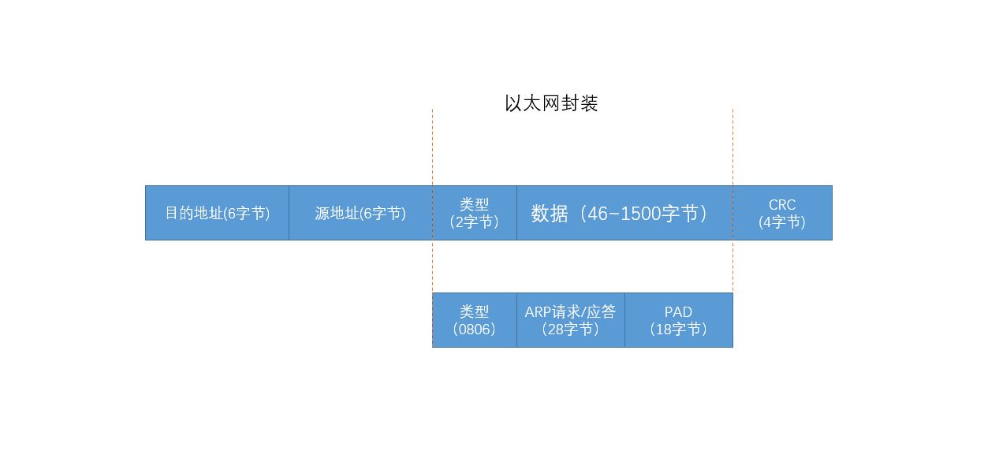
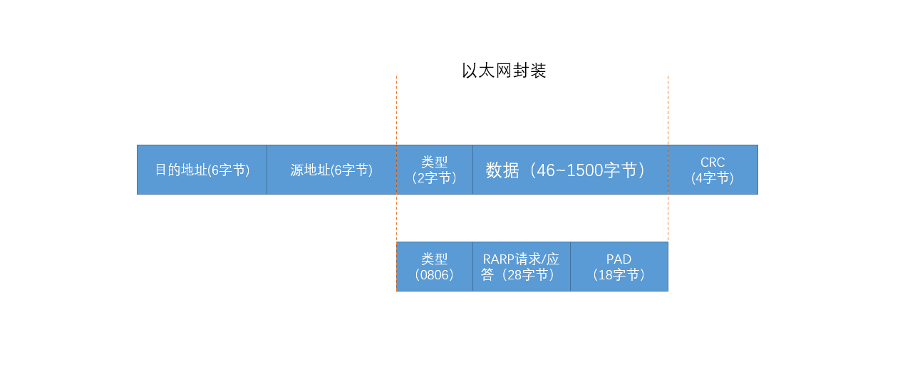

## 链路层的作用

- 为IP模块发送和接收IP数据报
- 为ARP模块发送ARP请求和接收ARP应答
- 为RARP发送RARP请求和接收RARP应答

## 以太网和IEEE 802封装








- 长度字段是指它后续数据的字节长度，但不包括CRC检验码
- 目的服务访问点（ Destination Service Access Point,DSAP）和源服务访问点（ Source Service Access Point, SSAP）的值都设为0xaa
- ctrl字段的值设为3。随后的3个字节org code都置为0。


## MTU

以太网和802 . 3对数据帧的长度都有一个限制，其最大值分别是`1500`和`1492`字节。链路层的这个特性称作MTU，最大传输单元。


## netstat

```

C:\Users\lihao>netstat -h

显示协议统计信息和当前 TCP/IP 网络连接。

NETSTAT [-a] [-b] [-e] [-f] [-n] [-o] [-p proto] [-r] [-s] [-t] [-x] [-y] [interval]

  -a            显示所有连接和侦听端口。
  -b            显示在创建每个连接或侦听端口时涉及的
                可执行文件。在某些情况下，已知可执行文件托管
                多个独立的组件，此时会
                显示创建连接或侦听端口时
                涉及的组件序列。在此情况下，可执行文件的
                名称位于底部 [] 中，它调用的组件位于顶部，
                直至达到 TCP/IP。注意，此选项
                可能很耗时，并且可能因为你没有足够的
                权限而失败。
  -e            显示以太网统计信息。此选项可以与 -s 选项
                结合使用。
  -f            显示外部地址的完全限定
                域名(FQDN)。
  -n            以数字形式显示地址和端口号。
  -o            显示拥有的与每个连接关联的进程 ID。
  -p proto      显示 proto 指定的协议的连接；proto
                可以是下列任何一个: TCP、UDP、TCPv6 或 UDPv6。如果与 -s
                选项一起用来显示每个协议的统计信息，proto 可以是下列任何一个:
                IP、IPv6、ICMP、ICMPv6、TCP、TCPv6、UDP 或 UDPv6。
  -q            显示所有连接、侦听端口和绑定的
                非侦听 TCP 端口。绑定的非侦听端口
                不一定与活动连接相关联。
  -r            显示路由表。
  -s            显示每个协议的统计信息。默认情况下，
                显示 IP、IPv6、ICMP、ICMPv6、TCP、TCPv6、UDP 和 UDPv6 的统计信息；
                -p 选项可用于指定默认的子网。
  -t            显示当前连接卸载状态。
  -x            显示 NetworkDirect 连接、侦听器和共享
                终结点。
  -y            显示所有连接的 TCP 连接模板。
                无法与其他选项结合使用。
  interval      重新显示选定的统计信息，各个显示间暂停的
                间隔秒数。按 CTRL+C 停止重新显示
                统计信息。如果省略，则 netstat 将打印当前的
                配置信息一次。
```


