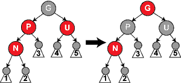

## rb_node 结构

`include/linux/rbtree.h`

```c
struct rb_node
{
	// rb_parent_color成员实际上包含了父节点指针和自己的颜色信息
	unsigned long  rb_parent_color;
#define	RB_RED		0
#define	RB_BLACK	1
	struct rb_node *rb_right;
	struct rb_node *rb_left;
} __attribute__((aligned(sizeof(long)))); // 把结构体的地址按“sizeof(long)”对齐
	// 对于32位机,sizeof(long)为4 (即结构体内的数据类型的地址为4的倍数)。
	// 对于64位机，sizeof(long)为8(结构体内的数据类型的地址为8的倍数).
    // 任何rb_node结构体的地址的低两位肯定都是零，与其空着不用，还不如用它们表示颜色，反正颜色就两种，其实一位就已经够了。
	// 
    /* The alignment might seem pointless, but allegedly CRIS needs it */

struct rb_root
{
	struct rb_node *rb_node;
};
```

## rb_link_node

`include/linux/rbtree.h`

```c
static inline void rb_link_node(struct rb_node * node, struct rb_node * parent,struct rb_node ** rb_link)
{
    // 设置父节点指针
	node->rb_parent_color = (unsigned long )parent;
    // 并且将节点的左右节点都设置为空NULL
	node->rb_left = node->rb_right = NULL;

    // 注意此时插入的节点还没有颜色，
    // rb_link表示的为父节点的左子节点或者右子节点，即node插入的是父节点的左子节点，还是右子节点
	*rb_link = node;
}
```

## rb_insert_color

`rbtree.c`

我们在插入新节点时，新节点的演颜色是没有设置的，即值为0，红色的值就是0，即默认插入的新节点的颜色是红色，`如果父节点是黑色或者父节点就是根节点就很简单了`，不需要做什么。这个两种就是与**情形1**和**情形2**

如果父节点是红色，就需要分情况了。因为涉及到旋转还需要考虑叔父节点的颜色

```c
void rb_insert_color(struct rb_node *node, struct rb_root *root)
{
	struct rb_node *parent, *gparent;

	while ((parent = rb_parent(node)) && rb_is_red(parent))
	{
		// 父节点颜色是红色
        // 祖父节点
		gparent = rb_parent(parent);

		// 父节点的颜色是红的，那么祖父节点的颜色一定是黑色的
		// 叔父节点的颜色就可红可黑了
		if (parent == gparent->rb_left)
		{
			{
				// 情形3
				register struct rb_node *uncle = gparent->rb_right;
				if (uncle && rb_is_red(uncle))
				{
					// 叔父节点的颜色也是红色的
					// 重构颜色
					rb_set_black(uncle);
					rb_set_black(parent);
					rb_set_red(gparent);
					// 因为通过父节点P或叔父节点U的任何路径都必定通过祖父节点G，
					// 在这些路径上的黑节点数目没有改变。但是，红色的祖父节点G
					// 可能是根节点，这就违反了性质2，也有可能祖父节点G的父节点
					// 是红色的，这就违反了性质4。为了解决这个问题，我们在祖父
					// 节点G上递归地进行整个过程:把G当成是新加入的节点进行各种情形的检查
					
					// 下一步对G进行递归检查
					node = gparent;
					continue;
				}
			}
            
			if (parent->rb_right == node)
			{
				// 情形4
				// 如果叔父节点不存在，或者叔父节点的颜色是黑色
				register struct rb_node *tmp;
				// 对父父节点进行左旋
				__rb_rotate_left(parent, root);
				tmp = parent;
				parent = node;
				// 父节点左旋后，父节点变成新插入的节点了，下面对父节点进行情形5的处理
				node = tmp;
			}
			
			// 情形5
			rb_set_black(parent);
			rb_set_red(gparent);
			__rb_rotate_right(gparent, root);
		} else {
            // 对称设置
			{
				register struct rb_node *uncle = gparent->rb_left;
				if (uncle && rb_is_red(uncle))
				{
					rb_set_black(uncle);
					rb_set_black(parent);
					rb_set_red(gparent);
					node = gparent;
					continue;
				}
			}

			if (parent->rb_left == node)
			{
				register struct rb_node *tmp;
				__rb_rotate_right(parent, root);
				tmp = parent;
				parent = node;
				node = tmp;
			}

			rb_set_black(parent);
			rb_set_red(gparent);
			__rb_rotate_left(gparent, root);
		}
	}

	// 将根节点设置黑色
	rb_set_black(root->rb_node);
}
```

**情形1**:新节点N位于树的根上，没有父节点。在这种情形下，我们把它重绘为黑色以满足性质2。因为它在每个路径上对黑节点数目增加一，性质5符合。

**情形2**:新节点的父节点P是黑色，所以性质4没有失效（新节点是红色的）。在这种情形下，树仍是有效的。性质5也未受到威胁，尽管新节点N有两个黑色叶子子节点；但由于新节点N是红色，通过它的每个子节点的路径就都有同通过它所取代的黑色的叶子的路径同样数目的黑色节点，所以依然满足这个性质。

**情形3**:如果父节点P和叔父节点U二者都是红色，（此时新插入节点N做为P的左子节点或右子节点都属于情形3，这里右图仅显示N做为P左子的情形）则我们可以将它们两个重绘为黑色并重绘祖父节点G为红色（用来保持性质5）。现在我们的新节点N有了一个黑色的父节点P。因为通过父节点P或叔父节点U的任何路径都必定通过祖父节点G，在这些路径上的黑节点数目没有改变。但是，红色的祖父节点G可能是根节点，这就违反了性质2，也有可能祖父节点G的父节点是红色的，这就违反了性质4。为了解决这个问题，我们在祖父节点G上递归地进行**情形1**的整个过程。（把G当成是新加入的节点进行各种情形的检查）



**情形4**:父节点P是红色而叔父节点U是黑色或缺少，并且新节点N是其父节点P的右子节点而父节点P又是其父节点的左子节点。在这种情形下，我们进行一次[左旋转](https://zh.m.wikipedia.org/wiki/树旋转)调换新节点和其父节点的角色;接着，我们按**情形5**处理以前的父节点P以解决仍然失效的性质4。注意这个改变会导致某些路径通过它们以前不通过的新节点N（比如图中1号叶子节点）或不通过节点P（比如图中3号叶子节点），但由于这两个节点都是红色的，所以性质5仍有效。


**情形5**：父节点P是红色而叔父节点U是黑色或缺少，新节点N是其父节点的左子节点，而父节点P又是其父节点G的左子节点。在这种情形下，我们进行针对祖父节点G的一次[右旋转](https://zh.m.wikipedia.org/wiki/树旋转)；在旋转产生的树中，以前的父节点P现在是新节点N和以前的祖父节点G的父节点。我们知道以前的祖父节点G是黑色，否则父节点P就不可能是红色（如果P和G都是红色就违反了性质4，所以G必须是黑色）。我们切换以前的父节点P和祖父节点G的颜色，结果的树满足性质4。性质5也仍然保持满足，因为通过这三个节点中任何一个的所有路径以前都通过祖父节点G，现在它们都通过以前的父节点P。在各自的情形下，这都是三个节点中唯一的黑色节点。


## rb_erase

删除节点,删除一个节点，可以转变为删除这个节点的后继节点，如果这个后继节点是红色，直接删除，后继节点的子节点替换这个后继节点就可以，注意一点，后继节点没有左子节点，可能有右子节点。

如果这个后继节点是黑色的，而这个后继节点的右子节点是红色的，这个也比较简单，替换然后把这个右子节点染黑就可以了。

比较麻烦的是这个后继节点的右子节点是黑色的情况，下面都是对这种情况的讨论。


**情形1:** N是新的根。在这种情形下，我们就做完了。我们从所有路径去除了一个黑色节点，而新根是黑色的，所以性质都保持着。

**情形2：** S是红色。在这种情形下我们在N的父亲上做[左旋转](https://zh.m.wikipedia.org/wiki/树旋转)，把红色兄弟转换成N的祖父，我们接着对调N的父亲和祖父的颜色。完成这两个操作后，尽管所有路径上黑色节点的数目没有改变，但现在N有了一个黑色的兄弟和一个红色的父亲（它的新兄弟是黑色因为它是红色S的一个儿子），所以我们可以接下去按**情形4**、**情形5**或**情形6**来处理。


**情形3：** N的父亲、S和S的儿子都是黑色的。在这种情形下，我们简单的重绘S为红色。结果是通过S的所有路径，它们就是以前*不*通过N的那些路径，都少了一个黑色节点。因为删除N的初始的父亲使通过N的所有路径少了一个黑色节点，这使事情都平衡了起来。但是，通过P的所有路径现在比不通过P的路径少了一个黑色节点，所以仍然违反性质5。要修正这个问题，我们要从**情形1**开始，在P上做重新平衡处理。


**情形4：** S和S的儿子都是黑色，但是N的父亲是红色。在这种情形下，我们简单的交换N的兄弟和父亲的颜色。这不影响不通过N的路径的黑色节点的数目，但是它在通过N的路径上对黑色节点数目增加了一，添补了在这些路径上删除的黑色节点。


**情形5：** S是黑色，S的左儿子是红色，S的右儿子是黑色，而N是它父亲的左儿子。在这种情形下我们在S上做[右旋转](https://zh.m.wikipedia.org/wiki/树旋转)，这样S的左儿子成为S的父亲和N的新兄弟。我们接着交换S和它的新父亲的颜色。所有路径仍有同样数目的黑色节点，但是现在N有了一个黑色兄弟，他的右儿子是红色的，所以我们进入了**情形6**。N和它的父亲都不受这个变换的影响。


**情形6：** S是黑色，S的右儿子是红色，而N是它父亲的左儿子。在这种情形下我们在N的父亲上做左旋转，这样S成为N的父亲（P）和S的右儿子的父亲。我们接着交换N的父亲和S的颜色，并使S的右儿子为黑色。子树在它的根上的仍是同样的颜色，所以性质3没有被违反。但是，N现在增加了一个黑色祖先：要么N的父亲变成黑色，要么它是黑色而S被增加为一个黑色祖父。所以，通过N的路径都增加了一个黑色节点。

此时，如果一个路径不通过N，则有两种可能性：

- 它通过N的新兄弟。那么它以前和现在都必定通过S和N的父亲，而它们只是交换了颜色。所以路径保持了同样数目的黑色节点。
- 它通过N的新叔父，S的右儿子。那么它以前通过S、S的父亲和S的右儿子，但是现在只通过S，它被假定为它以前的父亲的颜色，和S的右儿子，它被从红色改变为黑色。合成效果是这个路径通过了同样数目的黑色节点。

在任何情况下，在这些路径上的黑色节点数目都没有改变。所以我们恢复了性质4。在示意图中的白色节点可以是红色或黑色，但是在变换前后都必须指定相同的颜色。


```c
// 删除节点
void rb_erase(struct rb_node *node, struct rb_root *root)
{
	struct rb_node *child, *parent;
	int color;

	/** 
     * 这里分成了2个情况：
	 *	1.node没有子节点或者只有一个子节点
 	 *  2.node有2个子节点
     */ 
	if (!node->rb_left)
		child = node->rb_right;
	else if (!node->rb_right)
		child = node->rb_left;
	else
	{
		// node有2个子节点
		// 被删除的节点存在左右子节点
		struct rb_node *old = node, *left;

		// 寻找node的后继节点：找到它右子树中的最小元素
		node = node->rb_right;
		while ((left = node->rb_left) != NULL)
			node = left;
		
		// 这里有2种情况：
		// 1.node的右孩子就是这个node的后继节点
		//           | 
		//           X
		//          / \
		//         N1 N2
		//              \
		//               N3
		// 2.node的右孩子还有左孩子，即后继节点就在最左子节点上
        //           | 
		//           X
		//          / \
		//         N1  N2
        //		      / \
		//           N3  N4
		//            \  / \
		//            N6
		// 注意：后继节点是不可能有左子节点的，但是可以有右子节点
		// 找到这个后继节点的右子节点
		child = node->rb_right;
		
		// 后继节点父节点
		parent = rb_parent(node);
		// 后继节点的颜色
		color = rb_color(node);

		if (child)
			// 后继节点存在右子节点
		    // 后继节点的右子节点绑定原来后继节点的父节点，并且保留右子节点原来的颜色
			rb_set_parent(child, parent);
			
		if (parent == old) {
			// 被删除的节点的右子节点已经没有左孩子节点了
			parent->rb_right = child;
			// 后继节点node即将取代删除的节点，所以这个node变成了parent
			parent = node;
		} else
			parent->rb_left = child;

		// 后继节点替换需要删除的节点
		node->rb_parent_color = old->rb_parent_color;
		node->rb_right = old->rb_right;
		node->rb_left = old->rb_left;

		if (rb_parent(old))
		{
			// 被删除的节点存在父节点
			// 把后继节点关联到这个父节点上
			if (rb_parent(old)->rb_left == old)
				// rb_parent(old)->rb_left == old 用来判断节点是否左子节点
				rb_parent(old)->rb_left = node;
			else
				rb_parent(old)->rb_right = node;
		} else
			// 如果删除的是根节点，那么这个后继节点现在变成根节点了
			root->rb_node = node;

		rb_set_parent(old->rb_left, node);
		if (old->rb_right)
			rb_set_parent(old->rb_right, node);
		goto color;
	}

	/** 
     * 能够运行到这里，说明node没有子节点或者只有一个子节点
     */  
	parent = rb_parent(node);
	color = rb_color(node);

	/** 
     * 删除node节点，注意：如果node是红色的，事件就做完了，如果是黑色，需要考虑是否需要平衡
     */ 
	if (child)
		rb_set_parent(child, parent);
	if (parent)
	{
		if (parent->rb_left == node)
			parent->rb_left = child;
		else
			parent->rb_right = child;
	}
	else
		root->rb_node = child;

 color:
	/** 
     * color是删除节点的颜色
     * 如果删除的是红节点，对树没有影响，所以只有删除的是黑节点时才修正颜色。 
     */  
	if (color == RB_BLACK)
		__rb_erase_color(child, parent, root);
}
EXPORT_SYMBOL(rb_erase);
```


## __rb_erase_color

```c
static void __rb_erase_color(struct rb_node *node, struct rb_node *parent,
			     struct rb_root *root)
{
	/** 
     * other用来保存兄弟节点，或者原来就是node的叔父节点
     */  
	struct rb_node *other;

	/** 
     * 循环条件：node不是红节点且node不是根节点。 
     * 对于红节点或根节点，直接涂黑即可解决问题。 
     */  
	while ((!node || rb_is_black(node)) && node != root->rb_node)
	{
		
		/** 
         * 
         * 在开始之前，我们先总结一下当前状态： 
         * 1:因为删除的是黑色节点，所以node与parent都有可能是红色节点。 
         * 2:node与parent之间少了一个黑色节点，则所有通过node的路径都少了一个黑色节点； 
         * 但node的兄弟节点（node一定有兄弟，可以根据删除前树的平衡性质来反推）高度并未变化，可以记作0。 
         * 
         */  
		if (parent->rb_left == node)
		{
			other = parent->rb_right;
			if (rb_is_red(other))
			{
				// 情形2
				/** 
				* 此时状态:
				* node是黑节点，叔父节点是红节点，则父节点也一定是黑色的，叔父节点的子节点一定是黑色的 
				*/
				rb_set_black(other);
				rb_set_red(parent);
				// 对P做左旋
				__rb_rotate_left(parent, root);
				
				/** 
				* 被删除之前状态是：P是黑的，X是黑的，N是黑的，
				* 调整后，X被删除了，P是红的，N是黑的，占据原来P位置的S也是黑的，比之前的黑高度少了1
				*/
				
				// N是删除了黑色节点后替换上来的子节点，所以这个过程中由P->X->N变成了P->N，
				// 实际上是少了一个黑色节点
				// 继续对node递归
				other = parent->rb_right;
			}
			/** 
             * 此时状态： 
             * node有黑色兄弟，父亲可能黑也可能红。 
             */  
			if ((!other->rb_left || rb_is_black(other->rb_left)) &&
			    (!other->rb_right || rb_is_black(other->rb_right)))
			{
				// 情形3,情形4
                // 如果other没有红色子节点，那我们就可以把other涂红
				// 这里没有具体判断P是什么颜色，如果原来是红色
				// 就会与S的红色冲突，所以需要对P进行平衡
				rb_set_red(other);
				node = parent;
				parent = rb_parent(node);
			}
			else
			{
				// 情形5、情形6
				 /** 
                 * 现在黑兄弟有红子节点，父亲颜色未知。 
                 */  
				if (!other->rb_right || rb_is_black(other->rb_right))
				{
					// 情形5
					/** 
                     * 如果黑兄弟右节点为空或为黑，则左节点一定是红的，我们想办法把它调整为右子为红。 
                     * 至于为什么，看后面就知了。 
                     * other->left与other交换颜色，对other进行右旋，other指向新的兄弟。根据右旋转的特点， 
                     * 可知现在other仍然是黑色，且它有了一个红色右子。同时other分枝高度不变，颜色也没有冲突。 
                     */  
					struct rb_node *o_left;
					if ((o_left = other->rb_left))
						rb_set_black(o_left);
					rb_set_red(other);
					__rb_rotate_right(other, root);
					other = parent->rb_right;
				}
				
				// 情形6
				
				/** 
                 * 此时状态：黑兄弟有红色右子节点。 
                 * 不管parent是什么颜色，把other涂成父亲的颜色（之后旋转，other占据父亲的位置，向上没有颜色冲突）， 
                 * 把父亲涂黑，把黑兄的other涂黑，这时node分枝高度可能有变化也可能没变化，other分枝多了一个黑节点。 
                 * 现在对父亲进行左旋转。旋转后的情况是右边分枝（原other右子）少了一个黑节点，重归平衡； 
                 * 左边分枝则增加了一个黑节点，也恢复了平衡。此时也没有颜色冲突 
                 */ 
				rb_set_color(other, rb_color(parent));
				rb_set_black(parent);
				if (other->rb_right)
					rb_set_black(other->rb_right);
				__rb_rotate_left(parent, root);
				/** 
                 * 树已平衡，node置为根节点，并跳出循环 
                 */  
				node = root->rb_node;
				break;
			}
		}
		else
		{
			// 对称
			other = parent->rb_left;
			if (rb_is_red(other))
			{
				rb_set_black(other);
				rb_set_red(parent);
				__rb_rotate_right(parent, root);
				other = parent->rb_left;
			}
			if ((!other->rb_left || rb_is_black(other->rb_left)) &&
			    (!other->rb_right || rb_is_black(other->rb_right)))
			{
				rb_set_red(other);
				node = parent;
				parent = rb_parent(node);
			}
			else
			{
				if (!other->rb_left || rb_is_black(other->rb_left))
				{
					register struct rb_node *o_right;
					if ((o_right = other->rb_right))
						rb_set_black(o_right);
					rb_set_red(other);
					__rb_rotate_left(other, root);
					other = parent->rb_left;
				}
				rb_set_color(other, rb_color(parent));
				rb_set_black(parent);
				if (other->rb_left)
					rb_set_black(other->rb_left);
				__rb_rotate_right(parent, root);
				node = root->rb_node;
				break;
			}
		}
	}
	
	/** 
     * 对于红节点或根节点，直接涂黑即可解决问题。 
     */  
	if (node)
		rb_set_black(node);
}
```


参考：

https://zh.m.wikipedia.org/zh-sg/%E7%BA%A2%E9%BB%91%E6%A0%91