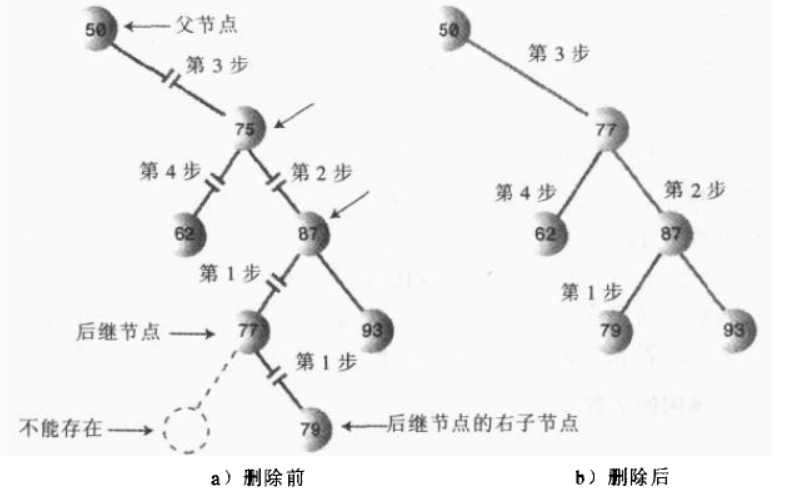

## 为什么使用二叉树？

优点:在树中查找数据项的速度和在有序数组中查找一样快，并且插入数据项和删除数据项的速度也和链表一样。

## 二叉树

如果树中的每个节点最多只能有两个子节点，这样的树就称为“二叉树”

## 二叉搜索树

一个节点的左子节点的关键字值小于这个节点，右子节点的关键字值大于或等于这个父节点

## 中序遍历

```java
private void inOrder(Node localRoot){
    if(localRoot != null){
        inOrder(localRoot.leftNode);
        System.out.println(localRoot.data);
        inOrder(localRoot.rightNode);
    }
}
```

## 前序遍历

```java
private void preOrder(Node localRoot){
    if(loalRoot != null){
        System.out.println(localRoot.data);
        preOrder(localRoot.leftNode);
        preOrder(localRoot.rightNode);
    }
}

```

## 后序遍历

```java
private void preOrder(Node localRoot){
    if(loalRoot != null){
        preOrder(localRoot.leftNode);
        preOrder(localRoot.rightNode);
        System.out.println(localRoot.data);
    }
}
```

## 删除节点

### 该节点是一个叶节点


### 该节点是一个子节点


### 该节点有两个子节点

#### 中序后继

比该节点的关键字值次高的节点就是它的中序后继，简称为该节点的后继

要删除有两个子节点的节点，用它的中序后继来代替该节点


#### 中序后继节点没有自己的子节点


#### 后继节点有子节点

首先，后继节点不会有左子节点




## 满二叉树

1. 如果一个节点有子节点，那么它一定有两个子节点。
2. 叶子节点都在树的最后一层


## 完全二叉树

1. 除了最后一层，其他节点都是满的
2. 最后一层从左到右依次出现
3. 满二叉树也是完全二叉树


## 红黑树

- ,每一个节点都有颜色，不是红色就是黑色
- 根节点总是黑色的
- 如果节点是红色的，则它的子节点必须是黑色的
- 从根到叶节点或者空子节点的每条路径，必须包含相同数目的黑色节点


从根到叶节点的路径上的黑色节点的数目称为`黑色高度`


